```r
library(tidyverse)
```

```
## ── Attaching packages ────────────────────────────────────────────────── tidyverse 1.3.0 ──
```

```
## ✓ ggplot2 3.3.0     ✓ purrr   0.3.3
## ✓ tibble  2.1.3     ✓ dplyr   0.8.5
## ✓ tidyr   1.0.2     ✓ stringr 1.4.0
## ✓ readr   1.3.1     ✓ forcats 0.5.0
```

```
## ── Conflicts ───────────────────────────────────────────────────── tidyverse_conflicts() ──
## x dplyr::filter() masks stats::filter()
## x dplyr::lag()    masks stats::lag()
```

```r
library(ggplot2)

head(diamonds)
```

```
## # A tibble: 6 x 10
##   carat cut       color clarity depth table price     x     y     z
##   <dbl> <ord>     <ord> <ord>   <dbl> <dbl> <int> <dbl> <dbl> <dbl>
## 1 0.23  Ideal     E     SI2      61.5    55   326  3.95  3.98  2.43
## 2 0.21  Premium   E     SI1      59.8    61   326  3.89  3.84  2.31
## 3 0.23  Good      E     VS1      56.9    65   327  4.05  4.07  2.31
## 4 0.290 Premium   I     VS2      62.4    58   334  4.2   4.23  2.63
## 5 0.31  Good      J     SI2      63.3    58   335  4.34  4.35  2.75
## 6 0.24  Very Good J     VVS2     62.8    57   336  3.94  3.96  2.48
```

```r
?diamonds
summary(diamonds)
```

```
##      carat               cut        color        clarity          depth      
##  Min.   :0.2000   Fair     : 1610   D: 6775   SI1    :13065   Min.   :43.00  
##  1st Qu.:0.4000   Good     : 4906   E: 9797   VS2    :12258   1st Qu.:61.00  
##  Median :0.7000   Very Good:12082   F: 9542   SI2    : 9194   Median :61.80  
##  Mean   :0.7979   Premium  :13791   G:11292   VS1    : 8171   Mean   :61.75  
##  3rd Qu.:1.0400   Ideal    :21551   H: 8304   VVS2   : 5066   3rd Qu.:62.50  
##  Max.   :5.0100                     I: 5422   VVS1   : 3655   Max.   :79.00  
##                                     J: 2808   (Other): 2531                  
##      table           price             x                y         
##  Min.   :43.00   Min.   :  326   Min.   : 0.000   Min.   : 0.000  
##  1st Qu.:56.00   1st Qu.:  950   1st Qu.: 4.710   1st Qu.: 4.720  
##  Median :57.00   Median : 2401   Median : 5.700   Median : 5.710  
##  Mean   :57.46   Mean   : 3933   Mean   : 5.731   Mean   : 5.735  
##  3rd Qu.:59.00   3rd Qu.: 5324   3rd Qu.: 6.540   3rd Qu.: 6.540  
##  Max.   :95.00   Max.   :18823   Max.   :10.740   Max.   :58.900  
##                                                                   
##        z         
##  Min.   : 0.000  
##  1st Qu.: 2.910  
##  Median : 3.530  
##  Mean   : 3.539  
##  3rd Qu.: 4.040  
##  Max.   :31.800  
## 
```

```r
# Question 1
ggplot(data = diamonds, mapping = aes(x = x)) +
  geom_histogram(fill = "blue", color = "white") +
  labs(x = "Length In mm") +
  theme_bw()
```

```
## `stat_bin()` using `bins = 30`. Pick better value with `binwidth`.
```

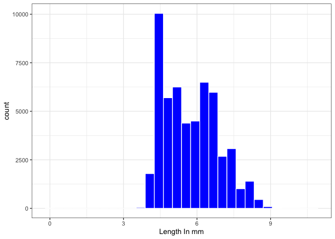<!-- -->

```r
ggplot(data = diamonds, mapping = aes(x = y)) +
  geom_histogram(fill = "blue", color = "white") +
  labs(x = "Width In mm") +
  theme_bw()
```

```
## `stat_bin()` using `bins = 30`. Pick better value with `binwidth`.
```

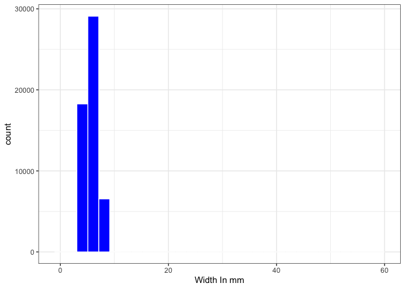<!-- -->

```r
ggplot(data = diamonds, mapping = aes(x = z)) +
  geom_histogram(fill = "blue", color = "white") +
  labs(x = "Depth In mm") +
  theme_bw()
```

```
## `stat_bin()` using `bins = 30`. Pick better value with `binwidth`.
```

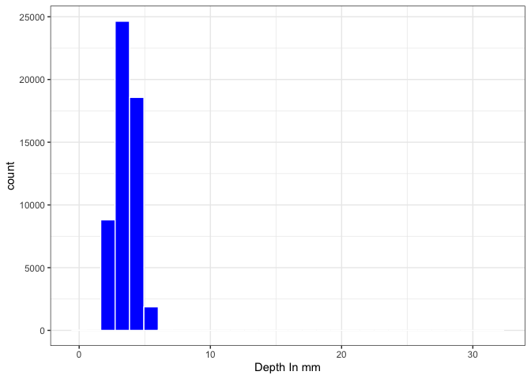<!-- -->

```r
#Question 2
q2 <- ggplot(data = diamonds, mapping = aes(x = price)) +
  geom_density(fill = 'light blue', color = 'blue') +
  theme_bw()

q2
```

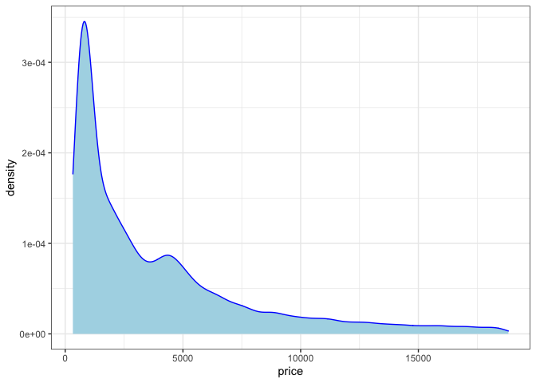<!-- -->

```r
# Question 3
p1 <- ggplot(data = diamonds, mapping = aes(x = price, y = x)) +
  geom_point() +
  geom_abline(slope = 1) +
  scale_x_continuous(trans = 'log10')

p1
```

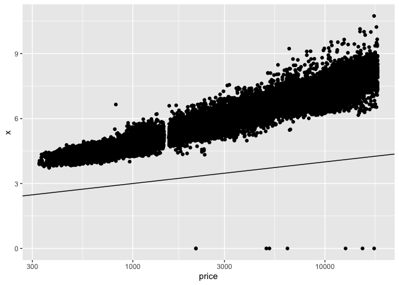<!-- -->

```r
p2 <- ggplot(data = diamonds, mapping = aes(x = price, y = y)) +
  geom_point() +
  geom_abline(slope = 1) +
  scale_x_continuous(trans = 'log10')

p2
```

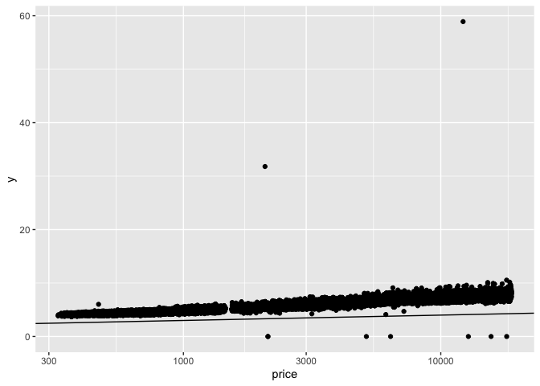<!-- -->

```r
p3 <- ggplot(data = diamonds, mapping = aes(x = price, y = z)) +
  geom_point() +
  geom_abline(slope = 1) +
  scale_x_continuous(trans = 'log10')

p3
```

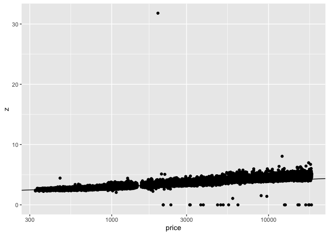<!-- -->

```r
ggplot(data = diamonds, mapping = aes(x = cut, y = z)) +
  geom_violin(fill = 'blue', color = 'blue') +
  labs(y = 'Depth in mm') +
  theme_bw()
```

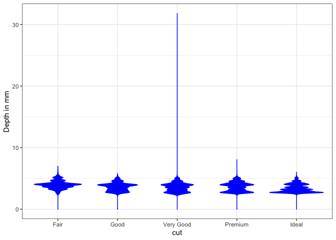<!-- -->

```r
# Question 4
q4 <- diamonds %>% 
  select(price, carat) %>% 
  mutate(
    bin1 = case_when(
      price <= 2500 ~ "<2500",
      price <= 5000 ~ "<5000",
      price <= 7500 ~ "<7500",
      price <= 10000 ~ "<10000",
      price <= 12500 ~ "<12500",
      price <= 15000 ~ "<15000",
      price <= 17500 ~ "<17500",
      price <= 20000 ~ "<20000",
      price <= 225000 ~ "22500",
      TRUE ~ ">22500")
    )
  
  
q4
```

```
## # A tibble: 53,940 x 3
##    price carat bin1 
##    <int> <dbl> <chr>
##  1   326 0.23  <2500
##  2   326 0.21  <2500
##  3   327 0.23  <2500
##  4   334 0.290 <2500
##  5   335 0.31  <2500
##  6   336 0.24  <2500
##  7   336 0.24  <2500
##  8   337 0.26  <2500
##  9   337 0.22  <2500
## 10   338 0.23  <2500
## # … with 53,930 more rows
```

```r
p4 <- ggplot(data = q4, mapping = aes(x = bin1, y = carat)) +
  geom_violin(fill = 'light blue', color = 'blue') +
  labs(x = "Grouped by Price") +
  theme_bw()


str = c("<2500", "<5000", "<7500", "<10000", "<12500", "<15000", "<17500", "<20000", "<22500")
q4$bin1 <- factor(q4$bin1, levels = str)

p4
```

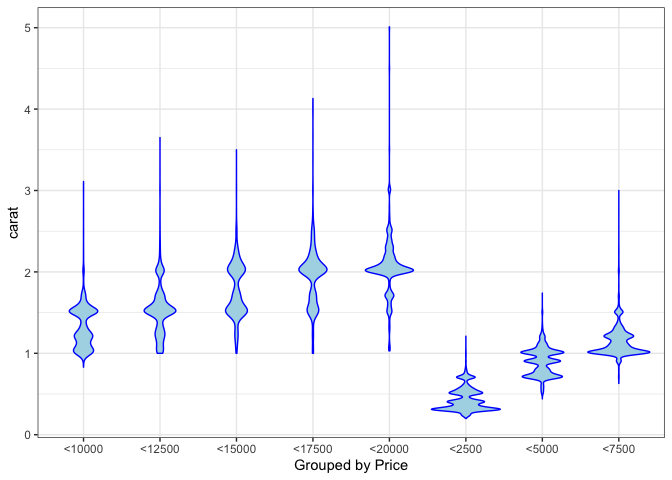<!-- -->

```r
# Question 5

quantile(diamonds$carat)
```

```
##   0%  25%  50%  75% 100% 
## 0.20 0.40 0.70 1.04 5.01
```

```r
q5 <- diamonds %>% 
  select(price, carat) %>% 
  mutate(
    type = case_when(
      carat <= 0.4 ~ "<25",
      carat < 1.04 ~ "normal",
      carat >= 1.04 ~ ">75"
    )
  ) %>% 
  filter(type != 'normal')

q5
```

```
## # A tibble: 28,245 x 3
##    price carat type 
##    <int> <dbl> <chr>
##  1   326 0.23  <25  
##  2   326 0.21  <25  
##  3   327 0.23  <25  
##  4   334 0.290 <25  
##  5   335 0.31  <25  
##  6   336 0.24  <25  
##  7   336 0.24  <25  
##  8   337 0.26  <25  
##  9   337 0.22  <25  
## 10   338 0.23  <25  
## # … with 28,235 more rows
```

```r
p5 <- ggplot(data = q5, mapping = aes(x = type, y = price)) +
  geom_violin(fill = 'light blue', color = "blue") +
  theme_bw()

p5
```

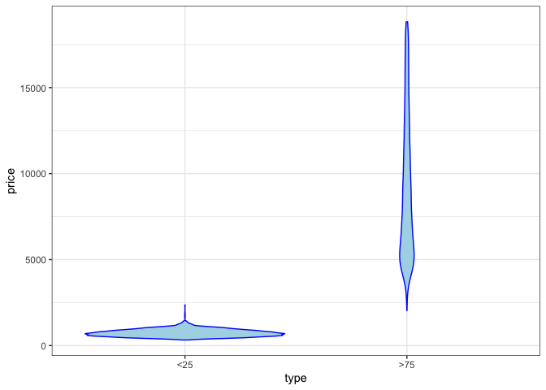<!-- -->

```r
# Question 6
library(lattice)
p6 <- levelplot(diamonds$price ~ diamonds$cut * diamonds$carat, col.regions = rainbow(256), xlab = "Cut", ylab = "Carat")

  
p6
```

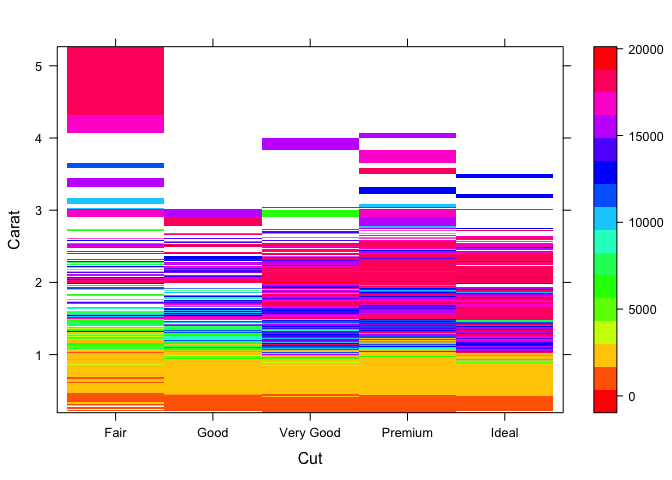<!-- -->
# Report
### X, Y, Z Variables
In comparing the x,y, and z variables of all the diamonds, the length (x) has the highest distrubution amongst the variables. The width and depth of the diamonds seem to be fairly similiar amonsth the diamonds

### Distribution of Price
The distribution of price is pretty much what we would expect. Most diamonds are found to be less than or equal to 5,000 dollars. Once the price gets above 10,000 dollars the amount goes way down. This is what we would expect, a gradual decline of toal diamonds as the price gets higher. What is unusual is what happens around the 4,000 dollar range.

### Most Important Variable Related to Price
I found that depth (z) is the most important variable in relation to price, because as the depth goes up, so does the price of the diamond. It is the closest to a 1:1 ratio. In relation to cut, depth is fairly consistent in regards to how the diamond is graded. It allows for lower quality diamonds to be more expensive because often the depth is good enough in the diamond enough for the price to go up even if the cut isnt above good.

### Carat Partitioned by Price
The graphic made for this shows that as the carat goes up, so does the price of the diamond. This is what we would expect from the data.

### Large Diamonds vs. Small Diamonds
You can see by the graphic that the bottom 25% of diamonds based on carat size is consitantly priced below 2,500 dollars. Also, the top 75% of diamonds based on carat size has varying prices that are much higher. This is what we would exect from the data, the larger the data, the higher the price is.

### Cut, Carat, and Price
This graphic shows that as the cut goes from Fairly Good to Ideal and the carat size increases the price goes up as well. What is interesting is that the most expensive diamonds are in the fair category but with the highest carat size. This means that the largest factor in price isnt cut but carat size. The larger the diamond the more expensice it is.
