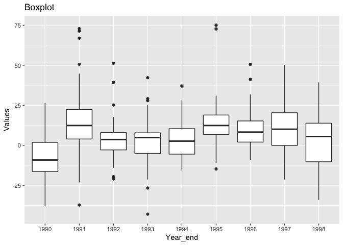
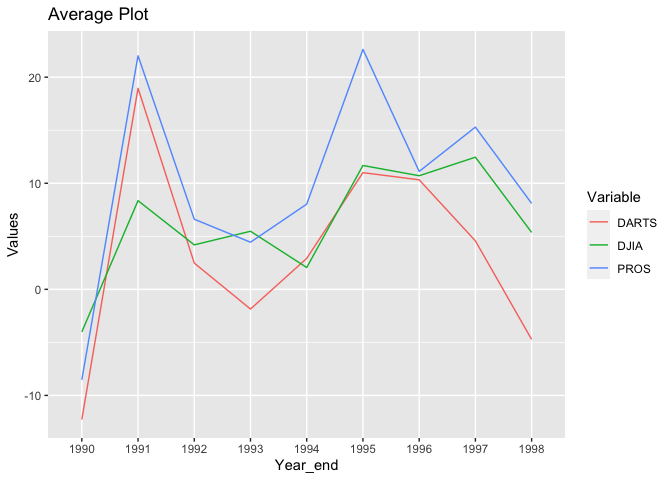
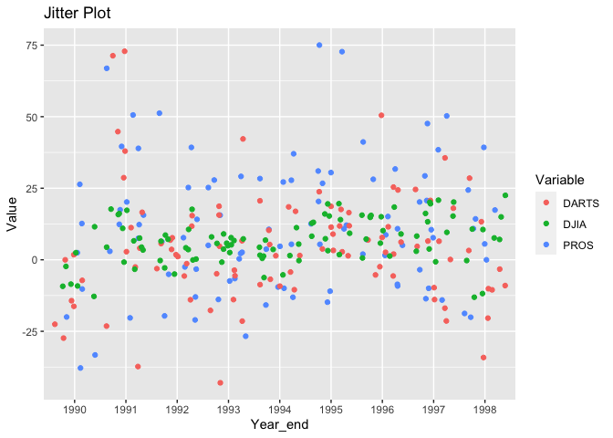
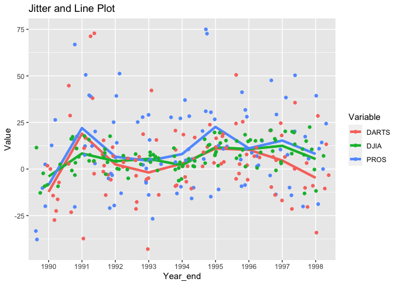
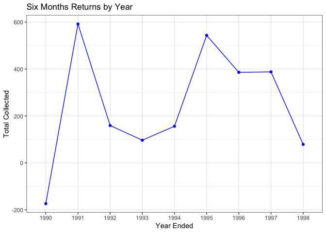

## Loading Data & Plots

```r
library(tidyverse)
```

```
## ── Attaching packages ────────────────────────────────────────────────── tidyverse 1.3.0 ──
```

```
## ✓ ggplot2 3.3.0     ✓ purrr   0.3.3
## ✓ tibble  2.1.3     ✓ dplyr   0.8.5
## ✓ tidyr   1.0.2     ✓ stringr 1.4.0
## ✓ readr   1.3.1     ✓ forcats 0.5.0
```

```
## ── Conflicts ───────────────────────────────────────────────────── tidyverse_conflicts() ──
## x dplyr::filter() masks stats::filter()
## x dplyr::lag()    masks stats::lag()
```

```r
library(haven)
library(readr)
library(readxl)
library(downloader)


data_rds  <- read_rds(url("https://github.com/WJC-Data-Science/DTS350/raw/master/Dart_Expert_Dow_6month_anova/Dart_Expert_Dow_6month_anova.RDS"))

data_dta  <- read_dta("https://github.com/WJC-Data-Science/DTS350/raw/master/Dart_Expert_Dow_6month_anova/Dart_Expert_Dow_6month_anova.dta")

data_cvs  <- read_csv("https://raw.githubusercontent.com/WJC-Data-Science/DTS350/master/Dart_Expert_Dow_6month_anova/Dart_Expert_Dow_6month_anova.csv")
```

```
## Parsed with column specification:
## cols(
##   contest_period = col_character(),
##   variable = col_character(),
##   value = col_double()
## )
```

```r
sav <- tempfile()
download("https://github.com/WJC-Data-Science/DTS350/raw/master/Dart_Expert_Dow_6month_anova/Dart_Expert_Dow_6month_anova.sav", sav, mode = "wb")
dfsav <- read_sav(sav)


xlsx <- tempfile()
download("https://github.com/WJC-Data-Science/DTS350/raw/master/Dart_Expert_Dow_6month_anova/Dart_Expert_Dow_6month_anova.xlsx",xlsx, mode = "wb")
dfxlsx <- read_xlsx(xlsx)


all_equal(data_dta, dfsav, convert = TRUE)
```

```
## Warning: Column `contest_period` has different attributes on LHS and RHS of join
```

```
## Warning: Column `variable` has different attributes on LHS and RHS of join
```

```
## Warning: Column `value` has different attributes on LHS and RHS of join
```

```
## [1] TRUE
```

```r
all_equal(data_dta, dfxlsx, convert = TRUE)
```

```
## Warning: Column `contest_period` has different attributes on LHS and RHS of join
```

```
## Warning: Column `variable` has different attributes on LHS and RHS of join
```

```
## Warning: Column `value` has different attributes on LHS and RHS of join
```

```
## [1] TRUE
```

```r
all_equal(data_dta, data_rds, convert = TRUE)
```

```
## Warning: Column `contest_period` has different attributes on LHS and RHS of join
```

```
## Warning: Column `variable` has different attributes on LHS and RHS of join
```

```
## Warning: Column `value` has different attributes on LHS and RHS of join
```

```
## [1] TRUE
```

```r
all_equal(data_rds, dfsav, convert = TRUE)
```

```
## Warning: Column `contest_period` has different attributes on LHS and RHS of join
```

```
## Warning: Column `variable` has different attributes on LHS and RHS of join
```

```
## Warning: Column `value` has different attributes on LHS and RHS of join
```

```
## [1] TRUE
```

```r
all_equal(data_rds, dfxlsx, convert = TRUE)
```

```
## [1] TRUE
```

```r
all_equal(dfxlsx, dfsav, convert = TRUE)
```

```
## Warning: Column `contest_period` has different attributes on LHS and RHS of join
```

```
## Warning: Column `variable` has different attributes on LHS and RHS of join
```

```
## Warning: Column `value` has different attributes on LHS and RHS of join
```

```
## [1] TRUE
```

```r
view(data_rds)

data_dta2 <- data_dta %>% 
  separate(contest_period, into = c("Month/Month", "Year_end"), sep = -4)

head(data_dta2)
```

```
## # A tibble: 6 x 4
##   `Month/Month`   Year_end variable value
##   <chr>           <chr>    <chr>    <dbl>
## 1 January-June    1990     PROS      12.7
## 2 February-July   1990     PROS      26.4
## 3 March-August    1990     PROS       2.5
## 4 April-September 1990     PROS     -20  
## 5 May-October     1990     PROS     -37.8
## 6 June-November   1990     PROS     -33.3
```

```r
data_dta3 <- data_dta %>% 
  separate(contest_period, into = c("Month/Month", "Year_end"), sep = -4) %>% 
  group_by(Year_end, variable) %>% 
  summarise(Average = mean(value, na.rm = TRUE))

data_dta3
```

```
## # A tibble: 27 x 3
## # Groups:   Year_end [9]
##    Year_end variable Average
##    <chr>    <chr>      <dbl>
##  1 1990     DARTS     -12.3 
##  2 1990     DJIA       -4.01
##  3 1990     PROS       -8.53
##  4 1991     DARTS      19.0 
##  5 1991     DJIA        8.36
##  6 1991     PROS       22.0 
##  7 1992     DARTS       2.48
##  8 1992     DJIA        4.19
##  9 1992     PROS        6.61
## 10 1993     DARTS      -1.86
## # … with 17 more rows
```

```r
## Graphics
plot1 <- ggplot(data = data_dta2) +
  geom_boxplot(mapping = aes(x = Year_end, y = value)) +
  labs(x = "Year_end", y = "Values", color = "Variable", title = "Boxplot")

plot1
```

<!-- -->

```r
plot2 <- ggplot(data = data_dta3) +
  geom_line(mapping = aes(x = Year_end, y = Average, color = variable, group = variable)) +
  labs(x = "Year_end", y = "Values", color = "Variable", title = "Average Plot")

plot2
```

<!-- -->

```r
plot3 <- ggplot(data = data_dta2) + 
  geom_jitter(mapping = aes(x = Year_end, y = value, color = variable))+
  labs(x = "Year_end",
       y = "Value",
       color = "Variable",
       title = "Jitter Plot")

plot3
```

<!-- -->

```r
plot4 <- ggplot(data = data_dta3) +
  geom_line( mapping = aes(group = variable, x = Year_end , y = Average, color  = variable), size = 1.5)+
  geom_jitter( data = data_dta2, mapping = aes(x = Year_end, y = value, color = variable))+
  labs(x = "Year_end",
       y = "Value",
       color = "Variable",
       title = "Jitter and Line Plot")

plot4
```

<!-- -->
- Plot 1 is a boxplot that is determined by year and value of return. Based on the plot, it appears that the data was most spread out in the early and late 1990s.

- Plot 2 shows the average collected by year and grouped by the variables. The three variables have similiar trends, but DART decreased from 1996 to 1997 while the other two increased

- Plot 3 is a jitter plot that shows the data by year and grouped by the variables. It shows that the variable DIJA is the most consistent

- Plot 4 is a combination of Plot 2 and Plot 3


## Tidy Data & Saving RDS

```r
data_dta4 <- data_dta2 %>% 
  separate("Month/Month", into = c("month_begin", "month_end"), sep = "-")

data_dta4
```

```
## # A tibble: 300 x 5
##    month_begin   month_end Year_end variable value
##    <chr>         <chr>     <chr>    <chr>    <dbl>
##  1 January       June      1990     PROS      12.7
##  2 February      July      1990     PROS      26.4
##  3 March         August    1990     PROS       2.5
##  4 April         September 1990     PROS     -20  
##  5 May           October   1990     PROS     -37.8
##  6 June          November  1990     PROS     -33.3
##  7 July          December  1990     PROS     -10.2
##  8 August1990    January   1991     PROS     -20.3
##  9 September1990 February  1991     PROS      38.9
## 10 October1990   March     1991     PROS      20.2
## # … with 290 more rows
```

```r
saveRDS(data_dta4,"data_dta4.rds")
```
## 6 Month Returns Based on Year

```r
data_dta5 <- data_dta4 %>% 
  group_by(Year_end) %>% 
  summarise(sum_collected = sum(value, na.rm = TRUE))

data_dta5
```

```
## # A tibble: 9 x 2
##   Year_end sum_collected
##   <chr>            <dbl>
## 1 1990            -174. 
## 2 1991             592. 
## 3 1992             159. 
## 4 1993              96.7
## 5 1994             156. 
## 6 1995             544. 
## 7 1996             386. 
## 8 1997             388. 
## 9 1998              78.7
```

```r
plot6 <- ggplot(data = data_dta5) +
  geom_point(mapping = aes(x = Year_end, y = sum_collected), color = 'blue') +
  geom_path(mapping = aes(x = Year_end, y = sum_collected, group = 1), color = 'blue') +
  labs(x = 'Year Ended',
       y = 'Total Collected',
       title = 'Six Months Returns by Year') +
  theme_bw()

plot6
```

<!-- -->
- Plot 6 shows the sums for the 6 month collection periods when grouped by year. It shows the total collections dipped from 1992 to 1994 and again after 1997.

## Final Table

```r
data_dta6 <- data_dta4 %>% 
  mutate(month_end = replace(month_end, month_end == "Dec.", "December")) %>%
  mutate(month_end = replace(month_end, month_end == "Febuary", "February")) %>%
  select(-c(month_begin)) %>%
  filter(variable == "DJIA") %>%
  pivot_wider(names_from = Year_end, values_from = value) %>%
  select(-c(variable)) %>%
  mutate(month_end = replace(month_end, month_end == "January", 1)) %>%
  mutate(month_end = replace(month_end, month_end == "February", 2)) %>%
  mutate(month_end = replace(month_end, month_end == "March", 3)) %>%
  mutate(month_end = replace(month_end, month_end == "April", 4)) %>%
  mutate(month_end = replace(month_end, month_end == "May", 5)) %>%
  mutate(month_end = replace(month_end, month_end == "June", 6)) %>%
  mutate(month_end = replace(month_end, month_end == "July", 7)) %>%
  mutate(month_end = replace(month_end, month_end == "August", 8)) %>%
  mutate(month_end = replace(month_end, month_end == "September", 9)) %>%
  mutate(month_end = replace(month_end, month_end == "October", 10)) %>%
  mutate(month_end = replace(month_end, month_end == "November", 11)) %>%
  mutate(month_end = replace(month_end, month_end == "December", 12)) 

data_dta6
```

```
## # A tibble: 12 x 10
##    month_end `1990` `1991` `1992` `1993` `1994` `1995` `1996` `1997` `1998`
##    <chr>      <dbl>  <dbl>  <dbl>  <dbl>  <dbl>  <dbl>  <dbl>  <dbl>  <dbl>
##  1 6            2.5   17.7    3.6    7.7   -6.2   16     10.2   16.2   15  
##  2 7           11.5    7.6    4.2    3.7   -5.3   19.6    1.3   20.8    7.1
##  3 8           -2.3    4.4   -0.3    7.3    1.5   15.3    0.6    8.3  -13.1
##  4 9           -9.2    3.4   -0.1    5.2    4.4   14      5.8   20.2  -11.8
##  5 10          -8.5    4.4   -5      5.7    6.9    8.2    7.2    3     NA  
##  6 11         -12.8   -3.3   -2.8    4.9   -0.3   13.1   15.1    3.8   NA  
##  7 12          -9.3    6.6    0.2    8      3.6    9.3   15.5   -0.7   NA  
##  8 1           NA     -0.8    6.5   -0.8   11.2    1.8   15     19.6   -0.3
##  9 2           NA     11      8.6    2.5    5.5    3.2   15.6   20.1   10.7
## 10 3           NA     15.8    7.2    9      1.6    7.3   18.4    9.6    7.6
## 11 4           NA     16.2   10.6    5.8    0.5   12.8   14.8   15.3   22.5
## 12 5           NA     17.3   17.6    6.7    1.3   19.5    9     13.3   10.6
```

```r
data_dta6$month_end <- as.integer(data_dta6$month_end)  

data_dta6 <- data_dta6[order(data_dta6$month_end),]  

data_dta6  
```

```
## # A tibble: 12 x 10
##    month_end `1990` `1991` `1992` `1993` `1994` `1995` `1996` `1997` `1998`
##        <int>  <dbl>  <dbl>  <dbl>  <dbl>  <dbl>  <dbl>  <dbl>  <dbl>  <dbl>
##  1         1   NA     -0.8    6.5   -0.8   11.2    1.8   15     19.6   -0.3
##  2         2   NA     11      8.6    2.5    5.5    3.2   15.6   20.1   10.7
##  3         3   NA     15.8    7.2    9      1.6    7.3   18.4    9.6    7.6
##  4         4   NA     16.2   10.6    5.8    0.5   12.8   14.8   15.3   22.5
##  5         5   NA     17.3   17.6    6.7    1.3   19.5    9     13.3   10.6
##  6         6    2.5   17.7    3.6    7.7   -6.2   16     10.2   16.2   15  
##  7         7   11.5    7.6    4.2    3.7   -5.3   19.6    1.3   20.8    7.1
##  8         8   -2.3    4.4   -0.3    7.3    1.5   15.3    0.6    8.3  -13.1
##  9         9   -9.2    3.4   -0.1    5.2    4.4   14      5.8   20.2  -11.8
## 10        10   -8.5    4.4   -5      5.7    6.9    8.2    7.2    3     NA  
## 11        11  -12.8   -3.3   -2.8    4.9   -0.3   13.1   15.1    3.8   NA  
## 12        12   -9.3    6.6    0.2    8      3.6    9.3   15.5   -0.7   NA
```

```r
data_dta7 <- data_dta6 %>%
  mutate(month_end = replace(month_end, month_end == 1,"January")) %>%
  mutate(month_end = replace(month_end, month_end == 2,"February")) %>%
  mutate(month_end = replace(month_end, month_end == 3,"March")) %>%
  mutate(month_end = replace(month_end, month_end == 4,"April")) %>%
  mutate(month_end = replace(month_end, month_end == 5,"May")) %>%
  mutate(month_end = replace(month_end, month_end == 6,"June")) %>%
  mutate(month_end = replace(month_end, month_end == 7,"July")) %>%
  mutate(month_end = replace(month_end, month_end == 8,"August")) %>%
  mutate(month_end = replace(month_end, month_end == 9,"September")) %>%
  mutate(month_end = replace(month_end, month_end == 10,"October")) %>%
  mutate(month_end = replace(month_end, month_end == 11,"November")) %>%
  mutate(month_end = replace(month_end, month_end == 12,"December"))  

head(data_dta7, 12) 
```

```
## # A tibble: 12 x 10
##    month_end `1990` `1991` `1992` `1993` `1994` `1995` `1996` `1997` `1998`
##    <chr>      <dbl>  <dbl>  <dbl>  <dbl>  <dbl>  <dbl>  <dbl>  <dbl>  <dbl>
##  1 January     NA     -0.8    6.5   -0.8   11.2    1.8   15     19.6   -0.3
##  2 February    NA     11      8.6    2.5    5.5    3.2   15.6   20.1   10.7
##  3 March       NA     15.8    7.2    9      1.6    7.3   18.4    9.6    7.6
##  4 April       NA     16.2   10.6    5.8    0.5   12.8   14.8   15.3   22.5
##  5 May         NA     17.3   17.6    6.7    1.3   19.5    9     13.3   10.6
##  6 June         2.5   17.7    3.6    7.7   -6.2   16     10.2   16.2   15  
##  7 July        11.5    7.6    4.2    3.7   -5.3   19.6    1.3   20.8    7.1
##  8 August      -2.3    4.4   -0.3    7.3    1.5   15.3    0.6    8.3  -13.1
##  9 September   -9.2    3.4   -0.1    5.2    4.4   14      5.8   20.2  -11.8
## 10 October     -8.5    4.4   -5      5.7    6.9    8.2    7.2    3     NA  
## 11 November   -12.8   -3.3   -2.8    4.9   -0.3   13.1   15.1    3.8   NA  
## 12 December    -9.3    6.6    0.2    8      3.6    9.3   15.5   -0.7   NA
```

