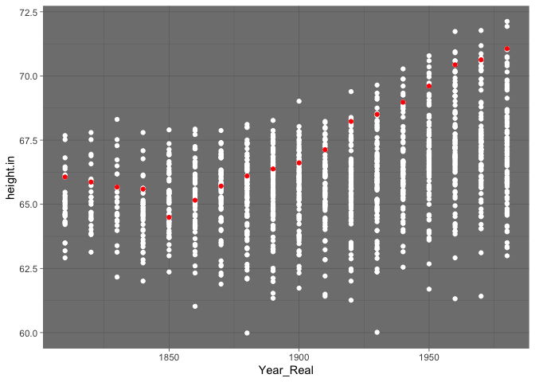
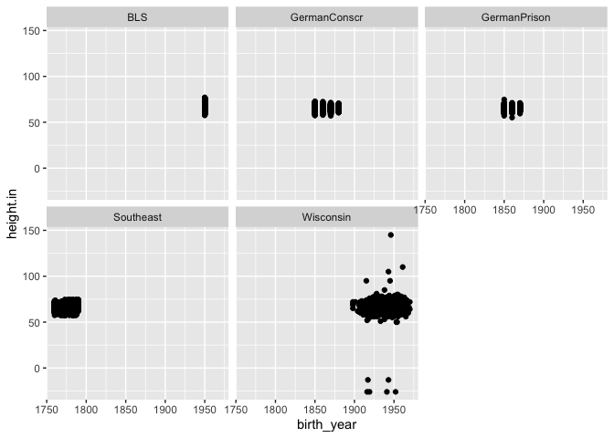
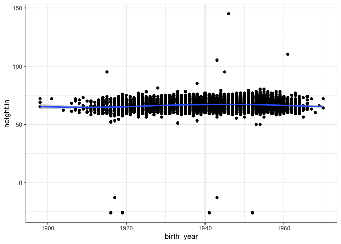
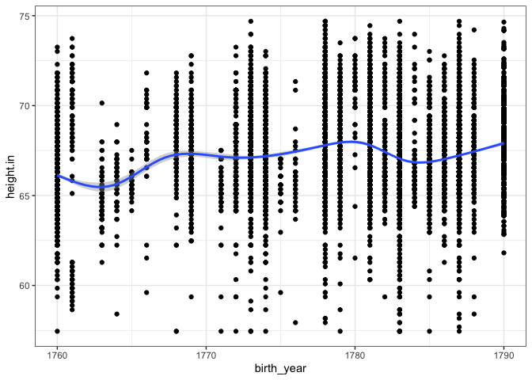
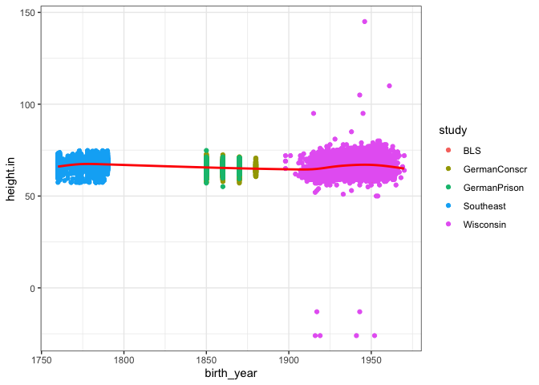

## Loading Data

```r
## Case Study 7

library(tidyverse)
```

```
## ── Attaching packages ────────────────────────────────────────────────── tidyverse 1.3.0 ──
```

```
## ✓ ggplot2 3.3.0     ✓ purrr   0.3.3
## ✓ tibble  2.1.3     ✓ dplyr   0.8.5
## ✓ tidyr   1.0.2     ✓ stringr 1.4.0
## ✓ readr   1.3.1     ✓ forcats 0.5.0
```

```
## ── Conflicts ───────────────────────────────────────────────────── tidyverse_conflicts() ──
## x dplyr::filter() masks stats::filter()
## x dplyr::lag()    masks stats::lag()
```

```r
library(haven)
library(readr)
library(readxl)
library(downloader)
library(measurements)

xlsx1 <- tempfile()
download("https://raw.githubusercontent.com/WJC-Data-Science/DTS350/master/Height.xlsx", xlsx1, mode = 'wb')

ww_df <- read_xlsx(xlsx1, skip = 2)
ww_df
```

```
## # A tibble: 306 x 203
##     Code `Continent, Reg… `1800` `1801` `1802` `1803` `1804` `1805` `1806`
##    <dbl> <chr>            <lgl>  <lgl>  <lgl>  <lgl>  <lgl>  <lgl>  <lgl> 
##  1   150 Europe           NA     NA     NA     NA     NA     NA     NA    
##  2   155 Western Europe   NA     NA     NA     NA     NA     NA     NA    
##  3    40 Austria          NA     NA     NA     NA     NA     NA     NA    
##  4    56 Belgium          NA     NA     NA     NA     NA     NA     NA    
##  5   280 Federal Republi… NA     NA     NA     NA     NA     NA     NA    
##  6   250 France           NA     NA     NA     NA     NA     NA     NA    
##  7   278 German Democrat… NA     NA     NA     NA     NA     NA     NA    
##  8   276 Germany          NA     NA     NA     NA     NA     NA     NA    
##  9   438 Liechtenstein    NA     NA     NA     NA     NA     NA     NA    
## 10   442 Luxembourg       NA     NA     NA     NA     NA     NA     NA    
## # … with 296 more rows, and 194 more variables: `1807` <lgl>, `1808` <lgl>,
## #   `1809` <lgl>, `1810` <dbl>, `1811` <lgl>, `1812` <lgl>, `1813` <lgl>,
## #   `1814` <lgl>, `1815` <lgl>, `1816` <lgl>, `1817` <lgl>, `1818` <lgl>,
## #   `1819` <lgl>, `1820` <dbl>, `1821` <lgl>, `1822` <lgl>, `1823` <lgl>,
## #   `1824` <lgl>, `1825` <lgl>, `1826` <lgl>, `1827` <lgl>, `1828` <lgl>,
## #   `1829` <lgl>, `1830` <dbl>, `1831` <lgl>, `1832` <lgl>, `1833` <lgl>,
## #   `1834` <lgl>, `1835` <lgl>, `1836` <lgl>, `1837` <lgl>, `1838` <lgl>,
## #   `1839` <lgl>, `1840` <dbl>, `1841` <lgl>, `1842` <lgl>, `1843` <lgl>,
## #   `1844` <lgl>, `1845` <lgl>, `1846` <lgl>, `1847` <lgl>, `1848` <lgl>,
## #   `1849` <lgl>, `1850` <dbl>, `1851` <lgl>, `1852` <lgl>, `1853` <lgl>,
## #   `1854` <lgl>, `1855` <lgl>, `1856` <lgl>, `1857` <lgl>, `1858` <lgl>,
## #   `1859` <lgl>, `1860` <dbl>, `1861` <lgl>, `1862` <lgl>, `1863` <lgl>,
## #   `1864` <lgl>, `1865` <lgl>, `1866` <lgl>, `1867` <lgl>, `1868` <lgl>,
## #   `1869` <lgl>, `1870` <dbl>, `1871` <lgl>, `1872` <lgl>, `1873` <lgl>,
## #   `1874` <lgl>, `1875` <lgl>, `1876` <lgl>, `1877` <lgl>, `1878` <lgl>,
## #   `1879` <lgl>, `1880` <dbl>, `1881` <lgl>, `1882` <lgl>, `1883` <lgl>,
## #   `1884` <lgl>, `1885` <lgl>, `1886` <lgl>, `1887` <lgl>, `1888` <lgl>,
## #   `1889` <lgl>, `1890` <dbl>, `1891` <lgl>, `1892` <lgl>, `1893` <lgl>,
## #   `1894` <lgl>, `1895` <lgl>, `1896` <lgl>, `1897` <lgl>, `1898` <lgl>,
## #   `1899` <lgl>, `1900` <dbl>, `1901` <lgl>, `1902` <lgl>, `1903` <lgl>,
## #   `1904` <lgl>, `1905` <lgl>, `1906` <lgl>, …
```

```r
view(ww_df)

tidy_ww <- ww_df %>% 
  pivot_longer(c(`1800`:`2011`), names_to = 'Year_Real', values_to = 'height.cm')

tidy_ww
```

```
## # A tibble: 61,506 x 4
##     Code `Continent, Region, Country` Year_Real height.cm
##    <dbl> <chr>                        <chr>         <dbl>
##  1   150 Europe                       1800             NA
##  2   150 Europe                       1801             NA
##  3   150 Europe                       1802             NA
##  4   150 Europe                       1803             NA
##  5   150 Europe                       1804             NA
##  6   150 Europe                       1805             NA
##  7   150 Europe                       1806             NA
##  8   150 Europe                       1807             NA
##  9   150 Europe                       1808             NA
## 10   150 Europe                       1809             NA
## # … with 61,496 more rows
```

```r
tidy_ww2 <- tidy_ww %>%
  separate(Year_Real, into = c("century", "decade", "year"), sep = c(-2,-1), remove = FALSE) 
tidy_ww2
```

```
## # A tibble: 61,506 x 7
##     Code `Continent, Region, Country` Year_Real century decade year  height.cm
##    <dbl> <chr>                        <chr>     <chr>   <chr>  <chr>     <dbl>
##  1   150 Europe                       1800      18      0      0            NA
##  2   150 Europe                       1801      18      0      1            NA
##  3   150 Europe                       1802      18      0      2            NA
##  4   150 Europe                       1803      18      0      3            NA
##  5   150 Europe                       1804      18      0      4            NA
##  6   150 Europe                       1805      18      0      5            NA
##  7   150 Europe                       1806      18      0      6            NA
##  8   150 Europe                       1807      18      0      7            NA
##  9   150 Europe                       1808      18      0      8            NA
## 10   150 Europe                       1809      18      0      9            NA
## # … with 61,496 more rows
```

```r
tidy_ww2$Year_Real <- as.numeric(tidy_ww2$Year_Real)
tidy_ww2$century <- as.numeric(tidy_ww2$century)
tidy_ww2$decade <- as.numeric(tidy_ww2$decade)
tidy_ww2$year <- as.numeric(tidy_ww2$year)

ww_inches <- tidy_ww2 %>% 
  mutate(height.in = conv_unit(height.cm, 'cm', 'inch'))

ww_inches
```

```
## # A tibble: 61,506 x 8
##     Code `Continent, Region,… Year_Real century decade  year height.cm height.in
##    <dbl> <chr>                    <dbl>   <dbl>  <dbl> <dbl>     <dbl>     <dbl>
##  1   150 Europe                    1800      18      0     0        NA        NA
##  2   150 Europe                    1801      18      0     1        NA        NA
##  3   150 Europe                    1802      18      0     2        NA        NA
##  4   150 Europe                    1803      18      0     3        NA        NA
##  5   150 Europe                    1804      18      0     4        NA        NA
##  6   150 Europe                    1805      18      0     5        NA        NA
##  7   150 Europe                    1806      18      0     6        NA        NA
##  8   150 Europe                    1807      18      0     7        NA        NA
##  9   150 Europe                    1808      18      0     8        NA        NA
## 10   150 Europe                    1809      18      0     9        NA        NA
## # … with 61,496 more rows
```

```r
ww_inches2 <- na.omit(ww_inches)

ww_inches2
```

```
## # A tibble: 1,311 x 8
##     Code `Continent, Region,… Year_Real century decade  year height.cm height.in
##    <dbl> <chr>                    <dbl>   <dbl>  <dbl> <dbl>     <dbl>     <dbl>
##  1    40 Austria                   1820      18      2     0      164.      64.4
##  2    40 Austria                   1830      18      3     0      163.      64.3
##  3    40 Austria                   1840      18      4     0      165.      64.9
##  4    40 Austria                   1850      18      5     0      166.      65.3
##  5    40 Austria                   1860      18      6     0      166.      65.5
##  6    40 Austria                   1870      18      7     0      167.      65.8
##  7    40 Austria                   1880      18      8     0      168.      66.0
##  8    40 Austria                   1890      18      9     0      168.      66.3
##  9    40 Austria                   1900      19      0     0      169.      66.5
## 10    40 Austria                   1910      19      1     0      169.      66.5
## # … with 1,301 more rows
```

```r
tubheight <- ww_inches2[order(ww_inches2$Year_Real),]

head(tubheight)
```

```
## # A tibble: 6 x 8
##    Code `Continent, Region, … Year_Real century decade  year height.cm height.in
##   <dbl> <chr>                     <dbl>   <dbl>  <dbl> <dbl>     <dbl>     <dbl>
## 1    56 Belgium                    1810      18      1     0      163.      64.2
## 2   280 Federal Republic of …      1810      18      1     0      168.      66.1
## 3   250 France                     1810      18      1     0      164.      64.5
## 4   276 Germany                    1810      18      1     0      168.      66.1
## 5   528 Netherlands                1810      18      1     0      166       65.4
## 6   246 Finland                    1810      18      1     0      172.      67.7
```

```r
###
height_dta2 <- read_dta("https://github.com/WJC-Data-Science/DTS350/raw/master/germanprison.dta")
height_dta2
```

```
## # A tibble: 477 x 4
##      age  bdec co    height
##    <dbl> <dbl> <chr>  <dbl>
##  1    22  1850 de       156
##  2    26  1850 de       168
##  3    26  1850 de       161
##  4    25  1850 de       159
##  5    26  1850 de       175
##  6    24  1850 de       173
##  7    24  1850 de       173
##  8    24  1850 de       172
##  9    24  1850 de       161
## 10    21  1850 de       175
## # … with 467 more rows
```

```r
height_dta <- read_dta("https://raw.githubusercontent.com/WJC-Data-Science/DTS350/master/germanconscr.dta")
height_dta
```

```
## # A tibble: 1,382 x 5
##    gebger      bdec height   age co   
##    <chr>      <dbl>  <dbl> <dbl> <chr>
##  1 brueckenau  1850   170.    21 de-se
##  2 brueckenau  1850   156.    21 de-se
##  3 brueckenau  1850   172.    21 de-se
##  4 brueckenau  1850   168.    21 de-se
##  5 brueckenau  1850   167.    21 de-se
##  6 brueckenau  1850   160.    21 de-se
##  7 brueckenau  1850   161.    21 de-se
##  8 brueckenau  1850   162.    21 de-se
##  9 brueckenau  1850   162.    21 de-se
## 10 brueckenau  1850   170.    21 de-se
## # … with 1,372 more rows
```

```r
height_csv <- read_csv("https://raw.githubusercontent.com/hadley/r4ds/master/data/heights.csv")
```

```
## Parsed with column specification:
## cols(
##   earn = col_double(),
##   height = col_double(),
##   sex = col_character(),
##   ed = col_double(),
##   age = col_double(),
##   race = col_character()
## )
```

```r
height_csv
```

```
## # A tibble: 1,192 x 6
##     earn height sex       ed   age race    
##    <dbl>  <dbl> <chr>  <dbl> <dbl> <chr>   
##  1 50000   74.4 male      16    45 white   
##  2 60000   65.5 female    16    58 white   
##  3 30000   63.6 female    16    29 white   
##  4 50000   63.1 female    16    91 other   
##  5 51000   63.4 female    17    39 white   
##  6  9000   64.4 female    15    26 white   
##  7 29000   61.7 female    12    49 white   
##  8 32000   72.7 male      17    46 white   
##  9  2000   72.0 male      15    21 hispanic
## 10 27000   72.2 male      12    26 white   
## # … with 1,182 more rows
```

```r
sav1 <- tempfile()
download("https://www.ssc.wisc.edu/nsfh/wave3/NSFH3%20Apr%202005%20release/main05022005.sav", sav1, mode = 'wb')
height_sav <- read_sav(sav1)
height_sav  
```

```
## # A tibble: 7,277 x 2,317
##    CASE  TYPE  CASEID CASENUM     DOBM  DOBY    RT1A1    RT1A2    RT1A3    RT1B1
##    <chr> <chr> <chr>    <dbl> <dbl+lb> <dbl> <dbl+lb> <dbl+lb> <dbl+lb> <dbl+lb>
##  1 00008 S     00008S       8 10 [OCT…    15  5       NA       NA        3      
##  2 00058 R     00058R      58  2 [FEB…    40  3        0 [NON…  1        2      
##  3 00058 S     00058S      58  2 [FEB…    40  0 [NON… NA       NA        0 [NON…
##  4 00079 S     00079S      79 11 [NOV…    12  7       NA       NA        0 [NON…
##  5 00082 S     00082S      82  7 [JUL…    61  4       NA        1        4      
##  6 00120 R     00120R     120 10 [OCT…    54 14        0 [NON…  0 [NON…  7      
##  7 00120 S     00120S     120 11 [NOV…    54  1       10        2        0 [NON…
##  8 00133 R     00133R     133 10 [OCT…    51 18        0 [NON…  3       18      
##  9 00146 R     00146R     146  4 [APR…    52  1        0 [NON… NA        2      
## 10 00146 S     00146S     146  4 [APR…    51  0 [NON… 20       NA        0 [NON…
## # … with 7,267 more rows, and 2,307 more variables: RT1B2 <dbl+lbl>,
## #   RT1B3 <dbl+lbl>, RT1C1 <dbl+lbl>, RT1C2 <dbl+lbl>, RT1C3 <dbl+lbl>,
## #   RT1D1 <dbl+lbl>, RT1D2 <dbl+lbl>, RT1D3 <dbl+lbl>, RT1E1 <dbl+lbl>,
## #   RT1E2 <dbl+lbl>, RT1E3 <dbl+lbl>, RT1F1 <dbl+lbl>, RT1F2 <dbl+lbl>,
## #   RT1F3 <dbl+lbl>, RT1G1 <dbl+lbl>, RT1G2 <dbl+lbl>, RT1G3 <dbl+lbl>,
## #   RT1H1 <dbl+lbl>, RT1H2 <dbl+lbl>, RT1H3 <dbl+lbl>, RT1I1 <dbl+lbl>,
## #   RT1I2 <dbl+lbl>, RT1I3 <dbl+lbl>, RT204 <dbl+lbl>, RE1 <dbl+lbl>,
## #   RE3 <dbl>, RE4 <dbl>, RT205A <dbl+lbl>, RT205B <dbl+lbl>, RT205C <dbl+lbl>,
## #   RT205D <dbl+lbl>, RT205E <dbl+lbl>, RT205F <dbl+lbl>, RT205G <dbl>,
## #   RE5 <dbl+lbl>, RE6 <dbl>, RE7 <dbl>, RE8 <dbl+lbl>, RE10 <dbl>, RE11 <dbl>,
## #   RE12 <dbl+lbl>, RE14 <dbl>, RE15 <dbl>, RE16 <dbl+lbl>, RE19 <dbl+lbl>,
## #   RE22 <dbl+lbl>, RE25 <dbl+lbl>, RE28 <dbl+lbl>, RE31 <dbl+lbl>, RE32 <dbl>,
## #   RE35 <dbl+lbl>, RE36 <chr>, RE37 <dbl+lbl>, RE38 <dbl+lbl>, RE39 <dbl+lbl>,
## #   RE40 <dbl+lbl>, RE41 <dbl>, RE44 <dbl+lbl>, RE45 <dbl+lbl>, RE46 <dbl+lbl>,
## #   RE47 <dbl+lbl>, RE48 <dbl+lbl>, RE51 <dbl+lbl>, RE50 <dbl+lbl>,
## #   RE52 <dbl+lbl>, RE55 <dbl+lbl>, RF1 <dbl+lbl>, RF2 <dbl+lbl>,
## #   RF3 <dbl+lbl>, RF4 <dbl+lbl>, RF5 <dbl+lbl>, RF6 <dbl+lbl>, RF7 <dbl+lbl>,
## #   RF8 <dbl+lbl>, RF9 <dbl+lbl>, RF10 <dbl+lbl>, RF11 <dbl+lbl>,
## #   RF12 <dbl+lbl>, RF13 <dbl+lbl>, RF14 <dbl+lbl>, RF15 <dbl+lbl>,
## #   RF16 <dbl+lbl>, RF17 <dbl+lbl>, RF18 <dbl+lbl>, RF19 <dbl+lbl>,
## #   RF20 <dbl+lbl>, RF21 <dbl+lbl>, RF22 <dbl+lbl>, RF23 <dbl+lbl>,
## #   RF24M <dbl+lbl>, RF24Y <dbl+lbl>, RF24F <dbl>, RF25 <dbl+lbl>,
## #   RF26 <dbl+lbl>, RF27 <dbl+lbl>, RF28 <dbl+lbl>, RF29 <dbl+lbl>,
## #   RF30 <dbl+lbl>, RF31 <dbl+lbl>, RF32 <dbl+lbl>, …
```

```r
library(foreign)

temp <- tempfile()
download("https://raw.githubusercontent.com/WJC-Data-Science/DTS350/master/Heights_south-east/B6090.DBF", temp, mode = 'wb')
height_dbf <- read.dbf(temp)

height_dbf
```

```
##      RECNO   SJ REG     GEBGER SL GEBJZ      GEWERBE BERUF STD_ELT F  Z V S
## 1     3669 1773   2        lau  0   173         <NA>     0    <NA> 6  1 0 0
## 2     3670 1773   2         ma  0   173         <NA>     0    <NA> 5  8 0 0
## 3     3671 1773   2        bre  0   175         <NA>     0    <NA> 5 11 0 0
## 4     3672 1773   2        neu  0   173         <NA>     0    <NA> 5 11 0 0
## 5     3673 1773   2        alz  0   173         <NA>     0    <NA> 6  0 2 0
## 6     3674 1773   2         hd  0   173         <NA>     0    <NA> 5  6 0 0
## 7     3675 1773   2        alz  0   175         <NA>     0    <NA> 6  1 2 0
## 8     3676 1773   2        neu  0   174         <NA>     0    <NA> 6  0 2 0
## 9     3677 1773   2         hd  0   175         <NA>     0    <NA> 5  9 3 0
## 10    3678 1773   2         ma  1   175         <NA>     0    <NA> 5  6 0 0
## 11    3679 1773   2         hd  0   173         <NA>     0    <NA> 5 10 3 0
## 12    3680 1773   2        neu  0   175         <NA>     0    <NA> 5  7 0 0
## 13    3685 1773   2        ger  0   172         <NA>     0    <NA> 5  9 3 0
## 14    3686 1773   2        lae  0   173         <NA>     0    <NA> 5  9 2 0
## 15    3687 1773   2        alz  0   173         <NA>     0    <NA> 5 10 0 0
## 16    3689 1773   2        alz  0   174         <NA>     0    <NA> 5 11 2 0
## 17    3690 1773   2        alz  0   174         <NA>     0    <NA> 5 11 2 0
## 18    3691 1773   2        mos  0   174          sn#     1    <NA> 5  9 1 0
## 19    3692 1773   2        ger  0   173         <NA>     0    <NA> 5  8 2 0
## 20    3693 1773   2        mos  0   174         <NA>     0    <NA> 5 10 3 0
## 21    3694 1773   2        lau  0   174       schum#     1    <NA> 5  8 3 0
## 22    3695 1773   2        alz  0   174         <NA>     0    <NA> 6  1 0 0
## 23    3696 1773   2         hd  0   174          sn#     0    <NA> 5  8 1 0
## 24    3697 1773   2        alz  0   174         <NA>     0    <NA> 5  9 3 0
## 25    3698 1773   2        alz  0   174         <NA>     0    <NA> 6  1 0 0
## 26    3699 1773   2        alz  0   174       schum#     1    <NA> 5 10 0 0
## 27    3700 1773   2        box  0   174       schum#     1    <NA> 5 10 0 0
## 28    3701 1773   2        bre  0   174          we#     1    <NA> 6  0 2 0
## 29    3702 1773   2        alz  0   174         <NA>     0    <NA> 5  9 0 0
## 30    3703 1773   2        alz  0   175         <NA>     0    <NA> 5  9 0 0
## 31    3704 1773   2         hd  0   174         <NA>     0    <NA> 5  8 2 0
## 32    3705 1773   2        neu  0   174         <NA>     0    <NA> 5 11 2 0
## 33    3706 1773   2        alz  0   175         <NA>     0    <NA> 5 11 2 0
## 34    3707 1773   2        mos  0   174         <NA>     0    <NA> 5 10 3 0
## 35    3708 1773   2        neu  0   174         <NA>     0    <NA> 5 10 3 0
## 36    3709 1773   2        lin  0   175         <NA>     0    <NA> 5 10 0 0
## 37    3710 1773   2        bre  0   175          sn#     1    <NA> 6  0 0 0
## 38    3711 1773   2         hd  0   175         <NA>     0    <NA> 6  1 0 0
## 39    3712 1773   2        lad  0   175         <NA>     0    <NA> 5 10 0 0
## 40    3713 1773   3        dur  0   175       seiler     1    <NA> 5 10 0 0
## 41    3714 1773   2        mos  0   175          wa#     1    <NA> 5 10 0 0
## 42    3715 1773   2        lei  0   174         <NA>     0    <NA> 6  0 1 0
## 43    3716 1773   2        alz  0   175         <NA>     0    <NA> 5  9 3 0
## 44    3717 1773   2        neu  0   174         <NA>     0    <NA> 5  8 2 0
## 45    3718 1773   2         hd  0   175         <NA>     0    <NA> 6  2 0 0
## 46    3719 1773   2        neu  0   175         <NA>     0    <NA> 5  9 0 0
## 47    3720 1773   2        bre  0   174          wa#     1    <NA> 5 11 0 0
## 48    3721 1773   2        neu  0   175         <NA>     0    <NA> 5 11 2 0
## 49    3722 1773   2        alz  0   175          we#     1    <NA> 5 10 0 0
## 50    3723 1773   2        fra  0   175         <NA>     0    <NA> 6  0 0 0
## 51    3724 1773   2        neu  0   175         <NA>     0    <NA> 6  1 0 0
## 52    3725 1773   2        neu  0   175         <NA>     0    <NA> 5 10 0 0
## 53    3726 1773   2        box  0   175         <NA>     0    <NA> 5  9 0 0
## 54    3727 1773   2        neu  0   175         <NA>     0    <NA> 5 11 0 0
## 55    3728 1773   2        lei  0   175     k\x81fer     1    <NA> 5 11 0 0
## 56    3729 1773   2        lad  0   175         <NA>     0    <NA> 5 10 0 0
## 57    3730 1773   2        neu  0   175         <NA>     0    <NA> 5 10 0 0
## 58    3731 1773   2        neu  0   175         <NA>     0    <NA> 5  9 0 0
## 59    3732 1773   2        neu  0   175         <NA>     0    <NA> 5 10 0 0
## 60    3733 1773   2        neu  0   175         <NA>     0    <NA> 5  9 2 0
## 61    3734 1773   2        alz  0   175         <NA>     0    <NA> 5  9 0 0
## 62    3735 1773   2        alz  0   175         <NA>     0    <NA> 5  8 2 0
## 63    3736 1773   1     j\x81l  0   175         <NA>     0    <NA> 5 10 0 0
## 64    3737 1773   1     j\x81l  0   174         <NA>     0    <NA> 5 10 3 0
## 65    3738 1773   2        neu  0   175         <NA>     0    <NA> 5  8 2 0
## 66    3739 1773   2        neu  0   175         <NA>     0    <NA> 5  9 0 0
## 67    3740 1773   2        neu  0   175         <NA>     0    <NA> 5  8 3 0
## 68    3741 1773   2        alz  0   174         <NA>     0    <NA> 5  8 2 0
## 69    3742 1773   2        mos  0   175         <NA>     0    <NA> 5  9 1 0
## 70    3743 1773   2        neu  0   175         <NA>     0    <NA> 5  8 2 0
## 71    3744 1773   2 neckarsulm  0   174         <NA>     0    <NA> 5  8 3 0
## 72    3745 1773   3  degenfeld  0   175         <NA>     0    <NA> 5  6 0 0
## 73    3747 1773   2        dil  0   173         <NA>     0    <NA> 5 10 0 0
## 74    3748 1773   2        neb  0   173         <NA>     0    <NA> 5  9 2 0
## 75    3749 1773   2        dil  0   175          we#     1    <NA> 5 10 0 0
## 76    3750 1773   2        neu  0   175         <NA>     0    <NA> 6  0 2 0
## 77    3751 1773   2         hd  0   174         <NA>     0    <NA> 5  7 2 0
## 78    3752 1773   2        neu  0   174         <NA>     0    <NA> 5  8 1 0
## 79    3753 1773   2         ma  0   175         <NA>     0    <NA> 5  5 0 0
## 80    3754 1773   2        dil  0   173         <NA>     0    <NA> 5  9 0 0
## 81    3755 1773   2        bre  0   175          we#     1    <NA> 5  8 0 0
## 82    3756 1773   3     g\x81n  0   173       b\x84#     1    <NA> 5  8 0 0
## 83    3757 1773   2        neu  0   173         <NA>     0    <NA> 6  0 0 0
## 84    3758 1773   2        lin  0   172         <NA>     0    <NA> 5  9 3 0
## 85    3760 1773   2        lau  0   175         <NA>     0    <NA> 5  8 0 0
## 86    3761 1773   2        lau  0   173         <NA>     0    <NA> 6  0 2 0
## 87    3762 1773   2     g\x81n  0   173         <NA>     0    <NA> 6  0 2 0
## 88    3763 1773   2        opp  0   173         <NA>     0    <NA> 5 10 2 0
## 89    3764 1773   3     g\x81n  0   174       schum#     1    <NA> 5 11 2 0
## 90    3765 1773   2        lau  0   173          sn#     1    <NA> 6  0 0 0
## 91    3766 1773   2        lin  0   173         <NA>     0    <NA> 5  8 0 0
## 92    3767 1773   2        dil  0   174         <NA>     0    <NA> 5  9 2 0
## 93    3768 1773   2         ma  0   174         <NA>     0    <NA> 5  8 2 0
## 94    3769 1773   2         ma  0   174         <NA>     0    <NA> 5  9 2 0
## 95    3770 1773   2        neu  0   174         <NA>     0    <NA> 5  9 0 0
## 96    3771 1773   3        nab  0   175          sm#     1    <NA> 5 10 2 0
## 97    3772 1773   2        neu  0   175         <NA>     0    <NA> 5  9 2 0
## 98    3773 1773   2        lin  0   175          br#     1    <NA> 5 10 0 0
## 99    3774 1773   2        lin  0   175       schum#     1    <NA> 5  8 2 0
## 100   3775 1773   2         hd  0   174       m\x81#     1    <NA> 5 10 0 0
## 101   3776 1773   2         ma  0   175         <NA>     0    <NA> 5 11 2 0
## 102   3777 1773   2        lau  0   174          wa#     1    <NA> 5  9 3 0
## 103   3778 1773   2        lau  0   175         <NA>     0    <NA> 5 10 1 0
## 104   3779 1773   2         ma  0   175          sn#     1    <NA> 6  0 1 0
## 105   3780 1773   2        lau  0   175         <NA>     0    <NA> 5  8 0 0
## 106   3781 1773   2        mos  0   175          we#     0    <NA> 5  8 0 0
## 107   3782 1773   2         hd  0   175         <NA>     0    <NA> 5  9 3 0
## 108   3784 1773   2        dil  0   175          we#     1    <NA> 5 10 1 0
## 109   3785 1773   2         hd  0   175         <NA>     0    <NA> 5 11 0 0
## 110   3786 1773   2         hd  1   175        schl#     1    <NA> 5 10 0 0
## 111   3787 1773   2         ma  1   175          ma#     1    <NA> 5  9 0 0
## 112   3788 1773   3     g\x81n  0   175          we#     0    <NA> 5  9 1 0
## 113   3789 1773   3     g\x81n  0   175         <NA>     0    <NA> 5  8 3 0
## 114   3790 1773   2         ma  1   175            1     1    <NA> 5  9 3 0
## 115   3791 1773   2        dil  0   175         <NA>     0    <NA> 5 11 0 0
## 116   3792 1773   3     g\x81n  0   175         <NA>     0    <NA> 5 10 3 0
## 117   3793 1773   2        lau  0   175          we#     1    <NA> 5  9 0 0
## 118   3794 1773   2        opp  0   175         <NA>     0    <NA> 5  9 0 0
## 119   3795 1773   2        lei  0   175          we#     1    <NA> 5  9 3 0
## 120   3796 1773   2        neu  0   175         <NA>     0    <NA> 5  8 0 0
## 121   3797 1773   3     g\x81n  0   175         <NA>     0    <NA> 5  8 2 0
## 122   3798 1773   3        nab  0   175          sr#     1    <NA> 5 11 2 0
## 123   3799 1773   2         ma  1   174          sn#     1    <NA> 5  9 0 0
## 124   3800 1773   3        lin  0   175         <NA>     0    <NA> 5  9 0 0
## 125   3801 1773   2        lin  0   175         <NA>     0    <NA> 5  8 3 0
## 126   3802 1773   2        box  0   175     spengler     1    <NA> 5  9 1 0
## 127   3803 1773   1   hengersb  0   175         <NA>     0    <NA> 5 11 2 0
## 128   3804 1773   1        ost  0   175          sn#     1    <NA> 5  9 1 0
## 129   3805 1773   2        lin  0   175         <NA>     0    <NA> 5 10 1 0
## 130   3806 1773   2        ger  0   175          we#     0    <NA> 5 10 1 0
## 131   3807 1773   3     g\x81n  0   175       hafner     0    <NA> 5  9 1 0
## 132   3808 1773   2        sim  0   174         <NA>     0    <NA> 5 11 0 0
## 133   3809 1773   2        mos  0   174         <NA>     0    <NA> 5 11 0 0
## 134   3810 1773   2        neu  0   174          we#     1    <NA> 6  0 1 0
## 135   3811 1773   2        box  0   174          sn#     1    <NA> 5  9 2 0
## 136   3812 1773   2         ma  1   174         <NA>     0    <NA> 5 10 2 0
## 137   3813 1773   2         ma  1   174         <NA>     0    <NA> 5  9 2 0
## 138   3814 1773   2        lau  0   174          sn#     1    <NA> 5  9 0 0
## 139   3815 1773   2         hd  0   174         <NA>     0    <NA> 5  8 0 0
## 140   3816 1773   3     h\x94c  0   173          zi#     1    <NA> 6  2 2 0
## 141   3818 1773   2         hd  0   173         <NA>     0    <NA> 5 10 3 0
## 142   3820 1773   2        lin  0   173         <NA>     0    <NA> 5 11 0 0
## 143   3821 1773   2        neu  0   173         <NA>     0    <NA> 5 11 0 0
## 144   3822 1773   2        ger  0   173         <NA>     0    <NA> 5 11 1 0
## 145   3823 1773   3        neb  0   172         <NA>     0    <NA> 5 11 3 0
## 146   3824 1773   2        mos  0   174     k\x81fer     1    <NA> 5 10 3 0
## 147   3826 1773   2         ma  0   175         <NA>     0    <NA> 5 11 3 0
## 148   3827 1773   2        neu  0   172         <NA>     0    <NA> 6  0 2 0
## 149   3828 1773   2        kre  0   174     k\x81fer     1    <NA> 5 11 0 0
## 150   3829 1773   2        kre  0   174         <NA>     0    <NA> 6  0 2 0
## 151   3830 1773   2        opp  0   174          sn#     1    <NA> 6  0 2 0
## 152   3831 1773   2      strom  0   173         <NA>     0    <NA> 6  0 1 0
## 153   3832 1773   2         hd  0   173         <NA>     0    <NA> 5 11 0 0
## 154   3833 1773   2        lau  0   175         <NA>     0    <NA> 6  0 2 0
## 155   3834 1773   2        lau  0   174         <NA>     0    <NA> 5 11 2 0
## 156   3835 1773   2        mos  0   174         <NA>     0    <NA> 6  2 2 0
## 157   3836 1773   2         hd  0   173         <NA>     0    <NA> 6  0 1 0
## 158   3837 1773   2        lau  0   175          we#     1    <NA> 6  1 0 0
## 159   3838 1773   2         mz  0   174          we#     1    <NA> 6  2 3 0
## 160   3839 1773   2        mos  0   174         mez#     1    <NA> 5  1 3 0
## 161   3840 1773   2         ma  1   174         <NA>     0    <NA> 5 11 2 0
## 162   3841 1773   2        mos  0   174         mez#     1    <NA> 6  0 1 0
## 163   3842 1773   2        alz  0   173         <NA>     0    <NA> 6  0 1 0
## 164   3843 1773   2        zwe  0   173         <NA>     0    <NA> 5 11 2 0
## 165   3844 1773   2        alz  0   175         <NA>     0    <NA> 6  1 2 0
## 166   3845 1773   2         ma  0   174         <NA>     0    <NA> 6  0 1 0
## 167   3846 1773   2        lau  0   175         <NA>     0    <NA> 6  1 2 0
## 168   3847 1773   2        lau  0   174         <NA>     0    <NA> 6  0 2 0
## 169   3848 1773   2        mos  0   175         mez#     0    <NA> 6  2 0 0
## 170   3849 1773   2        mos  0   174          sm#     1    <NA> 6  0 1 0
## 171   3850 1773   2        lau  0   175     k\x81fer     1    <NA> 6  1 0 0
## 172   3851 1773   2        ozb  0   173         <NA>     0    <NA> 6  3 0 0
## 173   3852 1773   2        alz  0   174       schum#     1    <NA> 6  0 0 0
## 174   3853 1773   2        dil  0   175         <NA>     0    <NA> 6  0 1 0
## 175   3854 1773   2        alz  0   172          we#     1    <NA> 6  1 2 0
## 176   3855 1773   2        kre  0   175         <NA>     0    <NA> 6  1 2 0
## 177   3856 1773   2        ger  0   174         <NA>     0    <NA> 6  0 3 0
## 178   3857 1773   2        alz  0   175         <NA>     0    <NA> 6  1 1 0
## 179   3858 1773   2        lau  0   175       schum#     1    <NA> 6  1 1 0
## 180   3859 1773   2         ma  1   174          sn#     1    <NA> 6  2 0 0
## 181   3860 1773   2         hd  0   175         <NA>     0    <NA> 6  0 0 0
## 182   3861 1773   2         hd  0   175         <NA>     0    <NA> 5 11 3 0
## 183   3862 1773   2         hd  0   175         <NA>     0    <NA> 6  0 0 0
## 184   3863 1773   2        lad  0   175         <NA>     0    <NA> 6  0 3 0
## 185   3864 1773   2        lau  0   175          ma#     1    <NA> 6  0 3 0
## 186   3865 1773   2        neu  0   175         <NA>     0    <NA> 6  1 2 0
## 187   3866 1773   2      strom  0   175         <NA>     0    <NA> 6  1 2 0
## 188   3867 1773   2        mos  0   174       schum#     1    <NA> 6  2 3 0
## 189   3868 1773   2        ozb  0   175          zi#     1    <NA> 6  0 3 0
## 190   3869 1773   2        lau  0   173         <NA>     0    <NA> 6  1 3 0
## 191   3870 1773   2   waldnutz  0   174          we#     0    <NA> 5 11 2 0
## 192   3871 1773   2        bre  0   175         <NA>     0    <NA> 5 11 3 0
## 193   3872 1773   2        opp  0   173         <NA>     0    <NA> 6  2 2 0
## 194   3873 1773   2         hd  0   172         <NA>     0    <NA> 5 11 2 0
## 195   3874 1773   2        kre  0   174      barbier     1    <NA> 5  5 2 0
## 196   3875 1773   2        alz  0   173         <NA>     0    <NA> 6  2 2 0
## 197   3877 1773   2         ma  0   175         <NA>     0    <NA> 6  2 2 0
## 198   3878 1773   2        alz  0   173         <NA>     0    <NA> 5  7 0 0
## 199   3879 1773   2        lau  0   174         <NA>     0    <NA> 5  7 3 0
## 200   3881 1773   2        alz  0   173          zi#     1    <NA> 5  9 0 0
## 201   3882 1773   2        neu  0   173         <NA>     0    <NA> 6  0 0 0
## 202   3883 1773   2        neu  0   173         <NA>     0    <NA> 5  9 0 0
## 203   3884 1773   2        neu  0   173         <NA>     0    <NA> 5 10 2 0
## 204   3885 1773   2         ma  1   174      fischer     1    <NA> 6  0 2 0
## 205   3886 1773   2        neu  0   174         <NA>     0    <NA> 5 10 0 0
## 206   3887 1773   2        opp  0   174         <NA>     0    <NA> 5 10 0 0
## 207   3888 1773   2        alz  0   173         <NA>     0    <NA> 5 10 2 0
## 208   3889 1773   2         hd  0   174         mez#     1    <NA> 5  9 1 0
## 209   3890 1773   2        kre  0   173          ma#     1    <NA> 5  9 1 0
## 210   3891 1773   2        mos  0   174       schum#     1    <NA> 5 10 1 0
## 211   3892 1773   2        alz  0   172          ma#     1    <NA> 6  0 0 0
## 212   3893 1773   2        alz  0   174     k\x81fer     1    <NA> 5 10 0 0
## 213   3894 1773   2        lau  0   174          sn#     1    <NA> 5  8 2 0
## 214   3895 1773   2        alz  0   174         <NA>     0    <NA> 5 11 1 0
## 215   3896 1773   2        lau  0   174          we#     1    <NA> 5  9 0 0
## 216   3897 1773   2        neu  0   174         <NA>     0    <NA> 5 10 0 0
## 217   3898 1773   2        sim  0   174          sm#     1    <NA> 5 10 2 0
## 218   3899 1773   2        lau  0   174         <NA>     0    <NA> 5  9 2 0
## 219   3900 1773   2         hd  0   174         <NA>     0    <NA> 5  8 3 0
## 220   3901 1773   2        alz  0   174      friseur     1    <NA> 5 11 0 0
## 221   3902 1773   2        neu  0   174         <NA>     0    <NA> 5  8 0 0
## 222   3903 1773   2        sim  0   175      sattler     1    <NA> 5 10 2 0
## 223   3904 1773   2        alz  0   174         <NA>     0    <NA> 5 11 0 0
## 224   3905 1773   2        mos  0   174         <NA>     0    <NA> 5  9 3 0
## 225   3906 1773   2        lad  0   175         <NA>     0    <NA> 5 11 0 0
## 226   3907 1773   2        kre  0   175         <NA>     0    <NA> 5 10 2 0
## 227   3908 1773   2        alz  0   175       schum#     1    <NA> 6  1 3 0
## 228   3909 1773   2        alz  0   175       schum#     1    <NA> 5 10 0 0
## 229   3910 1773   2        lau  0   174         <NA>     0    <NA> 5 10 1 0
## 230   3911 1773   2        sim  0   175       schum#     1    <NA> 5 11 1 0
## 231   3912 1773   2         hd  0   174         <NA>     0    <NA> 5 11 0 0
## 232   3913 1773   2        kre  0   175          we#     1    <NA> 5  9 0 0
## 233   3914 1773   2    oggersh  0   174         <NA>     0    <NA> 5 10 2 0
## 234   3915 1773   2        lad  0   175       schum#     1    <NA> 5 10 0 0
## 235   3916 1773   2        war  0   175         <NA>     0    <NA> 5  9 3 0
## 236   3917 1773   2     friesh  0   175         <NA>     0    <NA> 5 11 1 0
## 237   3918 1773   2        ger  0   174         <NA>     0    <NA> 5  9 0 0
## 238   3919 1773   2        ger  0   174         <NA>     0    <NA> 5  7 3 0
## 239   3920 1773   2        kre  0   174         <NA>     0    <NA> 5 10 0 0
## 240   3921 1773   2         hd  0   175         <NA>     0    <NA> 5  9 1 0
## 241   3922 1773   2        lau  0   175         <NA>     0    <NA> 5  9 2 0
## 242   3923 1773   2        war  0   175         <NA>     0    <NA> 5 11 0 0
## 243   3924 1773   2        zwe  0   175   steinhauer     1    <NA> 5 10 2 0
## 244   3925 1773   2         hd  0   175          we#     1    <NA> 5  9 2 0
## 245   3926 1773   2        kre  0   175          we#     1    <NA> 5 10 1 0
## 246   3927 1773   2        lad  0   175         <NA>     0    <NA> 5 10 0 0
## 247   3928 1773   2        alz  0   175         <NA>     0    <NA> 5 10 0 0
## 248   3929 1773   2      strom  0   175         <NA>     0    <NA> 5  9 1 0
## 249   3930 1773   2        ger  0   175         <NA>     0    <NA> 5  9 0 0
## 250   3931 1773   2         hd  0   175         <NA>     0    <NA> 5 10 0 0
## 251   3932 1773   2         hd  0   175         <NA>     0    <NA> 5  8 2 0
## 252   3933 1773   2        lad  0   175         <NA>     0    <NA> 5  9 2 0
## 253   3934 1773   2        sim  0   174         <NA>     0    <NA> 6  0 0 0
## 254   3935 1773   2        sim  0   175         <NA>     0    <NA> 5  8 0 0
## 255   3936 1773   2        alz  0   174       hufsm#     1    <NA> 5 11 2 0
## 256   3937 1773   2         hd  0   175         <NA>     0    <NA> 5  8 1 0
## 257   3938 1773   2        alz  0   175         <NA>     0    <NA> 5 10 2 0
## 258   3940 1773   2        lei  0   174         <NA>     0    <NA> 6  3 1 0
## 259   3941 1773   2         ma  0   174         <NA>     0    <NA> 5  9 2 0
## 260   3942 1773   2         hd  0   175      chirurg     1    <NA> 5  7 2 0
## 261   3943 1773   2         hd  0   172         <NA>     0    <NA> 6  3 0 0
## 262   3944 1773   2         hd  0   174         <NA>     0    <NA> 6  0 2 0
## 263   3945 1773   2         ma  1   174         <NA>     0    <NA> 5  8 0 0
## 264   3946 1773   2         ma  1   175         <NA>     0    <NA> 6  0 1 0
## 265   3947 1773   2        lei  0   175         <NA>     0    <NA> 6  0 3 0
## 266   3948 1773   2        opp  0   175         <NA>     0    <NA> 5  7 0 0
## 267   3949 1773   2        neu  0   175         <NA>     0    <NA> 5 10 2 0
## 268   3950 1773   2        mos  0   174          zi#     1    <NA> 5 11 2 0
## 269   3951 1773   2        neu  0   172         <NA>     0    <NA> 6  1 2 0
## 270   3953 1773   2         hd  0   173         <NA>     0    <NA> 6  0 0 0
## 271   3954 1773   2         hd  0   173         <NA>     0    <NA> 6  0 0 0
## 272   3955 1773   2        alz  0   174         <NA>     0    <NA> 5 11 0 0
## 273   3956 1773   2        alz  0   173          we#     0    <NA> 5 10 0 0
## 274   3957 1773   2        kre  0   172         <NA>     0    <NA> 6  0 0 0
## 275   3958 1773   2         hd  0   173          wa#     1    <NA> 6  0 3 0
## 276   3959 1773   2        mos  0   173       hufsm#     1    <NA> 6  0 0 0
## 277   3960 1773   2         hd  0   174         <NA>     0    <NA> 6  1 0 0
## 278   3961 1773   2        kre  0   172         <NA>     0    <NA> 5  9 2 0
## 279   3962 1773   2        neu  0   174         <NA>     0    <NA> 5 10 0 0
## 280   3963 1773   2        ozb  0   174       schum#     1    <NA> 5 10 0 0
## 281   3965 1773   2        mos  0   174         <NA>     0    <NA> 5 11 1 0
## 282   3966 1773   2        alz  0   174          sn#     1    <NA> 6  0 0 0
## 283   3967 1773   2         hd  0   174         <NA>     0    <NA> 6  0 0 0
## 284   3968 1773   2         hd  0   174         <NA>     0    <NA> 5 11 0 0
## 285   3969 1773   2         hd  0   174          we#     1    <NA> 6  0 0 0
## 286   3970 1773   2        opp  0   174         <NA>     0    <NA> 5 10 2 0
## 287   3971 1773   2        lad  0   175          we#     0    <NA> 6  0 0 0
## 288   3972 1773   2         hd  0   174       b\x84#     0    <NA> 5 10 2 0
## 289   3973 1773   2        dil  0   174         <NA>     0    <NA> 6  0 0 0
## 290   3974 1773   2        ger  0   174         <NA>     0    <NA> 6  0 0 0
## 291   3975 1773   2        bre  0   173         <NA>     0    <NA> 6  0 0 0
## 292   3976 1773   2        neu  0   172         <NA>     0    <NA> 5 11 2 0
## 293   3977 1773   2         mz  0   174         <NA>     0    <NA> 6  0 1 0
## 294   3978 1773   2        mos  0   173         <NA>     0    <NA> 5 11 2 0
## 295   3979 1773   2         hd  0   174     k\x81fer     0    <NA> 6  0 1 0
## 296   3980 1773   2         hd  0   174         <NA>     0    <NA> 5 11 2 0
## 297   3981 1773   2        mos  0   174         <NA>     0    <NA> 6  0 2 0
## 298   3982 1773   2        neu  0   175         <NA>     0    <NA> 5 11 0 0
## 299   3983 1773   2        neu  0   174         <NA>     0    <NA> 6  1 0 0
## 300   3984 1773   2        bre  0   174         <NA>     0    <NA> 5 10 2 0
## 301   3985 1773   2        alz  0   174         <NA>     0    <NA> 6  0 2 0
## 302   3986 1773   2         hd  0   175         <NA>     0    <NA> 6  1 2 0
## 303   3987 1773   2        neu  0   175         <NA>     0    <NA> 6  2 0 0
## 304   3988 1773   2         hd  0   174         <NA>     0    <NA> 6  0 2 0
## 305   3989 1773   2        alz  0   175         <NA>     0    <NA> 6  1 0 0
## 306   3990 1773   2         hd  0   174         <NA>     0    <NA> 5 11 2 0
## 307   3991 1773   2        lei  0   175         mez#     0    <NA> 6  2 0 0
## 308   3992 1773   2        neu  0   174         <NA>     0    <NA> 6  0 0 0
## 309   3993 1773   2        lei  0   175         <NA>     0    <NA> 6  0 1 0
## 310   3994 1773   2        neu  0   175         <NA>     0    <NA> 5 11 2 0
## 311   3995 1773   2        neu  0   175          wa#     1    <NA> 6  2 1 0
## 312   3996 1773   2        kre  0   175         <NA>     0    <NA> 6  1 0 0
## 313   3997 1773   2        lei  0   175         <NA>     0    <NA> 6  0 2 0
## 314   3998 1773   2        bre  0   175       hafner     1    <NA> 6  2 0 0
## 315   3999 1773   2         ma  1   175         <NA>     0    <NA> 6  0 1 0
## 316   4000 1773   2        war  0   174         <NA>     0    <NA> 6  0 2 0
## 317   4001 1773   2 freinsheim  0   175         <NA>     0    <NA> 6  1 2 0
## 318   4002 1773   2        kre  0   175     k\x81fer     1    <NA> 5 10 2 0
## 319   4003 1773   2        mos  0   175         mez#     1    <NA> 5 10 2 0
## 320   4004 1773   2         ma  0   175   korbmacher     1    <NA> 5 11 2 0
## 321   4005 1773   2        alz  0   174         <NA>     0    <NA> 6  2 0 0
## 322   4006 1773   2        ger  0   175         <NA>     0    <NA> 6  1 0 0
## 323   4008 1773   1         ma  2   174            1     1    <NA> 6  2 2 0
## 324   4010 1773   2        lau  0   174         <NA>     0    <NA> 6  0 3 0
## 325   4011 1773   2        dil  0   174          sn#     1    <NA> 6  1 2 0
## 326   4013 1773   2        lau  0   175         <NA>     0    <NA> 6  2 2 0
## 327   4014 1773   2         ma  0   174         <NA>     0    <NA> 5 11 0 0
## 328   4015 1773   2        alz  0   174         <NA>     0    <NA> 6  0 2 0
## 329   4016 1773   2        lin  0   175         <NA>     0    <NA> 5  8 2 0
## 330   4019 1773   2        mos  0   175          zi#     1    <NA> 6  0 0 0
## 331   4020 1773   2        fra  0   173         <NA>     1    <NA> 6  1 3 0
## 332   4021 1773   2         hd  0   174          we#     1    <NA> 6  3 0 0
## 333   4022 1773   2        neu  0   174         <NA>     0    <NA> 6  2 2 0
## 334   4023 1773   2     j\x81l  0   174          sn#     1    <NA> 6  4 1 0
## 335   4024 1773   2        mos  0   174     j\x84ger     1    <NA> 6  2 0 0
## 336   4026 1773   2        lau  0   174      ziegler     1    <NA> 6  4 2 0
## 337   4027 1773   2         hd  0   174         <NA>     0    <NA> 5 10 1 0
## 338   4028 1773   2        ger  0   174         <NA>     0    <NA> 6  6 0 0
## 339   4029 1773   2        box  0   174         <NA>     0    <NA> 6  3 0 0
## 340   4030 1773   2        lau  0   174         <NA>     0    <NA> 6  2 2 0
## 341   4031 1773   2     friesh  0   174         <NA>     0    <NA> 6  5 1 0
## 342   4032 1773   2         hd  0   174   steinhauer     1    <NA> 6  3 1 0
## 343   4033 1773   2        neu  0   174         <NA>     0    <NA> 6  2 3 0
## 344   4034 1773   2        mos  0   174         <NA>     0    <NA> 6  2 3 0
## 345   4035 1773   2        kre  0   174         <NA>     0    <NA> 6  1 2 0
## 346   4036 1773   2        mos  0   173         <NA>     0    <NA> 6  1 0 0
## 347   4037 1773   2        lau  0   175          sn#     1    <NA> 6  1 0 0
## 348   4038 1773   2        alz  0   174         <NA>     0    <NA> 6  2 2 0
## 349   4039 1773   2         ma  1   173       schum#     1    <NA> 6  3 0 0
## 350   4040 1773   2         hd  0   174          sn#     1    <NA> 6  3 0 0
## 351   4041 1773   2         hd  0   174         <NA>     0    <NA> 6  1 2 0
## 352   4043 1773   2         hd  0   173         <NA>     0    <NA> 6  1 0 0
## 353   4044 1773   2      strom  0   173         <NA>     0    <NA> 6  4 1 0
## 354   4045 1773   2        zwe  0   174         <NA>     0    <NA> 6  4 0 0
## 355   4046 1773   2        alz  0   174          we#     1    <NA> 6  2 3 0
## 356   4047 1773   2         hd  0   174          we#     1    <NA> 6  1 2 0
## 357   4048 1773   2        ger  0   174         <NA>     0    <NA> 6  1 2 0
## 358   4049 1773   2        alz  0   175         <NA>     0    <NA> 6  1 3 0
## 359   4050 1773   2        box  0   174         <NA>     0    <NA> 6  2 0 0
## 360   4052 1773   2        alz  0   174      ziegler     1    <NA> 6  2 3 0
## 361   4053 1773   2        alz  0   175       b\x84#     0    <NA> 6  1 2 0
## 362   4054 1773   2         hd  0   175         <NA>     0    <NA> 6  3 2 0
## 363   4055 1773   2         hd  0   175         <NA>     0    <NA> 6  2 3 0
## 364   4056 1773   2         hd  0   175         <NA>     0    <NA> 6  2 0 0
## 365   4057 1773   2        sim  0   175          wa#     1    <NA> 6  4 2 0
## 366   4058 1773   2         hd  0   175         <NA>     0    <NA> 6  1 0 0
## 367   4059 1773   2        lei  0   175          sn#     1    <NA> 6  5 1 0
## 368   4060 1773   2         hd  0   175          sm#     1    <NA> 6  2 3 0
## 369   4061 1773   2         hd  0   174         <NA>     0    <NA> 6  4 2 0
## 370   4062 1773   2        mos  0   175          we#     1    <NA> 6  2 1 0
## 371   4063 1773   2        ger  0   175          sn#     1    <NA> 6  1 2 0
## 372   4064 1773   2        ger  0   175          sn#     1    <NA> 6  1 1 0
## 373   4065 1773   2        box  0   174         mez#     1    <NA> 6  1 2 0
## 374   4066 1773   2         hd  0   175         <NA>     0    <NA> 6  1 3 0
## 375   4067 1773   2        lau  0   174          wa#     1    <NA> 6  4 1 0
## 376   4068 1773   2         hd  0   175          ma#     1    <NA> 6  1 3 0
## 377   4069 1773   2        dil  0   174          we#     1    <NA> 6  1 0 0
## 378   4070 1773   2        lau  0   175       b\x84#     1    <NA> 6  3 0 0
## 379   4071 1773   2        lei  0   174         <NA>     0    <NA> 6  1 2 0
## 380   4073 1773   2        neu  0   174         <NA>     0    <NA> 6  2 2 0
## 381   4074 1773   2         hd  0   175         <NA>     0    <NA> 6  1 2 0
## 382   4075 1773   2        lei  0   175         <NA>     0    <NA> 6  1 0 0
## 383   4076 1773   2        mos  0   174          sm#     1    <NA> 6  0 1 0
## 384   4077 1773   2        lau  0   175         <NA>     0    <NA> 6  3 0 0
## 385   4078 1773   2        lau  0   174         <NA>     0    <NA> 6  2 0 0
## 386   4080 1773   2        lad  0   173         mez#     1    <NA> 6  0 0 0
## 387   4082 1773   2        mos  0   173         <NA>     0    <NA> 5 10 2 0
## 388   4083 1773   2         hd  0   173          sn#     1    <NA> 5  9 3 0
## 389   4084 1773   2        lau  0   174     spengler     1    <NA> 6  0 1 0
## 390   4085 1773   2        alz  0   175         <NA>     0    <NA> 5  8 0 0
## 391   4086 1773   2        alz  0   175         <NA>     0    <NA> 5  9 2 0
## 392   4087 1773   2        box  0   175         <NA>     0    <NA> 5  8 0 0
## 393   4088 1773   2        box  0   174          zi#     1    <NA> 6  0 2 0
## 394   4089 1773   2         hd  0   173          we#     1    <NA> 6  0 2 0
## 395   4090 1773   2        alz  0   173         <NA>     0    <NA> 5  7 3 0
## 396   4091 1773   2         hd  0   172         <NA>     0    <NA> 5  9 2 0
## 397   4092 1773   2        lin  0   172         <NA>     0    <NA> 5  9 2 0
## 398   4093 1773   2        mos  0   173         mez#     1    <NA> 5  9 1 0
## 399   4094 1773   2         hd  0   173         <NA>     0    <NA> 6  0 1 0
## 400   4095 1773   2        box  0   173          we#     1    <NA> 5  8 0 0
## 401   4096 1773   2        kre  0   173   kaminkehre     1    <NA> 5  9 0 0
## 402   4097 1773   2        alz  0   173         <NA>     0    <NA> 5  8 0 0
## 403   4098 1773   2         hd  0   174         <NA>     0    <NA> 5 11 3 0
## 404   4099 1773   2        alz  0   173         <NA>     0    <NA> 5  8 2 0
## 405   4100 1773   2        lau  0   173       schum#     1    <NA> 5 10 3 0
## 406   4101 1773   2        alz  0   174         <NA>     0    <NA> 5 11 2 0
## 407   4102 1773   2        lau  0   174       schum#     1    <NA> 5  9 0 0
## 408   4103 1773   2        neu  0   174         <NA>     0    <NA> 5  7 3 0
## 409   4104 1773   2        alz  0   174          ma#     1    <NA> 5  8 3 0
## 410   4105 1773   2        alz  0   174         <NA>     0    <NA> 5  9 1 0
## 411   4106 1773   2         hd  0   174         <NA>     0    <NA> 5  8 2 0
## 412   4107 1773   2        lau  0   175         <NA>     0    <NA> 5  8 3 0
## 413   4108 1773   2         hd  0   174         <NA>     0    <NA> 5  9 1 0
## 414   4109 1773   2         hd  0   175         <NA>     0    <NA> 5 10 2 0
## 415   4110 1773   2         hd  0   175         <NA>     0    <NA> 5 10 0 0
## 416   4111 1773   2         hd  0   174         <NA>     0    <NA> 5  8 3 0
## 417   4112 1773   2    d\x81rk  0   175         <NA>     0    <NA> 5 10 2 0
## 418   4113 1773   2        alz  0   175          sn#     1    <NA> 5  8 1 0
## 419   4114 1773   2        box  0   174         <NA>     0    <NA> 6  0 1 0
## 420   4115 1773   2        alz  0   175         <NA>     0    <NA> 5  9 2 0
## 421   4116 1773   2        mos  0   175          we#     1    <NA> 5  9 2 0
## 422   4117 1773   2        lei  0   175          sm#     1    <NA> 5 10 2 0
## 423   4118 1773   2        alz  0   175         <NA>     0    <NA> 5  9 0 0
## 424   4119 1773   2        alz  0   175         <NA>     0    <NA> 5 11 1 0
## 425   4120 1773   2        opp  0   175         <NA>     0    <NA> 6  1 0 0
## 426   4121 1773   2        alz  0   175          sn#     1    <NA> 6  1 1 0
## 427   4122 1773   2        lau  0   175         <NA>     0    <NA> 5  8 3 0
## 428   4123 1773   2        lei  0   175         <NA>     0    <NA> 5  8 1 0
## 429   4124 1773   2        neb  0   175   nadelmache     1    <NA> 5  9 1 0
## 430   4125 1773   2        kre  0   175       schum#     1    <NA> 6  0 0 0
## 431   4126 1773   2        zwe  0   175          we#     1    <NA> 5 10 0 0
## 432   4127 1773   2        box  0   175         <NA>     0    <NA> 5 10 0 0
## 433   4128 1773   2         ma  1   175         <NA>     0    <NA> 5  8 3 0
## 434   4129 1773   2        lau  0   175         <NA>     0    <NA> 5 10 2 0
## 435   4130 1773   2        neu  0   175          we#     1    <NA> 5 11 2 0
## 436   4131 1773   2        alz  0   175         <NA>     0    <NA> 5  9 1 0
## 437   4132 1773   2         hd  0   175         <NA>     0    <NA> 5  9 2 0
## 438   4133 1773   2        box  0   175         <NA>     0    <NA> 5 11 2 0
## 439   4134 1773   2        lau  0   175         <NA>     0    <NA> 5  8 1 0
## 440   4135 1773   2        lau  0   175         <NA>     0    <NA> 5  9 0 0
## 441   4136 1773   3 wallerstei  0   175          sn#     1    <NA> 5  9 0 0
## 442   4137 1773   2         hd  0   175         <NA>     0    <NA> 5  9 0 0
## 443   4138 1773   2        neu  0   175         <NA>     0    <NA> 5 10 0 0
## 444   4139 1773   2        lau  0   175         <NA>     0    <NA> 5  9 2 0
## 445   4140 1773   2        lau  0   175         <NA>     0    <NA> 5  8 3 0
## 446   4142 1773   2         hd  0   175         <NA>     0    <NA> 5 10 2 0
## 447   4143 1773   2        kre  0   175         <NA>     0    <NA> 5  8 2 0
## 448   4144 1773   2        alz  0   175         <NA>     0    <NA> 5  9 0 0
## 449   4145 1773   2        neu  0   175          sn#     1    <NA> 5  8 0 0
## 450   4146 1773   2        mos  0   174          ma#     1    <NA> 5 10 2 0
## 451   4147 1773   2        alz  0   175          we#     1    <NA> 5  8 1 0
## 452   4148 1773   2     d\x81r  0   175         <NA>     0    <NA> 5  9 1 0
## 453   4149 1773   2     d\x81r  0   175         <NA>     0    <NA> 5  8 3 0
## 454   4150 1773   2        neu  0   174         <NA>     0    <NA> 5  8 1 0
## 455   4151 1773   2        alz  0   174         <NA>     0    <NA> 6  0 0 0
## 456   4152 1773   2        lau  0   174         <NA>     0    <NA> 6  2 3 0
## 457   4153 1773   2        neu  0   174         <NA>     0    <NA> 5 10 3 0
## 458   4154 1773   2        alz  0   175         <NA>     0    <NA> 5  9 2 0
## 459   4155 1773   2        wor  0   174   s\x84ckler     0    <NA> 5 10 3 0
## 460   4156 1773   3        dur  0   173     k\x81fer     0    <NA> 5  9 0 0
## 461   4157 1773   2         hd  0   175         <NA>     0    <NA> 5  7 2 0
## 462   4158 1773   3        sul  0   173         <NA>     0    <NA> 5 10 3 0
## 463   4159 1773   2         hd  0   173         <NA>     0    <NA> 5  8 3 0
## 464   4160 1773   2        neu  0   173         <NA>     0    <NA> 5 11 1 0
## 465   4161 1773   2        neu  0   174         <NA>     0    <NA> 5 10 2 0
## 466   4162 1773   2         hd  0   174         <NA>     0    <NA> 5 10 2 0
## 467   4163 1773   2         hd  0   174          ma#     1    <NA> 5 10 3 0
## 468   4164 1773   2        lin  0   174         <NA>     0    <NA> 5  9 2 0
## 469   4165 1773   2         hd  1   175         <NA>     0    <NA> 5 10 3 0
## 470   4166 1773   2         hd  0   173          sn#     1    <NA> 5  8 3 0
## 471   4167 1773   2        neu  0   173         <NA>     0    <NA> 5  8 2 0
## 472   4168 1773   2         hd  0   174         <NA>     0    <NA> 5 10 0 0
## 473   4169 1773   2         ma  0   174          we#     1    <NA> 5 11 0 0
## 474   4170 1773   2        fra  0   174        bader     1    <NA> 6  0 2 0
## 475   4171 1773   2        kre  0   174       schum#     1    <NA> 5 11 0 0
## 476   4172 1773   2        ger  0   174         <NA>     0    <NA> 5  9 2 0
## 477   4173 1773   2        ger  0   174         <NA>     0    <NA> 5  9 2 0
## 478   4174 1773   2        neu  0   175         <NA>     0    <NA> 5 11 0 0
## 479   4175 1773   2        bre  0   175          sn#     1    <NA> 5 10 0 0
## 480   4176 1773   2        zwe  0   174     zahnarzt     1    <NA> 5 11 0 0
## 481   4177 1773   3        neb  0   173         <NA>     1    <NA> 5 10 1 0
## 482   4178 1773   2        bre  0   174     k\x81fer     1    <NA> 5 11 1 0
## 483   4179 1773   2        mos  0   174       glaser     1    <NA> 5 11 2 0
## 484   4180 1773   2        alz  0   173          sn#     1    <NA> 6  0 1 0
## 485   4181 1773   2         hd  0   175       b\x84#     1    <NA> 5  8 2 0
## 486   4182 1773   2        lau  0   175          we#     1    <NA> 6  0 0 0
## 487   4184 1773   2         hd  0   175         <NA>     0    <NA> 5 10 1 0
## 488   4185 1773   2        neu  0   175         <NA>     0    <NA> 5 11 3 0
## 489   4186 1773   2        mos  0   175          we#     1    <NA> 5 10 3 0
## 490   4187 1773   2        mos  0   175         <NA>     0    <NA> 6  0 0 0
## 491   4188 1773   2        dil  0   175          zi#     1    <NA> 6  2 1 0
## 492   4189 1773   2        neu  0   175   steinhauer     1    <NA> 5  8 3 0
## 493   4190 1773   2        ger  0   175         <NA>     0    <NA> 5  9 0 0
## 494   4191 1773   2     j\x81l  0   175          we#     1    <NA> 5 10 0 0
## 495   4192 1773   2         hd  0   175         <NA>     0    <NA> 5 11 0 0
## 496   4193 1773   2         hd  0   175         <NA>     0    <NA> 5 10 0 0
## 497   4194 1773   2        zwe  0   175         <NA>     0    <NA> 5  8 2 0
## 498   4195 1773   2        opp  0   175         <NA>     0    <NA> 5 10 1 0
## 499   4196 1773   2        alz  0   175         <NA>     0    <NA> 5 11 3 0
## 500   4197 1773   2         hd  0   174         <NA>     0    <NA> 5 10 0 0
## 501   4198 1773   2         hd  0   175         <NA>     0    <NA> 5 10 0 0
## 502   4199 1773   2        lad  0   175         <NA>     0    <NA> 5 11 3 0
## 503   4200 1773   2        neu  0   175          ma#     1    <NA> 5 10 0 0
## 504   4201 1773   2        dil  0   175         <NA>     0    <NA> 5 10 2 0
## 505   4202 1773   2        zwe  0   175      chirurg     1    <NA> 5 11 0 0
## 506   4203 1773   2        kre  0   175         <NA>     0    <NA> 5  9 3 0
## 507   4204 1773   2         hd  1   175   steinhauer     1    <NA> 5 10 2 0
## 508   4205 1773   2         hd  0   175         <NA>     0    <NA> 5 11 0 0
## 509   4206 1773   2         hd  0   175         <NA>     0    <NA> 5  8 2 0
## 510   4207 1773   2         hd  1   175   steinhauer     1    <NA> 5  9 0 0
## 511   4208 1773   2         hd  1   175   steinhauer     1    <NA> 5 10 1 0
## 512   4209 1773   2        ger  0   175          sn#     1    <NA> 5  9 3 0
## 513   4210 1773   2        alz  0   175         <NA>     0    <NA> 5 10 2 0
## 514   4211 1773   2        alz  0   175         <NA>     0    <NA> 5  9 1 0
## 515   4212 1773   2        neu  0   175       b\x84#     1    <NA> 5  8 0 0
## 516   4213 1773   2        alz  0   175          we#     1    <NA> 5  8 0 0
## 517   4214 1773   2        ger  0   173         <NA>     0    <NA> 5 11 2 0
## 518   4215 1773   2        neu  0   174         mez#     1    <NA> 6  0 1 0
## 519   4216 1773   3        neb  0   174         <NA>     0    <NA> 6  1 0 0
## 520   4217 1773   2        neu  0   174         <NA>     0    <NA> 5 11 2 0
## 521   4218 1773   2        alz  0   175         <NA>     0    <NA> 6  1 1 0
## 522   4219 1773   2         ma  1   175         <NA>     0    <NA> 5  6 1 0
## 523   4220 1773   2        mos  0   175     k\x81fer     1    <NA> 5  9 1 0
## 524   4221 1773   2         hd  0   175         <NA>     0    <NA> 5  7 1 0
## 525   4222 1773   2        lae  0   172          we#     1    <NA> 6  0 2 0
## 526   4223 1773   2        alz  0   172         <NA>     0    <NA> 5 10 0 0
## 527   4224 1773   2        opp  0   172         <NA>     0    <NA> 5  9 0 0
## 528   4225 1773   2         hd  0   173         <NA>     0    <NA> 5 10 2 0
## 529   4226 1773   2        dil  0   173         <NA>     0    <NA> 5  9 0 0
## 530   4227 1773   2        alz  0   173         <NA>     0    <NA> 5  9 2 0
## 531   4228 1773   2        neu  0   174         <NA>     0    <NA> 5 10 2 0
## 532   4229 1773   2        mos  0   174         <NA>     0    <NA> 5  6 1 0
## 533   4230 1773   2         ma  1   173   kaminkehre     1    <NA> 5 10 0 0
## 534   4231 1773   2         hd  0   175         <NA>     0    <NA> 6  0 0 0
## 535   4232 1773   2         hd  0   173         <NA>     0    <NA> 5 10 2 0
## 536   4233 1773   2        alz  0   174          su#     1    <NA> 5 10 2 0
## 537   4234 1773   2        neu  0   174          su#     1    <NA> 5 10 2 0
## 538   4235 1773   2        dil  0   174         <NA>     0    <NA> 5 10 2 0
## 539   4236 1773   2        lad  0   174         <NA>     0    <NA> 5 10 2 0
## 540   4237 1773   2        alz  0   174          wa#     1    <NA> 6  0 1 0
## 541   4238 1773   2        lau  0   175         <NA>     0    <NA> 5  9 2 0
## 542   4239 1773   2        lad  0   175          su#     1    <NA> 5 11 0 0
## 543   4240 1773   2        dil  0   175          su#     1    <NA> 5  9 2 0
## 544   4241 1773   2        box  0   175         <NA>     0    <NA> 6  0 1 0
## 545   4242 1773   2        lau  0   174          we#     1    <NA> 5  9 0 0
## 546   4243 1773   2        lad  0   174         <NA>     0    <NA> 5 10 2 0
## 547   4244 1773   2         hd  0   175         <NA>     0    <NA> 6  0 3 0
## 548   4245 1773   2        mos  0   175          we#     1    <NA> 5 10 0 0
## 549   4246 1773   2        lau  0   174          sm#     1    <NA> 5  9 0 0
## 550   4247 1773   2        alz  0   174          ma#     1    <NA> 5 10 1 0
## 551   4248 1773   2        neu  0   174         <NA>     0    <NA> 5 11 0 0
## 552   4249 1773   2        neu  0   174         <NA>     0    <NA> 5 10 2 0
## 553   4250 1773   2        neu  0   174         <NA>     0    <NA> 5 10 2 0
## 554   4251 1773   2        kre  0   174         <NA>     0    <NA> 5  9 0 0
## 555   4252 1773   2        alz  0   175         <NA>     0    <NA> 5  8 1 0
## 556   4253 1773   2        alz  0   175         <NA>     0    <NA> 5  9 2 0
## 557   4254 1773   2        mos  0   175 k\x81rschner     1    <NA> 5 10 1 0
## 558   4255 1773   2         hd  1   174         <NA>     1    <NA> 5 10 1 0
## 559   4256 1773   2         hd  1   175          sn#     1    <NA> 5 10 2 0
## 560   4257 1773   2         hd  1   175          wa#     1    <NA> 5 11 2 0
## 561   4258 1773   2        ger  0   175         <NA>     0    <NA> 5  8 0 0
## 562   4259 1773   2        mos  0   175          sn#     1    <NA> 5  9 0 0
## 563   4260 1773   2        kre  0   175         <NA>     0    <NA> 5  9 2 0
## 564   4261 1773   2        kre  0   174          we#     1    <NA> 6  0 1 0
## 565   4262 1773   2        mos  0   175         <NA>     0    <NA> 6  0 0 0
## 566   4263 1773   2        box  0   175         <NA>     0    <NA> 5 11 2 0
## 567   4264 1773   2         hd  0   175         <NA>     0    <NA> 5 11 0 0
## 568   4265 1773   2         hd  0   175          ma#     1    <NA> 5 10 2 0
## 569   4266 1773   2        neu  0   175         <NA>     0    <NA> 5 11 0 0
## 570   4267 1773   2        lad  0   175         <NA>     0    <NA> 6  0 0 0
## 571   4268 1773   2         hd  0   175          sn#     1    <NA> 5  8 2 0
## 572   4269 1773   2        lei  0   174         <NA>     0    <NA> 5  8 2 0
## 573   4270 1773   2        mos  0   175         mez#     1    <NA> 5 10 0 0
## 574   4271 1773   2        lau  0   175          su#     1    <NA> 5 10 2 0
## 575   4272 1773   2        lau  0   175         <NA>     0    <NA> 5  9 0 0
## 576   4273 1773   2        neu  0   175         <NA>     0    <NA> 5  9 0 0
## 577   4274 1773   2        alz  0   175         <NA>     0    <NA> 5  9 1 0
## 578   4275 1773   2        alz  0   175          we#     1    <NA> 5 10 2 0
## 579   4276 1773   2         hd  0   175          ma#     1    <NA> 5  9 2 0
## 580   4277 1773   2        ger  0   175          we#     1    <NA> 5  9 1 0
## 581   4279 1773   2        mos  0   174       gerber     1    <NA> 5  9 2 0
## 582   4280 1773   3        neb  0   173         <NA>     0    <NA> 6  1 3 0
## 583   4281 1773   2        neu  0   175         <NA>     0    <NA> 6  3 1 0
## 584   4282 1773   2        alz  0   173         <NA>     0    <NA> 5 11 0 0
## 585   4283 1773   2        zwe  0   174         <NA>     0    <NA> 5 10 3 0
## 586   4284 1773   2        alz  0   174         <NA>     0    <NA> 5 11 3 0
## 587   4285 1773   2        kre  0   174        schl#     1    <NA> 6  3 0 0
## 588   4286 1773   2         hd  0   175         <NA>     0    <NA> 6  2 0 0
## 589   4288 1773   2         hd  0   175         <NA>     0    <NA> 5  7 2 0
## 590   4289 1773   2         ma  1   175         <NA>     0    <NA> 5  9 0 0
## 591   4290 1773   2        lau  0   172       b\x84#     1    <NA> 5  9 0 0
## 592   4291 1773   2        mos  0   174         <NA>     0    <NA> 5 10 2 0
## 593   4292 1773   2        ozb  0   172         <NA>     0    <NA> 5  9 3 0
## 594   4293 1773   2        ozb  0   172          sm#     1    <NA> 5  8 2 0
## 595   4294 1773   2        alz  0   173         <NA>     0    <NA> 5  9 2 0
## 596   4295 1773   2        neu  0   174         <NA>     0    <NA> 5 10 3 0
## 597   4296 1773   2        neu  1   175         <NA>     0    <NA> 6  1 3 0
## 598   4297 1773   2        opp  0   173          sm#     0    <NA> 5  8 0 0
## 599   4298 1773   3     weiden  0   174          su#     1    <NA> 5  9 1 0
## 600   4299 1773   2         hd  0   174     k\x81fer     1    <NA> 5 10 1 0
## 601   4300 1773   2        lau  0   174         <NA>     0    <NA> 5 10 2 0
## 602   4301 1773   2        mos  0   174         <NA>     0    <NA> 5  8 3 0
## 603   4302 1773   2        mos  0   174       b\x84#     1    <NA> 5 11 3 0
## 604   4303 1773   2        neu  0   174      ziegler     1    <NA> 5  9 3 0
## 605   4304 1773   2        kre  0   174          we#     1    <NA> 5  8 2 0
## 606   4305 1773   2        sim  0   175          sn#     1    <NA> 5  9 1 0
## 607   4306 1773   2         hd  0   174         <NA>     0    <NA> 5  8 0 0
## 608   4307 1773   2        alz  0   175         <NA>     0    <NA> 5 10 2 0
## 609   4308 1773   2        alz  0   174          su#     1    <NA> 6  1 0 0
## 610   4309 1773   2        mos  0   174   knopfmache     1    <NA> 6  2 1 0
## 611   4310 1773   2        mos  0   174          we#     1    <NA> 5 10 3 0
## 612   4311 1773   2        kre  0   174         <NA>     0    <NA> 5  8 3 0
## 613   4312 1773   2        sim  0   175         <NA>     0    <NA> 5 10 2 0
## 614   4313 1773   2         hd  0   174         <NA>     0    <NA> 5 10 3 0
## 615   4314 1773   2         hd  0   175         mez#     1    <NA> 5  8 3 0
## 616   4315 1773   2         hd  0   174         <NA>     0    <NA> 5 10 2 0
## 617   4316 1773   2         hd  0   174         <NA>     0    <NA> 5 10 1 0
## 618   4317 1773   2        lad  0   174         <NA>     0    <NA> 5 10 0 0
## 619   4318 1773   2        alz  0   174         <NA>     0    <NA> 5 10 0 0
## 620   4319 1773   2        alz  0   175         <NA>     0    <NA> 5 10 3 0
## 621   4320 1773   2        alz  0   175         <NA>     0    <NA> 5  9 2 0
## 622   4321 1773   2        mos  0   174          sm#     1    <NA> 5  8 0 0
## 623   4322 1773   2        kre  0   175         <NA>     0    <NA> 5  8 2 0
## 624   4323 1773   2        lei  0   175         <NA>     0    <NA> 6  2 2 0
## 625   4324 1773   2        neu  0   175   kaminkehre     1    <NA> 5  8 2 0
## 626   4325 1773   2         ma  1   174        tabak     1    <NA> 5 11 3 0
## 627   4326 1773   2         hd  1   175      fischer     1    <NA> 5 10 1 0
## 628   4327 1773   2         hd  1   175          su#     1    <NA> 5 10 1 0
## 629   4328 1773   2        kre  0   174         <NA>     0    <NA> 5  9 1 0
## 630   4329 1773   2        alz  0   175         <NA>     0    <NA> 5  9 2 0
## 631   4330 1773   2        mos  0   174   snallenmac     1    <NA> 5  8 1 0
## 632   4331 1773   2         hd  0   175         <NA>     0    <NA> 5 11 3 0
## 633   4332 1773   2         hd  0   175       g\x84#     1    <NA> 6  3 0 0
## 634   4333 1773   2        kre  0   175     k\x81fer     1    <NA> 5 11 2 0
## 635   4334 1773   2        alz  0   174          su#     1    <NA> 5  9 3 0
## 636   4335 1773   2        alz  0   175          sm#     1    <NA> 5  9 3 0
## 637   4336 1773   2         hd  0   175         <NA>     0    <NA> 5  8 0 0
## 638   4337 1773   2         hd  0   175       dreher     1    <NA> 5 10 1 0
## 639   4338 1773   2        lei  0   175          sr#     1    <NA> 5  9 0 0
## 640   4339 1773   2         hd  0   175          we#     1    <NA> 5  8 2 0
## 641   4340 1773   2        alz  0   175         <NA>     0    <NA> 5  9 0 0
## 642   4341 1773   2        mos  0   175         <NA>     0    <NA> 5 11 0 0
## 643   4342 1773   2        mos  0   175          sm#     1    <NA> 5  9 2 0
## 644   4343 1773   2        mos  0   174         <NA>     0    <NA> 5  8 0 0
## 645   4344 1773   2         hd  0   175         <NA>     0    <NA> 5 11 1 0
## 646   4345 1773   2         hd  0   175         <NA>     0    <NA> 5 11 2 0
## 647   4346 1773   2         hd  0   174         <NA>     0    <NA> 5  9 1 0
## 648   4347 1773   2         hd  0   175         <NA>     0    <NA> 5  8 1 0
## 649   4348 1773   2        mos  0   175          we#     1    <NA> 5 11 1 0
## 650   4349 1773   2        mos  0   174          we#     1    <NA> 5  9 3 0
## 651   4350 1773   2        lau  0   175          sr#     1    <NA> 5  9 2 0
## 652   4351 1773   2        lad  0   175         <NA>     0    <NA> 5  8 0 0
## 653   4352 1773   2        mos  0   175          we#     1    <NA> 5  8 3 0
## 654   4353 1773   2        mos  0   175         sth#     1    <NA> 5  8 3 0
## 655   4354 1773   2        sim  0   175      ziegler     1    <NA> 5  9 3 0
## 656   4355 1773   2  grunstadt  0   174         <NA>     0    <NA> 5 11 2 0
## 657   4358 1773   2        lau  0   173         <NA>     0    <NA> 5 11 3 0
## 658   4359 1773   2         ma  1   175         <NA>     0    <NA> 6  1 2 0
## 659   4360 1773   2        lei  0   175         <NA>     0    <NA> 5  8 0 0
## 660   4361 1773   2         hd  0   175         <NA>     0    <NA> 5  6 0 0
## 661   4362 1773   2        kre  0   175          zi#     1    <NA> 5  8 0 0
## 662   4363 1773   2        sim  0   173          sn#     1    <NA> 5  9 0 0
## 663   4364 1773   2        alz  0   175         <NA>     0    <NA> 5  7 0 0
## 664   4365 1773   2        alz  0   174         <NA>     0    <NA> 5 10 3 0
## 665   4366 1773   2        alz  0   173         <NA>     0    <NA> 5 11 3 0
## 666   4368 1773   2        opp  0   174         <NA>     0    <NA> 5 10 3 0
## 667   4369 1773   2        ger  0   173         <NA>     0    <NA> 5  9 3 0
## 668   4370 1773   2        neb  0   174          we#     1    <NA> 5 10 2 0
## 669   4371 1773   2         hd  0   174         <NA>     0    <NA> 6  0 0 0
## 670   4372 1773   2        sim  0   174         <NA>     0    <NA> 5 10 0 0
## 671   4376 1773   2        lei  0   174         <NA>     0    <NA> 5  9 0 0
## 672   4377 1773   2        ger  0   174         <NA>     0    <NA> 5  9 2 0
## 673   4378 1773   2        alz  0   174         <NA>     0    <NA> 5  8 0 0
## 674   4379 1773   2        alz  0   174         <NA>     0    <NA> 5 10 2 0
## 675   4380 1773   2        alz  0   174         <NA>     0    <NA> 5 10 3 0
## 676   4381 1773   2        alz  0   174         <NA>     0    <NA> 5  9 0 0
## 677   4382 1773   2        alz  0   174          we#     1    <NA> 5  8 3 0
## 678   4383 1773   2         ma  1   174          ma#     1    <NA> 5 10 1 0
## 679   4384 1773   2         ma  1   173         <NA>     0    <NA> 6  1 0 0
## 680   4385 1773   2        alz  0   174         <NA>     0    <NA> 6  0 1 0
## 681   4386 1773   2        alz  0   174         <NA>     0    <NA> 6  0 1 0
## 682   4387 1773   2        kre  0   174          ma#     1    <NA> 5 11 0 0
## 683   4388 1773   2        neu  0   173         <NA>     0    <NA> 5  8 0 0
## 684   4389 1773   2        ozb  0   174          sr#     0    <NA> 5  8 2 0
## 685   4390 1773   2        ger  0   174         <NA>     0    <NA> 5  9 2 0
## 686   4391 1773   2        ger  0   174         <NA>     0    <NA> 5 10 0 0
## 687   4392 1773   2        ozb  0   174          ma#     1    <NA> 5 10 0 0
## 688   4393 1773   2        alz  0   174         <NA>     0    <NA> 5 11 2 0
## 689   4394 1773   2         ma  1   174         <NA>     0    <NA> 5 11 0 0
## 690   4395 1773   2         ma  1   174          su#     1    <NA> 5 10 3 0
## 691   4396 1773   2        opp  0   174       m\x81#     1    <NA> 5 10 0 0
## 692   4397 1773   2         ma  1   175          ma#     1    <NA> 5 11 0 0
## 693   4398 1773   2        lau  0   175         <NA>     0    <NA> 5 11 2 0
## 694   4399 1773   2        mos  0   175         <NA>     0    <NA> 5 10 1 0
## 695   4400 1773   2        alz  0   175         <NA>     0    <NA> 6  0 2 0
## 696   4401 1773   2         hd  0   175         <NA>     0    <NA> 5  9 2 0
## 697   4402 1773   2        alz  0   175         <NA>     0    <NA> 5 11 0 0
## 698   4403 1773   2        alz  0   175         <NA>     0    <NA> 5 10 2 0
## 699   4404 1773   2        dil  0   175         <NA>     0    <NA> 6  0 1 0
## 700   4405 1773   2        lau  0   175         <NA>     0    <NA> 5  8 2 0
## 701   4406 1773   2        alz  0   175          we#     1    <NA> 5  9 0 0
## 702   4407 1773   2        alz  0   175         <NA>     0    <NA> 5 10 0 0
## 703   4408 1773   2        alz  0   175         <NA>     0    <NA> 6  3 2 0
## 704   4409 1773   2        alz  0   175         <NA>     0    <NA> 5 10 0 0
## 705   4410 1773   2     erbach  0   175     k\x81fer     1    <NA> 5  8 2 0
## 706   4411 1773   2         hd  0   175         <NA>     0    <NA> 5  9 0 0
## 707   4412 1773   2        ger  0   174          zi#     1    <NA> 5  9 0 0
## 708   4413 1773   2        alz  0   175         <NA>     0    <NA> 5  8 1 0
## 709   4414 1773   2        alz  0   175         <NA>     0    <NA> 5 10 3 0
## 710   4415 1773   2        neu  0   175         <NA>     0    <NA> 5 10 0 0
## 711   4416 1773   2         hd  0   175          sm#     1    <NA> 5  8 1 0
## 712   4417 1773   2        ozb  0   175          ma#     1    <NA> 5  9 0 0
## 713   4418 1773   2        sim  0   173         <NA>     0    <NA> 5  8 2 0
## 714   4419 1773   2        ger  0   175         <NA>     0    <NA> 6  0 3 0
## 715   4420 1773   2        alz  0   175         mez#     1    <NA> 5  9 3 0
## 716   4421 1773   2        alz  0   175       glaser     0    <NA> 5 11 0 0
## 717   4422 1773   2        alz  0   175         <NA>     0    <NA> 5  9 2 0
## 718   4423 1773   2        mos  0   175         <NA>     0    <NA> 5  9 1 0
## 719   4424 1773   2        lau  0   173         <NA>     0    <NA> 5 11 0 0
## 720   4426 1773   2        mos  0   175         <NA>     0    <NA> 5  9 0 3
## 721   4427 1773   2        mos  0   174         <NA>     0    <NA> 6  0 0 2
## 722   4428 1773   1      solln  0   175         <NA>     0    <NA> 5  7 0 2
## 723   4429 1773   2        lau  0   174          sr#     1    <NA> 6  0 0 0
## 724   4430 1773   2        dil  0   175          we#     1    <NA> 6  1 0 0
## 725   4431 1773   2         ma  1   174         <NA>     0    <NA> 5  9 0 3
## 726   4432 1773   2         ma  1   175         <NA>     0    <NA> 5  8 0 3
## 727   4433 1773   2        mos  0   174          ma#     1    <NA> 5  7 0 3
## 728   4434 1773   2        lau  0   173         <NA>     0    <NA> 5  9 0 0
## 729   4435 1773   2        ger  0   175          su#     1    <NA> 5  8 0 0
## 730   4436 1773   2        mos  0   173         <NA>     0    <NA> 5  9 0 3
## 731   4438 1773   2         hd  0   173         <NA>     0    <NA> 5  8 0 2
## 732   4439 1773   2        opp  0   174         <NA>     0    <NA> 5  8 0 1
## 733   4440 1773   2        alz  0   173          we#     1    <NA> 5  9 0 0
## 734   4441 1773   2        mos  0   173          sn#     1    <NA> 5  8 0 1
## 735   4442 1773   2        lau  0   174         <NA>     0    <NA> 5  9 0 0
## 736   4443 1773   2        neu  0   173         <NA>     0    <NA> 5  8 0 1
## 737   4444 1773   2         ma  1   175         <NA>     0    <NA> 5  8 0 1
## 738   4445 1773   2        lau  0   174         <NA>     0    <NA> 5  9 0 3
## 739   4446 1773   2        lau  0   173        bader     1    <NA> 6  0 0 3
## 740   4447 1773   2        alz  0   174         <NA>     0    <NA> 5  7 0 2
## 741   4448 1773   2        alz  0   174         <NA>     0    <NA> 5  8 0 1
## 742   4449 1773   2        alz  0   174         <NA>     0    <NA> 5 10 0 3
## 743   4450 1773   2        mos  0   174       seifer     1    <NA> 5  8 0 3
## 744   4451 1773   2        mos  0   174          we#     1    <NA> 5 10 0 3
## 745   4452 1773   2        alz  0   174          su#     1    <NA> 5 10 0 0
## 746   4453 1773   2      strom  0   174     j\x84ger     1    <NA> 5 10 0 3
## 747   4454 1773   2         ma  1   175          ma#     1    <NA> 5 10 0 0
## 748   4455 1773   2        lin  0   175          su#     1    <NA> 5 10 0 3
## 749   4456 1773   2        lau  0   174         <NA>     0    <NA> 5  9 0 2
## 750   4457 1773   2        alz  0   174         <NA>     0    <NA> 5 11 0 0
## 751   4458 1773   2        kre  0   174         <NA>     0    <NA> 5  8 0 0
## 752   4459 1773   2        opp  0   174       seifer     1    <NA> 5  8 0 0
## 753   4460 1773   2         ma  1   174         <NA>     0    <NA> 5 11 0 0
## 754   4461 1773   2      strom  0   174          ma#     0    <NA> 5  9 0 2
## 755   4462 1773   2         ma  1   174      chirurg     0    <NA> 5  8 0 2
## 756   4463 1773   2        alz  0   174         <NA>     0    <NA> 5 10 0 2
## 757   4464 1773   2        mos  0   175         <NA>     0    <NA> 5 11 0 3
## 758   4465 1773   2        lau  0   175          su#     1    <NA> 5  9 0 3
## 759   4466 1773   2        lau  0   175         <NA>     0    <NA> 5  9 0 2
## 760   4467 1773   2        opp  0   175         <NA>     0    <NA> 5  9 0 2
## 761   4468 1773   2        opp  0   175         <NA>     0    <NA> 6  1 0 2
## 762   4469 1773   2        opp  0   175         <NA>     0    <NA> 5  9 0 1
## 763   4470 1773   2        neu  0   175          we#     1    <NA> 5  8 0 3
## 764   4471 1773   2        lau  0   175         <NA>     0    <NA> 5  9 0 2
## 765   4472 1773   2         hd  0   175         <NA>     0    <NA> 5  8 0 1
## 766   4473 1773   2         hd  1   175          ma#     1    <NA> 5  9 0 2
## 767   4474 1773   2         hd  0   175       seifer     1    <NA> 5 10 0 2
## 768   4475 1773   2        mos  0   175          we#     1    <NA> 5 10 0 1
## 769   4476 1773   2        ger  0   175         <NA>     0    <NA> 6  1 0 0
## 770   4477 1773   2        kre  0   175          sn#     1    <NA> 5  9 0 0
## 771   4478 1773   2         hd  0   175         <NA>     0    <NA> 5 10 0 0
## 772   4479 1773   2        lau  0   175          we#     1    <NA> 5  8 0 3
## 773   4480 1773   2        lau  0   175       m\x81#     1    <NA> 5  9 0 3
## 774   4481 1773   2      strom  0   175   schulmeist     1    <NA> 5  9 0 2
## 775   4482 1773   2         hd  0   175         <NA>     0    <NA> 5  9 0 3
## 776   4483 1773   2         hd  1   175          su#     1    <NA> 5  8 0 1
## 777   4484 1773   2        lau  0   174          sn#     0    <NA> 5 11 0 0
## 778   4485 1773   2        ger  0   175         <NA>     0    <NA> 5 10 0 3
## 779   4486 1773   2        mos  0   175         <NA>     0    <NA> 5 10 0 0
## 780   4487 1773   2        mos  0   175          sm#     1    <NA> 5 10 0 0
## 781   4488 1773   2        neu  0   175          we#     1    <NA> 5 11 0 2
## 782   4489 1773   2        neu  1   175          su#     1    <NA> 5  8 0 0
## 783   4490 1773   2        alz  0   175          sm#     1    <NA> 6  1 0 1
## 784   4491 1773   2        lau  0   175         sth#     1    <NA> 6  0 0 0
## 785   4492 1773   2        lau  0   175 k\x81rschner     1    <NA> 5  8 0 0
## 786   4493 1773   2        lau  0   175         sth#     1    <NA> 5  9 0 2
## 787   4494 1773   2        mos  0   175         <NA>     0    <NA> 5  9 0 3
## 788   4495 1773   2         hd  0   175         <NA>     0    <NA> 5  8 0 2
## 789   4496 1760   2         ma  1   174         <NA>     0    <NA> 5  5 1 0
## 790   4497 1760   2        bre  0   173         <NA>     0    <NA> 5  7 1 0
## 791   4498 1760   2        bre  0   172         <NA>     0    <NA> 5  9 0 0
## 792   4499 1760   2        ger  0   173         <NA>     0    <NA> 5  9 1 0
## 793   4500 1760   2        neu  0   172         <NA>     0    <NA> 5 10 0 0
## 794   4501 1760   2        dil  0   172         <NA>     0    <NA> 5  9 0 0
## 795   4502 1760   2        ozb  0   173         <NA>     0    <NA> 5  8 2 0
## 796   4503 1760   2        sim  0   173         <NA>     0    <NA> 5  8 2 0
## 797   4504 1760   2        neu  0   173         <NA>     0    <NA> 5 10 2 0
## 798   4505 1760   2        sim  0   173         <NA>     0    <NA> 5  8 2 0
## 799   4506 1760   2        ozb  0   173         <NA>     0    <NA> 5  9 2 0
## 800   4507 1760   2        dil  0   173         <NA>     0    <NA> 5  9 2 0
## 801   4508 1760   2        sim  0   173         <NA>     0    <NA> 5  9 0 0
## 802   4509 1760   2        alz  0   173         <NA>     0    <NA> 5  9 2 0
## 803   4510 1760   2        ger  0   173         <NA>     0    <NA> 5 10 0 0
## 804   4511 1760   2        ger  0   173         <NA>     0    <NA> 5  9 0 0
## 805   4512 1760   2        ger  0   173         <NA>     0    <NA> 5 11 2 0
## 806   4513 1760   2        lae  0   173         <NA>     0    <NA> 5  6 2 0
## 807   4514 1760   2      strom  0   173         <NA>     0    <NA> 6  1 0 0
## 808   4515 1760   2        lau  0   173         <NA>     0    <NA> 5  8 2 0
## 809   4516 1760   2        wor  0   173         <NA>     0    <NA> 5  8 0 0
## 810   4517 1760   2        wor  0   172         <NA>     0    <NA> 5 11 0 0
## 811   4518 1760   2        dil  0   173         <NA>     0    <NA> 5  8 0 0
## 812   4519 1760   2        alz  0   173         <NA>     0    <NA> 5  8 3 0
## 813   4520 1760   2        bre  0   173         <NA>     0    <NA> 5  7 2 0
## 814   4521 1760   2         hd  0   173         <NA>     0    <NA> 5 11 0 0
## 815   4522 1760   2        ger  0   173         <NA>     0    <NA> 5  7 2 0
## 816   4523 1760   2        kre  0   174         <NA>     0    <NA> 5 10 0 0
## 817   4524 1760   2        kre  0   174         <NA>     0    <NA> 5  8 0 0
## 818   4525 1760   2        alz  0   174         <NA>     0    <NA> 6  1 0 0
## 819   4526 1760   2        alz  0   174         <NA>     0    <NA> 5  8 0 0
## 820   4527 1760   2        lau  0   174         <NA>     0    <NA> 5  7 0 0
## 821   4528 1760   2        alz  0   174         <NA>     0    <NA> 5 10 3 0
## 822   4529 1760   2        alz  0   174         <NA>     0    <NA> 5  7 2 0
## 823   4530 1760   2        alz  0   174         <NA>     0    <NA> 5  9 0 0
## 824   4531 1760   2        alz  0   173         <NA>     0    <NA> 5  9 3 0
## 825   4532 1760   2        alz  0   173         <NA>     0    <NA> 6  0 2 0
## 826   4533 1760   2        mos  0   173         <NA>     0    <NA> 5  9 0 0
## 827   4534 1760   2        neu  0   174         <NA>     0    <NA> 5  9 0 0
## 828   4535 1760   2        neu  0   173         <NA>     0    <NA> 5  9 0 0
## 829   4536 1760   2         ma  0   174         <NA>     0    <NA> 5  9 0 0
## 830   4537 1760   2        neu  0   173         <NA>     0    <NA> 5  8 0 0
## 831   4538 1760   2        opp  0   173         <NA>     0    <NA> 5  6 2 0
## 832   4539 1760   2        bre  0   174         <NA>     0    <NA> 5  8 0 0
## 833   4540 1760   2         hd  0   173         <NA>     0    <NA> 5  8 2 0
## 834   4541 1760   2        mos  0   174         <NA>     0    <NA> 5  7 0 0
## 835   4542 1760   3        neb  0   172         <NA>     0    <NA> 5  7 0 0
## 836   4543 1760   2        war  0   173         <NA>     0    <NA> 5 11 2 0
## 837   4544 1760   2        war  0   173         <NA>     0    <NA> 5  9 2 0
## 838   4545 1760   2        alz  0   173         <NA>     0    <NA> 5  6 0 0
## 839   4546 1760   2        mos  0   174         <NA>     0    <NA> 5  9 2 0
## 840   4547 1760   2        mos  0   174         <NA>     0    <NA> 5 10 2 0
## 841   4548 1760   2        neu  0   173         <NA>     0    <NA> 5 11 1 0
## 842   4549 1760   2        neu  0   174         <NA>     0    <NA> 5 11 0 0
## 843   4550 1760   2         mz  0   173         <NA>     0    <NA> 5  9 0 0
## 844   4551 1760   2        lau  0   173         <NA>     0    <NA> 5  6 1 0
## 845   4552 1760   2         hd  0   173         <NA>     0    <NA> 5  7 2 0
## 846   4553 1760   2        dil  0   173         <NA>     0    <NA> 5  7 2 0
## 847   4554 1760   2        alz  0   173         <NA>     0    <NA> 5  7 0 0
## 848   4555 1760   2        lin  0   173         <NA>     0    <NA> 5  8 1 0
## 849   4556 1760   2        box  0   173         <NA>     0    <NA> 5  8 0 0
## 850   4557 1760   2         hd  0   173         <NA>     0    <NA> 5  7 1 0
## 851   4558 1760   2         hd  0   173         <NA>     0    <NA> 5  8 0 0
## 852   4559 1760   2         hd  0   173         <NA>     0    <NA> 5  7 1 0
## 853   4560 1760   2        dil  0   173         <NA>     0    <NA> 5  6 3 0
## 854   4561 1760   2        neu  0   174         <NA>     0    <NA> 5  6 0 0
## 855   4562 1760   2        alz  0   173         <NA>     0    <NA> 5  7 2 0
## 856   4563 1760   2        alz  0   174         <NA>     0    <NA> 5 10 0 0
## 857   4564 1760   2        lau  0   174         <NA>     0    <NA> 5  5 2 0
## 858   4565 1760   2        box  0   174         <NA>     0    <NA> 5  8 3 0
## 859   4566 1760   2        alz  0   174         <NA>     0    <NA> 5  9 2 0
## 860   4567 1760   2        mos  0   174         <NA>     0    <NA> 5 10 0 0
## 861   4568 1760   2        lau  0   174         <NA>     0    <NA> 5  8 0 0
## 862   4569 1760   2        lau  0   174         <NA>     0    <NA> 5  8 2 0
## 863   4570 1760   2        alz  0   174         <NA>     0    <NA> 5  8 1 0
## 864   4571 1760   2        mos  0   172         <NA>     0    <NA> 5  8 2 0
## 865   4573 1760   2        lau  0   174         <NA>     0    <NA> 5 11 2 0
## 866   4574 1760   2        neu  0   173         <NA>     0    <NA> 5 10 0 0
## 867   4575 1760   2        neu  0   172         <NA>     0    <NA> 5  9 3 0
## 868   4576 1760   2        ger  0   173         <NA>     0    <NA> 5 10 3 0
## 869   4577 1760   2         ma  1   174         <NA>     0    <NA> 5 10 0 0
## 870   4578 1760   2        wor  0   174         <NA>     0    <NA> 5 10 0 0
## 871   4579 1760   2        neu  0   174         <NA>     0    <NA> 5  8 0 0
## 872   4580 1760   2         hd  0   173         <NA>     0    <NA> 5 10 0 0
## 873   4581 1760   2        sim  0   173         <NA>     0    <NA> 5 10 2 0
## 874   4582 1760   2        sim  0   173         <NA>     0    <NA> 5  9 2 0
## 875   4583 1760   2         hd  0   173         <NA>     0    <NA> 5  8 0 0
## 876   4584 1760   2         hd  0   173         <NA>     0    <NA> 5  7 2 0
## 877   4585 1760   2         hd  0   173         <NA>     0    <NA> 5  9 0 0
## 878   4586 1760   2         ma  1   173         <NA>     0    <NA> 6  1 0 0
## 879   4587 1760   2        opp  0   173         <NA>     0    <NA> 5  9 3 0
## 880   4588 1760   2        neu  0   173         <NA>     0    <NA> 5 10 2 0
## 881   4589 1760   2        lin  0   173         <NA>     0    <NA> 5 11 2 0
## 882   4590 1760   3        sul  0   173         <NA>     0    <NA> 5 10 0 0
## 883   4591 1760   2      strom  0   173         <NA>     0    <NA> 5 10 1 0
## 884   4592 1760   2        opp  0   173         <NA>     0    <NA> 5  8 1 0
## 885   4593 1760   2         hd  0   173         <NA>     0    <NA> 5  8 0 0
## 886   4594 1760   2        ger  0   173         <NA>     0    <NA> 5 10 0 0
## 887   4595 1760   2        lau  0   173         <NA>     0    <NA> 5 10 0 0
## 888   4596 1760   2        opp  0   173         <NA>     0    <NA> 5  9 1 0
## 889   4597 1760   2        ger  0   173         <NA>     0    <NA> 5  8 0 0
## 890   4598 1760   2      strom  0   174         <NA>     0    <NA> 5  9 1 0
## 891   4599 1760   2      strom  0   173         <NA>     0    <NA> 5  9 0 0
## 892   4600 1760   2        kre  0   173         <NA>     0    <NA> 5  7 0 0
## 893   4601 1760   2         hd  1   172         <NA>     0    <NA> 6  0 3 0
## 894   4602 1760   2         hd  0   173         <NA>     0    <NA> 5  9 2 0
## 895   4603 1760   2        opp  0   173         <NA>     0    <NA> 5  8 0 0
## 896   4604 1760   2        alz  0   174         <NA>     0    <NA> 5  8 3 0
## 897   4605 1760   2        alz  0   173         <NA>     0    <NA> 5  9 1 0
## 898   4606 1760   2        ger  0   173         <NA>     0    <NA> 5 11 0 0
## 899   4607 1760   2        dil  0   173         <NA>     0    <NA> 5  8 2 0
## 900   4608 1760   2         hd  0   173         <NA>     0    <NA> 5  8 0 0
## 901   4609 1760   2        lau  0   174         <NA>     0    <NA> 5 10 3 0
## 902   4610 1760   2        mos  0   172         <NA>     0    <NA> 5  5 3 0
## 903   4611 1760   2        neu  0   174         <NA>     0    <NA> 5  9 0 0
## 904   4612 1760   2        neu  0   173         <NA>     0    <NA> 5  7 0 0
## 905   4613 1760   2        neu  0   174         <NA>     0    <NA> 5  8 0 0
## 906   4614 1760   2        neu  0   174         <NA>     0    <NA> 5  6 2 0
## 907   4615 1760   2        ger  0   173         <NA>     0    <NA> 5  9 0 0
## 908   4616 1760   2        ger  0   174         <NA>     0    <NA> 5  7 0 0
## 909   4617 1760   2        ger  0   174         <NA>     0    <NA> 5  7 1 0
## 910   4618 1760   2        ger  0   174         <NA>     0    <NA> 5  7 2 0
## 911   4619 1760   2        ger  0   174         <NA>     0    <NA> 5  7 0 0
## 912   4620 1760   2        ger  0   174         <NA>     0    <NA> 5  5 3 0
## 913   4621 1760   2        neu  0   174         <NA>     0    <NA> 5  9 0 0
## 914   4622 1760   2        neu  0   174         <NA>     0    <NA> 5  6 2 0
## 915   4623 1760   2        neu  0   173         <NA>     0    <NA> 5  8 1 0
## 916   4624 1760   2        neu  0   174         <NA>     0    <NA> 5  9 1 0
## 917   4625 1760   2        neu  0   174         <NA>     0    <NA> 5  8 2 0
## 918   4626 1760   2        neu  0   173         <NA>     0    <NA> 5  7 0 0
## 919   4627 1760   2        ger  0   174         <NA>     0    <NA> 5  8 2 0
## 920   4628 1760   2        opp  0   174         <NA>     0    <NA> 5  8 2 0
## 921   4629 1760   2        neu  0   173         <NA>     0    <NA> 5  6 2 0
## 922   4630 1760   2         hd  0   173         <NA>     0    <NA> 5  7 0 0
## 923   4631 1760   2        lau  0   174         <NA>     0    <NA> 5  7 2 0
## 924   4632 1760   3   hallberg  0   174         <NA>     0    <NA> 5  9 0 0
## 925   4633 1760   2        lau  0   174         <NA>     0    <NA> 5  7 2 0
## 926   4634 1760   2        lau  0   174         <NA>     0    <NA> 5  7 2 0
## 927   4635 1760   2         hd  0   173         <NA>     0    <NA> 5  7 1 0
## 928   4636 1760   2         hd  0   173         <NA>     0    <NA> 5  7 2 0
## 929   4637 1760   2        ger  0   173         <NA>     0    <NA> 5  8 1 0
## 930   4638 1760   2        box  0   173         <NA>     0    <NA> 5  8 2 0
## 931   4639 1760   2        lae  0   173         <NA>     0    <NA> 5  8 2 0
## 932   4640 1760   2        neu  0   173         <NA>     0    <NA> 5  8 3 0
## 933   4641 1760   2          ?  0   174         <NA>     0    <NA> 5  8 0 0
## 934   4642 1760   2        sim  0   173         <NA>     0    <NA> 5  9 0 0
## 935   4643 1760   2        spe  0   174         <NA>     0    <NA> 5 10 0 0
## 936   4644 1760   2        mos  0   174         <NA>     0    <NA> 5  7 3 0
## 937   4645 1760   2        mos  0   174         <NA>     0    <NA> 5  7 0 0
## 938   4646 1760   2        neu  0   172         <NA>     0    <NA> 5  9 0 0
## 939   4647 1760   2         hd  0   173         <NA>     0    <NA> 5 10 0 0
## 940   4648 1760   2        neu  0   173         <NA>     0    <NA> 5  8 2 0
## 941   4649 1760   2         hd  0   173         <NA>     0    <NA> 6  2 0 0
## 942   4650 1760   2        sim  0   173         <NA>     0    <NA> 5  8 2 0
## 943   4651 1760   3        kem  0   172         <NA>     0    <NA> 5  9 2 0
## 944   4652 1760   2        wor  0   173         <NA>     0    <NA> 5 10 0 0
## 945   4653 1760   2        lei  0   174         <NA>     0    <NA> 5  9 0 0
## 946   4655 1760   2        alz  0   173         <NA>     0    <NA> 5  9 1 0
## 947   4656 1760   2        lae  0   173         <NA>     0    <NA> 5  9 2 0
## 948   4657 1760   2        alz  0   173         <NA>     0    <NA> 5  8 2 0
## 949   4658 1760   2        alz  0   173         <NA>     0    <NA> 5  8 2 0
## 950   4659 1760   2        lau  0   173         <NA>     0    <NA> 5  8 3 0
## 951   4660 1760   2        alz  0   174         <NA>     0    <NA> 5  8 3 0
## 952   4661 1760   2        neu  0   173         <NA>     0    <NA> 5  8 0 0
## 953   4662 1760   2        neu  0   174         <NA>     0    <NA> 5  7 3 0
## 954   4663 1760   2         hd  0   173         <NA>     0    <NA> 5  8 0 0
## 955   4664 1760   2         hd  0   173         <NA>     0    <NA> 5  9 0 0
## 956   4665 1760   2        alz  0   173         <NA>     0    <NA> 5 10 2 0
## 957   4666 1760   2        alz  0   173         <NA>     0    <NA> 5  6 0 0
## 958   4667 1760   2        lau  0   174         <NA>     0    <NA> 5  9 0 0
## 959   4668 1760   2        lau  0   174         <NA>     0    <NA> 5  9 2 0
## 960   4669 1760   2         hd  0   173         <NA>     0    <NA> 5  8 1 0
## 961   4670 1760   2        alz  0   174         <NA>     0    <NA> 5 10 2 0
## 962   4671 1760   2        alz  0   173         <NA>     0    <NA> 5 10 2 0
## 963   4672 1760   2        alz  0   174         <NA>     0    <NA> 5 10 0 0
## 964   4673 1760   2        neu  0   174         <NA>     0    <NA> 5  7 2 0
## 965   4674 1760   2        neu  0   174         <NA>     0    <NA> 5  4 0 0
## 966   4675 1760   2        lau  0   174         <NA>     0    <NA> 5  8 0 0
## 967   4676 1760   2         hd  0   173         <NA>     0    <NA> 5  9 1 0
## 968   4677 1760   2        alz  0   173         <NA>     0    <NA> 5  9 1 0
## 969   4678 1760   2        alz  0   173         <NA>     0    <NA> 5  9 3 0
## 970   4679 1760   1        cha  0   173         <NA>     0    <NA> 5  9 3 0
## 971   4680 1760   2         hd  0   174         <NA>     0    <NA> 5  9 2 0
## 972   4681 1760   2        lei  0   174         <NA>     0    <NA> 5  7 3 0
## 973   4682 1760   2        lei  0   174         <NA>     0    <NA> 5  8 1 0
## 974   4683 1760   2        lin  0   173         <NA>     0    <NA> 5  8 2 0
## 975   4684 1760   2         hd  0   174         <NA>     0    <NA> 5 11 0 0
## 976   4685 1760   2         hd  0   174         <NA>     0    <NA> 6  1 0 0
## 977   4686 1760   2        mos  0   174         <NA>     0    <NA> 5 10 0 0
## 978   4687 1760   2        alz  0   174         <NA>     0    <NA> 5 10 0 0
## 979   4688 1760   2        alz  0   174         <NA>     0    <NA> 5  8 0 0
## 980   4689 1760   2        alz  0   174         <NA>     0    <NA> 5  7 3 0
## 981   4690 1760   2        alz  0   174         <NA>     0    <NA> 5  9 1 0
## 982   4691 1760   2         hd  0   174         <NA>     0    <NA> 5  8 0 0
## 983   4692 1760   2         hd  0   174         <NA>     0    <NA> 5  7 0 0
## 984   4693 1760   2         hd  0   174         <NA>     0    <NA> 5  6 2 0
## 985   4694 1760   2        neu  0   174         <NA>     0    <NA> 5  8 0 0
## 986   4695 1760   2        lei  0   174         <NA>     0    <NA> 5  9 1 0
## 987   4696 1760   2        lei  0   174         <NA>     0    <NA> 5  7 2 0
## 988   4697 1760   2        alz  0   174         <NA>     0    <NA> 5  8 2 0
## 989   4698 1760   2        neu  0   174         <NA>     0    <NA> 5  8 0 0
## 990   4699 1760   2        lau  0   173         <NA>     0    <NA> 5  9 0 0
## 991   4700 1760   2        spe  0   174         <NA>     0    <NA> 5  8 0 0
## 992   4701 1760   2        spe  0   174         <NA>     0    <NA> 5  8 0 0
## 993   4702 1760   2         hd  0   173         <NA>     0    <NA> 5  9 2 0
## 994   4703 1760   2         hd  0   173         <NA>     0    <NA> 5  7 3 0
## 995   4704 1760   2        box  0   173         <NA>     0    <NA> 5  7 1 0
## 996   4705 1760   2        alz  0   174         <NA>     0    <NA> 5  9 0 0
## 997   4706 1760   2        alz  0   174         <NA>     0    <NA> 5  8 0 0
## 998   4707 1760   2        kre  0   174         <NA>     0    <NA> 5  7 2 0
## 999   4708 1760   2        ozb  0   174         <NA>     0    <NA> 5  8 2 0
## 1000  4709 1760   2        sim  0   173         <NA>     0    <NA> 5  4 2 0
## 1001  4710 1760   2        sim  0   173         <NA>     0    <NA> 5  7 2 0
## 1002  4711 1760   2         hd  0   174         <NA>     0    <NA> 5  7 0 0
## 1003  4712 1760   2        alz  0   174         <NA>     0    <NA> 5  7 0 0
## 1004  4713 1760   2        alz  0   174         <NA>     0    <NA> 5  8 0 0
## 1005  4714 1760   2        alz  0   174         <NA>     0    <NA> 5  7 0 0
## 1006  4715 1760   2        mos  0   173         <NA>     0    <NA> 5  8 0 0
## 1007  4716 1760   3        kem  0   174         <NA>     0    <NA> 5  7 2 0
## 1008  4717 1760   2        lau  0   174         <NA>     0    <NA> 5  9 2 0
## 1009  4718 1760   2         hd  0   174         <NA>     0    <NA> 5  8 2 0
## 1010  4719 1760   2         ma  1   173         <NA>     3    <NA> 5 10 0 0
## 1011  4720 1760   2        neu  0   172         <NA>     3    <NA> 5 10 0 0
## 1012  4721 1760   2         hd  0   172         <NA>     3    <NA> 5 11 0 0
## 1013  4726 1760   2        ger  0   172         <NA>     3    <NA> 5 11 2 0
## 1014  4727 1760   2        ger  0   172         <NA>     3    <NA> 6  1 0 0
## 1015  4729 1760   2         hd  0   172         <NA>     3    <NA> 5  9 0 0
## 1016  4731 1760   2        alz  0   172         <NA>     3    <NA> 6  0 0 0
## 1017  4732 1760   2         hd  0   173         <NA>     3    <NA> 5 11 2 0
## 1018  4733 1760   2         hd  0   173         <NA>     3    <NA> 5 11 0 0
## 1019  4734 1760   2        mos  0   173         <NA>     3    <NA> 5 11 2 0
## 1020  4735 1760   2         hd  0   173         <NA>     3    <NA> 5 11 0 0
## 1021  4736 1760   2        sim  0   172         <NA>     3    <NA> 5 10 3 0
## 1022  4737 1760   2        alz  0   172         <NA>     3    <NA> 5 10 2 0
## 1023  4738 1760   2        lae  0   173         <NA>     3    <NA> 5 10 0 0
## 1024  4739 1760   2         hd  0   172         <NA>     3    <NA> 6  0 0 0
## 1025  4740 1760   2        lin  0   173         <NA>     3    <NA> 5  9 2 0
## 1026  4741 1760   2        ozb  0   173         <NA>     3    <NA> 5 11 2 0
## 1027  4742 1760   2        alz  0   173         <NA>     3    <NA> 6  0 0 0
## 1028  4744 1760   2        neu  0   173         <NA>     3    <NA> 6  1 0 0
## 1029  4745 1760   2        bre  0   173         <NA>     3    <NA> 5 11 0 0
## 1030  4746 1760   2        alz  0   173         <NA>     3    <NA> 5 10 0 0
## 1031  4747 1760   2        lau  0   173         <NA>     3    <NA> 6  0 0 0
## 1032  4748 1760   2        kre  0   173         <NA>     3    <NA> 5 11 0 0
## 1033  4749 1760   2        neu  0   173         <NA>     3    <NA> 5 11 3 0
## 1034  4750 1760   2        lau  0   172         <NA>     3    <NA> 5  9 2 0
## 1035  4751 1760   2         hd  0   173         <NA>     3    <NA> 6  0 1 0
## 1036  4752 1760   2         hd  0   172         <NA>     3    <NA> 6  0 0 0
## 1037  4753 1760   2        ozb  0   173         <NA>     3    <NA> 5 10 0 0
## 1038  4754 1760   2        neu  0   173         <NA>     3    <NA> 5 10 1 0
## 1039  4755 1760   2        lau  0   173         <NA>     3    <NA> 5 10 0 0
## 1040  4756 1760   2        mos  0   173         <NA>     3    <NA> 5 11 2 0
## 1041  4757 1760   2        bre  0   173         <NA>     3    <NA> 6  0 1 0
## 1042  4759 1760   2        ger  0   172         <NA>     3    <NA> 5 11 2 0
## 1043  4760 1760   2        alz  0   173         <NA>     3    <NA> 6  0 3 0
## 1044  4761 1760   2        lau  0   174         <NA>     3    <NA> 5 11 0 0
## 1045  4765 1760   3   w\x81rtt  0   173         <NA>     3    <NA> 6  2 0 0
## 1046  4766 1760   2        lau  0   172         <NA>     3    <NA> 5 11 2 0
## 1047  4767 1760   2        lad  0   172         <NA>     3    <NA> 6  0 3 0
## 1048  4768 1760   3     w\x81r  0   172         <NA>     3    <NA> 5  9 1 0
## 1049  4769 1760   3        zwe  0   173         <NA>     3    <NA> 5  9 0 0
## 1050  4770 1760   2        wor  0   173         <NA>     3    <NA> 5 10 0 0
## 1051  4771 1760   2         hd  0   173         <NA>     3    <NA> 5 10 0 0
## 1052  4772 1760   2        lau  0   173         <NA>     3    <NA> 6  0 2 0
## 1053  4773 1760   2        alz  0   173         <NA>     3    <NA> 5 10 0 0
## 1054  4774 1760   2        dil  0   173         <NA>     3    <NA> 5  9 2 0
## 1055  4775 1760   2        lae  0   173         <NA>     3    <NA> 5 10 0 0
## 1056  4776 1760   2        dil  0   174         <NA>     3    <NA> 5 10 2 0
## 1057  4777 1760   2        alz  0   174         <NA>     3    <NA> 6  1 1 0
## 1058  4778 1760   2        alz  0   174         <NA>     3    <NA> 5 10 0 0
## 1059  4779 1760   2        alz  0   173         <NA>     3    <NA> 6  0 2 0
## 1060  4780 1760   2        alz  0   173         <NA>     3    <NA> 5 10 2 0
## 1061  4781 1760   2        mos  0   173         <NA>     3    <NA> 5 11 1 0
## 1062  4782 1760   2        alz  0   173         <NA>     3    <NA> 6  3 0 0
## 1063  4783 1760   2        alz  0   174         <NA>     3    <NA> 5 11 2 0
## 1064  4784 1760   2        alz  0   173         <NA>     3    <NA> 5 11 0 0
## 1065  4785 1760   2        kre  0   174         <NA>     3    <NA> 5 10 2 0
## 1066  4786 1760   2        lin  0   173         <NA>     3    <NA> 5  9 3 0
## 1067  4787 1760   2        box  0   173         <NA>     3    <NA> 5  9 0 0
## 1068  4788 1760   2        neu  0   174         <NA>     3    <NA> 5  8 0 0
## 1069  4789 1760   2        neu  0   174         <NA>     3    <NA> 5 10 0 0
## 1070  4790 1760   2        mon  0   173         <NA>     3    <NA> 5 11 0 0
## 1071  4791 1760   3        neb  0   173         <NA>     3    <NA> 5 10 2 0
## 1072  4792 1760   3        hil  0   173         <NA>     3    <NA> 5  8 2 0
## 1073  4793 1760   3        hem  0   173         <NA>     3    <NA> 5  8 2 0
## 1074  4794 1760   3        hem  0   173         <NA>     3    <NA> 5 11 0 0
## 1075  4795 1760   3     h\x94c  0   173         <NA>     3    <NA> 5  9 2 0
## 1076  4796 1760   3        neb  0   173         <NA>     3    <NA> 5 10 0 0
## 1077  4797 1760   3        hil  0   173         <NA>     3    <NA> 5 10 0 0
## 1078  4798 1760   2        hil  0   173         <NA>     3    <NA> 6  1 0 0
## 1079  4799 1760   2        alz  0   174         <NA>     3    <NA> 5  9 2 0
## 1080  4800 1760   2         ma  1   173         <NA>     3    <NA> 6  0 2 0
## 1081  4801 1760   2        bre  0   172         <NA>     3    <NA> 5 10 0 0
## 1082  4802 1760   2        lau  0   173         <NA>     3    <NA> 5 10 0 0
## 1083  4803 1760   2        sim  0   173         <NA>     3    <NA> 5 10 0 0
## 1084  4804 1760   2        lau  0   173         <NA>     3    <NA> 5 10 0 0
## 1085  4805 1760   2        lin  0   173         <NA>     3    <NA> 5  9 2 0
## 1086  4806 1760   2         ma  1   173         <NA>     3    <NA> 5 10 0 0
## 1087  4807 1760   2         ma  1   173         <NA>     3    <NA> 6  1 0 0
## 1088  4808 1760   2        neu  0   174         <NA>     3    <NA> 5 11 2 0
## 1089  4809 1760   2        neu  0   172         <NA>     3    <NA> 5 10 0 0
## 1090  4810 1760   2        bre  0   173         <NA>     3    <NA> 6  1 2 0
## 1091  4811 1760   2        ozb  0   172         <NA>     3    <NA> 5 11 1 0
## 1092  4812 1760   2        ger  0   172         <NA>     3    <NA> 5  9 2 0
## 1093  4813 1760   2        sim  0   173         <NA>     3    <NA> 5 10 1 0
## 1094  4814 1760   2         hd  0   173         <NA>     3    <NA> 5 10 1 0
## 1095  4815 1760   2         hd  0   172         <NA>     3    <NA> 5 11 0 0
## 1096  4816 1760   2         hd  0   173         <NA>     3    <NA> 5 10 2 0
## 1097  4817 1760   2        lin  0   173         <NA>     3    <NA> 5 10 2 0
## 1098  4818 1760   2        lin  0   173         <NA>     3    <NA> 5 10 2 0
## 1099  4819 1760   2         hd  0   173         <NA>     3    <NA> 5 10 0 0
## 1100  4820 1760   2         hd  0   173         <NA>     3    <NA> 5 10 0 0
## 1101  4821 1760   2         hd  0   173         <NA>     3    <NA> 6  1 0 0
## 1102  4822 1760   2        dil  0   173         <NA>     3    <NA> 5  8 2 0
## 1103  4823 1760   2        alz  0   173         <NA>     3    <NA> 5  9 3 0
## 1104  4824 1760   2        opp  0   173         <NA>     3    <NA> 5  9 3 0
## 1105  4825 1760   2        neu  0   173         <NA>     3    <NA> 5  9 3 0
## 1106  4826 1760   2        lau  0   173         <NA>     3    <NA> 5 11 0 0
## 1107  4827 1760   2        lad  0   173         <NA>     3    <NA> 6  0 2 0
## 1108  4828 1760   2        ozb  0   173         <NA>     3    <NA> 5 10 2 0
## 1109  4829 1760   2         hd  0   172         <NA>     3    <NA> 5 10 2 0
## 1110  4830 1760   2        lau  0   173         <NA>     3    <NA> 5 10 0 0
## 1111  4831 1760   2        neu  0   173         <NA>     3    <NA> 5 11 0 0
## 1112  4832 1760   2        alz  0   173         <NA>     3    <NA> 5 10 1 0
## 1113  4833 1760   2         hd  0   173         <NA>     3    <NA> 5  9 0 0
## 1114  4834 1760   2         hd  0   173         <NA>     3    <NA> 5  9 0 0
## 1115  4835 1760   2         hd  0   173         <NA>     3    <NA> 5 10 3 0
## 1116  4836 1760   2        mos  0   173         <NA>     3    <NA> 5 11 0 0
## 1117  4837 1760   2        mos  0   173         <NA>     3    <NA> 5 10 0 0
## 1118  4838 1760   2        alz  0   173         <NA>     3    <NA> 5 10 2 0
## 1119  4839 1760   2        alz  0   173         <NA>     3    <NA> 5 10 2 0
## 1120  4840 1760   2        neu  0   173         <NA>     3    <NA> 6  1 0 0
## 1121  4841 1760   2        ger  0   173         <NA>     3    <NA> 5 11 3 0
## 1122  4842 1760   2         hd  0   173         <NA>     3    <NA> 6  0 0 0
## 1123  4843 1760   2        box  0   174         <NA>     3    <NA> 6  2 0 0
## 1124  4844 1760   2        lad  0   173         <NA>     3    <NA> 6  0 2 0
## 1125  4845 1760   2        bre  0   173         <NA>     3    <NA> 5 10 2 0
## 1126  4851 1760   2         hd  0   173         <NA>     3    <NA> 5 10 0 0
## 1127  4852 1760   2         hd  0   173         <NA>     3    <NA> 5 11 2 0
## 1128  4853 1760   2        dil  0   173         <NA>     3    <NA> 5  8 2 0
## 1129  4854 1760   2        neu  0   173         <NA>     3    <NA> 5  9 2 0
## 1130  4855 1760   2        lau  0   173         <NA>     3    <NA> 5  9 2 0
## 1131  4856 1760   2        lau  0   173         <NA>     3    <NA> 5 11 0 0
## 1132  4857 1760   2        bre  0   173         <NA>     3    <NA> 5 11 0 0
## 1133  4858 1760   2        lau  0   173         <NA>     3    <NA> 5  9 2 0
## 1134  4859 1760   2        opp  0   173         <NA>     3    <NA> 5 10 0 0
## 1135  4860 1760   2        alz  0   173         <NA>     3    <NA> 5 11 0 0
## 1136  4861 1760   2        mos  0   172         <NA>     3    <NA> 5 10 0 0
## 1137  4862 1760   2        mos  0   173         <NA>     3    <NA> 5 10 2 0
## 1138  4863 1760   2        mos  0   173         <NA>     3    <NA> 5 10 2 0
## 1139  4864 1760   2        sim  0   173         <NA>     3    <NA> 5  9 1 0
## 1140  4865 1760   2        kre  0   173         <NA>     3    <NA> 5 11 0 0
## 1141  4866 1760   2        kre  0   173         <NA>     3    <NA> 5  9 0 0
## 1142  4867 1760   2        kre  0   173         <NA>     3    <NA> 5  9 0 0
## 1143  4868 1760   2        kre  0   173         <NA>     3    <NA> 5 10 0 0
## 1144  4869 1760   2        kre  0   173         <NA>     3    <NA> 5 10 2 0
## 1145  4870 1760   3     h\x94c  0   173         <NA>     3    <NA> 6  2 3 0
## 1146  4871 1760   2        mon  0   173         <NA>     3    <NA> 5 10 3 0
## 1147  4872 1760   3        hem  0   173         <NA>     3    <NA> 5  8 3 0
## 1148  4873 1760   3    allersb  0   173         <NA>     3    <NA> 5  8 2 0
## 1149  4874 1760   3     h\x94c  0   173         <NA>     3    <NA> 5 10 1 0
## 1150  4875 1760   2        kre  0   173         <NA>     3    <NA> 6  0 2 0
## 1151  4876 1760   2        alz  0   173         <NA>     3    <NA> 5 10 3 0
## 1152  4877 1760   2        kre  0   173         <NA>     3    <NA> 5 10 1 0
## 1153  4878 1760   2         ma  1   173         <NA>     3    <NA> 6  0 2 0
## 1154  4879 1760   2        alz  0   173         <NA>     3    <NA> 5  9 0 0
## 1155  4880 1760   2        alz  0   173         <NA>     3    <NA> 6  1 0 0
## 1156  4881 1760   2        bre  0   174         <NA>     3    <NA> 5 10 0 0
## 1157  4882 1760   2        lau  0   173         <NA>     3    <NA> 5  9 2 0
## 1158  4883 1760   2        neu  0   174         <NA>     3    <NA> 5 11 2 0
## 1159  4884 1760   2        lin  0   174         <NA>     3    <NA> 5 11 2 0
## 1160  4885 1760   2        box  0   173         <NA>     3    <NA> 5  9 2 0
## 1161  4886 1760   2         hd  0   173         <NA>     3    <NA> 5 11 0 0
## 1162  4887 1760   2        kre  0   174         <NA>     3    <NA> 5  8 2 0
## 1163  4888 1760   2        bre  0   174         <NA>     3    <NA> 5  9 2 0
## 1164  4889 1760   2     erbach  0   174         <NA>     3    <NA> 5  9 2 0
## 1165  4890 1760   2         hd  0   174         <NA>     3    <NA> 5  8 2 0
## 1166  4891 1773   2        zwe  1   176         <NA>     0    <NA> 5 11 0 0
## 1167  4897 1773   3      solln  0   175         <NA>     1    <NA> 6  2 1 0
## 1168  4898 1773   2     d\x81s  0   174         <NA>     1    <NA> 5 10 2 0
## 1169  4899 1773   3 grundersbl  0   175         <NA>     0    <NA> 5 10 2 0
## 1170  4900 1773   3 grundersbl  0   175         <NA>     0    <NA> 5 11 0 0
## 1171  4901 1773   2       grun  0   175         <NA>     1    <NA> 5 11 3 0
## 1172  4902 1773   2       grun  0   175         <NA>     0    <NA> 5  8 1 0
## 1173  4905 1773   2        bre  0   175         <NA>     0    <NA> 5 11 1 0
## 1174  4906 1773   2        bre  0   175         <NA>     0    <NA> 5  9 2 0
## 1175  4907 1773   2        bre  0   175         <NA>     0    <NA> 5 11 1 0
## 1176  4908 1773   2        bre  0   175         <NA>     1    <NA> 5  9 0 0
## 1177  4909 1773   2        bre  0   175         <NA>     1    <NA> 5  9 2 0
## 1178  4910 1773   2     erbach  0   175         <NA>     0    <NA> 5  9 1 0
## 1179  4912 1760   2        ger  0   173         <NA>     3    <NA> 5  9 0 0
## 1180  4913 1760   2        lau  0   172         <NA>     3    <NA> 5  8 0 0
## 1181  4914 1760   2        lae  0   172         <NA>     3    <NA> 6  0 0 0
## 1182  4915 1760   2        lad  0   172         <NA>     3    <NA> 5  8 3 0
## 1183  4916 1760   2        lad  0   173         <NA>     3    <NA> 5 10 3 0
## 1184  4917 1760   2        kre  0   173         <NA>     3    <NA> 5 10 0 0
## 1185  4918 1760   2        alz  0   173         <NA>     3    <NA> 5  8 2 0
## 1186  4919 1760   2        lei  0   173         <NA>     3    <NA> 5  8 1 0
## 1187  4920 1760   2        neu  0   173         <NA>     3    <NA> 5 10 3 0
## 1188  4921 1760   2        lin  0   173         <NA>     3    <NA> 5 11 1 0
## 1189  4922 1760   2         ma  0   174         <NA>     3    <NA> 5  7 0 0
## 1190  4923 1760   2        box  0   172         <NA>     3    <NA> 6  1 1 0
## 1191  4924 1760   2        kre  0   173         <NA>     3    <NA> 5  9 0 0
## 1192  4925 1760   2        opp  0   173         <NA>     3    <NA> 5  9 2 0
## 1193  4926 1760   2        opp  0   173         <NA>     3    <NA> 5  9 0 0
## 1194  4927 1760   2        neu  0   173         <NA>     3    <NA> 5  9 0 0
## 1195  4928 1760   2        ozb  0   173         <NA>     3    <NA> 5  9 2 0
## 1196  4929 1760   2        alz  0   173         <NA>     3    <NA> 5  9 0 0
## 1197  4930 1760   2        opp  0   173         <NA>     3    <NA> 5  9 0 0
## 1198  4931 1760   2        alz  0   173         <NA>     3    <NA> 5  7 0 0
## 1199  4932 1760   2        alz  0   173         <NA>     3    <NA> 5  9 0 0
## 1200  4933 1760   2         hd  0   173         <NA>     3    <NA> 5 11 2 0
## 1201  4934 1760   2     erbach  0   173         <NA>     3    <NA> 6  2 1 0
## 1202  4935 1760   2        neu  0   174         <NA>     3    <NA> 5 11 2 0
## 1203  4936 1760   2        opp  0   174         <NA>     3    <NA> 5  8 2 0
## 1204  4937 1760   2     erbach  0   174         <NA>     3    <NA> 5 10 2 0
## 1205  4938 1760   2         hd  0   174         <NA>     3    <NA> 5  8 3 0
## 1206  4939 1760   2        kre  0   174         <NA>     3    <NA> 5  9 0 0
## 1207  4940 1760   2        mos  0   173         <NA>     3    <NA> 5  7 3 0
## 1208  4941 1760   2        lau  0   174         <NA>     3    <NA> 5  8 0 0
## 1209  4942 1760   2        lau  0   173         <NA>     3    <NA> 5  8 0 0
## 1210  4943 1760   2        lau  0   174         <NA>     3    <NA> 5  8 1 0
## 1211  4944 1760   2        lau  0   173         <NA>     3    <NA> 5  7 1 0
## 1212  4945 1760   2        lau  0   173         <NA>     3    <NA> 5  9 0 0
## 1213  4946 1760   2        kre  0   174         <NA>     3    <NA> 5  9 2 0
## 1214  4947 1760   2        alz  0   174         <NA>     3    <NA> 5 11 2 0
## 1215  4948 1760   2        alz  0   174         <NA>     3    <NA> 5  8 0 0
## 1216  4949 1760   2        alz  0   174         <NA>     3    <NA> 6  0 0 0
## 1217  4950 1760   2        lau  0   174         <NA>     3    <NA> 5  6 3 0
## 1218  4951 1760   2        lau  0   174         <NA>     3    <NA> 5  6 2 0
## 1219  4952 1760   2        lau  0   174         <NA>     3    <NA> 5  8 0 0
## 1220  4953 1760   2      strom  0   174         <NA>     3    <NA> 5  8 2 0
## 1221  4954 1760   2        neu  0   174         <NA>     3    <NA> 5  8 0 0
## 1222  4955 1760   2        neu  0   174         <NA>     3    <NA> 5  8 2 0
## 1223  4956 1760   2        neu  0   174         <NA>     3    <NA> 5  7 0 0
## 1224  4957 1760   2        neu  0   174         <NA>     3    <NA> 5  8 2 0
## 1225  4958 1760   2        alz  0   174         <NA>     3    <NA> 5  9 0 0
## 1226  4960 1760   2        box  0   173         <NA>     3    <NA> 6  0 0 0
## 1227  4961 1760   2        sim  0   174         <NA>     3    <NA> 5 11 1 0
## 1228  4962 1760   3        neb  0   173         <NA>     3    <NA> 5 10 0 0
## 1229  4963 1760   2        spe  0   174         <NA>     3    <NA> 5  7 2 0
## 1230  4964 1760   2        mos  0   174         <NA>     3    <NA> 5  7 0 0
## 1231  4965 1760   2         hd  0   174         <NA>     3    <NA> 5  8 0 0
## 1232  4966 1760   2        alz  0   174         <NA>     3    <NA> 5  6 3 0
## 1233  4967 1760   2         hd  0   174         <NA>     3    <NA> 5  7 2 0
## 1234  4968 1760   2         hd  0   174         <NA>     3    <NA> 5  9 3 0
## 1235  4969 1760   2        neu  0   174         <NA>     3    <NA> 5 10 0 0
## 1236  4970 1760   2        fra  0   174         <NA>     3    <NA> 5  7 0 0
## 1237  4971 1760   2        neu  0   174         <NA>     3    <NA> 5 10 3 0
## 1238  4972 1760   2        alz  0   174         <NA>     3    <NA> 5  8 0 0
## 1239  4973 1760   2        alz  0   173         <NA>     3    <NA> 5  9 0 0
## 1240  4974 1760   2        alz  0   173         <NA>     3    <NA> 5  9 2 0
## 1241  4975 1760   2        ger  0   174         <NA>     3    <NA> 5  9 0 0
## 1242  4976 1760   2        dil  0   174         <NA>     3    <NA> 5  8 0 0
## 1243  4977 1760   2        lae  0   173         <NA>     3    <NA> 5  6 0 0
## 1244  4978 1760   2        sim  0   174         <NA>     3    <NA> 5  8 2 0
## 1245  4979 1760   2        dil  0   173         <NA>     3    <NA> 5  6 0 0
## 1246  4980 1760   2        kre  0   174         <NA>     3    <NA> 5  9 0 0
## 1247  4981 1760   2         hd  0   174         <NA>     3    <NA> 5  7 1 0
## 1248  4982 1760   2        neu  0   174         <NA>     3    <NA> 5  7 0 0
## 1249  4983 1760   2        lau  0   174         <NA>     3    <NA> 5  8 2 0
## 1250  4984 1760   2        lau  0   174         <NA>     3    <NA> 5  9 2 0
## 1251  4985 1760   2        lau  0   174         <NA>     3    <NA> 5  7 1 0
## 1252  4986 1760   2        lau  0   174         <NA>     3    <NA> 5  7 0 0
## 1253  4987 1760   2        mos  0   174         <NA>     3    <NA> 5 10 1 0
## 1254  4989 1760   2         hd  0   173         <NA>     3    <NA> 6  0 2 0
## 1255  4990 1760   2        neu  0   173         <NA>     3    <NA> 5 10 0 0
## 1256  4991 1760   2         hd  0   172         <NA>     3    <NA> 5  9 0 0
## 1257  4992 1760   2         hd  0   173         <NA>     3    <NA> 5 11 2 0
## 1258  4993 1760   2        lin  0   172         <NA>     3    <NA> 5  9 0 0
## 1259  4994 1760   2        alz  0   173         <NA>     3    <NA> 5  8 2 0
## 1260  4995 1760   2        alz  0   173         <NA>     3    <NA> 5  8 2 0
## 1261  4996 1760   2      strom  0   173         <NA>     3    <NA> 5  8 0 0
## 1262  4997 1760   2        neu  0   173         <NA>     3    <NA> 5  8 0 0
## 1263  4998 1760   2        mos  0   173         <NA>     3    <NA> 5  9 2 0
## 1264  4999 1760   2        mos  0   173         <NA>     3    <NA> 5  7 2 0
## 1265  5000 1760   2         ma  0   173         <NA>     3    <NA> 6  0 0 0
## 1266  5001 1760   2         hd  0   173         <NA>     3    <NA> 5 11 0 0
## 1267  5002 1760   2      strom  0   173         <NA>     3    <NA> 5 11 2 0
## 1268  5003 1760   2        mos  0   173         <NA>     3    <NA> 5  9 1 0
## 1269  5004 1760   2        alz  0   173         <NA>     3    <NA> 5  9 1 0
## 1270  5005 1760   2         hd  0   173         <NA>     3    <NA> 6  0 2 0
## 1271  5006 1760   2         hd  0   173         <NA>     3    <NA> 5  9 3 0
## 1272  5007 1760   2         hd  0   173         <NA>     3    <NA> 5  8 3 0
## 1273  5008 1760   2         hd  0   173         <NA>     3    <NA> 5 11 0 0
## 1274  5009 1760   2        alz  0   173         <NA>     3    <NA> 5  8 3 0
## 1275  5010 1760   2        ozb  0   174         <NA>     3    <NA> 5 10 3 0
## 1276  5011 1760   2  bacharach  0   173         <NA>     3    <NA> 5  9 2 0
## 1277  5012 1760   2         hd  0   173         <NA>     3    <NA> 5 11 0 0
## 1278  5013 1760   2         hd  0   173         <NA>     3    <NA> 5  9 0 0
## 1279  5014 1760   2        kre  0   173         <NA>     3    <NA> 5  8 2 0
## 1280  5015 1760   2        box  0   173         <NA>     3    <NA> 5  7 3 0
## 1281  5016 1760   3        lei  0   173         <NA>     3    <NA> 5  8 0 0
## 1282  5017 1760   2        alz  0   173         <NA>     3    <NA> 5  7 1 0
## 1283  5018 1760   2        ger  0   173         <NA>     3    <NA> 5  9 0 0
## 1284  5019 1760   2         hd  0   173         <NA>     3    <NA> 5  9 2 0
## 1285  5020 1760   2        opp  0   174         <NA>     3    <NA> 5  8 0 0
## 1286  5021 1760   2        alz  0   173         <NA>     3    <NA> 5  8 0 0
## 1287  5022 1760   2        alz  0   174         <NA>     3    <NA> 5  7 0 0
## 1288  5023 1760   2         hd  0   174         <NA>     3    <NA> 5  7 0 0
## 1289  5024 1760   2        neu  0   173         <NA>     3    <NA> 5  5 0 0
## 1290  5025 1760   2        neu  0   173         <NA>     3    <NA> 5  6 2 0
## 1291  5026 1760   2        alz  0   173         <NA>     3    <NA> 5  5 3 0
## 1292  5027 1760   2      strom  0   174         <NA>     3    <NA> 5 10 2 0
## 1293  5028 1760   2      strom  0   174         <NA>     3    <NA> 5  8 0 0
## 1294  5029 1760   2        neu  0   174         <NA>     3    <NA> 5  6 2 0
## 1295  5030 1760   2         hd  0   174         <NA>     3    <NA> 5 10 2 0
## 1296  5031 1760   2        neu  0   174         <NA>     3    <NA> 5  8 1 0
## 1297  5032 1760   2        alz  0   174         <NA>     3    <NA> 5  5 0 0
## 1298  5033 1760   2         hd  0   174         <NA>     3    <NA> 5  8 2 0
## 1299  5034 1760   2        lad  0   174         <NA>     3    <NA> 5  8 2 0
## 1300  5035 1760   2        alz  0   173         <NA>     3    <NA> 5  7 3 0
## 1301  5036 1760   2        neu  0   174         <NA>     3    <NA> 5  7 0 0
## 1302  5037 1760   2        bre  0   173         <NA>     3    <NA> 5 10 0 0
## 1303  5038 1760   2        alz  0   173         <NA>     3    <NA> 5  8 0 0
## 1304  5039 1760   3        ebe  0   174         <NA>     3    <NA> 5  8 3 0
## 1305  5040 1760   2        alz  0   174         <NA>     3    <NA> 5  7 0 0
## 1306  5041 1760   2         hd  0   174         <NA>     3    <NA> 5  7 0 0
## 1307  5043 1760   2        lad  0   174         <NA>     3    <NA> 5  6 3 0
## 1308  5044 1760   2         ma  1   174         <NA>     3    <NA> 5  6 2 0
## 1309  5045 1760   2        alz  0   174         <NA>     3    <NA> 5  6 0 0
## 1310  5046 1760   2        alz  0   174         <NA>     3    <NA> 5  7 2 0
## 1311  5047 1760   2        lau  0   174         <NA>     3    <NA> 5  8 0 0
## 1312  5048 1760   2        lad  0   173         <NA>     3    <NA> 5  9 0 0
## 1313  5049 1760   2        opp  0   172         <NA>     3    <NA> 5  9 3 0
## 1314  5050 1760   2        lin  0   172         <NA>     3    <NA> 5  8 1 0
## 1315  5051 1760   2         hd  0   173         <NA>     3    <NA> 5 11 3 0
## 1316  5052 1760   2        mos  0   173         <NA>     3    <NA> 5  8 1 0
## 1317  5053 1760   2        opp  0   172         <NA>     3    <NA> 5  8 2 0
## 1318  5054 1760   2        lau  0   172         <NA>     3    <NA> 5  7 1 0
## 1319  5055 1760   2        alz  0   173         <NA>     3    <NA> 5  9 3 0
## 1320  5056 1760   2        neu  0   172         <NA>     3    <NA> 5 11 3 0
## 1321  5058 1760   2        lau  0   172         <NA>     3    <NA> 5  7 0 0
## 1322  5059 1760   2        lau  0   173         <NA>     3    <NA> 5 11 0 0
## 1323  5060 1760   2        alz  0   173         <NA>     3    <NA> 5  9 0 0
## 1324  5061 1760   2         hd  0   173         <NA>     3    <NA> 5 11 0 0
## 1325  5062 1760   2        neu  0   173         <NA>     3    <NA> 5  9 0 0
## 1326  5063 1760   2        lin  0   173         <NA>     3    <NA> 5  9 0 0
## 1327  5064 1760   2        kre  0   173         <NA>     3    <NA> 5  8 2 0
## 1328  5065 1760   2        alz  0   173         <NA>     3    <NA> 5 11 3 0
## 1329  5066 1760   2        box  0   173         <NA>     3    <NA> 5  8 2 0
## 1330  5067 1760   2        mos  0   173         <NA>     3    <NA> 5  9 0 0
## 1331  5068 1760   2        mos  0   173         <NA>     3    <NA> 5 10 0 0
## 1332  5069 1760   2        alz  0   173         <NA>     3    <NA> 5 10 1 0
## 1333  5070 1760   2        alz  0   173         <NA>     3    <NA> 5  8 0 0
## 1334  5071 1760   2        lin  0   173         <NA>     3    <NA> 5  6 2 0
## 1335  5072 1760   2         hd  0   173         <NA>     3    <NA> 5 11 0 0
## 1336  5073 1760   2        kre  0   173         <NA>     3    <NA> 5 11 2 0
## 1337  5074 1760   2        dil  0   173         <NA>     3    <NA> 5  6 3 0
## 1338  5075 1760   2        kre  0   173         <NA>     3    <NA> 5 11 2 0
## 1339  5076 1760   2        alz  0   173         <NA>     3    <NA> 5  8 2 0
## 1340  5077 1760   2        opp  0   173         <NA>     3    <NA> 5  9 2 0
## 1341  5078 1760   2         hd  0   173         <NA>     3    <NA> 5  9 2 0
## 1342  5079 1760   2        lin  0   173         <NA>     3    <NA> 5  8 0 0
## 1343  5080 1760   2        lin  0   173         <NA>     3    <NA> 5 10 0 0
## 1344  5081 1760   2        alz  0   173         <NA>     3    <NA> 5 10 0 0
## 1345  5082 1760   2        opp  0   173         <NA>     3    <NA> 5  7 0 0
## 1346  5083 1760   2        opp  0   173         <NA>     3    <NA> 5  7 1 0
## 1347  5084 1760   2        opp  0   173         <NA>     3    <NA> 5  7 1 0
## 1348  5086 1760   2        ger  0   173         <NA>     3    <NA> 5  8 2 0
## 1349  5087 1760   2         hd  1   173         <NA>     3    <NA> 5  8 3 0
## 1350  5088 1760   2         hd  0   173         <NA>     3    <NA> 5  8 0 0
## 1351  5089 1760   2        alz  0   173         <NA>     3    <NA> 5  7 0 0
## 1352  5090 1760   2        alz  0   173         <NA>     3    <NA> 5  9 0 0
## 1353  5091 1760   2        lau  0   174         <NA>     3    <NA> 5  9 1 0
## 1354  5092 1760   2         ma  1   173         <NA>     3    <NA> 6  1 0 0
## 1355  5093 1760   2        dil  0   174         <NA>     3    <NA> 5  7 2 0
## 1356  5094 1760   2        neu  0   174         <NA>     3    <NA> 5  7 3 0
## 1357  5095 1760   2        lin  0   173         <NA>     3    <NA> 5  7 0 0
## 1358  5096 1760   2        dil  0   174         <NA>     3    <NA> 5  7 3 0
## 1359  5097 1760   2        alz  0   173         <NA>     3    <NA> 5  9 0 0
## 1360  5098 1760   2        dil  0   173         <NA>     3    <NA> 5  7 1 0
## 1361  5099 1760   2        lin  0   173         <NA>     3    <NA> 5  7 0 0
## 1362  5100 1760   2        mos  0   173         <NA>     3    <NA> 5  8 0 0
## 1363  5101 1760   2        box  0   173         <NA>     3    <NA> 5  6 2 0
## 1364  5102 1760   2         hd  0   173         <NA>     3    <NA> 5  7 0 0
## 1365  5103 1760   2        ozb  0   173         <NA>     3    <NA> 5  7 0 0
## 1366  5104 1760   2         hd  0   173         <NA>     3    <NA> 5  6 0 0
## 1367  5105 1760   2        sim  0   173         <NA>     3    <NA> 5  5 1 0
## 1368  5106 1760   2        sim  0   173         <NA>     3    <NA> 5  7 0 0
## 1369  5107 1760   2        sim  0   173         <NA>     3    <NA> 5  8 0 0
## 1370  5108 1760   2        mos  0   174         <NA>     3    <NA> 5  7 1 0
## 1371  5109 1760   2        lau  0   174         <NA>     3    <NA> 5  7 1 0
## 1372  5110 1760   2        ger  0   174         <NA>     3    <NA> 5  8 0 0
## 1373  5111 1760   2        kre  0   174         <NA>     3    <NA> 5  8 2 0
## 1374  5112 1760   2        alz  0   174         <NA>     3    <NA> 5 10 0 0
## 1375  5113 1760   2        alz  0   173         <NA>     3    <NA> 5 10 1 0
## 1376  5115 1760   2        alz  0   172         <NA>     3    <NA> 5  9 2 0
## 1377  5117 1760   2        sim  0   173         <NA>     3    <NA> 5  9 0 0
## 1378  5118 1760   2        lau  0   172         <NA>     3    <NA> 5 10 2 0
## 1379  5119 1760   2        alz  0   173         <NA>     3    <NA> 5 10 0 0
## 1380  5120 1760   2        alz  0   173         <NA>     3    <NA> 5  8 0 0
## 1381  5121 1760   2         ma  0   173         <NA>     3    <NA> 5 10 0 0
## 1382  5122 1760   2        alz  0   173         <NA>     3    <NA> 5 11 2 0
## 1383  5123 1760   2        alz  0   173         <NA>     3    <NA> 5 10 0 0
## 1384  5124 1760   2         hd  0   173         <NA>     3    <NA> 5  9 0 0
## 1385  5125 1760   2        lau  0   174         <NA>     3    <NA> 5  7 0 0
## 1386  5126 1760   2        sim  0   173         <NA>     3    <NA> 5  9 0 0
## 1387  5127 1760   2        fra  0   173         <NA>     3    <NA> 5 10 0 0
## 1388  5128 1760   2        kre  0   174         <NA>     3    <NA> 5  9 0 0
## 1389  5129 1760   2        lau  0   174         <NA>     3    <NA> 5 11 0 0
## 1390  5130 1760   2        mos  0   173         <NA>     3    <NA> 5  8 3 0
## 1391  5131 1760   2        mos  0   173         <NA>     3    <NA> 5  9 0 0
## 1392  5132 1760   2        lau  0   174         <NA>     3    <NA> 5  8 1 0
## 1393  5133 1760   2        mos  0   174         <NA>     3    <NA> 5  6 2 0
## 1394  5134 1760   2        mos  0   174         <NA>     3    <NA> 5  8 2 0
## 1395  5135 1760   2        alz  0   173         <NA>     3    <NA> 5  7 3 0
## 1396  5136 1760   2        kre  0   173         <NA>     3    <NA> 5  8 1 0
## 1397  5137 1760   2        box  0   174         <NA>     3    <NA> 5  7 0 0
## 1398  5138 1760   2        box  0   173         <NA>     3    <NA> 5  8 0 0
## 1399  5139 1760   2        neu  0   173         <NA>     3    <NA> 5  7 0 0
## 1400  5140 1760   2        neu  0   174         <NA>     3    <NA> 5  9 0 0
## 1401  5141 1760   3        neb  0   174         <NA>     3    <NA> 5  7 1 0
## 1402  5142 1760   2        opp  0   174         <NA>     3    <NA> 5  8 3 0
## 1403  5143 1760   2         hd  0   174         <NA>     3    <NA> 5  8 0 0
## 1404  5144 1760   2        alz  0   174         <NA>     3    <NA> 5 10 2 0
## 1405  5145 1760   2        alz  0   174         <NA>     3    <NA> 5  9 2 0
## 1406  5146 1760   2        ozb  0   174         <NA>     3    <NA> 5  7 3 0
## 1407  5147 1760   2        alz  0   174         <NA>     3    <NA> 5 10 2 0
## 1408  5148 1760   2        alz  0   174         <NA>     3    <NA> 5  7 1 0
## 1409  5149 1760   2        opp  0   174         <NA>     3    <NA> 5  6 0 0
## 1410  5151 1760   2         hd  0   174         <NA>     3    <NA> 5 10 0 0
## 1411  5152 1760   2         ma  1   174         <NA>     3    <NA> 5 11 0 0
## 1412  5153 1760   2         ma  1   174         <NA>     3    <NA> 5  7 3 0
## 1413  5154 1760   2         ma  1   174         <NA>     3    <NA> 5  8 2 0
## 1414  5155 1760   2        neu  0   174         <NA>     3    <NA> 5  7 0 0
## 1415  5157 1760   2        ozb  0   174         <NA>     3    <NA> 5  7 3 0
## 1416  5158 1760   2        mos  0   174         <NA>     3    <NA> 5  9 1 0
## 1417  5159 1760   2        lau  0   174         <NA>     3    <NA> 5  7 2 0
## 1418  5160 1760   2        alz  0   173         <NA>     3    <NA> 5 10 2 0
## 1419  5161 1760   2        alz  0   174         <NA>     3    <NA> 5  6 2 0
## 1420  5162 1760   2        ger  0   173         <NA>     3    <NA> 5  8 3 0
## 1421  5163 1760   2        dil  0   173         <NA>     3    <NA> 5  7 1 0
## 1422  5164 1760   2        dil  0   173         <NA>     3    <NA> 5  9 1 0
## 1423  5165 1760   2        dil  0   174         <NA>     3    <NA> 5  9 0 0
## 1424  5166 1760   2        box  0   173         <NA>     3    <NA> 5  7 1 0
## 1425  5167 1760   2        box  0   174         <NA>     3    <NA> 5  8 0 0
## 1426  5168 1760   2        box  0   173         <NA>     3    <NA> 5  8 0 0
## 1427  5169 1760   2        box  0   174         <NA>     3    <NA> 5  6 2 0
## 1428  5170 1760   3     h\x94c  0   173         <NA>     3    <NA> 5  8 0 0
## 1429  5171 1760   2         hd  0   173         <NA>     3    <NA> 5  7 0 0
## 1430  5172 1760   2         hd  0   173         <NA>     3    <NA> 5  6 2 0
## 1431  5173 1760   2        sim  0   173         <NA>     3    <NA> 5  7 2 0
## 1432  5174 1760   2        sim  0   174         <NA>     3    <NA> 5  7 2 0
## 1433  5175 1760   2        sim  0   174         <NA>     3    <NA> 5  8 2 0
## 1434  5176 1760   2        alz  0   174         <NA>     3    <NA> 5  8 0 0
## 1435  5177 1760   2        alz  0   174         <NA>     3    <NA> 5  8 2 0
## 1436  5178 1760   2        alz  0   174         <NA>     3    <NA> 5 11 2 0
## 1437  5179 1760   2        lau  0   174         <NA>     3    <NA> 5 10 0 0
## 1438  5180 1760   2        neu  0   174         <NA>     3    <NA> 5  7 3 0
## 1439  5181 1760   2        neu  0   174         <NA>     3    <NA> 5  8 0 0
## 1440  5182 1760   2     j\x81l  0   174         <NA>     3    <NA> 5 11 2 0
## 1441  5183 1760   2        lau  0   173         <NA>     3    <NA> 5  8 2 0
## 1442  5184 1760   2        neu  0   174         <NA>     3    <NA> 5  6 2 0
## 1443  5185 1760   2        mos  0   173         <NA>     3    <NA> 5  9 0 0
## 1444  5186 1760   2        lau  0   172         <NA>     3    <NA> 6  0 0 0
## 1445  5187 1760   2        lau  0   173         <NA>     3    <NA> 5  8 0 0
## 1446  5188 1760   2        lad  0   173         <NA>     3    <NA> 5 10 1 0
## 1447  5189 1760   2        neu  0   173         <NA>     3    <NA> 5  9 3 0
## 1448  5190 1760   2  bacharach  0   173         <NA>     3    <NA> 5  9 0 0
## 1449  5191 1760   2        alz  0   173         <NA>     3    <NA> 6  1 0 0
## 1450  5192 1760   2        alz  0   173         <NA>     3    <NA> 5  8 0 0
## 1451  5193 1760   2        alz  0   173         <NA>     3    <NA> 5  9 3 0
## 1452  5194 1760   2        alz  0   174         <NA>     3    <NA> 5  9 0 0
## 1453  5195 1760   2        alz  0   173         <NA>     3    <NA> 5  6 3 0
## 1454  5196 1760   2        bre  0   174         <NA>     3    <NA> 6  0 0 0
## 1455  5197 1760   2         hd  0   174         <NA>     3    <NA> 5  5 1 0
## 1456  5198 1760   2        lau  0   174         <NA>     3    <NA> 5 11 0 0
## 1457  5199 1760   2        alz  0   174         <NA>     3    <NA> 5  6 1 0
## 1458  5200 1760   2        alz  0   174         <NA>     3    <NA> 5  5 2 0
## 1459  5201 1760   2        lau  0   173         <NA>     3    <NA> 5  9 0 0
## 1460  5202 1760   2        lau  0   173         <NA>     3    <NA> 5  7 3 0
## 1461  5203 1760   2        ger  0   174         <NA>     3    <NA> 5  9 1 0
## 1462  5204 1760   2         hd  0   173         <NA>     3    <NA> 5  6 2 0
## 1463  5205 1760   2        lin  0   174         <NA>     3    <NA> 5  7 0 0
## 1464  5206 1760   2        alz  0   174         <NA>     3    <NA> 5  9 3 0
## 1465  5207 1760   2        alz  0   174         <NA>     3    <NA> 5  6 3 0
## 1466  5208 1760   2        lau  0   174         <NA>     3    <NA> 5  7 3 0
## 1467  5209 1760   2        ger  0   174         <NA>     3    <NA> 5  7 2 0
## 1468  5210 1760   2        neu  0   174         <NA>     3    <NA> 5  7 2 0
## 1469  5211 1760   2         ka  0   174         <NA>     3    <NA> 5  7 2 0
## 1470  5212 1760   2        neu  0   174         <NA>     3    <NA> 5  8 2 0
## 1471  5213 1760   2        alz  0   174         <NA>     3    <NA> 5  7 2 0
## 1472  5214 1760   2        lau  0   174         <NA>     3    <NA> 5  6 2 0
## 1473  5215 1760   2        lau  0   174         <NA>     3    <NA> 5  8 2 0
## 1474  5216 1760   2        neu  0   174         <NA>     3    <NA> 5  6 0 0
## 1475  5217 1760   2        neu  0   174         <NA>     3    <NA> 5  5 3 0
## 1476  5218 1760   2        neu  0   174         <NA>     3    <NA> 5  9 3 0
## 1477  5219 1760   2        neu  0   174         <NA>     3    <NA> 5 10 0 0
## 1478  5220 1760   2         hd  0   174         <NA>     3    <NA> 5  6 3 0
## 1479  5221 1760   2        alz  0   174         <NA>     3    <NA> 5  6 2 0
## 1480  5222 1760   2        lei  0   174         <NA>     3    <NA> 5  9 0 0
## 1481  5223 1760   2        lei  0   174         <NA>     3    <NA> 5  7 2 0
## 1482  5224 1760   2        lei  0   174         <NA>     3    <NA> 5  8 2 0
## 1483  5225 1760   2        alz  0   174         <NA>     3    <NA> 5  8 3 0
## 1484  5226 1760   2         hd  0   174         <NA>     3    <NA> 5  7 3 0
## 1485  5227 1760   2         hd  0   174         <NA>     3    <NA> 5  8 2 0
## 1486  5228 1760   2        lau  0   174         <NA>     3    <NA> 5 10 0 0
## 1487  5229 1760   2        neu  0   174         <NA>     3    <NA> 5  9 0 0
## 1488  5230 1760   2         hd  0   173         <NA>     3    <NA> 5  9 0 0
## 1489  5231 1760   2        ger  0   173         <NA>     3    <NA> 5  8 1 0
## 1490  5232 1760   2        alz  0   173         <NA>     3    <NA> 5 10 2 0
## 1491  5233 1760   3     h\x94c  0   174         <NA>     3    <NA> 5  9 2 0
## 1492  5234 1760   3     h\x94c  0   173         <NA>     3    <NA> 5  8 2 0
## 1493  5235 1760   2        sim  0   173         <NA>     3    <NA> 5  5 2 0
## 1494  5236 1760   2        sim  0   173         <NA>     3    <NA> 5  5 0 0
## 1495  5237 1760   2        sim  0   173         <NA>     3    <NA> 5  6 2 0
## 1496  5238 1760   2        sim  0   173         <NA>     3    <NA> 5  5 1 0
## 1497  5239 1760   2        dil  0   173         <NA>     3    <NA> 5  9 0 0
## 1498  5240 1760   2         hd  0   174         <NA>     3    <NA> 5  5 2 0
## 1499  5241 1760   2        alz  0   174         <NA>     3    <NA> 5  6 2 0
## 1500  5242 1760   2        lau  0   174         <NA>     3    <NA> 5  8 3 0
## 1501  5243 1760   3        bad  0   173         <NA>     3    <NA> 5 10 2 0
## 1502  5244 1760   2        alz  0   174         <NA>     3    <NA> 5  9 0 0
## 1503  5245 1760   2        mos  0   174         <NA>     3    <NA> 5  8 0 0
## 1504  5246 1760   2        lad  0   173         <NA>     3    <NA> 5  9 0 0
## 1505  5247 1760   2        neu  0   174         <NA>     3    <NA> 5  9 0 0
## 1506  5248 1773   2        alz  0   173         <NA>     3    <NA> 5  9 3 0
## 1507  5249 1773   2 hardenburg  0   175         <NA>     1    <NA> 5 10 3 0
## 1508  5250 1773   3     weiden  0   175         <NA>     1    <NA> 5  8 2 0
## 1509  5251 1760   2        zwe  0   172         <NA>     0    <NA> 5 11 0 0
## 1510  5252 1760   2        zwe  0   173         <NA>     0    <NA> 5  8 0 0
## 1511  5254 1760   2        ger  0   172         <NA>     3    <NA> 6  0 0 0
## 1512  5255 1760   2        kre  0   172         <NA>     3    <NA> 5  9 0 0
## 1513  5256 1760   2        mos  0   172         <NA>     3    <NA> 5  9 2 0
## 1514  5257 1760   2         hd  0   173         <NA>     3    <NA> 5  9 2 0
## 1515  5258 1760   2         hd  0   173         <NA>     3    <NA> 5  8 1 0
## 1516  5259 1760   2      strom  0   173         <NA>     3    <NA> 5  8 1 0
## 1517  5261 1760   2         hd  0   173         <NA>     3    <NA> 5 10 2 0
## 1518  5262 1760   2        lad  0   173         <NA>     3    <NA> 5 10 0 0
## 1519  5263 1760   2        alz  0   173         <NA>     3    <NA> 5 11 2 0
## 1520  5264 1760   2        alz  0   173         <NA>     3    <NA> 5  9 3 0
## 1521  5265 1760   2        alz  0   173         <NA>     3    <NA> 6  3 0 0
## 1522  5266 1760   2        alz  0   173         <NA>     3    <NA> 5 10 2 0
## 1523  5267 1760   2        lau  0   173         <NA>     3    <NA> 5  8 2 0
## 1524  5268 1760   3 hildesheim  0   173         <NA>     3    <NA> 5  9 2 0
## 1525  5269 1760   2        alz  0   173         <NA>     3    <NA> 5 10 3 0
## 1526  5270 1760   2        lad  0   174         <NA>     3    <NA> 5  8 1 0
## 1527  5271 1760   2        kre  0   174         <NA>     3    <NA> 6  2 0 0
## 1528  5272 1760   2        opp  0   174         <NA>     3    <NA> 5 10 2 0
## 1529  5273 1760   2        dil  0   173         <NA>     3    <NA> 5  9 0 0
## 1530  5274 1760   2        mos  0   173         <NA>     3    <NA> 5 10 0 0
## 1531  5275 1760   2        mos  0   173         <NA>     3    <NA> 5  7 0 0
## 1532  5276 1760   2        mos  0   173         <NA>     3    <NA> 5  9 1 0
## 1533  5277 1760   2        mos  0   173         <NA>     3    <NA> 5 10 2 0
## 1534  5278 1760   2 sobersheim  0   173         <NA>     3    <NA> 5  7 2 0
## 1535  5279 1760   2        mos  0   173         <NA>     3    <NA> 5  7 3 0
## 1536  5280 1760   2        kre  0   173         <NA>     3    <NA> 6  0 1 0
## 1537  5281 1760   2        neu  0   174         <NA>     3    <NA> 5  7 3 0
## 1538  5282 1760   2        mos  0   174         <NA>     3    <NA> 5  6 1 0
## 1539  5283 1760   2        ger  0   173         <NA>     3    <NA> 5  8 3 0
## 1540  5284 1760   2        alz  0   174         <NA>     3    <NA> 5  9 0 0
## 1541  5285 1760   2        lau  0   174         <NA>     3    <NA> 5 11 0 0
## 1542  5286 1760   2        opp  0   174         <NA>     3    <NA> 5  7 1 0
## 1543  5287 1760   2        opp  0   174         <NA>     3    <NA> 5 11 2 0
## 1544  5288 1760   2        opp  0   173         <NA>     3    <NA> 5  7 3 0
## 1545  5289 1760   2         hd  0   174         <NA>     3    <NA> 5 10 1 0
## 1546  5290 1760   2        lau  0   174         <NA>     3    <NA> 5  8 3 0
## 1547  5291 1760   2        alz  0   174         <NA>     3    <NA> 5 11 2 0
## 1548  5292 1760   2        alz  0   174         <NA>     3    <NA> 5 10 2 0
## 1549  5293 1760   2        neu  0   174         <NA>     3    <NA> 5  8 1 0
## 1550  5294 1760   2        lau  0   174         <NA>     3    <NA> 5  9 1 0
## 1551  5295 1760   2        lau  0   174         <NA>     3    <NA> 5  8 1 0
## 1552  5296 1760   2        alz  0   174         <NA>     3    <NA> 5  9 3 0
## 1553  5297 1760   2        alz  0   174         <NA>     3    <NA> 5  8 1 0
## 1554  5298 1760   2        alz  0   174         <NA>     3    <NA> 5  7 0 0
## 1555  5299 1760   2        neu  0   173         <NA>     3    <NA> 5  7 0 0
## 1556  5300 1760   2        lau  0   174         <NA>     3    <NA> 5  9 2 0
## 1557  5301 1760   2        alz  0   174         <NA>     3    <NA> 5  9 0 0
## 1558  5302 1760   2        mos  0   174         <NA>     3    <NA> 5  9 0 0
## 1559  5303 1760   2        mos  0   174         <NA>     3    <NA> 6  0 0 0
## 1560  5304 1760   2         hd  0   174         <NA>     3    <NA> 5  7 0 0
## 1561  5305 1760   2        alz  0   174         <NA>     3    <NA> 5  8 1 0
## 1562  5306 1760   2        mos  0   174         <NA>     3    <NA> 5  8 1 0
## 1563  5308 1760   3    waldeck  0   173         <NA>     3    <NA> 5 10 0 0
## 1564  5309 1760   2        mos  0   173         <NA>     3    <NA> 5  8 0 0
## 1565  5311 1760   2         ma  1   174         <NA>     3    <NA> 5  7 0 0
## 1566  5312 1760   2        alz  0   173         <NA>     3    <NA> 5  8 0 0
## 1567  5313 1760   2        alz  0   173         <NA>     3    <NA> 5  7 0 0
## 1568  5315 1760   2        neu  0   173         <NA>     3    <NA> 6  0 0 0
## 1569  5317 1760   2        mos  0   173         <NA>     3    <NA> 5 11 1 0
## 1570  5318 1760   2        neu  0   173         <NA>     3    <NA> 5  8 0 0
## 1571  5319 1760   2        neu  0   173         <NA>     3    <NA> 5  8 2 0
## 1572  5320 1760   2        neu  0   173         <NA>     3    <NA> 5  9 0 0
## 1573  5321 1760   2        neu  0   173         <NA>     3    <NA> 5 10 0 0
## 1574  5322 1760   2        alz  0   173         <NA>     3    <NA> 5  8 1 0
## 1575  5323 1760   2        lau  0   172         <NA>     3    <NA> 5  8 1 0
## 1576  5324 1760   2        bre  0   173         <NA>     3    <NA> 5  9 0 0
## 1577  5325 1760   2        neu  0   173         <NA>     3    <NA> 5 10 0 0
## 1578  5326 1760   2        alz  0   173         <NA>     3    <NA> 5 10 0 0
## 1579  5327 1760   2        mos  0   173         <NA>     3    <NA> 5  8 3 0
## 1580  5328 1760   2        dil  0   173         <NA>     3    <NA> 5  9 0 0
## 1581  5329 1760   2        ger  0   173         <NA>     3    <NA> 5  8 3 0
## 1582  5330 1760   2        opp  0   173         <NA>     3    <NA> 5  9 0 0
## 1583  5331 1760   2        mos  0   173         <NA>     3    <NA> 5  9 0 0
## 1584  5332 1760   2        neu  0   173         <NA>     3    <NA> 5 10 0 0
## 1585  5333 1760   2        alz  0   172         <NA>     3    <NA> 5  9 0 0
## 1586  5334 1760   2        lau  0   173         <NA>     3    <NA> 5 10 2 0
## 1587  5335 1760   2        lae  0   173         <NA>     3    <NA> 5 11 1 0
## 1588  5336 1760   2         ma  0   173         <NA>     3    <NA> 5  8 2 0
## 1589  5337 1760   2        neu  0   173         <NA>     3    <NA> 5  9 0 0
## 1590  5338 1760   2        ger  0   173         <NA>     3    <NA> 5  9 3 0
## 1591  5339 1760   2        neu  0   174         <NA>     3    <NA> 5 11 0 0
## 1592  5340 1760   2        neu  0   173         <NA>     3    <NA> 5  7 2 0
## 1593  5341 1760   2        neu  0   174         <NA>     3    <NA> 5  8 2 0
## 1594  5342 1760   2        neu  0   174         <NA>     3    <NA> 5  8 2 0
## 1595  5343 1760   2        neu  0   173         <NA>     3    <NA> 5  7 2 0
## 1596  5344 1760   2        lau  0   174         <NA>     3    <NA> 5  8 0 0
## 1597  5345 1760   2         ma  1   173         <NA>     3    <NA> 5 11 3 0
## 1598  5346 1760   3        dur  0   173         <NA>     3    <NA> 5  7 2 0
## 1599  5347 1760   2        neu  0   174         <NA>     3    <NA> 5 11 2 0
## 1600  5348 1760   2        neu  0   174         <NA>     3    <NA> 5  9 2 0
## 1601  5349 1760   2        neu  0   173         <NA>     3    <NA> 5  8 0 0
## 1602  5350 1760   2        opp  0   174         <NA>     3    <NA> 5  7 2 0
## 1603  5351 1760   2        kre  0   174         <NA>     3    <NA> 5  9 0 0
## 1604  5352 1760   2        kre  0   173         <NA>     3    <NA> 5 10 1 0
## 1605  5353 1760   2        ger  0   173         <NA>     3    <NA> 5  9 2 0
## 1606  5354 1760   2         mz  0   173         <NA>     3    <NA> 5  9 2 0
## 1607  5355 1760   2        alz  0   174         <NA>     3    <NA> 5  8 0 0
## 1608  5356 1760   2        alz  0   174         <NA>     3    <NA> 5  7 0 0
## 1609  5357 1760   2        alz  0   174         <NA>     3    <NA> 5  8 2 0
## 1610  5358 1760   2         hd  0   174         <NA>     3    <NA> 5  5 2 0
## 1611  5360 1760   2        alz  0   174         <NA>     3    <NA> 5  7 2 0
## 1612  5361 1760   2        mos  0   173         <NA>     3    <NA> 5 10 0 0
## 1613  5362 1760   2        mos  0   173         <NA>     3    <NA> 5  9 2 0
## 1614  5363 1760   2         ma  1   174         <NA>     3    <NA> 5 10 0 0
## 1615  5364 1760   2        alz  0   173         <NA>     3    <NA> 5 10 2 0
## 1616  5365 1760   2        alz  0   174         <NA>     3    <NA> 5  9 0 0
## 1617  5366 1760   2        lei  0   174         <NA>     3    <NA> 5 10 2 0
## 1618  5367 1760   2        ger  0   174         <NA>     3    <NA> 5  9 2 0
## 1619  5368 1760   2        neu  0   174         <NA>     3    <NA> 5  7 2 0
## 1620  5369 1760   2        neu  0   174         <NA>     3    <NA> 5 10 2 0
## 1621  5370 1760   2        neu  0   174         <NA>     3    <NA> 5  6 3 0
## 1622  5371 1760   2        neu  0   174         <NA>     3    <NA> 5 10 0 0
## 1623  5372 1760   2         ma  0   173         <NA>     3    <NA> 6  1 1 0
## 1624  5373 1760   2        opp  0   174         <NA>     3    <NA> 5  6 3 0
## 1625  5374 1760   2        ger  0   174         <NA>     3    <NA> 5 10 0 0
## 1626  5375 1760   2        mos  0   174         <NA>     3    <NA> 5  7 1 0
## 1627  5376 1778   2       <NA>  0   173         <NA>     0    <NA> 5 11 0 0
## 1628  5377 1778   2       <NA>  0   175         <NA>     0    <NA> 6  2 0 0
## 1629  5378 1778   2       <NA>  0   173         <NA>     0    <NA> 5  6 0 3
## 1630  5379 1778   2       <NA>  0   175         <NA>     0    <NA> 6  2 0 1
## 1631  5380 1778   2       <NA>  0   174         <NA>     0    <NA> 6  0 0 3
## 1632  5381 1778   2       <NA>  0   175         <NA>     0    <NA> 6  3 0 0
## 1633  5382 1778   2       <NA>  0   175         <NA>     0    <NA> 6  2 0 1
## 1634  5385 1778   2       <NA>  0   176         <NA>     0    <NA> 5  7 0 0
## 1635  5386 1778   2       <NA>  0   172         <NA>     0    <NA> 5 10 0 2
## 1636  5390 1778   2       <NA>  0   173         <NA>     0    <NA> 5  9 0 1
## 1637  5391 1778   2       <NA>  0   173         <NA>     0    <NA> 5 10 0 1
## 1638  5392 1778   2       <NA>  0   173         <NA>     0    <NA> 5 10 0 0
## 1639  5393 1778   2       <NA>  0   174         <NA>     1    <NA> 6  3 0 0
## 1640  5394 1778   2       <NA>  0   174         <NA>     0    <NA> 5 10 0 1
## 1641  5395 1778   3       <NA>  0   175         <NA>     0    <NA> 5 11 0 1
## 1642  5396 1778   2       <NA>  0   174         <NA>     0    <NA> 5 10 0 3
## 1643  5397 1778   2       <NA>  0   174         <NA>     0    <NA> 5 11 0 3
## 1644  5398 1778   2       <NA>  0   174         <NA>     0    <NA> 6  0 0 2
## 1645  5399 1778   2       <NA>  0   174         <NA>     1    <NA> 5  9 0 0
## 1646  5400 1778   2       <NA>  0   173         <NA>     0    <NA> 5  8 0 2
## 1647  5401 1778   2       <NA>  0   174         <NA>     1    <NA> 5 10 0 2
## 1648  5402 1778   2       <NA>  0   175         <NA>     0    <NA> 5  9 0 2
## 1649  5403 1778   2       <NA>  0   174         <NA>     0    <NA> 5 11 0 2
## 1650  5404 1778   2       <NA>  0   174         <NA>     0    <NA> 5  9 0 3
## 1651  5405 1778   2       <NA>  0   174         <NA>     0    <NA> 5 11 0 0
## 1652  5406 1778   2       <NA>  0   175         <NA>     0    <NA> 5 10 0 3
## 1653  5407 1778   2       <NA>  0   175         <NA>     0    <NA> 6  0 0 2
## 1654  5408 1778   2       <NA>  0   175         <NA>     0    <NA> 5 10 0 2
## 1655  5409 1778   2       <NA>  0   175         <NA>     0    <NA> 5  9 0 0
## 1656  5410 1778   2       <NA>  0   175         <NA>     0    <NA> 5  9 0 0
## 1657  5411 1778   2       <NA>  0   175         <NA>     0    <NA> 5  9 0 0
## 1658  5412 1778   2       <NA>  0   175         <NA>     0    <NA> 5 10 0 3
## 1659  5413 1778   2       <NA>  0   175         <NA>     0    <NA> 5 10 0 2
## 1660  5414 1778   2       <NA>  0   175         <NA>     0    <NA> 6  0 0 3
## 1661  5415 1778   2       <NA>  0   175         <NA>     0    <NA> 5  9 0 1
## 1662  5416 1778   2       <NA>  0   175         <NA>     0    <NA> 5 11 0 3
## 1663  5417 1778   3       <NA>  0   175         <NA>     0    <NA> 5 11 0 1
## 1664  5418 1778   2       <NA>  0   175         <NA>     0    <NA> 5  9 0 0
## 1665  5419 1778   2       <NA>  0   175         <NA>     0    <NA> 5  8 0 0
## 1666  5420 1778   2       <NA>  0   175         <NA>     1    <NA> 5 11 0 1
## 1667  5421 1778   2       <NA>  0   175         <NA>     1    <NA> 5  9 0 0
## 1668  5422 1778   3       <NA>  1   175         <NA>     0    <NA> 5 10 0 2
## 1669  5423 1778   3       <NA>  0   175         <NA>     1    <NA> 5  9 0 1
## 1670  5424 1778   3       <NA>  0   175         <NA>     0    <NA> 5 11 0 0
## 1671  5425 1778   3       <NA>  0   175         <NA>     0    <NA> 5 11 0 3
## 1672  5426 1778   2       <NA>  0   176         <NA>     0    <NA> 5 10 0 3
## 1673  5427 1778   2       <NA>  0   175         <NA>     0    <NA> 5 10 0 1
## 1674  5428 1778   2       <NA>  0   175         <NA>     0    <NA> 5  9 0 3
## 1675  5429 1778   2       <NA>  0   175         <NA>     1    <NA> 5 11 0 1
## 1676  5430 1778   3       <NA>  0   175         <NA>     0    <NA> 5 11 0 1
## 1677  5431 1778   2       <NA>  0   175         <NA>     0    <NA> 6  0 0 2
## 1678  5432 1778   2       <NA>  0   176         <NA>     0    <NA> 6  1 0 0
## 1679  5433 1778   3       <NA>  0   175         <NA>     0    <NA> 5  9 0 3
## 1680  5434 1778   3       <NA>  0   176         <NA>     0    <NA> 5  9 0 0
## 1681  5435 1778   2       <NA>  1   174         <NA>     0    <NA> 5  9 0 2
## 1682  5436 1778   2       <NA>  0   175         <NA>     0    <NA> 5  8 0 2
## 1683  5437 1778   2       <NA>  0   176         <NA>     1    <NA> 5  8 0 1
## 1684  5438 1778   3       <NA>  0   176         <NA>     5    <NA> 5  3 0 0
## 1685  5439 1778   2       <NA>  0   175         <NA>     1    <NA> 5  9 0 0
## 1686  5440 1778   2       <NA>  0   176         <NA>     0    <NA> 5  9 0 1
## 1687  5441 1778   2       <NA>  0   176         <NA>     0    <NA> 5  7 0 2
## 1688  5442 1773   2       <NA>  0   172         <NA>     0    <NA> 6  2 0 0
## 1689  5444 1773   2       <NA>  0   173         <NA>     0    <NA> 5  9 0 0
## 1690  5445 1773   2       <NA>  0   173         <NA>     0    <NA> 6  0 0 1
## 1691  5446 1773   2       <NA>  0   174         <NA>     0    <NA> 6  2 0 1
## 1692  5447 1773   2       <NA>  0   174         <NA>     1    <NA> 5  9 0 1
## 1693  5448 1773   2       <NA>  0   175         <NA>     0    <NA> 5  7 0 2
## 1694  5449 1773   2       <NA>  0   174         <NA>     0    <NA> 5  9 0 2
## 1695  5450 1773   2       <NA>  0   173         <NA>     0    <NA> 6  1 0 1
## 1696  5451 1773   2       <NA>  0   173         <NA>     1    <NA> 5  8 0 0
## 1697  5452 1773   3       <NA>  0   175         <NA>     0    <NA> 5  7 0 0
## 1698  5453 1773   2       <NA>  0   172         <NA>     0    <NA> 6  2 0 1
## 1699  5456 1773   2       <NA>  0   172         <NA>     0    <NA> 5 11 0 2
## 1700  5457 1773   2       <NA>  0   172         <NA>     0    <NA> 5 11 0 1
## 1701  5458 1773   3       <NA>  0   172         <NA>     0    <NA> 5 11 0 1
## 1702  5459 1773   2       <NA>  0   173         <NA>     1    <NA> 5 11 0 0
## 1703  5461 1773   2       <NA>  0   173         <NA>     1    <NA> 5 11 0 0
## 1704  5462 1773   2       <NA>  0   173         <NA>     0    <NA> 6  0 0 0
## 1705  5463 1773   2       <NA>  0   173         <NA>     0    <NA> 5 11 0 2
## 1706  5464 1773   2       <NA>  0   173         <NA>     0    <NA> 5 10 0 0
## 1707  5465 1773   2       <NA>  0   173         <NA>     0    <NA> 5 10 0 2
## 1708  5466 1773   2       <NA>  0   173         <NA>     0    <NA> 6  0 0 1
## 1709  5467 1773   2       <NA>  0   174         <NA>     1    <NA> 6  0 0 0
## 1710  5468 1773   2       <NA>  0   173         <NA>     1    <NA> 6  1 0 0
## 1711  5469 1773   2       <NA>  1   174         <NA>     0    <NA> 5 11 0 0
## 1712  5470 1773   2       <NA>  1   174         <NA>     0    <NA> 6  0 0 3
## 1713  5471 1773   2       <NA>  1   174         <NA>     1    <NA> 6  0 0 0
## 1714  5472 1773   2       <NA>  1   174         <NA>     1    <NA> 6  0 0 1
## 1715  5473 1773   2       <NA>  0   174         <NA>     1    <NA> 6  2 0 1
## 1716  5474 1773   2       <NA>  0   174         <NA>     1    <NA> 6  1 0 1
## 1717  5475 1773   2       <NA>  0   173         <NA>     0    <NA> 6  0 0 3
## 1718  5477 1773   2       <NA>  0   173         <NA>     1    <NA> 6  1 0 2
## 1719  5478 1773   2       <NA>  0   174         <NA>     0    <NA> 6  3 0 0
## 1720  5479 1773   2       <NA>  0   173         <NA>     0    <NA> 5 11 0 0
## 1721  5480 1773   2       <NA>  0   174         <NA>     1    <NA> 6  1 0 0
## 1722  5481 1773   2       <NA>  0   175         <NA>     0    <NA> 6  0 0 0
## 1723  5482 1773   2       <NA>  0   173         <NA>     1    <NA> 6  3 0 0
## 1724  5483 1773   2       <NA>  0   172         <NA>     0    <NA> 5 11 0 3
## 1725  5484 1773   2       <NA>  0   175         <NA>     0    <NA> 6  0 0 2
## 1726  5485 1773   2       <NA>  0   175         <NA>     0    <NA> 5 11 0 3
## 1727  5486 1773   2       <NA>  0   175         <NA>     1    <NA> 6  2 0 0
## 1728  5487 1773   2       <NA>  0   174         <NA>     0    <NA> 5 11 0 0
## 1729  5488 1773   2       <NA>  0   175         <NA>     0    <NA> 6  0 0 1
## 1730  5489 1773   2       <NA>  0   175         <NA>     0    <NA> 6  3 0 1
## 1731  5490 1773   2       <NA>  0   175         <NA>     1    <NA> 6  1 0 2
## 1732  5491 1773   3       <NA>  0   175         <NA>     0    <NA> 6  1 0 1
## 1733  5492 1773   3       <NA>  0   174         <NA>     0    <NA> 6  0 0 3
## 1734  5493 1773   2       <NA>  0   174         <NA>     0    <NA> 6  0 0 0
## 1735  5494 1773   2       <NA>  0   173         <NA>     0    <NA> 6  0 0 1
## 1736  5495 1773   2       <NA>  0   175         <NA>     0    <NA> 5 10 0 2
## 1737  5496 1773   2       <NA>  0   175         <NA>     0    <NA> 6  2 0 0
## 1738  5497 1773   3       <NA>  0   175         <NA>     1    <NA> 5 11 0 3
## 1739  5498 1773   3       <NA>  0   174         <NA>     0    <NA> 6  0 0 0
## 1740  5499 1773   3       <NA>  0   174         <NA>     0    <NA> 6  0 0 0
## 1741  5500 1773   2       <NA>  0   175         <NA>     0    <NA> 6  2 0 0
## 1742  5501 1773   3       <NA>  0   175         <NA>     1    <NA> 5 11 0 0
## 1743  5502 1773   3       <NA>  0   175         <NA>     0    <NA> 5 11 0 2
## 1744  5503 1773   2       <NA>  0   175         <NA>     0    <NA> 5 11 0 1
## 1745  5504 1773   3       <NA>  0   175         <NA>     0    <NA> 5 11 0 0
## 1746  5505 1773   3       <NA>  0   175         <NA>     0    <NA> 6  0 0 2
## 1747  5506 1773   3       <NA>  0   174         <NA>     1    <NA> 5 11 0 3
## 1748  5507 1773   2       <NA>  1   174         <NA>     1    <NA> 6  2 0 1
## 1749  5508 1773   2       <NA>  0   175         <NA>     0    <NA> 5 10 0 3
## 1750  5509 1773   3       <NA>  0   174         <NA>     0    <NA> 5 11 0 2
## 1751  5510 1773   2       <NA>  0   175         <NA>     0    <NA> 6  0 0 3
## 1752  5511 1778   2       <NA>  0   172         <NA>     0    <NA> 6  2 0 0
## 1753  5512 1778   2       <NA>  0   175         <NA>     0    <NA> 6  4 0 2
## 1754  5513 1778   2       <NA>  0   175         <NA>     0    <NA> 6  0 0 1
## 1755  5514 1778   2       <NA>  0   174         <NA>     0    <NA> 6  0 0 0
## 1756  5515 1778   2       <NA>  0   175         <NA>     0    <NA> 6  2 0 3
## 1757  5516 1778   2       <NA>  0   175         <NA>     0    <NA> 6  2 0 1
## 1758  5517 1778   2       <NA>  0   173         <NA>     0    <NA> 5  8 0 0
## 1759  5518 1778   2       <NA>  0   175         <NA>     0    <NA> 5  8 0 1
## 1760  5519 1778   2       <NA>  1   174         <NA>     1    <NA> 5  9 0 1
## 1761  5520 1778   2       <NA>  0   175         <NA>     0    <NA> 5  9 0 1
## 1762  5521 1778   2       <NA>  0   173         <NA>     0    <NA> 5  9 0 0
## 1763  5522 1778   2       <NA>  0   173         <NA>     0    <NA> 6  0 0 1
## 1764  5523 1778   2       <NA>  0   173         <NA>     0    <NA> 5  9 0 1
## 1765  5524 1778   2       <NA>  1   174         <NA>     1    <NA> 6  2 0 0
## 1766  5525 1778   2       <NA>  0   175         <NA>     0    <NA> 5 11 0 3
## 1767  5526 1778   2       <NA>  0   174         <NA>     0    <NA> 5  9 0 2
## 1768  5527 1778   2       <NA>  0   174         <NA>     0    <NA> 5 11 0 1
## 1769  5528 1778   2       <NA>  0   174         <NA>     1    <NA> 5  9 0 0
## 1770  5529 1778   2       <NA>  0   173         <NA>     0    <NA> 5 10 0 2
## 1771  5530 1778   2       <NA>  0   175         <NA>     0    <NA> 5 10 0 3
## 1772  5531 1778   2       <NA>  0   174         <NA>     0    <NA> 5 10 0 0
## 1773  5532 1778   2       <NA>  0   174         <NA>     0    <NA> 5 11 0 0
## 1774  5533 1778   2       <NA>  0   174         <NA>     1    <NA> 5 11 0 0
## 1775  5534 1778   2       <NA>  0   175         <NA>     0    <NA> 5 11 0 3
## 1776  5535 1778   2       <NA>  0   175         <NA>     0    <NA> 5 11 0 1
## 1777  5536 1778   2       <NA>  0   175         <NA>     1    <NA> 5 11 0 0
## 1778  5537 1778   2       <NA>  0   175         <NA>     0    <NA> 5  9 0 3
## 1779  5538 1778   2       <NA>  0   175         <NA>     0    <NA> 5 10 0 2
## 1780  5539 1778   2       <NA>  0   175         <NA>     1    <NA> 5 10 0 1
## 1781  5540 1778   2       <NA>  0   175         <NA>     0    <NA> 5  8 0 0
## 1782  5541 1778   3       <NA>  0   175         <NA>     0    <NA> 5 11 0 0
## 1783  5542 1778   2       <NA>  0   175         <NA>     0    <NA> 5 11 0 0
## 1784  5543 1778   3       <NA>  0   175         <NA>     0    <NA> 5 10 0 3
## 1785  5544 1778   2       <NA>  0   175         <NA>     0    <NA> 5  9 0 2
## 1786  5545 1778   3       <NA>  0   174         <NA>     0    <NA> 5  9 0 1
## 1787  5546 1778   3       <NA>  0   175         <NA>     0    <NA> 5  9 0 3
## 1788  5547 1778   3       <NA>  0   175         <NA>     1    <NA> 5 11 0 1
## 1789  5548 1778   3       <NA>  0   175         <NA>     1    <NA> 5  9 0 2
## 1790  5549 1778   2       <NA>  0   175         <NA>     0    <NA> 5  9 0 2
## 1791  5550 1778   2       <NA>  0   175         <NA>     0    <NA> 5 10 0 3
## 1792  5551 1778   2       <NA>  0   175         <NA>     0    <NA> 6  0 0 0
## 1793  5552 1778   2       <NA>  0   175         <NA>     0    <NA> 5 10 0 1
## 1794  5553 1778   3       <NA>  0   175         <NA>     0    <NA> 6  0 0 2
## 1795  5554 1778   2       <NA>  0   176         <NA>     1    <NA> 5 11 0 3
## 1796  5555 1778   3       <NA>  0   175         <NA>     0    <NA> 5  8 0 3
## 1797  5556 1778   3       <NA>  0   175         <NA>     0    <NA> 5  9 0 1
## 1798  5557 1778   2       <NA>  0   175         <NA>     0    <NA> 5  9 0 1
## 1799  5558 1778   2       <NA>  0   175         <NA>     1    <NA> 5  9 0 3
## 1800  5559 1778   2       <NA>  0   176         <NA>     0    <NA> 5 10 0 2
## 1801  5560 1778   2       <NA>  0   175         <NA>     0    <NA> 5  9 0 3
## 1802  5561 1778   2       <NA>  0   175         <NA>     0    <NA> 5  8 0 3
## 1803  5562 1778   3       <NA>  0   175         <NA>     1    <NA> 5  9 0 3
## 1804  5563 1778   2       <NA>  0   175         <NA>     0    <NA> 5  9 0 2
## 1805  5564 1778   3       <NA>  0   176         <NA>     0    <NA> 5  9 0 1
## 1806  5565 1778   2       <NA>  0   175         <NA>     1    <NA> 5  9 0 1
## 1807  5566 1778   3       <NA>  0   175         <NA>     0    <NA> 5  9 0 0
## 1808  5567 1778   3       <NA>  0   176         <NA>     0    <NA> 5  9 0 1
## 1809  5568 1778   3       <NA>  0   176         <NA>     0    <NA> 5 11 0 1
## 1810  5569 1778   3       <NA>  0   176         <NA>     0    <NA> 5  8 0 0
## 1811  5570 1778   2       <NA>  0   176         <NA>     1    <NA> 5 10 0 2
## 1812  5571 1778   3       <NA>  0   175         <NA>     0    <NA> 5 11 0 3
## 1813  5572 1778   3       <NA>  0   176         <NA>     0    <NA> 5  8 0 2
## 1814  5573 1778   3       <NA>  0   175         <NA>     0    <NA> 6  2 0 0
## 1815  5574 1778   2       <NA>  0   175         <NA>     0    <NA> 6  2 0 3
## 1816  5576 1778   2       <NA>  0   173         <NA>     0    <NA> 6  2 0 0
## 1817  5577 1778   2       <NA>  0   175         <NA>     1    <NA> 6  3 0 1
## 1818  5578 1778   2       <NA>  0   176         <NA>     1    <NA> 5 11 0 0
## 1819  5579 1778   2       <NA>  0   174         <NA>     1    <NA> 6  3 0 1
## 1820  5580 1778   2       <NA>  0   175         <NA>     1    <NA> 6  1 0 1
## 1821  5581 1778   2       <NA>  0   175         <NA>     0    <NA> 5  8 0 3
## 1822  5583 1778   2       <NA>  0   175         <NA>     0    <NA> 5 10 0 0
## 1823  5584 1778   2       <NA>  0   175         <NA>     1    <NA> 5 11 0 3
## 1824  5585 1778   2       <NA>  0   175         <NA>     0    <NA> 5  8 0 1
## 1825  5586 1778   2       <NA>  0   172         <NA>     0    <NA> 5 10 0 1
## 1826  5587 1778   2       <NA>  0   172         <NA>     0    <NA> 5 10 0 1
## 1827  5588 1778   2       <NA>  0   173         <NA>     1    <NA> 5 11 0 3
## 1828  5589 1778   2       <NA>  0   173         <NA>     0    <NA> 5  9 0 0
## 1829  5590 1778   2       <NA>  0   174         <NA>     0    <NA> 5 11 0 1
## 1830  5591 1778   2       <NA>  0   174         <NA>     0    <NA> 5 10 0 1
## 1831  5592 1778   2       <NA>  0   174         <NA>     0    <NA> 6  0 0 0
## 1832  5593 1778   2       <NA>  0   174         <NA>     1    <NA> 5 10 0 1
## 1833  5594 1778   2       <NA>  0   175         <NA>     1    <NA> 5  9 0 3
## 1834  5595 1778   2       <NA>  0   176         <NA>     0    <NA> 6  0 0 0
## 1835  5596 1778   2       <NA>  0   174         <NA>     1    <NA> 5 10 0 0
## 1836  5597 1778   2       <NA>  0   174         <NA>     1    <NA> 6  2 0 2
## 1837  5598 1778   2       <NA>  0   174         <NA>     1    <NA> 5  8 0 3
## 1838  5599 1778   2       <NA>  0   175         <NA>     0    <NA> 5 10 0 0
## 1839  5600 1778   2       <NA>  0   175         <NA>     1    <NA> 5  9 0 0
## 1840  5601 1778   2       <NA>  0   175         <NA>     0    <NA> 5 11 0 3
## 1841  5602 1778   2       <NA>  0   175         <NA>     0    <NA> 5 10 0 1
## 1842  5603 1778   2       <NA>  0   175         <NA>     0    <NA> 5 10 0 1
## 1843  5604 1778   2       <NA>  0   175         <NA>     0    <NA> 5  9 0 1
## 1844  5605 1778   2       <NA>  0   174         <NA>     0    <NA> 5  9 0 3
## 1845  5606 1778   2       <NA>  0   175         <NA>     0    <NA> 6  0 0 3
## 1846  5607 1778   2       <NA>  0   174         <NA>     0    <NA> 5 10 0 0
## 1847  5608 1778   2       <NA>  0   175         <NA>     0    <NA> 5 10 0 1
## 1848  5609 1778   2       <NA>  0   174         <NA>     1    <NA> 5 10 0 2
## 1849  5610 1778   2       <NA>  0   175         <NA>     1    <NA> 6  0 0 1
## 1850  5611 1778   2       <NA>  0   175         <NA>     0    <NA> 5 11 0 2
## 1851  5612 1778   2       <NA>  0   175         <NA>     0    <NA> 5  8 0 3
## 1852  5613 1778   2       <NA>  0   175         <NA>     1    <NA> 5 10 0 1
## 1853  5614 1778   2       <NA>  0   175         <NA>     1    <NA> 5 10 0 1
## 1854  5615 1778   2       <NA>  0   175         <NA>     1    <NA> 5  9 0 3
## 1855  5616 1778   3       <NA>  0   175         <NA>     1    <NA> 6  0 0 1
## 1856  5617 1778   2       <NA>  0   175         <NA>     0    <NA> 5 10 0 2
## 1857  5618 1778   2       <NA>  0   175         <NA>     0    <NA> 5 11 0 0
## 1858  5619 1778   2       <NA>  0   175         <NA>     0    <NA> 5 10 0 1
## 1859  5620 1778   3       <NA>  0   175         <NA>     0    <NA> 5 10 0 0
## 1860  5621 1778   2       <NA>  0   175         <NA>     0    <NA> 5 11 0 2
## 1861  5622 1778   3       <NA>  0   175         <NA>     1    <NA> 5 10 0 1
## 1862  5623 1778   2       <NA>  0   175         <NA>     0    <NA> 5  9 0 3
## 1863  5624 1778   3       <NA>  0   175         <NA>     0    <NA> 5 11 0 1
## 1864  5625 1778   2       <NA>  0   175         <NA>     0    <NA> 5  9 0 1
## 1865  5626 1778   2       <NA>  0   176         <NA>     0    <NA> 6  0 0 0
## 1866  5627 1778   2       <NA>  0   175         <NA>     1    <NA> 5 10 0 1
## 1867  5628 1778   2       <NA>  0   175         <NA>     1    <NA> 5 10 0 0
## 1868  5629 1778   2       <NA>  0   175         <NA>     1    <NA> 5  8 0 2
## 1869  5630 1778   2       <NA>  0   175         <NA>     1    <NA> 6  2 0 0
## 1870  5631 1778   2       <NA>  0   176         <NA>     0    <NA> 5  8 0 0
## 1871  5632 1778   2       <NA>  0   175         <NA>     1    <NA> 5  8 0 3
## 1872  5633 1778   2       <NA>  0   175         <NA>     0    <NA> 5  7 0 3
## 1873  5634 1778   2       <NA>  0   175         <NA>     1    <NA> 5  8 0 2
## 1874  5635 1778   2       <NA>  0   175         <NA>     1    <NA> 5  9 0 0
## 1875  5636 1778   3       <NA>  0   176         <NA>     0    <NA> 5  8 0 2
## 1876  5637 1778   3       <NA>  0   175         <NA>     1    <NA> 5 10 0 1
## 1877  5638 1778   2       <NA>  0   176         <NA>     0    <NA> 5  7 0 3
## 1878  5639 1778   2       <NA>  0   176         <NA>     1    <NA> 5  9 0 3
## 1879  5640 1778   3       <NA>  0   175         <NA>     0    <NA> 5  9 0 0
## 1880  5641 1778   2       <NA>  0   175         <NA>     0    <NA> 6  2 0 1
## 1881  5642 1778   2       <NA>  0   173         <NA>     0    <NA> 5  8 0 2
## 1882  5643 1778   2       <NA>  0   174         <NA>     1    <NA> 5 10 0 2
## 1883  5644 1778   2       <NA>  0   174         <NA>     0    <NA> 6  0 0 1
## 1884  5645 1778   3       <NA>  0   175         <NA>     0    <NA> 6  0 0 1
## 1885  5646 1778   2       <NA>  0   175         <NA>     0    <NA> 6  1 0 1
## 1886  5647 1778   2       <NA>  0   173         <NA>     0    <NA> 5 11 0 0
## 1887  5648 1778   2       <NA>  0   176         <NA>     0    <NA> 5  9 0 3
## 1888  5649 1778   2       <NA>  0   175         <NA>     0    <NA> 5  9 0 3
## 1889  5650 1778   2       <NA>  0   175         <NA>     1    <NA> 5  7 0 1
## 1890  5651 1778   2       <NA>  0   175         <NA>     1    <NA> 6  3 0 1
## 1891  5652 1778   2       <NA>  0   173         <NA>     0    <NA> 5 11 0 1
## 1892  5653 1778   2       <NA>  0   174         <NA>     0    <NA> 5 10 0 3
## 1893  5654 1778   2       <NA>  0   174         <NA>     0    <NA> 5 10 0 2
## 1894  5655 1778   2       <NA>  0   174         <NA>     0    <NA> 5 10 0 1
## 1895  5656 1778   2       <NA>  0   175         <NA>     0    <NA> 6  0 0 0
## 1896  5657 1778   2       <NA>  0   174         <NA>     1    <NA> 5 11 0 3
## 1897  5658 1778   2       <NA>  1   175         <NA>     1    <NA> 5 11 0 1
## 1898  5659 1778   2       <NA>  0   174         <NA>     1    <NA> 5  9 0 0
## 1899  5660 1778   2       <NA>  0   173         <NA>     0    <NA> 5  8 0 2
## 1900  5661 1778   2       <NA>  0   174         <NA>     1    <NA> 5 11 0 1
## 1901  5662 1778   2       <NA>  0   174         <NA>     0    <NA> 5  9 0 3
## 1902  5663 1778   3       <NA>  0   173         <NA>     0    <NA> 5 10 0 1
## 1903  5664 1778   2       <NA>  0   173         <NA>     1    <NA> 6  0 0 2
## 1904  5665 1778   2       <NA>  0   175         <NA>     0    <NA> 6  0 0 1
## 1905  5666 1778   2       <NA>  0   175         <NA>     1    <NA> 6  0 0 1
## 1906  5667 1778   2       <NA>  0   175         <NA>     1    <NA> 5 11 0 1
## 1907  5668 1778   2       <NA>  0   175         <NA>     0    <NA> 6  0 0 3
## 1908  5669 1778   2       <NA>  0   175         <NA>     0    <NA> 5 10 0 0
## 1909  5670 1778   2       <NA>  0   174         <NA>     0    <NA> 5 11 0 1
## 1910  5671 1778   2       <NA>  0   175         <NA>     0    <NA> 5  8 0 3
## 1911  5672 1778   2       <NA>  0   175         <NA>     0    <NA> 5  8 0 3
## 1912  5673 1778   2       <NA>  0   175         <NA>     1    <NA> 5 10 0 1
## 1913  5674 1778   2       <NA>  0   175         <NA>     1    <NA> 5 10 0 0
## 1914  5675 1778   2       <NA>  0   175         <NA>     0    <NA> 5  0 0 3
## 1915  5677 1778   3       <NA>  0   175         <NA>     1    <NA> 6  1 0 1
## 1916  5678 1778   3       <NA>  0   175         <NA>     0    <NA> 6  0 0 1
## 1917  5679 1778   2       <NA>  0   175         <NA>     0    <NA> 5 10 0 1
## 1918  5680 1778   3       <NA>  0   175         <NA>     1    <NA> 5 11 0 1
## 1919  5681 1778   3       <NA>  0   175         <NA>     0    <NA> 5 10 0 3
## 1920  5682 1778   3       <NA>  0   174         <NA>     0    <NA> 5 11 0 3
## 1921  5683 1778   3       <NA>  0   175         <NA>     0    <NA> 5  9 0 3
## 1922  5684 1778   2       <NA>  0   175         <NA>     1    <NA> 5  9 0 3
## 1923  5685 1778   3       <NA>  0   175         <NA>     0    <NA> 5 11 0 0
## 1924  5686 1778   3       <NA>  0   175         <NA>     0    <NA> 5 11 0 3
## 1925  5687 1778   2       <NA>  1   175         <NA>     1    <NA> 5  9 0 1
## 1926  5688 1778   2       <NA>  0   175         <NA>     0    <NA> 6  0 0 1
## 1927  5689 1778   2       <NA>  0   175         <NA>     0    <NA> 5  8 0 2
## 1928  5690 1778   3       <NA>  0   175         <NA>     0    <NA> 5 11 0 0
## 1929  5691 1778   3       <NA>  0   175         <NA>     0    <NA> 6  0 0 3
## 1930  5692 1778   3       <NA>  0   175         <NA>     0    <NA> 5 10 0 1
## 1931  5693 1778   2       <NA>  1   175         <NA>     1    <NA> 5  9 0 1
## 1932  5694 1778   3       <NA>  0   175         <NA>     1    <NA> 5 10 0 3
## 1933  5696 1778   3       <NA>  0   175         <NA>     0    <NA> 5 10 0 2
## 1934  5697 1778   2       <NA>  0   176         <NA>     0    <NA> 5 11 0 0
## 1935  5698 1778   2       <NA>  1   175         <NA>     1    <NA> 5  9 0 1
## 1936  5699 1778   3       <NA>  0   175         <NA>     0    <NA> 5  8 0 2
## 1937  5700 1778   3       <NA>  0   175         <NA>     0    <NA> 5  9 0 3
## 1938  5701 1778   2       <NA>  0   176         <NA>     0    <NA> 5  9 0 1
## 1939  5702 1778   2       <NA>  0   176         <NA>     0    <NA> 5  9 0 0
## 1940  5703 1778   2       <NA>  0   175         <NA>     1    <NA> 5  9 0 3
## 1941  5704 1778   3       <NA>  0   175         <NA>     0    <NA> 5  9 0 3
## 1942  5705 1778   3       <NA>  0   176         <NA>     0    <NA> 5  9 0 3
## 1943  5706 1778   3       <NA>  0   175         <NA>     0    <NA> 5  9 0 2
## 1944  5707 1778   3       <NA>  0   175         <NA>     0    <NA> 5  8 0 3
## 1945  5708 1778   3       <NA>  0   175         <NA>     1    <NA> 5 10 0 0
## 1946  5709 1778   3       <NA>  0   176         <NA>     0    <NA> 5 10 0 0
## 1947  5710 1778   3       <NA>  0   175         <NA>     1    <NA> 5 10 0 0
## 1948  5711 1778   3       <NA>  0   176         <NA>     0    <NA> 5  8 0 3
## 1949  5712 1778   3       <NA>  0   175         <NA>     0    <NA> 5  9 0 0
## 1950  5713 1778   2       <NA>  0   176         <NA>     0    <NA> 5  8 0 2
## 1951  5714 1778   2       <NA>  0   176         <NA>     0    <NA> 5  9 0 3
## 1952  5716 1778   2       <NA>  0   174         <NA>     0    <NA> 5 11 0 1
## 1953  5717 1778   2       <NA>  0   175         <NA>     1    <NA> 5  9 0 1
## 1954  5718 1778   2       <NA>  0   175         <NA>     0    <NA> 5 10 0 2
## 1955  5719 1778   2       <NA>  0   175         <NA>     1    <NA> 5 11 0 3
## 1956  5720 1778   2       <NA>  1   175         <NA>     0    <NA> 6  2 0 1
## 1957  5721 1778   2       <NA>  0   175         <NA>     0    <NA> 5 11 0 1
## 1958  5722 1778   2       <NA>  0   175         <NA>     0    <NA> 5  8 0 0
## 1959  5723 1778   2       <NA>  1   176         <NA>     0    <NA> 5  8 0 3
## 1960  5724 1778   2       <NA>  0   176         <NA>     0    <NA> 5  7 0 1
## 1961  5725 1778   2       <NA>  0   173         <NA>     0    <NA> 5  9 0 0
## 1962  5726 1778   3       <NA>  0   174         <NA>     1    <NA> 5 10 0 2
## 1963  5727 1778   2       <NA>  0   174         <NA>     0    <NA> 5  8 0 0
## 1964  5728 1778   2       <NA>  0   173         <NA>     1    <NA> 5  9 0 3
## 1965  5729 1778   2       <NA>  0   174         <NA>     0    <NA> 5  8 0 3
## 1966  5730 1778   2       <NA>  0   173         <NA>     0    <NA> 5  9 0 1
## 1967  5731 1778   2       <NA>  0   174         <NA>     0    <NA> 5  7 0 2
## 1968  5732 1778   2       <NA>  0   174         <NA>     1    <NA> 6  0 0 1
## 1969  5733 1778   2       <NA>  0   174         <NA>     0    <NA> 6  0 0 3
## 1970  5734 1778   2       <NA>  0   174         <NA>     1    <NA> 5  8 0 0
## 1971  5735 1778   2       <NA>  0   175         <NA>     1    <NA> 5 10 0 3
## 1972  5736 1778   2       <NA>  0   174         <NA>     0    <NA> 5  9 0 2
## 1973  5737 1778   2       <NA>  0   175         <NA>     0    <NA> 5 11 0 1
## 1974  5738 1778   2       <NA>  0   175         <NA>     0    <NA> 6  0 0 1
## 1975  5739 1778   2       <NA>  0   175         <NA>     0    <NA> 5  8 0 2
## 1976  5740 1778   2       <NA>  0   175         <NA>     1    <NA> 5 10 0 1
## 1977  5741 1778   2       <NA>  0   175         <NA>     1    <NA> 5 10 0 1
## 1978  5742 1778   2       <NA>  0   175         <NA>     0    <NA> 6  1 0 3
## 1979  5743 1778   2       <NA>  0   175         <NA>     1    <NA> 5 10 0 2
## 1980  5744 1778   2       <NA>  0   175         <NA>     0    <NA> 5 10 0 3
## 1981  5745 1778   2       <NA>  0   174         <NA>     1    <NA> 5 10 0 3
## 1982  5746 1778   2       <NA>  0   175         <NA>     0    <NA> 5 10 0 0
## 1983  5747 1778   2       <NA>  0   175         <NA>     0    <NA> 5 11 0 1
## 1984  5748 1778   2       <NA>  0   175         <NA>     1    <NA> 5 11 0 2
## 1985  5749 1778   2       <NA>  0   175         <NA>     1    <NA> 5  9 0 2
## 1986  5750 1778   2       <NA>  0   175         <NA>     1    <NA> 5  8 0 2
## 1987  5751 1778   2       <NA>  0   175         <NA>     0    <NA> 5 10 0 0
## 1988  5752 1778   2       <NA>  0   175         <NA>     0    <NA> 5 10 0 3
## 1989  5753 1778   2       <NA>  0   175         <NA>     1    <NA> 5 10 0 3
## 1990  5754 1778   2       <NA>  0   175         <NA>     1    <NA> 5  9 0 3
## 1991  5755 1778   3       <NA>  0   175         <NA>     0    <NA> 5  9 0 0
## 1992  5756 1778   2       <NA>  0   174         <NA>     0    <NA> 6  2 0 3
## 1993  5757 1778   3       <NA>  0   175         <NA>     0    <NA> 5  8 0 3
## 1994  5758 1778   2       <NA>  0   175         <NA>     1    <NA> 5  9 0 3
## 1995  5759 1778   3       <NA>  0   175         <NA>     0    <NA> 5 10 0 2
## 1996  5760 1778   2       <NA>  0   174         <NA>     0    <NA> 5 10 0 1
## 1997  5761 1778   2       <NA>  0   175         <NA>     0    <NA> 5 11 0 0
## 1998  5762 1778   2       <NA>  0   175         <NA>     1    <NA> 6  3 0 1
## 1999  5763 1778   2       <NA>  0   175         <NA>     0    <NA> 5 10 0 0
## 2000  5764 1778   2       <NA>  0   175         <NA>     1    <NA> 5  9 0 2
## 2001  5765 1778   2       <NA>  0   175         <NA>     0    <NA> 5  9 0 1
## 2002  5766 1778   3       <NA>  0   175         <NA>     1    <NA> 5 11 0 1
## 2003  5767 1778   3       <NA>  0   175         <NA>     1    <NA> 5  9 0 2
## 2004  5768 1778   3       <NA>  0   175         <NA>     0    <NA> 5 10 0 2
## 2005  5769 1778   2       <NA>  0   175         <NA>     1    <NA> 5  9 0 1
## 2006  5770 1778   2       <NA>  0   175         <NA>     1    <NA> 6  0 0 1
## 2007  5771 1778   2       <NA>  0   175         <NA>     1    <NA> 5  8 0 3
## 2008  5772 1778   2       <NA>  0   175         <NA>     0    <NA> 5  9 0 1
## 2009  5773 1778   2       <NA>  0   175         <NA>     0    <NA> 5 10 0 0
## 2010  5774 1778   2       <NA>  0   175         <NA>     0    <NA> 5  9 0 2
## 2011  5775 1778   2       <NA>  0   176         <NA>     1    <NA> 5 10 0 1
## 2012  5776 1778   2       <NA>  0   175         <NA>     1    <NA> 5 10 0 2
## 2013  5777 1778   2       <NA>  0   175         <NA>     1    <NA> 5  9 0 0
## 2014  5778 1778   2       <NA>  0   175         <NA>     0    <NA> 5  9 0 2
## 2015  5779 1778   2       <NA>  0   176         <NA>     0    <NA> 5  9 0 0
## 2016  5780 1778   2       <NA>  0   176         <NA>     0    <NA> 5  9 0 0
## 2017  5781 1778   2       <NA>  0   175         <NA>     1    <NA> 5 10 0 2
## 2018  5782 1778   2       <NA>  0   176         <NA>     0    <NA> 5  9 0 0
## 2019  5783 1778   2       <NA>  0   175         <NA>     0    <NA> 5 11 0 1
## 2020  5784 1778   2       <NA>  0   176         <NA>     1    <NA> 5 10 0 0
## 2021  5785 1778   2       <NA>  0   175         <NA>     1    <NA> 5  8 0 0
## 2022  5786 1778   2       <NA>  0   173         <NA>     0    <NA> 6  0 0 0
## 2023  5787 1778   2       <NA>  0   174         <NA>     1    <NA> 6  0 0 1
## 2024  5788 1778   3       <NA>  0   174         <NA>     1    <NA> 6  1 0 2
## 2025  5789 1778   2       <NA>  0   175         <NA>     0    <NA> 6  2 0 1
## 2026  5790 1778   2       <NA>  0   175         <NA>     0    <NA> 6  0 0 3
## 2027  5791 1778   3       <NA>  0   174         <NA>     0    <NA> 6  1 0 1
## 2028  5792 1778   3       <NA>  0   175         <NA>     0    <NA> 5  7 0 1
## 2029  5793 1778   2       <NA>  0   176         <NA>     0    <NA> 5  7 0 1
## 2030  5794 1778   2       <NA>  0   175         <NA>     0    <NA> 5  8 0 0
## 2031  5796 1778   2       <NA>  0   172         <NA>     1    <NA> 6  0 0 2
## 2032  5797 1778   2       <NA>  0   172         <NA>     0    <NA> 5  8 0 3
## 2033  5798 1778   2       <NA>  0   173         <NA>     0    <NA> 5 11 0 1
## 2034  5799 1778   2       <NA>  0   173         <NA>     0    <NA> 5  9 0 0
## 2035  5800 1778   2       <NA>  0   174         <NA>     0    <NA> 5 10 0 3
## 2036  5801 1778   2       <NA>  0   174         <NA>     0    <NA> 6  0 0 3
## 2037  5802 1778   2       <NA>  1   173         <NA>     1    <NA> 5 10 0 0
## 2038  5803 1778   2       <NA>  0   173         <NA>     0    <NA> 5 10 0 0
## 2039  5804 1778   2       <NA>  0   175         <NA>     0    <NA> 5 11 0 0
## 2040  5805 1778   2       <NA>  0   174         <NA>     1    <NA> 5 11 0 0
##      GEBJ CMETER MASS ALTER ALTERGR ARMGATT ZOLLABRD ZOLLVRD   KOM2  REGIM
## 1    1733 177.55    v    40       6       0       73   73.00 B03H18  06.ir
## 2    1737 165.39    v    36       6       0       68   68.00 B03H18  06.ir
## 3    1750 172.68    v    23       6       0       71   71.00 B03H18  06.ir
## 4    1734 172.68    v    39       6       0       71   71.00 B03H18  06.ir
## 5    1734 176.33    v    39       6       0       72   72.50 B03H18  06.ir
## 6    1737 160.52    v    36       6       0       66   66.00 B03H18  06.ir
## 7    1752 178.76    v    21       5       0       73   73.50 B03H18  06.ir
## 8    1744 176.33    v    29       6       0       72   72.50 B03H18  06.ir
## 9    1755 169.64    v    18       3       0       69   69.75 B03H18  06.ir
## 10   1756 160.52    v    17       2       0       66   66.00 B03H18  06.ir
## 11   1730 172.07    v    43       6       0       70   70.75 B03H18  06.ir
## 12   1756 162.95    v    17       2       0       67   67.00 B03H18  06.ir
## 13   1728 169.64    v    45       6       0       69   69.75 B03H18  06.ir
## 14   1732 169.03    v    41       6       0       69   69.50 B03H18  06.ir
## 15   1737 170.25    v    36       6       0       70   70.00 B03H18  06.ir
## 16   1743 173.90    v    30       6       0       71   71.50 B03H18  06.ir
## 17   1742 173.90    v    31       6       0       71   71.50 B03H18  06.ir
## 18   1746 168.43    v    27       6       0       69   69.25 B03H18  06.ir
## 19   1739 166.60    v    34       6       0       68   68.50 B03H18  06.ir
## 20   1741 172.07    v    32       6       0       70   70.75 B03H18  06.ir
## 21   1745 167.21    v    28       6       0       68   68.75 B03H18  06.ir
## 22   1744 177.55    v    29       6       0       73   73.00 B03H18  06.ir
## 23   1744 165.99    v    29       6       0       68   68.25 B03H18  06.ir
## 24   1747 169.64    v    26       6       0       69   69.75 B03H18  06.ir
## 25   1747 177.55    v    26       6       0       73   73.00 B03H18  06.ir
## 26   1747 170.25    v    26       6       0       70   70.00 B03H18  06.ir
## 27   1748 170.25    v    25       6       0       70   70.00 B03H18  06.ir
## 28   1748 176.33    v    25       6       0       72   72.50 B03H18  06.ir
## 29   1748 167.82    v    25       6       0       69   69.00 B03H18  06.ir
## 30   1750 167.82    v    23       6       0       69   69.00 B03H18  06.ir
## 31   1744 166.60    v    29       6       0       68   68.50 B03H18  06.ir
## 32   1742 173.90    v    31       6       0       71   71.50 B03H18  06.ir
## 33   1750 173.90    v    23       6       0       71   71.50 B03H18  06.ir
## 34   1745 172.07    v    28       6       0       70   70.75 B03H18  06.ir
## 35   1744 172.07    v    29       6       0       70   70.75 B03H18  06.ir
## 36   1752 170.25    v    21       5       0       70   70.00 B03H18  06.ir
## 37   1752 175.12    v    21       5       0       72   72.00 B03H18  06.ir
## 38   1752 177.55    v    21       5       0       73   73.00 B03H18  06.ir
## 39   1754 170.25    v    19       4       0       70   70.00 B03H18  06.ir
## 40   1750 170.25    v    23       6       0       70   70.00 B03H18  06.ir
## 41   1750 170.25    v    23       6       0       70   70.00 B03H18  06.ir
## 42   1749 175.72    v    24       6       0       72   72.25 B03H18  06.ir
## 43   1750 169.64    v    23       6       0       69   69.75 B03H18  06.ir
## 44   1748 166.60    v    25       6       0       68   68.50 B03H18  06.ir
## 45   1754 179.98    v    19       4       0       74   74.00 B03H18  06.ir
## 46   1753 167.82    v    20       4       0       69   69.00 B03H18  06.ir
## 47   1749 172.68    v    24       6       0       71   71.00 B03H18  06.ir
## 48   1754 173.90    v    19       4       0       71   71.50 B03H18  06.ir
## 49   1754 170.25    v    19       4       0       70   70.00 B03H18  06.ir
## 50   1751 175.12    v    22       5       0       72   72.00 B03H18  06.ir
## 51   1754 177.55    v    19       4       0       73   73.00 B03H18  06.ir
## 52   1755 170.25    v    18       3       0       70   70.00 B03H18  06.ir
## 53   1753 167.82    v    20       4       0       69   69.00 B03H18  06.ir
## 54   1755 172.68    v    18       3       0       71   71.00 B03H18  06.ir
## 55   1753 172.68    v    20       4       0       71   71.00 B03H18  06.ir
## 56   1754 170.25    v    19       4       0       70   70.00 B03H18  06.ir
## 57   1755 170.25    v    18       3       0       70   70.00 B03H18  06.ir
## 58   1757 167.82    v    16       1       0       69   69.00 B03H18  06.ir
## 59   1752 170.25    v    21       5       0       70   70.00 B03H18  06.ir
## 60   1755 169.03    v    18       3       0       69   69.50 B03H18  06.ir
## 61   1755 167.82    v    18       3       0       69   69.00 B03H18  06.ir
## 62   1755 166.60    v    18       3       0       68   68.50 B03H18  06.ir
## 63   1756 170.25    v    17       2       0       70   70.00 B03H18  06.ir
## 64   1743 172.07    v    30       6       0       70   70.75 B03H18  06.ir
## 65   1756 166.60    v    17       2       0       68   68.50 B03H18  06.ir
## 66   1756 167.82    v    17       2       0       69   69.00 B03H18  06.ir
## 67   1756 167.21    v    17       2       0       68   68.75 B03H18  06.ir
## 68   1744 166.60    v    29       6       0       68   68.50 B03H18  06.ir
## 69   1753 168.43    v    20       4       0       69   69.25 B03H18  06.ir
## 70   1755 166.60    v    18       3       0       68   68.50 B03H18  06.ir
## 71   1742 167.21    v    31       6       0       68   68.75 B03H18  06.ir
## 72   1752 160.52    v    21       5       0       66   66.00 B03H18  06.ir
## 73   1730 170.25    v    43       6       0       70   70.00 B03H18  06.ir
## 74   1730 169.03    v    43       6       0       69   69.50 B03H18  06.ir
## 75   1750 170.25    v    23       6       0       70   70.00 B03H18  06.ir
## 76   1751 176.33    v    22       5       0       72   72.50 B03H18  06.ir
## 77   1747 164.17    v    26       6       0       67   67.50 B03H18  06.ir
## 78   1745 165.99    v    28       6       0       68   68.25 B03H18  06.ir
## 79   1757 158.09    v    16       1       0       65   65.00 B03H18  06.ir
## 80   1738 167.82    v    35       6       0       69   69.00 B03H18  06.ir
## 81   1755 165.39    v    18       3       0       68   68.00 B03H18  06.ir
## 82   1738 165.39    v    35       6       0       68   68.00 B03H18  06.ir
## 83   1730 175.12    v    43       6       0       72   72.00 B03H18  06.ir
## 84   1729 169.64    v    44       6       0       69   69.75 B03H18  06.ir
## 85   1757 165.39    v    16       1       0       68   68.00 B03H18  06.ir
## 86   1738 176.33    v    35       6       0       72   72.50 B03H18  06.ir
## 87   1738 176.33    v    35       6       0       72   72.50 B03H18  06.ir
## 88   1739 171.47    v    34       6       0       70   70.50 B03H18  06.ir
## 89   1746 173.90    v    27       6       0       71   71.50 B03H18  06.ir
## 90   1735 175.12    v    38       6       0       72   72.00 B03H18  06.ir
## 91   1733 165.39    v    40       6       0       68   68.00 B03H18  06.ir
## 92   1741 169.03    v    32       6       0       69   69.50 B03H18  06.ir
## 93   1747 166.60    v    26       6       0       68   68.50 B03H18  06.ir
## 94   1742 169.03    v    31       6       0       69   69.50 B03H18  06.ir
## 95   1746 167.82    v    27       6       0       69   69.00 B03H18  06.ir
## 96   1750 171.47    v    23       6       0       70   70.50 B03H18  06.ir
## 97   1750 169.03    v    23       6       0       69   69.50 B03H18  06.ir
## 98   1750 170.25    v    23       6       0       70   70.00 B03H18  06.ir
## 99   1750 166.60    v    23       6       0       68   68.50 B03H18  06.ir
## 100  1745 170.25    v    28       6       0       70   70.00 B03H18  06.ir
## 101  1750 173.90    v    23       6       0       71   71.50 B03H18  06.ir
## 102  1747 169.64    v    26       6       0       69   69.75 B03H18  06.ir
## 103  1752 170.86    v    21       5       0       70   70.25 B03H18  06.ir
## 104  1754 175.72    v    19       4       0       72   72.25 B03H18  06.ir
## 105  1752 165.39    v    21       5       0       68   68.00 B03H18  06.ir
## 106  1752 165.39    v    21       5       0       68   68.00 B03H18  06.ir
## 107  1751 169.64    v    22       5       0       69   69.75 B03H18  06.ir
## 108  1750 170.86    v    23       6       0       70   70.25 B03H18  06.ir
## 109  1753 172.68    v    20       4       0       71   71.00 B03H18  06.ir
## 110  1751 170.25    v    22       5       0       70   70.00 B03H18  06.ir
## 111  1753 167.82    v    20       4       0       69   69.00 B03H18  06.ir
## 112  1751 168.43    v    22       5       0       69   69.25 B03H18  06.ir
## 113  1751 167.21    v    22       5       0       68   68.75 B03H18  06.ir
## 114  1752 169.64    v    21       5       0       69   69.75 B03H18  06.ir
## 115  1754 172.68    v    19       4       0       71   71.00 B03H18  06.ir
## 116  1751 172.07    v    22       5       0       70   70.75 B03H18  06.ir
## 117  1752 167.82    v    21       5       0       69   69.00 B03H18  06.ir
## 118  1753 167.82    v    20       4       0       69   69.00 B03H18  06.ir
## 119  1754 169.64    v    19       4       0       69   69.75 B03H18  06.ir
## 120  1753 165.39    v    20       4       0       68   68.00 B03H18  06.ir
## 121  1750 166.60    v    23       6       0       68   68.50 B03H18  06.ir
## 122  1753 173.90    v    20       4       0       71   71.50 B03H18  06.ir
## 123  1741 167.82    v    32       6       0       69   69.00 B03H18  06.ir
## 124  1755 167.82    v    18       3       0       69   69.00 B03H18  06.ir
## 125  1755 167.21    v    18       3       0       68   68.75 B03H18  06.ir
## 126  1755 168.43    v    18       3       0       69   69.25 B03H18  06.ir
## 127  1751 173.90    v    22       5       0       71   71.50 B03H18  06.ir
## 128  1752 168.43    v    21       5       0       69   69.25 B03H18  06.ir
## 129  1751 170.86    v    22       5       0       70   70.25 B03H18  06.ir
## 130  1755 170.86    v    18       3       0       70   70.25 B03H18  06.ir
## 131  1756 168.43    v    17       2       0       69   69.25 B03H18  06.ir
## 132  1740 172.68    v    33       6       1       71   71.00 B03H18  06.ir
## 133  1740 172.68    v    33       6       1       71   71.00 B03H18  06.ir
## 134  1743 175.72    v    30       6       1       72   72.25 B03H18  06.ir
## 135  1744 169.03    v    29       6       1       69   69.50 B03H18  06.ir
## 136  1742 171.47    v    31       6       1       70   70.50 B03H18  06.ir
## 137  1742 169.03    v    31       6       1       69   69.50 B03H18  06.ir
## 138  1742 167.82    v    31       6       1       69   69.00 B03H18  06.ir
## 139  1744 165.39    v    29       6       1       68   68.00 B03H18  06.ir
## 140  1737 181.20    v    36       6       1       74   74.50 B03H18  06.ir
## 141  1732 172.07    v    41       6       1       70   70.75 B03H18  06.ir
## 142  1734 172.68    v    39       6       1       71   71.00 B03H18  06.ir
## 143  1734 172.68    v    39       6       1       71   71.00 B03H18  06.ir
## 144  1739 173.29    v    34       6       1       71   71.25 B03H18  06.ir
## 145  1729 174.51    v    44       6       1       71   71.75 B03H18  06.ir
## 146  1742 172.07    v    31       6       1       70   70.75 B03H18  06.ir
## 147  1750 174.51    v    23       6       1       71   71.75 B03H18  06.ir
## 148  1729 176.33    v    44       6       1       72   72.50 B03H18  06.ir
## 149  1743 172.68    v    30       6       1       71   71.00 B03H18  06.ir
## 150  1741 176.33    v    32       6       1       72   72.50 B03H18  06.ir
## 151  1743 176.33    v    30       6       1       72   72.50 B03H18  06.ir
## 152  1734 175.72    v    39       6       1       72   72.25 B03H18  06.ir
## 153  1734 172.68    v    39       6       1       71   71.00 B03H18  06.ir
## 154  1750 176.33    v    23       6       1       72   72.50 B03H18  06.ir
## 155  1742 173.90    v    31       6       1       71   71.50 B03H18  06.ir
## 156  1747 181.20    v    26       6       1       74   74.50 B03H18  06.ir
## 157  1735 175.72    v    38       6       1       72   72.25 B03H18  06.ir
## 158  1752 177.55    v    21       5       1       73   73.00 B03H18  06.ir
## 159  1746 181.80    v    27       6       1       74   74.75 B03H18  06.ir
## 160  1744 150.19    v    29       6       1       61   61.75 B03H18  06.ir
## 161  1749 173.90    v    24       6       1       71   71.50 B03H18  06.ir
## 162  1746 175.72    v    27       6       1       72   72.25 B03H18  06.ir
## 163  1738 175.72    v    35       6       1       72   72.25 B03H18  06.ir
## 164  1739 173.90    v    34       6       1       71   71.50 B03H18  06.ir
## 165  1750 178.76    v    23       6       1       73   73.50 B03H18  06.ir
## 166  1748 175.72    v    25       6       1       72   72.25 B03H18  06.ir
## 167  1751 178.76    v    22       5       1       73   73.50 B03H18  06.ir
## 168  1749 176.33    v    24       6       1       72   72.50 B03H18  06.ir
## 169  1750 179.98    v    23       6       1       74   74.00 B03H18  06.ir
## 170  1749 175.72    v    24       6       1       72   72.25 B03H18  06.ir
## 171  1751 177.55    v    22       5       1       73   73.00 B03H18  06.ir
## 172  1733 182.41    v    40       6       1       75   75.00 B03H18  06.ir
## 173  1748 175.12    v    25       6       1       72   72.00 B03H18  06.ir
## 174  1750 175.72    v    23       6       1       72   72.25 B03H18  06.ir
## 175  1726 178.76    v    47       6       1       73   73.50 B03H18  06.ir
## 176  1753 178.76    v    20       4       1       73   73.50 B03H18  06.ir
## 177  1749 176.94    v    24       6       1       72   72.75 B03H18  06.ir
## 178  1752 178.16    v    21       5       1       73   73.25 B03H18  06.ir
## 179  1752 178.16    v    21       5       1       73   73.25 B03H18  06.ir
## 180  1742 179.98    v    31       6       1       74   74.00 B03H18  06.ir
## 181  1751 175.12    v    22       5       1       72   72.00 B03H18  06.ir
## 182  1751 174.51    v    22       5       1       71   71.75 B03H18  06.ir
## 183  1752 175.12    v    21       5       1       72   72.00 B03H18  06.ir
## 184  1750 176.94    v    23       6       1       72   72.75 B03H18  06.ir
## 185  1750 176.94    v    23       6       1       72   72.75 B03H18  06.ir
## 186  1752 178.76    v    21       5       1       73   73.50 B03H18  06.ir
## 187  1753 178.76    v    20       4       1       73   73.50 B03H18  06.ir
## 188  1743 181.80    v    30       6       1       74   74.75 B03H18  06.ir
## 189  1752 176.94    v    21       5       1       72   72.75 B03H18  06.ir
## 190  1736 179.37    v    37       6       1       73   73.75 B03H18  06.ir
## 191  1749 173.90    v    24       6       1       71   71.50 B03H18  06.ir
## 192  1754 174.51    v    19       4       1       71   71.75 B03H18  06.ir
## 193  1731 181.20    v    42       6       0       74   74.50 B03H18  06.ir
## 194  1729 173.90    v    44       6       0       71   71.50 B03H18  06.ir
## 195  1749 159.31    v    24       6       0       65   65.50 B03H18  06.ir
## 196  1735 181.20    v    38       6       0       74   74.50 B03H18  06.ir
## 197  1751 181.20    v    22       5       0       74   74.50 B03H18  06.ir
## 198  1739 162.95    v    34       6       0       67   67.00 B03H18  06.ir
## 199  1745 164.78    v    28       6       0       67   67.75 B03H18  06.ir
## 200  1733 167.82    v    40       6       0       69   69.00 B03H18  06.ir
## 201  1730 175.12    v    43       6       0       72   72.00 B03H18  06.ir
## 202  1738 167.82    v    35       6       0       69   69.00 B03H18  06.ir
## 203  1734 171.47    v    39       6       0       70   70.50 B03H18  06.ir
## 204  1743 176.33    v    30       6       0       72   72.50 B03H18  06.ir
## 205  1743 170.25    v    30       6       0       70   70.00 B03H18  06.ir
## 206  1749 170.25    v    24       6       0       70   70.00 B03H18  06.ir
## 207  1732 171.47    v    41       6       0       70   70.50 B03H18  06.ir
## 208  1741 168.43    v    32       6       0       69   69.25 B03H18  06.ir
## 209  1734 168.43    v    39       6       0       69   69.25 B03H18  06.ir
## 210  1743 170.86    v    30       6       0       70   70.25 B03H18  06.ir
## 211  1726 175.12    v    47       6       0       72   72.00 B03H18  06.ir
## 212  1741 170.25    v    32       6       0       70   70.00 B03H18  06.ir
## 213  1745 166.60    v    28       6       0       68   68.50 B03H18  06.ir
## 214  1745 173.29    v    28       6       0       71   71.25 B03H18  06.ir
## 215  1741 167.82    v    32       6       0       69   69.00 B03H18  06.ir
## 216  1749 170.25    v    24       6       0       70   70.00 B03H18  06.ir
## 217  1747 171.47    v    26       6       0       70   70.50 B03H18  06.ir
## 218  1749 169.03    v    24       6       0       69   69.50 B03H18  06.ir
## 219  1749 167.21    v    24       6       0       68   68.75 B03H18  06.ir
## 220  1748 172.68    v    25       6       0       71   71.00 B03H18  06.ir
## 221  1749 165.39    v    24       6       0       68   68.00 B03H18  06.ir
## 222  1751 171.47    v    22       5       0       70   70.50 B03H18  06.ir
## 223  1749 172.68    v    24       6       0       71   71.00 B03H18  06.ir
## 224  1748 169.64    v    25       6       0       69   69.75 B03H18  06.ir
## 225  1752 172.68    v    21       5       0       71   71.00 B03H18  06.ir
## 226  1751 171.47    v    22       5       0       70   70.50 B03H18  06.ir
## 227  1750 179.37    v    23       6       0       73   73.75 B03H18  06.ir
## 228  1750 170.25    v    23       6       0       70   70.00 B03H18  06.ir
## 229  1747 170.86    v    26       6       0       70   70.25 B03H18  06.ir
## 230  1751 173.29    v    22       5       0       71   71.25 B03H18  06.ir
## 231  1747 172.68    v    26       6       0       71   71.00 B03H18  06.ir
## 232  1754 167.82    v    19       4       0       69   69.00 B03H18  06.ir
## 233  1748 171.47    v    25       6       0       70   70.50 B03H18  06.ir
## 234  1753 170.25    v    20       4       0       70   70.00 B03H18  06.ir
## 235  1754 169.64    v    19       4       0       69   69.75 B03H18  06.ir
## 236  1753 173.29    v    20       4       0       71   71.25 B03H18  06.ir
## 237  1745 167.82    v    28       6       0       69   69.00 B03H18  06.ir
## 238  1749 164.78    v    24       6       0       67   67.75 B03H18  06.ir
## 239  1743 170.25    v    30       6       0       70   70.00 B03H18  06.ir
## 240  1752 168.43    v    21       5       0       69   69.25 B03H18  06.ir
## 241  1752 169.03    v    21       5       0       69   69.50 B03H18  06.ir
## 242  1756 172.68    v    17       2       0       71   71.00 B03H18  06.ir
## 243  1753 171.47    v    20       4       0       70   70.50 B03H18  06.ir
## 244  1750 169.03    v    23       6       0       69   69.50 B03H18  06.ir
## 245  1753 170.86    v    20       4       0       70   70.25 B03H18  06.ir
## 246  1753 170.25    v    20       4       0       70   70.00 B03H18  06.ir
## 247  1753 170.25    v    20       4       0       70   70.00 B03H18  06.ir
## 248  1753 168.43    v    20       4       0       69   69.25 B03H18  06.ir
## 249  1751 167.82    v    22       5       0       69   69.00 B03H18  06.ir
## 250  1753 170.25    v    20       4       0       70   70.00 B03H18  06.ir
## 251  1754 166.60    v    19       4       0       68   68.50 B03H18  06.ir
## 252  1754 169.03    v    19       4       0       69   69.50 B03H18  06.ir
## 253  1748 175.12    v    25       6       0       72   72.00 B03H18  06.ir
## 254  1753 165.39    v    20       4       0       68   68.00 B03H18  06.ir
## 255  1748 173.90    v    25       6       0       71   71.50 B03H18  06.ir
## 256  1753 165.99    v    20       4       0       68   68.25 B03H18  06.ir
## 257  1755 171.47    v    18       3       0       70   70.50 B03H18  06.ir
## 258  1746 183.02    v    27       6       1       75   75.25 B03H18  06.ir
## 259  1743 169.03    v    30       6       1       69   69.50 B03H18  06.ir
## 260  1752 164.17    v    21       5       1       67   67.50 B03H18  06.ir
## 261  1726 182.41    v    47       6       1       75   75.00 B03H18  06.ir
## 262  1744 176.33    v    29       6       1       72   72.50 B03H18  06.ir
## 263  1748 165.39    v    25       6       1       68   68.00 B03H18  06.ir
## 264  1750 175.72    v    23       6       1       72   72.25 B03H18  06.ir
## 265  1750 176.94    v    23       6       1       72   72.75 B03H18  06.ir
## 266  1752 162.95    v    21       5       1       67   67.00 B03H18  06.ir
## 267  1755 171.47    v    18       3       1       70   70.50 B03H18  06.ir
## 268  1749 173.90    v    24       6       1       71   71.50 B03H18  06.ir
## 269  1728 178.76    v    45       6       1       73   73.50 B03H18  06.ir
## 270  1730 175.12    v    43       6       1       72   72.00 B03H18  06.ir
## 271  1737 175.12    v    36       6       1       72   72.00 B03H18  06.ir
## 272  1740 172.68    v    33       6       1       71   71.00 B03H18  06.ir
## 273  1733 170.25    v    40       6       1       70   70.00 B03H18  06.ir
## 274  1729 175.12    v    44       6       1       72   72.00 B03H18  06.ir
## 275  1731 176.94    v    42       6       1       72   72.75 B03H18  06.ir
## 276  1734 175.12    v    39       6       1       72   72.00 B03H18  06.ir
## 277  1741 177.55    v    32       6       1       73   73.00 B03H18  06.ir
## 278  1725 169.03    v    48       6       1       69   69.50 B03H18  06.ir
## 279  1743 170.25    v    30       6       1       70   70.00 B03H18  06.ir
## 280  1744 170.25    v    29       6       1       70   70.00 B03H18  06.ir
## 281  1742 173.29    v    31       6       1       71   71.25 B03H18  06.ir
## 282  1743 175.12    v    30       6       1       72   72.00 B03H18  06.ir
## 283  1745 175.12    v    28       6       1       72   72.00 B03H18  06.ir
## 284  1745 172.68    v    28       6       1       71   71.00 B03H18  06.ir
## 285  1748 175.12    v    25       6       1       72   72.00 B03H18  06.ir
## 286  1749 171.47    v    24       6       1       70   70.50 B03H18  06.ir
## 287  1750 175.12    v    23       6       1       72   72.00 B03H18  06.ir
## 288  1745 171.47    v    28       6       1       70   70.50 B03H18  06.ir
## 289  1741 175.12    v    32       6       1       72   72.00 B03H18  06.ir
## 290  1749 175.12    v    24       6       1       72   72.00 B03H18  06.ir
## 291  1739 175.12    v    34       6       1       72   72.00 B03H18  06.ir
## 292  1725 173.90    v    48       6       1       71   71.50 B03H18  06.ir
## 293  1742 175.72    v    31       6       1       72   72.25 B03H18  06.ir
## 294  1730 173.90    v    43       6       1       71   71.50 B03H18  06.ir
## 295  1749 175.72    v    24       6       1       72   72.25 B03H18  06.ir
## 296  1748 173.90    v    25       6       1       71   71.50 B03H18  06.ir
## 297  1746 176.33    v    27       6       1       72   72.50 B03H18  06.ir
## 298  1752 172.68    v    21       5       1       71   71.00 B03H18  06.ir
## 299  1747 177.55    v    26       6       1       73   73.00 B03H18  06.ir
## 300  1748 171.47    v    25       6       1       70   70.50 B03H18  06.ir
## 301  1749 176.33    v    24       6       1       72   72.50 B03H18  06.ir
## 302  1752 178.76    v    21       5       1       73   73.50 B03H18  06.ir
## 303  1752 179.98    v    21       5       1       74   74.00 B03H18  06.ir
## 304  1749 176.33    v    24       6       1       72   72.50 B03H18  06.ir
## 305  1752 177.55    v    21       5       1       73   73.00 B03H18  06.ir
## 306  1749 173.90    v    24       6       1       71   71.50 B03H18  06.ir
## 307  1752 179.98    v    21       5       1       74   74.00 B03H18  06.ir
## 308  1749 175.12    v    24       6       1       72   72.00 B03H18  06.ir
## 309  1750 175.72    v    23       6       1       72   72.25 B03H18  06.ir
## 310  1753 173.90    v    20       4       1       71   71.50 B03H18  06.ir
## 311  1753 180.59    v    20       4       1       74   74.25 B03H18  06.ir
## 312  1752 177.55    v    21       5       1       73   73.00 B03H18  06.ir
## 313  1753 176.33    v    20       4       1       72   72.50 B03H18  06.ir
## 314  1754 179.98    v    19       4       1       74   74.00 B03H18  06.ir
## 315  1753 175.72    v    20       4       1       72   72.25 B03H18  06.ir
## 316  1748 176.33    v    25       6       1       72   72.50 B03H18  06.ir
## 317  1753 178.76    v    20       4       1       73   73.50 B03H18  06.ir
## 318  1751 171.47    v    22       5       1       70   70.50 B03H18  06.ir
## 319  1755 171.47    v    18       3       1       70   70.50 B03H18  06.ir
## 320  1755 173.90    v    18       3       1       71   71.50 B03H18  06.ir
## 321  1745 179.98    v    28       6       1       74   74.00 B03H18  06.ir
## 322  1753 177.55    v    20       4       1       73   73.00 B03H18  06.ir
## 323  1745 181.20    v    28       6       2       74   74.50 B03H18  06.ir
## 324  1745 176.94    v    28       6       2       72   72.75 B03H18  06.ir
## 325  1748 178.76    v    25       6       2       73   73.50 B03H18  06.ir
## 326  1752 181.20    v    21       5       2       74   74.50 B03H18  06.ir
## 327  1745 172.68    v    27       6       2       71   71.00 B03H18  06.ir
## 328  1747 176.33    v    26       6       2       72   72.50 B03H18  06.ir
## 329  1754 166.60    v    19       4       2       68   68.50 B03H18  06.ir
## 330  1750 175.12    v    23       6       2       72   72.00 B03H18  06.ir
## 331  1732 179.37    v    41       6       2       73   73.75 B03H18  06.ir
## 332  1743 182.41    v    30       6       2       75   75.00 B03H18  06.ir
## 333  1748 181.20    v    25       6       2       74   74.50 B03H18  06.ir
## 334  1747 185.45    v    26       6       2       76   76.25 B03H18  06.ir
## 335  1742 179.98    v    31       6       2       74   74.00 B03H18  06.ir
## 336  1744 186.06    v    29       6       2       76   76.50 B03H18  06.ir
## 337  1745 170.86    v    28       6       2       70   70.25 B03H18  06.ir
## 338  1744 189.71    v    29       6       2       78   78.00 B03H18  06.ir
## 339  1747 182.41    v    26       6       2       75   75.00 B03H18  06.ir
## 340  1749 181.20    v    24       6       2       74   74.50 B03H18  06.ir
## 341  1749 187.88    v    24       6       2       77   77.25 B03H18  06.ir
## 342  1749 183.02    v    24       6       2       75   75.25 B03H18  06.ir
## 343  1748 181.80    v    25       6       2       74   74.75 B03H18  06.ir
## 344  1749 181.80    v    24       6       2       74   74.75 B03H18  06.ir
## 345  1749 178.76    v    24       6       2       73   73.50 B03H18  06.ir
## 346  1737 177.55    v    36       6       2       73   73.00 B03H18  06.ir
## 347  1751 177.55    v    22       5       2       73   73.00 B03H18  06.ir
## 348  1749 181.20    v    24       6       2       74   74.50 B03H18  06.ir
## 349  1738 182.41    v    35       6       2       75   75.00 B03H18  06.ir
## 350  1747 182.41    v    26       6       2       75   75.00 B03H18  06.ir
## 351  1747 178.76    v    26       6       2       73   73.50 B03H18  06.ir
## 352  1737 177.55    v    36       6       2       73   73.00 B03H18  06.ir
## 353  1734 185.45    v    39       6       2       76   76.25 B03H18  06.ir
## 354  1746 184.84    v    27       6       2       76   76.00 B03H18  06.ir
## 355  1748 181.80    v    25       6       2       74   74.75 B03H18  06.ir
## 356  1749 178.76    v    24       6       2       73   73.50 B03H18  06.ir
## 357  1741 178.76    v    32       6       2       73   73.50 B03H18  06.ir
## 358  1750 179.37    v    23       6       2       73   73.75 B03H18  06.ir
## 359  1749 179.98    v    24       6       2       74   74.00 B03H18  06.ir
## 360  1741 181.80    v    32       6       2       74   74.75 B03H18  06.ir
## 361  1751 178.76    v    22       5       2       73   73.50 B03H18  06.ir
## 362  1751 183.63    v    22       5       2       75   75.50 B03H18  06.ir
## 363  1752 181.80    v    21       5       2       74   74.75 B03H18  06.ir
## 364  1751 179.98    v    22       5       2       74   74.00 B03H18  06.ir
## 365  1753 186.06    v    20       4       2       76   76.50 B03H18  06.ir
## 366  1752 177.55    v    21       5       2       73   73.00 B03H18  06.ir
## 367  1750 187.88    v    23       6       2       77   77.25 B03H18  06.ir
## 368  1753 181.80    v    20       4       2       74   74.75 B03H18  06.ir
## 369  1749 186.06    v    24       6       2       76   76.50 B03H18  06.ir
## 370  1751 180.59    v    22       5       2       74   74.25 B03H18  06.ir
## 371  1752 178.76    v    21       5       2       73   73.50 B03H18  06.ir
## 372  1753 178.16    v    20       4       2       73   73.25 B03H18  06.ir
## 373  1746 178.76    v    27       6       2       73   73.50 B03H18  06.ir
## 374  1751 179.37    v    22       5       2       73   73.75 B03H18  06.ir
## 375  1748 185.45    v    25       6       2       76   76.25 B03H18  06.ir
## 376  1750 179.37    v    23       6       2       73   73.75 B03H18  06.ir
## 377  1743 177.55    v    30       6       2       73   73.00 B03H18  06.ir
## 378  1750 182.41    v    23       6       2       75   75.00 B03H18  06.ir
## 379  1747 178.76    v    26       6       2       73   73.50 B03H18  06.ir
## 380  1747 181.20    v    26       6       2       74   74.50 B03H18  06.ir
## 381  1754 178.76    v    19       4       2       73   73.50 B03H18  06.ir
## 382  1753 177.55    v    20       4       2       73   73.00 B03H18  06.ir
## 383  1749 175.72    v    24       6       2       72   72.25 B03H18  06.ir
## 384  1753 182.41    v    20       4       2       75   75.00 B03H18  06.ir
## 385  1748 179.98    v    25       6       2       74   74.00 B03H18  06.ir
## 386  1733 175.12    v    40       6       0       72   72.00 B03H18  06.ir
## 387  1734 171.47    v    39       6       0       70   70.50 B03H18  06.ir
## 388  1738 169.64    v    35       6       0       69   69.75 B03H18  06.ir
## 389  1745 175.72    v    28       6       0       72   72.25 B03H18  06.ir
## 390  1754 165.39    v    19       4       0       68   68.00 B03H18  06.ir
## 391  1751 169.03    v    22       5       0       69   69.50 B03H18  06.ir
## 392  1752 165.39    v    21       5       0       68   68.00 B03H18  06.ir
## 393  1742 176.33    v    31       6       0       72   72.50 B03H18  06.ir
## 394  1730 176.33    v    43       6       0       72   72.50 B03H18  06.ir
## 395  1730 164.78    v    43       6       0       67   67.75 B03H18  06.ir
## 396  1729 169.03    v    44       6       0       69   69.50 B03H18  06.ir
## 397  1729 169.03    v    44       6       0       69   69.50 B03H18  06.ir
## 398  1734 168.43    v    39       6       0       69   69.25 B03H18  06.ir
## 399  1737 175.72    v    36       6       0       72   72.25 B03H18  06.ir
## 400  1730 165.39    v    43       6       0       68   68.00 B03H18  06.ir
## 401  1734 167.82    v    39       6       0       69   69.00 B03H18  06.ir
## 402  1731 165.39    v    42       6       0       68   68.00 B03H18  06.ir
## 403  1743 174.51    v    30       6       0       71   71.75 B03H18  06.ir
## 404  1732 166.60    v    41       6       0       68   68.50 B03H18  06.ir
## 405  1731 172.07    v    42       6       0       70   70.75 B03H18  06.ir
## 406  1745 173.90    v    28       6       0       71   71.50 B03H18  06.ir
## 407  1747 167.82    v    26       6       0       69   69.00 B03H18  06.ir
## 408  1747 164.78    v    26       6       0       67   67.75 B03H18  06.ir
## 409  1746 167.21    v    27       6       0       68   68.75 B03H18  06.ir
## 410  1740 168.43    v    33       6       0       69   69.25 B03H18  06.ir
## 411  1748 166.60    v    25       6       0       68   68.50 B03H18  06.ir
## 412  1750 167.21    v    23       6       0       68   68.75 B03H18  06.ir
## 413  1747 168.43    v    26       6       0       69   69.25 B03H18  06.ir
## 414  1751 171.47    v    22       5       0       70   70.50 B03H18  06.ir
## 415  1752 170.25    v    21       5       0       70   70.00 B03H18  06.ir
## 416  1749 167.21    v    24       6       0       68   68.75 B03H18  06.ir
## 417  1751 171.47    v    22       5       0       70   70.50 B03H18  06.ir
## 418  1752 165.99    v    21       5       0       68   68.25 B03H18  06.ir
## 419  1748 175.72    v    25       6       0       72   72.25 B03H18  06.ir
## 420  1751 169.03    v    22       5       0       69   69.50 B03H18  06.ir
## 421  1750 169.03    v    23       6       0       69   69.50 B03H18  06.ir
## 422  1750 171.47    v    23       6       0       70   70.50 B03H18  06.ir
## 423  1751 167.82    v    22       5       0       69   69.00 B03H18  06.ir
## 424  1752 173.29    v    21       5       0       71   71.25 B03H18  06.ir
## 425  1753 177.55    v    20       4       0       73   73.00 B03H18  06.ir
## 426  1753 178.16    v    20       4       0       73   73.25 B03H18  06.ir
## 427  1750 167.21    v    23       6       0       68   68.75 B03H18  06.ir
## 428  1750 165.99    v    23       6       0       68   68.25 B03H18  06.ir
## 429  1753 168.43    v    20       4       0       69   69.25 B03H18  06.ir
## 430  1754 175.12    v    19       4       0       72   72.00 B03H18  06.ir
## 431  1753 170.25    v    20       4       0       70   70.00 B03H18  06.ir
## 432  1751 170.25    v    22       5       0       70   70.00 B03H18  06.ir
## 433  1753 167.21    v    20       4       0       68   68.75 B03H18  06.ir
## 434  1753 171.47    v    20       4       0       70   70.50 B03H18  06.ir
## 435  1753 173.90    v    20       4       0       71   71.50 B03H18  06.ir
## 436  1755 168.43    v    18       3       0       69   69.25 B03H18  06.ir
## 437  1754 169.03    v    19       4       0       69   69.50 B03H18  06.ir
## 438  1751 173.90    v    22       5       0       71   71.50 B03H18  06.ir
## 439  1753 165.99    v    20       4       0       68   68.25 B03H18  06.ir
## 440  1753 167.82    v    20       4       0       69   69.00 B03H18  06.ir
## 441  1753 167.82    v    20       4       0       69   69.00 B03H18  06.ir
## 442  1754 167.82    v    19       4       0       69   69.00 B03H18  06.ir
## 443  1756 170.25    v    17       2       0       70   70.00 B03H18  06.ir
## 444  1753 169.03    v    20       4       0       69   69.50 B03H18  06.ir
## 445  1754 167.21    v    19       4       0       68   68.75 B03H18  06.ir
## 446  1753 171.47    v    20       4       0       70   70.50 B03H18  06.ir
## 447  1756 166.60    v    17       2       0       68   68.50 B03H18  06.ir
## 448  1755 167.82    v    18       3       0       69   69.00 B03H18  06.ir
## 449  1756 165.39    v    17       2       0       68   68.00 B03H18  06.ir
## 450  1743 171.47    v    30       6       0       70   70.50 B03H18  06.ir
## 451  1756 165.99    v    17       2       0       68   68.25 B03H18  06.ir
## 452  1756 168.43    v    17       2       0       69   69.25 B03H18  06.ir
## 453  1756 167.21    v    17       2       0       68   68.75 B03H18  06.ir
## 454  1740 165.99    v    33       6       0       68   68.25 B03H18  06.ir
## 455  1745 175.12    v    28       6       0       72   72.00 B03H18  06.ir
## 456  1748 181.80    v    25       6       0       74   74.75 B03H18  06.ir
## 457  1745 172.07    v    28       6       0       70   70.75 B03H18  06.ir
## 458  1752 169.03    v    21       5       0       69   69.50 B03H18  06.ir
## 459  1742 172.07    v    31       6       0       70   70.75 B03H18  06.ir
## 460  1739 167.82    v    34       6       0       69   69.00 B03H18  06.ir
## 461  1756 164.17    v    17       2       0       67   67.50 B03H18  06.ir
## 462  1733 172.07    v    40       6       0       70   70.75 B03H18  06.ir
## 463  1731 167.21    v    42       6       0       68   68.75 B03H18  06.ir
## 464  1733 173.29    v    40       6       0       71   71.25 B03H18  06.ir
## 465  1744 171.47    v    29       6       0       70   70.50 B03H18  06.ir
## 466  1743 171.47    v    30       6       0       70   70.50 B03H18  06.ir
## 467  1749 172.07    v    24       6       0       70   70.75 B03H18  06.ir
## 468  1742 169.03    v    31       6       0       69   69.50 B03H18  06.ir
## 469  1750 172.07    v    23       6       0       70   70.75 B03H18  06.ir
## 470  1738 167.21    v    35       6       0       68   68.75 B03H18  06.ir
## 471  1739 166.60    v    34       6       0       68   68.50 B03H18  06.ir
## 472  1744 170.25    v    29       6       0       70   70.00 B03H18  06.ir
## 473  1744 172.68    v    29       6       0       71   71.00 B03H18  06.ir
## 474  1748 176.33    v    25       6       0       72   72.50 B03H18  06.ir
## 475  1748 172.68    v    25       6       0       71   71.00 B03H18  06.ir
## 476  1748 169.03    v    25       6       0       69   69.50 B03H18  06.ir
## 477  1748 169.03    v    25       6       0       69   69.50 B03H18  06.ir
## 478  1750 172.68    v    23       6       0       71   71.00 B03H18  06.ir
## 479  1751 170.25    v    22       5       0       70   70.00 B03H18  06.ir
## 480  1740 172.68    v    33       6       0       71   71.00 B03H18  06.ir
## 481  1738 170.86    v    35       6       0       70   70.25 B03H18  06.ir
## 482  1748 173.29    v    25       6       0       71   71.25 B03H18  06.ir
## 483  1749 173.90    v    24       6       0       71   71.50 B03H18  06.ir
## 484  1730 175.72    v    43       6       0       72   72.25 B03H18  06.ir
## 485  1750 166.60    v    23       6       0       68   68.50 B03H18  06.ir
## 486  1753 175.12    v    20       4       0       72   72.00 B03H18  06.ir
## 487  1750 170.86    v    23       6       0       70   70.25 B03H18  06.ir
## 488  1753 174.51    v    20       4       0       71   71.75 B03H18  06.ir
## 489  1753 172.07    v    20       4       0       70   70.75 B03H18  06.ir
## 490  1752 175.12    v    21       5       0       72   72.00 B03H18  06.ir
## 491  1754 180.59    v    19       4       0       74   74.25 B03H18  06.ir
## 492  1752 167.21    v    21       5       0       68   68.75 B03H18  06.ir
## 493  1754 167.82    v    19       4       0       69   69.00 B03H18  06.ir
## 494  1754 170.25    v    19       4       0       70   70.00 B03H18  06.ir
## 495  1755 172.68    v    18       3       0       71   71.00 B03H18  06.ir
## 496  1754 170.25    v    19       4       0       70   70.00 B03H18  06.ir
## 497  1753 166.60    v    20       4       0       68   68.50 B03H18  06.ir
## 498  1755 170.86    v    18       3       0       70   70.25 B03H18  06.ir
## 499  1754 174.51    v    19       4       0       71   71.75 B03H18  06.ir
## 500  1749 170.25    v    24       6       0       70   70.00 B03H18  06.ir
## 501  1753 170.25    v    20       4       0       70   70.00 B03H18  06.ir
## 502  1755 174.51    v    18       3       0       71   71.75 B03H18  06.ir
## 503  1754 170.25    v    19       4       0       70   70.00 B03H18  06.ir
## 504  1756 171.47    v    17       2       0       70   70.50 B03H18  06.ir
## 505  1750 172.68    v    23       6       0       71   71.00 B03H18  06.ir
## 506  1755 169.64    v    18       3       0       69   69.75 B03H18  06.ir
## 507  1754 171.47    v    19       4       0       70   70.50 B03H18  06.ir
## 508  1756 172.68    v    17       2       0       71   71.00 B03H18  06.ir
## 509  1755 166.60    v    18       3       0       68   68.50 B03H18  06.ir
## 510  1752 167.82    v    21       5       0       69   69.00 B03H18  06.ir
## 511  1753 170.86    v    20       4       0       70   70.25 B03H18  06.ir
## 512  1752 169.64    v    21       5       0       69   69.75 B03H18  06.ir
## 513  1754 171.47    v    19       4       0       70   70.50 B03H18  06.ir
## 514  1756 168.43    v    17       2       0       69   69.25 B03H18  06.ir
## 515  1755 165.39    v    18       3       0       68   68.00 B03H18  06.ir
## 516  1755 165.39    v    18       3       0       68   68.00 B03H18  06.ir
## 517  1731 173.90    v    42       6       0       71   71.50 B03H18  06.ir
## 518  1742 175.72    v    31       6       0       72   72.25 B03H18  06.ir
## 519  1742 177.55    v    31       6       0       73   73.00 B03H18  06.ir
## 520  1746 173.90    v    27       6       0       71   71.50 B03H18  06.ir
## 521  1754 178.16    v    19       4       0       73   73.25 B03H18  06.ir
## 522  1756 161.13    v    17       2       0       66   66.25 B03H18  06.ir
## 523  1755 168.43    v    18       3       0       69   69.25 B03H18  06.ir
## 524  1756 163.56    v    17       2       0       67   67.25 B03H18  06.ir
## 525  1726 176.33    v    47       6       0       72   72.50 B03H18  06.ir
## 526  1727 170.25    v    46       6       0       70   70.00 B03H18  06.ir
## 527  1727 167.82    v    46       6       0       69   69.00 B03H18  06.ir
## 528  1734 171.47    v    39       6       0       70   70.50 B03H18  06.ir
## 529  1730 167.82    v    43       6       0       69   69.00 B03H18  06.ir
## 530  1736 169.03    v    37       6       0       69   69.50 B03H18  06.ir
## 531  1741 171.47    v    32       6       0       70   70.50 B03H18  06.ir
## 532  1747 161.13    v    26       6       0       66   66.25 B03H18  06.ir
## 533  1733 170.25    v    40       6       0       70   70.00 B03H18  06.ir
## 534  1750 175.12    v    23       6       0       72   72.00 B03H18  06.ir
## 535  1731 171.47    v    42       6       0       70   70.50 B03H18  06.ir
## 536  1744 171.47    v    29       6       0       70   70.50 B03H18  06.ir
## 537  1746 171.47    v    27       6       0       70   70.50 B03H18  06.ir
## 538  1746 171.47    v    27       6       0       70   70.50 B03H18  06.ir
## 539  1744 171.47    v    29       6       0       70   70.50 B03H18  06.ir
## 540  1748 175.72    v    25       6       0       72   72.25 B03H18  06.ir
## 541  1750 169.03    v    23       6       0       69   69.50 B03H18  06.ir
## 542  1750 172.68    v    23       6       0       71   71.00 B03H18  06.ir
## 543  1751 169.03    v    22       5       0       69   69.50 B03H18  06.ir
## 544  1751 175.72    v    22       5       0       72   72.25 B03H18  06.ir
## 545  1747 167.82    v    26       6       0       69   69.00 B03H18  06.ir
## 546  1747 171.47    v    26       6       0       70   70.50 B03H18  06.ir
## 547  1750 176.94    v    23       6       0       72   72.75 B03H18  06.ir
## 548  1751 170.25    v    22       5       0       70   70.00 B03H18  06.ir
## 549  1740 167.82    v    33       6       0       69   69.00 B03H18  06.ir
## 550  1749 170.86    v    24       6       0       70   70.25 B03H18  06.ir
## 551  1749 172.68    v    24       6       0       71   71.00 B03H18  06.ir
## 552  1749 171.47    v    24       6       0       70   70.50 B03H18  06.ir
## 553  1749 171.47    v    24       6       0       70   70.50 B03H18  06.ir
## 554  1746 167.82    v    27       6       0       69   69.00 B03H18  06.ir
## 555  1750 165.99    v    23       6       0       68   68.25 B03H18  06.ir
## 556  1750 169.03    v    23       6       0       69   69.50 B03H18  06.ir
## 557  1751 170.86    v    22       5       0       70   70.25 B03H18  06.ir
## 558  1749 170.86    v    24       6       0       70   70.25 B03H18  06.ir
## 559  1750 171.47    v    23       6       0       70   70.50 B03H18  06.ir
## 560  1753 173.90    v    20       4       0       71   71.50 B03H18  06.ir
## 561  1752 165.39    v    21       5       0       68   68.00 B03H18  06.ir
## 562  1752 167.82    v    21       5       0       69   69.00 B03H18  06.ir
## 563  1752 169.03    v    21       5       0       69   69.50 B03H18  06.ir
## 564  1749 175.72    v    24       6       0       72   72.25 B03H18  06.ir
## 565  1752 175.12    v    21       5       0       72   72.00 B03H18  06.ir
## 566  1750 173.90    v    23       6       0       71   71.50 B03H18  06.ir
## 567  1755 172.68    v    18       3       0       71   71.00 B03H18  06.ir
## 568  1751 171.47    v    22       5       0       70   70.50 B03H18  06.ir
## 569  1753 172.68    v    20       4       0       71   71.00 B03H18  06.ir
## 570  1754 175.12    v    19       4       0       72   72.00 B03H18  06.ir
## 571  1753 166.60    v    20       4       0       68   68.50 B03H18  06.ir
## 572  1749 166.60    v    24       6       0       68   68.50 B03H18  06.ir
## 573  1755 170.25    v    18       3       0       70   70.00 B03H18  06.ir
## 574  1753 171.47    v    20       4       0       70   70.50 B03H18  06.ir
## 575  1750 167.82    v    23       6       0       69   69.00 B03H18  06.ir
## 576  1754 167.82    v    19       4       0       69   69.00 B03H18  06.ir
## 577  1755 168.43    v    18       3       0       69   69.25 B03H18  06.ir
## 578  1754 171.47    v    19       4       0       70   70.50 B03H18  06.ir
## 579  1755 169.03    v    18       3       0       69   69.50 B03H18  06.ir
## 580  1755 168.43    v    18       3       0       69   69.25 B03H18  06.ir
## 581  1749 169.03    v    24       6       0       69   69.50 B03H18  06.ir
## 582  1733 179.37    v    40       6       0       73   73.75 B03H18  06.ir
## 583  1752 183.02    v    21       5       0       75   75.25 B03H18  06.ir
## 584  1734 172.68    v    39       6       0       71   71.00 B03H18  06.ir
## 585  1749 172.07    v    24       6       0       70   70.75 B03H18  06.ir
## 586  1747 174.51    v    26       6       0       71   71.75 B03H18  06.ir
## 587  1744 182.41    v    29       6       0       75   75.00 B03H18  06.ir
## 588  1750 179.98    v    23       6       0       74   74.00 B03H18  06.ir
## 589  1757 164.17    v    16       1       0       67   67.50 B03H18  06.ir
## 590  1756 167.82    v    17       2       0       69   69.00 B03H18  06.ir
## 591  1725 167.82    v    48       6       0       69   69.00 B03H18  06.ir
## 592  1748 171.47    v    25       6       0       70   70.50 B03H18  06.ir
## 593  1729 169.64    v    44       6       0       69   69.75 B03H18  06.ir
## 594  1729 166.60    v    44       6       0       68   68.50 B03H18  06.ir
## 595  1736 169.03    v    37       6       0       69   69.50 B03H18  06.ir
## 596  1740 172.07    v    33       6       0       70   70.75 B03H18  06.ir
## 597  1753 179.37    v    20       4       0       73   73.75 B03H18  06.ir
## 598  1736 165.39    v    37       6       0       68   68.00 B03H18  06.ir
## 599  1741 168.43    v    32       6       0       69   69.25 B03H18  06.ir
## 600  1744 170.86    v    29       6       0       70   70.25 B03H18  06.ir
## 601  1747 171.47    v    26       6       0       70   70.50 B03H18  06.ir
## 602  1746 167.21    v    27       6       0       68   68.75 B03H18  06.ir
## 603  1745 174.51    v    28       6       0       71   71.75 B03H18  06.ir
## 604  1748 169.64    v    25       6       0       69   69.75 B03H18  06.ir
## 605  1748 166.60    v    25       6       0       68   68.50 B03H18  06.ir
## 606  1750 168.43    v    23       6       0       69   69.25 B03H18  06.ir
## 607  1741 165.39    v    32       6       0       68   68.00 B03H18  06.ir
## 608  1750 171.47    v    23       6       0       70   70.50 B03H18  06.ir
## 609  1742 177.55    v    31       6       0       73   73.00 B03H18  06.ir
## 610  1749 180.59    v    24       6       0       74   74.25 B03H18  06.ir
## 611  1745 172.07    v    28       6       0       70   70.75 B03H18  06.ir
## 612  1747 167.21    v    26       6       0       68   68.75 B03H18  06.ir
## 613  1750 171.47    v    23       6       0       70   70.50 B03H18  06.ir
## 614  1740 172.07    v    33       6       0       70   70.75 B03H18  06.ir
## 615  1750 167.21    v    23       6       0       68   68.75 B03H18  06.ir
## 616  1749 171.47    v    24       6       0       70   70.50 B03H18  06.ir
## 617  1749 170.86    v    24       6       0       70   70.25 B03H18  06.ir
## 618  1747 170.25    v    26       6       0       70   70.00 B03H18  06.ir
## 619  1749 170.25    v    24       6       0       70   70.00 B03H18  06.ir
## 620  1751 172.07    v    22       5       0       70   70.75 B03H18  06.ir
## 621  1751 169.03    v    22       5       0       69   69.50 B03H18  06.ir
## 622  1744 165.39    v    29       6       0       68   68.00 B03H18  06.ir
## 623  1751 166.60    v    22       5       0       68   68.50 B03H18  06.ir
## 624  1752 181.20    v    21       5       0       74   74.50 B03H18  06.ir
## 625  1752 166.60    v    21       5       0       68   68.50 B03H18  06.ir
## 626  1742 174.51    v    31       6       0       71   71.75 B03H18  06.ir
## 627  1751 170.86    v    22       5       0       70   70.25 B03H18  06.ir
## 628  1753 170.86    v    20       4       0       70   70.25 B03H18  06.ir
## 629  1749 168.43    v    24       6       0       69   69.25 B03H18  06.ir
## 630  1753 169.03    v    20       4       0       69   69.50 B03H18  06.ir
## 631  1748 165.99    v    25       6       0       68   68.25 B03H18  06.ir
## 632  1753 174.51    v    20       4       0       71   71.75 B03H18  06.ir
## 633  1755 182.41    v    18       3       0       75   75.00 B03H18  06.ir
## 634  1752 173.90    v    21       5       0       71   71.50 B03H18  06.ir
## 635  1747 169.64    v    26       6       0       69   69.75 B03H18  06.ir
## 636  1754 169.64    v    19       4       0       69   69.75 B03H18  06.ir
## 637  1754 165.39    v    19       4       0       68   68.00 B03H18  06.ir
## 638  1751 170.86    v    22       5       0       70   70.25 B03H18  06.ir
## 639  1754 167.82    v    19       4       0       69   69.00 B03H18  06.ir
## 640  1755 166.60    v    18       3       0       68   68.50 B03H18  06.ir
## 641  1755 167.82    v    18       3       0       69   69.00 B03H18  06.ir
## 642  1751 172.68    v    22       5       0       71   71.00 B03H18  06.ir
## 643  1754 169.03    v    19       4       0       69   69.50 B03H18  06.ir
## 644  1743 165.39    v    30       6       0       68   68.00 B03H18  06.ir
## 645  1755 173.29    v    18       3       0       71   71.25 B03H18  06.ir
## 646  1756 173.90    v    17       2       0       71   71.50 B03H18  06.ir
## 647  1749 168.43    v    24       6       0       69   69.25 B03H18  06.ir
## 648  1756 165.99    v    17       2       0       68   68.25 B03H18  06.ir
## 649  1755 173.29    v    18       3       0       71   71.25 B03H18  06.ir
## 650  1749 169.64    v    24       6       0       69   69.75 B03H18  06.ir
## 651  1756 169.03    v    17       2       0       69   69.50 B03H18  06.ir
## 652  1756 165.39    v    17       2       0       68   68.00 B03H18  06.ir
## 653  1755 167.21    v    18       3       0       68   68.75 B03H18  06.ir
## 654  1755 167.21    v    18       3       0       68   68.75 B03H18  06.ir
## 655  1750 169.64    v    23       6       0       69   69.75 B03H18  06.ir
## 656  1741 173.90    v    32       6       0       71   71.50 B03H18  06.ir
## 657  1738 174.51    v    35       6       0       71   71.75 B03H18  06.ir
## 658  1752 178.76    v    21       5       0       73   73.50 B03H18  06.ir
## 659  1754 165.39    v    19       4       0       68   68.00 B03H18  06.ir
## 660  1754 160.52    v    19       4       0       66   66.00 B03H18  06.ir
## 661  1754 165.39    v    19       4       0       68   68.00 B03H18  06.ir
## 662  1734 167.82    v    39       6       0       69   69.00 B03H18  06.ir
## 663  1756 162.95    v    17       2       0       67   67.00 B03H18  06.ir
## 664  1742 172.07    v    31       6       0       70   70.75 B03H18  06.ir
## 665  1738 174.51    v    35       6       0       71   71.75 B03H18  06.ir
## 666  1742 172.07    v    31       6       0       70   70.75 B03H18  06.ir
## 667  1733 169.64    v    40       6       0       69   69.75 B03H18  06.ir
## 668  1740 171.47    v    33       6       0       70   70.50 B03H18  06.ir
## 669  1743 175.12    v    30       6       0       72   72.00 B03H18  06.ir
## 670  1741 170.25    v    32       6       0       70   70.00 B03H18  06.ir
## 671  1742 167.82    v    31       6       0       69   69.00 B03H18  06.ir
## 672  1742 169.03    v    31       6       0       69   69.50 B03H18  06.ir
## 673  1743 165.39    v    30       6       0       68   68.00 B03H18  06.ir
## 674  1745 171.47    v    28       6       0       70   70.50 B03H18  06.ir
## 675  1744 172.07    v    29       6       0       70   70.75 B03H18  06.ir
## 676  1746 167.82    v    27       6       0       69   69.00 B03H18  06.ir
## 677  1746 167.21    v    27       6       0       68   68.75 B03H18  06.ir
## 678  1746 170.86    v    27       6       0       70   70.25 B03H18  06.ir
## 679  1732 177.55    v    41       6       0       73   73.00 B03H18  06.ir
## 680  1742 175.72    v    31       6       0       72   72.25 B03H18  06.ir
## 681  1748 175.72    v    25       6       0       72   72.25 B03H18  06.ir
## 682  1748 172.68    v    25       6       0       71   71.00 B03H18  06.ir
## 683  1738 165.39    v    35       6       0       68   68.00 B03H18  06.ir
## 684  1747 166.60    v    26       6       0       68   68.50 B03H18  06.ir
## 685  1748 169.03    v    25       6       0       69   69.50 B03H18  06.ir
## 686  1748 170.25    v    25       6       0       70   70.00 B03H18  06.ir
## 687  1749 170.25    v    24       6       0       70   70.00 B03H18  06.ir
## 688  1749 173.90    v    24       6       0       71   71.50 B03H18  06.ir
## 689  1749 172.68    v    24       6       0       71   71.00 B03H18  06.ir
## 690  1742 172.07    v    31       6       0       70   70.75 B03H18  06.ir
## 691  1747 170.25    v    26       6       0       70   70.00 B03H18  06.ir
## 692  1752 172.68    v    21       5       0       71   71.00 B03H18  06.ir
## 693  1753 173.90    v    20       4       0       71   71.50 B03H18  06.ir
## 694  1752 170.86    v    21       5       0       70   70.25 B03H18  06.ir
## 695  1752 176.33    v    21       5       0       72   72.50 B03H18  06.ir
## 696  1756 169.03    v    17       2       0       69   69.50 B03H18  06.ir
## 697  1751 172.68    v    22       5       0       71   71.00 B03H18  06.ir
## 698  1753 171.47    v    20       4       0       70   70.50 B03H18  06.ir
## 699  1750 175.72    v    23       6       0       72   72.25 B03H18  06.ir
## 700  1754 166.60    v    19       4       0       68   68.50 B03H18  06.ir
## 701  1753 167.82    v    20       4       0       69   69.00 B03H18  06.ir
## 702  1754 170.25    v    19       4       0       70   70.00 B03H18  06.ir
## 703  1750 183.63    v    23       6       0       75   75.50 B03H18  06.ir
## 704  1753 170.25    v    20       4       0       70   70.00 B03H18  06.ir
## 705  1754 166.60    v    19       4       0       68   68.50 B03H18  06.ir
## 706  1754 167.82    v    19       4       0       69   69.00 B03H18  06.ir
## 707  1747 167.82    v    26       6       0       69   69.00 B03H18  06.ir
## 708  1755 165.99    v    18       3       0       68   68.25 B03H18  06.ir
## 709  1754 172.07    v    19       4       0       70   70.75 B03H18  06.ir
## 710  1754 170.25    v    19       4       0       70   70.00 B03H18  06.ir
## 711  1755 165.99    v    18       3       0       68   68.25 B03H18  06.ir
## 712  1754 167.82    v    19       4       0       69   69.00 B03H18  06.ir
## 713  1736 166.60    v    37       6       0       68   68.50 B03H18  06.ir
## 714  1753 176.94    v    20       4       0       72   72.75 B03H18  06.ir
## 715  1754 169.64    v    19       4       0       69   69.75 B03H18  06.ir
## 716  1755 172.68    v    18       3       0       71   71.00 B03H18  06.ir
## 717  1757 169.03    v    16       1       0       69   69.50 B03H18  06.ir
## 718  1754 168.43    v    19       4       0       69   69.25 B03H18  06.ir
## 719  1732 172.68    v    41       6       0       71   71.00 B03H18  06.ir
## 720  1754 169.64    v    19       4       0       69   69.75 B03H18  06.ir
## 721  1745 176.33    v    28       6       0       72   72.50 B03H18  06.ir
## 722  1754 164.17    v    19       4       0       67   67.50 B03H18  06.ir
## 723  1747 175.12    v    25       6       0       72   72.00 B03H18  06.ir
## 724  1750 177.55    v    23       6       0       73   73.00 B03H18  06.ir
## 725  1748 169.64    v    25       6       0       69   69.75 B03H18  06.ir
## 726  1756 167.21    v    17       2       0       68   68.75 B03H18  06.ir
## 727  1743 164.78    v    30       6       0       67   67.75 B03H18  06.ir
## 728  1734 167.82    v    39       6       0       69   69.00 B03H18  06.ir
## 729  1751 165.39    v    22       5       0       68   68.00 B03H18  06.ir
## 730  1730 169.64    v    43       6       0       69   69.75 B03H18  06.ir
## 731  1731 166.60    v    42       6       0       68   68.50 B03H18  06.ir
## 732  1740 165.99    v    33       6       0       68   68.25 B03H18  06.ir
## 733  1731 167.82    v    42       6       0       69   69.00 B03H18  06.ir
## 734  1738 165.99    v    35       6       0       68   68.25 B03H18  06.ir
## 735  1743 167.82    v    30       6       0       69   69.00 B03H18  06.ir
## 736  1732 165.99    v    41       6       0       68   68.25 B03H18  06.ir
## 737  1750 165.99    v    23       6       0       68   68.25 B03H18  06.ir
## 738  1748 169.64    v    25       6       0       69   69.75 B03H18  06.ir
## 739  1737 176.94    v    36       6       0       72   72.75 B03H18  06.ir
## 740  1743 164.17    v    30       6       0       67   67.50 B03H18  06.ir
## 741  1745 165.99    v    28       6       0       68   68.25 B03H18  06.ir
## 742  1746 172.07    v    27       6       0       70   70.75 B03H18  06.ir
## 743  1740 167.21    v    33       6       0       68   68.75 B03H18  06.ir
## 744  1745 172.07    v    28       6       0       70   70.75 B03H18  06.ir
## 745  1748 170.25    v    25       6       0       70   70.00 B03H18  06.ir
## 746  1746 172.07    v    27       6       0       70   70.75 B03H18  06.ir
## 747  1750 170.25    v    23       6       0       70   70.00 B03H18  06.ir
## 748  1750 172.07    v    23       6       0       70   70.75 B03H18  06.ir
## 749  1745 169.03    v    28       6       0       69   69.50 B03H18  06.ir
## 750  1748 172.68    v    25       6       0       71   71.00 B03H18  06.ir
## 751  1745 165.39    v    28       6       0       68   68.00 B03H18  06.ir
## 752  1746 165.39    v    27       6       0       68   68.00 B03H18  06.ir
## 753  1748 172.68    v    25       6       0       71   71.00 B03H18  06.ir
## 754  1749 169.03    v    24       6       0       69   69.50 B03H18  06.ir
## 755  1748 166.60    v    25       6       0       68   68.50 B03H18  06.ir
## 756  1749 171.47    v    24       6       0       70   70.50 B03H18  06.ir
## 757  1751 174.51    v    22       5       0       71   71.75 B03H18  06.ir
## 758  1751 169.64    v    22       5       0       69   69.75 B03H18  06.ir
## 759  1751 169.03    v    22       5       0       69   69.50 B03H18  06.ir
## 760  1753 169.03    v    20       4       0       69   69.50 B03H18  06.ir
## 761  1751 178.76    v    22       5       0       73   73.50 B03H18  06.ir
## 762  1751 168.43    v    22       5       0       69   69.25 B03H18  06.ir
## 763  1752 167.21    v    21       5       0       68   68.75 B03H18  06.ir
## 764  1752 169.03    v    21       5       0       69   69.50 B03H18  06.ir
## 765  1752 165.99    v    21       5       0       68   68.25 B03H18  06.ir
## 766  1752 169.03    v    21       5       0       69   69.50 B03H18  06.ir
## 767  1754 171.47    v    19       4       0       70   70.50 B03H18  06.ir
## 768  1752 170.86    v    21       5       0       70   70.25 B03H18  06.ir
## 769  1750 177.55    v    23       6       0       73   73.00 B03H18  06.ir
## 770  1752 167.82    v    21       5       0       69   69.00 B03H18  06.ir
## 771  1750 170.25    v    23       6       0       70   70.00 B03H18  06.ir
## 772  1753 167.21    v    20       4       0       68   68.75 B03H18  06.ir
## 773  1751 169.64    v    22       5       0       69   69.75 B03H18  06.ir
## 774  1753 169.03    v    20       4       0       69   69.50 B03H18  06.ir
## 775  1752 169.64    v    21       5       0       69   69.75 B03H18  06.ir
## 776  1754 165.99    v    19       4       0       68   68.25 B03H18  06.ir
## 777  1746 172.68    v    27       6       0       71   71.00 B03H18  06.ir
## 778  1752 172.07    v    21       5       0       70   70.75 B03H18  06.ir
## 779  1754 170.25    v    19       4       0       70   70.00 B03H18  06.ir
## 780  1754 170.25    v    19       4       0       70   70.00 B03H18  06.ir
## 781  1753 173.90    v    20       4       0       71   71.50 B03H18  06.ir
## 782  1754 165.39    v    19       4       0       68   68.00 B03H18  06.ir
## 783  1753 178.16    v    20       4       0       73   73.25 B03H18  06.ir
## 784  1753 175.12    v    20       4       0       72   72.00 B03H18  06.ir
## 785  1755 165.39    v    18       3       0       68   68.00 B03H18  06.ir
## 786  1756 169.03    v    17       2       0       69   69.50 B03H18  06.ir
## 787  1755 169.64    v    18       3       0       69   69.75 B03H18  06.ir
## 788  1756 166.60    v    17       2       0       68   68.50 B03H18  06.ir
## 789  1743 158.70    v    17       2       0       65   65.25 B03H18  06.ir
## 790  1736 163.56    v    24       6       0       67   67.25 B03H18  06.ir
## 791  1728 167.82    v    32       6       0       69   69.00 B03H18  06.ir
## 792  1730 168.43    v    30       6       0       69   69.25 B03H18  06.ir
## 793  1727 170.25    v    33       6       0       70   70.00 B03H18  06.ir
## 794  1726 167.82    v    34       6       0       69   69.00 B03H18  06.ir
## 795  1730 166.60    v    30       6       0       68   68.50 B03H18  06.ir
## 796  1730 166.60    v    30       6       0       68   68.50 B03H18  06.ir
## 797  1732 171.47    v    28       6       0       70   70.50 B03H18  06.ir
## 798  1731 166.60    v    29       6       0       68   68.50 B03H18  06.ir
## 799  1731 169.03    v    29       6       0       69   69.50 B03H18  06.ir
## 800  1731 169.03    v    29       6       0       69   69.50 B03H18  06.ir
## 801  1734 167.82    v    26       6       0       69   69.00 B03H18  06.ir
## 802  1732 169.03    v    28       6       0       69   69.50 B03H18  06.ir
## 803  1736 170.25    v    24       6       0       70   70.00 B03H18  06.ir
## 804  1733 167.82    v    27       6       0       69   69.00 B03H18  06.ir
## 805  1734 173.90    v    26       6       0       71   71.50 B03H18  06.ir
## 806  1733 161.74    v    27       6       0       66   66.50 B03H18  06.ir
## 807  1738 177.55    v    22       5       0       73   73.00 B03H18  06.ir
## 808  1738 166.60    v    22       5       0       68   68.50 B03H18  06.ir
## 809  1738 165.39    v    22       5       0       68   68.00 B03H18  06.ir
## 810  1725 172.68    v    35       6       0       71   71.00 B03H18  06.ir
## 811  1734 165.39    v    26       6       0       68   68.00 B03H18  06.ir
## 812  1738 167.21    v    22       5       0       68   68.75 B03H18  06.ir
## 813  1734 164.17    v    26       6       0       67   67.50 B03H18  06.ir
## 814  1739 172.68    v    21       5       0       71   71.00 B03H18  06.ir
## 815  1738 164.17    v    22       5       0       67   67.50 B03H18  06.ir
## 816  1740 170.25    v    20       4       0       70   70.00 B03H18  06.ir
## 817  1741 165.39    v    19       4       0       68   68.00 B03H18  06.ir
## 818  1740 177.55    v    20       4       0       73   73.00 B03H18  06.ir
## 819  1740 165.39    v    20       4       0       68   68.00 B03H18  06.ir
## 820  1741 162.95    v    19       4       0       67   67.00 B03H18  06.ir
## 821  1741 172.07    v    19       4       0       70   70.75 B03H18  06.ir
## 822  1741 164.17    v    19       4       0       67   67.50 B03H18  06.ir
## 823  1741 167.82    v    19       4       0       69   69.00 B03H18  06.ir
## 824  1735 169.64    v    25       6       0       69   69.75 B03H18  06.ir
## 825  1735 176.33    v    25       6       0       72   72.50 B03H18  06.ir
## 826  1731 167.82    v    29       6       0       69   69.00 B03H18  06.ir
## 827  1741 167.82    v    19       4       0       69   69.00 B03H18  06.ir
## 828  1736 167.82    v    24       6       0       69   69.00 B03H18  06.ir
## 829  1741 167.82    v    19       4       0       69   69.00 B03H18  06.ir
## 830  1739 165.39    v    21       5       0       68   68.00 B03H18  06.ir
## 831  1737 161.74    v    23       6       0       66   66.50 B03H18  06.ir
## 832  1740 165.39    v    20       4       0       68   68.00 B03H18  06.ir
## 833  1738 166.60    v    22       5       0       68   68.50 B03H18  06.ir
## 834  1742 162.95    v    18       3       0       67   67.00 B03H18  06.ir
## 835  1729 162.95    v    31       6       0       67   67.00 B03H18  06.ir
## 836  1736 173.90    v    24       6       0       71   71.50 B03H18  06.ir
## 837  1735 169.03    v    25       6       0       69   69.50 B03H18  06.ir
## 838  1734 160.52    v    26       6       0       66   66.00 B03H18  06.ir
## 839  1742 169.03    v    18       3       0       69   69.50 B03H18  06.ir
## 840  1743 171.47    v    17       2       0       70   70.50 B03H18  06.ir
## 841  1734 173.29    v    26       6       0       71   71.25 B03H18  06.ir
## 842  1742 172.68    v    18       3       0       71   71.00 B03H18  06.ir
## 843  1736 167.82    v    24       6       0       69   69.00 B03H18  06.ir
## 844  1735 161.13    v    25       6       0       66   66.25 B03H18  06.ir
## 845  1738 164.17    v    22       5       0       67   67.50 B03H18  06.ir
## 846  1734 164.17    v    26       6       0       67   67.50 B03H18  06.ir
## 847  1735 162.95    v    25       6       0       67   67.00 B03H18  06.ir
## 848  1735 165.99    v    25       6       0       68   68.25 B03H18  06.ir
## 849  1731 165.39    v    29       6       0       68   68.00 B03H18  06.ir
## 850  1734 163.56    v    26       6       0       67   67.25 B03H18  06.ir
## 851  1731 165.39    v    29       6       0       68   68.00 B03H18  06.ir
## 852  1738 163.56    v    22       5       0       67   67.25 B03H18  06.ir
## 853  1732 162.35    v    28       6       0       66   66.75 B03H18  06.ir
## 854  1741 160.52    v    19       4       0       66   66.00 B03H18  06.ir
## 855  1732 164.17    v    28       6       0       67   67.50 B03H18  06.ir
## 856  1741 170.25    v    19       4       0       70   70.00 B03H18  06.ir
## 857  1743 159.31    v    17       2       0       65   65.50 B03H18  06.ir
## 858  1742 167.21    v    18       3       0       68   68.75 B03H18  06.ir
## 859  1741 169.03    v    19       4       0       69   69.50 B03H18  06.ir
## 860  1740 170.25    v    20       4       0       70   70.00 B03H18  06.ir
## 861  1742 165.39    v    18       3       0       68   68.00 B03H18  06.ir
## 862  1742 166.60    v    18       3       0       68   68.50 B03H18  06.ir
## 863  1742 165.99    v    18       3       0       68   68.25 B03H18  06.ir
## 864  1725 166.60    v    35       6       0       68   68.50 B03H18  06.ir
## 865  1740 173.90    v    20       4       0       71   71.50 B03H18  06.ir
## 866  1733 170.25    v    27       6       0       70   70.00 B03H18  06.ir
## 867  1726 169.64    v    34       6       0       69   69.75 B03H18  06.ir
## 868  1731 172.07    v    29       6       0       70   70.75 B03H18  06.ir
## 869  1740 170.25    v    20       4       0       70   70.00 B03H18  06.ir
## 870  1742 170.25    v    18       3       0       70   70.00 B03H18  06.ir
## 871  1742 165.39    v    18       3       0       68   68.00 B03H18  06.ir
## 872  1732 170.25    v    28       6       0       70   70.00 B03H18  06.ir
## 873  1732 171.47    v    28       6       0       70   70.50 B03H18  06.ir
## 874  1737 169.03    v    23       6       0       69   69.50 B03H18  06.ir
## 875  1731 165.39    v    29       6       0       68   68.00 B03H18  06.ir
## 876  1731 164.17    v    29       6       0       67   67.50 B03H18  06.ir
## 877  1731 167.82    v    29       6       0       69   69.00 B03H18  06.ir
## 878  1738 177.55    v    22       5       0       73   73.00 B03H18  06.ir
## 879  1733 169.64    v    27       6       0       69   69.75 B03H18  06.ir
## 880  1736 171.47    v    24       6       0       70   70.50 B03H18  06.ir
## 881  1734 173.90    v    26       6       0       71   71.50 B03H18  06.ir
## 882  1733 170.25    v    27       6       0       70   70.00 B03H18  06.ir
## 883  1738 170.86    v    22       5       0       70   70.25 B03H18  06.ir
## 884  1735 165.99    v    25       6       0       68   68.25 B03H18  06.ir
## 885  1738 165.39    v    22       5       0       68   68.00 B03H18  06.ir
## 886  1737 170.25    v    23       6       0       70   70.00 B03H18  06.ir
## 887  1737 170.25    v    23       6       0       70   70.00 B03H18  06.ir
## 888  1739 168.43    v    21       5       0       69   69.25 B03H18  06.ir
## 889  1737 165.39    v    23       6       0       68   68.00 B03H18  06.ir
## 890  1740 168.43    v    20       4       0       69   69.25 B03H18  06.ir
## 891  1737 167.82    v    23       6       0       69   69.00 B03H18  06.ir
## 892  1738 162.95    v    22       5       0       67   67.00 B03H18  06.ir
## 893  1729 176.94    v    31       6       0       72   72.75 B03H18  06.ir
## 894  1735 169.03    v    25       6       0       69   69.50 B03H18  06.ir
## 895  1730 165.39    v    30       6       0       68   68.00 B03H18  06.ir
## 896  1740 167.21    v    20       4       0       68   68.75 B03H18  06.ir
## 897  1736 168.43    v    24       6       0       69   69.25 B03H18  06.ir
## 898  1736 172.68    v    24       6       0       71   71.00 B03H18  06.ir
## 899  1737 166.60    v    23       6       0       68   68.50 B03H18  06.ir
## 900  1735 165.39    v    25       6       0       68   68.00 B03H18  06.ir
## 901  1740 172.07    v    20       4       0       70   70.75 B03H18  06.ir
## 902  1728 159.91    v    32       6       0       65   65.75 B03H18  06.ir
## 903  1740 167.82    v    20       4       0       69   69.00 B03H18  06.ir
## 904  1738 162.95    v    22       5       0       67   67.00 B03H18  06.ir
## 905  1743 165.39    v    17       2       0       68   68.00 B03H18  06.ir
## 906  1741 161.74    v    19       4       0       66   66.50 B03H18  06.ir
## 907  1736 167.82    v    24       6       0       69   69.00 B03H18  06.ir
## 908  1742 162.95    v    18       3       0       67   67.00 B03H18  06.ir
## 909  1742 163.56    v    18       3       0       67   67.25 B03H18  06.ir
## 910  1742 164.17    v    18       3       0       67   67.50 B03H18  06.ir
## 911  1743 162.95    v    17       2       0       67   67.00 B03H18  06.ir
## 912  1742 159.91    v    18       3       0       65   65.75 B03H18  06.ir
## 913  1742 167.82    v    18       3       0       69   69.00 B03H18  06.ir
## 914  1742 161.74    v    18       3       0       66   66.50 B03H18  06.ir
## 915  1736 165.99    v    24       6       0       68   68.25 B03H18  06.ir
## 916  1742 168.43    v    18       3       0       69   69.25 B03H18  06.ir
## 917  1741 166.60    v    19       4       0       68   68.50 B03H18  06.ir
## 918  1739 162.95    v    21       5       0       67   67.00 B03H18  06.ir
## 919  1743 166.60    v    17       2       0       68   68.50 B03H18  06.ir
## 920  1743 166.60    v    17       2       0       68   68.50 B03H18  06.ir
## 921  1739 161.74    v    21       5       0       66   66.50 B03H18  06.ir
## 922  1736 162.95    v    24       6       0       67   67.00 B03H18  06.ir
## 923  1742 164.17    v    18       3       0       67   67.50 B03H18  06.ir
## 924  1742 167.82    v    18       3       0       69   69.00 B03H18  06.ir
## 925  1741 164.17    v    19       4       0       67   67.50 B03H18  06.ir
## 926  1741 164.17    v    19       4       0       67   67.50 B03H18  06.ir
## 927  1736 163.56    v    24       6       0       67   67.25 B03H18  06.ir
## 928  1739 164.17    v    21       5       0       67   67.50 B03H18  06.ir
## 929  1737 165.99    v    23       6       0       68   68.25 B03H18  06.ir
## 930  1735 166.60    v    25       6       0       68   68.50 B03H18  06.ir
## 931  1738 166.60    v    22       5       0       68   68.50 B03H18  06.ir
## 932  1738 167.21    v    22       5       0       68   68.75 B03H18  06.ir
## 933  1742 165.39    v    18       3       0       68   68.00 B03H18  06.ir
## 934  1739 167.82    v    21       5       0       69   69.00 B03H18  06.ir
## 935  1740 170.25    v    20       4       0       70   70.00 B03H18  06.ir
## 936  1742 164.78    v    18       3       0       67   67.75 B03H18  06.ir
## 937  1743 162.95    v    17       2       0       67   67.00 B03H18  06.ir
## 938  1727 167.82    v    33       6       0       69   69.00 B03H18  06.ir
## 939  1732 170.25    v    28       6       0       70   70.00 B03H18  06.ir
## 940  1732 166.60    v    28       6       0       68   68.50 B03H18  06.ir
## 941  1736 179.98    v    24       6       0       74   74.00 B03H18  06.ir
## 942  1733 166.60    v    27       6       0       68   68.50 B03H18  06.ir
## 943  1729 169.03    v    31       6       0       69   69.50 B03H18  06.ir
## 944  1735 170.25    v    25       6       0       70   70.00 B03H18  06.ir
## 945  1741 167.82    v    19       4       0       69   69.00 B03H18  06.ir
## 946  1733 168.43    v    27       6       0       69   69.25 B03H18  06.ir
## 947  1733 169.03    v    27       6       0       69   69.50 B03H18  06.ir
## 948  1737 166.60    v    23       6       0       68   68.50 B03H18  06.ir
## 949  1739 166.60    v    21       5       0       68   68.50 B03H18  06.ir
## 950  1738 167.21    v    22       5       0       68   68.75 B03H18  06.ir
## 951  1740 167.21    v    20       4       0       68   68.75 B03H18  06.ir
## 952  1737 165.39    v    23       6       0       68   68.00 B03H18  06.ir
## 953  1740 164.78    v    20       4       0       67   67.75 B03H18  06.ir
## 954  1738 165.39    v    22       5       0       68   68.00 B03H18  06.ir
## 955  1738 167.82    v    22       5       0       69   69.00 B03H18  06.ir
## 956  1738 171.47    v    22       5       0       70   70.50 B03H18  06.ir
## 957  1739 160.52    v    21       5       0       66   66.00 B03H18  06.ir
## 958  1740 167.82    v    20       4       0       69   69.00 B03H18  06.ir
## 959  1740 169.03    v    20       4       0       69   69.50 B03H18  06.ir
## 960  1736 165.99    v    24       6       0       68   68.25 B03H18  06.ir
## 961  1740 171.47    v    20       4       0       70   70.50 B03H18  06.ir
## 962  1739 171.47    v    21       5       0       70   70.50 B03H18  06.ir
## 963  1740 170.25    v    20       4       0       70   70.00 B03H18  06.ir
## 964  1741 164.17    v    19       4       0       67   67.50 B03H18  06.ir
## 965  1741 155.66    v    19       4       0       64   64.00 B03H18  06.ir
## 966  1740 165.39    v    20       4       0       68   68.00 B03H18  06.ir
## 967  1736 168.43    v    24       6       0       69   69.25 B03H18  06.ir
## 968  1732 168.43    v    28       6       0       69   69.25 B03H18  06.ir
## 969  1735 169.64    v    25       6       0       69   69.75 B03H18  06.ir
## 970  1734 169.64    v    26       6       0       69   69.75 B03H18  06.ir
## 971  1742 169.03    v    18       3       0       69   69.50 B03H18  06.ir
## 972  1742 164.78    v    18       3       0       67   67.75 B03H18  06.ir
## 973  1740 165.99    v    20       4       0       68   68.25 B03H18  06.ir
## 974  1738 166.60    v    22       5       0       68   68.50 B03H18  06.ir
## 975  1742 172.68    v    18       3       0       71   71.00 B03H18  06.ir
## 976  1742 177.55    v    18       3       0       73   73.00 B03H18  06.ir
## 977  1742 170.25    v    18       3       0       70   70.00 B03H18  06.ir
## 978  1743 170.25    v    17       2       0       70   70.00 B03H18  06.ir
## 979  1743 165.39    v    17       2       0       68   68.00 B03H18  06.ir
## 980  1742 164.78    v    18       3       0       67   67.75 B03H18  06.ir
## 981  1742 168.43    v    18       3       0       69   69.25 B03H18  06.ir
## 982  1742 165.39    v    18       3       0       68   68.00 B03H18  06.ir
## 983  1742 162.95    v    18       3       0       67   67.00 B03H18  06.ir
## 984  1742 161.74    v    18       3       0       66   66.50 B03H18  06.ir
## 985  1742 165.39    v    18       3       0       68   68.00 B03H18  06.ir
## 986  1742 168.43    v    18       3       0       69   69.25 B03H18  06.ir
## 987  1743 164.17    v    17       2       0       67   67.50 B03H18  06.ir
## 988  1742 166.60    v    18       3       0       68   68.50 B03H18  06.ir
## 989  1742 165.39    v    18       3       0       68   68.00 B03H18  06.ir
## 990  1735 167.82    v    25       6       0       69   69.00 B03H18  06.ir
## 991  1742 165.39    v    18       3       0       68   68.00 B03H18  06.ir
## 992  1743 165.39    v    17       2       0       68   68.00 B03H18  06.ir
## 993  1738 169.03    v    22       5       0       69   69.50 B03H18  06.ir
## 994  1736 164.78    v    24       6       0       67   67.75 B03H18  06.ir
## 995  1736 163.56    v    24       6       0       67   67.25 B03H18  06.ir
## 996  1740 167.82    v    20       4       0       69   69.00 B03H18  06.ir
## 997  1740 165.39    v    20       4       0       68   68.00 B03H18  06.ir
## 998  1740 164.17    v    20       4       0       67   67.50 B03H18  06.ir
## 999  1741 166.60    v    19       4       0       68   68.50 B03H18  06.ir
## 1000 1738 156.87    v    22       5       0       64   64.50 B03H18  06.ir
## 1001 1738 164.17    v    22       5       0       67   67.50 B03H18  06.ir
## 1002 1740 162.95    v    20       4       0       67   67.00 B03H18  06.ir
## 1003 1743 162.95    v    17       2       0       67   67.00 B03H18  06.ir
## 1004 1742 165.39    v    18       3       0       68   68.00 B03H18  06.ir
## 1005 1742 162.95    v    18       3       0       67   67.00 B03H18  06.ir
## 1006 1739 165.39    v    21       5       0       68   68.00 B03H18  06.ir
## 1007 1743 164.17    v    17       2       0       67   67.50 B03H18  06.ir
## 1008 1740 169.03    v    20       4       0       69   69.50 B03H18  06.ir
## 1009 1741 166.60    v    19       4       0       68   68.50 B03H18  06.ir
## 1010 1736 170.25    v    24       6       1       70   70.00 B03H18  06.ir
## 1011 1725 170.25    v    35       6       1       70   70.00 B03H18  06.ir
## 1012 1729 172.68    v    31       6       1       71   71.00 B03H18  06.ir
## 1013 1729 173.90    v    31       6       1       71   71.50 B03H18  06.ir
## 1014 1726 177.55    v    34       6       1       73   73.00 B03H18  06.ir
## 1015 1728 167.82    v    32       6       1       69   69.00 B03H18  06.ir
## 1016 1727 175.12    v    33       6       1       72   72.00 B03H18  06.ir
## 1017 1732 173.90    v    28       6       1       71   71.50 B03H18  06.ir
## 1018 1731 172.68    v    29       6       1       71   71.00 B03H18  06.ir
## 1019 1733 173.90    v    27       6       1       71   71.50 B03H18  06.ir
## 1020 1731 172.68    v    29       6       1       71   71.00 B03H18  06.ir
## 1021 1726 172.07    v    34       6       1       70   70.75 B03H18  06.ir
## 1022 1728 171.47    v    32       6       1       70   70.50 B03H18  06.ir
## 1023 1730 170.25    v    30       6       1       70   70.00 B03H18  06.ir
## 1024 1726 175.12    v    34       6       1       72   72.00 B03H18  06.ir
## 1025 1736 169.03    v    24       6       1       69   69.50 B03H18  06.ir
## 1026 1735 173.90    v    25       6       1       71   71.50 B03H18  06.ir
## 1027 1730 175.12    v    30       6       1       72   72.00 B03H18  06.ir
## 1028 1734 177.55    v    26       6       1       73   73.00 B03H18  06.ir
## 1029 1736 172.68    v    24       6       1       71   71.00 B03H18  06.ir
## 1030 1739 170.25    v    21       5       1       70   70.00 B03H18  06.ir
## 1031 1735 175.12    v    25       6       1       72   72.00 B03H18  06.ir
## 1032 1730 172.68    v    30       6       1       71   71.00 B03H18  06.ir
## 1033 1730 174.51    v    30       6       1       71   71.75 B03H18  06.ir
## 1034 1728 169.03    v    32       6       1       69   69.50 B03H18  06.ir
## 1035 1731 175.72    v    29       6       1       72   72.25 B03H18  06.ir
## 1036 1729 175.12    v    31       6       1       72   72.00 B03H18  06.ir
## 1037 1735 170.25    v    25       6       1       70   70.00 B03H18  06.ir
## 1038 1734 170.86    v    26       6       1       70   70.25 B03H18  06.ir
## 1039 1732 170.25    v    28       6       1       70   70.00 B03H18  06.ir
## 1040 1731 173.90    v    29       6       1       71   71.50 B03H18  06.ir
## 1041 1730 175.72    v    30       6       1       72   72.25 B03H18  06.ir
## 1042 1727 173.90    v    33       6       1       71   71.50 B03H18  06.ir
## 1043 1732 176.94    v    28       6       1       72   72.75 B03H18  06.ir
## 1044 1740 172.68    v    20       4       1       71   71.00 B03H18  06.ir
## 1045 1732 179.98    v    28       6       1       74   74.00 B03H18  06.ir
## 1046 1729 173.90    v    31       6       1       71   71.50 B03H18  06.ir
## 1047 1728 176.94    v    32       6       1       72   72.75 B03H18  06.ir
## 1048 1729 168.43    v    31       6       1       69   69.25 B03H18  06.ir
## 1049 1732 167.82    v    28       6       1       69   69.00 B03H18  06.ir
## 1050 1736 170.25    v    24       6       1       70   70.00 B03H18  06.ir
## 1051 1737 170.25    v    23       6       1       70   70.00 B03H18  06.ir
## 1052 1737 176.33    v    23       6       1       72   72.50 B03H18  06.ir
## 1053 1739 170.25    v    21       5       1       70   70.00 B03H18  06.ir
## 1054 1736 169.03    v    24       6       1       69   69.50 B03H18  06.ir
## 1055 1738 170.25    v    22       5       1       70   70.00 B03H18  06.ir
## 1056 1740 171.47    v    20       4       1       70   70.50 B03H18  06.ir
## 1057 1740 178.16    v    20       4       1       73   73.25 B03H18  06.ir
## 1058 1740 170.25    v    20       4       1       70   70.00 B03H18  06.ir
## 1059 1737 176.33    v    23       6       1       72   72.50 B03H18  06.ir
## 1060 1735 171.47    v    25       6       1       70   70.50 B03H18  06.ir
## 1061 1739 173.29    v    21       5       1       71   71.25 B03H18  06.ir
## 1062 1736 182.41    v    24       6       1       75   75.00 B03H18  06.ir
## 1063 1740 173.90    v    20       4       1       71   71.50 B03H18  06.ir
## 1064 1737 172.68    v    23       6       1       71   71.00 B03H18  06.ir
## 1065 1740 171.47    v    20       4       1       70   70.50 B03H18  06.ir
## 1066 1738 169.64    v    22       5       1       69   69.75 B03H18  06.ir
## 1067 1738 167.82    v    22       5       1       69   69.00 B03H18  06.ir
## 1068 1740 165.39    v    20       4       1       68   68.00 B03H18  06.ir
## 1069 1741 170.25    v    19       4       1       70   70.00 B03H18  06.ir
## 1070 1731 172.68    v    29       6       1       71   71.00 B03H18  06.ir
## 1071 1738 171.47    v    22       5       1       70   70.50 B03H18  06.ir
## 1072 1737 166.60    v    23       6       1       68   68.50 B03H18  06.ir
## 1073 1731 166.60    v    29       6       1       68   68.50 B03H18  06.ir
## 1074 1735 172.68    v    25       6       1       71   71.00 B03H18  06.ir
## 1075 1736 169.03    v    24       6       1       69   69.50 B03H18  06.ir
## 1076 1730 170.25    v    30       6       1       70   70.00 B03H18  06.ir
## 1077 1739 170.25    v    21       5       1       70   70.00 B03H18  06.ir
## 1078 1737 177.55    v    23       6       1       73   73.00 B03H18  06.ir
## 1079 1742 169.03    v    18       3       1       69   69.50 B03H18  06.ir
## 1080 1730 176.33    v    30       6       1       72   72.50 B03H18  06.ir
## 1081 1729 170.25    v    31       6       1       70   70.00 B03H18  06.ir
## 1082 1734 170.25    v    26       6       1       70   70.00 B03H18  06.ir
## 1083 1738 170.25    v    22       5       1       70   70.00 B03H18  06.ir
## 1084 1735 170.25    v    25       6       1       70   70.00 B03H18  06.ir
## 1085 1736 169.03    v    24       6       1       69   69.50 B03H18  06.ir
## 1086 1736 170.25    v    24       6       1       70   70.00 B03H18  06.ir
## 1087 1738 177.55    v    22       5       1       73   73.00 B03H18  06.ir
## 1088 1741 173.90    v    19       4       1       71   71.50 B03H18  06.ir
## 1089 1729 170.25    v    31       6       1       70   70.00 B03H18  06.ir
## 1090 1736 178.76    v    24       6       1       73   73.50 B03H18  06.ir
## 1091 1728 173.29    v    32       6       1       71   71.25 B03H18  06.ir
## 1092 1729 169.03    v    31       6       1       69   69.50 B03H18  06.ir
## 1093 1730 170.86    v    30       6       1       70   70.25 B03H18  06.ir
## 1094 1730 170.86    v    30       6       1       70   70.25 B03H18  06.ir
## 1095 1729 172.68    v    31       6       1       71   71.00 B03H18  06.ir
## 1096 1734 171.47    v    26       6       1       70   70.50 B03H18  06.ir
## 1097 1731 171.47    v    29       6       1       70   70.50 B03H18  06.ir
## 1098 1732 171.47    v    28       6       1       70   70.50 B03H18  06.ir
## 1099 1730 170.25    v    30       6       1       70   70.00 B03H18  06.ir
## 1100 1734 170.25    v    26       6       1       70   70.00 B03H18  06.ir
## 1101 1735 177.55    v    25       6       1       73   73.00 B03H18  06.ir
## 1102 1734 166.60    v    26       6       1       68   68.50 B03H18  06.ir
## 1103 1731 169.64    v    29       6       1       69   69.75 B03H19 06.ir?
## 1104 1732 169.64    v    28       6       1       69   69.75 B03H19 06.ir?
## 1105 1732 169.64    v    28       6       1       69   69.75 B03H19 06.ir?
## 1106 1735 172.68    v    25       6       1       71   71.00 B03H19 06.ir?
## 1107 1736 176.33    v    24       6       1       72   72.50 B03H19 06.ir?
## 1108 1733 171.47    v    27       6       1       70   70.50 B03H19 06.ir?
## 1109 1729 171.47    v    31       6       1       70   70.50 B03H19 06.ir?
## 1110 1733 170.25    v    27       6       1       70   70.00 B03H19 06.ir?
## 1111 1732 172.68    v    28       6       1       71   71.00 B03H19 06.ir?
## 1112 1732 170.86    v    28       6       1       70   70.25 B03H19 06.ir?
## 1113 1734 167.82    v    26       6       1       69   69.00 B03H19 06.ir?
## 1114 1733 167.82    v    27       6       1       69   69.00 B03H19 06.ir?
## 1115 1736 172.07    v    24       6       1       70   70.75 B03H19 06.ir?
## 1116 1734 172.68    v    26       6       1       71   71.00 B03H19 06.ir?
## 1117 1734 170.25    v    26       6       1       70   70.00 B03H19 06.ir?
## 1118 1734 171.47    v    26       6       1       70   70.50 B03H19 06.ir?
## 1119 1735 171.47    v    25       6       1       70   70.50 B03H19 06.ir?
## 1120 1735 177.55    v    25       6       1       73   73.00 B03H19 06.ir?
## 1121 1734 174.51    v    26       6       1       71   71.75 B03H19 06.ir?
## 1122 1739 175.12    v    21       5       1       72   72.00 B03H19 06.ir?
## 1123 1741 179.98    v    19       4       1       74   74.00 B03H19 06.ir?
## 1124 1739 176.33    v    21       5       1       72   72.50 B03H19 06.ir?
## 1125 1732 171.47    v    28       6       1       70   70.50 B03H19 06.ir?
## 1126 1738 170.25    v    22       5       1       70   70.00 B03H19 06.ir?
## 1127 1738 173.90    v    22       5       1       71   71.50 B03H19 06.ir?
## 1128 1733 166.60    v    27       6       1       68   68.50 B03H19 06.ir?
## 1129 1736 169.03    v    24       6       1       69   69.50 B03H19 06.ir?
## 1130 1736 169.03    v    24       6       1       69   69.50 B03H19 06.ir?
## 1131 1736 172.68    v    24       6       1       71   71.00 B03H19 06.ir?
## 1132 1737 172.68    v    23       6       1       71   71.00 B03H19 06.ir?
## 1133 1731 169.03    v    29       6       1       69   69.50 B03H19 06.ir?
## 1134 1738 170.25    v    22       5       1       70   70.00 B03H19 06.ir?
## 1135 1739 172.68    v    21       5       1       71   71.00 B03H19 06.ir?
## 1136 1729 170.25    v    31       6       1       70   70.00 B03H19 06.ir?
## 1137 1735 171.47    v    25       6       1       70   70.50 B03H19 06.ir?
## 1138 1737 171.47    v    23       6       1       70   70.50 B03H19 06.ir?
## 1139 1738 168.43    v    22       5       1       69   69.25 B03H19 06.ir?
## 1140 1733 172.68    v    27       6       1       71   71.00 B03H19 06.ir?
## 1141 1734 167.82    v    26       6       1       69   69.00 B03H19 06.ir?
## 1142 1734 167.82    v    26       6       1       69   69.00 B03H19 06.ir?
## 1143 1738 170.25    v    22       5       1       70   70.00 B03H19 06.ir?
## 1144 1738 171.47    v    22       5       1       70   70.50 B03H19 06.ir?
## 1145 1736 181.80    v    24       6       1       74   74.75 B03H19 06.ir?
## 1146 1730 172.07    v    30       6       1       70   70.75 B03H19 06.ir?
## 1147 1732 167.21    v    28       6       1       68   68.75 B03H19 06.ir?
## 1148 1733 166.60    v    27       6       1       68   68.50 B03H19 06.ir?
## 1149 1734 170.86    v    26       6       1       70   70.25 B03H19 06.ir?
## 1150 1734 176.33    v    26       6       1       72   72.50 B03H19 06.ir?
## 1151 1734 172.07    v    26       6       1       70   70.75 B03H19 06.ir?
## 1152 1739 170.86    v    21       5       1       70   70.25 B03H19 06.ir?
## 1153 1736 176.33    v    24       6       1       72   72.50 B03H19 06.ir?
## 1154 1733 167.82    v    27       6       1       69   69.00 B03H19 06.ir?
## 1155 1738 177.55    v    22       5       1       73   73.00 B03H19 06.ir?
## 1156 1740 170.25    v    20       4       1       70   70.00 B03H19 06.ir?
## 1157 1739 169.03    v    21       5       1       69   69.50 B03H19 06.ir?
## 1158 1740 173.90    v    20       4       1       71   71.50 B03H19 06.ir?
## 1159 1740 173.90    v    20       4       1       71   71.50 B03H19 06.ir?
## 1160 1732 169.03    v    28       6       1       69   69.50 B03H19 06.ir?
## 1161 1733 172.68    v    27       6       1       71   71.00 B03H19 06.ir?
## 1162 1742 166.60    v    18       3       1       68   68.50 B03H19 06.ir?
## 1163 1742 169.03    v    18       3       1       69   69.50 B03H19 06.ir?
## 1164 1740 169.03    v    20       4       1       69   69.50 B03H19 06.ir?
## 1165 1743 166.60    v    17       2       1       68   68.50 B03H19 06.ir?
## 1166 1746 184.83    p    25       6       1       71   71.00 B03H19 06.ir?
## 1167 1751 180.59    v    22       5       1       74   74.25 B03H19 06.ir?
## 1168 1746 171.47    v    27       6       1       70   70.50 B03H19 06.ir?
## 1169 1750 171.47    v    23       6       1       70   70.50 B03H19 06.ir?
## 1170 1750 172.68    v    23       6       1       71   71.00 B03H19 06.ir?
## 1171 1755 174.51    v    18       3       1       71   71.75 B03H19 06.ir?
## 1172 1756 165.99    v    17       2       1       68   68.25 B03H19 06.ir?
## 1173 1751 173.29    v    22       5       1       71   71.25 B03H19 06.ir?
## 1174 1753 169.03    v    20       4       1       69   69.50 B03H19 06.ir?
## 1175 1751 173.29    v    22       5       1       71   71.25 B03H19 06.ir?
## 1176 1753 167.82    v    20       4       1       69   69.00 B03H19 06.ir?
## 1177 1753 169.03    v    20       4       1       69   69.50 B03H19 06.ir?
## 1178 1755 168.43    v    18       3       1       69   69.25 B03H19 06.ir?
## 1179 1730 167.82    v    30       6       0       69   69.00 B03H19 06.ir?
## 1180 1725 165.39    v    35       6       0       68   68.00 B03H19 06.ir?
## 1181 1727 175.12    v    33       6       0       72   72.00 B03H19 06.ir?
## 1182 1725 167.21    v    35       6       0       68   68.75 B03H19 06.ir?
## 1183 1730 172.07    v    30       6       0       70   70.75 B03H19 06.ir?
## 1184 1730 170.25    v    30       6       0       70   70.00 B03H19 06.ir?
## 1185 1734 166.60    v    26       6       0       68   68.50 B03H19 06.ir?
## 1186 1733 165.99    v    27       6       0       68   68.25 B03H19 06.ir?
## 1187 1731 172.07    v    29       6       0       70   70.75 B03H19 06.ir?
## 1188 1731 173.29    v    29       6       0       71   71.25 B03H19 06.ir?
## 1189 1742 162.95    v    18       3       0       67   67.00 B03H19 06.ir?
## 1190 1728 178.16    v    32       6       0       73   73.25 B03H19 06.ir?
## 1191 1736 167.82    v    24       6       0       69   69.00 B03H19 06.ir?
## 1192 1733 169.03    v    27       6       0       69   69.50 B03H19 06.ir?
## 1193 1733 167.82    v    27       6       0       69   69.00 B03H19 06.ir?
## 1194 1733 167.82    v    27       6       0       69   69.00 B03H19 06.ir?
## 1195 1736 169.03    v    24       6       0       69   69.50 B03H19 06.ir?
## 1196 1734 167.82    v    26       6       0       69   69.00 B03H19 06.ir?
## 1197 1734 167.82    v    26       6       0       69   69.00 B03H19 06.ir?
## 1198 1737 162.95    v    23       6       0       67   67.00 B03H19 06.ir?
## 1199 1737 167.82    v    23       6       0       69   69.00 B03H19 06.ir?
## 1200 1735 173.90    v    25       6       0       71   71.50 B03H19 06.ir?
## 1201 1737 180.59    v    23       6       0       74   74.25 B03H19 06.ir?
## 1202 1741 173.90    v    19       4       0       71   71.50 B03H19 06.ir?
## 1203 1740 166.60    v    20       4       0       68   68.50 B03H19 06.ir?
## 1204 1741 171.47    v    19       4       0       70   70.50 B03H19 06.ir?
## 1205 1741 167.21    v    19       4       0       68   68.75 B03H19 06.ir?
## 1206 1740 167.82    v    20       4       0       69   69.00 B03H19 06.ir?
## 1207 1739 164.78    v    21       5       0       67   67.75 B03H19 06.ir?
## 1208 1740 165.39    v    20       4       0       68   68.00 B03H19 06.ir?
## 1209 1736 165.39    v    24       6       0       68   68.00 B03H19 06.ir?
## 1210 1743 165.99    v    17       2       0       68   68.25 B03H19 06.ir?
## 1211 1739 163.56    v    21       5       0       67   67.25 B03H19 06.ir?
## 1212 1739 167.82    v    21       5       0       69   69.00 B03H19 06.ir?
## 1213 1740 169.03    v    20       4       0       69   69.50 B03H19 06.ir?
## 1214 1742 173.90    v    18       3       0       71   71.50 B03H19 06.ir?
## 1215 1740 165.39    v    20       4       0       68   68.00 B03H19 06.ir?
## 1216 1743 175.12    v    17       2       0       72   72.00 B03H19 06.ir?
## 1217 1741 162.35    v    19       4       0       66   66.75 B03H19 06.ir?
## 1218 1740 161.74    v    20       4       0       66   66.50 B03H19 06.ir?
## 1219 1742 165.39    v    18       3       0       68   68.00 B03H19 06.ir?
## 1220 1742 166.60    v    18       3       0       68   68.50 B03H19 06.ir?
## 1221 1743 165.39    v    17       2       0       68   68.00 B03H19 06.ir?
## 1222 1743 166.60    v    17       2       0       68   68.50 B03H19 06.ir?
## 1223 1743 162.95    v    17       2       0       67   67.00 B03H19 06.ir?
## 1224 1743 166.60    v    17       2       0       68   68.50 B03H19 06.ir?
## 1225 1743 167.82    v    17       2       0       69   69.00 B03H19 06.ir?
## 1226 1734 175.12    v    26       6       0       72   72.00 B03H19 06.ir?
## 1227 1740 173.29    v    20       4       0       71   71.25 B03H19 06.ir?
## 1228 1735 170.25    v    25       6       0       70   70.00 B03H19 06.ir?
## 1229 1743 164.17    v    17       2       0       67   67.50 B03H19 06.ir?
## 1230 1741 162.95    v    19       4       0       67   67.00 B03H19 06.ir?
## 1231 1742 165.39    v    18       3       0       68   68.00 B03H19 06.ir?
## 1232 1742 162.35    v    18       3       0       66   66.75 B03H19 06.ir?
## 1233 1743 164.17    v    17       2       0       67   67.50 B03H19 06.ir?
## 1234 1742 169.64    v    18       3       0       69   69.75 B03H19 06.ir?
## 1235 1742 170.25    v    18       3       0       70   70.00 B03H19 06.ir?
## 1236 1743 162.95    v    17       2       0       67   67.00 B03H19 06.ir?
## 1237 1742 172.07    v    18       3       0       70   70.75 B03H19 06.ir?
## 1238 1742 165.39    v    18       3       0       68   68.00 B03H19 06.ir?
## 1239 1739 167.82    v    21       5       0       69   69.00 B03H19 06.ir?
## 1240 1737 169.03    v    23       6       0       69   69.50 B03H19 06.ir?
## 1241 1740 167.82    v    20       4       0       69   69.00 B03H19 06.ir?
## 1242 1740 165.39    v    20       4       0       68   68.00 B03H19 06.ir?
## 1243 1736 160.52    v    24       6       0       66   66.00 B03H19 06.ir?
## 1244 1740 166.60    v    20       4       0       68   68.50 B03H19 06.ir?
## 1245 1735 160.52    v    25       6       0       66   66.00 B03H19 06.ir?
## 1246 1742 167.82    v    18       3       0       69   69.00 B03H19 06.ir?
## 1247 1740 163.56    v    20       4       0       67   67.25 B03H19 06.ir?
## 1248 1743 162.95    v    17       2       0       67   67.00 B03H19 06.ir?
## 1249 1741 166.60    v    19       4       0       68   68.50 B03H19 06.ir?
## 1250 1743 169.03    v    17       2       0       69   69.50 B03H19 06.ir?
## 1251 1743 163.56    v    17       2       0       67   67.25 B03H19 06.ir?
## 1252 1743 162.95    v    17       2       0       67   67.00 B03H19 06.ir?
## 1253 1741 170.86    v    19       4       0       70   70.25 B03H19 06.ir?
## 1254 1730 176.33    v    30       6       0       72   72.50 B03H19 06.ir?
## 1255 1732 170.25    v    28       6       0       70   70.00 B03H19 06.ir?
## 1256 1729 167.82    v    31       6       0       69   69.00 B03H19 06.ir?
## 1257 1734 173.90    v    26       6       0       71   71.50 B03H19 06.ir?
## 1258 1729 167.82    v    31       6       0       69   69.00 B03H19 06.ir?
## 1259 1733 166.60    v    27       6       0       68   68.50 B03H19 06.ir?
## 1260 1731 166.60    v    29       6       0       68   68.50 B03H19 06.ir?
## 1261 1734 165.39    v    26       6       0       68   68.00 B03H19 06.ir?
## 1262 1734 165.39    v    26       6       0       68   68.00 B03H19 06.ir?
## 1263 1734 169.03    v    26       6       0       69   69.50 B03H19 06.ir?
## 1264 1734 164.17    v    26       6       0       67   67.50 B03H19 06.ir?
## 1265 1737 175.12    v    23       6       0       72   72.00 B03H19 06.ir?
## 1266 1737 172.68    v    23       6       0       71   71.00 B03H19 06.ir?
## 1267 1737 173.90    v    23       6       0       71   71.50 B03H19 06.ir?
## 1268 1736 168.43    v    24       6       0       69   69.25 B03H19 06.ir?
## 1269 1736 168.43    v    24       6       0       69   69.25 B03H19 06.ir?
## 1270 1737 176.33    v    23       6       0       72   72.50 B03H19 06.ir?
## 1271 1732 169.64    v    28       6       0       69   69.75 B03H19 06.ir?
## 1272 1738 167.21    v    22       5       0       68   68.75 B03H19 06.ir?
## 1273 1738 172.68    v    22       5       0       71   71.00 B03H19 06.ir?
## 1274 1738 167.21    v    22       5       0       68   68.75 B03H19 06.ir?
## 1275 1740 172.07    v    20       4       0       70   70.75 B03H19 06.ir?
## 1276 1739 169.03    v    21       5       0       69   69.50 B03H19 06.ir?
## 1277 1738 172.68    v    22       5       0       71   71.00 B03H19 06.ir?
## 1278 1738 167.82    v    22       5       0       69   69.00 B03H19 06.ir?
## 1279 1734 166.60    v    26       6       0       68   68.50 B03H19 06.ir?
## 1280 1732 164.78    v    28       6       0       67   67.75 B03H19 06.ir?
## 1281 1730 165.39    v    30       6       0       68   68.00 B03H19 06.ir?
## 1282 1731 163.56    v    29       6       0       67   67.25 B03H19 06.ir?
## 1283 1738 167.82    v    22       5       0       69   69.00 B03H19 06.ir?
## 1284 1738 169.03    v    22       5       0       69   69.50 B03H19 06.ir?
## 1285 1742 165.39    v    18       3       0       68   68.00 B03H19 06.ir?
## 1286 1739 165.39    v    21       5       0       68   68.00 B03H19 06.ir?
## 1287 1740 162.95    v    20       4       0       67   67.00 B03H19 06.ir?
## 1288 1741 162.95    v    19       4       0       67   67.00 B03H19 06.ir?
## 1289 1739 158.09    v    21       5       0       65   65.00 B03H19 06.ir?
## 1290 1739 161.74    v    21       5       0       66   66.50 B03H19 06.ir?
## 1291 1739 159.91    v    21       5       0       65   65.75 B03H19 06.ir?
## 1292 1741 171.47    v    19       4       0       70   70.50 B03H19 06.ir?
## 1293 1740 165.39    v    20       4       0       68   68.00 B03H19 06.ir?
## 1294 1741 161.74    v    19       4       0       66   66.50 B03H19 06.ir?
## 1295 1740 171.47    v    20       4       0       70   70.50 B03H19 06.ir?
## 1296 1740 165.99    v    20       4       0       68   68.25 B03H19 06.ir?
## 1297 1740 158.09    v    20       4       0       65   65.00 B03H19 06.ir?
## 1298 1742 166.60    v    18       3       0       68   68.50 B03H19 06.ir?
## 1299 1740 166.60    v    20       4       0       68   68.50 B03H19 06.ir?
## 1300 1738 164.78    v    22       5       0       67   67.75 B03H19 06.ir?
## 1301 1741 162.95    v    19       4       0       67   67.00 B03H19 06.ir?
## 1302 1734 170.25    v    26       6       0       70   70.00 B03H19 06.ir?
## 1303 1731 165.39    v    29       6       0       68   68.00 B03H19 06.ir?
## 1304 1742 167.21    v    18       3       0       68   68.75 B03H19 06.ir?
## 1305 1741 162.95    v    19       4       0       67   67.00 B03H19 06.ir?
## 1306 1741 162.95    v    19       4       0       67   67.00 B03H19 06.ir?
## 1307 1743 162.35    v    17       2       0       66   66.75 B03H19 06.ir?
## 1308 1742 161.74    v    18       3       0       66   66.50 B03H19 06.ir?
## 1309 1743 160.52    v    17       2       0       66   66.00 B03H19 06.ir?
## 1310 1740 164.17    v    20       4       0       67   67.50 B03H19 06.ir?
## 1311 1743 165.39    v    17       2       0       68   68.00 B03H19 06.ir?
## 1312 1734 167.82    v    36       6       0       69   69.00 B03H19 06.ir?
## 1313 1725 169.64    v    35       6       0       69   69.75 B03H19 06.ir?
## 1314 1729 165.99    v    31       6       0       68   68.25 B03H19 06.ir?
## 1315 1730 174.51    v    30       6       0       71   71.75 B03H19 06.ir?
## 1316 1730 165.99    v    30       6       0       68   68.25 B03H19 06.ir?
## 1317 1727 166.60    v    33       6       0       68   68.50 B03H19 06.ir?
## 1318 1727 163.56    v    33       6       0       67   67.25 B03H19 06.ir?
## 1319 1737 169.64    v    23       6       0       69   69.75 B03H19 06.ir?
## 1320 1725 174.51    v    35       6       0       71   71.75 B03H19 06.ir?
## 1321 1728 162.95    v    32       6       0       67   67.00 B03H19 06.ir?
## 1322 1734 172.68    v    26       6       0       71   71.00 B03H19 06.ir?
## 1323 1732 167.82    v    28       6       0       69   69.00 B03H19 06.ir?
## 1324 1733 172.68    v    27       6       0       71   71.00 B03H19 06.ir?
## 1325 1736 167.82    v    24       6       0       69   69.00 B03H19 06.ir?
## 1326 1733 167.82    v    27       6       0       69   69.00 B03H19 06.ir?
## 1327 1735 166.60    v    25       6       0       68   68.50 B03H19 06.ir?
## 1328 1733 174.51    v    27       6       0       71   71.75 B03H19 06.ir?
## 1329 1736 166.60    v    24       6       0       68   68.50 B03H19 06.ir?
## 1330 1736 167.82    v    24       6       0       69   69.00 B03H19 06.ir?
## 1331 1738 170.25    v    22       5       0       70   70.00 B03H19 06.ir?
## 1332 1737 170.86    v    23       6       0       70   70.25 B03H19 06.ir?
## 1333 1733 165.39    v    27       6       0       68   68.00 B03H19 06.ir?
## 1334 1736 161.74    v    24       6       0       66   66.50 B03H19 06.ir?
## 1335 1737 172.68    v    23       6       0       71   71.00 B03H19 06.ir?
## 1336 1737 173.90    v    23       6       0       71   71.50 B03H19 06.ir?
## 1337 1738 162.35    v    22       5       0       66   66.75 B03H19 06.ir?
## 1338 1737 173.90    v    23       6       0       71   71.50 B03H19 06.ir?
## 1339 1737 166.60    v    23       6       0       68   68.50 B03H19 06.ir?
## 1340 1738 169.03    v    22       5       0       69   69.50 B03H19 06.ir?
## 1341 1738 169.03    v    22       5       0       69   69.50 B03H19 06.ir?
## 1342 1738 165.39    v    22       5       0       68   68.00 B03H19 06.ir?
## 1343 1739 170.25    v    21       5       0       70   70.00 B03H19 06.ir?
## 1344 1738 170.25    v    22       5       0       70   70.00 B03H19 06.ir?
## 1345 1738 162.95    v    22       5       0       67   67.00 B03H19 06.ir?
## 1346 1738 163.56    v    22       5       0       67   67.25 B03H19 06.ir?
## 1347 1738 163.56    v    22       5       0       67   67.25 B03H19 06.ir?
## 1348 1738 166.60    v    22       5       0       68   68.50 B03H19 06.ir?
## 1349 1737 167.21    v    23       6       0       68   68.75 B03H19 06.ir?
## 1350 1739 165.39    v    21       5       0       68   68.00 B03H19 06.ir?
## 1351 1733 162.95    v    27       6       0       67   67.00 B03H19 06.ir?
## 1352 1739 167.82    v    21       5       0       69   69.00 B03H19 06.ir?
## 1353 1742 168.43    v    18       3       0       69   69.25 B03H19 06.ir?
## 1354 1736 177.55    v    24       6       0       73   73.00 B03H19 06.ir?
## 1355 1741 164.17    v    19       4       0       67   67.50 B03H19 06.ir?
## 1356 1741 164.78    v    19       4       0       67   67.75 B03H19 06.ir?
## 1357 1733 162.95    v    27       6       0       67   67.00 B03H19 06.ir?
## 1358 1742 164.78    v    18       3       0       67   67.75 B03H19 06.ir?
## 1359 1734 167.82    v    26       6       0       69   69.00 B03H19 06.ir?
## 1360 1738 163.56    v    22       5       0       67   67.25 B03H19 06.ir?
## 1361 1738 162.95    v    22       5       0       67   67.00 B03H19 06.ir?
## 1362 1739 165.39    v    21       5       0       68   68.00 B03H19 06.ir?
## 1363 1734 161.74    v    26       6       0       66   66.50 B03H19 06.ir?
## 1364 1735 162.95    v    25       6       0       67   67.00 B03H19 06.ir?
## 1365 1731 162.95    v    29       6       0       67   67.00 B03H19 06.ir?
## 1366 1737 160.52    v    23       6       0       66   66.00 B03H19 06.ir?
## 1367 1735 158.70    v    25       6       0       65   65.25 B03H19 06.ir?
## 1368 1735 162.95    v    25       6       0       67   67.00 B03H19 06.ir?
## 1369 1737 165.39    v    23       6       0       68   68.00 B03H19 06.ir?
## 1370 1743 163.56    v    17       2       0       67   67.25 B03H19 06.ir?
## 1371 1742 163.56    v    18       3       0       67   67.25 B03H19 06.ir?
## 1372 1741 165.39    v    19       4       0       68   68.00 B03H19 06.ir?
## 1373 1742 166.60    v    18       3       0       68   68.50 B03H19 06.ir?
## 1374 1742 170.25    v    18       3       0       70   70.00 B03H19 06.ir?
## 1375 1736 170.86    v    24       6       0       70   70.25 B03H19 06.ir?
## 1376 1726 169.03    v    34       6       0       69   69.50 B03H19 06.ir?
## 1377 1733 167.82    v    27       6       0       69   69.00 B03H19 06.ir?
## 1378 1729 171.47    v    31       6       0       70   70.50 B03H19 06.ir?
## 1379 1730 170.25    v    30       6       0       70   70.00 B03H19 06.ir?
## 1380 1739 165.39    v    21       5       0       68   68.00 B03H19 06.ir?
## 1381 1735 170.25    v    25       6       0       70   70.00 B03H19 06.ir?
## 1382 1734 173.90    v    26       6       0       71   71.50 B03H19 06.ir?
## 1383 1734 170.25    v    26       6       0       70   70.00 B03H19 06.ir?
## 1384 1738 167.82    v    22       5       0       69   69.00 B03H19 06.ir?
## 1385 1744 162.95    v    16       1       0       67   67.00 B03H19 06.ir?
## 1386 1735 167.82    v    25       6       0       69   69.00 B03H19 06.ir?
## 1387 1736 170.25    v    24       6       0       70   70.00 B03H19 06.ir?
## 1388 1741 167.82    v    19       4       0       69   69.00 B03H19 06.ir?
## 1389 1742 172.68    v    18       3       0       71   71.00 B03H19 06.ir?
## 1390 1737 167.21    v    23       6       0       68   68.75 B03H19 06.ir?
## 1391 1737 167.82    v    23       6       0       69   69.00 B03H19 06.ir?
## 1392 1740 165.99    v    20       4       0       68   68.25 B03H19 06.ir?
## 1393 1741 161.74    v    19       4       0       66   66.50 B03H19 06.ir?
## 1394 1740 166.60    v    20       4       0       68   68.50 B03H19 06.ir?
## 1395 1738 164.78    v    22       5       0       67   67.75 B03H19 06.ir?
## 1396 1739 165.99    v    21       5       0       68   68.25 B03H19 06.ir?
## 1397 1741 162.95    v    19       4       0       67   67.00 B03H19 06.ir?
## 1398 1739 165.39    v    21       5       0       68   68.00 B03H19 06.ir?
## 1399 1739 162.95    v    21       5       0       67   67.00 B03H19 06.ir?
## 1400 1742 167.82    v    18       3       0       69   69.00 B03H19 06.ir?
## 1401 1743 163.56    v    17       2       0       67   67.25 B03H19 06.ir?
## 1402 1742 167.21    v    18       3       0       68   68.75 B03H19 06.ir?
## 1403 1741 165.39    v    19       4       0       68   68.00 B03H19 06.ir?
## 1404 1741 171.47    v    19       4       0       70   70.50 B03H19 06.ir?
## 1405 1743 169.03    v    17       2       0       69   69.50 B03H19 06.ir?
## 1406 1742 164.78    v    18       3       0       67   67.75 B03H19 06.ir?
## 1407 1742 171.47    v    18       3       0       70   70.50 B03H19 06.ir?
## 1408 1743 163.56    v    17       2       0       67   67.25 B03H19 06.ir?
## 1409 1742 160.52    v    18       3       0       66   66.00 B03H19 06.ir?
## 1410 1742 170.25    v    18       3       0       70   70.00 B03H19 06.ir?
## 1411 1741 172.68    v    19       4       0       71   71.00 B03H19 06.ir?
## 1412 1742 164.78    v    18       3       0       67   67.75 B03H19 06.ir?
## 1413 1742 166.60    v    18       3       0       68   68.50 B03H19 06.ir?
## 1414 1742 162.95    v    18       3       0       67   67.00 B03H19 06.ir?
## 1415 1742 164.78    v    18       3       0       67   67.75 B03H19 06.ir?
## 1416 1741 168.43    v    19       4       0       69   69.25 B03H19 06.ir?
## 1417 1743 164.17    v    17       2       0       67   67.50 B03H19 06.ir?
## 1418 1738 171.47    v    22       5       0       70   70.50 B03H19 06.ir?
## 1419 1740 161.74    v    20       4       0       66   66.50 B03H19 06.ir?
## 1420 1737 167.21    v    23       6       0       68   68.75 B03H19 06.ir?
## 1421 1734 163.56    v    26       6       0       67   67.25 B03H19 06.ir?
## 1422 1738 168.43    v    22       5       0       69   69.25 B03H19 06.ir?
## 1423 1740 167.82    v    20       4       0       69   69.00 B03H19 06.ir?
## 1424 1739 163.56    v    21       5       0       67   67.25 B03H19 06.ir?
## 1425 1741 165.39    v    19       4       0       68   68.00 B03H19 06.ir?
## 1426 1739 165.39    v    21       5       0       68   68.00 B03H19 06.ir?
## 1427 1740 161.74    v    20       4       0       66   66.50 B03H19 06.ir?
## 1428 1734 165.39    v    26       6       0       68   68.00 B03H19 06.ir?
## 1429 1736 162.95    v    24       6       0       67   67.00 B03H19 06.ir?
## 1430 1736 161.74    v    24       6       0       66   66.50 B03H19 06.ir?
## 1431 1738 164.17    v    22       5       0       67   67.50 B03H19 06.ir?
## 1432 1742 164.17    v    18       3       0       67   67.50 B03H19 06.ir?
## 1433 1740 166.60    v    20       4       0       68   68.50 B03H19 06.ir?
## 1434 1743 165.39    v    17       2       0       68   68.00 B03H19 06.ir?
## 1435 1743 166.60    v    17       2       0       68   68.50 B03H19 06.ir?
## 1436 1742 173.90    v    18       3       0       71   71.50 B03H19 06.ir?
## 1437 1741 170.25    v    19       4       0       70   70.00 B03H19 06.ir?
## 1438 1744 164.78    v    16       1       0       67   67.75 B03H19 06.ir?
## 1439 1743 165.39    v    17       2       0       68   68.00 B03H19 06.ir?
## 1440 1740 173.90    v    20       4       0       71   71.50 B03H19 06.ir?
## 1441 1736 166.60    v    24       6       2       68   68.50 B03H19 06.ir?
## 1442 1741 161.74    v    19       4       2       66   66.50 B03H19 06.ir?
## 1443 1735 167.82    v    25       6       2       69   69.00 B03H19 06.ir?
## 1444 1728 175.12    v    32       6       2       72   72.00 B03H19 06.ir?
## 1445 1736 165.39    v    24       6       2       68   68.00 B03H19 06.ir?
## 1446 1734 170.86    v    26       6       2       70   70.25 B03H19 06.ir?
## 1447 1736 169.64    v    24       6       2       69   69.75 B03H19 06.ir?
## 1448 1736 167.82    v    24       6       2       69   69.00 B03H19 06.ir?
## 1449 1739 177.55    v    21       5       2       73   73.00 B03H19 06.ir?
## 1450 1736 165.39    v    24       6       2       68   68.00 B03H19 06.ir?
## 1451 1736 169.64    v    24       6       2       69   69.75 B03H19 06.ir?
## 1452 1740 167.82    v    20       4       2       69   69.00 B03H19 06.ir?
## 1453 1738 162.35    v    22       5       2       66   66.75 B03H19 06.ir?
## 1454 1741 175.12    v    19       4       2       72   72.00 B03H19 06.ir?
## 1455 1740 158.70    v    20       4       2       65   65.25 B03H19 06.ir?
## 1456 1742 172.68    v    18       3       2       71   71.00 B03H19 06.ir?
## 1457 1741 161.13    v    19       4       2       66   66.25 B03H19 06.ir?
## 1458 1742 159.31    v    18       3       2       65   65.50 B03H19 06.ir?
## 1459 1732 167.82    v    28       6       2       69   69.00 B03H19 06.ir?
## 1460 1736 164.78    v    24       6       2       67   67.75 B03H19 06.ir?
## 1461 1741 168.43    v    19       4       2       69   69.25 B03H19 06.ir?
## 1462 1739 161.74    v    21       5       2       66   66.50 B03H19 06.ir?
## 1463 1740 162.95    v    20       4       2       67   67.00 B03H19 06.ir?
## 1464 1742 169.64    v    18       3       2       69   69.75 B03H19 06.ir?
## 1465 1742 162.35    v    18       3       2       66   66.75 B03H19 06.ir?
## 1466 1740 164.78    v    20       4       2       67   67.75 B03H19 06.ir?
## 1467 1740 164.17    v    20       4       2       67   67.50 B03H19 06.ir?
## 1468 1740 164.17    v    20       4       2       67   67.50 B03H19 06.ir?
## 1469 1742 164.17    v    18       3       2       67   67.50 B03H19 06.ir?
## 1470 1740 166.60    v    20       4       2       68   68.50 B03H19 06.ir?
## 1471 1743 164.17    v    17       2       2       67   67.50 B03H19 06.ir?
## 1472 1741 161.74    v    19       4       2       66   66.50 B03H19 06.ir?
## 1473 1744 166.60    v    16       1       2       68   68.50 B03H19 06.ir?
## 1474 1743 160.52    v    17       2       2       66   66.00 B03H19 06.ir?
## 1475 1742 159.91    v    18       3       2       65   65.75 B03H19 06.ir?
## 1476 1744 169.64    v    16       1       2       69   69.75 B03H19 06.ir?
## 1477 1742 170.25    v    18       3       2       70   70.00 B03H19 06.ir?
## 1478 1743 162.35    v    17       2       2       66   66.75 B03H19 06.ir?
## 1479 1743 161.74    v    17       2       2       66   66.50 B03H19 06.ir?
## 1480 1744 167.82    v    16       1       2       69   69.00 B03H19 06.ir?
## 1481 1744 164.17    v    16       1       2       67   67.50 B03H19 06.ir?
## 1482 1744 166.60    v    16       1       2       68   68.50 B03H19 06.ir?
## 1483 1743 167.21    v    17       2       2       68   68.75 B03H19 06.ir?
## 1484 1742 164.78    v    18       3       2       67   67.75 B03H19 06.ir?
## 1485 1742 166.60    v    18       3       2       68   68.50 B03H19 06.ir?
## 1486 1741 170.25    v    19       4       2       70   70.00 B03H19 06.ir?
## 1487 1742 167.82    v    18       3       2       69   69.00 B03H19 06.ir?
## 1488 1738 167.82    v    22       5       2       69   69.00 B03H19 06.ir?
## 1489 1734 165.99    v    26       6       2       68   68.25 B03H19 06.ir?
## 1490 1738 171.47    v    22       5       2       70   70.50 B03H19 06.ir?
## 1491 1741 169.03    v    19       4       2       69   69.50 B03H19 06.ir?
## 1492 1736 166.60    v    24       6       2       68   68.50 B03H19 06.ir?
## 1493 1739 159.31    v    21       5       2       65   65.50 B03H19 06.ir?
## 1494 1736 158.09    v    24       6       2       65   65.00 B03H19 06.ir?
## 1495 1739 161.74    v    21       5       2       66   66.50 B03H19 06.ir?
## 1496 1739 158.70    v    21       5       2       65   65.25 B03H19 06.ir?
## 1497 1733 167.82    v    27       6       2       69   69.00 B03H19 06.ir?
## 1498 1742 159.31    v    18       3       2       65   65.50 B03H19 06.ir?
## 1499 1743 161.74    v    17       2       2       66   66.50 B03H19 06.ir?
## 1500 1743 167.21    v    17       2       2       68   68.75 B03H19 06.ir?
## 1501 1733 171.47    v    27       6       2       70   70.50 B03H19 06.ir?
## 1502 1742 167.82    v    18       3       2       69   69.00 B03H19 06.ir?
## 1503 1742 165.39    v    18       3       2       68   68.00 B03H19 06.ir?
## 1504 1739 167.82    v    21       5       2       69   69.00 B03H19 06.ir?
## 1505 1742 167.82    v    18       3       2       69   69.00 B03H19 06.ir?
## 1506 1730 169.64    v    43       6       2       69   69.75 B03H19 06.ir?
## 1507 1750 172.07    v    23       6       2       70   70.75 B03H19 06.ir?
## 1508 1754 166.60    v    19       4       2       68   68.50 B03H19 06.ir?
## 1509 1725 172.68    v    35       6       2       71   71.00 B03H19 06.ir?
## 1510 1738 165.39    v    22       5       2       68   68.00 B03H19 06.ir?
## 1511 1729 175.12    v    31       6       0       72   72.00 B03H19 06.ir?
## 1512 1729 167.82    v    31       6       0       69   69.00 B03H19 06.ir?
## 1513 1728 169.03    v    32       6       0       69   69.50 B03H19 06.ir?
## 1514 1733 169.03    v    27       6       0       69   69.50 B03H19 06.ir?
## 1515 1732 165.99    v    28       6       0       68   68.25 B03H19 06.ir?
## 1516 1732 165.99    v    28       6       0       68   68.25 B03H19 06.ir?
## 1517 1734 171.47    v    26       6       0       70   70.50 B03H19 06.ir?
## 1518 1731 170.25    v    29       6       0       70   70.00 B03H19 06.ir?
## 1519 1734 173.90    v    26       6       0       71   71.50 B03H19 06.ir?
## 1520 1732 169.64    v    28       6       0       69   69.75 B03H19 06.ir?
## 1521 1737 182.41    v    23       6       0       75   75.00 B03H19 06.ir?
## 1522 1738 171.47    v    22       5       0       70   70.50 B03H19 06.ir?
## 1523 1735 166.60    v    25       6       0       68   68.50 B03H19 06.ir?
## 1524 1736 169.03    v    24       6       0       69   69.50 B03H19 06.ir?
## 1525 1738 172.07    v    22       5       0       70   70.75 B03H19 06.ir?
## 1526 1741 165.99    v    19       4       0       68   68.25 B03H19 06.ir?
## 1527 1741 179.98    v    19       4       0       74   74.00 B03H19 06.ir?
## 1528 1740 171.47    v    20       4       0       70   70.50 B03H19 06.ir?
## 1529 1739 167.82    v    21       5       0       69   69.00 B03H19 06.ir?
## 1530 1737 170.25    v    23       6       0       70   70.00 B03H19 06.ir?
## 1531 1739 162.95    v    21       5       0       67   67.00 B03H19 06.ir?
## 1532 1736 168.43    v    24       6       0       69   69.25 B03H19 06.ir?
## 1533 1736 171.47    v    24       6       0       70   70.50 B03H19 06.ir?
## 1534 1736 164.17    v    24       6       0       67   67.50 B03H19 06.ir?
## 1535 1736 164.78    v    24       6       0       67   67.75 B03H19 06.ir?
## 1536 1739 175.72    v    21       5       0       72   72.25 B03H19 06.ir?
## 1537 1742 164.78    v    18       3       0       67   67.75 B03H19 06.ir?
## 1538 1742 161.13    v    18       3       0       66   66.25 B03H19 06.ir?
## 1539 1739 167.21    v    21       5       0       68   68.75 B03H19 06.ir?
## 1540 1742 167.82    v    18       3       0       69   69.00 B03H19 06.ir?
## 1541 1742 172.68    v    18       3       0       71   71.00 B03H19 06.ir?
## 1542 1742 163.56    v    18       3       0       67   67.25 B03H19 06.ir?
## 1543 1742 173.90    v    18       3       0       71   71.50 B03H19 06.ir?
## 1544 1737 164.78    v    23       6       0       67   67.75 B03H19 06.ir?
## 1545 1742 170.86    v    18       3       0       70   70.25 B03H19 06.ir?
## 1546 1742 167.21    v    18       3       0       68   68.75 B03H19 06.ir?
## 1547 1742 173.90    v    18       3       0       71   71.50 B03H19 06.ir?
## 1548 1742 171.47    v    18       3       0       70   70.50 B03H19 06.ir?
## 1549 1741 165.99    v    19       4       0       68   68.25 B03H19 06.ir?
## 1550 1742 168.43    v    18       3       0       69   69.25 B03H19 06.ir?
## 1551 1742 165.99    v    18       3       0       68   68.25 B03H19 06.ir?
## 1552 1741 169.64    v    19       4       0       69   69.75 B03H19 06.ir?
## 1553 1742 165.99    v    18       3       0       68   68.25 B03H19 06.ir?
## 1554 1742 162.95    v    18       3       0       67   67.00 B03H19 06.ir?
## 1555 1737 162.95    v    23       6       0       67   67.00 B03H19 06.ir?
## 1556 1742 169.03    v    18       3       0       69   69.50 B03H19 06.ir?
## 1557 1743 167.82    v    17       2       0       69   69.00 B03H19 06.ir?
## 1558 1744 167.82    v    16       1       0       69   69.00 B03H19 06.ir?
## 1559 1742 175.12    v    18       3       0       72   72.00 B03H19 06.ir?
## 1560 1741 162.95    v    19       4       0       67   67.00 B03H19 06.ir?
## 1561 1742 165.99    v    18       3       0       68   68.25 B03H19 06.ir?
## 1562 1741 165.99    v    19       4       0       68   68.25 B03H19 06.ir?
## 1563 1736 170.25    v    24       6       0       70   70.00 B03H19 06.ir?
## 1564 1739 165.39    v    21       5       0       68   68.00 B03H19 06.ir?
## 1565 1743 162.95    v    17       2       0       67   67.00 B03H19 06.ir?
## 1566 1733 165.39    v    27       6       0       68   68.00 B03H19 06.ir?
## 1567 1739 162.95    v    21       5       0       67   67.00 B03H19 06.ir?
## 1568 1730 175.12    v    30       6       0       72   72.00 B03H19 06.ir?
## 1569 1735 173.29    v    25       6       0       71   71.25 B03H19 06.ir?
## 1570 1733 165.39    v    27       6       0       68   68.00 B03H19 06.ir?
## 1571 1737 166.60    v    23       6       0       68   68.50 B03H19 06.ir?
## 1572 1735 167.82    v    25       6       0       69   69.00 B03H19 06.ir?
## 1573 1732 170.25    v    28       6       0       70   70.00 B03H19 06.ir?
## 1574 1732 165.99    v    28       6       0       68   68.25 B03H19 06.ir?
## 1575 1729 165.99    v    31       6       0       68   68.25 B03H19 06.ir?
## 1576 1730 167.82    v    30       6       0       69   69.00 B03H19 06.ir?
## 1577 1732 170.25    v    28       6       0       70   70.00 B03H19 06.ir?
## 1578 1735 170.25    v    25       6       0       70   70.00 B03H19 06.ir?
## 1579 1730 167.21    v    30       6       0       68   68.75 B03H19 06.ir?
## 1580 1736 167.82    v    24       6       0       69   69.00 B03H19 06.ir?
## 1581 1733 167.21    v    27       6       0       68   68.75 B03H19 06.ir?
## 1582 1734 167.82    v    26       6       0       69   69.00 B03H19 06.ir?
## 1583 1734 167.82    v    26       6       0       69   69.00 B03H19 06.ir?
## 1584 1734 170.25    v    26       6       0       70   70.00 B03H19 06.ir?
## 1585 1728 167.82    v    32       6       0       69   69.00 B03H19 06.ir?
## 1586 1739 171.47    v    21       5       0       70   70.50 B03H19 06.ir?
## 1587 1737 173.29    v    23       6       0       71   71.25 B03H19 06.ir?
## 1588 1736 166.60    v    24       6       0       68   68.50 B03H19 06.ir?
## 1589 1738 167.82    v    22       5       0       69   69.00 B03H19 06.ir?
## 1590 1734 169.64    v    26       6       0       69   69.75 B03H19 06.ir?
## 1591 1741 172.68    v    19       4       0       71   71.00 B03H19 06.ir?
## 1592 1738 164.17    v    22       5       0       67   67.50 B03H19 06.ir?
## 1593 1740 166.60    v    20       4       0       68   68.50 B03H19 06.ir?
## 1594 1741 166.60    v    19       4       0       68   68.50 B03H19 06.ir?
## 1595 1738 164.17    v    22       5       0       67   67.50 B03H19 06.ir?
## 1596 1740 165.39    v    20       4       0       68   68.00 B03H19 06.ir?
## 1597 1739 174.51    v    21       5       0       71   71.75 B03H19 06.ir?
## 1598 1737 164.17    v    23       6       0       67   67.50 B03H19 06.ir?
## 1599 1741 173.90    v    19       4       0       71   71.50 B03H19 06.ir?
## 1600 1740 169.03    v    20       4       0       69   69.50 B03H19 06.ir?
## 1601 1739 165.39    v    21       5       0       68   68.00 B03H19 06.ir?
## 1602 1740 164.17    v    20       4       0       67   67.50 B03H19 06.ir?
## 1603 1743 167.82    v    17       2       0       69   69.00 B03H19 06.ir?
## 1604 1738 170.86    v    22       5       0       70   70.25 B03H19 06.ir?
## 1605 1737 169.03    v    23       6       0       69   69.50 B03H19 06.ir?
## 1606 1730 169.03    v    30       6       0       69   69.50 B03H19 06.ir?
## 1607 1741 165.39    v    19       4       0       68   68.00 B03H19 06.ir?
## 1608 1741 162.95    v    19       4       0       67   67.00 B03H19 06.ir?
## 1609 1742 166.60    v    18       3       0       68   68.50 B03H19 06.ir?
## 1610 1742 159.31    v    18       3       0       65   65.50 B03H19 06.ir?
## 1611 1742 164.17    v    18       3       0       67   67.50 B03H19 06.ir?
## 1612 1739 170.25    v    21       5       0       70   70.00 B03H19 06.ir?
## 1613 1739 169.03    v    21       5       0       69   69.50 B03H19 06.ir?
## 1614 1740 170.25    v    20       4       0       70   70.00 B03H19 06.ir?
## 1615 1733 171.47    v    27       6       0       70   70.50 B03H19 06.ir?
## 1616 1741 167.82    v    19       4       0       69   69.00 B03H19 06.ir?
## 1617 1740 171.47    v    20       4       0       70   70.50 B03H19 06.ir?
## 1618 1742 169.03    v    18       3       0       69   69.50 B03H19 06.ir?
## 1619 1741 164.17    v    19       4       0       67   67.50 B03H19 06.ir?
## 1620 1742 171.47    v    18       3       0       70   70.50 B03H19 06.ir?
## 1621 1742 162.35    v    18       3       0       66   66.75 B03H19 06.ir?
## 1622 1743 170.25    v    17       2       0       70   70.00 B03H19 06.ir?
## 1623 1730 178.16    v    30       6       0       73   73.25 B03H19 06.ir?
## 1624 1743 162.35    v    17       2       0       66   66.75 B03H19 06.ir?
## 1625 1740 170.25    v    20       4       0       70   70.00 B03H19 06.ir?
## 1626 1743 163.56    v    17       2       0       67   67.25 B03H19 06.ir?
## 1627 1734 172.68    v    44       6       0       71   71.00 B03H19 06.ir?
## 1628 1755 179.98    v    23       6       0       74   74.00 B03H19 06.ir?
## 1629 1737 162.35    v    41       6       0       66   66.75 B03H19 06.ir?
## 1630 1752 180.59    v    26       6       0       74   74.25 B03H19 06.ir?
## 1631 1744 176.94    v    34       6       0       72   72.75 B03H19 06.ir?
## 1632 1753 182.41    v    25       6       0       75   75.00 B03H19 06.ir?
## 1633 1755 180.59    v    23       6       0       74   74.25 B03H19 06.ir?
## 1634 1761 162.95    v    17       2       0       67   67.00 B03H19 06.ir?
## 1635 1728 171.47    v    50       7       0       70   70.50 B03H19 06.ir?
## 1636 1732 168.43    v    46       6       0       69   69.25 B03H19 06.ir?
## 1637 1737 170.86    v    41       6       0       70   70.25 B03H19 06.ir?
## 1638 1730 170.25    v    48       6       0       70   70.00 B03H19 06.ir?
## 1639 1743 182.41    v    35       6       0       75   75.00 B03H19 06.ir?
## 1640 1744 170.86    v    34       6       0       70   70.25 B03H19 06.ir?
## 1641 1759 173.29    v    19       4       0       71   71.25 B03H19 06.ir?
## 1642 1743 172.07    v    35       6       0       70   70.75 B03H19 06.ir?
## 1643 1742 174.51    v    36       6       0       71   71.75 B03H19 06.ir?
## 1644 1747 176.33    v    31       6       0       72   72.50 B03H19 06.ir?
## 1645 1744 167.82    v    34       6       0       69   69.00 B03H19 06.ir?
## 1646 1739 166.60    v    39       6       0       68   68.50 B03H19 06.ir?
## 1647 1747 171.47    v    31       6       0       70   70.50 B03H19 06.ir?
## 1648 1750 169.03    v    28       6       0       69   69.50 B03H19 06.ir?
## 1649 1742 173.90    v    36       6       0       71   71.50 B03H19 06.ir?
## 1650 1742 169.64    v    36       6       0       69   69.75 B03H19 06.ir?
## 1651 1745 172.68    v    33       6       0       71   71.00 B03H19 06.ir?
## 1652 1755 172.07    v    23       6       0       70   70.75 B03H19 06.ir?
## 1653 1751 176.33    v    27       6       0       72   72.50 B03H19 06.ir?
## 1654 1750 171.47    v    28       6       0       70   70.50 B03H19 06.ir?
## 1655 1755 167.82    v    23       6       0       69   69.00 B03H19 06.ir?
## 1656 1753 167.82    v    25       6       0       69   69.00 B03H19 06.ir?
## 1657 1755 167.82    v    23       6       0       69   69.00 B03H19 06.ir?
## 1658 1755 172.07    v    23       6       0       70   70.75 B03H19 06.ir?
## 1659 1756 171.47    v    22       5       0       70   70.50 B03H19 06.ir?
## 1660 1756 176.94    v    22       5       0       72   72.75 B03H19 06.ir?
## 1661 1757 168.43    v    21       5       0       69   69.25 B03H19 06.ir?
## 1662 1750 174.51    v    28       6       0       71   71.75 B03H19 06.ir?
## 1663 1753 173.29    v    25       6       0       71   71.25 B03H19 06.ir?
## 1664 1755 167.82    v    23       6       0       69   69.00 B03H19 06.ir?
## 1665 1759 165.39    v    19       4       0       68   68.00 B03H19 06.ir?
## 1666 1754 173.29    v    24       6       0       71   71.25 B03H19 06.ir?
## 1667 1754 167.82    v    24       6       0       69   69.00 B03H19 06.ir?
## 1668 1757 171.47    v    21       5       0       70   70.50 B03H19 06.ir?
## 1669 1750 168.43    v    28       6       0       69   69.25 B03H19 06.ir?
## 1670 1757 172.68    v    21       5       0       71   71.00 B03H19 06.ir?
## 1671 1758 174.51    v    20       4       0       71   71.75 B03H19 06.ir?
## 1672 1760 172.07    v    18       3       0       70   70.75 B03H19 06.ir?
## 1673 1758 170.86    v    20       4       0       70   70.25 B03H19 06.ir?
## 1674 1759 169.64    v    19       4       0       69   69.75 B03H19 06.ir?
## 1675 1754 173.29    v    24       6       0       71   71.25 B03H19 06.ir?
## 1676 1757 173.29    v    21       5       0       71   71.25 B03H19 06.ir?
## 1677 1757 176.33    v    21       5       0       72   72.50 B03H19 06.ir?
## 1678 1760 177.55    v    18       3       0       73   73.00 B03H19 06.ir?
## 1679 1751 169.64    v    27       6       0       69   69.75 B03H19 06.ir?
## 1680 1760 167.82    v    18       3       0       69   69.00 B03H19 06.ir?
## 1681 1746 169.03    v    32       6       0       69   69.50 B03H19 06.ir?
## 1682 1759 166.60    v    19       4       0       68   68.50 B03H19 06.ir?
## 1683 1760 165.99    v    18       3       0       68   68.25 B03H19 06.ir?
## 1684 1760 153.23    v    18       3       0       63   63.00 B03H19 06.ir?
## 1685 1756 167.82    v    22       5       0       69   69.00 B03H19 06.ir?
## 1686 1761 168.43    v    17       2       0       69   69.25 B03H19 06.ir?
## 1687 1761 164.17    v    17       2       0       67   67.50 B03H19 06.ir?
## 1688 1727 179.98    v    46       6       1       74   74.00 B03H19 06.ir?
## 1689 1735 167.82    v    38       6       1       69   69.00 B03H19 06.ir?
## 1690 1739 175.72    v    34       6       1       72   72.25 B03H19 06.ir?
## 1691 1741 180.59    v    32       6       1       74   74.25 B03H19 06.ir?
## 1692 1742 168.43    v    31       6       1       69   69.25 B03H19 06.ir?
## 1693 1750 164.17    v    23       6       1       67   67.50 B03H19 06.ir?
## 1694 1746 169.03    v    27       6       1       69   69.50 B03H19 06.ir?
## 1695 1739 178.16    v    34       6       1       73   73.25 B03H19 06.ir?
## 1696 1730 165.39    v    43       6       1       68   68.00 B03H19 06.ir?
## 1697 1756 162.95    v    17       2       1       67   67.00 B03H19 06.ir?
## 1698 1725 180.59    v    48       6       1       74   74.25 B03H19 06.ir?
## 1699 1729 173.90    v    44       6       1       71   71.50 B03H19 06.ir?
## 1700 1726 173.29    v    47       6       1       71   71.25 B03H19 06.ir?
## 1701 1727 173.29    v    46       6       1       71   71.25 B03H19 06.ir?
## 1702 1736 172.68    v    37       6       1       71   71.00 B03H19 06.ir?
## 1703 1736 172.68    v    37       6       1       71   71.00 B03H19 06.ir?
## 1704 1731 175.12    v    42       6       1       72   72.00 B03H19 06.ir?
## 1705 1739 173.90    v    34       6       1       71   71.50 B03H19 06.ir?
## 1706 1732 170.25    v    41       6       1       70   70.00 B03H19 06.ir?
## 1707 1735 171.47    v    38       6       1       70   70.50 B03H19 06.ir?
## 1708 1737 175.72    v    36       6       1       72   72.25 B03H19 06.ir?
## 1709 1743 175.12    v    30       6       1       72   72.00 B03H19 06.ir?
## 1710 1737 177.55    v    36       6       1       73   73.00 B03H19 06.ir?
## 1711 1743 172.68    v    30       6       1       71   71.00 B03H19 06.ir?
## 1712 1747 176.94    v    26       6       1       72   72.75 B03H19 06.ir?
## 1713 1742 175.12    v    31       6       1       72   72.00 B03H19 06.ir?
## 1714 1745 175.72    v    28       6       1       72   72.25 B03H19 06.ir?
## 1715 1743 180.59    v    30       6       1       74   74.25 B03H19 06.ir?
## 1716 1746 178.16    v    27       6       1       73   73.25 B03H19 06.ir?
## 1717 1732 176.94    v    41       6       1       72   72.75 B03H19 06.ir?
## 1718 1736 178.76    v    37       6       1       73   73.50 B03H19 06.ir?
## 1719 1749 182.41    v    24       6       1       75   75.00 B03H19 06.ir?
## 1720 1733 172.68    v    40       6       1       71   71.00 B03H19 06.ir?
## 1721 1747 177.55    v    26       6       1       73   73.00 B03H19 06.ir?
## 1722 1750 175.12    v    23       6       1       72   72.00 B03H19 06.ir?
## 1723 1735 182.41    v    38       6       1       75   75.00 B03H19 06.ir?
## 1724 1726 174.51    v    47       6       1       71   71.75 B03H19 06.ir?
## 1725 1750 176.33    v    23       6       1       72   72.50 B03H19 06.ir?
## 1726 1750 174.51    v    23       6       1       71   71.75 B03H19 06.ir?
## 1727 1750 179.98    v    23       6       1       74   74.00 B03H19 06.ir?
## 1728 1746 172.68    v    27       6       1       71   71.00 B03H19 06.ir?
## 1729 1750 175.72    v    23       6       1       72   72.25 B03H19 06.ir?
## 1730 1750 183.02    v    23       6       1       75   75.25 B03H19 06.ir?
## 1731 1750 178.76    v    23       6       1       73   73.50 B03H19 06.ir?
## 1732 1751 178.16    v    22       5       1       73   73.25 B03H19 06.ir?
## 1733 1745 176.94    v    28       6       1       72   72.75 B03H19 06.ir?
## 1734 1749 175.12    v    24       6       1       72   72.00 B03H19 06.ir?
## 1735 1737 175.72    v    36       6       1       72   72.25 B03H19 06.ir?
## 1736 1750 171.47    v    23       6       1       70   70.50 B03H19 06.ir?
## 1737 1753 179.98    v    20       4       1       74   74.00 B03H19 06.ir?
## 1738 1753 174.51    v    20       4       1       71   71.75 B03H19 06.ir?
## 1739 1748 175.12    v    25       6       1       72   72.00 B03H19 06.ir?
## 1740 1749 175.12    v    24       6       1       72   72.00 B03H19 06.ir?
## 1741 1750 179.98    v    23       6       1       74   74.00 B03H19 06.ir?
## 1742 1751 172.68    v    22       5       1       71   71.00 B03H19 06.ir?
## 1743 1751 173.90    v    22       5       1       71   71.50 B03H19 06.ir?
## 1744 1753 173.29    v    20       4       1       71   71.25 B03H19 06.ir?
## 1745 1751 172.68    v    22       5       1       71   71.00 B03H19 06.ir?
## 1746 1753 176.33    v    20       4       1       72   72.50 B03H19 06.ir?
## 1747 1749 174.51    v    24       6       1       71   71.75 B03H19 06.ir?
## 1748 1742 180.59    v    31       6       1       74   74.25 B03H19 06.ir?
## 1749 1752 172.07    v    21       5       1       70   70.75 B03H19 06.ir?
## 1750 1745 173.90    v    28       6       1       71   71.50 B03H19 06.ir?
## 1751 1752 176.94    v    21       5       1       72   72.75 B03H19 06.ir?
## 1752 1727 179.98    v    51       7       0       74   74.00 B03H19 06.ir?
## 1753 1753 186.06    v    25       6       0       76   76.50 B03H19 06.ir?
## 1754 1755 175.72    v    23       6       0       72   72.25 B03H19 06.ir?
## 1755 1749 175.12    v    29       6       0       72   72.00 B03H19 06.ir?
## 1756 1756 181.80    v    22       5       0       74   74.75 B03H19 06.ir?
## 1757 1756 180.59    v    22       5       0       74   74.25 B03H19 06.ir?
## 1758 1739 165.39    v    39       6       0       68   68.00 B03H19 06.ir?
## 1759 1754 165.99    v    24       6       0       68   68.25 B03H19 06.ir?
## 1760 1747 168.43    v    31       6       0       69   69.25 B03H19 06.ir?
## 1761 1756 168.43    v    22       5       0       69   69.25 B03H19 06.ir?
## 1762 1733 167.82    v    45       6       0       69   69.00 B03H19 06.ir?
## 1763 1730 175.72    v    48       6       0       72   72.25 B03H19 06.ir?
## 1764 1737 168.43    v    41       6       0       69   69.25 B03H19 06.ir?
## 1765 1743 179.98    v    35       6       0       74   74.00 B03H19 06.ir?
## 1766 1751 174.51    v    27       6       0       71   71.75 B03H19 06.ir?
## 1767 1747 169.03    v    31       6       0       69   69.50 B03H19 06.ir?
## 1768 1745 173.29    v    33       6       0       71   71.25 B03H19 06.ir?
## 1769 1745 167.82    v    33       6       0       69   69.00 B03H19 06.ir?
## 1770 1737 171.47    v    41       6       0       70   70.50 B03H19 06.ir?
## 1771 1751 172.07    v    27       6       0       70   70.75 B03H19 06.ir?
## 1772 1749 170.25    v    29       6       0       70   70.00 B03H19 06.ir?
## 1773 1746 172.68    v    32       6       0       71   71.00 B03H19 06.ir?
## 1774 1744 172.68    v    34       6       0       71   71.00 B03H19 06.ir?
## 1775 1750 174.51    v    28       6       0       71   71.75 B03H19 06.ir?
## 1776 1752 173.29    v    26       6       0       71   71.25 B03H19 06.ir?
## 1777 1752 172.68    v    26       6       0       71   71.00 B03H19 06.ir?
## 1778 1754 169.64    v    24       6       0       69   69.75 B03H19 06.ir?
## 1779 1754 171.47    v    24       6       0       70   70.50 B03H19 06.ir?
## 1780 1753 170.86    v    25       6       0       70   70.25 B03H19 06.ir?
## 1781 1754 165.39    v    24       6       0       68   68.00 B03H19 06.ir?
## 1782 1751 172.68    v    27       6       0       71   71.00 B03H19 06.ir?
## 1783 1755 172.68    v    23       6       0       71   71.00 B03H19 06.ir?
## 1784 1755 172.07    v    23       6       0       70   70.75 B03H19 06.ir?
## 1785 1759 169.03    v    19       4       0       69   69.50 B03H19 06.ir?
## 1786 1749 168.43    v    29       6       0       69   69.25 B03H19 06.ir?
## 1787 1759 169.64    v    19       4       0       69   69.75 B03H19 06.ir?
## 1788 1752 173.29    v    26       6       0       71   71.25 B03H19 06.ir?
## 1789 1750 169.03    v    28       6       0       69   69.50 B03H19 06.ir?
## 1790 1755 169.03    v    23       6       0       69   69.50 B03H19 06.ir?
## 1791 1757 172.07    v    21       5       0       70   70.75 B03H19 06.ir?
## 1792 1757 175.12    v    21       5       0       72   72.00 B03H19 06.ir?
## 1793 1752 170.86    v    26       6       0       70   70.25 B03H19 06.ir?
## 1794 1759 176.33    v    19       4       0       72   72.50 B03H19 06.ir?
## 1795 1760 174.51    v    18       3       0       71   71.75 B03H19 06.ir?
## 1796 1756 167.21    v    22       5       0       68   68.75 B03H19 06.ir?
## 1797 1758 168.43    v    20       4       0       69   69.25 B03H19 06.ir?
## 1798 1755 168.43    v    23       6       0       69   69.25 B03H19 06.ir?
## 1799 1755 169.64    v    23       6       0       69   69.75 B03H19 06.ir?
## 1800 1760 171.47    v    18       3       0       70   70.50 B03H19 06.ir?
## 1801 1759 169.64    v    19       4       0       69   69.75 B03H19 06.ir?
## 1802 1759 167.21    v    19       4       0       68   68.75 B03H19 06.ir?
## 1803 1751 169.64    v    27       6       0       69   69.75 B03H19 06.ir?
## 1804 1758 169.03    v    20       4       0       69   69.50 B03H19 06.ir?
## 1805 1760 168.43    v    18       3       0       69   69.25 B03H19 06.ir?
## 1806 1759 168.43    v    19       4       0       69   69.25 B03H19 06.ir?
## 1807 1759 167.82    v    19       4       0       69   69.00 B03H19 06.ir?
## 1808 1761 168.43    v    17       2       0       69   69.25 B03H19 06.ir?
## 1809 1761 173.29    v    17       2       0       71   71.25 B03H19 06.ir?
## 1810 1760 165.39    v    18       3       0       68   68.00 B03H19 06.ir?
## 1811 1761 171.47    v    17       2       0       70   70.50 B03H19 06.ir?
## 1812 1752 174.51    v    26       6       0       71   71.75 B03H19 06.ir?
## 1813 1760 166.60    v    18       3       0       68   68.50 B03H19 06.ir?
## 1814 1755 179.98    v    23       6       0       74   74.00 B03H19 06.ir?
## 1815 1751 181.80    v    27       6       0       74   74.75 B03H19 06.ir?
## 1816 1733 179.98    v    45       6       0       74   74.00 B03H19 06.ir?
## 1817 1752 183.02    v    26       6       0       75   75.25 B03H19 06.ir?
## 1818 1760 172.68    v    18       3       0       71   71.00 B03H19 06.ir?
## 1819 1744 183.02    v    34       6       0       75   75.25 B03H19 06.ir?
## 1820 1756 178.16    v    22       5       0       73   73.25 B03H19 06.ir?
## 1821 1757 167.21    v    21       5       0       68   68.75 B03H19 06.ir?
## 1822 1756 170.25    v    22       5       0       70   70.00 B03H19 06.ir?
## 1823 1752 174.51    v    26       6       0       71   71.75 B03H19 06.ir?
## 1824 1758 165.99    v    20       4       0       68   68.25 B03H19 06.ir?
## 1825 1728 170.86    v    50       7       0       70   70.25 B03H19 06.ir?
## 1826 1729 170.86    v    49       6       0       70   70.25 B03H19 06.ir?
## 1827 1733 174.51    v    45       6       0       71   71.75 B03H19 06.ir?
## 1828 1736 167.82    v    42       6       0       69   69.00 B03H19 06.ir?
## 1829 1740 173.29    v    38       6       0       71   71.25 B03H19 06.ir?
## 1830 1746 170.86    v    32       6       0       70   70.25 B03H19 06.ir?
## 1831 1747 175.12    v    31       6       0       72   72.00 B03H19 06.ir?
## 1832 1744 170.86    v    34       6       0       70   70.25 B03H19 06.ir?
## 1833 1758 169.64    v    20       4       0       69   69.75 B03H19 06.ir?
## 1834 1762 175.12    v    16       1       0       72   72.00 B03H19 06.ir?
## 1835 1748 170.25    v    30       6       0       70   70.00 B03H19 06.ir?
## 1836 1749 181.20    v    29       6       0       74   74.50 B03H19 06.ir?
## 1837 1747 167.21    v    31       6       0       68   68.75 B03H19 06.ir?
## 1838 1750 170.25    v    28       6       0       70   70.00 B03H19 06.ir?
## 1839 1750 167.82    v    28       6       0       69   69.00 B03H19 06.ir?
## 1840 1751 174.51    v    27       6       0       71   71.75 B03H19 06.ir?
## 1841 1751 170.86    v    27       6       0       70   70.25 B03H19 06.ir?
## 1842 1751 170.86    v    27       6       0       70   70.25 B03H19 06.ir?
## 1843 1751 168.43    v    27       6       0       69   69.25 B03H19 06.ir?
## 1844 1749 169.64    v    29       6       0       69   69.75 B03H19 06.ir?
## 1845 1756 176.94    v    22       5       0       72   72.75 B03H19 06.ir?
## 1846 1749 170.25    v    29       6       0       70   70.00 B03H19 06.ir?
## 1847 1756 170.86    v    22       5       0       70   70.25 B03H19 06.ir?
## 1848 1749 171.47    v    29       6       0       70   70.50 B03H19 06.ir?
## 1849 1750 175.72    v    28       6       0       72   72.25 B03H19 06.ir?
## 1850 1757 173.90    v    21       5       0       71   71.50 B03H19 06.ir?
## 1851 1756 167.21    v    22       5       0       68   68.75 B03H19 06.ir?
## 1852 1750 170.86    v    28       6       0       70   70.25 B03H19 06.ir?
## 1853 1755 170.86    v    23       6       0       70   70.25 B03H19 06.ir?
## 1854 1755 169.64    v    23       6       0       69   69.75 B03H19 06.ir?
## 1855 1754 175.72    v    24       6       0       72   72.25 B03H19 06.ir?
## 1856 1756 171.47    v    22       5       0       70   70.50 B03H19 06.ir?
## 1857 1751 172.68    v    27       6       0       71   71.00 B03H19 06.ir?
## 1858 1752 170.86    v    26       6       0       70   70.25 B03H19 06.ir?
## 1859 1755 170.25    v    23       6       0       70   70.00 B03H19 06.ir?
## 1860 1751 173.90    v    27       6       0       71   71.50 B03H19 06.ir?
## 1861 1759 170.86    v    19       4       0       70   70.25 B03H19 06.ir?
## 1862 1757 169.64    v    21       5       0       69   69.75 B03H19 06.ir?
## 1863 1757 173.29    v    21       5       0       71   71.25 B03H19 06.ir?
## 1864 1759 168.43    v    19       4       0       69   69.25 B03H19 06.ir?
## 1865 1760 175.12    v    18       3       0       72   72.00 B03H19 06.ir?
## 1866 1758 170.86    v    20       4       0       70   70.25 B03H19 06.ir?
## 1867 1759 170.25    v    19       4       0       70   70.00 B03H19 06.ir?
## 1868 1757 166.60    v    21       5       0       68   68.50 B03H19 06.ir?
## 1869 1759 179.98    v    19       4       0       74   74.00 B03H19 06.ir?
## 1870 1760 165.39    v    18       3       0       68   68.00 B03H19 06.ir?
## 1871 1759 167.21    v    19       4       0       68   68.75 B03H19 06.ir?
## 1872 1758 164.78    v    20       4       0       67   67.75 B03H19 06.ir?
## 1873 1758 166.60    v    20       4       0       68   68.50 B03H19 06.ir?
## 1874 1757 167.82    v    21       5       0       69   69.00 B03H19 06.ir?
## 1875 1761 166.60    v    17       2       0       68   68.50 B03H19 06.ir?
## 1876 1759 170.86    v    19       4       0       70   70.25 B03H19 06.ir?
## 1877 1762 164.78    v    16       1       0       67   67.75 B03H19 06.ir?
## 1878 1760 169.64    v    18       3       0       69   69.75 B03H19 06.ir?
## 1879 1754 167.82    v    24       6       0       69   69.00 B03H19 06.ir?
## 1880 1752 180.59    v    26       6       0       74   74.25 B03H19 06.ir?
## 1881 1739 166.60    v    39       6       0       68   68.50 B03H19 06.ir?
## 1882 1746 171.47    v    32       6       0       70   70.50 B03H19 06.ir?
## 1883 1747 175.72    v    31       6       0       72   72.25 B03H19 06.ir?
## 1884 1756 175.72    v    22       5       0       72   72.25 B03H19 06.ir?
## 1885 1752 178.16    v    26       6       0       73   73.25 B03H19 06.ir?
## 1886 1739 172.68    v    39       6       0       71   71.00 B03H19 06.ir?
## 1887 1761 169.64    v    17       2       0       69   69.75 B03H19 06.ir?
## 1888 1752 169.64    v    26       6       0       69   69.75 B03H19 06.ir?
## 1889 1750 163.56    v    28       6       0       67   67.25 B03H19 06.ir?
## 1890 1753 183.02    v    25       6       0       75   75.25 B03H19 06.ir?
## 1891 1733 173.29    v    45       6       0       71   71.25 B03H19 06.ir?
## 1892 1743 172.07    v    35       6       0       70   70.75 B03H19 06.ir?
## 1893 1744 171.47    v    34       6       0       70   70.50 B03H19 06.ir?
## 1894 1741 170.86    v    37       6       0       70   70.25 B03H19 06.ir?
## 1895 1753 175.12    v    25       6       0       72   72.00 B03H19 06.ir?
## 1896 1747 174.51    v    31       6       0       71   71.75 B03H19 06.ir?
## 1897 1759 173.29    v    19       4       0       71   71.25 B03H19 06.ir?
## 1898 1740 167.82    v    38       6       0       69   69.00 B03H19 06.ir?
## 1899 1738 166.60    v    40       6       0       68   68.50 B03H19 06.ir?
## 1900 1748 173.29    v    30       6       0       71   71.25 B03H19 06.ir?
## 1901 1748 169.64    v    30       6       0       69   69.75 B03H19 06.ir?
## 1902 1737 170.86    v    41       6       0       70   70.25 B03H19 06.ir?
## 1903 1730 176.33    v    48       6       0       72   72.50 B03H19 06.ir?
## 1904 1754 175.72    v    24       6       0       72   72.25 B03H19 06.ir?
## 1905 1752 175.72    v    26       6       0       72   72.25 B03H19 06.ir?
## 1906 1752 173.29    v    26       6       0       71   71.25 B03H19 06.ir?
## 1907 1751 176.94    v    27       6       0       72   72.75 B03H19 06.ir?
## 1908 1753 170.25    v    25       6       0       70   70.00 B03H19 06.ir?
## 1909 1749 173.29    v    29       6       0       71   71.25 B03H19 06.ir?
## 1910 1755 167.21    v    23       6       0       68   68.75 B03H19 06.ir?
## 1911 1756 167.21    v    22       5       0       68   68.75 B03H19 06.ir?
## 1912 1752 170.86    v    26       6       0       70   70.25 B03H19 06.ir?
## 1913 1755 170.25    v    23       6       0       70   70.00 B03H19 06.ir?
## 1914 1754 147.75    v    24       6       0       60   60.75 B03H19 06.ir?
## 1915 1754 178.16    v    24       6       0       73   73.25 B03H19 06.ir?
## 1916 1754 175.72    v    24       6       0       72   72.25 B03H19 06.ir?
## 1917 1756 170.86    v    22       5       0       70   70.25 B03H19 06.ir?
## 1918 1751 173.29    v    27       6       0       71   71.25 B03H19 06.ir?
## 1919 1753 172.07    v    25       6       0       70   70.75 B03H19 06.ir?
## 1920 1747 174.51    v    31       6       0       71   71.75 B03H19 06.ir?
## 1921 1755 169.64    v    23       6       0       69   69.75 B03H19 06.ir?
## 1922 1755 169.64    v    23       6       0       69   69.75 B03H19 06.ir?
## 1923 1753 172.68    v    25       6       0       71   71.00 B03H19 06.ir?
## 1924 1754 174.51    v    24       6       0       71   71.75 B03H19 06.ir?
## 1925 1754 168.43    v    24       6       0       69   69.25 B03H19 06.ir?
## 1926 1757 175.72    v    21       5       0       72   72.25 B03H20 06.ir?
## 1927 1758 166.60    v    20       4       0       68   68.50 B03H20 06.ir?
## 1928 1753 172.68    v    25       6       0       71   71.00 B03H20 06.ir?
## 1929 1756 176.94    v    22       5       0       72   72.75 B03H20 06.ir?
## 1930 1758 170.86    v    20       4       0       70   70.25 B03H20 06.ir?
## 1931 1754 168.43    v    24       6       0       69   69.25 B03H20 06.ir?
## 1932 1755 172.07    v    23       6       0       70   70.75 B03H20 06.ir?
## 1933 1759 171.47    v    19       4       0       70   70.50 B03H20 06.ir?
## 1934 1760 172.68    v    18       3       0       71   71.00 B03H20 06.ir?
## 1935 1752 168.43    v    26       6       0       69   69.25 B03H20 06.ir?
## 1936 1758 166.60    v    20       4       0       68   68.50 B03H20 06.ir?
## 1937 1755 169.64    v    23       6       0       69   69.75 B03H20 06.ir?
## 1938 1761 168.43    v    17       2       0       69   69.25 B03H20 06.ir?
## 1939 1761 167.82    v    17       2       0       69   69.00 B03H20 06.ir?
## 1940 1754 169.64    v    24       6       0       69   69.75 B03H20 06.ir?
## 1941 1759 169.64    v    19       4       0       69   69.75 B03H20 06.ir?
## 1942 1760 169.64    v    18       3       0       69   69.75 B03H20 06.ir?
## 1943 1758 169.03    v    20       4       0       69   69.50 B03H20 06.ir?
## 1944 1757 167.21    v    21       5       0       68   68.75 B03H20 06.ir?
## 1945 1757 170.25    v    21       5       0       70   70.00 B03H20 06.ir?
## 1946 1761 170.25    v    17       2       0       70   70.00 B03H20 06.ir?
## 1947 1757 170.25    v    21       5       0       70   70.00 B03H20 06.ir?
## 1948 1762 167.21    v    16       1       0       68   68.75 B03H20 06.ir?
## 1949 1755 167.82    v    23       6       0       69   69.00 B03H20 06.ir?
## 1950 1761 166.60    v    17       2       0       68   68.50 B03H20 06.ir?
## 1951 1760 169.64    v    18       3       0       69   69.75 B03H20 06.ir?
## 1952 1746 173.29    v    32       6       0       71   71.25 B03H20 06.ir?
## 1953 1755 168.43    v    23       6       0       69   69.25 B03H20 06.ir?
## 1954 1754 171.47    v    24       6       0       70   70.50 B03H20 06.ir?
## 1955 1754 174.51    v    24       6       0       71   71.75 B03H20 06.ir?
## 1956 1756 180.59    v    22       5       0       74   74.25 B03H20 06.ir?
## 1957 1756 173.29    v    22       5       0       71   71.25 B03H20 06.ir?
## 1958 1759 165.39    v    19       4       0       68   68.00 B03H20 06.ir?
## 1959 1760 167.21    v    18       3       0       68   68.75 B03H20 06.ir?
## 1960 1760 163.56    v    18       3       0       67   67.25 B03H20 06.ir?
## 1961 1730 167.82    v    48       6       0       69   69.00 B03H20 06.ir?
## 1962 1749 171.47    v    29       6       0       70   70.50 B03H20 06.ir?
## 1963 1740 165.39    v    38       6       0       68   68.00 B03H20 06.ir?
## 1964 1731 169.64    v    47       6       0       69   69.75 B03H20 06.ir?
## 1965 1743 167.21    v    35       6       0       68   68.75 B03H20 06.ir?
## 1966 1732 168.43    v    46       6       0       69   69.25 B03H20 06.ir?
## 1967 1744 164.17    v    34       6       0       67   67.50 B03H20 06.ir?
## 1968 1740 175.72    v    38       6       0       72   72.25 B03H20 06.ir?
## 1969 1743 176.94    v    35       6       0       72   72.75 B03H20 06.ir?
## 1970 1740 165.39    v    38       6       0       68   68.00 B03H20 06.ir?
## 1971 1750 172.07    v    28       6       0       70   70.75 B03H20 06.ir?
## 1972 1745 169.03    v    33       6       0       69   69.50 B03H20 06.ir?
## 1973 1752 173.29    v    26       6       0       71   71.25 B03H20 06.ir?
## 1974 1750 175.72    v    28       6       0       72   72.25 B03H20 06.ir?
## 1975 1752 166.60    v    26       6       0       68   68.50 B03H20 06.ir?
## 1976 1752 170.86    v    26       6       0       70   70.25 B03H20 06.ir?
## 1977 1751 170.86    v    27       6       0       70   70.25 B03H20 06.ir?
## 1978 1752 179.37    v    26       6       0       73   73.75 B03H20 06.ir?
## 1979 1754 171.47    v    24       6       0       70   70.50 B03H20 06.ir?
## 1980 1752 172.07    v    26       6       0       70   70.75 B03H20 06.ir?
## 1981 1746 172.07    v    32       6       0       70   70.75 B03H20 06.ir?
## 1982 1752 170.25    v    26       6       0       70   70.00 B03H20 06.ir?
## 1983 1754 173.29    v    24       6       0       71   71.25 B03H20 06.ir?
## 1984 1753 173.90    v    25       6       0       71   71.50 B03H20 06.ir?
## 1985 1754 169.03    v    24       6       0       69   69.50 B03H20 06.ir?
## 1986 1755 166.60    v    23       6       0       68   68.50 B03H20 06.ir?
## 1987 1754 170.25    v    24       6       0       70   70.00 B03H20 06.ir?
## 1988 1755 172.07    v    23       6       0       70   70.75 B03H20 06.ir?
## 1989 1756 172.07    v    22       5       0       70   70.75 B03H20 06.ir?
## 1990 1755 169.64    v    23       6       0       69   69.75 B03H20 06.ir?
## 1991 1756 167.82    v    22       5       0       69   69.00 B03H20 06.ir?
## 1992 1745 181.80    v    33       6       0       74   74.75 B03H20 06.ir?
## 1993 1757 167.21    v    21       5       0       68   68.75 B03H20 06.ir?
## 1994 1758 169.64    v    20       4       0       69   69.75 B03H20 06.ir?
## 1995 1754 171.47    v    24       6       0       70   70.50 B03H20 06.ir?
## 1996 1748 170.86    v    30       6       0       70   70.25 B03H20 06.ir?
## 1997 1756 172.68    v    22       5       0       71   71.00 B03H20 06.ir?
## 1998 1759 183.02    v    19       4       0       75   75.25 B03H20 06.ir?
## 1999 1759 170.25    v    19       4       0       70   70.00 B03H20 06.ir?
## 2000 1758 169.03    v    20       4       0       69   69.50 B03H20 06.ir?
## 2001 1758 168.43    v    20       4       0       69   69.25 B03H20 06.ir?
## 2002 1758 173.29    v    20       4       0       71   71.25 B03H20 06.ir?
## 2003 1757 169.03    v    21       5       0       69   69.50 B03H20 06.ir?
## 2004 1758 171.47    v    20       4       0       70   70.50 B03H20 06.ir?
## 2005 1756 168.43    v    22       5       0       69   69.25 B03H20 06.ir?
## 2006 1753 175.72    v    25       6       0       72   72.25 B03H20 06.ir?
## 2007 1757 167.21    v    21       5       0       68   68.75 B03H20 06.ir?
## 2008 1757 168.43    v    21       5       0       69   69.25 B03H20 06.ir?
## 2009 1757 170.25    v    21       5       0       70   70.00 B03H20 06.ir?
## 2010 1758 169.03    v    20       4       0       69   69.50 B03H20 06.ir?
## 2011 1760 170.86    v    18       3       0       70   70.25 B03H20 06.ir?
## 2012 1759 171.47    v    19       4       0       70   70.50 B03H20 06.ir?
## 2013 1757 167.82    v    21       5       0       69   69.00 B03H20 06.ir?
## 2014 1759 169.03    v    19       4       0       69   69.50 B03H20 06.ir?
## 2015 1760 167.82    v    18       3       0       69   69.00 B03H20 06.ir?
## 2016 1760 167.82    v    18       3       0       69   69.00 B03H20 06.ir?
## 2017 1758 171.47    v    20       4       0       70   70.50 B03H20 06.ir?
## 2018 1760 167.82    v    18       3       0       69   69.00 B03H20 06.ir?
## 2019 1758 173.29    v    20       4       0       71   71.25 B03H20 06.ir?
## 2020 1761 170.25    v    17       2       0       70   70.00 B03H20 06.ir?
## 2021 1758 165.39    v    20       4       0       68   68.00 B03H20 06.ir?
## 2022 1732 175.12    v    46       6       0       72   72.00 B03H20 06.ir?
## 2023 1742 175.72    v    36       6       0       72   72.25 B03H20 06.ir?
## 2024 1748 178.76    v    30       6       0       73   73.50 B03H20 06.ir?
## 2025 1753 180.59    v    25       6       0       74   74.25 B03H20 06.ir?
## 2026 1755 176.94    v    23       6       0       72   72.75 B03H20 06.ir?
## 2027 1743 178.16    v    35       6       0       73   73.25 B03H20 06.ir?
## 2028 1752 163.56    v    26       6       0       67   67.25 B03H20 06.ir?
## 2029 1761 163.56    v    17       2       0       67   67.25 B03H20 06.ir?
## 2030 1758 165.39    v    20       4       0       68   68.00 B03H20 06.ir?
## 2031 1726 176.33    v    52       7       0       72   72.50 B03H20 06.ir?
## 2032 1727 167.21    v    51       7       0       68   68.75 B03H20 06.ir?
## 2033 1734 173.29    v    44       6       0       71   71.25 B03H20 06.ir?
## 2034 1730 167.82    v    48       6       0       69   69.00 B03H20 06.ir?
## 2035 1741 172.07    v    37       6       0       70   70.75 B03H20 06.ir?
## 2036 1746 176.94    v    32       6       0       72   72.75 B03H20 06.ir?
## 2037 1733 170.25    v    45       6       0       70   70.00 B03H20 06.ir?
## 2038 1731 170.25    v    47       6       0       70   70.00 B03H20 06.ir?
## 2039 1757 172.68    v    21       5       0       71   71.00 B03H20 06.ir?
## 2040 1744 172.68    v    34       6       0       71   71.00 B03H20 06.ir?
##               COMP GREN LEIB OFF1 OFF2 OPF PF A16 A17 A18 A19 A20 A21 A22 A50
## 1            riedl    0    0    1    0   0  1   0   0   0   0   0   0   0   0
## 2            riedl    0    0    1    0   0  1   0   0   0   0   0   0   0   0
## 3            riedl    0    0    0    1   0  1   0   0   0   0   0   0   0   0
## 4            riedl    0    0    0    1   0  1   0   0   0   0   0   0   0   0
## 5            riedl    0    0    0    1   0  1   0   0   0   0   0   0   0   0
## 6            riedl    0    0    0    1   0  1   0   0   0   0   0   0   0   0
## 7            riedl    0    0    0    1   0  1   0   0   0   0   0   1   0   0
## 8            riedl    0    0    0    1   0  1   0   0   0   0   0   0   0   0
## 9            riedl    0    0    0    0   0  1   0   0   1   0   0   0   0   0
## 10           riedl    0    0    0    0   0  1   0   1   0   0   0   0   0   0
## 11           riedl    0    0    0    0   0  1   0   0   0   0   0   0   0   0
## 12           riedl    0    0    0    0   0  1   0   1   0   0   0   0   0   0
## 13           riedl    0    0    0    0   0  1   0   0   0   0   0   0   0   0
## 14           riedl    0    0    0    0   0  1   0   0   0   0   0   0   0   0
## 15           riedl    0    0    0    0   0  1   0   0   0   0   0   0   0   0
## 16           riedl    0    0    0    0   0  1   0   0   0   0   0   0   0   0
## 17           riedl    0    0    0    0   0  1   0   0   0   0   0   0   0   0
## 18           riedl    0    0    0    0   0  1   0   0   0   0   0   0   0   0
## 19           riedl    0    0    0    0   0  1   0   0   0   0   0   0   0   0
## 20           riedl    0    0    0    0   0  1   0   0   0   0   0   0   0   0
## 21           riedl    0    0    0    0   0  1   0   0   0   0   0   0   0   0
## 22           riedl    0    0    0    0   0  1   0   0   0   0   0   0   0   0
## 23           riedl    0    0    0    0   0  1   0   0   0   0   0   0   0   0
## 24           riedl    0    0    0    0   0  1   0   0   0   0   0   0   0   0
## 25           riedl    0    0    0    0   0  1   0   0   0   0   0   0   0   0
## 26           riedl    0    0    0    0   0  1   0   0   0   0   0   0   0   0
## 27           riedl    0    0    0    0   0  1   0   0   0   0   0   0   0   0
## 28           riedl    0    0    0    0   0  1   0   0   0   0   0   0   0   0
## 29           riedl    0    0    0    0   0  1   0   0   0   0   0   0   0   0
## 30           riedl    0    0    0    0   0  1   0   0   0   0   0   0   0   0
## 31           riedl    0    0    0    0   0  1   0   0   0   0   0   0   0   0
## 32           riedl    0    0    0    0   0  1   0   0   0   0   0   0   0   0
## 33           riedl    0    0    0    0   0  1   0   0   0   0   0   0   0   0
## 34           riedl    0    0    0    0   0  1   0   0   0   0   0   0   0   0
## 35           riedl    0    0    0    0   0  1   0   0   0   0   0   0   0   0
## 36           riedl    0    0    0    0   0  1   0   0   0   0   0   1   0   0
## 37           riedl    0    0    0    0   0  1   0   0   0   0   0   1   0   0
## 38           riedl    0    0    0    0   0  1   0   0   0   0   0   1   0   0
## 39           riedl    0    0    0    0   0  1   0   0   0   1   0   0   0   0
## 40           riedl    0    0    0    0   1  0   0   0   0   0   0   0   0   0
## 41           riedl    0    0    0    0   0  1   0   0   0   0   0   0   0   0
## 42           riedl    0    0    0    0   0  1   0   0   0   0   0   0   0   0
## 43           riedl    0    0    0    0   0  1   0   0   0   0   0   0   0   0
## 44           riedl    0    0    0    0   0  1   0   0   0   0   0   0   0   0
## 45           riedl    0    0    0    0   0  1   0   0   0   1   0   0   0   0
## 46           riedl    0    0    0    0   0  1   0   0   0   0   1   0   0   0
## 47           riedl    0    0    0    0   0  1   0   0   0   0   0   0   0   0
## 48           riedl    0    0    0    0   0  1   0   0   0   1   0   0   0   0
## 49           riedl    0    0    0    0   0  1   0   0   0   1   0   0   0   0
## 50           riedl    0    0    0    0   0  1   0   0   0   0   0   0   1   0
## 51           riedl    0    0    0    0   0  1   0   0   0   1   0   0   0   0
## 52           riedl    0    0    0    0   0  1   0   0   1   0   0   0   0   0
## 53           riedl    0    0    0    0   0  1   0   0   0   0   1   0   0   0
## 54           riedl    0    0    0    0   0  1   0   0   1   0   0   0   0   0
## 55           riedl    0    0    0    0   0  1   0   0   0   0   1   0   0   0
## 56           riedl    0    0    0    0   0  1   0   0   0   1   0   0   0   0
## 57           riedl    0    0    0    0   0  1   0   0   1   0   0   0   0   0
## 58           riedl    0    0    0    0   0  1   1   0   0   0   0   0   0   0
## 59           riedl    0    0    0    0   0  1   0   0   0   0   0   1   0   0
## 60           riedl    0    0    0    0   0  1   0   0   1   0   0   0   0   0
## 61           riedl    0    0    0    0   0  1   0   0   1   0   0   0   0   0
## 62           riedl    0    0    0    0   0  1   0   0   1   0   0   0   0   0
## 63           riedl    0    0    0    0   0  0   0   1   0   0   0   0   0   0
## 64           riedl    0    0    0    0   0  0   0   0   0   0   0   0   0   0
## 65           riedl    0    0    0    0   0  1   0   1   0   0   0   0   0   0
## 66           riedl    0    0    0    0   0  1   0   1   0   0   0   0   0   0
## 67           riedl    0    0    0    0   0  1   0   1   0   0   0   0   0   0
## 68           riedl    0    0    0    0   0  1   0   0   0   0   0   0   0   0
## 69           riedl    0    0    0    0   0  1   0   0   0   0   1   0   0   0
## 70           riedl    0    0    0    0   0  1   0   0   1   0   0   0   0   0
## 71           riedl    0    0    0    0   0  1   0   0   0   0   0   0   0   0
## 72           riedl    0    0    0    0   1  0   0   0   0   0   0   1   0   0
## 73     dyllenhardt    0    0    1    0   0  1   0   0   0   0   0   0   0   0
## 74     dyllenhardt    0    0    0    1   0  1   0   0   0   0   0   0   0   0
## 75     dyllenhardt    0    0    0    1   0  1   0   0   0   0   0   0   0   0
## 76     dyllenhardt    0    0    0    1   0  1   0   0   0   0   0   0   1   0
## 77     dyllenhardt    0    0    0    1   0  1   0   0   0   0   0   0   0   0
## 78     dyllenhardt    0    0    0    1   0  1   0   0   0   0   0   0   0   0
## 79     dyllenhardt    0    0    0    1   0  1   1   0   0   0   0   0   0   0
## 80     dyllenhardt    0    0    0    0   0  1   0   0   0   0   0   0   0   0
## 81     dyllenhardt    0    0    0    0   0  1   0   0   1   0   0   0   0   0
## 82     dyllenhardt    0    0    0    0   1  0   0   0   0   0   0   0   0   0
## 83     dyllenhardt    0    0    0    0   0  1   0   0   0   0   0   0   0   0
## 84     dyllenhardt    0    0    0    0   0  1   0   0   0   0   0   0   0   0
## 85     dyllenhardt    0    0    0    0   0  1   1   0   0   0   0   0   0   0
## 86     dyllenhardt    0    0    0    0   0  1   0   0   0   0   0   0   0   0
## 87     dyllenhardt    0    0    0    0   0  1   0   0   0   0   0   0   0   0
## 88     dyllenhardt    0    0    0    0   0  1   0   0   0   0   0   0   0   0
## 89     dyllenhardt    0    0    0    0   1  0   0   0   0   0   0   0   0   0
## 90     dyllenhardt    0    0    0    0   0  1   0   0   0   0   0   0   0   0
## 91     dyllenhardt    0    0    0    0   0  1   0   0   0   0   0   0   0   0
## 92     dyllenhardt    0    0    0    0   0  1   0   0   0   0   0   0   0   0
## 93     dyllenhardt    0    0    0    0   0  1   0   0   0   0   0   0   0   0
## 94     dyllenhardt    0    0    0    0   0  1   0   0   0   0   0   0   0   0
## 95     dyllenhardt    0    0    0    0   0  1   0   0   0   0   0   0   0   0
## 96     dyllenhardt    0    0    0    0   1  0   0   0   0   0   0   0   0   0
## 97     dyllenhardt    0    0    0    0   0  1   0   0   0   0   0   0   0   0
## 98     dyllenhardt    0    0    0    0   0  1   0   0   0   0   0   0   0   0
## 99     dyllenhardt    0    0    0    0   0  1   0   0   0   0   0   0   0   0
## 100    dyllenhardt    0    0    0    0   0  1   0   0   0   0   0   0   0   0
## 101    dyllenhardt    0    0    0    0   0  1   0   0   0   0   0   0   0   0
## 102    dyllenhardt    0    0    0    0   0  1   0   0   0   0   0   0   0   0
## 103    dyllenhardt    0    0    0    0   0  1   0   0   0   0   0   1   0   0
## 104    dyllenhardt    0    0    0    0   0  1   0   0   0   1   0   0   0   0
## 105    dyllenhardt    0    0    0    0   0  1   0   0   0   0   0   1   0   0
## 106    dyllenhardt    0    0    0    0   0  1   0   0   0   0   0   1   0   0
## 107    dyllenhardt    0    0    0    0   0  1   0   0   0   0   0   0   1   0
## 108    dyllenhardt    0    0    0    0   0  1   0   0   0   0   0   0   0   0
## 109    dyllenhardt    0    0    0    0   0  1   0   0   0   0   1   0   0   0
## 110    dyllenhardt    0    0    0    0   0  1   0   0   0   0   0   0   1   0
## 111    dyllenhardt    0    0    0    0   0  1   0   0   0   0   1   0   0   0
## 112    dyllenhardt    0    0    0    0   1  0   0   0   0   0   0   0   1   0
## 113    dyllenhardt    0    0    0    0   1  0   0   0   0   0   0   0   1   0
## 114    dyllenhardt    0    0    0    0   0  1   0   0   0   0   0   1   0   0
## 115    dyllenhardt    0    0    0    0   0  1   0   0   0   1   0   0   0   0
## 116    dyllenhardt    0    0    0    0   1  0   0   0   0   0   0   0   1   0
## 117    dyllenhardt    0    0    0    0   0  1   0   0   0   0   0   1   0   0
## 118    dyllenhardt    0    0    0    0   0  1   0   0   0   0   1   0   0   0
## 119    dyllenhardt    0    0    0    0   0  1   0   0   0   1   0   0   0   0
## 120    dyllenhardt    0    0    0    0   0  1   0   0   0   0   1   0   0   0
## 121    dyllenhardt    0    0    0    0   1  0   0   0   0   0   0   0   0   0
## 122    dyllenhardt    0    0    0    0   1  0   0   0   0   0   1   0   0   0
## 123    dyllenhardt    0    0    0    0   0  1   0   0   0   0   0   0   0   0
## 124    dyllenhardt    0    0    0    0   1  0   0   0   1   0   0   0   0   0
## 125    dyllenhardt    0    0    0    0   0  1   0   0   1   0   0   0   0   0
## 126    dyllenhardt    0    0    0    0   0  1   0   0   1   0   0   0   0   0
## 127    dyllenhardt    0    0    0    0   0  0   0   0   0   0   0   0   1   0
## 128    dyllenhardt    0    0    0    0   0  0   0   0   0   0   0   1   0   0
## 129    dyllenhardt    0    0    0    0   0  1   0   0   0   0   0   0   1   0
## 130    dyllenhardt    0    0    0    0   0  1   0   0   1   0   0   0   0   0
## 131    dyllenhardt    0    0    0    0   1  0   0   1   0   0   0   0   0   0
## 132  schilder 2.g#    1    0    1    0   0  1   0   0   0   0   0   0   0   0
## 133  schilder 2.g#    1    0    1    0   0  1   0   0   0   0   0   0   0   0
## 134  schilder 2.g#    1    0    0    1   0  1   0   0   0   0   0   0   0   0
## 135  schilder 2.g#    1    0    0    1   0  1   0   0   0   0   0   0   0   0
## 136  schilder 2.g#    1    0    0    1   0  1   0   0   0   0   0   0   0   0
## 137  schilder 2.g#    1    0    0    1   0  1   0   0   0   0   0   0   0   0
## 138  schilder 2.g#    1    0    0    1   0  1   0   0   0   0   0   0   0   0
## 139  schilder 2.g#    1    0    0    1   0  1   0   0   0   0   0   0   0   0
## 140  schilder 2.g#    1    0    0    0   1  0   0   0   0   0   0   0   0   0
## 141  schilder 2.g#    1    0    0    0   0  1   0   0   0   0   0   0   0   0
## 142  schilder 2.g#    1    0    0    0   0  1   0   0   0   0   0   0   0   0
## 143  schilder 2.g#    1    0    0    0   0  1   0   0   0   0   0   0   0   0
## 144  schilder 2.g#    1    0    0    0   0  1   0   0   0   0   0   0   0   0
## 145  schilder 2.g#    1    0    0    0   1  0   0   0   0   0   0   0   0   0
## 146  schilder 2.g#    1    0    0    0   0  1   0   0   0   0   0   0   0   0
## 147  schilder 2.g#    1    0    0    0   0  1   0   0   0   0   0   0   0   0
## 148  schilder 2.g#    1    0    0    0   0  1   0   0   0   0   0   0   0   0
## 149  schilder 2.g#    1    0    0    0   0  1   0   0   0   0   0   0   0   0
## 150  schilder 2.g#    1    0    0    0   0  1   0   0   0   0   0   0   0   0
## 151  schilder 2.g#    1    0    0    0   0  1   0   0   0   0   0   0   0   0
## 152  schilder 2.g#    1    0    0    0   0  1   0   0   0   0   0   0   0   0
## 153  schilder 2.g#    1    0    0    0   0  1   0   0   0   0   0   0   0   0
## 154  schilder 2.g#    1    0    0    0   0  1   0   0   0   0   0   0   0   0
## 155  schilder 2.g#    1    0    0    0   0  1   0   0   0   0   0   0   0   0
## 156  schilder 2.g#    1    0    0    0   0  1   0   0   0   0   0   0   0   0
## 157  schilder 2.g#    1    0    0    0   0  1   0   0   0   0   0   0   0   0
## 158  schilder 2.g#    1    0    0    0   0  1   0   0   0   0   0   1   0   0
## 159  schilder 2.g#    1    0    0    0   0  1   0   0   0   0   0   0   0   0
## 160  schilder 2.g#    1    0    0    0   0  1   0   0   0   0   0   0   0   0
## 161  schilder 2.g#    1    0    0    0   0  1   0   0   0   0   0   0   0   0
## 162  schilder 2.g#    1    0    0    0   0  1   0   0   0   0   0   0   0   0
## 163  schilder 2.g#    1    0    0    0   0  1   0   0   0   0   0   0   0   0
## 164  schilder 2.g#    1    0    0    0   0  1   0   0   0   0   0   0   0   0
## 165  schilder 2.g#    1    0    0    0   0  1   0   0   0   0   0   0   0   0
## 166  schilder 2.g#    1    0    0    0   0  1   0   0   0   0   0   0   0   0
## 167  schilder 2.g#    1    0    0    0   0  1   0   0   0   0   0   0   1   0
## 168  schilder 2.g#    1    0    0    0   0  1   0   0   0   0   0   0   0   0
## 169  schilder 2.g#    1    0    0    0   0  1   0   0   0   0   0   0   0   0
## 170  schilder 2.g#    1    0    0    0   0  1   0   0   0   0   0   0   0   0
## 171  schilder 2.g#    1    0    0    0   0  1   0   0   0   0   0   0   1   0
## 172  schilder 2.g#    1    0    0    0   0  1   0   0   0   0   0   0   0   0
## 173  schilder 2.g#    1    0    0    0   0  1   0   0   0   0   0   0   0   0
## 174  schilder 2.g#    1    0    0    0   0  1   0   0   0   0   0   0   0   0
## 175  schilder 2.g#    1    0    0    0   0  1   0   0   0   0   0   0   0   0
## 176  schilder 2.g#    1    0    0    0   0  1   0   0   0   0   1   0   0   0
## 177  schilder 2.g#    1    0    0    0   0  1   0   0   0   0   0   0   0   0
## 178  schilder 2.g#    1    0    0    0   0  1   0   0   0   0   0   1   0   0
## 179  schilder 2.g#    1    0    0    0   0  1   0   0   0   0   0   1   0   0
## 180  schilder 2.g#    1    0    0    0   0  1   0   0   0   0   0   0   0   0
## 181  schilder 2.g#    1    0    0    0   0  1   0   0   0   0   0   0   1   0
## 182  schilder 2.g#    1    0    0    0   0  1   0   0   0   0   0   0   1   0
## 183  schilder 2.g#    1    0    0    0   0  1   0   0   0   0   0   1   0   0
## 184  schilder 2.g#    1    0    0    0   0  1   0   0   0   0   0   0   0   0
## 185  schilder 2.g#    1    0    0    0   0  1   0   0   0   0   0   0   0   0
## 186  schilder 2.g#    1    0    0    0   0  1   0   0   0   0   0   1   0   0
## 187  schilder 2.g#    1    0    0    0   0  1   0   0   0   0   1   0   0   0
## 188  schilder 2.g#    1    0    0    0   0  1   0   0   0   0   0   0   0   0
## 189  schilder 2.g#    1    0    0    0   0  1   0   0   0   0   0   1   0   0
## 190  schilder 2.g#    1    0    0    0   0  1   0   0   0   0   0   0   0   0
## 191  schilder 2.g#    1    0    0    0   0  1   0   0   0   0   0   0   0   0
## 192  schilder 2.g#    1    0    0    0   0  1   0   0   0   1   0   0   0   0
## 193           horn    0    0    1    0   0  1   0   0   0   0   0   0   0   0
## 194           horn    0    0    1    0   0  1   0   0   0   0   0   0   0   0
## 195           horn    0    0    0    1   0  1   0   0   0   0   0   0   0   0
## 196           horn    0    0    0    1   0  1   0   0   0   0   0   0   0   0
## 197           horn    0    0    0    1   0  1   0   0   0   0   0   0   1   0
## 198           horn    0    0    0    1   0  1   0   0   0   0   0   0   0   0
## 199           horn    0    0    0    1   0  1   0   0   0   0   0   0   0   0
## 200           horn    0    0    0    0   0  1   0   0   0   0   0   0   0   0
## 201           horn    0    0    0    0   0  1   0   0   0   0   0   0   0   0
## 202           horn    0    0    0    0   0  1   0   0   0   0   0   0   0   0
## 203           horn    0    0    0    0   0  1   0   0   0   0   0   0   0   0
## 204           horn    0    0    0    0   0  1   0   0   0   0   0   0   0   0
## 205           horn    0    0    0    0   0  1   0   0   0   0   0   0   0   0
## 206           horn    0    0    0    0   0  1   0   0   0   0   0   0   0   0
## 207           horn    0    0    0    0   0  1   0   0   0   0   0   0   0   0
## 208           horn    0    0    0    0   0  1   0   0   0   0   0   0   0   0
## 209           horn    0    0    0    0   0  1   0   0   0   0   0   0   0   0
## 210           horn    0    0    0    0   0  1   0   0   0   0   0   0   0   0
## 211           horn    0    0    0    0   0  1   0   0   0   0   0   0   0   0
## 212           horn    0    0    0    0   0  1   0   0   0   0   0   0   0   0
## 213           horn    0    0    0    0   0  1   0   0   0   0   0   0   0   0
## 214           horn    0    0    0    0   0  1   0   0   0   0   0   0   0   0
## 215           horn    0    0    0    0   0  1   0   0   0   0   0   0   0   0
## 216           horn    0    0    0    0   0  1   0   0   0   0   0   0   0   0
## 217           horn    0    0    0    0   0  1   0   0   0   0   0   0   0   0
## 218           horn    0    0    0    0   0  1   0   0   0   0   0   0   0   0
## 219           horn    0    0    0    0   0  1   0   0   0   0   0   0   0   0
## 220           horn    0    0    0    0   0  1   0   0   0   0   0   0   0   0
## 221           horn    0    0    0    0   0  1   0   0   0   0   0   0   0   0
## 222           horn    0    0    0    0   0  1   0   0   0   0   0   0   1   0
## 223           horn    0    0    0    0   0  1   0   0   0   0   0   0   0   0
## 224           horn    0    0    0    0   0  1   0   0   0   0   0   0   0   0
## 225           horn    0    0    0    0   0  1   0   0   0   0   0   1   0   0
## 226           horn    0    0    0    0   0  1   0   0   0   0   0   0   1   0
## 227           horn    0    0    0    0   0  1   0   0   0   0   0   0   0   0
## 228           horn    0    0    0    0   0  1   0   0   0   0   0   0   0   0
## 229           horn    0    0    0    0   0  1   0   0   0   0   0   0   0   0
## 230           horn    0    0    0    0   0  1   0   0   0   0   0   0   1   0
## 231           horn    0    0    0    0   0  1   0   0   0   0   0   0   0   0
## 232           horn    0    0    0    0   0  1   0   0   0   1   0   0   0   0
## 233           horn    0    0    0    0   0  1   0   0   0   0   0   0   0   0
## 234           horn    0    0    0    0   0  1   0   0   0   0   1   0   0   0
## 235           horn    0    0    0    0   0  1   0   0   0   1   0   0   0   0
## 236           horn    0    0    0    0   0  1   0   0   0   0   1   0   0   0
## 237           horn    0    0    0    0   0  1   0   0   0   0   0   0   0   0
## 238           horn    0    0    0    0   0  1   0   0   0   0   0   0   0   0
## 239           horn    0    0    0    0   0  1   0   0   0   0   0   0   0   0
## 240           horn    0    0    0    0   0  1   0   0   0   0   0   1   0   0
## 241           horn    0    0    0    0   0  1   0   0   0   0   0   1   0   0
## 242           horn    0    0    0    0   0  1   0   1   0   0   0   0   0   0
## 243           horn    0    0    0    0   0  1   0   0   0   0   1   0   0   0
## 244           horn    0    0    0    0   0  1   0   0   0   0   0   0   0   0
## 245           horn    0    0    0    0   0  1   0   0   0   0   1   0   0   0
## 246           horn    0    0    0    0   0  1   0   0   0   0   1   0   0   0
## 247           horn    0    0    0    0   0  1   0   0   0   0   1   0   0   0
## 248           horn    0    0    0    0   0  1   0   0   0   0   1   0   0   0
## 249           horn    0    0    0    0   0  1   0   0   0   0   0   0   1   0
## 250           horn    0    0    0    0   0  1   0   0   0   0   1   0   0   0
## 251           horn    0    0    0    0   0  1   0   0   0   1   0   0   0   0
## 252           horn    0    0    0    0   0  1   0   0   0   1   0   0   0   0
## 253           horn    0    0    0    0   0  1   0   0   0   0   0   0   0   0
## 254           horn    0    0    0    0   0  1   0   0   0   0   1   0   0   0
## 255           horn    0    0    0    0   0  1   0   0   0   0   0   0   0   0
## 256           horn    0    0    0    0   0  1   0   0   0   0   1   0   0   0
## 257           horn    0    0    0    0   0  1   0   0   1   0   0   0   0   0
## 258     siebens g#    1    0    1    0   0  1   0   0   0   0   0   0   0   0
## 259     siebens g#    1    0    0    1   0  1   0   0   0   0   0   0   0   0
## 260     siebens g#    1    0    0    1   0  1   0   0   0   0   0   1   0   0
## 261     siebens g#    1    0    0    1   0  1   0   0   0   0   0   0   0   0
## 262     siebens g#    1    0    0    1   0  1   0   0   0   0   0   0   0   0
## 263     siebens g#    1    0    0    1   0  1   0   0   0   0   0   0   0   0
## 264     siebens g#    1    0    0    1   0  1   0   0   0   0   0   0   0   0
## 265     siebens g#    1    0    0    0   0  1   0   0   0   0   0   0   0   0
## 266     siebens g#    1    0    0    0   0  1   0   0   0   0   0   1   0   0
## 267     siebens g#    1    0    0    0   0  1   0   0   1   0   0   0   0   0
## 268     siebens g#    1    0    0    0   0  1   0   0   0   0   0   0   0   0
## 269     siebens g#    1    0    0    0   0  1   0   0   0   0   0   0   0   0
## 270     siebens g#    1    0    0    0   0  1   0   0   0   0   0   0   0   0
## 271     siebens g#    1    0    0    0   0  1   0   0   0   0   0   0   0   0
## 272     siebens g#    1    0    0    0   0  1   0   0   0   0   0   0   0   0
## 273     siebens g#    1    0    0    0   0  1   0   0   0   0   0   0   0   0
## 274     siebens g#    1    0    0    0   0  1   0   0   0   0   0   0   0   0
## 275     siebens g#    1    0    0    0   0  1   0   0   0   0   0   0   0   0
## 276     siebens g#    1    0    0    0   0  1   0   0   0   0   0   0   0   0
## 277     siebens g#    1    0    0    0   0  1   0   0   0   0   0   0   0   0
## 278     siebens g#    1    0    0    0   0  1   0   0   0   0   0   0   0   0
## 279     siebens g#    1    0    0    0   0  1   0   0   0   0   0   0   0   0
## 280     siebens g#    1    0    0    0   0  1   0   0   0   0   0   0   0   0
## 281     siebens g#    1    0    0    0   0  1   0   0   0   0   0   0   0   0
## 282     siebens g#    1    0    0    0   0  1   0   0   0   0   0   0   0   0
## 283     siebens g#    1    0    0    0   0  1   0   0   0   0   0   0   0   0
## 284     siebens g#    1    0    0    0   0  1   0   0   0   0   0   0   0   0
## 285     siebens g#    1    0    0    0   0  1   0   0   0   0   0   0   0   0
## 286     siebens g#    1    0    0    0   0  1   0   0   0   0   0   0   0   0
## 287     siebens g#    1    0    0    0   0  1   0   0   0   0   0   0   0   0
## 288     siebens g#    1    0    0    0   0  1   0   0   0   0   0   0   0   0
## 289     siebens g#    1    0    0    0   0  1   0   0   0   0   0   0   0   0
## 290     siebens g#    1    0    0    0   0  1   0   0   0   0   0   0   0   0
## 291     siebens g#    1    0    0    0   0  1   0   0   0   0   0   0   0   0
## 292     siebens g#    1    0    0    0   0  1   0   0   0   0   0   0   0   0
## 293     siebens g#    1    0    0    0   0  1   0   0   0   0   0   0   0   0
## 294     siebens g#    1    0    0    0   0  1   0   0   0   0   0   0   0   0
## 295     siebens g#    1    0    0    0   0  1   0   0   0   0   0   0   0   0
## 296     siebens g#    1    0    0    0   0  1   0   0   0   0   0   0   0   0
## 297     siebens g#    1    0    0    0   0  1   0   0   0   0   0   0   0   0
## 298     siebens g#    1    0    0    0   0  1   0   0   0   0   0   1   0   0
## 299     siebens g#    1    0    0    0   0  1   0   0   0   0   0   0   0   0
## 300     siebens g#    1    0    0    0   0  1   0   0   0   0   0   0   0   0
## 301     siebens g#    1    0    0    0   0  1   0   0   0   0   0   0   0   0
## 302     siebens g#    1    0    0    0   0  1   0   0   0   0   0   1   0   0
## 303     siebens g#    1    0    0    0   0  1   0   0   0   0   0   1   0   0
## 304     siebens g#    1    0    0    0   0  1   0   0   0   0   0   0   0   0
## 305     siebens g#    1    0    0    0   0  1   0   0   0   0   0   1   0   0
## 306     siebens g#    1    0    0    0   0  1   0   0   0   0   0   0   0   0
## 307     siebens g#    1    0    0    0   0  1   0   0   0   0   0   1   0   0
## 308     siebens g#    1    0    0    0   0  1   0   0   0   0   0   0   0   0
## 309     siebens g#    1    0    0    0   0  1   0   0   0   0   0   0   0   0
## 310     siebens g#    1    0    0    0   0  1   0   0   0   0   1   0   0   0
## 311     siebens g#    1    0    0    0   0  1   0   0   0   0   1   0   0   0
## 312     siebens g#    1    0    0    0   0  1   0   0   0   0   0   1   0   0
## 313     siebens g#    1    0    0    0   0  1   0   0   0   0   1   0   0   0
## 314     siebens g#    1    0    0    0   0  1   0   0   0   1   0   0   0   0
## 315     siebens g#    1    0    0    0   0  1   0   0   0   0   1   0   0   0
## 316     siebens g#    1    0    0    0   0  1   0   0   0   0   0   0   0   0
## 317     siebens g#    1    0    0    0   0  1   0   0   0   0   1   0   0   0
## 318     siebens g#    1    0    0    0   0  1   0   0   0   0   0   0   1   0
## 319     siebens g#    1    0    0    0   0  1   0   0   1   0   0   0   0   0
## 320     siebens g#    1    0    0    0   0  1   0   0   1   0   0   0   0   0
## 321     siebens g#    1    0    0    0   0  1   0   0   0   0   0   0   0   0
## 322     siebens g#    1    0    0    0   0  1   0   0   0   0   1   0   0   0
## 323             l#    0    1    1    0   0  0   0   0   0   0   0   0   0   0
## 324             l#    0    1    0    1   0  1   0   0   0   0   0   0   0   0
## 325             l#    0    1    0    1   0  1   0   0   0   0   0   0   0   0
## 326             l#    0    1    0    1   0  1   0   0   0   0   0   1   0   0
## 327             l#    0    1    0    1   0  1   0   0   0   0   0   0   0   0
## 328             l#    0    1    0    0   0  1   0   0   0   0   0   0   0   0
## 329             l#    0    1    0    0   0  1   0   0   0   1   0   0   0   0
## 330             l#    0    1    0    0   0  1   0   0   0   0   0   0   0   0
## 331             l#    0    1    0    0   0  1   0   0   0   0   0   0   0   0
## 332             l#    0    1    0    0   0  1   0   0   0   0   0   0   0   0
## 333             l#    0    1    0    0   0  1   0   0   0   0   0   0   0   0
## 334             l#    0    1    0    0   0  1   0   0   0   0   0   0   0   0
## 335             l#    0    1    0    0   0  1   0   0   0   0   0   0   0   0
## 336             l#    0    1    0    0   0  1   0   0   0   0   0   0   0   0
## 337             l#    0    1    0    0   0  1   0   0   0   0   0   0   0   0
## 338             l#    0    1    0    0   0  1   0   0   0   0   0   0   0   0
## 339             l#    0    1    0    0   0  1   0   0   0   0   0   0   0   0
## 340             l#    0    1    0    0   0  1   0   0   0   0   0   0   0   0
## 341             l#    0    1    0    0   0  1   0   0   0   0   0   0   0   0
## 342             l#    0    1    0    0   0  1   0   0   0   0   0   0   0   0
## 343             l#    0    1    0    0   0  1   0   0   0   0   0   0   0   0
## 344             l#    0    1    0    0   0  1   0   0   0   0   0   0   0   0
## 345             l#    0    1    0    0   0  1   0   0   0   0   0   0   0   0
## 346             l#    0    1    0    0   0  1   0   0   0   0   0   0   0   0
## 347             l#    0    1    0    0   0  1   0   0   0   0   0   0   1   0
## 348             l#    0    1    0    0   0  1   0   0   0   0   0   0   0   0
## 349             l#    0    1    0    0   0  1   0   0   0   0   0   0   0   0
## 350             l#    0    1    0    0   0  1   0   0   0   0   0   0   0   0
## 351             l#    0    1    0    0   0  1   0   0   0   0   0   0   0   0
## 352             l#    0    1    0    0   0  1   0   0   0   0   0   0   0   0
## 353             l#    0    1    0    0   0  1   0   0   0   0   0   0   0   0
## 354             l#    0    1    0    0   0  1   0   0   0   0   0   0   0   0
## 355             l#    0    1    0    0   0  1   0   0   0   0   0   0   0   0
## 356             l#    0    1    0    0   0  1   0   0   0   0   0   0   0   0
## 357             l#    0    1    0    0   0  1   0   0   0   0   0   0   0   0
## 358             l#    0    1    0    0   0  1   0   0   0   0   0   0   0   0
## 359             l#    0    1    0    0   0  1   0   0   0   0   0   0   0   0
## 360             l#    0    1    0    0   0  1   0   0   0   0   0   0   0   0
## 361             l#    0    1    0    0   0  1   0   0   0   0   0   0   1   0
## 362             l#    0    1    0    0   0  1   0   0   0   0   0   0   1   0
## 363             l#    0    1    0    0   0  1   0   0   0   0   0   1   0   0
## 364             l#    0    1    0    0   0  1   0   0   0   0   0   0   1   0
## 365             l#    0    1    0    0   0  1   0   0   0   0   1   0   0   0
## 366             l#    0    1    0    0   0  1   0   0   0   0   0   1   0   0
## 367             l#    0    1    0    0   0  1   0   0   0   0   0   0   0   0
## 368             l#    0    1    0    0   0  1   0   0   0   0   1   0   0   0
## 369             l#    0    1    0    0   0  1   0   0   0   0   0   0   0   0
## 370             l#    0    1    0    0   0  1   0   0   0   0   0   0   1   0
## 371             l#    0    1    0    0   0  1   0   0   0   0   0   1   0   0
## 372             l#    0    1    0    0   0  1   0   0   0   0   1   0   0   0
## 373             l#    0    1    0    0   0  1   0   0   0   0   0   0   0   0
## 374             l#    0    1    0    0   0  1   0   0   0   0   0   0   1   0
## 375             l#    0    1    0    0   0  1   0   0   0   0   0   0   0   0
## 376             l#    0    1    0    0   0  1   0   0   0   0   0   0   0   0
## 377             l#    0    1    0    0   0  1   0   0   0   0   0   0   0   0
## 378             l#    0    1    0    0   0  1   0   0   0   0   0   0   0   0
## 379             l#    0    1    0    0   0  1   0   0   0   0   0   0   0   0
## 380             l#    0    1    0    0   0  1   0   0   0   0   0   0   0   0
## 381             l#    0    1    0    0   0  1   0   0   0   1   0   0   0   0
## 382             l#    0    1    0    0   0  1   0   0   0   0   1   0   0   0
## 383             l#    0    1    0    0   0  1   0   0   0   0   0   0   0   0
## 384             l#    0    1    0    0   0  1   0   0   0   0   1   0   0   0
## 385             l#    0    1    0    0   0  1   0   0   0   0   0   0   0   0
## 386       banaston    0    0    1    0   0  1   0   0   0   0   0   0   0   0
## 387       banaston    0    0    0    1   0  1   0   0   0   0   0   0   0   0
## 388       banaston    0    0    0    1   0  1   0   0   0   0   0   0   0   0
## 389       banaston    0    0    0    1   0  1   0   0   0   0   0   0   0   0
## 390       banaston    0    0    0    1   0  1   0   0   0   1   0   0   0   0
## 391       banaston    0    0    0    1   0  1   0   0   0   0   0   0   1   0
## 392       banaston    0    0    0    0   0  1   0   0   0   0   0   1   0   0
## 393       banaston    0    0    0    0   0  1   0   0   0   0   0   0   0   0
## 394       banaston    0    0    0    0   0  1   0   0   0   0   0   0   0   0
## 395       banaston    0    0    0    0   0  1   0   0   0   0   0   0   0   0
## 396       banaston    0    0    0    0   0  1   0   0   0   0   0   0   0   0
## 397       banaston    0    0    0    0   0  1   0   0   0   0   0   0   0   0
## 398       banaston    0    0    0    0   0  1   0   0   0   0   0   0   0   0
## 399       banaston    0    0    0    0   0  1   0   0   0   0   0   0   0   0
## 400       banaston    0    0    0    0   0  1   0   0   0   0   0   0   0   0
## 401       banaston    0    0    0    0   0  1   0   0   0   0   0   0   0   0
## 402       banaston    0    0    0    0   0  1   0   0   0   0   0   0   0   0
## 403       banaston    0    0    0    0   0  1   0   0   0   0   0   0   0   0
## 404       banaston    0    0    0    0   0  1   0   0   0   0   0   0   0   0
## 405       banaston    0    0    0    0   0  1   0   0   0   0   0   0   0   0
## 406       banaston    0    0    0    0   0  1   0   0   0   0   0   0   0   0
## 407       banaston    0    0    0    0   0  1   0   0   0   0   0   0   0   0
## 408       banaston    0    0    0    0   0  1   0   0   0   0   0   0   0   0
## 409       banaston    0    0    0    0   0  1   0   0   0   0   0   0   0   0
## 410       banaston    0    0    0    0   0  1   0   0   0   0   0   0   0   0
## 411       banaston    0    0    0    0   0  1   0   0   0   0   0   0   0   0
## 412       banaston    0    0    0    0   0  1   0   0   0   0   0   0   0   0
## 413       banaston    0    0    0    0   0  1   0   0   0   0   0   0   0   0
## 414       banaston    0    0    0    0   0  1   0   0   0   0   0   0   1   0
## 415       banaston    0    0    0    0   0  1   0   0   0   0   0   1   0   0
## 416       banaston    0    0    0    0   0  1   0   0   0   0   0   0   0   0
## 417       banaston    0    0    0    0   0  1   0   0   0   0   0   0   1   0
## 418       banaston    0    0    0    0   0  1   0   0   0   0   0   1   0   0
## 419       banaston    0    0    0    0   0  1   0   0   0   0   0   0   0   0
## 420       banaston    0    0    0    0   0  1   0   0   0   0   0   0   1   0
## 421       banaston    0    0    0    0   0  1   0   0   0   0   0   0   0   0
## 422       banaston    0    0    0    0   0  1   0   0   0   0   0   0   0   0
## 423       banaston    0    0    0    0   0  1   0   0   0   0   0   0   1   0
## 424       banaston    0    0    0    0   0  1   0   0   0   0   0   1   0   0
## 425       banaston    0    0    0    0   0  1   0   0   0   0   1   0   0   0
## 426       banaston    0    0    0    0   0  1   0   0   0   0   1   0   0   0
## 427       banaston    0    0    0    0   0  1   0   0   0   0   0   0   0   0
## 428       banaston    0    0    0    0   0  1   0   0   0   0   0   0   0   0
## 429       banaston    0    0    0    0   0  1   0   0   0   0   1   0   0   0
## 430       banaston    0    0    0    0   0  1   0   0   0   1   0   0   0   0
## 431       banaston    0    0    0    0   0  1   0   0   0   0   1   0   0   0
## 432       banaston    0    0    0    0   0  1   0   0   0   0   0   0   1   0
## 433       banaston    0    0    0    0   0  1   0   0   0   0   1   0   0   0
## 434       banaston    0    0    0    0   0  1   0   0   0   0   1   0   0   0
## 435       banaston    0    0    0    0   0  1   0   0   0   0   1   0   0   0
## 436       banaston    0    0    0    0   0  1   0   0   1   0   0   0   0   0
## 437       banaston    0    0    0    0   0  1   0   0   0   1   0   0   0   0
## 438       banaston    0    0    0    0   0  1   0   0   0   0   0   0   1   0
## 439       banaston    0    0    0    0   0  1   0   0   0   0   1   0   0   0
## 440       banaston    0    0    0    0   0  1   0   0   0   0   1   0   0   0
## 441       banaston    0    0    0    0   1  0   0   0   0   0   1   0   0   0
## 442       banaston    0    0    0    0   0  1   0   0   0   1   0   0   0   0
## 443       banaston    0    0    0    0   0  1   0   1   0   0   0   0   0   0
## 444       banaston    0    0    0    0   0  1   0   0   0   0   1   0   0   0
## 445       banaston    0    0    0    0   0  1   0   0   0   1   0   0   0   0
## 446       banaston    0    0    0    0   0  1   0   0   0   0   1   0   0   0
## 447       banaston    0    0    0    0   0  1   0   1   0   0   0   0   0   0
## 448       banaston    0    0    0    0   0  1   0   0   1   0   0   0   0   0
## 449       banaston    0    0    0    0   0  1   0   1   0   0   0   0   0   0
## 450       banaston    0    0    0    0   0  1   0   0   0   0   0   0   0   0
## 451       banaston    0    0    0    0   0  1   0   1   0   0   0   0   0   0
## 452       banaston    0    0    0    0   0  1   0   1   0   0   0   0   0   0
## 453       banaston    0    0    0    0   0  1   0   1   0   0   0   0   0   0
## 454      r\x94sner    0    0    1    0   0  1   0   0   0   0   0   0   0   0
## 455      r\x94sner    0    0    1    0   0  1   0   0   0   0   0   0   0   0
## 456      r\x94sner    0    0    0    1   0  1   0   0   0   0   0   0   0   0
## 457      r\x94sner    0    0    0    1   0  1   0   0   0   0   0   0   0   0
## 458      r\x94sner    0    0    0    1   0  1   0   0   0   0   0   1   0   0
## 459      r\x94sner    0    0    0    1   0  1   0   0   0   0   0   0   0   0
## 460      r\x94sner    0    0    0    1   1  0   0   0   0   0   0   0   0   0
## 461      r\x94sner    0    0    0    1   0  1   0   1   0   0   0   0   0   0
## 462      r\x94sner    0    0    0    0   1  0   0   0   0   0   0   0   0   0
## 463      r\x94sner    0    0    0    0   0  1   0   0   0   0   0   0   0   0
## 464      r\x94sner    0    0    0    0   0  1   0   0   0   0   0   0   0   0
## 465      r\x94sner    0    0    0    0   0  1   0   0   0   0   0   0   0   0
## 466      r\x94sner    0    0    0    0   0  1   0   0   0   0   0   0   0   0
## 467      r\x94sner    0    0    0    0   0  1   0   0   0   0   0   0   0   0
## 468      r\x94sner    0    0    0    0   0  1   0   0   0   0   0   0   0   0
## 469      r\x94sner    0    0    0    0   0  1   0   0   0   0   0   0   0   0
## 470      r\x94sner    0    0    0    0   0  1   0   0   0   0   0   0   0   0
## 471      r\x94sner    0    0    0    0   0  1   0   0   0   0   0   0   0   0
## 472      r\x94sner    0    0    0    0   0  1   0   0   0   0   0   0   0   0
## 473      r\x94sner    0    0    0    0   0  1   0   0   0   0   0   0   0   0
## 474      r\x94sner    0    0    0    0   0  1   0   0   0   0   0   0   0   0
## 475      r\x94sner    0    0    0    0   0  1   0   0   0   0   0   0   0   0
## 476      r\x94sner    0    0    0    0   0  1   0   0   0   0   0   0   0   0
## 477      r\x94sner    0    0    0    0   0  1   0   0   0   0   0   0   0   0
## 478      r\x94sner    0    0    0    0   0  1   0   0   0   0   0   0   0   0
## 479      r\x94sner    0    0    0    0   0  1   0   0   0   0   0   0   1   0
## 480      r\x94sner    0    0    0    0   0  1   0   0   0   0   0   0   0   0
## 481      r\x94sner    0    0    0    0   1  0   0   0   0   0   0   0   0   0
## 482      r\x94sner    0    0    0    0   0  1   0   0   0   0   0   0   0   0
## 483      r\x94sner    0    0    0    0   0  1   0   0   0   0   0   0   0   0
## 484      r\x94sner    0    0    0    0   0  1   0   0   0   0   0   0   0   0
## 485      r\x94sner    0    0    0    0   0  1   0   0   0   0   0   0   0   0
## 486      r\x94sner    0    0    0    0   0  1   0   0   0   0   1   0   0   0
## 487      r\x94sner    0    0    0    0   0  1   0   0   0   0   0   0   0   0
## 488      r\x94sner    0    0    0    0   0  1   0   0   0   0   1   0   0   0
## 489      r\x94sner    0    0    0    0   0  1   0   0   0   0   1   0   0   0
## 490      r\x94sner    0    0    0    0   0  1   0   0   0   0   0   1   0   0
## 491      r\x94sner    0    0    0    0   0  1   0   0   0   1   0   0   0   0
## 492      r\x94sner    0    0    0    0   0  1   0   0   0   0   0   1   0   0
## 493      r\x94sner    0    0    0    0   0  1   0   0   0   1   0   0   0   0
## 494      r\x94sner    0    0    0    0   0  1   0   0   0   1   0   0   0   0
## 495      r\x94sner    0    0    0    0   0  1   0   0   1   0   0   0   0   0
## 496      r\x94sner    0    0    0    0   0  1   0   0   0   1   0   0   0   0
## 497      r\x94sner    0    0    0    0   0  1   0   0   0   0   1   0   0   0
## 498      r\x94sner    0    0    0    0   0  1   0   0   1   0   0   0   0   0
## 499      r\x94sner    0    0    0    0   0  1   0   0   0   1   0   0   0   0
## 500      r\x94sner    0    0    0    0   0  1   0   0   0   0   0   0   0   0
## 501      r\x94sner    0    0    0    0   0  1   0   0   0   0   1   0   0   0
## 502      r\x94sner    0    0    0    0   0  1   0   0   1   0   0   0   0   0
## 503      r\x94sner    0    0    0    0   0  1   0   0   0   1   0   0   0   0
## 504      r\x94sner    0    0    0    0   0  1   0   1   0   0   0   0   0   0
## 505      r\x94sner    0    0    0    0   0  1   0   0   0   0   0   0   0   0
## 506      r\x94sner    0    0    0    0   0  1   0   0   1   0   0   0   0   0
## 507      r\x94sner    0    0    0    0   0  1   0   0   0   1   0   0   0   0
## 508      r\x94sner    0    0    0    0   0  1   0   1   0   0   0   0   0   0
## 509      r\x94sner    0    0    0    0   0  1   0   0   1   0   0   0   0   0
## 510      r\x94sner    0    0    0    0   0  1   0   0   0   0   0   1   0   0
## 511      r\x94sner    0    0    0    0   0  1   0   0   0   0   1   0   0   0
## 512      r\x94sner    0    0    0    0   0  1   0   0   0   0   0   1   0   0
## 513      r\x94sner    0    0    0    0   0  1   0   0   0   1   0   0   0   0
## 514      r\x94sner    0    0    0    0   0  1   0   1   0   0   0   0   0   0
## 515      r\x94sner    0    0    0    0   0  1   0   0   1   0   0   0   0   0
## 516      r\x94sner    0    0    0    0   0  1   0   0   1   0   0   0   0   0
## 517        monceau    0    0    1    0   0  1   0   0   0   0   0   0   0   0
## 518        monceau    0    0    1    0   0  1   0   0   0   0   0   0   0   0
## 519        monceau    0    0    0    1   1  0   0   0   0   0   0   0   0   0
## 520        monceau    0    0    0    1   0  1   0   0   0   0   0   0   0   0
## 521        monceau    0    0    0    1   0  1   0   0   0   1   0   0   0   0
## 522        monceau    0    0    0    1   0  1   0   1   0   0   0   0   0   0
## 523        monceau    0    0    0    1   0  1   0   0   1   0   0   0   0   0
## 524        monceau    0    0    0    1   0  1   0   1   0   0   0   0   0   0
## 525        monceau    0    0    0    0   0  1   0   0   0   0   0   0   0   0
## 526        monceau    0    0    0    0   0  1   0   0   0   0   0   0   0   0
## 527        monceau    0    0    0    0   0  1   0   0   0   0   0   0   0   0
## 528        monceau    0    0    0    0   0  1   0   0   0   0   0   0   0   0
## 529        monceau    0    0    0    0   0  1   0   0   0   0   0   0   0   0
## 530        monceau    0    0    0    0   0  1   0   0   0   0   0   0   0   0
## 531        monceau    0    0    0    0   0  1   0   0   0   0   0   0   0   0
## 532        monceau    0    0    0    0   0  1   0   0   0   0   0   0   0   0
## 533        monceau    0    0    0    0   0  1   0   0   0   0   0   0   0   0
## 534        monceau    0    0    0    0   0  1   0   0   0   0   0   0   0   0
## 535        monceau    0    0    0    0   0  1   0   0   0   0   0   0   0   0
## 536        monceau    0    0    0    0   0  1   0   0   0   0   0   0   0   0
## 537        monceau    0    0    0    0   0  1   0   0   0   0   0   0   0   0
## 538        monceau    0    0    0    0   0  1   0   0   0   0   0   0   0   0
## 539        monceau    0    0    0    0   0  1   0   0   0   0   0   0   0   0
## 540        monceau    0    0    0    0   0  1   0   0   0   0   0   0   0   0
## 541        monceau    0    0    0    0   0  1   0   0   0   0   0   0   0   0
## 542        monceau    0    0    0    0   0  1   0   0   0   0   0   0   0   0
## 543        monceau    0    0    0    0   0  1   0   0   0   0   0   0   1   0
## 544        monceau    0    0    0    0   0  1   0   0   0   0   0   0   1   0
## 545        monceau    0    0    0    0   0  1   0   0   0   0   0   0   0   0
## 546        monceau    0    0    0    0   0  1   0   0   0   0   0   0   0   0
## 547        monceau    0    0    0    0   0  1   0   0   0   0   0   0   0   0
## 548        monceau    0    0    0    0   0  1   0   0   0   0   0   0   1   0
## 549        monceau    0    0    0    0   0  1   0   0   0   0   0   0   0   0
## 550        monceau    0    0    0    0   0  1   0   0   0   0   0   0   0   0
## 551        monceau    0    0    0    0   0  1   0   0   0   0   0   0   0   0
## 552        monceau    0    0    0    0   0  1   0   0   0   0   0   0   0   0
## 553        monceau    0    0    0    0   0  1   0   0   0   0   0   0   0   0
## 554        monceau    0    0    0    0   0  1   0   0   0   0   0   0   0   0
## 555        monceau    0    0    0    0   0  1   0   0   0   0   0   0   0   0
## 556        monceau    0    0    0    0   0  1   0   0   0   0   0   0   0   0
## 557        monceau    0    0    0    0   0  1   0   0   0   0   0   0   1   0
## 558        monceau    0    0    0    0   0  1   0   0   0   0   0   0   0   0
## 559        monceau    0    0    0    0   0  1   0   0   0   0   0   0   0   0
## 560        monceau    0    0    0    0   0  1   0   0   0   0   1   0   0   0
## 561        monceau    0    0    0    0   0  1   0   0   0   0   0   1   0   0
## 562        monceau    0    0    0    0   0  1   0   0   0   0   0   1   0   0
## 563        monceau    0    0    0    0   0  1   0   0   0   0   0   1   0   0
## 564        monceau    0    0    0    0   0  1   0   0   0   0   0   0   0   0
## 565        monceau    0    0    0    0   0  1   0   0   0   0   0   1   0   0
## 566        monceau    0    0    0    0   0  1   0   0   0   0   0   0   0   0
## 567        monceau    0    0    0    0   0  1   0   0   1   0   0   0   0   0
## 568        monceau    0    0    0    0   0  1   0   0   0   0   0   0   1   0
## 569        monceau    0    0    0    0   0  1   0   0   0   0   1   0   0   0
## 570        monceau    0    0    0    0   0  1   0   0   0   1   0   0   0   0
## 571        monceau    0    0    0    0   0  1   0   0   0   0   1   0   0   0
## 572        monceau    0    0    0    0   0  1   0   0   0   0   0   0   0   0
## 573        monceau    0    0    0    0   0  1   0   0   1   0   0   0   0   0
## 574        monceau    0    0    0    0   0  1   0   0   0   0   1   0   0   0
## 575        monceau    0    0    0    0   0  1   0   0   0   0   0   0   0   0
## 576        monceau    0    0    0    0   0  1   0   0   0   1   0   0   0   0
## 577        monceau    0    0    0    0   0  1   0   0   1   0   0   0   0   0
## 578        monceau    0    0    0    0   0  1   0   0   0   1   0   0   0   0
## 579        monceau    0    0    0    0   0  1   0   0   1   0   0   0   0   0
## 580        monceau    0    0    0    0   0  1   0   0   1   0   0   0   0   0
## 581        monceau    0    0    0    0   0  1   0   0   0   0   0   0   0   0
## 582         hirsch    0    0    1    0   1  0   0   0   0   0   0   0   0   0
## 583         hirsch    0    0    1    0   0  1   0   0   0   0   0   1   0   0
## 584         hirsch    0    0    0    1   0  1   0   0   0   0   0   0   0   0
## 585         hirsch    0    0    0    1   0  1   0   0   0   0   0   0   0   0
## 586         hirsch    0    0    0    1   0  1   0   0   0   0   0   0   0   0
## 587         hirsch    0    0    0    1   0  1   0   0   0   0   0   0   0   0
## 588         hirsch    0    0    0    1   0  1   0   0   0   0   0   0   0   0
## 589         hirsch    0    0    0    0   0  1   1   0   0   0   0   0   0   0
## 590         hirsch    0    0    0    0   0  1   0   1   0   0   0   0   0   0
## 591         hirsch    0    0    0    0   0  1   0   0   0   0   0   0   0   0
## 592         hirsch    0    0    0    0   0  1   0   0   0   0   0   0   0   0
## 593         hirsch    0    0    0    0   0  1   0   0   0   0   0   0   0   0
## 594         hirsch    0    0    0    0   0  1   0   0   0   0   0   0   0   0
## 595         hirsch    0    0    0    0   0  1   0   0   0   0   0   0   0   0
## 596         hirsch    0    0    0    0   0  1   0   0   0   0   0   0   0   0
## 597         hirsch    0    0    0    0   0  1   0   0   0   0   1   0   0   0
## 598         hirsch    0    0    0    0   0  1   0   0   0   0   0   0   0   0
## 599         hirsch    0    0    0    0   1  0   0   0   0   0   0   0   0   0
## 600         hirsch    0    0    0    0   0  1   0   0   0   0   0   0   0   0
## 601         hirsch    0    0    0    0   0  1   0   0   0   0   0   0   0   0
## 602         hirsch    0    0    0    0   0  1   0   0   0   0   0   0   0   0
## 603         hirsch    0    0    0    0   0  1   0   0   0   0   0   0   0   0
## 604         hirsch    0    0    0    0   0  1   0   0   0   0   0   0   0   0
## 605         hirsch    0    0    0    0   0  1   0   0   0   0   0   0   0   0
## 606         hirsch    0    0    0    0   0  1   0   0   0   0   0   0   0   0
## 607         hirsch    0    0    0    0   0  1   0   0   0   0   0   0   0   0
## 608         hirsch    0    0    0    0   0  1   0   0   0   0   0   0   0   0
## 609         hirsch    0    0    0    0   0  1   0   0   0   0   0   0   0   0
## 610         hirsch    0    0    0    0   0  1   0   0   0   0   0   0   0   0
## 611         hirsch    0    0    0    0   0  1   0   0   0   0   0   0   0   0
## 612         hirsch    0    0    0    0   0  1   0   0   0   0   0   0   0   0
## 613         hirsch    0    0    0    0   0  1   0   0   0   0   0   0   0   0
## 614         hirsch    0    0    0    0   0  1   0   0   0   0   0   0   0   0
## 615         hirsch    0    0    0    0   0  1   0   0   0   0   0   0   0   0
## 616         hirsch    0    0    0    0   0  1   0   0   0   0   0   0   0   0
## 617         hirsch    0    0    0    0   0  1   0   0   0   0   0   0   0   0
## 618         hirsch    0    0    0    0   0  1   0   0   0   0   0   0   0   0
## 619         hirsch    0    0    0    0   0  1   0   0   0   0   0   0   0   0
## 620         hirsch    0    0    0    0   0  1   0   0   0   0   0   0   1   0
## 621         hirsch    0    0    0    0   0  1   0   0   0   0   0   0   1   0
## 622         hirsch    0    0    0    0   0  1   0   0   0   0   0   0   0   0
## 623         hirsch    0    0    0    0   0  1   0   0   0   0   0   0   1   0
## 624         hirsch    0    0    0    0   0  1   0   0   0   0   0   1   0   0
## 625         hirsch    0    0    0    0   0  1   0   0   0   0   0   1   0   0
## 626         hirsch    0    0    0    0   0  1   0   0   0   0   0   0   0   0
## 627         hirsch    0    0    0    0   0  1   0   0   0   0   0   0   1   0
## 628         hirsch    0    0    0    0   0  1   0   0   0   0   1   0   0   0
## 629         hirsch    0    0    0    0   0  1   0   0   0   0   0   0   0   0
## 630         hirsch    0    0    0    0   0  1   0   0   0   0   1   0   0   0
## 631         hirsch    0    0    0    0   0  1   0   0   0   0   0   0   0   0
## 632         hirsch    0    0    0    0   0  1   0   0   0   0   1   0   0   0
## 633         hirsch    0    0    0    0   0  1   0   0   1   0   0   0   0   0
## 634         hirsch    0    0    0    0   0  1   0   0   0   0   0   1   0   0
## 635         hirsch    0    0    0    0   0  1   0   0   0   0   0   0   0   0
## 636         hirsch    0    0    0    0   0  1   0   0   0   1   0   0   0   0
## 637         hirsch    0    0    0    0   0  1   0   0   0   1   0   0   0   0
## 638         hirsch    0    0    0    0   0  1   0   0   0   0   0   0   1   0
## 639         hirsch    0    0    0    0   0  1   0   0   0   1   0   0   0   0
## 640         hirsch    0    0    0    0   0  1   0   0   1   0   0   0   0   0
## 641         hirsch    0    0    0    0   0  1   0   0   1   0   0   0   0   0
## 642         hirsch    0    0    0    0   0  1   0   0   0   0   0   0   1   0
## 643         hirsch    0    0    0    0   0  1   0   0   0   1   0   0   0   0
## 644         hirsch    0    0    0    0   0  1   0   0   0   0   0   0   0   0
## 645         hirsch    0    0    0    0   0  1   0   0   1   0   0   0   0   0
## 646         hirsch    0    0    0    0   0  1   0   1   0   0   0   0   0   0
## 647         hirsch    0    0    0    0   0  1   0   0   0   0   0   0   0   0
## 648         hirsch    0    0    0    0   0  1   0   1   0   0   0   0   0   0
## 649         hirsch    0    0    0    0   0  1   0   0   1   0   0   0   0   0
## 650         hirsch    0    0    0    0   0  1   0   0   0   0   0   0   0   0
## 651         hirsch    0    0    0    0   0  1   0   1   0   0   0   0   0   0
## 652         hirsch    0    0    0    0   0  1   0   1   0   0   0   0   0   0
## 653         hirsch    0    0    0    0   0  1   0   0   1   0   0   0   0   0
## 654         hirsch    0    0    0    0   0  1   0   0   1   0   0   0   0   0
## 655         hirsch    0    0    0    0   0  1   0   0   0   0   0   0   0   0
## 656            roy    0    0    1    0   0  1   0   0   0   0   0   0   0   0
## 657            roy    0    0    0    1   0  1   0   0   0   0   0   0   0   0
## 658            roy    0    0    0    1   0  1   0   0   0   0   0   1   0   0
## 659            roy    0    0    0    1   0  1   0   0   0   1   0   0   0   0
## 660            roy    0    0    0    1   0  1   0   0   0   1   0   0   0   0
## 661            roy    0    0    0    1   0  1   0   0   0   1   0   0   0   0
## 662            roy    0    0    0    0   0  1   0   0   0   0   0   0   0   0
## 663            roy    0    0    0    0   0  1   0   1   0   0   0   0   0   0
## 664            roy    0    0    0    0   0  1   0   0   0   0   0   0   0   0
## 665            roy    0    0    0    0   0  1   0   0   0   0   0   0   0   0
## 666            roy    0    0    0    0   0  1   0   0   0   0   0   0   0   0
## 667            roy    0    0    0    0   0  1   0   0   0   0   0   0   0   0
## 668            roy    0    0    0    0   0  1   0   0   0   0   0   0   0   0
## 669            roy    0    0    0    0   0  1   0   0   0   0   0   0   0   0
## 670            roy    0    0    0    0   0  1   0   0   0   0   0   0   0   0
## 671            roy    0    0    0    0   0  1   0   0   0   0   0   0   0   0
## 672            roy    0    0    0    0   0  1   0   0   0   0   0   0   0   0
## 673            roy    0    0    0    0   0  1   0   0   0   0   0   0   0   0
## 674            roy    0    0    0    0   0  1   0   0   0   0   0   0   0   0
## 675            roy    0    0    0    0   0  1   0   0   0   0   0   0   0   0
## 676            roy    0    0    0    0   0  1   0   0   0   0   0   0   0   0
## 677            roy    0    0    0    0   0  1   0   0   0   0   0   0   0   0
## 678            roy    0    0    0    0   0  1   0   0   0   0   0   0   0   0
## 679            roy    0    0    0    0   0  1   0   0   0   0   0   0   0   0
## 680            roy    0    0    0    0   0  1   0   0   0   0   0   0   0   0
## 681            roy    0    0    0    0   0  1   0   0   0   0   0   0   0   0
## 682            roy    0    0    0    0   0  1   0   0   0   0   0   0   0   0
## 683            roy    0    0    0    0   0  1   0   0   0   0   0   0   0   0
## 684            roy    0    0    0    0   0  1   0   0   0   0   0   0   0   0
## 685            roy    0    0    0    0   0  1   0   0   0   0   0   0   0   0
## 686            roy    0    0    0    0   0  1   0   0   0   0   0   0   0   0
## 687            roy    0    0    0    0   0  1   0   0   0   0   0   0   0   0
## 688            roy    0    0    0    0   0  1   0   0   0   0   0   0   0   0
## 689            roy    0    0    0    0   0  1   0   0   0   0   0   0   0   0
## 690            roy    0    0    0    0   0  1   0   0   0   0   0   0   0   0
## 691            roy    0    0    0    0   0  1   0   0   0   0   0   0   0   0
## 692            roy    0    0    0    0   0  1   0   0   0   0   0   1   0   0
## 693            roy    0    0    0    0   0  1   0   0   0   0   1   0   0   0
## 694            roy    0    0    0    0   0  1   0   0   0   0   0   1   0   0
## 695            roy    0    0    0    0   0  1   0   0   0   0   0   1   0   0
## 696            roy    0    0    0    0   0  1   0   1   0   0   0   0   0   0
## 697            roy    0    0    0    0   0  1   0   0   0   0   0   0   1   0
## 698            roy    0    0    0    0   0  1   0   0   0   0   1   0   0   0
## 699            roy    0    0    0    0   0  1   0   0   0   0   0   0   0   0
## 700            roy    0    0    0    0   0  1   0   0   0   1   0   0   0   0
## 701            roy    0    0    0    0   0  1   0   0   0   0   1   0   0   0
## 702            roy    0    0    0    0   0  1   0   0   0   1   0   0   0   0
## 703            roy    0    0    0    0   0  1   0   0   0   0   0   0   0   0
## 704            roy    0    0    0    0   0  1   0   0   0   0   1   0   0   0
## 705            roy    0    0    0    0   0  1   0   0   0   1   0   0   0   0
## 706            roy    0    0    0    0   0  1   0   0   0   1   0   0   0   0
## 707            roy    0    0    0    0   0  1   0   0   0   0   0   0   0   0
## 708            roy    0    0    0    0   0  1   0   0   1   0   0   0   0   0
## 709            roy    0    0    0    0   0  1   0   0   0   1   0   0   0   0
## 710            roy    0    0    0    0   0  1   0   0   0   1   0   0   0   0
## 711            roy    0    0    0    0   0  1   0   0   1   0   0   0   0   0
## 712            roy    0    0    0    0   0  1   0   0   0   1   0   0   0   0
## 713            roy    0    0    0    0   0  1   0   0   0   0   0   0   0   0
## 714            roy    0    0    0    0   0  1   0   0   0   0   1   0   0   0
## 715            roy    0    0    0    0   0  1   0   0   0   1   0   0   0   0
## 716            roy    0    0    0    0   0  1   0   0   1   0   0   0   0   0
## 717            roy    0    0    0    0   0  1   1   0   0   0   0   0   0   0
## 718            roy    0    0    0    0   0  1   0   0   0   1   0   0   0   0
## 719         marken    0    0    1    0   0  1   0   0   0   0   0   0   0   0
## 720         marken    0    0    0    1   0  1   0   0   0   1   0   0   0   0
## 721         marken    0    0    0    1   0  1   0   0   0   0   0   0   0   0
## 722         marken    0    0    0    1   0  0   0   0   0   1   0   0   0   0
## 723         marken    0    0    0    1   0  1   0   0   0   0   0   0   0   0
## 724         marken    0    0    0    1   0  1   0   0   0   0   0   0   0   0
## 725         marken    0    0    0    1   0  1   0   0   0   0   0   0   0   0
## 726         marken    0    0    0    0   0  1   0   1   0   0   0   0   0   0
## 727         marken    0    0    0    0   0  1   0   0   0   0   0   0   0   0
## 728         marken    0    0    0    0   0  1   0   0   0   0   0   0   0   0
## 729         marken    0    0    0    0   0  1   0   0   0   0   0   0   1   0
## 730         marken    0    0    0    0   0  1   0   0   0   0   0   0   0   0
## 731         marken    0    0    0    0   0  1   0   0   0   0   0   0   0   0
## 732         marken    0    0    0    0   0  1   0   0   0   0   0   0   0   0
## 733         marken    0    0    0    0   0  1   0   0   0   0   0   0   0   0
## 734         marken    0    0    0    0   0  1   0   0   0   0   0   0   0   0
## 735         marken    0    0    0    0   0  1   0   0   0   0   0   0   0   0
## 736         marken    0    0    0    0   0  1   0   0   0   0   0   0   0   0
## 737         marken    0    0    0    0   0  1   0   0   0   0   0   0   0   0
## 738         marken    0    0    0    0   0  1   0   0   0   0   0   0   0   0
## 739         marken    0    0    0    0   0  1   0   0   0   0   0   0   0   0
## 740         marken    0    0    0    0   0  1   0   0   0   0   0   0   0   0
## 741         marken    0    0    0    0   0  1   0   0   0   0   0   0   0   0
## 742         marken    0    0    0    0   0  1   0   0   0   0   0   0   0   0
## 743         marken    0    0    0    0   0  1   0   0   0   0   0   0   0   0
## 744         marken    0    0    0    0   0  1   0   0   0   0   0   0   0   0
## 745         marken    0    0    0    0   0  1   0   0   0   0   0   0   0   0
## 746         marken    0    0    0    0   0  1   0   0   0   0   0   0   0   0
## 747         marken    0    0    0    0   0  1   0   0   0   0   0   0   0   0
## 748         marken    0    0    0    0   0  1   0   0   0   0   0   0   0   0
## 749         marken    0    0    0    0   0  1   0   0   0   0   0   0   0   0
## 750         marken    0    0    0    0   0  1   0   0   0   0   0   0   0   0
## 751         marken    0    0    0    0   0  1   0   0   0   0   0   0   0   0
## 752         marken    0    0    0    0   0  1   0   0   0   0   0   0   0   0
## 753         marken    0    0    0    0   0  1   0   0   0   0   0   0   0   0
## 754         marken    0    0    0    0   0  1   0   0   0   0   0   0   0   0
## 755         marken    0    0    0    0   0  1   0   0   0   0   0   0   0   0
## 756         marken    0    0    0    0   0  1   0   0   0   0   0   0   0   0
## 757         marken    0    0    0    0   0  1   0   0   0   0   0   0   1   0
## 758         marken    0    0    0    0   0  1   0   0   0   0   0   0   1   0
## 759         marken    0    0    0    0   0  1   0   0   0   0   0   0   1   0
## 760         marken    0    0    0    0   0  1   0   0   0   0   1   0   0   0
## 761         marken    0    0    0    0   0  1   0   0   0   0   0   0   1   0
## 762         marken    0    0    0    0   0  1   0   0   0   0   0   0   1   0
## 763         marken    0    0    0    0   0  1   0   0   0   0   0   1   0   0
## 764         marken    0    0    0    0   0  1   0   0   0   0   0   1   0   0
## 765         marken    0    0    0    0   0  1   0   0   0   0   0   1   0   0
## 766         marken    0    0    0    0   0  1   0   0   0   0   0   1   0   0
## 767         marken    0    0    0    0   0  1   0   0   0   1   0   0   0   0
## 768         marken    0    0    0    0   0  1   0   0   0   0   0   1   0   0
## 769         marken    0    0    0    0   0  1   0   0   0   0   0   0   0   0
## 770         marken    0    0    0    0   0  1   0   0   0   0   0   1   0   0
## 771         marken    0    0    0    0   0  1   0   0   0   0   0   0   0   0
## 772         marken    0    0    0    0   0  1   0   0   0   0   1   0   0   0
## 773         marken    0    0    0    0   0  1   0   0   0   0   0   0   1   0
## 774         marken    0    0    0    0   0  1   0   0   0   0   1   0   0   0
## 775         marken    0    0    0    0   0  1   0   0   0   0   0   1   0   0
## 776         marken    0    0    0    0   0  1   0   0   0   1   0   0   0   0
## 777         marken    0    0    0    0   0  1   0   0   0   0   0   0   0   0
## 778         marken    0    0    0    0   0  1   0   0   0   0   0   1   0   0
## 779         marken    0    0    0    0   0  1   0   0   0   1   0   0   0   0
## 780         marken    0    0    0    0   0  1   0   0   0   1   0   0   0   0
## 781         marken    0    0    0    0   0  1   0   0   0   0   1   0   0   0
## 782         marken    0    0    0    0   0  1   0   0   0   1   0   0   0   0
## 783         marken    0    0    0    0   0  1   0   0   0   0   1   0   0   0
## 784         marken    0    0    0    0   0  1   0   0   0   0   1   0   0   0
## 785         marken    0    0    0    0   0  1   0   0   1   0   0   0   0   0
## 786         marken    0    0    0    0   0  1   0   1   0   0   0   0   0   0
## 787         marken    0    0    0    0   0  1   0   0   1   0   0   0   0   0
## 788         marken    0    0    0    0   0  1   0   1   0   0   0   0   0   0
## 789          yrsch    0    0    1    0   0  1   0   1   0   0   0   0   0   0
## 790          yrsch    0    0    1    0   0  1   0   0   0   0   0   0   0   0
## 791          yrsch    0    0    0    1   0  1   0   0   0   0   0   0   0   0
## 792          yrsch    0    0    0    1   0  1   0   0   0   0   0   0   0   0
## 793          yrsch    0    0    0    1   0  1   0   0   0   0   0   0   0   0
## 794          yrsch    0    0    0    1   0  1   0   0   0   0   0   0   0   0
## 795          yrsch    0    0    0    1   0  1   0   0   0   0   0   0   0   0
## 796          yrsch    0    0    0    1   0  1   0   0   0   0   0   0   0   0
## 797          yrsch    0    0    0    0   0  1   0   0   0   0   0   0   0   0
## 798          yrsch    0    0    0    0   0  1   0   0   0   0   0   0   0   0
## 799          yrsch    0    0    0    0   0  1   0   0   0   0   0   0   0   0
## 800          yrsch    0    0    0    0   0  1   0   0   0   0   0   0   0   0
## 801          yrsch    0    0    0    0   0  1   0   0   0   0   0   0   0   0
## 802          yrsch    0    0    0    0   0  1   0   0   0   0   0   0   0   0
## 803          yrsch    0    0    0    0   0  1   0   0   0   0   0   0   0   0
## 804          yrsch    0    0    0    0   0  1   0   0   0   0   0   0   0   0
## 805          yrsch    0    0    0    0   0  1   0   0   0   0   0   0   0   0
## 806          yrsch    0    0    0    0   0  1   0   0   0   0   0   0   0   0
## 807          yrsch    0    0    0    0   0  1   0   0   0   0   0   0   1   0
## 808          yrsch    0    0    0    0   0  1   0   0   0   0   0   0   1   0
## 809          yrsch    0    0    0    0   0  1   0   0   0   0   0   0   1   0
## 810          yrsch    0    0    0    0   0  1   0   0   0   0   0   0   0   0
## 811          yrsch    0    0    0    0   0  1   0   0   0   0   0   0   0   0
## 812          yrsch    0    0    0    0   0  1   0   0   0   0   0   0   1   0
## 813          yrsch    0    0    0    0   0  1   0   0   0   0   0   0   0   0
## 814          yrsch    0    0    0    0   0  1   0   0   0   0   0   1   0   0
## 815          yrsch    0    0    0    0   0  1   0   0   0   0   0   0   1   0
## 816          yrsch    0    0    0    0   0  1   0   0   0   0   1   0   0   0
## 817          yrsch    0    0    0    0   0  1   0   0   0   1   0   0   0   0
## 818          yrsch    0    0    0    0   0  1   0   0   0   0   1   0   0   0
## 819          yrsch    0    0    0    0   0  1   0   0   0   0   1   0   0   0
## 820          yrsch    0    0    0    0   0  1   0   0   0   1   0   0   0   0
## 821          yrsch    0    0    0    0   0  1   0   0   0   1   0   0   0   0
## 822          yrsch    0    0    0    0   0  1   0   0   0   1   0   0   0   0
## 823          yrsch    0    0    0    0   0  1   0   0   0   1   0   0   0   0
## 824          yrsch    0    0    0    0   0  1   0   0   0   0   0   0   0   0
## 825          yrsch    0    0    0    0   0  1   0   0   0   0   0   0   0   0
## 826          yrsch    0    0    0    0   0  1   0   0   0   0   0   0   0   0
## 827          yrsch    0    0    0    0   0  1   0   0   0   1   0   0   0   0
## 828          yrsch    0    0    0    0   0  1   0   0   0   0   0   0   0   0
## 829          yrsch    0    0    0    0   0  1   0   0   0   1   0   0   0   0
## 830          yrsch    0    0    0    0   0  1   0   0   0   0   0   1   0   0
## 831          yrsch    0    0    0    0   0  1   0   0   0   0   0   0   0   0
## 832          yrsch    0    0    0    0   0  1   0   0   0   0   1   0   0   0
## 833          yrsch    0    0    0    0   0  1   0   0   0   0   0   0   1   0
## 834          yrsch    0    0    0    0   0  1   0   0   1   0   0   0   0   0
## 835          yrsch    0    0    0    0   1  0   0   0   0   0   0   0   0   0
## 836          yrsch    0    0    0    0   0  1   0   0   0   0   0   0   0   0
## 837          yrsch    0    0    0    0   0  1   0   0   0   0   0   0   0   0
## 838          yrsch    0    0    0    0   0  1   0   0   0   0   0   0   0   0
## 839          yrsch    0    0    0    0   0  1   0   0   1   0   0   0   0   0
## 840          yrsch    0    0    0    0   0  1   0   1   0   0   0   0   0   0
## 841          yrsch    0    0    0    0   0  1   0   0   0   0   0   0   0   0
## 842          yrsch    0    0    0    0   0  1   0   0   1   0   0   0   0   0
## 843          yrsch    0    0    0    0   0  1   0   0   0   0   0   0   0   0
## 844          yrsch    0    0    0    0   0  1   0   0   0   0   0   0   0   0
## 845          yrsch    0    0    0    0   0  1   0   0   0   0   0   0   1   0
## 846          yrsch    0    0    0    0   0  1   0   0   0   0   0   0   0   0
## 847          yrsch    0    0    0    0   0  1   0   0   0   0   0   0   0   0
## 848          yrsch    0    0    0    0   0  1   0   0   0   0   0   0   0   0
## 849          yrsch    0    0    0    0   0  1   0   0   0   0   0   0   0   0
## 850          yrsch    0    0    0    0   0  1   0   0   0   0   0   0   0   0
## 851          yrsch    0    0    0    0   0  1   0   0   0   0   0   0   0   0
## 852          yrsch    0    0    0    0   0  1   0   0   0   0   0   0   1   0
## 853          yrsch    0    0    0    0   0  1   0   0   0   0   0   0   0   0
## 854          yrsch    0    0    0    0   0  1   0   0   0   1   0   0   0   0
## 855          yrsch    0    0    0    0   0  1   0   0   0   0   0   0   0   0
## 856          yrsch    0    0    0    0   0  1   0   0   0   1   0   0   0   0
## 857          yrsch    0    0    0    0   0  1   0   1   0   0   0   0   0   0
## 858          yrsch    0    0    0    0   0  1   0   0   1   0   0   0   0   0
## 859          yrsch    0    0    0    0   0  1   0   0   0   1   0   0   0   0
## 860          yrsch    0    0    0    0   0  1   0   0   0   0   1   0   0   0
## 861          yrsch    0    0    0    0   0  1   0   0   1   0   0   0   0   0
## 862          yrsch    0    0    0    0   0  1   0   0   1   0   0   0   0   0
## 863          yrsch    0    0    0    0   0  1   0   0   1   0   0   0   0   0
## 864      eberstein    0    0    1    0   0  1   0   0   0   0   0   0   0   0
## 865      eberstein    0    0    0    1   0  1   0   0   0   0   1   0   0   0
## 866      eberstein    0    0    0    1   0  1   0   0   0   0   0   0   0   0
## 867      eberstein    0    0    0    1   0  1   0   0   0   0   0   0   0   0
## 868      eberstein    0    0    0    1   0  1   0   0   0   0   0   0   0   0
## 869      eberstein    0    0    0    1   0  1   0   0   0   0   1   0   0   0
## 870      eberstein    0    0    0    1   0  1   0   0   1   0   0   0   0   0
## 871      eberstein    0    0    0    0   0  1   0   0   1   0   0   0   0   0
## 872      eberstein    0    0    0    0   0  1   0   0   0   0   0   0   0   0
## 873      eberstein    0    0    0    0   0  1   0   0   0   0   0   0   0   0
## 874      eberstein    0    0    0    0   0  1   0   0   0   0   0   0   0   0
## 875      eberstein    0    0    0    0   0  1   0   0   0   0   0   0   0   0
## 876      eberstein    0    0    0    0   0  1   0   0   0   0   0   0   0   0
## 877      eberstein    0    0    0    0   0  1   0   0   0   0   0   0   0   0
## 878      eberstein    0    0    0    0   0  1   0   0   0   0   0   0   1   0
## 879      eberstein    0    0    0    0   0  1   0   0   0   0   0   0   0   0
## 880      eberstein    0    0    0    0   0  1   0   0   0   0   0   0   0   0
## 881      eberstein    0    0    0    0   0  1   0   0   0   0   0   0   0   0
## 882      eberstein    0    0    0    0   1  0   0   0   0   0   0   0   0   0
## 883      eberstein    0    0    0    0   0  1   0   0   0   0   0   0   1   0
## 884      eberstein    0    0    0    0   0  1   0   0   0   0   0   0   0   0
## 885      eberstein    0    0    0    0   0  1   0   0   0   0   0   0   1   0
## 886      eberstein    0    0    0    0   0  1   0   0   0   0   0   0   0   0
## 887      eberstein    0    0    0    0   0  1   0   0   0   0   0   0   0   0
## 888      eberstein    0    0    0    0   0  1   0   0   0   0   0   1   0   0
## 889      eberstein    0    0    0    0   0  1   0   0   0   0   0   0   0   0
## 890      eberstein    0    0    0    0   0  1   0   0   0   0   1   0   0   0
## 891      eberstein    0    0    0    0   0  1   0   0   0   0   0   0   0   0
## 892      eberstein    0    0    0    0   0  1   0   0   0   0   0   0   1   0
## 893      eberstein    0    0    0    0   0  1   0   0   0   0   0   0   0   0
## 894      eberstein    0    0    0    0   0  1   0   0   0   0   0   0   0   0
## 895      eberstein    0    0    0    0   0  1   0   0   0   0   0   0   0   0
## 896      eberstein    0    0    0    0   0  1   0   0   0   0   1   0   0   0
## 897      eberstein    0    0    0    0   0  1   0   0   0   0   0   0   0   0
## 898      eberstein    0    0    0    0   0  1   0   0   0   0   0   0   0   0
## 899      eberstein    0    0    0    0   0  1   0   0   0   0   0   0   0   0
## 900      eberstein    0    0    0    0   0  1   0   0   0   0   0   0   0   0
## 901      eberstein    0    0    0    0   0  1   0   0   0   0   1   0   0   0
## 902      eberstein    0    0    0    0   0  1   0   0   0   0   0   0   0   0
## 903      eberstein    0    0    0    0   0  1   0   0   0   0   1   0   0   0
## 904      eberstein    0    0    0    0   0  1   0   0   0   0   0   0   1   0
## 905      eberstein    0    0    0    0   0  1   0   1   0   0   0   0   0   0
## 906      eberstein    0    0    0    0   0  1   0   0   0   1   0   0   0   0
## 907      eberstein    0    0    0    0   0  1   0   0   0   0   0   0   0   0
## 908      eberstein    0    0    0    0   0  1   0   0   1   0   0   0   0   0
## 909      eberstein    0    0    0    0   0  1   0   0   1   0   0   0   0   0
## 910      eberstein    0    0    0    0   0  1   0   0   1   0   0   0   0   0
## 911      eberstein    0    0    0    0   0  1   0   1   0   0   0   0   0   0
## 912      eberstein    0    0    0    0   0  1   0   0   1   0   0   0   0   0
## 913      eberstein    0    0    0    0   0  1   0   0   1   0   0   0   0   0
## 914      eberstein    0    0    0    0   0  1   0   0   1   0   0   0   0   0
## 915      eberstein    0    0    0    0   0  1   0   0   0   0   0   0   0   0
## 916      eberstein    0    0    0    0   0  1   0   0   1   0   0   0   0   0
## 917      eberstein    0    0    0    0   0  1   0   0   0   1   0   0   0   0
## 918      eberstein    0    0    0    0   0  1   0   0   0   0   0   1   0   0
## 919      eberstein    0    0    0    0   0  1   0   1   0   0   0   0   0   0
## 920      eberstein    0    0    0    0   0  1   0   1   0   0   0   0   0   0
## 921      eberstein    0    0    0    0   0  1   0   0   0   0   0   1   0   0
## 922      eberstein    0    0    0    0   0  1   0   0   0   0   0   0   0   0
## 923      eberstein    0    0    0    0   0  1   0   0   1   0   0   0   0   0
## 924      eberstein    0    0    0    0   1  0   0   0   1   0   0   0   0   0
## 925      eberstein    0    0    0    0   0  1   0   0   0   1   0   0   0   0
## 926      eberstein    0    0    0    0   0  1   0   0   0   1   0   0   0   0
## 927      eberstein    0    0    0    0   0  1   0   0   0   0   0   0   0   0
## 928      eberstein    0    0    0    0   0  1   0   0   0   0   0   1   0   0
## 929      eberstein    0    0    0    0   0  1   0   0   0   0   0   0   0   0
## 930      eberstein    0    0    0    0   0  1   0   0   0   0   0   0   0   0
## 931      eberstein    0    0    0    0   0  1   0   0   0   0   0   0   1   0
## 932      eberstein    0    0    0    0   0  1   0   0   0   0   0   0   1   0
## 933      eberstein    0    0    0    0   0  1   0   0   1   0   0   0   0   0
## 934      eberstein    0    0    0    0   0  1   0   0   0   0   0   1   0   0
## 935      eberstein    0    0    0    0   0  1   0   0   0   0   1   0   0   0
## 936      eberstein    0    0    0    0   0  1   0   0   1   0   0   0   0   0
## 937      eberstein    0    0    0    0   0  1   0   1   0   0   0   0   0   0
## 938          quads    0    0    1    0   0  1   0   0   0   0   0   0   0   0
## 939          quads    0    0    1    0   0  1   0   0   0   0   0   0   0   0
## 940          quads    0    0    0    1   0  1   0   0   0   0   0   0   0   0
## 941          quads    0    0    0    1   0  1   0   0   0   0   0   0   0   0
## 942          quads    0    0    0    1   0  1   0   0   0   0   0   0   0   0
## 943          quads    0    0    0    1   1  0   0   0   0   0   0   0   0   0
## 944          quads    0    0    0    1   0  1   0   0   0   0   0   0   0   0
## 945          quads    0    0    0    1   0  1   0   0   0   1   0   0   0   0
## 946          quads    0    0    0    0   0  1   0   0   0   0   0   0   0   0
## 947          quads    0    0    0    0   0  1   0   0   0   0   0   0   0   0
## 948          quads    0    0    0    0   0  1   0   0   0   0   0   0   0   0
## 949          quads    0    0    0    0   0  1   0   0   0   0   0   1   0   0
## 950          quads    0    0    0    0   0  1   0   0   0   0   0   0   1   0
## 951          quads    0    0    0    0   0  1   0   0   0   0   1   0   0   0
## 952          quads    0    0    0    0   0  1   0   0   0   0   0   0   0   0
## 953          quads    0    0    0    0   0  1   0   0   0   0   1   0   0   0
## 954          quads    0    0    0    0   0  1   0   0   0   0   0   0   1   0
## 955          quads    0    0    0    0   0  1   0   0   0   0   0   0   1   0
## 956          quads    0    0    0    0   0  1   0   0   0   0   0   0   1   0
## 957          quads    0    0    0    0   0  1   0   0   0   0   0   1   0   0
## 958          quads    0    0    0    0   0  1   0   0   0   0   1   0   0   0
## 959          quads    0    0    0    0   0  1   0   0   0   0   1   0   0   0
## 960          quads    0    0    0    0   0  1   0   0   0   0   0   0   0   0
## 961          quads    0    0    0    0   0  1   0   0   0   0   1   0   0   0
## 962          quads    0    0    0    0   0  1   0   0   0   0   0   1   0   0
## 963          quads    0    0    0    0   0  1   0   0   0   0   1   0   0   0
## 964          quads    0    0    0    0   0  1   0   0   0   1   0   0   0   0
## 965          quads    0    0    0    0   0  1   0   0   0   1   0   0   0   0
## 966          quads    0    0    0    0   0  1   0   0   0   0   1   0   0   0
## 967          quads    0    0    0    0   0  1   0   0   0   0   0   0   0   0
## 968          quads    0    0    0    0   0  1   0   0   0   0   0   0   0   0
## 969          quads    0    0    0    0   0  1   0   0   0   0   0   0   0   0
## 970          quads    0    0    0    0   0  0   0   0   0   0   0   0   0   0
## 971          quads    0    0    0    0   0  1   0   0   1   0   0   0   0   0
## 972          quads    0    0    0    0   0  1   0   0   1   0   0   0   0   0
## 973          quads    0    0    0    0   0  1   0   0   0   0   1   0   0   0
## 974          quads    0    0    0    0   0  1   0   0   0   0   0   0   1   0
## 975          quads    0    0    0    0   0  1   0   0   1   0   0   0   0   0
## 976          quads    0    0    0    0   0  1   0   0   1   0   0   0   0   0
## 977          quads    0    0    0    0   0  1   0   0   1   0   0   0   0   0
## 978          quads    0    0    0    0   0  1   0   1   0   0   0   0   0   0
## 979          quads    0    0    0    0   0  1   0   1   0   0   0   0   0   0
## 980          quads    0    0    0    0   0  1   0   0   1   0   0   0   0   0
## 981          quads    0    0    0    0   0  1   0   0   1   0   0   0   0   0
## 982          quads    0    0    0    0   0  1   0   0   1   0   0   0   0   0
## 983          quads    0    0    0    0   0  1   0   0   1   0   0   0   0   0
## 984          quads    0    0    0    0   0  1   0   0   1   0   0   0   0   0
## 985          quads    0    0    0    0   0  1   0   0   1   0   0   0   0   0
## 986          quads    0    0    0    0   0  1   0   0   1   0   0   0   0   0
## 987          quads    0    0    0    0   0  1   0   1   0   0   0   0   0   0
## 988          quads    0    0    0    0   0  1   0   0   1   0   0   0   0   0
## 989          quads    0    0    0    0   0  1   0   0   1   0   0   0   0   0
## 990          quads    0    0    0    0   0  1   0   0   0   0   0   0   0   0
## 991          quads    0    0    0    0   0  1   0   0   1   0   0   0   0   0
## 992          quads    0    0    0    0   0  1   0   1   0   0   0   0   0   0
## 993          quads    0    0    0    0   0  1   0   0   0   0   0   0   1   0
## 994          quads    0    0    0    0   0  1   0   0   0   0   0   0   0   0
## 995          quads    0    0    0    0   0  1   0   0   0   0   0   0   0   0
## 996          quads    0    0    0    0   0  1   0   0   0   0   1   0   0   0
## 997          quads    0    0    0    0   0  1   0   0   0   0   1   0   0   0
## 998          quads    0    0    0    0   0  1   0   0   0   0   1   0   0   0
## 999          quads    0    0    0    0   0  1   0   0   0   1   0   0   0   0
## 1000         quads    0    0    0    0   0  1   0   0   0   0   0   0   1   0
## 1001         quads    0    0    0    0   0  1   0   0   0   0   0   0   1   0
## 1002         quads    0    0    0    0   0  1   0   0   0   0   1   0   0   0
## 1003         quads    0    0    0    0   0  1   0   1   0   0   0   0   0   0
## 1004         quads    0    0    0    0   0  1   0   0   1   0   0   0   0   0
## 1005         quads    0    0    0    0   0  1   0   0   1   0   0   0   0   0
## 1006         quads    0    0    0    0   0  1   0   0   0   0   0   1   0   0
## 1007         quads    0    0    0    0   1  0   0   1   0   0   0   0   0   0
## 1008         quads    0    0    0    0   0  1   0   0   0   0   1   0   0   0
## 1009         quads    0    0    0    0   0  1   0   0   0   1   0   0   0   0
## 1010    haren 2.g#    1    0    1    0   0  1   0   0   0   0   0   0   0   0
## 1011    haren 2.g#    1    0    1    0   0  1   0   0   0   0   0   0   0   0
## 1012    haren 2.g#    1    0    0    1   0  1   0   0   0   0   0   0   0   0
## 1013    haren 2.g#    1    0    0    1   0  1   0   0   0   0   0   0   0   0
## 1014    haren 2.g#    1    0    0    0   0  1   0   0   0   0   0   0   0   0
## 1015    haren 2.g#    1    0    0    0   0  1   0   0   0   0   0   0   0   0
## 1016    haren 2.g#    1    0    0    0   0  1   0   0   0   0   0   0   0   0
## 1017    haren 2.g#    1    0    0    0   0  1   0   0   0   0   0   0   0   0
## 1018    haren 2.g#    1    0    0    0   0  1   0   0   0   0   0   0   0   0
## 1019    haren 2.g#    1    0    0    0   0  1   0   0   0   0   0   0   0   0
## 1020    haren 2.g#    1    0    0    0   0  1   0   0   0   0   0   0   0   0
## 1021    haren 2.g#    1    0    0    0   0  1   0   0   0   0   0   0   0   0
## 1022    haren 2.g#    1    0    0    0   0  1   0   0   0   0   0   0   0   0
## 1023    haren 2.g#    1    0    0    0   0  1   0   0   0   0   0   0   0   0
## 1024    haren 2.g#    1    0    0    0   0  1   0   0   0   0   0   0   0   0
## 1025    haren 2.g#    1    0    0    0   0  1   0   0   0   0   0   0   0   0
## 1026    haren 2.g#    1    0    0    0   0  1   0   0   0   0   0   0   0   0
## 1027    haren 2.g#    1    0    0    0   0  1   0   0   0   0   0   0   0   0
## 1028    haren 2.g#    1    0    0    0   0  1   0   0   0   0   0   0   0   0
## 1029    haren 2.g#    1    0    0    0   0  1   0   0   0   0   0   0   0   0
## 1030    haren 2.g#    1    0    0    0   0  1   0   0   0   0   0   1   0   0
## 1031    haren 2.g#    1    0    0    0   0  1   0   0   0   0   0   0   0   0
## 1032    haren 2.g#    1    0    0    0   0  1   0   0   0   0   0   0   0   0
## 1033    haren 2.g#    1    0    0    0   0  1   0   0   0   0   0   0   0   0
## 1034    haren 2.g#    1    0    0    0   0  1   0   0   0   0   0   0   0   0
## 1035    haren 2.g#    1    0    0    0   0  1   0   0   0   0   0   0   0   0
## 1036    haren 2.g#    1    0    0    0   0  1   0   0   0   0   0   0   0   0
## 1037    haren 2.g#    1    0    0    0   0  1   0   0   0   0   0   0   0   0
## 1038    haren 2.g#    1    0    0    0   0  1   0   0   0   0   0   0   0   0
## 1039    haren 2.g#    1    0    0    0   0  1   0   0   0   0   0   0   0   0
## 1040    haren 2.g#    1    0    0    0   0  1   0   0   0   0   0   0   0   0
## 1041    haren 2.g#    1    0    0    0   0  1   0   0   0   0   0   0   0   0
## 1042    haren 2.g#    1    0    0    0   0  1   0   0   0   0   0   0   0   0
## 1043    haren 2.g#    1    0    0    0   0  1   0   0   0   0   0   0   0   0
## 1044    haren 2.g#    1    0    0    0   0  1   0   0   0   0   1   0   0   0
## 1045    haren 2.g#    1    0    0    0   1  0   0   0   0   0   0   0   0   0
## 1046    haren 2.g#    1    0    0    0   0  1   0   0   0   0   0   0   0   0
## 1047    haren 2.g#    1    0    0    0   0  1   0   0   0   0   0   0   0   0
## 1048    haren 2.g#    1    0    0    0   1  0   0   0   0   0   0   0   0   0
## 1049    haren 2.g#    1    0    0    0   1  0   0   0   0   0   0   0   0   0
## 1050    haren 2.g#    1    0    0    0   0  1   0   0   0   0   0   0   0   0
## 1051    haren 2.g#    1    0    0    0   0  1   0   0   0   0   0   0   0   0
## 1052    haren 2.g#    1    0    0    0   0  1   0   0   0   0   0   0   0   0
## 1053    haren 2.g#    1    0    0    0   0  1   0   0   0   0   0   1   0   0
## 1054    haren 2.g#    1    0    0    0   0  1   0   0   0   0   0   0   0   0
## 1055    haren 2.g#    1    0    0    0   0  1   0   0   0   0   0   0   1   0
## 1056    haren 2.g#    1    0    0    0   0  1   0   0   0   0   1   0   0   0
## 1057    haren 2.g#    1    0    0    0   0  1   0   0   0   0   1   0   0   0
## 1058    haren 2.g#    1    0    0    0   0  1   0   0   0   0   1   0   0   0
## 1059    haren 2.g#    1    0    0    0   0  1   0   0   0   0   0   0   0   0
## 1060    haren 2.g#    1    0    0    0   0  1   0   0   0   0   0   0   0   0
## 1061    haren 2.g#    1    0    0    0   0  1   0   0   0   0   0   1   0   0
## 1062    haren 2.g#    1    0    0    0   0  1   0   0   0   0   0   0   0   0
## 1063    haren 2.g#    1    0    0    0   0  1   0   0   0   0   1   0   0   0
## 1064    haren 2.g#    1    0    0    0   0  1   0   0   0   0   0   0   0   0
## 1065    haren 2.g#    1    0    0    0   0  1   0   0   0   0   1   0   0   0
## 1066    haren 2.g#    1    0    0    0   0  1   0   0   0   0   0   0   1   0
## 1067    haren 2.g#    1    0    0    0   0  1   0   0   0   0   0   0   1   0
## 1068    haren 2.g#    1    0    0    0   0  1   0   0   0   0   1   0   0   0
## 1069    haren 2.g#    1    0    0    0   0  1   0   0   0   1   0   0   0   0
## 1070    haren 2.g#    1    0    0    0   0  1   0   0   0   0   0   0   0   0
## 1071    haren 2.g#    1    0    0    0   1  0   0   0   0   0   0   0   1   0
## 1072    haren 2.g#    1    0    0    0   1  0   0   0   0   0   0   0   0   0
## 1073    haren 2.g#    1    0    0    0   1  0   0   0   0   0   0   0   0   0
## 1074    haren 2.g#    1    0    0    0   1  0   0   0   0   0   0   0   0   0
## 1075    haren 2.g#    1    0    0    0   1  0   0   0   0   0   0   0   0   0
## 1076    haren 2.g#    1    0    0    0   1  0   0   0   0   0   0   0   0   0
## 1077    haren 2.g#    1    0    0    0   1  0   0   0   0   0   0   1   0   0
## 1078    haren 2.g#    1    0    0    0   0  1   0   0   0   0   0   0   0   0
## 1079    haren 2.g#    1    0    0    0   0  1   0   0   1   0   0   0   0   0
## 1080    haren 2.g#    1    0    0    0   0  1   0   0   0   0   0   0   0   0
## 1081    haren 2.g#    1    0    0    0   0  1   0   0   0   0   0   0   0   0
## 1082    haren 2.g#    1    0    0    0   0  1   0   0   0   0   0   0   0   0
## 1083    haren 2.g#    1    0    0    0   0  1   0   0   0   0   0   0   1   0
## 1084    haren 2.g#    1    0    0    0   0  1   0   0   0   0   0   0   0   0
## 1085    haren 2.g#    1    0    0    0   0  1   0   0   0   0   0   0   0   0
## 1086    haren 2.g#    1    0    0    0   0  1   0   0   0   0   0   0   0   0
## 1087    haren 2.g#    1    0    0    0   0  1   0   0   0   0   0   0   1   0
## 1088    haren 2.g#    1    0    0    0   0  1   0   0   0   1   0   0   0   0
## 1089    merck 1.g#    1    0    1    0   0  1   0   0   0   0   0   0   0   0
## 1090    merck 1.g#    1    0    1    0   0  1   0   0   0   0   0   0   0   0
## 1091    merck 1.g#    1    0    0    1   0  1   0   0   0   0   0   0   0   0
## 1092    merck 1.g#    1    0    0    1   0  1   0   0   0   0   0   0   0   0
## 1093    merck 1.g#    1    0    0    1   0  1   0   0   0   0   0   0   0   0
## 1094    merck 1.g#    1    0    0    1   0  1   0   0   0   0   0   0   0   0
## 1095    merck 1.g#    1    0    0    1   0  1   0   0   0   0   0   0   0   0
## 1096    merck 1.g#    1    0    0    1   0  1   0   0   0   0   0   0   0   0
## 1097    merck 1.g#    1    0    0    0   0  1   0   0   0   0   0   0   0   0
## 1098    merck 1.g#    1    0    0    0   0  1   0   0   0   0   0   0   0   0
## 1099    merck 1.g#    1    0    0    0   0  1   0   0   0   0   0   0   0   0
## 1100    merck 1.g#    1    0    0    0   0  1   0   0   0   0   0   0   0   0
## 1101    merck 1.g#    1    0    0    0   0  1   0   0   0   0   0   0   0   0
## 1102    merck 1.g#    1    0    0    0   0  1   0   0   0   0   0   0   0   0
## 1103    merck 1.g#    1    0    0    0   0  1   0   0   0   0   0   0   0   0
## 1104    merck 1.g#    1    0    0    0   0  1   0   0   0   0   0   0   0   0
## 1105    merck 1.g#    1    0    0    0   0  1   0   0   0   0   0   0   0   0
## 1106    merck 1.g#    1    0    0    0   0  1   0   0   0   0   0   0   0   0
## 1107    merck 1.g#    1    0    0    0   0  1   0   0   0   0   0   0   0   0
## 1108    merck 1.g#    1    0    0    0   0  1   0   0   0   0   0   0   0   0
## 1109    merck 1.g#    1    0    0    0   0  1   0   0   0   0   0   0   0   0
## 1110    merck 1.g#    1    0    0    0   0  1   0   0   0   0   0   0   0   0
## 1111    merck 1.g#    1    0    0    0   0  1   0   0   0   0   0   0   0   0
## 1112    merck 1.g#    1    0    0    0   0  1   0   0   0   0   0   0   0   0
## 1113    merck 1.g#    1    0    0    0   0  1   0   0   0   0   0   0   0   0
## 1114    merck 1.g#    1    0    0    0   0  1   0   0   0   0   0   0   0   0
## 1115    merck 1.g#    1    0    0    0   0  1   0   0   0   0   0   0   0   0
## 1116    merck 1.g#    1    0    0    0   0  1   0   0   0   0   0   0   0   0
## 1117    merck 1.g#    1    0    0    0   0  1   0   0   0   0   0   0   0   0
## 1118    merck 1.g#    1    0    0    0   0  1   0   0   0   0   0   0   0   0
## 1119    merck 1.g#    1    0    0    0   0  1   0   0   0   0   0   0   0   0
## 1120    merck 1.g#    1    0    0    0   0  1   0   0   0   0   0   0   0   0
## 1121    merck 1.g#    1    0    0    0   0  1   0   0   0   0   0   0   0   0
## 1122    merck 1.g#    1    0    0    0   0  1   0   0   0   0   0   1   0   0
## 1123    merck 1.g#    1    0    0    0   0  1   0   0   0   1   0   0   0   0
## 1124    merck 1.g#    1    0    0    0   0  1   0   0   0   0   0   1   0   0
## 1125    merck 1.g#    1    0    0    0   0  1   0   0   0   0   0   0   0   0
## 1126    merck 1.g#    1    0    0    0   0  1   0   0   0   0   0   0   1   0
## 1127    merck 1.g#    1    0    0    0   0  1   0   0   0   0   0   0   1   0
## 1128    merck 1.g#    1    0    0    0   0  1   0   0   0   0   0   0   0   0
## 1129    merck 1.g#    1    0    0    0   0  1   0   0   0   0   0   0   0   0
## 1130    merck 1.g#    1    0    0    0   0  1   0   0   0   0   0   0   0   0
## 1131    merck 1.g#    1    0    0    0   0  1   0   0   0   0   0   0   0   0
## 1132    merck 1.g#    1    0    0    0   0  1   0   0   0   0   0   0   0   0
## 1133    merck 1.g#    1    0    0    0   0  1   0   0   0   0   0   0   0   0
## 1134    merck 1.g#    1    0    0    0   0  1   0   0   0   0   0   0   1   0
## 1135    merck 1.g#    1    0    0    0   0  1   0   0   0   0   0   1   0   0
## 1136    merck 1.g#    1    0    0    0   0  1   0   0   0   0   0   0   0   0
## 1137    merck 1.g#    1    0    0    0   0  1   0   0   0   0   0   0   0   0
## 1138    merck 1.g#    1    0    0    0   0  1   0   0   0   0   0   0   0   0
## 1139    merck 1.g#    1    0    0    0   0  1   0   0   0   0   0   0   1   0
## 1140    merck 1.g#    1    0    0    0   0  1   0   0   0   0   0   0   0   0
## 1141    merck 1.g#    1    0    0    0   0  1   0   0   0   0   0   0   0   0
## 1142    merck 1.g#    1    0    0    0   0  1   0   0   0   0   0   0   0   0
## 1143    merck 1.g#    1    0    0    0   0  1   0   0   0   0   0   0   1   0
## 1144    merck 1.g#    1    0    0    0   0  1   0   0   0   0   0   0   1   0
## 1145    merck 1.g#    1    0    0    0   1  0   0   0   0   0   0   0   0   0
## 1146    merck 1.g#    1    0    0    0   0  1   0   0   0   0   0   0   0   0
## 1147    merck 1.g#    1    0    0    0   1  0   0   0   0   0   0   0   0   0
## 1148    merck 1.g#    1    0    0    0   1  0   0   0   0   0   0   0   0   0
## 1149    merck 1.g#    1    0    0    0   1  0   0   0   0   0   0   0   0   0
## 1150    merck 1.g#    1    0    0    0   0  1   0   0   0   0   0   0   0   0
## 1151    merck 1.g#    1    0    0    0   0  1   0   0   0   0   0   0   0   0
## 1152    merck 1.g#    1    0    0    0   0  1   0   0   0   0   0   1   0   0
## 1153    merck 1.g#    1    0    0    0   0  1   0   0   0   0   0   0   0   0
## 1154    merck 1.g#    1    0    0    0   0  1   0   0   0   0   0   0   0   0
## 1155    merck 1.g#    1    0    0    0   0  1   0   0   0   0   0   0   1   0
## 1156    merck 1.g#    1    0    0    0   0  1   0   0   0   0   1   0   0   0
## 1157    merck 1.g#    1    0    0    0   0  1   0   0   0   0   0   1   0   0
## 1158    merck 1.g#    1    0    0    0   0  1   0   0   0   0   1   0   0   0
## 1159    merck 1.g#    1    0    0    0   0  1   0   0   0   0   1   0   0   0
## 1160    merck 1.g#    1    0    0    0   0  1   0   0   0   0   0   0   0   0
## 1161    merck 1.g#    1    0    0    0   0  1   0   0   0   0   0   0   0   0
## 1162    merck 1.g#    1    0    0    0   0  1   0   0   1   0   0   0   0   0
## 1163    merck 1.g#    1    0    0    0   0  1   0   0   1   0   0   0   0   0
## 1164    merck 1.g#    1    0    0    0   0  1   0   0   0   0   1   0   0   0
## 1165    merck 1.g#    1    0    0    0   0  1   0   1   0   0   0   0   0   0
## 1166    merck 1.g#    1    0    1    0   0  1   0   0   0   0   0   0   0   0
## 1167    merck 1.g#    1    0    0    1   1  0   0   0   0   0   0   0   1   0
## 1168    merck 1.g#    1    0    0    1   0  1   0   0   0   0   0   0   0   0
## 1169    merck 1.g#    1    0    0    0   1  0   0   0   0   0   0   0   0   0
## 1170    merck 1.g#    1    0    0    0   1  0   0   0   0   0   0   0   0   0
## 1171    merck 1.g#    1    0    0    0   0  1   0   0   1   0   0   0   0   0
## 1172    merck 1.g#    1    0    0    0   0  1   0   1   0   0   0   0   0   0
## 1173    merck 1.g#    1    0    0    0   0  1   0   0   0   0   0   0   1   0
## 1174    merck 1.g#    1    0    0    0   0  1   0   0   0   0   1   0   0   0
## 1175    merck 1.g#    1    0    0    0   0  1   0   0   0   0   0   0   1   0
## 1176    merck 1.g#    1    0    0    0   0  1   0   0   0   0   1   0   0   0
## 1177    merck 1.g#    1    0    0    0   0  1   0   0   0   0   1   0   0   0
## 1178    merck 1.g#    1    0    0    0   0  1   0   0   1   0   0   0   0   0
## 1179           roy    0    0    1    0   0  1   0   0   0   0   0   0   0   0
## 1180           roy    0    0    0    1   0  1   0   0   0   0   0   0   0   0
## 1181           roy    0    0    0    1   0  1   0   0   0   0   0   0   0   0
## 1182           roy    0    0    0    1   0  1   0   0   0   0   0   0   0   0
## 1183           roy    0    0    0    1   0  1   0   0   0   0   0   0   0   0
## 1184           roy    0    0    0    1   0  1   0   0   0   0   0   0   0   0
## 1185           roy    0    0    0    1   0  1   0   0   0   0   0   0   0   0
## 1186           roy    0    0    0    0   0  1   0   0   0   0   0   0   0   0
## 1187           roy    0    0    0    0   0  1   0   0   0   0   0   0   0   0
## 1188           roy    0    0    0    0   0  1   0   0   0   0   0   0   0   0
## 1189           roy    0    0    0    0   0  1   0   0   1   0   0   0   0   0
## 1190           roy    0    0    0    0   0  1   0   0   0   0   0   0   0   0
## 1191           roy    0    0    0    0   0  1   0   0   0   0   0   0   0   0
## 1192           roy    0    0    0    0   0  1   0   0   0   0   0   0   0   0
## 1193           roy    0    0    0    0   0  1   0   0   0   0   0   0   0   0
## 1194           roy    0    0    0    0   0  1   0   0   0   0   0   0   0   0
## 1195           roy    0    0    0    0   0  1   0   0   0   0   0   0   0   0
## 1196           roy    0    0    0    0   0  1   0   0   0   0   0   0   0   0
## 1197           roy    0    0    0    0   0  1   0   0   0   0   0   0   0   0
## 1198           roy    0    0    0    0   0  1   0   0   0   0   0   0   0   0
## 1199           roy    0    0    0    0   0  1   0   0   0   0   0   0   0   0
## 1200           roy    0    0    0    0   0  1   0   0   0   0   0   0   0   0
## 1201           roy    0    0    0    0   0  1   0   0   0   0   0   0   0   0
## 1202           roy    0    0    0    0   0  1   0   0   0   1   0   0   0   0
## 1203           roy    0    0    0    0   0  1   0   0   0   0   1   0   0   0
## 1204           roy    0    0    0    0   0  1   0   0   0   1   0   0   0   0
## 1205           roy    0    0    0    0   0  1   0   0   0   1   0   0   0   0
## 1206           roy    0    0    0    0   0  1   0   0   0   0   1   0   0   0
## 1207           roy    0    0    0    0   0  1   0   0   0   0   0   1   0   0
## 1208           roy    0    0    0    0   0  1   0   0   0   0   1   0   0   0
## 1209           roy    0    0    0    0   0  1   0   0   0   0   0   0   0   0
## 1210           roy    0    0    0    0   0  1   0   1   0   0   0   0   0   0
## 1211           roy    0    0    0    0   0  1   0   0   0   0   0   1   0   0
## 1212           roy    0    0    0    0   0  1   0   0   0   0   0   1   0   0
## 1213           roy    0    0    0    0   0  1   0   0   0   0   1   0   0   0
## 1214           roy    0    0    0    0   0  1   0   0   1   0   0   0   0   0
## 1215           roy    0    0    0    0   0  1   0   0   0   0   1   0   0   0
## 1216           roy    0    0    0    0   0  1   0   1   0   0   0   0   0   0
## 1217           roy    0    0    0    0   0  1   0   0   0   1   0   0   0   0
## 1218           roy    0    0    0    0   0  1   0   0   0   0   1   0   0   0
## 1219           roy    0    0    0    0   0  1   0   0   1   0   0   0   0   0
## 1220           roy    0    0    0    0   0  1   0   0   1   0   0   0   0   0
## 1221           roy    0    0    0    0   0  1   0   1   0   0   0   0   0   0
## 1222           roy    0    0    0    0   0  1   0   1   0   0   0   0   0   0
## 1223           roy    0    0    0    0   0  1   0   1   0   0   0   0   0   0
## 1224           roy    0    0    0    0   0  1   0   1   0   0   0   0   0   0
## 1225           roy    0    0    0    0   0  1   0   1   0   0   0   0   0   0
## 1226           roy    0    0    0    0   0  1   0   0   0   0   0   0   0   0
## 1227           roy    0    0    0    0   0  1   0   0   0   0   1   0   0   0
## 1228           roy    0    0    0    0   1  0   0   0   0   0   0   0   0   0
## 1229           roy    0    0    0    0   0  1   0   1   0   0   0   0   0   0
## 1230           roy    0    0    0    0   0  1   0   0   0   1   0   0   0   0
## 1231           roy    0    0    0    0   0  1   0   0   1   0   0   0   0   0
## 1232           roy    0    0    0    0   0  1   0   0   1   0   0   0   0   0
## 1233           roy    0    0    0    0   0  1   0   1   0   0   0   0   0   0
## 1234           roy    0    0    0    0   0  1   0   0   1   0   0   0   0   0
## 1235           roy    0    0    0    0   0  1   0   0   1   0   0   0   0   0
## 1236           roy    0    0    0    0   0  1   0   1   0   0   0   0   0   0
## 1237           roy    0    0    0    0   0  1   0   0   1   0   0   0   0   0
## 1238           roy    0    0    0    0   0  1   0   0   1   0   0   0   0   0
## 1239           roy    0    0    0    0   0  1   0   0   0   0   0   1   0   0
## 1240           roy    0    0    0    0   0  1   0   0   0   0   0   0   0   0
## 1241           roy    0    0    0    0   0  1   0   0   0   0   1   0   0   0
## 1242           roy    0    0    0    0   0  1   0   0   0   0   1   0   0   0
## 1243           roy    0    0    0    0   0  1   0   0   0   0   0   0   0   0
## 1244           roy    0    0    0    0   0  1   0   0   0   0   1   0   0   0
## 1245           roy    0    0    0    0   0  1   0   0   0   0   0   0   0   0
## 1246           roy    0    0    0    0   0  1   0   0   1   0   0   0   0   0
## 1247           roy    0    0    0    0   0  1   0   0   0   0   1   0   0   0
## 1248           roy    0    0    0    0   0  1   0   1   0   0   0   0   0   0
## 1249           roy    0    0    0    0   0  1   0   0   0   1   0   0   0   0
## 1250           roy    0    0    0    0   0  1   0   1   0   0   0   0   0   0
## 1251           roy    0    0    0    0   0  1   0   1   0   0   0   0   0   0
## 1252           roy    0    0    0    0   0  1   0   1   0   0   0   0   0   0
## 1253           roy    0    0    0    0   0  1   0   0   0   1   0   0   0   0
## 1254     zedehlein    0    0    1    0   0  1   0   0   0   0   0   0   0   0
## 1255     zedehlein    0    0    0    1   0  1   0   0   0   0   0   0   0   0
## 1256     zedehlein    0    0    0    1   0  1   0   0   0   0   0   0   0   0
## 1257     zedehlein    0    0    0    1   0  1   0   0   0   0   0   0   0   0
## 1258     zedehlein    0    0    0    1   0  1   0   0   0   0   0   0   0   0
## 1259     zedehlein    0    0    0    1   0  1   0   0   0   0   0   0   0   0
## 1260     zedehlein    0    0    0    1   0  1   0   0   0   0   0   0   0   0
## 1261     zedehlein    0    0    0    0   0  1   0   0   0   0   0   0   0   0
## 1262     zedehlein    0    0    0    0   0  1   0   0   0   0   0   0   0   0
## 1263     zedehlein    0    0    0    0   0  1   0   0   0   0   0   0   0   0
## 1264     zedehlein    0    0    0    0   0  1   0   0   0   0   0   0   0   0
## 1265     zedehlein    0    0    0    0   0  1   0   0   0   0   0   0   0   0
## 1266     zedehlein    0    0    0    0   0  1   0   0   0   0   0   0   0   0
## 1267     zedehlein    0    0    0    0   0  1   0   0   0   0   0   0   0   0
## 1268     zedehlein    0    0    0    0   0  1   0   0   0   0   0   0   0   0
## 1269     zedehlein    0    0    0    0   0  1   0   0   0   0   0   0   0   0
## 1270     zedehlein    0    0    0    0   0  1   0   0   0   0   0   0   0   0
## 1271     zedehlein    0    0    0    0   0  1   0   0   0   0   0   0   0   0
## 1272     zedehlein    0    0    0    0   0  1   0   0   0   0   0   0   1   0
## 1273     zedehlein    0    0    0    0   0  1   0   0   0   0   0   0   1   0
## 1274     zedehlein    0    0    0    0   0  1   0   0   0   0   0   0   1   0
## 1275     zedehlein    0    0    0    0   0  1   0   0   0   0   1   0   0   0
## 1276     zedehlein    0    0    0    0   0  1   0   0   0   0   0   1   0   0
## 1277     zedehlein    0    0    0    0   0  1   0   0   0   0   0   0   1   0
## 1278     zedehlein    0    0    0    0   0  1   0   0   0   0   0   0   1   0
## 1279     zedehlein    0    0    0    0   0  1   0   0   0   0   0   0   0   0
## 1280     zedehlein    0    0    0    0   0  1   0   0   0   0   0   0   0   0
## 1281     zedehlein    0    0    0    0   1  0   0   0   0   0   0   0   0   0
## 1282     zedehlein    0    0    0    0   0  1   0   0   0   0   0   0   0   0
## 1283     zedehlein    0    0    0    0   0  1   0   0   0   0   0   0   1   0
## 1284     zedehlein    0    0    0    0   0  1   0   0   0   0   0   0   1   0
## 1285     zedehlein    0    0    0    0   0  1   0   0   1   0   0   0   0   0
## 1286     zedehlein    0    0    0    0   0  1   0   0   0   0   0   1   0   0
## 1287     zedehlein    0    0    0    0   0  1   0   0   0   0   1   0   0   0
## 1288     zedehlein    0    0    0    0   0  1   0   0   0   1   0   0   0   0
## 1289     zedehlein    0    0    0    0   0  1   0   0   0   0   0   1   0   0
## 1290     zedehlein    0    0    0    0   0  1   0   0   0   0   0   1   0   0
## 1291     zedehlein    0    0    0    0   0  1   0   0   0   0   0   1   0   0
## 1292     zedehlein    0    0    0    0   0  1   0   0   0   1   0   0   0   0
## 1293     zedehlein    0    0    0    0   0  1   0   0   0   0   1   0   0   0
## 1294     zedehlein    0    0    0    0   0  1   0   0   0   1   0   0   0   0
## 1295     zedehlein    0    0    0    0   0  1   0   0   0   0   1   0   0   0
## 1296     zedehlein    0    0    0    0   0  1   0   0   0   0   1   0   0   0
## 1297     zedehlein    0    0    0    0   0  1   0   0   0   0   1   0   0   0
## 1298     zedehlein    0    0    0    0   0  1   0   0   1   0   0   0   0   0
## 1299     zedehlein    0    0    0    0   0  1   0   0   0   0   1   0   0   0
## 1300     zedehlein    0    0    0    0   0  1   0   0   0   0   0   0   1   0
## 1301     zedehlein    0    0    0    0   0  1   0   0   0   1   0   0   0   0
## 1302     zedehlein    0    0    0    0   0  1   0   0   0   0   0   0   0   0
## 1303     zedehlein    0    0    0    0   0  1   0   0   0   0   0   0   0   0
## 1304     zedehlein    0    0    0    0   1  0   0   0   1   0   0   0   0   0
## 1305     zedehlein    0    0    0    0   0  1   0   0   0   1   0   0   0   0
## 1306     zedehlein    0    0    0    0   0  1   0   0   0   1   0   0   0   0
## 1307     zedehlein    0    0    0    0   0  1   0   1   0   0   0   0   0   0
## 1308     zedehlein    0    0    0    0   0  1   0   0   1   0   0   0   0   0
## 1309     zedehlein    0    0    0    0   0  1   0   1   0   0   0   0   0   0
## 1310     zedehlein    0    0    0    0   0  1   0   0   0   0   1   0   0   0
## 1311     zedehlein    0    0    0    0   0  1   0   1   0   0   0   0   0   0
## 1312  klein sorgen    0    0    1    0   0  1   0   0   0   0   0   0   0   0
## 1313  klein sorgen    0    0    1    0   0  1   0   0   0   0   0   0   0   0
## 1314  klein sorgen    0    0    0    1   0  1   0   0   0   0   0   0   0   0
## 1315  klein sorgen    0    0    0    1   0  1   0   0   0   0   0   0   0   0
## 1316  klein sorgen    0    0    0    1   0  1   0   0   0   0   0   0   0   0
## 1317  klein sorgen    0    0    0    1   0  1   0   0   0   0   0   0   0   0
## 1318  klein sorgen    0    0    0    1   0  1   0   0   0   0   0   0   0   0
## 1319  klein sorgen    0    0    0    1   0  1   0   0   0   0   0   0   0   0
## 1320  klein sorgen    0    0    0    0   0  1   0   0   0   0   0   0   0   0
## 1321  klein sorgen    0    0    0    0   0  1   0   0   0   0   0   0   0   0
## 1322  klein sorgen    0    0    0    0   0  1   0   0   0   0   0   0   0   0
## 1323  klein sorgen    0    0    0    0   0  1   0   0   0   0   0   0   0   0
## 1324  klein sorgen    0    0    0    0   0  1   0   0   0   0   0   0   0   0
## 1325  klein sorgen    0    0    0    0   0  1   0   0   0   0   0   0   0   0
## 1326  klein sorgen    0    0    0    0   0  1   0   0   0   0   0   0   0   0
## 1327  klein sorgen    0    0    0    0   0  1   0   0   0   0   0   0   0   0
## 1328  klein sorgen    0    0    0    0   0  1   0   0   0   0   0   0   0   0
## 1329  klein sorgen    0    0    0    0   0  1   0   0   0   0   0   0   0   0
## 1330  klein sorgen    0    0    0    0   0  1   0   0   0   0   0   0   0   0
## 1331  klein sorgen    0    0    0    0   0  1   0   0   0   0   0   0   1   0
## 1332  klein sorgen    0    0    0    0   0  1   0   0   0   0   0   0   0   0
## 1333  klein sorgen    0    0    0    0   0  1   0   0   0   0   0   0   0   0
## 1334  klein sorgen    0    0    0    0   0  1   0   0   0   0   0   0   0   0
## 1335  klein sorgen    0    0    0    0   0  1   0   0   0   0   0   0   0   0
## 1336  klein sorgen    0    0    0    0   0  1   0   0   0   0   0   0   0   0
## 1337  klein sorgen    0    0    0    0   0  1   0   0   0   0   0   0   1   0
## 1338  klein sorgen    0    0    0    0   0  1   0   0   0   0   0   0   0   0
## 1339  klein sorgen    0    0    0    0   0  1   0   0   0   0   0   0   0   0
## 1340  klein sorgen    0    0    0    0   0  1   0   0   0   0   0   0   1   0
## 1341  klein sorgen    0    0    0    0   0  1   0   0   0   0   0   0   1   0
## 1342  klein sorgen    0    0    0    0   0  1   0   0   0   0   0   0   1   0
## 1343  klein sorgen    0    0    0    0   0  1   0   0   0   0   0   1   0   0
## 1344  klein sorgen    0    0    0    0   0  1   0   0   0   0   0   0   1   0
## 1345  klein sorgen    0    0    0    0   0  1   0   0   0   0   0   0   1   0
## 1346  klein sorgen    0    0    0    0   0  1   0   0   0   0   0   0   1   0
## 1347  klein sorgen    0    0    0    0   0  1   0   0   0   0   0   0   1   0
## 1348  klein sorgen    0    0    0    0   0  1   0   0   0   0   0   0   1   0
## 1349  klein sorgen    0    0    0    0   0  1   0   0   0   0   0   0   0   0
## 1350  klein sorgen    0    0    0    0   0  1   0   0   0   0   0   1   0   0
## 1351  klein sorgen    0    0    0    0   0  1   0   0   0   0   0   0   0   0
## 1352  klein sorgen    0    0    0    0   0  1   0   0   0   0   0   1   0   0
## 1353  klein sorgen    0    0    0    0   0  1   0   0   1   0   0   0   0   0
## 1354  klein sorgen    0    0    0    0   0  1   0   0   0   0   0   0   0   0
## 1355  klein sorgen    0    0    0    0   0  1   0   0   0   1   0   0   0   0
## 1356  klein sorgen    0    0    0    0   0  1   0   0   0   1   0   0   0   0
## 1357  klein sorgen    0    0    0    0   0  1   0   0   0   0   0   0   0   0
## 1358  klein sorgen    0    0    0    0   0  1   0   0   1   0   0   0   0   0
## 1359  klein sorgen    0    0    0    0   0  1   0   0   0   0   0   0   0   0
## 1360  klein sorgen    0    0    0    0   0  1   0   0   0   0   0   0   1   0
## 1361  klein sorgen    0    0    0    0   0  1   0   0   0   0   0   0   1   0
## 1362  klein sorgen    0    0    0    0   0  1   0   0   0   0   0   1   0   0
## 1363  klein sorgen    0    0    0    0   0  1   0   0   0   0   0   0   0   0
## 1364  klein sorgen    0    0    0    0   0  1   0   0   0   0   0   0   0   0
## 1365  klein sorgen    0    0    0    0   0  1   0   0   0   0   0   0   0   0
## 1366  klein sorgen    0    0    0    0   0  1   0   0   0   0   0   0   0   0
## 1367  klein sorgen    0    0    0    0   0  1   0   0   0   0   0   0   0   0
## 1368  klein sorgen    0    0    0    0   0  1   0   0   0   0   0   0   0   0
## 1369  klein sorgen    0    0    0    0   0  1   0   0   0   0   0   0   0   0
## 1370  klein sorgen    0    0    0    0   0  1   0   1   0   0   0   0   0   0
## 1371  klein sorgen    0    0    0    0   0  1   0   0   1   0   0   0   0   0
## 1372  klein sorgen    0    0    0    0   0  1   0   0   0   1   0   0   0   0
## 1373  klein sorgen    0    0    0    0   0  1   0   0   1   0   0   0   0   0
## 1374  klein sorgen    0    0    0    0   0  1   0   0   1   0   0   0   0   0
## 1375  klein sorgen    0    0    0    0   0  1   0   0   0   0   0   0   0   0
## 1376         weber    0    0    1    0   0  1   0   0   0   0   0   0   0   0
## 1377         weber    0    0    0    1   0  1   0   0   0   0   0   0   0   0
## 1378         weber    0    0    0    1   0  1   0   0   0   0   0   0   0   0
## 1379         weber    0    0    0    1   0  1   0   0   0   0   0   0   0   0
## 1380         weber    0    0    0    1   0  1   0   0   0   0   0   1   0   0
## 1381         weber    0    0    0    1   0  1   0   0   0   0   0   0   0   0
## 1382         weber    0    0    0    0   0  1   0   0   0   0   0   0   0   0
## 1383         weber    0    0    0    0   0  1   0   0   0   0   0   0   0   0
## 1384         weber    0    0    0    0   0  1   0   0   0   0   0   0   1   0
## 1385         weber    0    0    0    0   0  1   1   0   0   0   0   0   0   0
## 1386         weber    0    0    0    0   0  1   0   0   0   0   0   0   0   0
## 1387         weber    0    0    0    0   0  1   0   0   0   0   0   0   0   0
## 1388         weber    0    0    0    0   0  1   0   0   0   1   0   0   0   0
## 1389         weber    0    0    0    0   0  1   0   0   1   0   0   0   0   0
## 1390         weber    0    0    0    0   0  1   0   0   0   0   0   0   0   0
## 1391         weber    0    0    0    0   0  1   0   0   0   0   0   0   0   0
## 1392         weber    0    0    0    0   0  1   0   0   0   0   1   0   0   0
## 1393         weber    0    0    0    0   0  1   0   0   0   1   0   0   0   0
## 1394         weber    0    0    0    0   0  1   0   0   0   0   1   0   0   0
## 1395         weber    0    0    0    0   0  1   0   0   0   0   0   0   1   0
## 1396         weber    0    0    0    0   0  1   0   0   0   0   0   1   0   0
## 1397         weber    0    0    0    0   0  1   0   0   0   1   0   0   0   0
## 1398         weber    0    0    0    0   0  1   0   0   0   0   0   1   0   0
## 1399         weber    0    0    0    0   0  1   0   0   0   0   0   1   0   0
## 1400         weber    0    0    0    0   0  1   0   0   1   0   0   0   0   0
## 1401         weber    0    0    0    0   1  0   0   1   0   0   0   0   0   0
## 1402         weber    0    0    0    0   0  1   0   0   1   0   0   0   0   0
## 1403         weber    0    0    0    0   0  1   0   0   0   1   0   0   0   0
## 1404         weber    0    0    0    0   0  1   0   0   0   1   0   0   0   0
## 1405         weber    0    0    0    0   0  1   0   1   0   0   0   0   0   0
## 1406         weber    0    0    0    0   0  1   0   0   1   0   0   0   0   0
## 1407         weber    0    0    0    0   0  1   0   0   1   0   0   0   0   0
## 1408         weber    0    0    0    0   0  1   0   1   0   0   0   0   0   0
## 1409         weber    0    0    0    0   0  1   0   0   1   0   0   0   0   0
## 1410         weber    0    0    0    0   0  1   0   0   1   0   0   0   0   0
## 1411         weber    0    0    0    0   0  1   0   0   0   1   0   0   0   0
## 1412         weber    0    0    0    0   0  1   0   0   1   0   0   0   0   0
## 1413         weber    0    0    0    0   0  1   0   0   1   0   0   0   0   0
## 1414         weber    0    0    0    0   0  1   0   0   1   0   0   0   0   0
## 1415         weber    0    0    0    0   0  1   0   0   1   0   0   0   0   0
## 1416         weber    0    0    0    0   0  1   0   0   0   1   0   0   0   0
## 1417         weber    0    0    0    0   0  1   0   1   0   0   0   0   0   0
## 1418         weber    0    0    0    0   0  1   0   0   0   0   0   0   1   0
## 1419         weber    0    0    0    0   0  1   0   0   0   0   1   0   0   0
## 1420         weber    0    0    0    0   0  1   0   0   0   0   0   0   0   0
## 1421         weber    0    0    0    0   0  1   0   0   0   0   0   0   0   0
## 1422         weber    0    0    0    0   0  1   0   0   0   0   0   0   1   0
## 1423         weber    0    0    0    0   0  1   0   0   0   0   1   0   0   0
## 1424         weber    0    0    0    0   0  1   0   0   0   0   0   1   0   0
## 1425         weber    0    0    0    0   0  1   0   0   0   1   0   0   0   0
## 1426         weber    0    0    0    0   0  1   0   0   0   0   0   1   0   0
## 1427         weber    0    0    0    0   0  1   0   0   0   0   1   0   0   0
## 1428         weber    0    0    0    0   1  0   0   0   0   0   0   0   0   0
## 1429         weber    0    0    0    0   0  1   0   0   0   0   0   0   0   0
## 1430         weber    0    0    0    0   0  1   0   0   0   0   0   0   0   0
## 1431         weber    0    0    0    0   0  1   0   0   0   0   0   0   1   0
## 1432         weber    0    0    0    0   0  1   0   0   1   0   0   0   0   0
## 1433         weber    0    0    0    0   0  1   0   0   0   0   1   0   0   0
## 1434         weber    0    0    0    0   0  1   0   1   0   0   0   0   0   0
## 1435         weber    0    0    0    0   0  1   0   1   0   0   0   0   0   0
## 1436         weber    0    0    0    0   0  1   0   0   1   0   0   0   0   0
## 1437         weber    0    0    0    0   0  1   0   0   0   1   0   0   0   0
## 1438         weber    0    0    0    0   0  1   1   0   0   0   0   0   0   0
## 1439         weber    0    0    0    0   0  1   0   1   0   0   0   0   0   0
## 1440         weber    0    0    0    0   0  1   0   0   0   0   1   0   0   0
## 1441            l#    0    1    1    0   0  1   0   0   0   0   0   0   0   0
## 1442            l#    0    1    1    0   0  1   0   0   0   1   0   0   0   0
## 1443            l#    0    1    0    1   0  1   0   0   0   0   0   0   0   0
## 1444            l#    0    1    0    1   0  1   0   0   0   0   0   0   0   0
## 1445            l#    0    1    0    1   0  1   0   0   0   0   0   0   0   0
## 1446            l#    0    1    0    1   0  1   0   0   0   0   0   0   0   0
## 1447            l#    0    1    0    1   0  1   0   0   0   0   0   0   0   0
## 1448            l#    0    1    0    1   0  1   0   0   0   0   0   0   0   0
## 1449            l#    0    1    0    0   0  1   0   0   0   0   0   1   0   0
## 1450            l#    0    1    0    0   0  1   0   0   0   0   0   0   0   0
## 1451            l#    0    1    0    0   0  1   0   0   0   0   0   0   0   0
## 1452            l#    0    1    0    0   0  1   0   0   0   0   1   0   0   0
## 1453            l#    0    1    0    0   0  1   0   0   0   0   0   0   1   0
## 1454            l#    0    1    0    0   0  1   0   0   0   1   0   0   0   0
## 1455            l#    0    1    0    0   0  1   0   0   0   0   1   0   0   0
## 1456            l#    0    1    0    0   0  1   0   0   1   0   0   0   0   0
## 1457            l#    0    1    0    0   0  1   0   0   0   1   0   0   0   0
## 1458            l#    0    1    0    0   0  1   0   0   1   0   0   0   0   0
## 1459            l#    0    1    0    0   0  1   0   0   0   0   0   0   0   0
## 1460            l#    0    1    0    0   0  1   0   0   0   0   0   0   0   0
## 1461            l#    0    1    0    0   0  1   0   0   0   1   0   0   0   0
## 1462            l#    0    1    0    0   0  1   0   0   0   0   0   1   0   0
## 1463            l#    0    1    0    0   0  1   0   0   0   0   1   0   0   0
## 1464            l#    0    1    0    0   0  1   0   0   1   0   0   0   0   0
## 1465            l#    0    1    0    0   0  1   0   0   1   0   0   0   0   0
## 1466            l#    0    1    0    0   0  1   0   0   0   0   1   0   0   0
## 1467            l#    0    1    0    0   0  1   0   0   0   0   1   0   0   0
## 1468            l#    0    1    0    0   0  1   0   0   0   0   1   0   0   0
## 1469            l#    0    1    0    0   0  1   0   0   1   0   0   0   0   0
## 1470            l#    0    1    0    0   0  1   0   0   0   0   1   0   0   0
## 1471            l#    0    1    0    0   0  1   0   1   0   0   0   0   0   0
## 1472            l#    0    1    0    0   0  1   0   0   0   1   0   0   0   0
## 1473            l#    0    1    0    0   0  1   1   0   0   0   0   0   0   0
## 1474            l#    0    1    0    0   0  1   0   1   0   0   0   0   0   0
## 1475            l#    0    1    0    0   0  1   0   0   1   0   0   0   0   0
## 1476            l#    0    1    0    0   0  1   1   0   0   0   0   0   0   0
## 1477            l#    0    1    0    0   0  1   0   0   1   0   0   0   0   0
## 1478            l#    0    1    0    0   0  1   0   1   0   0   0   0   0   0
## 1479            l#    0    1    0    0   0  1   0   1   0   0   0   0   0   0
## 1480            l#    0    1    0    0   0  1   1   0   0   0   0   0   0   0
## 1481            l#    0    1    0    0   0  1   1   0   0   0   0   0   0   0
## 1482            l#    0    1    0    0   0  1   1   0   0   0   0   0   0   0
## 1483            l#    0    1    0    0   0  1   0   1   0   0   0   0   0   0
## 1484            l#    0    1    0    0   0  1   0   0   1   0   0   0   0   0
## 1485            l#    0    1    0    0   0  1   0   0   1   0   0   0   0   0
## 1486            l#    0    1    0    0   0  1   0   0   0   1   0   0   0   0
## 1487            l#    0    1    0    0   0  1   0   0   1   0   0   0   0   0
## 1488            l#    0    1    0    0   0  1   0   0   0   0   0   0   1   0
## 1489            l#    0    1    0    0   0  1   0   0   0   0   0   0   0   0
## 1490            l#    0    1    0    0   0  1   0   0   0   0   0   0   1   0
## 1491            l#    0    1    0    0   1  0   0   0   0   1   0   0   0   0
## 1492            l#    0    1    0    0   1  0   0   0   0   0   0   0   0   0
## 1493            l#    0    1    0    0   0  1   0   0   0   0   0   1   0   0
## 1494            l#    0    1    0    0   0  1   0   0   0   0   0   0   0   0
## 1495            l#    0    1    0    0   0  1   0   0   0   0   0   1   0   0
## 1496            l#    0    1    0    0   0  1   0   0   0   0   0   1   0   0
## 1497            l#    0    1    0    0   0  1   0   0   0   0   0   0   0   0
## 1498            l#    0    1    0    0   0  1   0   0   1   0   0   0   0   0
## 1499            l#    0    1    0    0   0  1   0   1   0   0   0   0   0   0
## 1500            l#    0    1    0    0   0  1   0   1   0   0   0   0   0   0
## 1501            l#    0    1    0    0   1  0   0   0   0   0   0   0   0   0
## 1502            l#    0    1    0    0   0  1   0   0   1   0   0   0   0   0
## 1503            l#    0    1    0    0   0  1   0   0   1   0   0   0   0   0
## 1504            l#    0    1    0    0   0  1   0   0   0   0   0   1   0   0
## 1505            l#    0    1    0    0   0  1   0   0   1   0   0   0   0   0
## 1506            l#    0    1    1    0   0  1   0   0   0   0   0   0   0   0
## 1507            l#    0    1    1    0   0  1   0   0   0   0   0   0   0   0
## 1508            l#    0    1    0    1   1  0   0   0   0   1   0   0   0   0
## 1509            l#    0    1    1    0   0  1   0   0   0   0   0   0   0   0
## 1510            l#    0    1    1    0   0  1   0   0   0   0   0   0   1   0
## 1511      schilder    0    0    1    0   0  1   0   0   0   0   0   0   0   0
## 1512      schilder    0    0    0    1   0  1   0   0   0   0   0   0   0   0
## 1513      schilder    0    0    0    1   0  1   0   0   0   0   0   0   0   0
## 1514      schilder    0    0    0    1   0  1   0   0   0   0   0   0   0   0
## 1515      schilder    0    0    0    1   0  1   0   0   0   0   0   0   0   0
## 1516      schilder    0    0    0    1   0  1   0   0   0   0   0   0   0   0
## 1517      schilder    0    0    0    0   0  1   0   0   0   0   0   0   0   0
## 1518      schilder    0    0    0    0   0  1   0   0   0   0   0   0   0   0
## 1519      schilder    0    0    0    0   0  1   0   0   0   0   0   0   0   0
## 1520      schilder    0    0    0    0   0  1   0   0   0   0   0   0   0   0
## 1521      schilder    0    0    0    0   0  1   0   0   0   0   0   0   0   0
## 1522      schilder    0    0    0    0   0  1   0   0   0   0   0   0   1   0
## 1523      schilder    0    0    0    0   0  1   0   0   0   0   0   0   0   0
## 1524      schilder    0    0    0    0   1  0   0   0   0   0   0   0   0   0
## 1525      schilder    0    0    0    0   0  1   0   0   0   0   0   0   1   0
## 1526      schilder    0    0    0    0   0  1   0   0   0   1   0   0   0   0
## 1527      schilder    0    0    0    0   0  1   0   0   0   1   0   0   0   0
## 1528      schilder    0    0    0    0   0  1   0   0   0   0   1   0   0   0
## 1529      schilder    0    0    0    0   0  1   0   0   0   0   0   1   0   0
## 1530      schilder    0    0    0    0   0  1   0   0   0   0   0   0   0   0
## 1531      schilder    0    0    0    0   0  1   0   0   0   0   0   1   0   0
## 1532      schilder    0    0    0    0   0  1   0   0   0   0   0   0   0   0
## 1533      schilder    0    0    0    0   0  1   0   0   0   0   0   0   0   0
## 1534      schilder    0    0    0    0   0  1   0   0   0   0   0   0   0   0
## 1535      schilder    0    0    0    0   0  1   0   0   0   0   0   0   0   0
## 1536      schilder    0    0    0    0   0  1   0   0   0   0   0   1   0   0
## 1537      schilder    0    0    0    0   0  1   0   0   1   0   0   0   0   0
## 1538      schilder    0    0    0    0   0  1   0   0   1   0   0   0   0   0
## 1539      schilder    0    0    0    0   0  1   0   0   0   0   0   1   0   0
## 1540      schilder    0    0    0    0   0  1   0   0   1   0   0   0   0   0
## 1541      schilder    0    0    0    0   0  1   0   0   1   0   0   0   0   0
## 1542      schilder    0    0    0    0   0  1   0   0   1   0   0   0   0   0
## 1543      schilder    0    0    0    0   0  1   0   0   1   0   0   0   0   0
## 1544      schilder    0    0    0    0   0  1   0   0   0   0   0   0   0   0
## 1545      schilder    0    0    0    0   0  1   0   0   1   0   0   0   0   0
## 1546      schilder    0    0    0    0   0  1   0   0   1   0   0   0   0   0
## 1547      schilder    0    0    0    0   0  1   0   0   1   0   0   0   0   0
## 1548      schilder    0    0    0    0   0  1   0   0   1   0   0   0   0   0
## 1549      schilder    0    0    0    0   0  1   0   0   0   1   0   0   0   0
## 1550      schilder    0    0    0    0   0  1   0   0   1   0   0   0   0   0
## 1551      schilder    0    0    0    0   0  1   0   0   1   0   0   0   0   0
## 1552      schilder    0    0    0    0   0  1   0   0   0   1   0   0   0   0
## 1553      schilder    0    0    0    0   0  1   0   0   1   0   0   0   0   0
## 1554      schilder    0    0    0    0   0  1   0   0   1   0   0   0   0   0
## 1555      schilder    0    0    0    0   0  1   0   0   0   0   0   0   0   0
## 1556      schilder    0    0    0    0   0  1   0   0   1   0   0   0   0   0
## 1557      schilder    0    0    0    0   0  1   0   1   0   0   0   0   0   0
## 1558      schilder    0    0    0    0   0  1   1   0   0   0   0   0   0   0
## 1559      schilder    0    0    0    0   0  1   0   0   1   0   0   0   0   0
## 1560      schilder    0    0    0    0   0  1   0   0   0   1   0   0   0   0
## 1561      schilder    0    0    0    0   0  1   0   0   1   0   0   0   0   0
## 1562      schilder    0    0    0    0   0  1   0   0   0   1   0   0   0   0
## 1563      schilder    0    0    0    0   1  0   0   0   0   0   0   0   0   0
## 1564      schilder    0    0    0    0   0  1   0   0   0   0   0   1   0   0
## 1565      schilder    0    0    0    0   0  1   0   1   0   0   0   0   0   0
## 1566      schilder    0    0    0    0   0  1   0   0   0   0   0   0   0   0
## 1567      schilder    0    0    0    0   0  1   0   0   0   0   0   1   0   0
## 1568      schilder    0    0    0    0   0  1   0   0   0   0   0   0   0   0
## 1569      schilder    0    0    0    0   0  1   0   0   0   0   0   0   0   0
## 1570      schilder    0    0    0    0   0  1   0   0   0   0   0   0   0   0
## 1571      schilder    0    0    0    0   0  1   0   0   0   0   0   0   0   0
## 1572      schilder    0    0    0    0   0  1   0   0   0   0   0   0   0   0
## 1573      schilder    0    0    0    0   0  1   0   0   0   0   0   0   0   0
## 1574      schilder    0    0    0    0   0  1   0   0   0   0   0   0   0   0
## 1575      schilder    0    0    0    0   0  1   0   0   0   0   0   0   0   0
## 1576      schilder    0    0    0    0   0  1   0   0   0   0   0   0   0   0
## 1577      schilder    0    0    0    0   0  1   0   0   0   0   0   0   0   0
## 1578      schilder    0    0    0    0   0  1   0   0   0   0   0   0   0   0
## 1579      schilder    0    0    0    0   0  1   0   0   0   0   0   0   0   0
## 1580      schilder    0    0    0    0   0  1   0   0   0   0   0   0   0   0
## 1581      schilder    0    0    0    0   0  1   0   0   0   0   0   0   0   0
## 1582      schilder    0    0    0    0   0  1   0   0   0   0   0   0   0   0
## 1583      schilder    0    0    0    0   0  1   0   0   0   0   0   0   0   0
## 1584      schilder    0    0    0    0   0  1   0   0   0   0   0   0   0   0
## 1585      schilder    0    0    0    0   0  1   0   0   0   0   0   0   0   0
## 1586      schilder    0    0    0    0   0  1   0   0   0   0   0   1   0   0
## 1587      schilder    0    0    0    0   0  1   0   0   0   0   0   0   0   0
## 1588      schilder    0    0    0    0   0  1   0   0   0   0   0   0   0   0
## 1589      schilder    0    0    0    0   0  1   0   0   0   0   0   0   1   0
## 1590      schilder    0    0    0    0   0  1   0   0   0   0   0   0   0   0
## 1591      schilder    0    0    0    0   0  1   0   0   0   1   0   0   0   0
## 1592      schilder    0    0    0    0   0  1   0   0   0   0   0   0   1   0
## 1593      schilder    0    0    0    0   0  1   0   0   0   0   1   0   0   0
## 1594      schilder    0    0    0    0   0  1   0   0   0   1   0   0   0   0
## 1595      schilder    0    0    0    0   0  1   0   0   0   0   0   0   1   0
## 1596      schilder    0    0    0    0   0  1   0   0   0   0   1   0   0   0
## 1597      schilder    0    0    0    0   0  1   0   0   0   0   0   1   0   0
## 1598      schilder    0    0    0    0   1  0   0   0   0   0   0   0   0   0
## 1599      schilder    0    0    0    0   0  1   0   0   0   1   0   0   0   0
## 1600      schilder    0    0    0    0   0  1   0   0   0   0   1   0   0   0
## 1601      schilder    0    0    0    0   0  1   0   0   0   0   0   1   0   0
## 1602      schilder    0    0    0    0   0  1   0   0   0   0   1   0   0   0
## 1603      schilder    0    0    0    0   0  1   0   1   0   0   0   0   0   0
## 1604      schilder    0    0    0    0   0  1   0   0   0   0   0   0   1   0
## 1605      schilder    0    0    0    0   0  1   0   0   0   0   0   0   0   0
## 1606      schilder    0    0    0    0   0  1   0   0   0   0   0   0   0   0
## 1607      schilder    0    0    0    0   0  1   0   0   0   1   0   0   0   0
## 1608      schilder    0    0    0    0   0  1   0   0   0   1   0   0   0   0
## 1609      schilder    0    0    0    0   0  1   0   0   1   0   0   0   0   0
## 1610      schilder    0    0    0    0   0  1   0   0   1   0   0   0   0   0
## 1611      schilder    0    0    0    0   0  1   0   0   1   0   0   0   0   0
## 1612      schilder    0    0    0    0   0  1   0   0   0   0   0   1   0   0
## 1613      schilder    0    0    0    0   0  1   0   0   0   0   0   1   0   0
## 1614      schilder    0    0    0    0   0  1   0   0   0   0   1   0   0   0
## 1615      schilder    0    0    0    0   0  1   0   0   0   0   0   0   0   0
## 1616      schilder    0    0    0    0   0  1   0   0   0   1   0   0   0   0
## 1617      schilder    0    0    0    0   0  1   0   0   0   0   1   0   0   0
## 1618      schilder    0    0    0    0   0  1   0   0   1   0   0   0   0   0
## 1619      schilder    0    0    0    0   0  1   0   0   0   1   0   0   0   0
## 1620      schilder    0    0    0    0   0  1   0   0   1   0   0   0   0   0
## 1621      schilder    0    0    0    0   0  1   0   0   1   0   0   0   0   0
## 1622      schilder    0    0    0    0   0  1   0   1   0   0   0   0   0   0
## 1623      schilder    0    0    0    0   0  1   0   0   0   0   0   0   0   0
## 1624      schilder    0    0    0    0   0  1   0   1   0   0   0   0   0   0
## 1625      schilder    0    0    0    0   0  1   0   0   0   0   1   0   0   0
## 1626      schilder    0    0    0    0   0  1   0   1   0   0   0   0   0   0
## 1627           roy    0    0    1    0   0  1   0   0   0   0   0   0   0   0
## 1628           roy    0    0    1    0   0  1   0   0   0   0   0   0   0   0
## 1629           roy    0    0    0    1   0  1   0   0   0   0   0   0   0   0
## 1630           roy    0    0    0    1   0  1   0   0   0   0   0   0   0   0
## 1631           roy    0    0    0    1   0  1   0   0   0   0   0   0   0   0
## 1632           roy    0    0    0    1   0  1   0   0   0   0   0   0   0   0
## 1633           roy    0    0    0    1   0  1   0   0   0   0   0   0   0   0
## 1634           roy    0    0    0    0   0  1   0   1   0   0   0   0   0   0
## 1635           roy    0    0    0    0   0  1   0   0   0   0   0   0   0   1
## 1636           roy    0    0    0    0   0  1   0   0   0   0   0   0   0   0
## 1637           roy    0    0    0    0   0  1   0   0   0   0   0   0   0   0
## 1638           roy    0    0    0    0   0  1   0   0   0   0   0   0   0   0
## 1639           roy    0    0    0    0   0  1   0   0   0   0   0   0   0   0
## 1640           roy    0    0    0    0   0  1   0   0   0   0   0   0   0   0
## 1641           roy    0    0    0    0   1  0   0   0   0   1   0   0   0   0
## 1642           roy    0    0    0    0   0  1   0   0   0   0   0   0   0   0
## 1643           roy    0    0    0    0   0  1   0   0   0   0   0   0   0   0
## 1644           roy    0    0    0    0   0  1   0   0   0   0   0   0   0   0
## 1645           roy    0    0    0    0   0  1   0   0   0   0   0   0   0   0
## 1646           roy    0    0    0    0   0  1   0   0   0   0   0   0   0   0
## 1647           roy    0    0    0    0   0  1   0   0   0   0   0   0   0   0
## 1648           roy    0    0    0    0   0  1   0   0   0   0   0   0   0   0
## 1649           roy    0    0    0    0   0  1   0   0   0   0   0   0   0   0
## 1650           roy    0    0    0    0   0  1   0   0   0   0   0   0   0   0
## 1651           roy    0    0    0    0   0  1   0   0   0   0   0   0   0   0
## 1652           roy    0    0    0    0   0  1   0   0   0   0   0   0   0   0
## 1653           roy    0    0    0    0   0  1   0   0   0   0   0   0   0   0
## 1654           roy    0    0    0    0   0  1   0   0   0   0   0   0   0   0
## 1655           roy    0    0    0    0   0  1   0   0   0   0   0   0   0   0
## 1656           roy    0    0    0    0   0  1   0   0   0   0   0   0   0   0
## 1657           roy    0    0    0    0   0  1   0   0   0   0   0   0   0   0
## 1658           roy    0    0    0    0   0  1   0   0   0   0   0   0   0   0
## 1659           roy    0    0    0    0   0  1   0   0   0   0   0   0   1   0
## 1660           roy    0    0    0    0   0  1   0   0   0   0   0   0   1   0
## 1661           roy    0    0    0    0   0  1   0   0   0   0   0   1   0   0
## 1662           roy    0    0    0    0   0  1   0   0   0   0   0   0   0   0
## 1663           roy    0    0    0    0   1  0   0   0   0   0   0   0   0   0
## 1664           roy    0    0    0    0   0  1   0   0   0   0   0   0   0   0
## 1665           roy    0    0    0    0   0  1   0   0   0   1   0   0   0   0
## 1666           roy    0    0    0    0   0  1   0   0   0   0   0   0   0   0
## 1667           roy    0    0    0    0   0  1   0   0   0   0   0   0   0   0
## 1668           roy    0    0    0    0   1  0   0   0   0   0   0   1   0   0
## 1669           roy    0    0    0    0   1  0   0   0   0   0   0   0   0   0
## 1670           roy    0    0    0    0   1  0   0   0   0   0   0   1   0   0
## 1671           roy    0    0    0    0   1  0   0   0   0   0   1   0   0   0
## 1672           roy    0    0    0    0   0  1   0   0   1   0   0   0   0   0
## 1673           roy    0    0    0    0   0  1   0   0   0   0   1   0   0   0
## 1674           roy    0    0    0    0   0  1   0   0   0   1   0   0   0   0
## 1675           roy    0    0    0    0   0  1   0   0   0   0   0   0   0   0
## 1676           roy    0    0    0    0   1  0   0   0   0   0   0   1   0   0
## 1677           roy    0    0    0    0   0  1   0   0   0   0   0   1   0   0
## 1678           roy    0    0    0    0   0  1   0   0   1   0   0   0   0   0
## 1679           roy    0    0    0    0   1  0   0   0   0   0   0   0   0   0
## 1680           roy    0    0    0    0   1  0   0   0   1   0   0   0   0   0
## 1681           roy    0    0    0    0   0  1   0   0   0   0   0   0   0   0
## 1682           roy    0    0    0    0   0  1   0   0   0   1   0   0   0   0
## 1683           roy    0    0    0    0   0  1   0   0   1   0   0   0   0   0
## 1684           roy    0    0    0    0   1  0   0   0   1   0   0   0   0   0
## 1685           roy    0    0    0    0   0  1   0   0   0   0   0   0   1   0
## 1686           roy    0    0    0    0   0  1   0   1   0   0   0   0   0   0
## 1687           roy    0    0    0    0   0  1   0   1   0   0   0   0   0   0
## 1688   renner 2.g#    1    0    1    0   0  1   0   0   0   0   0   0   0   0
## 1689   renner 2.g#    1    0    0    1   0  1   0   0   0   0   0   0   0   0
## 1690   renner 2.g#    1    0    0    1   0  1   0   0   0   0   0   0   0   0
## 1691   renner 2.g#    1    0    0    1   0  1   0   0   0   0   0   0   0   0
## 1692   renner 2.g#    1    0    0    1   0  1   0   0   0   0   0   0   0   0
## 1693   renner 2.g#    1    0    0    1   0  1   0   0   0   0   0   0   0   0
## 1694   renner 2.g#    1    0    0    1   0  1   0   0   0   0   0   0   0   0
## 1695   renner 2.g#    1    0    0    0   0  1   0   0   0   0   0   0   0   0
## 1696   renner 2.g#    1    0    0    0   0  1   0   0   0   0   0   0   0   0
## 1697   renner 2.g#    1    0    0    0   1  0   0   1   0   0   0   0   0   0
## 1698   renner 2.g#    1    0    0    0   0  1   0   0   0   0   0   0   0   0
## 1699   renner 2.g#    1    0    0    0   0  1   0   0   0   0   0   0   0   0
## 1700   renner 2.g#    1    0    0    0   0  1   0   0   0   0   0   0   0   0
## 1701   renner 2.g#    1    0    0    0   1  0   0   0   0   0   0   0   0   0
## 1702   renner 2.g#    1    0    0    0   0  1   0   0   0   0   0   0   0   0
## 1703   renner 2.g#    1    0    0    0   0  1   0   0   0   0   0   0   0   0
## 1704   renner 2.g#    1    0    0    0   0  1   0   0   0   0   0   0   0   0
## 1705   renner 2.g#    1    0    0    0   0  1   0   0   0   0   0   0   0   0
## 1706   renner 2.g#    1    0    0    0   0  1   0   0   0   0   0   0   0   0
## 1707   renner 2.g#    1    0    0    0   0  1   0   0   0   0   0   0   0   0
## 1708   renner 2.g#    1    0    0    0   0  1   0   0   0   0   0   0   0   0
## 1709   renner 2.g#    1    0    0    0   0  1   0   0   0   0   0   0   0   0
## 1710   renner 2.g#    1    0    0    0   0  1   0   0   0   0   0   0   0   0
## 1711   renner 2.g#    1    0    0    0   0  1   0   0   0   0   0   0   0   0
## 1712   renner 2.g#    1    0    0    0   0  1   0   0   0   0   0   0   0   0
## 1713   renner 2.g#    1    0    0    0   0  1   0   0   0   0   0   0   0   0
## 1714   renner 2.g#    1    0    0    0   0  1   0   0   0   0   0   0   0   0
## 1715   renner 2.g#    1    0    0    0   0  1   0   0   0   0   0   0   0   0
## 1716   renner 2.g#    1    0    0    0   0  1   0   0   0   0   0   0   0   0
## 1717   renner 2.g#    1    0    0    0   0  1   0   0   0   0   0   0   0   0
## 1718   renner 2.g#    1    0    0    0   0  1   0   0   0   0   0   0   0   0
## 1719   renner 2.g#    1    0    0    0   0  1   0   0   0   0   0   0   0   0
## 1720   renner 2.g#    1    0    0    0   0  1   0   0   0   0   0   0   0   0
## 1721   renner 2.g#    1    0    0    0   0  1   0   0   0   0   0   0   0   0
## 1722   renner 2.g#    1    0    0    0   0  1   0   0   0   0   0   0   0   0
## 1723   renner 2.g#    1    0    0    0   0  1   0   0   0   0   0   0   0   0
## 1724   renner 2.g#    1    0    0    0   0  1   0   0   0   0   0   0   0   0
## 1725   renner 2.g#    1    0    0    0   0  1   0   0   0   0   0   0   0   0
## 1726   renner 2.g#    1    0    0    0   0  1   0   0   0   0   0   0   0   0
## 1727   renner 2.g#    1    0    0    0   0  1   0   0   0   0   0   0   0   0
## 1728   renner 2.g#    1    0    0    0   0  1   0   0   0   0   0   0   0   0
## 1729   renner 2.g#    1    0    0    0   0  1   0   0   0   0   0   0   0   0
## 1730   renner 2.g#    1    0    0    0   0  1   0   0   0   0   0   0   0   0
## 1731   renner 2.g#    1    0    0    0   0  1   0   0   0   0   0   0   0   0
## 1732   renner 2.g#    1    0    0    0   1  0   0   0   0   0   0   0   1   0
## 1733   renner 2.g#    1    0    0    0   1  0   0   0   0   0   0   0   0   0
## 1734   renner 2.g#    1    0    0    0   0  1   0   0   0   0   0   0   0   0
## 1735   renner 2.g#    1    0    0    0   0  1   0   0   0   0   0   0   0   0
## 1736   renner 2.g#    1    0    0    0   0  1   0   0   0   0   0   0   0   0
## 1737   renner 2.g#    1    0    0    0   0  1   0   0   0   0   1   0   0   0
## 1738   renner 2.g#    1    0    0    0   1  0   0   0   0   0   1   0   0   0
## 1739   renner 2.g#    1    0    0    0   1  0   0   0   0   0   0   0   0   0
## 1740   renner 2.g#    1    0    0    0   1  0   0   0   0   0   0   0   0   0
## 1741   renner 2.g#    1    0    0    0   0  1   0   0   0   0   0   0   0   0
## 1742   renner 2.g#    1    0    0    0   1  0   0   0   0   0   0   0   1   0
## 1743   renner 2.g#    1    0    0    0   1  0   0   0   0   0   0   0   1   0
## 1744   renner 2.g#    1    0    0    0   0  1   0   0   0   0   1   0   0   0
## 1745   renner 2.g#    1    0    0    0   1  0   0   0   0   0   0   0   1   0
## 1746   renner 2.g#    1    0    0    0   1  0   0   0   0   0   1   0   0   0
## 1747   renner 2.g#    1    0    0    0   1  0   0   0   0   0   0   0   0   0
## 1748   renner 2.g#    1    0    0    0   0  1   0   0   0   0   0   0   0   0
## 1749   renner 2.g#    1    0    0    0   0  1   0   0   0   0   0   1   0   0
## 1750   renner 2.g#    1    0    0    0   1  0   0   0   0   0   0   0   0   0
## 1751   renner 2.g#    1    0    0    0   0  1   0   0   0   0   0   1   0   0
## 1752         stall    0    0    1    0   0  1   0   0   0   0   0   0   0   1
## 1753         stall    0    0    1    0   0  1   0   0   0   0   0   0   0   0
## 1754         stall    0    0    0    1   0  1   0   0   0   0   0   0   0   0
## 1755         stall    0    0    0    1   0  1   0   0   0   0   0   0   0   0
## 1756         stall    0    0    0    1   0  1   0   0   0   0   0   0   1   0
## 1757         stall    0    0    0    1   0  1   0   0   0   0   0   0   1   0
## 1758         stall    0    0    0    1   0  1   0   0   0   0   0   0   0   0
## 1759         stall    0    0    0    1   0  1   0   0   0   0   0   0   0   0
## 1760         stall    0    0    0    0   0  1   0   0   0   0   0   0   0   0
## 1761         stall    0    0    0    0   0  1   0   0   0   0   0   0   1   0
## 1762         stall    0    0    0    0   0  1   0   0   0   0   0   0   0   0
## 1763         stall    0    0    0    0   0  1   0   0   0   0   0   0   0   0
## 1764         stall    0    0    0    0   0  1   0   0   0   0   0   0   0   0
## 1765         stall    0    0    0    0   0  1   0   0   0   0   0   0   0   0
## 1766         stall    0    0    0    0   0  1   0   0   0   0   0   0   0   0
## 1767         stall    0    0    0    0   0  1   0   0   0   0   0   0   0   0
## 1768         stall    0    0    0    0   0  1   0   0   0   0   0   0   0   0
## 1769         stall    0    0    0    0   0  1   0   0   0   0   0   0   0   0
## 1770         stall    0    0    0    0   0  1   0   0   0   0   0   0   0   0
## 1771         stall    0    0    0    0   0  1   0   0   0   0   0   0   0   0
## 1772         stall    0    0    0    0   0  1   0   0   0   0   0   0   0   0
## 1773         stall    0    0    0    0   0  1   0   0   0   0   0   0   0   0
## 1774         stall    0    0    0    0   0  1   0   0   0   0   0   0   0   0
## 1775         stall    0    0    0    0   0  1   0   0   0   0   0   0   0   0
## 1776         stall    0    0    0    0   0  1   0   0   0   0   0   0   0   0
## 1777         stall    0    0    0    0   0  1   0   0   0   0   0   0   0   0
## 1778         stall    0    0    0    0   0  1   0   0   0   0   0   0   0   0
## 1779         stall    0    0    0    0   0  1   0   0   0   0   0   0   0   0
## 1780         stall    0    0    0    0   0  1   0   0   0   0   0   0   0   0
## 1781         stall    0    0    0    0   0  1   0   0   0   0   0   0   0   0
## 1782         stall    0    0    0    0   1  0   0   0   0   0   0   0   0   0
## 1783         stall    0    0    0    0   0  1   0   0   0   0   0   0   0   0
## 1784         stall    0    0    0    0   1  0   0   0   0   0   0   0   0   0
## 1785         stall    0    0    0    0   0  1   0   0   0   1   0   0   0   0
## 1786         stall    0    0    0    0   1  0   0   0   0   0   0   0   0   0
## 1787         stall    0    0    0    0   1  0   0   0   0   1   0   0   0   0
## 1788         stall    0    0    0    0   1  0   0   0   0   0   0   0   0   0
## 1789         stall    0    0    0    0   1  0   0   0   0   0   0   0   0   0
## 1790         stall    0    0    0    0   0  1   0   0   0   0   0   0   0   0
## 1791         stall    0    0    0    0   0  1   0   0   0   0   0   1   0   0
## 1792         stall    0    0    0    0   0  1   0   0   0   0   0   1   0   0
## 1793         stall    0    0    0    0   0  1   0   0   0   0   0   0   0   0
## 1794         stall    0    0    0    0   1  0   0   0   0   1   0   0   0   0
## 1795         stall    0    0    0    0   0  1   0   0   1   0   0   0   0   0
## 1796         stall    0    0    0    0   1  0   0   0   0   0   0   0   1   0
## 1797         stall    0    0    0    0   1  0   0   0   0   0   1   0   0   0
## 1798         stall    0    0    0    0   0  1   0   0   0   0   0   0   0   0
## 1799         stall    0    0    0    0   0  1   0   0   0   0   0   0   0   0
## 1800         stall    0    0    0    0   0  1   0   0   1   0   0   0   0   0
## 1801         stall    0    0    0    0   0  1   0   0   0   1   0   0   0   0
## 1802         stall    0    0    0    0   0  1   0   0   0   1   0   0   0   0
## 1803         stall    0    0    0    0   1  0   0   0   0   0   0   0   0   0
## 1804         stall    0    0    0    0   0  1   0   0   0   0   1   0   0   0
## 1805         stall    0    0    0    0   1  0   0   0   1   0   0   0   0   0
## 1806         stall    0    0    0    0   0  1   0   0   0   1   0   0   0   0
## 1807         stall    0    0    0    0   1  0   0   0   0   1   0   0   0   0
## 1808         stall    0    0    0    0   1  0   0   1   0   0   0   0   0   0
## 1809         stall    0    0    0    0   1  0   0   1   0   0   0   0   0   0
## 1810         stall    0    0    0    0   1  0   0   0   1   0   0   0   0   0
## 1811         stall    0    0    0    0   0  1   0   1   0   0   0   0   0   0
## 1812         stall    0    0    0    0   1  0   0   0   0   0   0   0   0   0
## 1813         stall    0    0    0    0   1  0   0   0   1   0   0   0   0   0
## 1814         stall    0    0    0    0   1  0   0   0   0   0   0   0   0   0
## 1815         schab    0    0    1    0   0  1   0   0   0   0   0   0   0   0
## 1816         schab    0    0    0    1   0  1   0   0   0   0   0   0   0   0
## 1817         schab    0    0    0    1   0  1   0   0   0   0   0   0   0   0
## 1818         schab    0    0    0    1   0  1   0   0   1   0   0   0   0   0
## 1819         schab    0    0    0    1   0  1   0   0   0   0   0   0   0   0
## 1820         schab    0    0    0    1   0  1   0   0   0   0   0   0   1   0
## 1821         schab    0    0    0    1   0  1   0   0   0   0   0   1   0   0
## 1822         schab    0    0    0    0   0  1   0   0   0   0   0   0   1   0
## 1823         schab    0    0    0    0   0  1   0   0   0   0   0   0   0   0
## 1824         schab    0    0    0    0   0  1   0   0   0   0   1   0   0   0
## 1825         schab    0    0    0    0   0  1   0   0   0   0   0   0   0   1
## 1826         schab    0    0    0    0   0  1   0   0   0   0   0   0   0   0
## 1827         schab    0    0    0    0   0  1   0   0   0   0   0   0   0   0
## 1828         schab    0    0    0    0   0  1   0   0   0   0   0   0   0   0
## 1829         schab    0    0    0    0   0  1   0   0   0   0   0   0   0   0
## 1830         schab    0    0    0    0   0  1   0   0   0   0   0   0   0   0
## 1831         schab    0    0    0    0   0  1   0   0   0   0   0   0   0   0
## 1832         schab    0    0    0    0   0  1   0   0   0   0   0   0   0   0
## 1833         schab    0    0    0    0   0  1   0   0   0   0   1   0   0   0
## 1834         schab    0    0    0    0   0  1   1   0   0   0   0   0   0   0
## 1835         schab    0    0    0    0   0  1   0   0   0   0   0   0   0   0
## 1836         schab    0    0    0    0   0  1   0   0   0   0   0   0   0   0
## 1837         schab    0    0    0    0   0  1   0   0   0   0   0   0   0   0
## 1838         schab    0    0    0    0   0  1   0   0   0   0   0   0   0   0
## 1839         schab    0    0    0    0   0  1   0   0   0   0   0   0   0   0
## 1840         schab    0    0    0    0   0  1   0   0   0   0   0   0   0   0
## 1841         schab    0    0    0    0   0  1   0   0   0   0   0   0   0   0
## 1842         schab    0    0    0    0   0  1   0   0   0   0   0   0   0   0
## 1843         schab    0    0    0    0   0  1   0   0   0   0   0   0   0   0
## 1844         schab    0    0    0    0   0  1   0   0   0   0   0   0   0   0
## 1845         schab    0    0    0    0   0  1   0   0   0   0   0   0   1   0
## 1846         schab    0    0    0    0   0  1   0   0   0   0   0   0   0   0
## 1847         schab    0    0    0    0   0  1   0   0   0   0   0   0   1   0
## 1848         schab    0    0    0    0   0  1   0   0   0   0   0   0   0   0
## 1849         schab    0    0    0    0   0  1   0   0   0   0   0   0   0   0
## 1850         schab    0    0    0    0   0  1   0   0   0   0   0   1   0   0
## 1851         schab    0    0    0    0   0  1   0   0   0   0   0   0   1   0
## 1852         schab    0    0    0    0   0  1   0   0   0   0   0   0   0   0
## 1853         schab    0    0    0    0   0  1   0   0   0   0   0   0   0   0
## 1854         schab    0    0    0    0   0  1   0   0   0   0   0   0   0   0
## 1855         schab    0    0    0    0   1  0   0   0   0   0   0   0   0   0
## 1856         schab    0    0    0    0   0  1   0   0   0   0   0   0   1   0
## 1857         schab    0    0    0    0   0  1   0   0   0   0   0   0   0   0
## 1858         schab    0    0    0    0   0  1   0   0   0   0   0   0   0   0
## 1859         schab    0    0    0    0   1  0   0   0   0   0   0   0   0   0
## 1860         schab    0    0    0    0   0  1   0   0   0   0   0   0   0   0
## 1861         schab    0    0    0    0   1  0   0   0   0   1   0   0   0   0
## 1862         schab    0    0    0    0   0  1   0   0   0   0   0   1   0   0
## 1863         schab    0    0    0    0   1  0   0   0   0   0   0   1   0   0
## 1864         schab    0    0    0    0   0  1   0   0   0   1   0   0   0   0
## 1865         schab    0    0    0    0   0  1   0   0   1   0   0   0   0   0
## 1866         schab    0    0    0    0   0  1   0   0   0   0   1   0   0   0
## 1867         schab    0    0    0    0   0  1   0   0   0   1   0   0   0   0
## 1868         schab    0    0    0    0   0  1   0   0   0   0   0   1   0   0
## 1869         schab    0    0    0    0   0  1   0   0   0   1   0   0   0   0
## 1870         schab    0    0    0    0   0  1   0   0   1   0   0   0   0   0
## 1871         schab    0    0    0    0   0  1   0   0   0   1   0   0   0   0
## 1872         schab    0    0    0    0   0  1   0   0   0   0   1   0   0   0
## 1873         schab    0    0    0    0   0  1   0   0   0   0   1   0   0   0
## 1874         schab    0    0    0    0   0  1   0   0   0   0   0   1   0   0
## 1875         schab    0    0    0    0   1  0   0   1   0   0   0   0   0   0
## 1876         schab    0    0    0    0   1  0   0   0   0   1   0   0   0   0
## 1877         schab    0    0    0    0   0  1   1   0   0   0   0   0   0   0
## 1878         schab    0    0    0    0   0  1   0   0   1   0   0   0   0   0
## 1879         schab    0    0    0    0   1  0   0   0   0   0   0   0   0   0
## 1880     r\x94sner    0    0    1    0   0  1   0   0   0   0   0   0   0   0
## 1881     r\x94sner    0    0    1    0   0  1   0   0   0   0   0   0   0   0
## 1882     r\x94sner    0    0    0    1   0  1   0   0   0   0   0   0   0   0
## 1883     r\x94sner    0    0    0    1   0  1   0   0   0   0   0   0   0   0
## 1884     r\x94sner    0    0    0    1   1  0   0   0   0   0   0   0   1   0
## 1885     r\x94sner    0    0    0    1   0  1   0   0   0   0   0   0   0   0
## 1886     r\x94sner    0    0    0    1   0  1   0   0   0   0   0   0   0   0
## 1887     r\x94sner    0    0    0    1   0  1   0   1   0   0   0   0   0   0
## 1888     r\x94sner    0    0    0    0   0  1   0   0   0   0   0   0   0   0
## 1889     r\x94sner    0    0    0    0   0  1   0   0   0   0   0   0   0   0
## 1890     r\x94sner    0    0    0    0   0  1   0   0   0   0   0   0   0   0
## 1891     r\x94sner    0    0    0    0   0  1   0   0   0   0   0   0   0   0
## 1892     r\x94sner    0    0    0    0   0  1   0   0   0   0   0   0   0   0
## 1893     r\x94sner    0    0    0    0   0  1   0   0   0   0   0   0   0   0
## 1894     r\x94sner    0    0    0    0   0  1   0   0   0   0   0   0   0   0
## 1895     r\x94sner    0    0    0    0   0  1   0   0   0   0   0   0   0   0
## 1896     r\x94sner    0    0    0    0   0  1   0   0   0   0   0   0   0   0
## 1897     r\x94sner    0    0    0    0   0  1   0   0   0   1   0   0   0   0
## 1898     r\x94sner    0    0    0    0   0  1   0   0   0   0   0   0   0   0
## 1899     r\x94sner    0    0    0    0   0  1   0   0   0   0   0   0   0   0
## 1900     r\x94sner    0    0    0    0   0  1   0   0   0   0   0   0   0   0
## 1901     r\x94sner    0    0    0    0   0  1   0   0   0   0   0   0   0   0
## 1902     r\x94sner    0    0    0    0   1  0   0   0   0   0   0   0   0   0
## 1903     r\x94sner    0    0    0    0   0  1   0   0   0   0   0   0   0   0
## 1904     r\x94sner    0    0    0    0   0  1   0   0   0   0   0   0   0   0
## 1905     r\x94sner    0    0    0    0   0  1   0   0   0   0   0   0   0   0
## 1906     r\x94sner    0    0    0    0   0  1   0   0   0   0   0   0   0   0
## 1907     r\x94sner    0    0    0    0   0  1   0   0   0   0   0   0   0   0
## 1908     r\x94sner    0    0    0    0   0  1   0   0   0   0   0   0   0   0
## 1909     r\x94sner    0    0    0    0   0  1   0   0   0   0   0   0   0   0
## 1910     r\x94sner    0    0    0    0   0  1   0   0   0   0   0   0   0   0
## 1911     r\x94sner    0    0    0    0   0  1   0   0   0   0   0   0   1   0
## 1912     r\x94sner    0    0    0    0   0  1   0   0   0   0   0   0   0   0
## 1913     r\x94sner    0    0    0    0   0  1   0   0   0   0   0   0   0   0
## 1914     r\x94sner    0    0    0    0   0  1   0   0   0   0   0   0   0   0
## 1915     r\x94sner    0    0    0    0   1  0   0   0   0   0   0   0   0   0
## 1916     r\x94sner    0    0    0    0   1  0   0   0   0   0   0   0   0   0
## 1917     r\x94sner    0    0    0    0   0  1   0   0   0   0   0   0   1   0
## 1918     r\x94sner    0    0    0    0   1  0   0   0   0   0   0   0   0   0
## 1919     r\x94sner    0    0    0    0   1  0   0   0   0   0   0   0   0   0
## 1920     r\x94sner    0    0    0    0   1  0   0   0   0   0   0   0   0   0
## 1921     r\x94sner    0    0    0    0   1  0   0   0   0   0   0   0   0   0
## 1922     r\x94sner    0    0    0    0   0  1   0   0   0   0   0   0   0   0
## 1923     r\x94sner    0    0    0    0   1  0   0   0   0   0   0   0   0   0
## 1924     r\x94sner    0    0    0    0   1  0   0   0   0   0   0   0   0   0
## 1925     r\x94sner    0    0    0    0   0  1   0   0   0   0   0   0   0   0
## 1926     r\x94sner    0    0    0    0   0  1   0   0   0   0   0   1   0   0
## 1927     r\x94sner    0    0    0    0   0  1   0   0   0   0   1   0   0   0
## 1928     r\x94sner    0    0    0    0   1  0   0   0   0   0   0   0   0   0
## 1929     r\x94sner    0    0    0    0   1  0   0   0   0   0   0   0   1   0
## 1930     r\x94sner    0    0    0    0   1  0   0   0   0   0   1   0   0   0
## 1931     r\x94sner    0    0    0    0   0  1   0   0   0   0   0   0   0   0
## 1932     r\x94sner    0    0    0    0   1  0   0   0   0   0   0   0   0   0
## 1933     r\x94sner    0    0    0    0   1  0   0   0   0   1   0   0   0   0
## 1934     r\x94sner    0    0    0    0   0  1   0   0   1   0   0   0   0   0
## 1935     r\x94sner    0    0    0    0   0  1   0   0   0   0   0   0   0   0
## 1936     r\x94sner    0    0    0    0   1  0   0   0   0   0   1   0   0   0
## 1937     r\x94sner    0    0    0    0   1  0   0   0   0   0   0   0   0   0
## 1938     r\x94sner    0    0    0    0   0  1   0   1   0   0   0   0   0   0
## 1939     r\x94sner    0    0    0    0   0  1   0   1   0   0   0   0   0   0
## 1940     r\x94sner    0    0    0    0   0  1   0   0   0   0   0   0   0   0
## 1941     r\x94sner    0    0    0    0   1  0   0   0   0   1   0   0   0   0
## 1942     r\x94sner    0    0    0    0   1  0   0   0   1   0   0   0   0   0
## 1943     r\x94sner    0    0    0    0   1  0   0   0   0   0   1   0   0   0
## 1944     r\x94sner    0    0    0    0   1  0   0   0   0   0   0   1   0   0
## 1945     r\x94sner    0    0    0    0   1  0   0   0   0   0   0   1   0   0
## 1946     r\x94sner    0    0    0    0   1  0   0   1   0   0   0   0   0   0
## 1947     r\x94sner    0    0    0    0   1  0   0   0   0   0   0   1   0   0
## 1948     r\x94sner    0    0    0    0   1  0   1   0   0   0   0   0   0   0
## 1949     r\x94sner    0    0    0    0   1  0   0   0   0   0   0   0   0   0
## 1950     r\x94sner    0    0    0    0   0  1   0   1   0   0   0   0   0   0
## 1951     r\x94sner    0    0    0    0   0  1   0   0   1   0   0   0   0   0
## 1952         dobel    0    0    1    0   0  1   0   0   0   0   0   0   0   0
## 1953         dobel    0    0    0    1   0  1   0   0   0   0   0   0   0   0
## 1954         dobel    0    0    0    1   0  1   0   0   0   0   0   0   0   0
## 1955         dobel    0    0    0    1   0  1   0   0   0   0   0   0   0   0
## 1956         dobel    0    0    0    1   0  1   0   0   0   0   0   0   1   0
## 1957         dobel    0    0    0    1   0  1   0   0   0   0   0   0   1   0
## 1958         dobel    0    0    0    1   0  1   0   0   0   1   0   0   0   0
## 1959         dobel    0    0    0    0   0  1   0   0   1   0   0   0   0   0
## 1960         dobel    0    0    0    0   0  1   0   0   1   0   0   0   0   0
## 1961         dobel    0    0    0    0   0  1   0   0   0   0   0   0   0   0
## 1962         dobel    0    0    0    0   1  0   0   0   0   0   0   0   0   0
## 1963         dobel    0    0    0    0   0  1   0   0   0   0   0   0   0   0
## 1964         dobel    0    0    0    0   0  1   0   0   0   0   0   0   0   0
## 1965         dobel    0    0    0    0   0  1   0   0   0   0   0   0   0   0
## 1966         dobel    0    0    0    0   0  1   0   0   0   0   0   0   0   0
## 1967         dobel    0    0    0    0   0  1   0   0   0   0   0   0   0   0
## 1968         dobel    0    0    0    0   0  1   0   0   0   0   0   0   0   0
## 1969         dobel    0    0    0    0   0  1   0   0   0   0   0   0   0   0
## 1970         dobel    0    0    0    0   0  1   0   0   0   0   0   0   0   0
## 1971         dobel    0    0    0    0   0  1   0   0   0   0   0   0   0   0
## 1972         dobel    0    0    0    0   0  1   0   0   0   0   0   0   0   0
## 1973         dobel    0    0    0    0   0  1   0   0   0   0   0   0   0   0
## 1974         dobel    0    0    0    0   0  1   0   0   0   0   0   0   0   0
## 1975         dobel    0    0    0    0   0  1   0   0   0   0   0   0   0   0
## 1976         dobel    0    0    0    0   0  1   0   0   0   0   0   0   0   0
## 1977         dobel    0    0    0    0   0  1   0   0   0   0   0   0   0   0
## 1978         dobel    0    0    0    0   0  1   0   0   0   0   0   0   0   0
## 1979         dobel    0    0    0    0   0  1   0   0   0   0   0   0   0   0
## 1980         dobel    0    0    0    0   0  1   0   0   0   0   0   0   0   0
## 1981         dobel    0    0    0    0   0  1   0   0   0   0   0   0   0   0
## 1982         dobel    0    0    0    0   0  1   0   0   0   0   0   0   0   0
## 1983         dobel    0    0    0    0   0  1   0   0   0   0   0   0   0   0
## 1984         dobel    0    0    0    0   0  1   0   0   0   0   0   0   0   0
## 1985         dobel    0    0    0    0   0  1   0   0   0   0   0   0   0   0
## 1986         dobel    0    0    0    0   0  1   0   0   0   0   0   0   0   0
## 1987         dobel    0    0    0    0   0  1   0   0   0   0   0   0   0   0
## 1988         dobel    0    0    0    0   0  1   0   0   0   0   0   0   0   0
## 1989         dobel    0    0    0    0   0  1   0   0   0   0   0   0   1   0
## 1990         dobel    0    0    0    0   0  1   0   0   0   0   0   0   0   0
## 1991         dobel    0    0    0    0   1  0   0   0   0   0   0   0   1   0
## 1992         dobel    0    0    0    0   0  1   0   0   0   0   0   0   0   0
## 1993         dobel    0    0    0    0   1  0   0   0   0   0   0   1   0   0
## 1994         dobel    0    0    0    0   0  1   0   0   0   0   1   0   0   0
## 1995         dobel    0    0    0    0   1  0   0   0   0   0   0   0   0   0
## 1996         dobel    0    0    0    0   0  1   0   0   0   0   0   0   0   0
## 1997         dobel    0    0    0    0   0  1   0   0   0   0   0   0   1   0
## 1998         dobel    0    0    0    0   0  1   0   0   0   1   0   0   0   0
## 1999         dobel    0    0    0    0   0  1   0   0   0   1   0   0   0   0
## 2000         dobel    0    0    0    0   0  1   0   0   0   0   1   0   0   0
## 2001         dobel    0    0    0    0   0  1   0   0   0   0   1   0   0   0
## 2002         dobel    0    0    0    0   1  0   0   0   0   0   1   0   0   0
## 2003         dobel    0    0    0    0   1  0   0   0   0   0   0   1   0   0
## 2004         dobel    0    0    0    0   1  0   0   0   0   0   1   0   0   0
## 2005         dobel    0    0    0    0   0  1   0   0   0   0   0   0   1   0
## 2006         dobel    0    0    0    0   0  1   0   0   0   0   0   0   0   0
## 2007         dobel    0    0    0    0   0  1   0   0   0   0   0   1   0   0
## 2008         dobel    0    0    0    0   0  1   0   0   0   0   0   1   0   0
## 2009         dobel    0    0    0    0   0  1   0   0   0   0   0   1   0   0
## 2010         dobel    0    0    0    0   0  1   0   0   0   0   1   0   0   0
## 2011         dobel    0    0    0    0   0  1   0   0   1   0   0   0   0   0
## 2012         dobel    0    0    0    0   0  1   0   0   0   1   0   0   0   0
## 2013         dobel    0    0    0    0   0  1   0   0   0   0   0   1   0   0
## 2014         dobel    0    0    0    0   0  1   0   0   0   1   0   0   0   0
## 2015         dobel    0    0    0    0   0  1   0   0   1   0   0   0   0   0
## 2016         dobel    0    0    0    0   0  1   0   0   1   0   0   0   0   0
## 2017         dobel    0    0    0    0   0  1   0   0   0   0   1   0   0   0
## 2018         dobel    0    0    0    0   0  1   0   0   1   0   0   0   0   0
## 2019         dobel    0    0    0    0   0  1   0   0   0   0   1   0   0   0
## 2020         dobel    0    0    0    0   0  1   0   1   0   0   0   0   0   0
## 2021         dobel    0    0    0    0   0  1   0   0   0   0   1   0   0   0
## 2022       scherer    0    0    1    0   0  1   0   0   0   0   0   0   0   0
## 2023       scherer    0    0    1    0   0  1   0   0   0   0   0   0   0   0
## 2024       scherer    0    0    0    1   1  0   0   0   0   0   0   0   0   0
## 2025       scherer    0    0    0    1   0  1   0   0   0   0   0   0   0   0
## 2026       scherer    0    0    0    1   0  1   0   0   0   0   0   0   0   0
## 2027       scherer    0    0    0    1   1  0   0   0   0   0   0   0   0   0
## 2028       scherer    0    0    0    1   1  0   0   0   0   0   0   0   0   0
## 2029       scherer    0    0    0    1   0  1   0   1   0   0   0   0   0   0
## 2030       scherer    0    0    0    0   0  1   0   0   0   0   1   0   0   0
## 2031       scherer    0    0    0    0   0  1   0   0   0   0   0   0   0   1
## 2032       scherer    0    0    0    0   0  1   0   0   0   0   0   0   0   1
## 2033       scherer    0    0    0    0   0  1   0   0   0   0   0   0   0   0
## 2034       scherer    0    0    0    0   0  1   0   0   0   0   0   0   0   0
## 2035       scherer    0    0    0    0   0  1   0   0   0   0   0   0   0   0
## 2036       scherer    0    0    0    0   0  1   0   0   0   0   0   0   0   0
## 2037       scherer    0    0    0    0   0  1   0   0   0   0   0   0   0   0
## 2038       scherer    0    0    0    0   0  1   0   0   0   0   0   0   0   0
## 2039       scherer    0    0    0    0   0  1   0   0   0   0   0   1   0   0
## 2040       scherer    0    0    0    0   0  1   0   0   0   0   0   0   0   0
##      G2529 G3034 G3539 G4044 G4549 G5054 G5559 G6064 G6569 G7074 COMPOS
## 1        0     1     0     0     0     0     0     0     0     0      1
## 2        0     0     1     0     0     0     0     0     0     0      2
## 3        0     0     0     0     0     1     0     0     0     0      3
## 4        0     1     0     0     0     0     0     0     0     0      4
## 5        0     1     0     0     0     0     0     0     0     0      5
## 6        0     0     1     0     0     0     0     0     0     0      6
## 7        0     0     0     0     0     1     0     0     0     0      7
## 8        0     0     0     1     0     0     0     0     0     0      8
## 9        0     0     0     0     0     0     1     0     0     0      9
## 10       0     0     0     0     0     0     1     0     0     0     10
## 11       0     1     0     0     0     0     0     0     0     0     11
## 12       0     0     0     0     0     0     1     0     0     0     12
## 13       1     0     0     0     0     0     0     0     0     0     17
## 14       0     1     0     0     0     0     0     0     0     0     18
## 15       0     0     1     0     0     0     0     0     0     0     19
## 16       0     0     0     1     0     0     0     0     0     0     21
## 17       0     0     0     1     0     0     0     0     0     0     22
## 18       0     0     0     0     1     0     0     0     0     0     23
## 19       0     0     1     0     0     0     0     0     0     0     24
## 20       0     0     0     1     0     0     0     0     0     0     25
## 21       0     0     0     0     1     0     0     0     0     0     26
## 22       0     0     0     1     0     0     0     0     0     0     27
## 23       0     0     0     1     0     0     0     0     0     0     28
## 24       0     0     0     0     1     0     0     0     0     0     29
## 25       0     0     0     0     1     0     0     0     0     0     30
## 26       0     0     0     0     1     0     0     0     0     0     31
## 27       0     0     0     0     1     0     0     0     0     0     32
## 28       0     0     0     0     1     0     0     0     0     0     33
## 29       0     0     0     0     1     0     0     0     0     0     34
## 30       0     0     0     0     0     1     0     0     0     0     35
## 31       0     0     0     1     0     0     0     0     0     0     36
## 32       0     0     0     1     0     0     0     0     0     0     37
## 33       0     0     0     0     0     1     0     0     0     0     38
## 34       0     0     0     0     1     0     0     0     0     0     39
## 35       0     0     0     1     0     0     0     0     0     0     40
## 36       0     0     0     0     0     1     0     0     0     0     41
## 37       0     0     0     0     0     1     0     0     0     0     42
## 38       0     0     0     0     0     1     0     0     0     0     43
## 39       0     0     0     0     0     1     0     0     0     0     44
## 40       0     0     0     0     0     1     0     0     0     0     45
## 41       0     0     0     0     0     1     0     0     0     0     46
## 42       0     0     0     0     1     0     0     0     0     0     47
## 43       0     0     0     0     0     1     0     0     0     0     48
## 44       0     0     0     0     1     0     0     0     0     0     49
## 45       0     0     0     0     0     1     0     0     0     0     50
## 46       0     0     0     0     0     1     0     0     0     0     51
## 47       0     0     0     0     1     0     0     0     0     0     52
## 48       0     0     0     0     0     1     0     0     0     0     53
## 49       0     0     0     0     0     1     0     0     0     0     54
## 50       0     0     0     0     0     1     0     0     0     0     55
## 51       0     0     0     0     0     1     0     0     0     0     56
## 52       0     0     0     0     0     0     1     0     0     0     57
## 53       0     0     0     0     0     1     0     0     0     0     58
## 54       0     0     0     0     0     0     1     0     0     0     59
## 55       0     0     0     0     0     1     0     0     0     0     60
## 56       0     0     0     0     0     1     0     0     0     0     61
## 57       0     0     0     0     0     0     1     0     0     0     62
## 58       0     0     0     0     0     0     1     0     0     0     63
## 59       0     0     0     0     0     1     0     0     0     0     64
## 60       0     0     0     0     0     0     1     0     0     0     65
## 61       0     0     0     0     0     0     1     0     0     0     66
## 62       0     0     0     0     0     0     1     0     0     0     67
## 63       0     0     0     0     0     0     1     0     0     0     68
## 64       0     0     0     1     0     0     0     0     0     0     69
## 65       0     0     0     0     0     0     1     0     0     0     70
## 66       0     0     0     0     0     0     1     0     0     0     71
## 67       0     0     0     0     0     0     1     0     0     0     72
## 68       0     0     0     1     0     0     0     0     0     0     73
## 69       0     0     0     0     0     1     0     0     0     0     74
## 70       0     0     0     0     0     0     1     0     0     0     75
## 71       0     0     0     1     0     0     0     0     0     0     76
## 72       0     0     0     0     0     1     0     0     0     0     77
## 73       0     1     0     0     0     0     0     0     0     0      2
## 74       0     1     0     0     0     0     0     0     0     0      3
## 75       0     0     0     0     0     1     0     0     0     0      4
## 76       0     0     0     0     0     1     0     0     0     0      5
## 77       0     0     0     0     1     0     0     0     0     0      6
## 78       0     0     0     0     1     0     0     0     0     0      7
## 79       0     0     0     0     0     0     1     0     0     0      8
## 80       0     0     1     0     0     0     0     0     0     0      9
## 81       0     0     0     0     0     0     1     0     0     0     10
## 82       0     0     1     0     0     0     0     0     0     0     11
## 83       0     1     0     0     0     0     0     0     0     0     12
## 84       1     0     0     0     0     0     0     0     0     0     13
## 85       0     0     0     0     0     0     1     0     0     0     15
## 86       0     0     1     0     0     0     0     0     0     0     16
## 87       0     0     1     0     0     0     0     0     0     0     17
## 88       0     0     1     0     0     0     0     0     0     0     18
## 89       0     0     0     0     1     0     0     0     0     0     19
## 90       0     0     1     0     0     0     0     0     0     0     20
## 91       0     1     0     0     0     0     0     0     0     0     21
## 92       0     0     0     1     0     0     0     0     0     0     22
## 93       0     0     0     0     1     0     0     0     0     0     23
## 94       0     0     0     1     0     0     0     0     0     0     24
## 95       0     0     0     0     1     0     0     0     0     0     25
## 96       0     0     0     0     0     1     0     0     0     0     26
## 97       0     0     0     0     0     1     0     0     0     0     27
## 98       0     0     0     0     0     1     0     0     0     0     28
## 99       0     0     0     0     0     1     0     0     0     0     29
## 100      0     0     0     0     1     0     0     0     0     0     30
## 101      0     0     0     0     0     1     0     0     0     0     31
## 102      0     0     0     0     1     0     0     0     0     0     32
## 103      0     0     0     0     0     1     0     0     0     0     33
## 104      0     0     0     0     0     1     0     0     0     0     34
## 105      0     0     0     0     0     1     0     0     0     0     35
## 106      0     0     0     0     0     1     0     0     0     0     36
## 107      0     0     0     0     0     1     0     0     0     0     37
## 108      0     0     0     0     0     1     0     0     0     0     39
## 109      0     0     0     0     0     1     0     0     0     0     40
## 110      0     0     0     0     0     1     0     0     0     0     41
## 111      0     0     0     0     0     1     0     0     0     0     42
## 112      0     0     0     0     0     1     0     0     0     0     43
## 113      0     0     0     0     0     1     0     0     0     0     44
## 114      0     0     0     0     0     1     0     0     0     0     45
## 115      0     0     0     0     0     1     0     0     0     0     46
## 116      0     0     0     0     0     1     0     0     0     0     47
## 117      0     0     0     0     0     1     0     0     0     0     48
## 118      0     0     0     0     0     1     0     0     0     0     49
## 119      0     0     0     0     0     1     0     0     0     0     50
## 120      0     0     0     0     0     1     0     0     0     0     51
## 121      0     0     0     0     0     1     0     0     0     0     52
## 122      0     0     0     0     0     1     0     0     0     0     53
## 123      0     0     0     1     0     0     0     0     0     0     54
## 124      0     0     0     0     0     0     1     0     0     0     55
## 125      0     0     0     0     0     0     1     0     0     0     56
## 126      0     0     0     0     0     0     1     0     0     0     57
## 127      0     0     0     0     0     1     0     0     0     0     58
## 128      0     0     0     0     0     1     0     0     0     0     59
## 129      0     0     0     0     0     1     0     0     0     0     60
## 130      0     0     0     0     0     0     1     0     0     0     61
## 131      0     0     0     0     0     0     1     0     0     0     62
## 132      0     0     0     1     0     0     0     0     0     0      1
## 133      0     0     0     1     0     0     0     0     0     0      2
## 134      0     0     0     1     0     0     0     0     0     0      3
## 135      0     0     0     1     0     0     0     0     0     0      4
## 136      0     0     0     1     0     0     0     0     0     0      5
## 137      0     0     0     1     0     0     0     0     0     0      6
## 138      0     0     0     1     0     0     0     0     0     0      7
## 139      0     0     0     1     0     0     0     0     0     0      8
## 140      0     0     1     0     0     0     0     0     0     0      9
## 141      0     1     0     0     0     0     0     0     0     0     11
## 142      0     1     0     0     0     0     0     0     0     0     13
## 143      0     1     0     0     0     0     0     0     0     0     14
## 144      0     0     1     0     0     0     0     0     0     0     15
## 145      1     0     0     0     0     0     0     0     0     0     16
## 146      0     0     0     1     0     0     0     0     0     0     17
## 147      0     0     0     0     0     1     0     0     0     0     19
## 148      1     0     0     0     0     0     0     0     0     0     20
## 149      0     0     0     1     0     0     0     0     0     0     21
## 150      0     0     0     1     0     0     0     0     0     0     22
## 151      0     0     0     1     0     0     0     0     0     0     23
## 152      0     1     0     0     0     0     0     0     0     0     24
## 153      0     1     0     0     0     0     0     0     0     0     25
## 154      0     0     0     0     0     1     0     0     0     0     26
## 155      0     0     0     1     0     0     0     0     0     0     27
## 156      0     0     0     0     1     0     0     0     0     0     28
## 157      0     0     1     0     0     0     0     0     0     0     29
## 158      0     0     0     0     0     1     0     0     0     0     30
## 159      0     0     0     0     1     0     0     0     0     0     31
## 160      0     0     0     1     0     0     0     0     0     0     32
## 161      0     0     0     0     1     0     0     0     0     0     33
## 162      0     0     0     0     1     0     0     0     0     0     34
## 163      0     0     1     0     0     0     0     0     0     0     35
## 164      0     0     1     0     0     0     0     0     0     0     36
## 165      0     0     0     0     0     1     0     0     0     0     37
## 166      0     0     0     0     1     0     0     0     0     0     38
## 167      0     0     0     0     0     1     0     0     0     0     39
## 168      0     0     0     0     1     0     0     0     0     0     40
## 169      0     0     0     0     0     1     0     0     0     0     41
## 170      0     0     0     0     1     0     0     0     0     0     42
## 171      0     0     0     0     0     1     0     0     0     0     43
## 172      0     1     0     0     0     0     0     0     0     0     44
## 173      0     0     0     0     1     0     0     0     0     0     45
## 174      0     0     0     0     0     1     0     0     0     0     46
## 175      1     0     0     0     0     0     0     0     0     0     47
## 176      0     0     0     0     0     1     0     0     0     0     48
## 177      0     0     0     0     1     0     0     0     0     0     49
## 178      0     0     0     0     0     1     0     0     0     0     50
## 179      0     0     0     0     0     1     0     0     0     0     51
## 180      0     0     0     1     0     0     0     0     0     0     52
## 181      0     0     0     0     0     1     0     0     0     0     53
## 182      0     0     0     0     0     1     0     0     0     0     54
## 183      0     0     0     0     0     1     0     0     0     0     55
## 184      0     0     0     0     0     1     0     0     0     0     56
## 185      0     0     0     0     0     1     0     0     0     0     57
## 186      0     0     0     0     0     1     0     0     0     0     58
## 187      0     0     0     0     0     1     0     0     0     0     59
## 188      0     0     0     1     0     0     0     0     0     0     60
## 189      0     0     0     0     0     1     0     0     0     0     61
## 190      0     0     1     0     0     0     0     0     0     0     62
## 191      0     0     0     0     1     0     0     0     0     0     63
## 192      0     0     0     0     0     1     0     0     0     0     64
## 193      0     1     0     0     0     0     0     0     0     0      1
## 194      1     0     0     0     0     0     0     0     0     0      2
## 195      0     0     0     0     1     0     0     0     0     0      3
## 196      0     0     1     0     0     0     0     0     0     0      4
## 197      0     0     0     0     0     1     0     0     0     0      6
## 198      0     0     1     0     0     0     0     0     0     0      7
## 199      0     0     0     0     1     0     0     0     0     0      8
## 200      0     1     0     0     0     0     0     0     0     0     10
## 201      0     1     0     0     0     0     0     0     0     0     11
## 202      0     0     1     0     0     0     0     0     0     0     12
## 203      0     1     0     0     0     0     0     0     0     0     13
## 204      0     0     0     1     0     0     0     0     0     0     14
## 205      0     0     0     1     0     0     0     0     0     0     15
## 206      0     0     0     0     1     0     0     0     0     0     16
## 207      0     1     0     0     0     0     0     0     0     0     17
## 208      0     0     0     1     0     0     0     0     0     0     18
## 209      0     1     0     0     0     0     0     0     0     0     19
## 210      0     0     0     1     0     0     0     0     0     0     20
## 211      1     0     0     0     0     0     0     0     0     0     21
## 212      0     0     0     1     0     0     0     0     0     0     22
## 213      0     0     0     0     1     0     0     0     0     0     23
## 214      0     0     0     0     1     0     0     0     0     0     24
## 215      0     0     0     1     0     0     0     0     0     0     25
## 216      0     0     0     0     1     0     0     0     0     0     26
## 217      0     0     0     0     1     0     0     0     0     0     27
## 218      0     0     0     0     1     0     0     0     0     0     28
## 219      0     0     0     0     1     0     0     0     0     0     29
## 220      0     0     0     0     1     0     0     0     0     0     30
## 221      0     0     0     0     1     0     0     0     0     0     31
## 222      0     0     0     0     0     1     0     0     0     0     32
## 223      0     0     0     0     1     0     0     0     0     0     33
## 224      0     0     0     0     1     0     0     0     0     0     34
## 225      0     0     0     0     0     1     0     0     0     0     35
## 226      0     0     0     0     0     1     0     0     0     0     36
## 227      0     0     0     0     0     1     0     0     0     0     37
## 228      0     0     0     0     0     1     0     0     0     0     38
## 229      0     0     0     0     1     0     0     0     0     0     39
## 230      0     0     0     0     0     1     0     0     0     0     40
## 231      0     0     0     0     1     0     0     0     0     0     41
## 232      0     0     0     0     0     1     0     0     0     0     42
## 233      0     0     0     0     1     0     0     0     0     0     43
## 234      0     0     0     0     0     1     0     0     0     0     44
## 235      0     0     0     0     0     1     0     0     0     0     45
## 236      0     0     0     0     0     1     0     0     0     0     46
## 237      0     0     0     0     1     0     0     0     0     0     47
## 238      0     0     0     0     1     0     0     0     0     0     48
## 239      0     0     0     1     0     0     0     0     0     0     49
## 240      0     0     0     0     0     1     0     0     0     0     50
## 241      0     0     0     0     0     1     0     0     0     0     51
## 242      0     0     0     0     0     0     1     0     0     0     52
## 243      0     0     0     0     0     1     0     0     0     0     53
## 244      0     0     0     0     0     1     0     0     0     0     54
## 245      0     0     0     0     0     1     0     0     0     0     55
## 246      0     0     0     0     0     1     0     0     0     0     56
## 247      0     0     0     0     0     1     0     0     0     0     57
## 248      0     0     0     0     0     1     0     0     0     0     58
## 249      0     0     0     0     0     1     0     0     0     0     59
## 250      0     0     0     0     0     1     0     0     0     0     60
## 251      0     0     0     0     0     1     0     0     0     0     61
## 252      0     0     0     0     0     1     0     0     0     0     62
## 253      0     0     0     0     1     0     0     0     0     0     63
## 254      0     0     0     0     0     1     0     0     0     0     64
## 255      0     0     0     0     1     0     0     0     0     0     65
## 256      0     0     0     0     0     1     0     0     0     0     66
## 257      0     0     0     0     0     0     1     0     0     0     67
## 258      0     0     0     0     1     0     0     0     0     0      2
## 259      0     0     0     1     0     0     0     0     0     0      3
## 260      0     0     0     0     0     1     0     0     0     0      4
## 261      1     0     0     0     0     0     0     0     0     0      5
## 262      0     0     0     1     0     0     0     0     0     0      6
## 263      0     0     0     0     1     0     0     0     0     0      7
## 264      0     0     0     0     0     1     0     0     0     0      8
## 265      0     0     0     0     0     1     0     0     0     0      9
## 266      0     0     0     0     0     1     0     0     0     0     10
## 267      0     0     0     0     0     0     1     0     0     0     11
## 268      0     0     0     0     1     0     0     0     0     0     12
## 269      1     0     0     0     0     0     0     0     0     0     13
## 270      0     1     0     0     0     0     0     0     0     0     15
## 271      0     0     1     0     0     0     0     0     0     0     16
## 272      0     0     0     1     0     0     0     0     0     0     17
## 273      0     1     0     0     0     0     0     0     0     0     18
## 274      1     0     0     0     0     0     0     0     0     0     19
## 275      0     1     0     0     0     0     0     0     0     0     20
## 276      0     1     0     0     0     0     0     0     0     0     21
## 277      0     0     0     1     0     0     0     0     0     0     22
## 278      1     0     0     0     0     0     0     0     0     0     23
## 279      0     0     0     1     0     0     0     0     0     0     24
## 280      0     0     0     1     0     0     0     0     0     0     25
## 281      0     0     0     1     0     0     0     0     0     0     27
## 282      0     0     0     1     0     0     0     0     0     0     28
## 283      0     0     0     0     1     0     0     0     0     0     29
## 284      0     0     0     0     1     0     0     0     0     0     30
## 285      0     0     0     0     1     0     0     0     0     0     31
## 286      0     0     0     0     1     0     0     0     0     0     32
## 287      0     0     0     0     0     1     0     0     0     0     33
## 288      0     0     0     0     1     0     0     0     0     0     34
## 289      0     0     0     1     0     0     0     0     0     0     35
## 290      0     0     0     0     1     0     0     0     0     0     36
## 291      0     0     1     0     0     0     0     0     0     0     37
## 292      1     0     0     0     0     0     0     0     0     0     38
## 293      0     0     0     1     0     0     0     0     0     0     39
## 294      0     1     0     0     0     0     0     0     0     0     40
## 295      0     0     0     0     1     0     0     0     0     0     41
## 296      0     0     0     0     1     0     0     0     0     0     42
## 297      0     0     0     0     1     0     0     0     0     0     43
## 298      0     0     0     0     0     1     0     0     0     0     44
## 299      0     0     0     0     1     0     0     0     0     0     45
## 300      0     0     0     0     1     0     0     0     0     0     46
## 301      0     0     0     0     1     0     0     0     0     0     47
## 302      0     0     0     0     0     1     0     0     0     0     48
## 303      0     0     0     0     0     1     0     0     0     0     49
## 304      0     0     0     0     1     0     0     0     0     0     50
## 305      0     0     0     0     0     1     0     0     0     0     51
## 306      0     0     0     0     1     0     0     0     0     0     52
## 307      0     0     0     0     0     1     0     0     0     0     53
## 308      0     0     0     0     1     0     0     0     0     0     54
## 309      0     0     0     0     0     1     0     0     0     0     55
## 310      0     0     0     0     0     1     0     0     0     0     56
## 311      0     0     0     0     0     1     0     0     0     0     57
## 312      0     0     0     0     0     1     0     0     0     0     58
## 313      0     0     0     0     0     1     0     0     0     0     59
## 314      0     0     0     0     0     1     0     0     0     0     60
## 315      0     0     0     0     0     1     0     0     0     0     61
## 316      0     0     0     0     1     0     0     0     0     0     62
## 317      0     0     0     0     0     1     0     0     0     0     63
## 318      0     0     0     0     0     1     0     0     0     0     64
## 319      0     0     0     0     0     0     1     0     0     0     65
## 320      0     0     0     0     0     0     1     0     0     0     66
## 321      0     0     0     0     1     0     0     0     0     0     67
## 322      0     0     0     0     0     1     0     0     0     0     68
## 323      0     0     0     0     1     0     0     0     0     0      2
## 324      0     0     0     0     1     0     0     0     0     0      4
## 325      0     0     0     0     1     0     0     0     0     0      5
## 326      0     0     0     0     0     1     0     0     0     0      7
## 327      0     0     0     0     1     0     0     0     0     0      8
## 328      0     0     0     0     1     0     0     0     0     0      9
## 329      0     0     0     0     0     1     0     0     0     0     10
## 330      0     0     0     0     0     1     0     0     0     0     13
## 331      0     1     0     0     0     0     0     0     0     0     14
## 332      0     0     0     1     0     0     0     0     0     0     15
## 333      0     0     0     0     1     0     0     0     0     0     16
## 334      0     0     0     0     1     0     0     0     0     0     17
## 335      0     0     0     1     0     0     0     0     0     0     18
## 336      0     0     0     1     0     0     0     0     0     0     20
## 337      0     0     0     0     1     0     0     0     0     0     21
## 338      0     0     0     1     0     0     0     0     0     0     22
## 339      0     0     0     0     1     0     0     0     0     0     23
## 340      0     0     0     0     1     0     0     0     0     0     24
## 341      0     0     0     0     1     0     0     0     0     0     25
## 342      0     0     0     0     1     0     0     0     0     0     26
## 343      0     0     0     0     1     0     0     0     0     0     27
## 344      0     0     0     0     1     0     0     0     0     0     28
## 345      0     0     0     0     1     0     0     0     0     0     29
## 346      0     0     1     0     0     0     0     0     0     0     30
## 347      0     0     0     0     0     1     0     0     0     0     31
## 348      0     0     0     0     1     0     0     0     0     0     32
## 349      0     0     1     0     0     0     0     0     0     0     33
## 350      0     0     0     0     1     0     0     0     0     0     34
## 351      0     0     0     0     1     0     0     0     0     0     35
## 352      0     0     1     0     0     0     0     0     0     0     37
## 353      0     1     0     0     0     0     0     0     0     0     38
## 354      0     0     0     0     1     0     0     0     0     0     39
## 355      0     0     0     0     1     0     0     0     0     0     40
## 356      0     0     0     0     1     0     0     0     0     0     41
## 357      0     0     0     1     0     0     0     0     0     0     42
## 358      0     0     0     0     0     1     0     0     0     0     43
## 359      0     0     0     0     1     0     0     0     0     0     44
## 360      0     0     0     1     0     0     0     0     0     0     46
## 361      0     0     0     0     0     1     0     0     0     0     47
## 362      0     0     0     0     0     1     0     0     0     0     48
## 363      0     0     0     0     0     1     0     0     0     0     49
## 364      0     0     0     0     0     1     0     0     0     0     50
## 365      0     0     0     0     0     1     0     0     0     0     51
## 366      0     0     0     0     0     1     0     0     0     0     52
## 367      0     0     0     0     0     1     0     0     0     0     53
## 368      0     0     0     0     0     1     0     0     0     0     54
## 369      0     0     0     0     1     0     0     0     0     0     55
## 370      0     0     0     0     0     1     0     0     0     0     56
## 371      0     0     0     0     0     1     0     0     0     0     57
## 372      0     0     0     0     0     1     0     0     0     0     58
## 373      0     0     0     0     1     0     0     0     0     0     59
## 374      0     0     0     0     0     1     0     0     0     0     60
## 375      0     0     0     0     1     0     0     0     0     0     61
## 376      0     0     0     0     0     1     0     0     0     0     62
## 377      0     0     0     1     0     0     0     0     0     0     63
## 378      0     0     0     0     0     1     0     0     0     0     64
## 379      0     0     0     0     1     0     0     0     0     0     65
## 380      0     0     0     0     1     0     0     0     0     0     67
## 381      0     0     0     0     0     1     0     0     0     0     68
## 382      0     0     0     0     0     1     0     0     0     0     69
## 383      0     0     0     0     1     0     0     0     0     0     70
## 384      0     0     0     0     0     1     0     0     0     0     71
## 385      0     0     0     0     1     0     0     0     0     0     72
## 386      0     1     0     0     0     0     0     0     0     0      2
## 387      0     1     0     0     0     0     0     0     0     0      4
## 388      0     0     1     0     0     0     0     0     0     0      5
## 389      0     0     0     0     1     0     0     0     0     0      6
## 390      0     0     0     0     0     1     0     0     0     0      7
## 391      0     0     0     0     0     1     0     0     0     0      8
## 392      0     0     0     0     0     1     0     0     0     0      9
## 393      0     0     0     1     0     0     0     0     0     0     10
## 394      0     1     0     0     0     0     0     0     0     0     11
## 395      0     1     0     0     0     0     0     0     0     0     12
## 396      1     0     0     0     0     0     0     0     0     0     13
## 397      1     0     0     0     0     0     0     0     0     0     14
## 398      0     1     0     0     0     0     0     0     0     0     15
## 399      0     0     1     0     0     0     0     0     0     0     16
## 400      0     1     0     0     0     0     0     0     0     0     17
## 401      0     1     0     0     0     0     0     0     0     0     18
## 402      0     1     0     0     0     0     0     0     0     0     19
## 403      0     0     0     1     0     0     0     0     0     0     20
## 404      0     1     0     0     0     0     0     0     0     0     21
## 405      0     1     0     0     0     0     0     0     0     0     22
## 406      0     0     0     0     1     0     0     0     0     0     23
## 407      0     0     0     0     1     0     0     0     0     0     24
## 408      0     0     0     0     1     0     0     0     0     0     25
## 409      0     0     0     0     1     0     0     0     0     0     26
## 410      0     0     0     1     0     0     0     0     0     0     27
## 411      0     0     0     0     1     0     0     0     0     0     28
## 412      0     0     0     0     0     1     0     0     0     0     29
## 413      0     0     0     0     1     0     0     0     0     0     30
## 414      0     0     0     0     0     1     0     0     0     0     31
## 415      0     0     0     0     0     1     0     0     0     0     32
## 416      0     0     0     0     1     0     0     0     0     0     33
## 417      0     0     0     0     0     1     0     0     0     0     34
## 418      0     0     0     0     0     1     0     0     0     0     35
## 419      0     0     0     0     1     0     0     0     0     0     36
## 420      0     0     0     0     0     1     0     0     0     0     37
## 421      0     0     0     0     0     1     0     0     0     0     38
## 422      0     0     0     0     0     1     0     0     0     0     39
## 423      0     0     0     0     0     1     0     0     0     0     40
## 424      0     0     0     0     0     1     0     0     0     0     41
## 425      0     0     0     0     0     1     0     0     0     0     42
## 426      0     0     0     0     0     1     0     0     0     0     43
## 427      0     0     0     0     0     1     0     0     0     0     44
## 428      0     0     0     0     0     1     0     0     0     0     45
## 429      0     0     0     0     0     1     0     0     0     0     46
## 430      0     0     0     0     0     1     0     0     0     0     47
## 431      0     0     0     0     0     1     0     0     0     0     48
## 432      0     0     0     0     0     1     0     0     0     0     49
## 433      0     0     0     0     0     1     0     0     0     0     50
## 434      0     0     0     0     0     1     0     0     0     0     51
## 435      0     0     0     0     0     1     0     0     0     0     52
## 436      0     0     0     0     0     0     1     0     0     0     53
## 437      0     0     0     0     0     1     0     0     0     0     54
## 438      0     0     0     0     0     1     0     0     0     0     55
## 439      0     0     0     0     0     1     0     0     0     0     56
## 440      0     0     0     0     0     1     0     0     0     0     57
## 441      0     0     0     0     0     1     0     0     0     0     58
## 442      0     0     0     0     0     1     0     0     0     0     59
## 443      0     0     0     0     0     0     1     0     0     0     60
## 444      0     0     0     0     0     1     0     0     0     0     61
## 445      0     0     0     0     0     1     0     0     0     0     62
## 446      0     0     0     0     0     1     0     0     0     0     64
## 447      0     0     0     0     0     0     1     0     0     0     65
## 448      0     0     0     0     0     0     1     0     0     0     66
## 449      0     0     0     0     0     0     1     0     0     0     67
## 450      0     0     0     1     0     0     0     0     0     0     68
## 451      0     0     0     0     0     0     1     0     0     0     69
## 452      0     0     0     0     0     0     1     0     0     0     70
## 453      0     0     0     0     0     0     1     0     0     0     71
## 454      0     0     0     1     0     0     0     0     0     0      1
## 455      0     0     0     0     1     0     0     0     0     0      2
## 456      0     0     0     0     1     0     0     0     0     0      3
## 457      0     0     0     0     1     0     0     0     0     0      4
## 458      0     0     0     0     0     1     0     0     0     0      5
## 459      0     0     0     1     0     0     0     0     0     0      6
## 460      0     0     1     0     0     0     0     0     0     0      7
## 461      0     0     0     0     0     0     1     0     0     0      8
## 462      0     1     0     0     0     0     0     0     0     0      9
## 463      0     1     0     0     0     0     0     0     0     0     10
## 464      0     1     0     0     0     0     0     0     0     0     11
## 465      0     0     0     1     0     0     0     0     0     0     12
## 466      0     0     0     1     0     0     0     0     0     0     13
## 467      0     0     0     0     1     0     0     0     0     0     14
## 468      0     0     0     1     0     0     0     0     0     0     15
## 469      0     0     0     0     0     1     0     0     0     0     16
## 470      0     0     1     0     0     0     0     0     0     0     17
## 471      0     0     1     0     0     0     0     0     0     0     18
## 472      0     0     0     1     0     0     0     0     0     0     19
## 473      0     0     0     1     0     0     0     0     0     0     20
## 474      0     0     0     0     1     0     0     0     0     0     21
## 475      0     0     0     0     1     0     0     0     0     0     22
## 476      0     0     0     0     1     0     0     0     0     0     23
## 477      0     0     0     0     1     0     0     0     0     0     24
## 478      0     0     0     0     0     1     0     0     0     0     25
## 479      0     0     0     0     0     1     0     0     0     0     26
## 480      0     0     0     1     0     0     0     0     0     0     27
## 481      0     0     1     0     0     0     0     0     0     0     28
## 482      0     0     0     0     1     0     0     0     0     0     29
## 483      0     0     0     0     1     0     0     0     0     0     30
## 484      0     1     0     0     0     0     0     0     0     0     31
## 485      0     0     0     0     0     1     0     0     0     0     32
## 486      0     0     0     0     0     1     0     0     0     0     33
## 487      0     0     0     0     0     1     0     0     0     0     35
## 488      0     0     0     0     0     1     0     0     0     0     36
## 489      0     0     0     0     0     1     0     0     0     0     37
## 490      0     0     0     0     0     1     0     0     0     0     38
## 491      0     0     0     0     0     1     0     0     0     0     39
## 492      0     0     0     0     0     1     0     0     0     0     40
## 493      0     0     0     0     0     1     0     0     0     0     41
## 494      0     0     0     0     0     1     0     0     0     0     42
## 495      0     0     0     0     0     0     1     0     0     0     43
## 496      0     0     0     0     0     1     0     0     0     0     44
## 497      0     0     0     0     0     1     0     0     0     0     45
## 498      0     0     0     0     0     0     1     0     0     0     46
## 499      0     0     0     0     0     1     0     0     0     0     47
## 500      0     0     0     0     1     0     0     0     0     0     48
## 501      0     0     0     0     0     1     0     0     0     0     49
## 502      0     0     0     0     0     0     1     0     0     0     50
## 503      0     0     0     0     0     1     0     0     0     0     51
## 504      0     0     0     0     0     0     1     0     0     0     52
## 505      0     0     0     0     0     1     0     0     0     0     53
## 506      0     0     0     0     0     0     1     0     0     0     54
## 507      0     0     0     0     0     1     0     0     0     0     55
## 508      0     0     0     0     0     0     1     0     0     0     56
## 509      0     0     0     0     0     0     1     0     0     0     57
## 510      0     0     0     0     0     1     0     0     0     0     58
## 511      0     0     0     0     0     1     0     0     0     0     59
## 512      0     0     0     0     0     1     0     0     0     0     60
## 513      0     0     0     0     0     1     0     0     0     0     61
## 514      0     0     0     0     0     0     1     0     0     0     62
## 515      0     0     0     0     0     0     1     0     0     0     63
## 516      0     0     0     0     0     0     1     0     0     0     64
## 517      0     1     0     0     0     0     0     0     0     0      1
## 518      0     0     0     1     0     0     0     0     0     0      2
## 519      0     0     0     1     0     0     0     0     0     0      3
## 520      0     0     0     0     1     0     0     0     0     0      4
## 521      0     0     0     0     0     1     0     0     0     0      5
## 522      0     0     0     0     0     0     1     0     0     0      6
## 523      0     0     0     0     0     0     1     0     0     0      7
## 524      0     0     0     0     0     0     1     0     0     0      8
## 525      1     0     0     0     0     0     0     0     0     0      9
## 526      1     0     0     0     0     0     0     0     0     0     10
## 527      1     0     0     0     0     0     0     0     0     0     11
## 528      0     1     0     0     0     0     0     0     0     0     12
## 529      0     1     0     0     0     0     0     0     0     0     13
## 530      0     0     1     0     0     0     0     0     0     0     14
## 531      0     0     0     1     0     0     0     0     0     0     15
## 532      0     0     0     0     1     0     0     0     0     0     16
## 533      0     1     0     0     0     0     0     0     0     0     17
## 534      0     0     0     0     0     1     0     0     0     0     18
## 535      0     1     0     0     0     0     0     0     0     0     19
## 536      0     0     0     1     0     0     0     0     0     0     20
## 537      0     0     0     0     1     0     0     0     0     0     21
## 538      0     0     0     0     1     0     0     0     0     0     22
## 539      0     0     0     1     0     0     0     0     0     0     23
## 540      0     0     0     0     1     0     0     0     0     0     24
## 541      0     0     0     0     0     1     0     0     0     0     25
## 542      0     0     0     0     0     1     0     0     0     0     26
## 543      0     0     0     0     0     1     0     0     0     0     27
## 544      0     0     0     0     0     1     0     0     0     0     28
## 545      0     0     0     0     1     0     0     0     0     0     29
## 546      0     0     0     0     1     0     0     0     0     0     30
## 547      0     0     0     0     0     1     0     0     0     0     31
## 548      0     0     0     0     0     1     0     0     0     0     32
## 549      0     0     0     1     0     0     0     0     0     0     33
## 550      0     0     0     0     1     0     0     0     0     0     34
## 551      0     0     0     0     1     0     0     0     0     0     35
## 552      0     0     0     0     1     0     0     0     0     0     36
## 553      0     0     0     0     1     0     0     0     0     0     37
## 554      0     0     0     0     1     0     0     0     0     0     38
## 555      0     0     0     0     0     1     0     0     0     0     39
## 556      0     0     0     0     0     1     0     0     0     0     40
## 557      0     0     0     0     0     1     0     0     0     0     41
## 558      0     0     0     0     1     0     0     0     0     0     42
## 559      0     0     0     0     0     1     0     0     0     0     43
## 560      0     0     0     0     0     1     0     0     0     0     44
## 561      0     0     0     0     0     1     0     0     0     0     45
## 562      0     0     0     0     0     1     0     0     0     0     46
## 563      0     0     0     0     0     1     0     0     0     0     47
## 564      0     0     0     0     1     0     0     0     0     0     48
## 565      0     0     0     0     0     1     0     0     0     0     49
## 566      0     0     0     0     0     1     0     0     0     0     50
## 567      0     0     0     0     0     0     1     0     0     0     51
## 568      0     0     0     0     0     1     0     0     0     0     52
## 569      0     0     0     0     0     1     0     0     0     0     53
## 570      0     0     0     0     0     1     0     0     0     0     54
## 571      0     0     0     0     0     1     0     0     0     0     55
## 572      0     0     0     0     1     0     0     0     0     0     56
## 573      0     0     0     0     0     0     1     0     0     0     57
## 574      0     0     0     0     0     1     0     0     0     0     58
## 575      0     0     0     0     0     1     0     0     0     0     59
## 576      0     0     0     0     0     1     0     0     0     0     60
## 577      0     0     0     0     0     0     1     0     0     0     61
## 578      0     0     0     0     0     1     0     0     0     0     62
## 579      0     0     0     0     0     0     1     0     0     0     63
## 580      0     0     0     0     0     0     1     0     0     0     64
## 581      0     0     0     0     1     0     0     0     0     0     66
## 582      0     1     0     0     0     0     0     0     0     0      1
## 583      0     0     0     0     0     1     0     0     0     0      2
## 584      0     1     0     0     0     0     0     0     0     0      3
## 585      0     0     0     0     1     0     0     0     0     0      4
## 586      0     0     0     0     1     0     0     0     0     0      5
## 587      0     0     0     1     0     0     0     0     0     0      6
## 588      0     0     0     0     0     1     0     0     0     0      7
## 589      0     0     0     0     0     0     1     0     0     0      9
## 590      0     0     0     0     0     0     1     0     0     0     10
## 591      1     0     0     0     0     0     0     0     0     0     11
## 592      0     0     0     0     1     0     0     0     0     0     12
## 593      1     0     0     0     0     0     0     0     0     0     13
## 594      1     0     0     0     0     0     0     0     0     0     14
## 595      0     0     1     0     0     0     0     0     0     0     15
## 596      0     0     0     1     0     0     0     0     0     0     16
## 597      0     0     0     0     0     1     0     0     0     0     17
## 598      0     0     1     0     0     0     0     0     0     0     18
## 599      0     0     0     1     0     0     0     0     0     0     19
## 600      0     0     0     1     0     0     0     0     0     0     20
## 601      0     0     0     0     1     0     0     0     0     0     21
## 602      0     0     0     0     1     0     0     0     0     0     22
## 603      0     0     0     0     1     0     0     0     0     0     23
## 604      0     0     0     0     1     0     0     0     0     0     24
## 605      0     0     0     0     1     0     0     0     0     0     25
## 606      0     0     0     0     0     1     0     0     0     0     26
## 607      0     0     0     1     0     0     0     0     0     0     27
## 608      0     0     0     0     0     1     0     0     0     0     28
## 609      0     0     0     1     0     0     0     0     0     0     29
## 610      0     0     0     0     1     0     0     0     0     0     30
## 611      0     0     0     0     1     0     0     0     0     0     31
## 612      0     0     0     0     1     0     0     0     0     0     32
## 613      0     0     0     0     0     1     0     0     0     0     33
## 614      0     0     0     1     0     0     0     0     0     0     34
## 615      0     0     0     0     0     1     0     0     0     0     35
## 616      0     0     0     0     1     0     0     0     0     0     36
## 617      0     0     0     0     1     0     0     0     0     0     37
## 618      0     0     0     0     1     0     0     0     0     0     38
## 619      0     0     0     0     1     0     0     0     0     0     39
## 620      0     0     0     0     0     1     0     0     0     0     40
## 621      0     0     0     0     0     1     0     0     0     0     41
## 622      0     0     0     1     0     0     0     0     0     0     42
## 623      0     0     0     0     0     1     0     0     0     0     43
## 624      0     0     0     0     0     1     0     0     0     0     44
## 625      0     0     0     0     0     1     0     0     0     0     45
## 626      0     0     0     1     0     0     0     0     0     0     46
## 627      0     0     0     0     0     1     0     0     0     0     47
## 628      0     0     0     0     0     1     0     0     0     0     48
## 629      0     0     0     0     1     0     0     0     0     0     49
## 630      0     0     0     0     0     1     0     0     0     0     50
## 631      0     0     0     0     1     0     0     0     0     0     51
## 632      0     0     0     0     0     1     0     0     0     0     52
## 633      0     0     0     0     0     0     1     0     0     0     53
## 634      0     0     0     0     0     1     0     0     0     0     54
## 635      0     0     0     0     1     0     0     0     0     0     55
## 636      0     0     0     0     0     1     0     0     0     0     56
## 637      0     0     0     0     0     1     0     0     0     0     57
## 638      0     0     0     0     0     1     0     0     0     0     58
## 639      0     0     0     0     0     1     0     0     0     0     59
## 640      0     0     0     0     0     0     1     0     0     0     60
## 641      0     0     0     0     0     0     1     0     0     0     61
## 642      0     0     0     0     0     1     0     0     0     0     62
## 643      0     0     0     0     0     1     0     0     0     0     63
## 644      0     0     0     1     0     0     0     0     0     0     64
## 645      0     0     0     0     0     0     1     0     0     0     65
## 646      0     0     0     0     0     0     1     0     0     0     66
## 647      0     0     0     0     1     0     0     0     0     0     67
## 648      0     0     0     0     0     0     1     0     0     0     68
## 649      0     0     0     0     0     0     1     0     0     0     69
## 650      0     0     0     0     1     0     0     0     0     0     70
## 651      0     0     0     0     0     0     1     0     0     0     71
## 652      0     0     0     0     0     0     1     0     0     0     72
## 653      0     0     0     0     0     0     1     0     0     0     73
## 654      0     0     0     0     0     0     1     0     0     0     74
## 655      0     0     0     0     0     1     0     0     0     0     75
## 656      0     0     0     1     0     0     0     0     0     0      1
## 657      0     0     1     0     0     0     0     0     0     0      4
## 658      0     0     0     0     0     1     0     0     0     0      5
## 659      0     0     0     0     0     1     0     0     0     0      6
## 660      0     0     0     0     0     1     0     0     0     0      7
## 661      0     0     0     0     0     1     0     0     0     0      8
## 662      0     1     0     0     0     0     0     0     0     0      9
## 663      0     0     0     0     0     0     1     0     0     0     10
## 664      0     0     0     1     0     0     0     0     0     0     11
## 665      0     0     1     0     0     0     0     0     0     0     12
## 666      0     0     0     1     0     0     0     0     0     0     14
## 667      0     1     0     0     0     0     0     0     0     0     15
## 668      0     0     0     1     0     0     0     0     0     0     16
## 669      0     0     0     1     0     0     0     0     0     0     17
## 670      0     0     0     1     0     0     0     0     0     0     18
## 671      0     0     0     1     0     0     0     0     0     0     22
## 672      0     0     0     1     0     0     0     0     0     0     23
## 673      0     0     0     1     0     0     0     0     0     0     24
## 674      0     0     0     0     1     0     0     0     0     0     25
## 675      0     0     0     1     0     0     0     0     0     0     26
## 676      0     0     0     0     1     0     0     0     0     0     27
## 677      0     0     0     0     1     0     0     0     0     0     28
## 678      0     0     0     0     1     0     0     0     0     0     29
## 679      0     1     0     0     0     0     0     0     0     0     30
## 680      0     0     0     1     0     0     0     0     0     0     31
## 681      0     0     0     0     1     0     0     0     0     0     32
## 682      0     0     0     0     1     0     0     0     0     0     33
## 683      0     0     1     0     0     0     0     0     0     0     34
## 684      0     0     0     0     1     0     0     0     0     0     35
## 685      0     0     0     0     1     0     0     0     0     0     36
## 686      0     0     0     0     1     0     0     0     0     0     37
## 687      0     0     0     0     1     0     0     0     0     0     38
## 688      0     0     0     0     1     0     0     0     0     0     39
## 689      0     0     0     0     1     0     0     0     0     0     40
## 690      0     0     0     1     0     0     0     0     0     0     41
## 691      0     0     0     0     1     0     0     0     0     0     42
## 692      0     0     0     0     0     1     0     0     0     0     43
## 693      0     0     0     0     0     1     0     0     0     0     44
## 694      0     0     0     0     0     1     0     0     0     0     45
## 695      0     0     0     0     0     1     0     0     0     0     46
## 696      0     0     0     0     0     0     1     0     0     0     47
## 697      0     0     0     0     0     1     0     0     0     0     48
## 698      0     0     0     0     0     1     0     0     0     0     49
## 699      0     0     0     0     0     1     0     0     0     0     50
## 700      0     0     0     0     0     1     0     0     0     0     51
## 701      0     0     0     0     0     1     0     0     0     0     52
## 702      0     0     0     0     0     1     0     0     0     0     53
## 703      0     0     0     0     0     1     0     0     0     0     54
## 704      0     0     0     0     0     1     0     0     0     0     55
## 705      0     0     0     0     0     1     0     0     0     0     56
## 706      0     0     0     0     0     1     0     0     0     0     57
## 707      0     0     0     0     1     0     0     0     0     0     58
## 708      0     0     0     0     0     0     1     0     0     0     59
## 709      0     0     0     0     0     1     0     0     0     0     60
## 710      0     0     0     0     0     1     0     0     0     0     61
## 711      0     0     0     0     0     0     1     0     0     0     62
## 712      0     0     0     0     0     1     0     0     0     0     63
## 713      0     0     1     0     0     0     0     0     0     0     64
## 714      0     0     0     0     0     1     0     0     0     0     65
## 715      0     0     0     0     0     1     0     0     0     0     66
## 716      0     0     0     0     0     0     1     0     0     0     67
## 717      0     0     0     0     0     0     1     0     0     0     68
## 718      0     0     0     0     0     1     0     0     0     0     69
## 719      0     1     0     0     0     0     0     0     0     0      1
## 720      0     0     0     0     0     1     0     0     0     0      3
## 721      0     0     0     0     1     0     0     0     0     0      4
## 722      0     0     0     0     0     1     0     0     0     0      5
## 723      0     0     0     0     1     0     0     0     0     0      6
## 724      0     0     0     0     0     1     0     0     0     0      7
## 725      0     0     0     0     1     0     0     0     0     0      8
## 726      0     0     0     0     0     0     1     0     0     0      9
## 727      0     0     0     1     0     0     0     0     0     0     10
## 728      0     1     0     0     0     0     0     0     0     0     11
## 729      0     0     0     0     0     1     0     0     0     0     12
## 730      0     1     0     0     0     0     0     0     0     0     13
## 731      0     1     0     0     0     0     0     0     0     0     15
## 732      0     0     0     1     0     0     0     0     0     0     16
## 733      0     1     0     0     0     0     0     0     0     0     17
## 734      0     0     1     0     0     0     0     0     0     0     18
## 735      0     0     0     1     0     0     0     0     0     0     19
## 736      0     1     0     0     0     0     0     0     0     0     20
## 737      0     0     0     0     0     1     0     0     0     0     21
## 738      0     0     0     0     1     0     0     0     0     0     22
## 739      0     0     1     0     0     0     0     0     0     0     23
## 740      0     0     0     1     0     0     0     0     0     0     24
## 741      0     0     0     0     1     0     0     0     0     0     25
## 742      0     0     0     0     1     0     0     0     0     0     26
## 743      0     0     0     1     0     0     0     0     0     0     27
## 744      0     0     0     0     1     0     0     0     0     0     28
## 745      0     0     0     0     1     0     0     0     0     0     29
## 746      0     0     0     0     1     0     0     0     0     0     30
## 747      0     0     0     0     0     1     0     0     0     0     31
## 748      0     0     0     0     0     1     0     0     0     0     32
## 749      0     0     0     0     1     0     0     0     0     0     33
## 750      0     0     0     0     1     0     0     0     0     0     34
## 751      0     0     0     0     1     0     0     0     0     0     35
## 752      0     0     0     0     1     0     0     0     0     0     36
## 753      0     0     0     0     1     0     0     0     0     0     37
## 754      0     0     0     0     1     0     0     0     0     0     38
## 755      0     0     0     0     1     0     0     0     0     0     39
## 756      0     0     0     0     1     0     0     0     0     0     40
## 757      0     0     0     0     0     1     0     0     0     0     41
## 758      0     0     0     0     0     1     0     0     0     0     42
## 759      0     0     0     0     0     1     0     0     0     0     43
## 760      0     0     0     0     0     1     0     0     0     0     44
## 761      0     0     0     0     0     1     0     0     0     0     45
## 762      0     0     0     0     0     1     0     0     0     0     46
## 763      0     0     0     0     0     1     0     0     0     0     47
## 764      0     0     0     0     0     1     0     0     0     0     48
## 765      0     0     0     0     0     1     0     0     0     0     49
## 766      0     0     0     0     0     1     0     0     0     0     50
## 767      0     0     0     0     0     1     0     0     0     0     51
## 768      0     0     0     0     0     1     0     0     0     0     52
## 769      0     0     0     0     0     1     0     0     0     0     53
## 770      0     0     0     0     0     1     0     0     0     0     54
## 771      0     0     0     0     0     1     0     0     0     0     55
## 772      0     0     0     0     0     1     0     0     0     0     56
## 773      0     0     0     0     0     1     0     0     0     0     57
## 774      0     0     0     0     0     1     0     0     0     0     58
## 775      0     0     0     0     0     1     0     0     0     0     59
## 776      0     0     0     0     0     1     0     0     0     0     60
## 777      0     0     0     0     1     0     0     0     0     0     61
## 778      0     0     0     0     0     1     0     0     0     0     62
## 779      0     0     0     0     0     1     0     0     0     0     63
## 780      0     0     0     0     0     1     0     0     0     0     64
## 781      0     0     0     0     0     1     0     0     0     0     65
## 782      0     0     0     0     0     1     0     0     0     0     66
## 783      0     0     0     0     0     1     0     0     0     0     67
## 784      0     0     0     0     0     1     0     0     0     0     68
## 785      0     0     0     0     0     0     1     0     0     0     69
## 786      0     0     0     0     0     0     1     0     0     0     70
## 787      0     0     0     0     0     0     1     0     0     0     71
## 788      0     0     0     0     0     0     1     0     0     0     72
## 789      0     0     0     1     0     0     0     0     0     0      1
## 790      0     0     1     0     0     0     0     0     0     0      2
## 791      1     0     0     0     0     0     0     0     0     0      3
## 792      0     1     0     0     0     0     0     0     0     0      4
## 793      1     0     0     0     0     0     0     0     0     0      5
## 794      1     0     0     0     0     0     0     0     0     0      6
## 795      0     1     0     0     0     0     0     0     0     0      7
## 796      0     1     0     0     0     0     0     0     0     0      8
## 797      0     1     0     0     0     0     0     0     0     0      9
## 798      0     1     0     0     0     0     0     0     0     0     10
## 799      0     1     0     0     0     0     0     0     0     0     11
## 800      0     1     0     0     0     0     0     0     0     0     12
## 801      0     1     0     0     0     0     0     0     0     0     13
## 802      0     1     0     0     0     0     0     0     0     0     14
## 803      0     0     1     0     0     0     0     0     0     0     15
## 804      0     1     0     0     0     0     0     0     0     0     16
## 805      0     1     0     0     0     0     0     0     0     0     17
## 806      0     1     0     0     0     0     0     0     0     0     18
## 807      0     0     1     0     0     0     0     0     0     0     19
## 808      0     0     1     0     0     0     0     0     0     0     20
## 809      0     0     1     0     0     0     0     0     0     0     21
## 810      1     0     0     0     0     0     0     0     0     0     22
## 811      0     1     0     0     0     0     0     0     0     0     23
## 812      0     0     1     0     0     0     0     0     0     0     24
## 813      0     1     0     0     0     0     0     0     0     0     25
## 814      0     0     1     0     0     0     0     0     0     0     26
## 815      0     0     1     0     0     0     0     0     0     0     27
## 816      0     0     0     1     0     0     0     0     0     0     28
## 817      0     0     0     1     0     0     0     0     0     0     29
## 818      0     0     0     1     0     0     0     0     0     0     30
## 819      0     0     0     1     0     0     0     0     0     0     31
## 820      0     0     0     1     0     0     0     0     0     0     32
## 821      0     0     0     1     0     0     0     0     0     0     33
## 822      0     0     0     1     0     0     0     0     0     0     34
## 823      0     0     0     1     0     0     0     0     0     0     35
## 824      0     0     1     0     0     0     0     0     0     0     36
## 825      0     0     1     0     0     0     0     0     0     0     37
## 826      0     1     0     0     0     0     0     0     0     0     38
## 827      0     0     0     1     0     0     0     0     0     0     39
## 828      0     0     1     0     0     0     0     0     0     0     40
## 829      0     0     0     1     0     0     0     0     0     0     41
## 830      0     0     1     0     0     0     0     0     0     0     42
## 831      0     0     1     0     0     0     0     0     0     0     43
## 832      0     0     0     1     0     0     0     0     0     0     44
## 833      0     0     1     0     0     0     0     0     0     0     45
## 834      0     0     0     1     0     0     0     0     0     0     46
## 835      1     0     0     0     0     0     0     0     0     0     47
## 836      0     0     1     0     0     0     0     0     0     0     48
## 837      0     0     1     0     0     0     0     0     0     0     49
## 838      0     1     0     0     0     0     0     0     0     0     50
## 839      0     0     0     1     0     0     0     0     0     0     51
## 840      0     0     0     1     0     0     0     0     0     0     52
## 841      0     1     0     0     0     0     0     0     0     0     53
## 842      0     0     0     1     0     0     0     0     0     0     54
## 843      0     0     1     0     0     0     0     0     0     0     55
## 844      0     0     1     0     0     0     0     0     0     0     56
## 845      0     0     1     0     0     0     0     0     0     0     57
## 846      0     1     0     0     0     0     0     0     0     0     58
## 847      0     0     1     0     0     0     0     0     0     0     59
## 848      0     0     1     0     0     0     0     0     0     0     60
## 849      0     1     0     0     0     0     0     0     0     0     61
## 850      0     1     0     0     0     0     0     0     0     0     62
## 851      0     1     0     0     0     0     0     0     0     0     63
## 852      0     0     1     0     0     0     0     0     0     0     64
## 853      0     1     0     0     0     0     0     0     0     0     65
## 854      0     0     0     1     0     0     0     0     0     0     66
## 855      0     1     0     0     0     0     0     0     0     0     67
## 856      0     0     0     1     0     0     0     0     0     0     68
## 857      0     0     0     1     0     0     0     0     0     0     69
## 858      0     0     0     1     0     0     0     0     0     0     70
## 859      0     0     0     1     0     0     0     0     0     0     71
## 860      0     0     0     1     0     0     0     0     0     0     72
## 861      0     0     0     1     0     0     0     0     0     0     73
## 862      0     0     0     1     0     0     0     0     0     0     74
## 863      0     0     0     1     0     0     0     0     0     0     75
## 864      1     0     0     0     0     0     0     0     0     0      1
## 865      0     0     0     1     0     0     0     0     0     0      3
## 866      0     1     0     0     0     0     0     0     0     0      4
## 867      1     0     0     0     0     0     0     0     0     0      5
## 868      0     1     0     0     0     0     0     0     0     0      6
## 869      0     0     0     1     0     0     0     0     0     0      7
## 870      0     0     0     1     0     0     0     0     0     0      8
## 871      0     0     0     1     0     0     0     0     0     0      9
## 872      0     1     0     0     0     0     0     0     0     0     10
## 873      0     1     0     0     0     0     0     0     0     0     11
## 874      0     0     1     0     0     0     0     0     0     0     12
## 875      0     1     0     0     0     0     0     0     0     0     13
## 876      0     1     0     0     0     0     0     0     0     0     14
## 877      0     1     0     0     0     0     0     0     0     0     15
## 878      0     0     1     0     0     0     0     0     0     0     16
## 879      0     1     0     0     0     0     0     0     0     0     17
## 880      0     0     1     0     0     0     0     0     0     0     18
## 881      0     1     0     0     0     0     0     0     0     0     19
## 882      0     1     0     0     0     0     0     0     0     0     20
## 883      0     0     1     0     0     0     0     0     0     0     21
## 884      0     0     1     0     0     0     0     0     0     0     22
## 885      0     0     1     0     0     0     0     0     0     0     23
## 886      0     0     1     0     0     0     0     0     0     0     24
## 887      0     0     1     0     0     0     0     0     0     0     25
## 888      0     0     1     0     0     0     0     0     0     0     26
## 889      0     0     1     0     0     0     0     0     0     0     27
## 890      0     0     0     1     0     0     0     0     0     0     28
## 891      0     0     1     0     0     0     0     0     0     0     29
## 892      0     0     1     0     0     0     0     0     0     0     30
## 893      1     0     0     0     0     0     0     0     0     0     31
## 894      0     0     1     0     0     0     0     0     0     0     32
## 895      0     1     0     0     0     0     0     0     0     0     33
## 896      0     0     0     1     0     0     0     0     0     0     34
## 897      0     0     1     0     0     0     0     0     0     0     35
## 898      0     0     1     0     0     0     0     0     0     0     36
## 899      0     0     1     0     0     0     0     0     0     0     37
## 900      0     0     1     0     0     0     0     0     0     0     38
## 901      0     0     0     1     0     0     0     0     0     0     39
## 902      1     0     0     0     0     0     0     0     0     0     40
## 903      0     0     0     1     0     0     0     0     0     0     41
## 904      0     0     1     0     0     0     0     0     0     0     42
## 905      0     0     0     1     0     0     0     0     0     0     43
## 906      0     0     0     1     0     0     0     0     0     0     44
## 907      0     0     1     0     0     0     0     0     0     0     45
## 908      0     0     0     1     0     0     0     0     0     0     46
## 909      0     0     0     1     0     0     0     0     0     0     47
## 910      0     0     0     1     0     0     0     0     0     0     48
## 911      0     0     0     1     0     0     0     0     0     0     49
## 912      0     0     0     1     0     0     0     0     0     0     50
## 913      0     0     0     1     0     0     0     0     0     0     51
## 914      0     0     0     1     0     0     0     0     0     0     52
## 915      0     0     1     0     0     0     0     0     0     0     53
## 916      0     0     0     1     0     0     0     0     0     0     54
## 917      0     0     0     1     0     0     0     0     0     0     55
## 918      0     0     1     0     0     0     0     0     0     0     56
## 919      0     0     0     1     0     0     0     0     0     0     57
## 920      0     0     0     1     0     0     0     0     0     0     58
## 921      0     0     1     0     0     0     0     0     0     0     59
## 922      0     0     1     0     0     0     0     0     0     0     60
## 923      0     0     0     1     0     0     0     0     0     0     61
## 924      0     0     0     1     0     0     0     0     0     0     62
## 925      0     0     0     1     0     0     0     0     0     0     63
## 926      0     0     0     1     0     0     0     0     0     0     64
## 927      0     0     1     0     0     0     0     0     0     0     65
## 928      0     0     1     0     0     0     0     0     0     0     66
## 929      0     0     1     0     0     0     0     0     0     0     67
## 930      0     0     1     0     0     0     0     0     0     0     68
## 931      0     0     1     0     0     0     0     0     0     0     69
## 932      0     0     1     0     0     0     0     0     0     0     70
## 933      0     0     0     1     0     0     0     0     0     0     71
## 934      0     0     1     0     0     0     0     0     0     0     72
## 935      0     0     0     1     0     0     0     0     0     0     73
## 936      0     0     0     1     0     0     0     0     0     0     74
## 937      0     0     0     1     0     0     0     0     0     0     75
## 938      1     0     0     0     0     0     0     0     0     0      1
## 939      0     1     0     0     0     0     0     0     0     0      2
## 940      0     1     0     0     0     0     0     0     0     0      3
## 941      0     0     1     0     0     0     0     0     0     0      4
## 942      0     1     0     0     0     0     0     0     0     0      5
## 943      1     0     0     0     0     0     0     0     0     0      6
## 944      0     0     1     0     0     0     0     0     0     0      7
## 945      0     0     0     1     0     0     0     0     0     0      8
## 946      0     1     0     0     0     0     0     0     0     0     10
## 947      0     1     0     0     0     0     0     0     0     0     11
## 948      0     0     1     0     0     0     0     0     0     0     12
## 949      0     0     1     0     0     0     0     0     0     0     13
## 950      0     0     1     0     0     0     0     0     0     0     14
## 951      0     0     0     1     0     0     0     0     0     0     15
## 952      0     0     1     0     0     0     0     0     0     0     16
## 953      0     0     0     1     0     0     0     0     0     0     17
## 954      0     0     1     0     0     0     0     0     0     0     18
## 955      0     0     1     0     0     0     0     0     0     0     19
## 956      0     0     1     0     0     0     0     0     0     0     20
## 957      0     0     1     0     0     0     0     0     0     0     21
## 958      0     0     0     1     0     0     0     0     0     0     22
## 959      0     0     0     1     0     0     0     0     0     0     23
## 960      0     0     1     0     0     0     0     0     0     0     24
## 961      0     0     0     1     0     0     0     0     0     0     25
## 962      0     0     1     0     0     0     0     0     0     0     26
## 963      0     0     0     1     0     0     0     0     0     0     27
## 964      0     0     0     1     0     0     0     0     0     0     28
## 965      0     0     0     1     0     0     0     0     0     0     29
## 966      0     0     0     1     0     0     0     0     0     0     30
## 967      0     0     1     0     0     0     0     0     0     0     31
## 968      0     1     0     0     0     0     0     0     0     0     32
## 969      0     0     1     0     0     0     0     0     0     0     33
## 970      0     1     0     0     0     0     0     0     0     0     34
## 971      0     0     0     1     0     0     0     0     0     0     35
## 972      0     0     0     1     0     0     0     0     0     0     36
## 973      0     0     0     1     0     0     0     0     0     0     37
## 974      0     0     1     0     0     0     0     0     0     0     38
## 975      0     0     0     1     0     0     0     0     0     0     39
## 976      0     0     0     1     0     0     0     0     0     0     40
## 977      0     0     0     1     0     0     0     0     0     0     41
## 978      0     0     0     1     0     0     0     0     0     0     42
## 979      0     0     0     1     0     0     0     0     0     0     43
## 980      0     0     0     1     0     0     0     0     0     0     44
## 981      0     0     0     1     0     0     0     0     0     0     45
## 982      0     0     0     1     0     0     0     0     0     0     46
## 983      0     0     0     1     0     0     0     0     0     0     47
## 984      0     0     0     1     0     0     0     0     0     0     48
## 985      0     0     0     1     0     0     0     0     0     0     49
## 986      0     0     0     1     0     0     0     0     0     0     50
## 987      0     0     0     1     0     0     0     0     0     0     51
## 988      0     0     0     1     0     0     0     0     0     0     52
## 989      0     0     0     1     0     0     0     0     0     0     53
## 990      0     0     1     0     0     0     0     0     0     0     54
## 991      0     0     0     1     0     0     0     0     0     0     55
## 992      0     0     0     1     0     0     0     0     0     0     56
## 993      0     0     1     0     0     0     0     0     0     0     57
## 994      0     0     1     0     0     0     0     0     0     0     58
## 995      0     0     1     0     0     0     0     0     0     0     59
## 996      0     0     0     1     0     0     0     0     0     0     60
## 997      0     0     0     1     0     0     0     0     0     0     61
## 998      0     0     0     1     0     0     0     0     0     0     62
## 999      0     0     0     1     0     0     0     0     0     0     63
## 1000     0     0     1     0     0     0     0     0     0     0     64
## 1001     0     0     1     0     0     0     0     0     0     0     65
## 1002     0     0     0     1     0     0     0     0     0     0     66
## 1003     0     0     0     1     0     0     0     0     0     0     67
## 1004     0     0     0     1     0     0     0     0     0     0     68
## 1005     0     0     0     1     0     0     0     0     0     0     69
## 1006     0     0     1     0     0     0     0     0     0     0     70
## 1007     0     0     0     1     0     0     0     0     0     0     71
## 1008     0     0     0     1     0     0     0     0     0     0     72
## 1009     0     0     0     1     0     0     0     0     0     0     73
## 1010     0     0     1     0     0     0     0     0     0     0      1
## 1011     1     0     0     0     0     0     0     0     0     0      2
## 1012     1     0     0     0     0     0     0     0     0     0      3
## 1013     1     0     0     0     0     0     0     0     0     0      8
## 1014     1     0     0     0     0     0     0     0     0     0      9
## 1015     1     0     0     0     0     0     0     0     0     0     11
## 1016     1     0     0     0     0     0     0     0     0     0     13
## 1017     0     1     0     0     0     0     0     0     0     0     14
## 1018     0     1     0     0     0     0     0     0     0     0     15
## 1019     0     1     0     0     0     0     0     0     0     0     16
## 1020     0     1     0     0     0     0     0     0     0     0     17
## 1021     1     0     0     0     0     0     0     0     0     0     18
## 1022     1     0     0     0     0     0     0     0     0     0     19
## 1023     0     1     0     0     0     0     0     0     0     0     20
## 1024     1     0     0     0     0     0     0     0     0     0     21
## 1025     0     0     1     0     0     0     0     0     0     0     22
## 1026     0     0     1     0     0     0     0     0     0     0     23
## 1027     0     1     0     0     0     0     0     0     0     0     24
## 1028     0     1     0     0     0     0     0     0     0     0     26
## 1029     0     0     1     0     0     0     0     0     0     0     27
## 1030     0     0     1     0     0     0     0     0     0     0     28
## 1031     0     0     1     0     0     0     0     0     0     0     29
## 1032     0     1     0     0     0     0     0     0     0     0     30
## 1033     0     1     0     0     0     0     0     0     0     0     31
## 1034     1     0     0     0     0     0     0     0     0     0     32
## 1035     0     1     0     0     0     0     0     0     0     0     33
## 1036     1     0     0     0     0     0     0     0     0     0     34
## 1037     0     0     1     0     0     0     0     0     0     0     35
## 1038     0     1     0     0     0     0     0     0     0     0     36
## 1039     0     1     0     0     0     0     0     0     0     0     37
## 1040     0     1     0     0     0     0     0     0     0     0     38
## 1041     0     1     0     0     0     0     0     0     0     0     39
## 1042     1     0     0     0     0     0     0     0     0     0     41
## 1043     0     1     0     0     0     0     0     0     0     0     42
## 1044     0     0     0     1     0     0     0     0     0     0     43
## 1045     0     1     0     0     0     0     0     0     0     0     47
## 1046     1     0     0     0     0     0     0     0     0     0     48
## 1047     1     0     0     0     0     0     0     0     0     0     49
## 1048     1     0     0     0     0     0     0     0     0     0     50
## 1049     0     1     0     0     0     0     0     0     0     0     51
## 1050     0     0     1     0     0     0     0     0     0     0     52
## 1051     0     0     1     0     0     0     0     0     0     0     53
## 1052     0     0     1     0     0     0     0     0     0     0     54
## 1053     0     0     1     0     0     0     0     0     0     0     55
## 1054     0     0     1     0     0     0     0     0     0     0     56
## 1055     0     0     1     0     0     0     0     0     0     0     57
## 1056     0     0     0     1     0     0     0     0     0     0     58
## 1057     0     0     0     1     0     0     0     0     0     0     59
## 1058     0     0     0     1     0     0     0     0     0     0     60
## 1059     0     0     1     0     0     0     0     0     0     0     61
## 1060     0     0     1     0     0     0     0     0     0     0     62
## 1061     0     0     1     0     0     0     0     0     0     0     63
## 1062     0     0     1     0     0     0     0     0     0     0     64
## 1063     0     0     0     1     0     0     0     0     0     0     65
## 1064     0     0     1     0     0     0     0     0     0     0     66
## 1065     0     0     0     1     0     0     0     0     0     0     67
## 1066     0     0     1     0     0     0     0     0     0     0     68
## 1067     0     0     1     0     0     0     0     0     0     0     69
## 1068     0     0     0     1     0     0     0     0     0     0     70
## 1069     0     0     0     1     0     0     0     0     0     0     71
## 1070     0     1     0     0     0     0     0     0     0     0     72
## 1071     0     0     1     0     0     0     0     0     0     0     73
## 1072     0     0     1     0     0     0     0     0     0     0     74
## 1073     0     1     0     0     0     0     0     0     0     0     75
## 1074     0     0     1     0     0     0     0     0     0     0     76
## 1075     0     0     1     0     0     0     0     0     0     0     77
## 1076     0     1     0     0     0     0     0     0     0     0     78
## 1077     0     0     1     0     0     0     0     0     0     0     79
## 1078     0     0     1     0     0     0     0     0     0     0     80
## 1079     0     0     0     1     0     0     0     0     0     0     81
## 1080     0     1     0     0     0     0     0     0     0     0     82
## 1081     1     0     0     0     0     0     0     0     0     0     83
## 1082     0     1     0     0     0     0     0     0     0     0     84
## 1083     0     0     1     0     0     0     0     0     0     0     85
## 1084     0     0     1     0     0     0     0     0     0     0     86
## 1085     0     0     1     0     0     0     0     0     0     0     87
## 1086     0     0     1     0     0     0     0     0     0     0     88
## 1087     0     0     1     0     0     0     0     0     0     0     89
## 1088     0     0     0     1     0     0     0     0     0     0     90
## 1089     1     0     0     0     0     0     0     0     0     0      1
## 1090     0     0     1     0     0     0     0     0     0     0      2
## 1091     1     0     0     0     0     0     0     0     0     0      3
## 1092     1     0     0     0     0     0     0     0     0     0      4
## 1093     0     1     0     0     0     0     0     0     0     0      5
## 1094     0     1     0     0     0     0     0     0     0     0      6
## 1095     1     0     0     0     0     0     0     0     0     0      7
## 1096     0     1     0     0     0     0     0     0     0     0      8
## 1097     0     1     0     0     0     0     0     0     0     0      9
## 1098     0     1     0     0     0     0     0     0     0     0     10
## 1099     0     1     0     0     0     0     0     0     0     0     11
## 1100     0     1     0     0     0     0     0     0     0     0     12
## 1101     0     0     1     0     0     0     0     0     0     0     13
## 1102     0     1     0     0     0     0     0     0     0     0     14
## 1103     0     1     0     0     0     0     0     0     0     0     15
## 1104     0     1     0     0     0     0     0     0     0     0     16
## 1105     0     1     0     0     0     0     0     0     0     0     17
## 1106     0     0     1     0     0     0     0     0     0     0     18
## 1107     0     0     1     0     0     0     0     0     0     0     19
## 1108     0     1     0     0     0     0     0     0     0     0     20
## 1109     1     0     0     0     0     0     0     0     0     0     21
## 1110     0     1     0     0     0     0     0     0     0     0     22
## 1111     0     1     0     0     0     0     0     0     0     0     23
## 1112     0     1     0     0     0     0     0     0     0     0     24
## 1113     0     1     0     0     0     0     0     0     0     0     25
## 1114     0     1     0     0     0     0     0     0     0     0     26
## 1115     0     0     1     0     0     0     0     0     0     0     27
## 1116     0     1     0     0     0     0     0     0     0     0     28
## 1117     0     1     0     0     0     0     0     0     0     0     29
## 1118     0     1     0     0     0     0     0     0     0     0     30
## 1119     0     0     1     0     0     0     0     0     0     0     31
## 1120     0     0     1     0     0     0     0     0     0     0     32
## 1121     0     1     0     0     0     0     0     0     0     0     33
## 1122     0     0     1     0     0     0     0     0     0     0     34
## 1123     0     0     0     1     0     0     0     0     0     0     35
## 1124     0     0     1     0     0     0     0     0     0     0     36
## 1125     0     1     0     0     0     0     0     0     0     0     37
## 1126     0     0     1     0     0     0     0     0     0     0     43
## 1127     0     0     1     0     0     0     0     0     0     0     44
## 1128     0     1     0     0     0     0     0     0     0     0     45
## 1129     0     0     1     0     0     0     0     0     0     0     46
## 1130     0     0     1     0     0     0     0     0     0     0     47
## 1131     0     0     1     0     0     0     0     0     0     0     48
## 1132     0     0     1     0     0     0     0     0     0     0     49
## 1133     0     1     0     0     0     0     0     0     0     0     50
## 1134     0     0     1     0     0     0     0     0     0     0     51
## 1135     0     0     1     0     0     0     0     0     0     0     52
## 1136     1     0     0     0     0     0     0     0     0     0     53
## 1137     0     0     1     0     0     0     0     0     0     0     54
## 1138     0     0     1     0     0     0     0     0     0     0     55
## 1139     0     0     1     0     0     0     0     0     0     0     56
## 1140     0     1     0     0     0     0     0     0     0     0     57
## 1141     0     1     0     0     0     0     0     0     0     0     58
## 1142     0     1     0     0     0     0     0     0     0     0     59
## 1143     0     0     1     0     0     0     0     0     0     0     60
## 1144     0     0     1     0     0     0     0     0     0     0     61
## 1145     0     0     1     0     0     0     0     0     0     0     62
## 1146     0     1     0     0     0     0     0     0     0     0     63
## 1147     0     1     0     0     0     0     0     0     0     0     64
## 1148     0     1     0     0     0     0     0     0     0     0     65
## 1149     0     1     0     0     0     0     0     0     0     0     66
## 1150     0     1     0     0     0     0     0     0     0     0     67
## 1151     0     1     0     0     0     0     0     0     0     0     68
## 1152     0     0     1     0     0     0     0     0     0     0     69
## 1153     0     0     1     0     0     0     0     0     0     0     70
## 1154     0     1     0     0     0     0     0     0     0     0     71
## 1155     0     0     1     0     0     0     0     0     0     0     72
## 1156     0     0     0     1     0     0     0     0     0     0     73
## 1157     0     0     1     0     0     0     0     0     0     0     74
## 1158     0     0     0     1     0     0     0     0     0     0     75
## 1159     0     0     0     1     0     0     0     0     0     0     76
## 1160     0     1     0     0     0     0     0     0     0     0     77
## 1161     0     1     0     0     0     0     0     0     0     0     78
## 1162     0     0     0     1     0     0     0     0     0     0     79
## 1163     0     0     0     1     0     0     0     0     0     0     80
## 1164     0     0     0     1     0     0     0     0     0     0     81
## 1165     0     0     0     1     0     0     0     0     0     0     82
## 1166     0     0     0     0     1     0     0     0     0     0      1
## 1167     0     0     0     0     0     1     0     0     0     0      7
## 1168     0     0     0     0     1     0     0     0     0     0      8
## 1169     0     0     0     0     0     1     0     0     0     0      9
## 1170     0     0     0     0     0     1     0     0     0     0     10
## 1171     0     0     0     0     0     0     1     0     0     0     11
## 1172     0     0     0     0     0     0     1     0     0     0     12
## 1173     0     0     0     0     0     1     0     0     0     0     15
## 1174     0     0     0     0     0     1     0     0     0     0     16
## 1175     0     0     0     0     0     1     0     0     0     0     17
## 1176     0     0     0     0     0     1     0     0     0     0     18
## 1177     0     0     0     0     0     1     0     0     0     0     19
## 1178     0     0     0     0     0     0     1     0     0     0     20
## 1179     0     1     0     0     0     0     0     0     0     0      2
## 1180     1     0     0     0     0     0     0     0     0     0      3
## 1181     1     0     0     0     0     0     0     0     0     0      4
## 1182     1     0     0     0     0     0     0     0     0     0      5
## 1183     0     1     0     0     0     0     0     0     0     0      6
## 1184     0     1     0     0     0     0     0     0     0     0      7
## 1185     0     1     0     0     0     0     0     0     0     0      8
## 1186     0     1     0     0     0     0     0     0     0     0      9
## 1187     0     1     0     0     0     0     0     0     0     0     10
## 1188     0     1     0     0     0     0     0     0     0     0     11
## 1189     0     0     0     1     0     0     0     0     0     0     12
## 1190     1     0     0     0     0     0     0     0     0     0     13
## 1191     0     0     1     0     0     0     0     0     0     0     14
## 1192     0     1     0     0     0     0     0     0     0     0     15
## 1193     0     1     0     0     0     0     0     0     0     0     16
## 1194     0     1     0     0     0     0     0     0     0     0     17
## 1195     0     0     1     0     0     0     0     0     0     0     18
## 1196     0     1     0     0     0     0     0     0     0     0     19
## 1197     0     1     0     0     0     0     0     0     0     0     20
## 1198     0     0     1     0     0     0     0     0     0     0     21
## 1199     0     0     1     0     0     0     0     0     0     0     22
## 1200     0     0     1     0     0     0     0     0     0     0     23
## 1201     0     0     1     0     0     0     0     0     0     0     24
## 1202     0     0     0     1     0     0     0     0     0     0     25
## 1203     0     0     0     1     0     0     0     0     0     0     26
## 1204     0     0     0     1     0     0     0     0     0     0     27
## 1205     0     0     0     1     0     0     0     0     0     0     28
## 1206     0     0     0     1     0     0     0     0     0     0     29
## 1207     0     0     1     0     0     0     0     0     0     0     30
## 1208     0     0     0     1     0     0     0     0     0     0     31
## 1209     0     0     1     0     0     0     0     0     0     0     32
## 1210     0     0     0     1     0     0     0     0     0     0     33
## 1211     0     0     1     0     0     0     0     0     0     0     34
## 1212     0     0     1     0     0     0     0     0     0     0     35
## 1213     0     0     0     1     0     0     0     0     0     0     36
## 1214     0     0     0     1     0     0     0     0     0     0     37
## 1215     0     0     0     1     0     0     0     0     0     0     38
## 1216     0     0     0     1     0     0     0     0     0     0     39
## 1217     0     0     0     1     0     0     0     0     0     0     40
## 1218     0     0     0     1     0     0     0     0     0     0     41
## 1219     0     0     0     1     0     0     0     0     0     0     42
## 1220     0     0     0     1     0     0     0     0     0     0     43
## 1221     0     0     0     1     0     0     0     0     0     0     44
## 1222     0     0     0     1     0     0     0     0     0     0     45
## 1223     0     0     0     1     0     0     0     0     0     0     46
## 1224     0     0     0     1     0     0     0     0     0     0     47
## 1225     0     0     0     1     0     0     0     0     0     0     48
## 1226     0     1     0     0     0     0     0     0     0     0     50
## 1227     0     0     0     1     0     0     0     0     0     0     51
## 1228     0     0     1     0     0     0     0     0     0     0     52
## 1229     0     0     0     1     0     0     0     0     0     0     53
## 1230     0     0     0     1     0     0     0     0     0     0     54
## 1231     0     0     0     1     0     0     0     0     0     0     55
## 1232     0     0     0     1     0     0     0     0     0     0     56
## 1233     0     0     0     1     0     0     0     0     0     0     57
## 1234     0     0     0     1     0     0     0     0     0     0     58
## 1235     0     0     0     1     0     0     0     0     0     0     59
## 1236     0     0     0     1     0     0     0     0     0     0     60
## 1237     0     0     0     1     0     0     0     0     0     0     61
## 1238     0     0     0     1     0     0     0     0     0     0     62
## 1239     0     0     1     0     0     0     0     0     0     0     63
## 1240     0     0     1     0     0     0     0     0     0     0     64
## 1241     0     0     0     1     0     0     0     0     0     0     65
## 1242     0     0     0     1     0     0     0     0     0     0     66
## 1243     0     0     1     0     0     0     0     0     0     0     67
## 1244     0     0     0     1     0     0     0     0     0     0     68
## 1245     0     0     1     0     0     0     0     0     0     0     69
## 1246     0     0     0     1     0     0     0     0     0     0     70
## 1247     0     0     0     1     0     0     0     0     0     0     71
## 1248     0     0     0     1     0     0     0     0     0     0     72
## 1249     0     0     0     1     0     0     0     0     0     0     73
## 1250     0     0     0     1     0     0     0     0     0     0     74
## 1251     0     0     0     1     0     0     0     0     0     0     75
## 1252     0     0     0     1     0     0     0     0     0     0     76
## 1253     0     0     0     1     0     0     0     0     0     0     77
## 1254     0     1     0     0     0     0     0     0     0     0      2
## 1255     0     1     0     0     0     0     0     0     0     0      3
## 1256     1     0     0     0     0     0     0     0     0     0      4
## 1257     0     1     0     0     0     0     0     0     0     0      5
## 1258     1     0     0     0     0     0     0     0     0     0      6
## 1259     0     1     0     0     0     0     0     0     0     0      7
## 1260     0     1     0     0     0     0     0     0     0     0      8
## 1261     0     1     0     0     0     0     0     0     0     0      9
## 1262     0     1     0     0     0     0     0     0     0     0     10
## 1263     0     1     0     0     0     0     0     0     0     0     11
## 1264     0     1     0     0     0     0     0     0     0     0     12
## 1265     0     0     1     0     0     0     0     0     0     0     13
## 1266     0     0     1     0     0     0     0     0     0     0     14
## 1267     0     0     1     0     0     0     0     0     0     0     15
## 1268     0     0     1     0     0     0     0     0     0     0     16
## 1269     0     0     1     0     0     0     0     0     0     0     17
## 1270     0     0     1     0     0     0     0     0     0     0     18
## 1271     0     1     0     0     0     0     0     0     0     0     19
## 1272     0     0     1     0     0     0     0     0     0     0     20
## 1273     0     0     1     0     0     0     0     0     0     0     21
## 1274     0     0     1     0     0     0     0     0     0     0     22
## 1275     0     0     0     1     0     0     0     0     0     0     23
## 1276     0     0     1     0     0     0     0     0     0     0     24
## 1277     0     0     1     0     0     0     0     0     0     0     25
## 1278     0     0     1     0     0     0     0     0     0     0     26
## 1279     0     1     0     0     0     0     0     0     0     0     27
## 1280     0     1     0     0     0     0     0     0     0     0     28
## 1281     0     1     0     0     0     0     0     0     0     0     29
## 1282     0     1     0     0     0     0     0     0     0     0     30
## 1283     0     0     1     0     0     0     0     0     0     0     31
## 1284     0     0     1     0     0     0     0     0     0     0     32
## 1285     0     0     0     1     0     0     0     0     0     0     33
## 1286     0     0     1     0     0     0     0     0     0     0     34
## 1287     0     0     0     1     0     0     0     0     0     0     35
## 1288     0     0     0     1     0     0     0     0     0     0     36
## 1289     0     0     1     0     0     0     0     0     0     0     37
## 1290     0     0     1     0     0     0     0     0     0     0     38
## 1291     0     0     1     0     0     0     0     0     0     0     39
## 1292     0     0     0     1     0     0     0     0     0     0     40
## 1293     0     0     0     1     0     0     0     0     0     0     41
## 1294     0     0     0     1     0     0     0     0     0     0     42
## 1295     0     0     0     1     0     0     0     0     0     0     43
## 1296     0     0     0     1     0     0     0     0     0     0     44
## 1297     0     0     0     1     0     0     0     0     0     0     45
## 1298     0     0     0     1     0     0     0     0     0     0     46
## 1299     0     0     0     1     0     0     0     0     0     0     47
## 1300     0     0     1     0     0     0     0     0     0     0     48
## 1301     0     0     0     1     0     0     0     0     0     0     49
## 1302     0     1     0     0     0     0     0     0     0     0     50
## 1303     0     1     0     0     0     0     0     0     0     0     51
## 1304     0     0     0     1     0     0     0     0     0     0     52
## 1305     0     0     0     1     0     0     0     0     0     0     53
## 1306     0     0     0     1     0     0     0     0     0     0     54
## 1307     0     0     0     1     0     0     0     0     0     0     56
## 1308     0     0     0     1     0     0     0     0     0     0     57
## 1309     0     0     0     1     0     0     0     0     0     0     58
## 1310     0     0     0     1     0     0     0     0     0     0     59
## 1311     0     0     0     1     0     0     0     0     0     0     60
## 1312     0     1     0     0     0     0     0     0     0     0      1
## 1313     1     0     0     0     0     0     0     0     0     0      2
## 1314     1     0     0     0     0     0     0     0     0     0      3
## 1315     0     1     0     0     0     0     0     0     0     0      4
## 1316     0     1     0     0     0     0     0     0     0     0      5
## 1317     1     0     0     0     0     0     0     0     0     0      6
## 1318     1     0     0     0     0     0     0     0     0     0      7
## 1319     0     0     1     0     0     0     0     0     0     0      8
## 1320     1     0     0     0     0     0     0     0     0     0      9
## 1321     1     0     0     0     0     0     0     0     0     0     11
## 1322     0     1     0     0     0     0     0     0     0     0     12
## 1323     0     1     0     0     0     0     0     0     0     0     13
## 1324     0     1     0     0     0     0     0     0     0     0     14
## 1325     0     0     1     0     0     0     0     0     0     0     15
## 1326     0     1     0     0     0     0     0     0     0     0     16
## 1327     0     0     1     0     0     0     0     0     0     0     17
## 1328     0     1     0     0     0     0     0     0     0     0     18
## 1329     0     0     1     0     0     0     0     0     0     0     19
## 1330     0     0     1     0     0     0     0     0     0     0     20
## 1331     0     0     1     0     0     0     0     0     0     0     21
## 1332     0     0     1     0     0     0     0     0     0     0     22
## 1333     0     1     0     0     0     0     0     0     0     0     23
## 1334     0     0     1     0     0     0     0     0     0     0     24
## 1335     0     0     1     0     0     0     0     0     0     0     25
## 1336     0     0     1     0     0     0     0     0     0     0     26
## 1337     0     0     1     0     0     0     0     0     0     0     27
## 1338     0     0     1     0     0     0     0     0     0     0     28
## 1339     0     0     1     0     0     0     0     0     0     0     29
## 1340     0     0     1     0     0     0     0     0     0     0     30
## 1341     0     0     1     0     0     0     0     0     0     0     31
## 1342     0     0     1     0     0     0     0     0     0     0     32
## 1343     0     0     1     0     0     0     0     0     0     0     33
## 1344     0     0     1     0     0     0     0     0     0     0     34
## 1345     0     0     1     0     0     0     0     0     0     0     35
## 1346     0     0     1     0     0     0     0     0     0     0     36
## 1347     0     0     1     0     0     0     0     0     0     0     37
## 1348     0     0     1     0     0     0     0     0     0     0     39
## 1349     0     0     1     0     0     0     0     0     0     0     40
## 1350     0     0     1     0     0     0     0     0     0     0     41
## 1351     0     1     0     0     0     0     0     0     0     0     42
## 1352     0     0     1     0     0     0     0     0     0     0     43
## 1353     0     0     0     1     0     0     0     0     0     0     44
## 1354     0     0     1     0     0     0     0     0     0     0     45
## 1355     0     0     0     1     0     0     0     0     0     0     46
## 1356     0     0     0     1     0     0     0     0     0     0     47
## 1357     0     1     0     0     0     0     0     0     0     0     48
## 1358     0     0     0     1     0     0     0     0     0     0     49
## 1359     0     1     0     0     0     0     0     0     0     0     50
## 1360     0     0     1     0     0     0     0     0     0     0     51
## 1361     0     0     1     0     0     0     0     0     0     0     52
## 1362     0     0     1     0     0     0     0     0     0     0     53
## 1363     0     1     0     0     0     0     0     0     0     0     54
## 1364     0     0     1     0     0     0     0     0     0     0     55
## 1365     0     1     0     0     0     0     0     0     0     0     56
## 1366     0     0     1     0     0     0     0     0     0     0     57
## 1367     0     0     1     0     0     0     0     0     0     0     58
## 1368     0     0     1     0     0     0     0     0     0     0     59
## 1369     0     0     1     0     0     0     0     0     0     0     60
## 1370     0     0     0     1     0     0     0     0     0     0     61
## 1371     0     0     0     1     0     0     0     0     0     0     62
## 1372     0     0     0     1     0     0     0     0     0     0     63
## 1373     0     0     0     1     0     0     0     0     0     0     64
## 1374     0     0     0     1     0     0     0     0     0     0     65
## 1375     0     0     1     0     0     0     0     0     0     0     66
## 1376     1     0     0     0     0     0     0     0     0     0      2
## 1377     0     1     0     0     0     0     0     0     0     0      4
## 1378     1     0     0     0     0     0     0     0     0     0      5
## 1379     0     1     0     0     0     0     0     0     0     0      6
## 1380     0     0     1     0     0     0     0     0     0     0      7
## 1381     0     0     1     0     0     0     0     0     0     0      8
## 1382     0     1     0     0     0     0     0     0     0     0      9
## 1383     0     1     0     0     0     0     0     0     0     0     10
## 1384     0     0     1     0     0     0     0     0     0     0     11
## 1385     0     0     0     1     0     0     0     0     0     0     12
## 1386     0     0     1     0     0     0     0     0     0     0     13
## 1387     0     0     1     0     0     0     0     0     0     0     14
## 1388     0     0     0     1     0     0     0     0     0     0     15
## 1389     0     0     0     1     0     0     0     0     0     0     16
## 1390     0     0     1     0     0     0     0     0     0     0     17
## 1391     0     0     1     0     0     0     0     0     0     0     18
## 1392     0     0     0     1     0     0     0     0     0     0     19
## 1393     0     0     0     1     0     0     0     0     0     0     20
## 1394     0     0     0     1     0     0     0     0     0     0     21
## 1395     0     0     1     0     0     0     0     0     0     0     22
## 1396     0     0     1     0     0     0     0     0     0     0     23
## 1397     0     0     0     1     0     0     0     0     0     0     24
## 1398     0     0     1     0     0     0     0     0     0     0     25
## 1399     0     0     1     0     0     0     0     0     0     0     26
## 1400     0     0     0     1     0     0     0     0     0     0     27
## 1401     0     0     0     1     0     0     0     0     0     0     28
## 1402     0     0     0     1     0     0     0     0     0     0     29
## 1403     0     0     0     1     0     0     0     0     0     0     30
## 1404     0     0     0     1     0     0     0     0     0     0     31
## 1405     0     0     0     1     0     0     0     0     0     0     32
## 1406     0     0     0     1     0     0     0     0     0     0     33
## 1407     0     0     0     1     0     0     0     0     0     0     34
## 1408     0     0     0     1     0     0     0     0     0     0     35
## 1409     0     0     0     1     0     0     0     0     0     0     36
## 1410     0     0     0     1     0     0     0     0     0     0     38
## 1411     0     0     0     1     0     0     0     0     0     0     39
## 1412     0     0     0     1     0     0     0     0     0     0     40
## 1413     0     0     0     1     0     0     0     0     0     0     41
## 1414     0     0     0     1     0     0     0     0     0     0     42
## 1415     0     0     0     1     0     0     0     0     0     0     44
## 1416     0     0     0     1     0     0     0     0     0     0     45
## 1417     0     0     0     1     0     0     0     0     0     0     46
## 1418     0     0     1     0     0     0     0     0     0     0     47
## 1419     0     0     0     1     0     0     0     0     0     0     48
## 1420     0     0     1     0     0     0     0     0     0     0     49
## 1421     0     1     0     0     0     0     0     0     0     0     50
## 1422     0     0     1     0     0     0     0     0     0     0     51
## 1423     0     0     0     1     0     0     0     0     0     0     52
## 1424     0     0     1     0     0     0     0     0     0     0     53
## 1425     0     0     0     1     0     0     0     0     0     0     54
## 1426     0     0     1     0     0     0     0     0     0     0     55
## 1427     0     0     0     1     0     0     0     0     0     0     56
## 1428     0     1     0     0     0     0     0     0     0     0     57
## 1429     0     0     1     0     0     0     0     0     0     0     58
## 1430     0     0     1     0     0     0     0     0     0     0     59
## 1431     0     0     1     0     0     0     0     0     0     0     60
## 1432     0     0     0     1     0     0     0     0     0     0     61
## 1433     0     0     0     1     0     0     0     0     0     0     62
## 1434     0     0     0     1     0     0     0     0     0     0     63
## 1435     0     0     0     1     0     0     0     0     0     0     64
## 1436     0     0     0     1     0     0     0     0     0     0     65
## 1437     0     0     0     1     0     0     0     0     0     0     66
## 1438     0     0     0     1     0     0     0     0     0     0     67
## 1439     0     0     0     1     0     0     0     0     0     0     68
## 1440     0     0     0     1     0     0     0     0     0     0     69
## 1441     0     0     1     0     0     0     0     0     0     0      1
## 1442     0     0     0     1     0     0     0     0     0     0      2
## 1443     0     0     1     0     0     0     0     0     0     0      3
## 1444     1     0     0     0     0     0     0     0     0     0      4
## 1445     0     0     1     0     0     0     0     0     0     0      5
## 1446     0     1     0     0     0     0     0     0     0     0      6
## 1447     0     0     1     0     0     0     0     0     0     0      7
## 1448     0     0     1     0     0     0     0     0     0     0      8
## 1449     0     0     1     0     0     0     0     0     0     0      9
## 1450     0     0     1     0     0     0     0     0     0     0     10
## 1451     0     0     1     0     0     0     0     0     0     0     11
## 1452     0     0     0     1     0     0     0     0     0     0     12
## 1453     0     0     1     0     0     0     0     0     0     0     13
## 1454     0     0     0     1     0     0     0     0     0     0     14
## 1455     0     0     0     1     0     0     0     0     0     0     15
## 1456     0     0     0     1     0     0     0     0     0     0     16
## 1457     0     0     0     1     0     0     0     0     0     0     17
## 1458     0     0     0     1     0     0     0     0     0     0     18
## 1459     0     1     0     0     0     0     0     0     0     0     19
## 1460     0     0     1     0     0     0     0     0     0     0     20
## 1461     0     0     0     1     0     0     0     0     0     0     21
## 1462     0     0     1     0     0     0     0     0     0     0     22
## 1463     0     0     0     1     0     0     0     0     0     0     23
## 1464     0     0     0     1     0     0     0     0     0     0     24
## 1465     0     0     0     1     0     0     0     0     0     0     25
## 1466     0     0     0     1     0     0     0     0     0     0     26
## 1467     0     0     0     1     0     0     0     0     0     0     27
## 1468     0     0     0     1     0     0     0     0     0     0     28
## 1469     0     0     0     1     0     0     0     0     0     0     29
## 1470     0     0     0     1     0     0     0     0     0     0     30
## 1471     0     0     0     1     0     0     0     0     0     0     31
## 1472     0     0     0     1     0     0     0     0     0     0     32
## 1473     0     0     0     1     0     0     0     0     0     0     33
## 1474     0     0     0     1     0     0     0     0     0     0     34
## 1475     0     0     0     1     0     0     0     0     0     0     35
## 1476     0     0     0     1     0     0     0     0     0     0     36
## 1477     0     0     0     1     0     0     0     0     0     0     37
## 1478     0     0     0     1     0     0     0     0     0     0     38
## 1479     0     0     0     1     0     0     0     0     0     0     39
## 1480     0     0     0     1     0     0     0     0     0     0     40
## 1481     0     0     0     1     0     0     0     0     0     0     41
## 1482     0     0     0     1     0     0     0     0     0     0     42
## 1483     0     0     0     1     0     0     0     0     0     0     43
## 1484     0     0     0     1     0     0     0     0     0     0     44
## 1485     0     0     0     1     0     0     0     0     0     0     45
## 1486     0     0     0     1     0     0     0     0     0     0     46
## 1487     0     0     0     1     0     0     0     0     0     0     47
## 1488     0     0     1     0     0     0     0     0     0     0     48
## 1489     0     1     0     0     0     0     0     0     0     0     49
## 1490     0     0     1     0     0     0     0     0     0     0     50
## 1491     0     0     0     1     0     0     0     0     0     0     51
## 1492     0     0     1     0     0     0     0     0     0     0     52
## 1493     0     0     1     0     0     0     0     0     0     0     53
## 1494     0     0     1     0     0     0     0     0     0     0     54
## 1495     0     0     1     0     0     0     0     0     0     0     55
## 1496     0     0     1     0     0     0     0     0     0     0     56
## 1497     0     1     0     0     0     0     0     0     0     0     57
## 1498     0     0     0     1     0     0     0     0     0     0     58
## 1499     0     0     0     1     0     0     0     0     0     0     59
## 1500     0     0     0     1     0     0     0     0     0     0     60
## 1501     0     1     0     0     0     0     0     0     0     0     61
## 1502     0     0     0     1     0     0     0     0     0     0     62
## 1503     0     0     0     1     0     0     0     0     0     0     63
## 1504     0     0     1     0     0     0     0     0     0     0     64
## 1505     0     0     0     1     0     0     0     0     0     0     65
## 1506     0     1     0     0     0     0     0     0     0     0      1
## 1507     0     0     0     0     0     1     0     0     0     0      2
## 1508     0     0     0     0     0     1     0     0     0     0      3
## 1509     1     0     0     0     0     0     0     0     0     0      1
## 1510     0     0     1     0     0     0     0     0     0     0      2
## 1511     1     0     0     0     0     0     0     0     0     0      2
## 1512     1     0     0     0     0     0     0     0     0     0      3
## 1513     1     0     0     0     0     0     0     0     0     0      4
## 1514     0     1     0     0     0     0     0     0     0     0      5
## 1515     0     1     0     0     0     0     0     0     0     0      6
## 1516     0     1     0     0     0     0     0     0     0     0      7
## 1517     0     1     0     0     0     0     0     0     0     0      9
## 1518     0     1     0     0     0     0     0     0     0     0     10
## 1519     0     1     0     0     0     0     0     0     0     0     11
## 1520     0     1     0     0     0     0     0     0     0     0     12
## 1521     0     0     1     0     0     0     0     0     0     0     13
## 1522     0     0     1     0     0     0     0     0     0     0     14
## 1523     0     0     1     0     0     0     0     0     0     0     15
## 1524     0     0     1     0     0     0     0     0     0     0     16
## 1525     0     0     1     0     0     0     0     0     0     0     17
## 1526     0     0     0     1     0     0     0     0     0     0     18
## 1527     0     0     0     1     0     0     0     0     0     0     19
## 1528     0     0     0     1     0     0     0     0     0     0     20
## 1529     0     0     1     0     0     0     0     0     0     0     21
## 1530     0     0     1     0     0     0     0     0     0     0     22
## 1531     0     0     1     0     0     0     0     0     0     0     23
## 1532     0     0     1     0     0     0     0     0     0     0     24
## 1533     0     0     1     0     0     0     0     0     0     0     25
## 1534     0     0     1     0     0     0     0     0     0     0     26
## 1535     0     0     1     0     0     0     0     0     0     0     27
## 1536     0     0     1     0     0     0     0     0     0     0     28
## 1537     0     0     0     1     0     0     0     0     0     0     29
## 1538     0     0     0     1     0     0     0     0     0     0     30
## 1539     0     0     1     0     0     0     0     0     0     0     31
## 1540     0     0     0     1     0     0     0     0     0     0     32
## 1541     0     0     0     1     0     0     0     0     0     0     33
## 1542     0     0     0     1     0     0     0     0     0     0     34
## 1543     0     0     0     1     0     0     0     0     0     0     35
## 1544     0     0     1     0     0     0     0     0     0     0     36
## 1545     0     0     0     1     0     0     0     0     0     0     37
## 1546     0     0     0     1     0     0     0     0     0     0     38
## 1547     0     0     0     1     0     0     0     0     0     0     39
## 1548     0     0     0     1     0     0     0     0     0     0     40
## 1549     0     0     0     1     0     0     0     0     0     0     41
## 1550     0     0     0     1     0     0     0     0     0     0     42
## 1551     0     0     0     1     0     0     0     0     0     0     43
## 1552     0     0     0     1     0     0     0     0     0     0     44
## 1553     0     0     0     1     0     0     0     0     0     0     45
## 1554     0     0     0     1     0     0     0     0     0     0     46
## 1555     0     0     1     0     0     0     0     0     0     0     47
## 1556     0     0     0     1     0     0     0     0     0     0     48
## 1557     0     0     0     1     0     0     0     0     0     0     49
## 1558     0     0     0     1     0     0     0     0     0     0     50
## 1559     0     0     0     1     0     0     0     0     0     0     51
## 1560     0     0     0     1     0     0     0     0     0     0     52
## 1561     0     0     0     1     0     0     0     0     0     0     53
## 1562     0     0     0     1     0     0     0     0     0     0     54
## 1563     0     0     1     0     0     0     0     0     0     0     56
## 1564     0     0     1     0     0     0     0     0     0     0     57
## 1565     0     0     0     1     0     0     0     0     0     0     59
## 1566     0     1     0     0     0     0     0     0     0     0     60
## 1567     0     0     1     0     0     0     0     0     0     0     61
## 1568     0     1     0     0     0     0     0     0     0     0     63
## 1569     0     0     1     0     0     0     0     0     0     0     65
## 1570     0     1     0     0     0     0     0     0     0     0     66
## 1571     0     0     1     0     0     0     0     0     0     0     67
## 1572     0     0     1     0     0     0     0     0     0     0     68
## 1573     0     1     0     0     0     0     0     0     0     0     69
## 1574     0     1     0     0     0     0     0     0     0     0     70
## 1575     1     0     0     0     0     0     0     0     0     0     71
## 1576     0     1     0     0     0     0     0     0     0     0     72
## 1577     0     1     0     0     0     0     0     0     0     0     73
## 1578     0     0     1     0     0     0     0     0     0     0     74
## 1579     0     1     0     0     0     0     0     0     0     0     75
## 1580     0     0     1     0     0     0     0     0     0     0     76
## 1581     0     1     0     0     0     0     0     0     0     0     77
## 1582     0     1     0     0     0     0     0     0     0     0     78
## 1583     0     1     0     0     0     0     0     0     0     0     79
## 1584     0     1     0     0     0     0     0     0     0     0     80
## 1585     1     0     0     0     0     0     0     0     0     0     81
## 1586     0     0     1     0     0     0     0     0     0     0     82
## 1587     0     0     1     0     0     0     0     0     0     0     83
## 1588     0     0     1     0     0     0     0     0     0     0     84
## 1589     0     0     1     0     0     0     0     0     0     0     85
## 1590     0     1     0     0     0     0     0     0     0     0     86
## 1591     0     0     0     1     0     0     0     0     0     0     87
## 1592     0     0     1     0     0     0     0     0     0     0     88
## 1593     0     0     0     1     0     0     0     0     0     0     89
## 1594     0     0     0     1     0     0     0     0     0     0     90
## 1595     0     0     1     0     0     0     0     0     0     0     91
## 1596     0     0     0     1     0     0     0     0     0     0     92
## 1597     0     0     1     0     0     0     0     0     0     0     93
## 1598     0     0     1     0     0     0     0     0     0     0     94
## 1599     0     0     0     1     0     0     0     0     0     0     95
## 1600     0     0     0     1     0     0     0     0     0     0     96
## 1601     0     0     1     0     0     0     0     0     0     0     97
## 1602     0     0     0     1     0     0     0     0     0     0     98
## 1603     0     0     0     1     0     0     0     0     0     0     99
## 1604     0     0     1     0     0     0     0     0     0     0    100
## 1605     0     0     1     0     0     0     0     0     0     0    101
## 1606     0     1     0     0     0     0     0     0     0     0    102
## 1607     0     0     0     1     0     0     0     0     0     0    103
## 1608     0     0     0     1     0     0     0     0     0     0    104
## 1609     0     0     0     1     0     0     0     0     0     0    105
## 1610     0     0     0     1     0     0     0     0     0     0    106
## 1611     0     0     0     1     0     0     0     0     0     0    108
## 1612     0     0     1     0     0     0     0     0     0     0    109
## 1613     0     0     1     0     0     0     0     0     0     0    110
## 1614     0     0     0     1     0     0     0     0     0     0    111
## 1615     0     1     0     0     0     0     0     0     0     0    112
## 1616     0     0     0     1     0     0     0     0     0     0    113
## 1617     0     0     0     1     0     0     0     0     0     0    114
## 1618     0     0     0     1     0     0     0     0     0     0    115
## 1619     0     0     0     1     0     0     0     0     0     0    116
## 1620     0     0     0     1     0     0     0     0     0     0    117
## 1621     0     0     0     1     0     0     0     0     0     0    118
## 1622     0     0     0     1     0     0     0     0     0     0    119
## 1623     0     1     0     0     0     0     0     0     0     0    120
## 1624     0     0     0     1     0     0     0     0     0     0    121
## 1625     0     0     0     1     0     0     0     0     0     0    122
## 1626     0     0     0     1     0     0     0     0     0     0    123
## 1627     0     1     0     0     0     0     0     0     0     0      1
## 1628     0     0     0     0     0     0     1     0     0     0      2
## 1629     0     0     1     0     0     0     0     0     0     0      3
## 1630     0     0     0     0     0     1     0     0     0     0      4
## 1631     0     0     0     1     0     0     0     0     0     0      5
## 1632     0     0     0     0     0     1     0     0     0     0      6
## 1633     0     0     0     0     0     0     1     0     0     0      7
## 1634     0     0     0     0     0     0     0     1     0     0     10
## 1635     1     0     0     0     0     0     0     0     0     0     11
## 1636     0     1     0     0     0     0     0     0     0     0     15
## 1637     0     0     1     0     0     0     0     0     0     0     16
## 1638     0     1     0     0     0     0     0     0     0     0     17
## 1639     0     0     0     1     0     0     0     0     0     0     18
## 1640     0     0     0     1     0     0     0     0     0     0     19
## 1641     0     0     0     0     0     0     1     0     0     0     20
## 1642     0     0     0     1     0     0     0     0     0     0     21
## 1643     0     0     0     1     0     0     0     0     0     0     22
## 1644     0     0     0     0     1     0     0     0     0     0     23
## 1645     0     0     0     1     0     0     0     0     0     0     24
## 1646     0     0     1     0     0     0     0     0     0     0     25
## 1647     0     0     0     0     1     0     0     0     0     0     26
## 1648     0     0     0     0     0     1     0     0     0     0     27
## 1649     0     0     0     1     0     0     0     0     0     0     28
## 1650     0     0     0     1     0     0     0     0     0     0     29
## 1651     0     0     0     0     1     0     0     0     0     0     30
## 1652     0     0     0     0     0     0     1     0     0     0     31
## 1653     0     0     0     0     0     1     0     0     0     0     32
## 1654     0     0     0     0     0     1     0     0     0     0     33
## 1655     0     0     0     0     0     0     1     0     0     0     34
## 1656     0     0     0     0     0     1     0     0     0     0     35
## 1657     0     0     0     0     0     0     1     0     0     0     36
## 1658     0     0     0     0     0     0     1     0     0     0     37
## 1659     0     0     0     0     0     0     1     0     0     0     38
## 1660     0     0     0     0     0     0     1     0     0     0     39
## 1661     0     0     0     0     0     0     1     0     0     0     40
## 1662     0     0     0     0     0     1     0     0     0     0     41
## 1663     0     0     0     0     0     1     0     0     0     0     42
## 1664     0     0     0     0     0     0     1     0     0     0     43
## 1665     0     0     0     0     0     0     1     0     0     0     44
## 1666     0     0     0     0     0     1     0     0     0     0     45
## 1667     0     0     0     0     0     1     0     0     0     0     46
## 1668     0     0     0     0     0     0     1     0     0     0     47
## 1669     0     0     0     0     0     1     0     0     0     0     48
## 1670     0     0     0     0     0     0     1     0     0     0     49
## 1671     0     0     0     0     0     0     1     0     0     0     50
## 1672     0     0     0     0     0     0     0     1     0     0     51
## 1673     0     0     0     0     0     0     1     0     0     0     52
## 1674     0     0     0     0     0     0     1     0     0     0     53
## 1675     0     0     0     0     0     1     0     0     0     0     54
## 1676     0     0     0     0     0     0     1     0     0     0     55
## 1677     0     0     0     0     0     0     1     0     0     0     56
## 1678     0     0     0     0     0     0     0     1     0     0     57
## 1679     0     0     0     0     0     1     0     0     0     0     58
## 1680     0     0     0     0     0     0     0     1     0     0     59
## 1681     0     0     0     0     1     0     0     0     0     0     60
## 1682     0     0     0     0     0     0     1     0     0     0     61
## 1683     0     0     0     0     0     0     0     1     0     0     62
## 1684     0     0     0     0     0     0     0     1     0     0     63
## 1685     0     0     0     0     0     0     1     0     0     0     64
## 1686     0     0     0     0     0     0     0     1     0     0     65
## 1687     0     0     0     0     0     0     0     1     0     0     66
## 1688     1     0     0     0     0     0     0     0     0     0      1
## 1689     0     0     1     0     0     0     0     0     0     0      3
## 1690     0     0     1     0     0     0     0     0     0     0      4
## 1691     0     0     0     1     0     0     0     0     0     0      5
## 1692     0     0     0     1     0     0     0     0     0     0      6
## 1693     0     0     0     0     0     1     0     0     0     0      7
## 1694     0     0     0     0     1     0     0     0     0     0      8
## 1695     0     0     1     0     0     0     0     0     0     0      9
## 1696     0     1     0     0     0     0     0     0     0     0     10
## 1697     0     0     0     0     0     0     1     0     0     0     11
## 1698     1     0     0     0     0     0     0     0     0     0     12
## 1699     1     0     0     0     0     0     0     0     0     0     15
## 1700     1     0     0     0     0     0     0     0     0     0     16
## 1701     1     0     0     0     0     0     0     0     0     0     17
## 1702     0     0     1     0     0     0     0     0     0     0     18
## 1703     0     0     1     0     0     0     0     0     0     0     20
## 1704     0     1     0     0     0     0     0     0     0     0     21
## 1705     0     0     1     0     0     0     0     0     0     0     22
## 1706     0     1     0     0     0     0     0     0     0     0     23
## 1707     0     0     1     0     0     0     0     0     0     0     24
## 1708     0     0     1     0     0     0     0     0     0     0     25
## 1709     0     0     0     1     0     0     0     0     0     0     26
## 1710     0     0     1     0     0     0     0     0     0     0     27
## 1711     0     0     0     1     0     0     0     0     0     0     28
## 1712     0     0     0     0     1     0     0     0     0     0     29
## 1713     0     0     0     1     0     0     0     0     0     0     30
## 1714     0     0     0     0     1     0     0     0     0     0     31
## 1715     0     0     0     1     0     0     0     0     0     0     32
## 1716     0     0     0     0     1     0     0     0     0     0     33
## 1717     0     1     0     0     0     0     0     0     0     0     34
## 1718     0     0     1     0     0     0     0     0     0     0     36
## 1719     0     0     0     0     1     0     0     0     0     0     37
## 1720     0     1     0     0     0     0     0     0     0     0     38
## 1721     0     0     0     0     1     0     0     0     0     0     39
## 1722     0     0     0     0     0     1     0     0     0     0     40
## 1723     0     0     1     0     0     0     0     0     0     0     41
## 1724     1     0     0     0     0     0     0     0     0     0     42
## 1725     0     0     0     0     0     1     0     0     0     0     43
## 1726     0     0     0     0     0     1     0     0     0     0     44
## 1727     0     0     0     0     0     1     0     0     0     0     45
## 1728     0     0     0     0     1     0     0     0     0     0     46
## 1729     0     0     0     0     0     1     0     0     0     0     47
## 1730     0     0     0     0     0     1     0     0     0     0     48
## 1731     0     0     0     0     0     1     0     0     0     0     49
## 1732     0     0     0     0     0     1     0     0     0     0     50
## 1733     0     0     0     0     1     0     0     0     0     0     51
## 1734     0     0     0     0     1     0     0     0     0     0     52
## 1735     0     0     1     0     0     0     0     0     0     0     53
## 1736     0     0     0     0     0     1     0     0     0     0     54
## 1737     0     0     0     0     0     1     0     0     0     0     55
## 1738     0     0     0     0     0     1     0     0     0     0     56
## 1739     0     0     0     0     1     0     0     0     0     0     57
## 1740     0     0     0     0     1     0     0     0     0     0     58
## 1741     0     0     0     0     0     1     0     0     0     0     59
## 1742     0     0     0     0     0     1     0     0     0     0     60
## 1743     0     0     0     0     0     1     0     0     0     0     61
## 1744     0     0     0     0     0     1     0     0     0     0     62
## 1745     0     0     0     0     0     1     0     0     0     0     63
## 1746     0     0     0     0     0     1     0     0     0     0     64
## 1747     0     0     0     0     1     0     0     0     0     0     65
## 1748     0     0     0     1     0     0     0     0     0     0     66
## 1749     0     0     0     0     0     1     0     0     0     0     67
## 1750     0     0     0     0     1     0     0     0     0     0     68
## 1751     0     0     0     0     0     1     0     0     0     0     69
## 1752     1     0     0     0     0     0     0     0     0     0      1
## 1753     0     0     0     0     0     1     0     0     0     0      2
## 1754     0     0     0     0     0     0     1     0     0     0      3
## 1755     0     0     0     0     1     0     0     0     0     0      4
## 1756     0     0     0     0     0     0     1     0     0     0      5
## 1757     0     0     0     0     0     0     1     0     0     0      6
## 1758     0     0     1     0     0     0     0     0     0     0      7
## 1759     0     0     0     0     0     1     0     0     0     0      8
## 1760     0     0     0     0     1     0     0     0     0     0      9
## 1761     0     0     0     0     0     0     1     0     0     0     10
## 1762     0     1     0     0     0     0     0     0     0     0     11
## 1763     0     1     0     0     0     0     0     0     0     0     12
## 1764     0     0     1     0     0     0     0     0     0     0     13
## 1765     0     0     0     1     0     0     0     0     0     0     14
## 1766     0     0     0     0     0     1     0     0     0     0     15
## 1767     0     0     0     0     1     0     0     0     0     0     16
## 1768     0     0     0     0     1     0     0     0     0     0     17
## 1769     0     0     0     0     1     0     0     0     0     0     18
## 1770     0     0     1     0     0     0     0     0     0     0     19
## 1771     0     0     0     0     0     1     0     0     0     0     20
## 1772     0     0     0     0     1     0     0     0     0     0     21
## 1773     0     0     0     0     1     0     0     0     0     0     22
## 1774     0     0     0     1     0     0     0     0     0     0     23
## 1775     0     0     0     0     0     1     0     0     0     0     24
## 1776     0     0     0     0     0     1     0     0     0     0     25
## 1777     0     0     0     0     0     1     0     0     0     0     26
## 1778     0     0     0     0     0     1     0     0     0     0     27
## 1779     0     0     0     0     0     1     0     0     0     0     28
## 1780     0     0     0     0     0     1     0     0     0     0     29
## 1781     0     0     0     0     0     1     0     0     0     0     30
## 1782     0     0     0     0     0     1     0     0     0     0     31
## 1783     0     0     0     0     0     0     1     0     0     0     32
## 1784     0     0     0     0     0     0     1     0     0     0     33
## 1785     0     0     0     0     0     0     1     0     0     0     34
## 1786     0     0     0     0     1     0     0     0     0     0     35
## 1787     0     0     0     0     0     0     1     0     0     0     36
## 1788     0     0     0     0     0     1     0     0     0     0     37
## 1789     0     0     0     0     0     1     0     0     0     0     38
## 1790     0     0     0     0     0     0     1     0     0     0     39
## 1791     0     0     0     0     0     0     1     0     0     0     40
## 1792     0     0     0     0     0     0     1     0     0     0     41
## 1793     0     0     0     0     0     1     0     0     0     0     42
## 1794     0     0     0     0     0     0     1     0     0     0     43
## 1795     0     0     0     0     0     0     0     1     0     0     44
## 1796     0     0     0     0     0     0     1     0     0     0     45
## 1797     0     0     0     0     0     0     1     0     0     0     46
## 1798     0     0     0     0     0     0     1     0     0     0     47
## 1799     0     0     0     0     0     0     1     0     0     0     48
## 1800     0     0     0     0     0     0     0     1     0     0     49
## 1801     0     0     0     0     0     0     1     0     0     0     50
## 1802     0     0     0     0     0     0     1     0     0     0     51
## 1803     0     0     0     0     0     1     0     0     0     0     52
## 1804     0     0     0     0     0     0     1     0     0     0     53
## 1805     0     0     0     0     0     0     0     1     0     0     54
## 1806     0     0     0     0     0     0     1     0     0     0     55
## 1807     0     0     0     0     0     0     1     0     0     0     56
## 1808     0     0     0     0     0     0     0     1     0     0     57
## 1809     0     0     0     0     0     0     0     1     0     0     58
## 1810     0     0     0     0     0     0     0     1     0     0     59
## 1811     0     0     0     0     0     0     0     1     0     0     60
## 1812     0     0     0     0     0     1     0     0     0     0     61
## 1813     0     0     0     0     0     0     0     1     0     0     62
## 1814     0     0     0     0     0     0     1     0     0     0     63
## 1815     0     0     0     0     0     1     0     0     0     0      1
## 1816     0     1     0     0     0     0     0     0     0     0      3
## 1817     0     0     0     0     0     1     0     0     0     0      4
## 1818     0     0     0     0     0     0     0     1     0     0      5
## 1819     0     0     0     1     0     0     0     0     0     0      6
## 1820     0     0     0     0     0     0     1     0     0     0      7
## 1821     0     0     0     0     0     0     1     0     0     0      8
## 1822     0     0     0     0     0     0     1     0     0     0     10
## 1823     0     0     0     0     0     1     0     0     0     0     11
## 1824     0     0     0     0     0     0     1     0     0     0     12
## 1825     1     0     0     0     0     0     0     0     0     0     13
## 1826     1     0     0     0     0     0     0     0     0     0     14
## 1827     0     1     0     0     0     0     0     0     0     0     15
## 1828     0     0     1     0     0     0     0     0     0     0     16
## 1829     0     0     0     1     0     0     0     0     0     0     17
## 1830     0     0     0     0     1     0     0     0     0     0     18
## 1831     0     0     0     0     1     0     0     0     0     0     19
## 1832     0     0     0     1     0     0     0     0     0     0     20
## 1833     0     0     0     0     0     0     1     0     0     0     21
## 1834     0     0     0     0     0     0     0     1     0     0     22
## 1835     0     0     0     0     1     0     0     0     0     0     23
## 1836     0     0     0     0     1     0     0     0     0     0     24
## 1837     0     0     0     0     1     0     0     0     0     0     25
## 1838     0     0     0     0     0     1     0     0     0     0     26
## 1839     0     0     0     0     0     1     0     0     0     0     27
## 1840     0     0     0     0     0     1     0     0     0     0     28
## 1841     0     0     0     0     0     1     0     0     0     0     29
## 1842     0     0     0     0     0     1     0     0     0     0     30
## 1843     0     0     0     0     0     1     0     0     0     0     31
## 1844     0     0     0     0     1     0     0     0     0     0     32
## 1845     0     0     0     0     0     0     1     0     0     0     33
## 1846     0     0     0     0     1     0     0     0     0     0     34
## 1847     0     0     0     0     0     0     1     0     0     0     35
## 1848     0     0     0     0     1     0     0     0     0     0     36
## 1849     0     0     0     0     0     1     0     0     0     0     37
## 1850     0     0     0     0     0     0     1     0     0     0     38
## 1851     0     0     0     0     0     0     1     0     0     0     39
## 1852     0     0     0     0     0     1     0     0     0     0     40
## 1853     0     0     0     0     0     0     1     0     0     0     41
## 1854     0     0     0     0     0     0     1     0     0     0     42
## 1855     0     0     0     0     0     1     0     0     0     0     43
## 1856     0     0     0     0     0     0     1     0     0     0     44
## 1857     0     0     0     0     0     1     0     0     0     0     45
## 1858     0     0     0     0     0     1     0     0     0     0     46
## 1859     0     0     0     0     0     0     1     0     0     0     47
## 1860     0     0     0     0     0     1     0     0     0     0     48
## 1861     0     0     0     0     0     0     1     0     0     0     49
## 1862     0     0     0     0     0     0     1     0     0     0     50
## 1863     0     0     0     0     0     0     1     0     0     0     51
## 1864     0     0     0     0     0     0     1     0     0     0     52
## 1865     0     0     0     0     0     0     0     1     0     0     53
## 1866     0     0     0     0     0     0     1     0     0     0     54
## 1867     0     0     0     0     0     0     1     0     0     0     55
## 1868     0     0     0     0     0     0     1     0     0     0     56
## 1869     0     0     0     0     0     0     1     0     0     0     57
## 1870     0     0     0     0     0     0     0     1     0     0     58
## 1871     0     0     0     0     0     0     1     0     0     0     59
## 1872     0     0     0     0     0     0     1     0     0     0     60
## 1873     0     0     0     0     0     0     1     0     0     0     61
## 1874     0     0     0     0     0     0     1     0     0     0     62
## 1875     0     0     0     0     0     0     0     1     0     0     63
## 1876     0     0     0     0     0     0     1     0     0     0     64
## 1877     0     0     0     0     0     0     0     1     0     0     65
## 1878     0     0     0     0     0     0     0     1     0     0     66
## 1879     0     0     0     0     0     1     0     0     0     0     67
## 1880     0     0     0     0     0     1     0     0     0     0      1
## 1881     0     0     1     0     0     0     0     0     0     0      2
## 1882     0     0     0     0     1     0     0     0     0     0      3
## 1883     0     0     0     0     1     0     0     0     0     0      4
## 1884     0     0     0     0     0     0     1     0     0     0      5
## 1885     0     0     0     0     0     1     0     0     0     0      6
## 1886     0     0     1     0     0     0     0     0     0     0      7
## 1887     0     0     0     0     0     0     0     1     0     0      8
## 1888     0     0     0     0     0     1     0     0     0     0      9
## 1889     0     0     0     0     0     1     0     0     0     0     10
## 1890     0     0     0     0     0     1     0     0     0     0     11
## 1891     0     1     0     0     0     0     0     0     0     0     12
## 1892     0     0     0     1     0     0     0     0     0     0     13
## 1893     0     0     0     1     0     0     0     0     0     0     14
## 1894     0     0     0     1     0     0     0     0     0     0     15
## 1895     0     0     0     0     0     1     0     0     0     0     16
## 1896     0     0     0     0     1     0     0     0     0     0     17
## 1897     0     0     0     0     0     0     1     0     0     0     18
## 1898     0     0     0     1     0     0     0     0     0     0     19
## 1899     0     0     1     0     0     0     0     0     0     0     20
## 1900     0     0     0     0     1     0     0     0     0     0     21
## 1901     0     0     0     0     1     0     0     0     0     0     22
## 1902     0     0     1     0     0     0     0     0     0     0     23
## 1903     0     1     0     0     0     0     0     0     0     0     24
## 1904     0     0     0     0     0     1     0     0     0     0     25
## 1905     0     0     0     0     0     1     0     0     0     0     26
## 1906     0     0     0     0     0     1     0     0     0     0     27
## 1907     0     0     0     0     0     1     0     0     0     0     28
## 1908     0     0     0     0     0     1     0     0     0     0     29
## 1909     0     0     0     0     1     0     0     0     0     0     30
## 1910     0     0     0     0     0     0     1     0     0     0     31
## 1911     0     0     0     0     0     0     1     0     0     0     32
## 1912     0     0     0     0     0     1     0     0     0     0     33
## 1913     0     0     0     0     0     0     1     0     0     0     34
## 1914     0     0     0     0     0     1     0     0     0     0     35
## 1915     0     0     0     0     0     1     0     0     0     0     37
## 1916     0     0     0     0     0     1     0     0     0     0     38
## 1917     0     0     0     0     0     0     1     0     0     0     39
## 1918     0     0     0     0     0     1     0     0     0     0     40
## 1919     0     0     0     0     0     1     0     0     0     0     41
## 1920     0     0     0     0     1     0     0     0     0     0     42
## 1921     0     0     0     0     0     0     1     0     0     0     43
## 1922     0     0     0     0     0     0     1     0     0     0     44
## 1923     0     0     0     0     0     1     0     0     0     0     45
## 1924     0     0     0     0     0     1     0     0     0     0     46
## 1925     0     0     0     0     0     1     0     0     0     0     47
## 1926     0     0     0     0     0     0     1     0     0     0     48
## 1927     0     0     0     0     0     0     1     0     0     0     49
## 1928     0     0     0     0     0     1     0     0     0     0     50
## 1929     0     0     0     0     0     0     1     0     0     0     51
## 1930     0     0     0     0     0     0     1     0     0     0     52
## 1931     0     0     0     0     0     1     0     0     0     0     53
## 1932     0     0     0     0     0     0     1     0     0     0     54
## 1933     0     0     0     0     0     0     1     0     0     0     56
## 1934     0     0     0     0     0     0     0     1     0     0     57
## 1935     0     0     0     0     0     1     0     0     0     0     58
## 1936     0     0     0     0     0     0     1     0     0     0     59
## 1937     0     0     0     0     0     0     1     0     0     0     60
## 1938     0     0     0     0     0     0     0     1     0     0     61
## 1939     0     0     0     0     0     0     0     1     0     0     62
## 1940     0     0     0     0     0     1     0     0     0     0     63
## 1941     0     0     0     0     0     0     1     0     0     0     64
## 1942     0     0     0     0     0     0     0     1     0     0     65
## 1943     0     0     0     0     0     0     1     0     0     0     66
## 1944     0     0     0     0     0     0     1     0     0     0     67
## 1945     0     0     0     0     0     0     1     0     0     0     68
## 1946     0     0     0     0     0     0     0     1     0     0     69
## 1947     0     0     0     0     0     0     1     0     0     0     70
## 1948     0     0     0     0     0     0     0     1     0     0     71
## 1949     0     0     0     0     0     0     1     0     0     0     72
## 1950     0     0     0     0     0     0     0     1     0     0     73
## 1951     0     0     0     0     0     0     0     1     0     0     74
## 1952     0     0     0     0     1     0     0     0     0     0      2
## 1953     0     0     0     0     0     0     1     0     0     0      3
## 1954     0     0     0     0     0     1     0     0     0     0      4
## 1955     0     0     0     0     0     1     0     0     0     0      5
## 1956     0     0     0     0     0     0     1     0     0     0      6
## 1957     0     0     0     0     0     0     1     0     0     0      7
## 1958     0     0     0     0     0     0     1     0     0     0      8
## 1959     0     0     0     0     0     0     0     1     0     0      9
## 1960     0     0     0     0     0     0     0     1     0     0     10
## 1961     0     1     0     0     0     0     0     0     0     0     11
## 1962     0     0     0     0     1     0     0     0     0     0     12
## 1963     0     0     0     1     0     0     0     0     0     0     13
## 1964     0     1     0     0     0     0     0     0     0     0     14
## 1965     0     0     0     1     0     0     0     0     0     0     15
## 1966     0     1     0     0     0     0     0     0     0     0     16
## 1967     0     0     0     1     0     0     0     0     0     0     17
## 1968     0     0     0     1     0     0     0     0     0     0     18
## 1969     0     0     0     1     0     0     0     0     0     0     19
## 1970     0     0     0     1     0     0     0     0     0     0     20
## 1971     0     0     0     0     0     1     0     0     0     0     21
## 1972     0     0     0     0     1     0     0     0     0     0     22
## 1973     0     0     0     0     0     1     0     0     0     0     23
## 1974     0     0     0     0     0     1     0     0     0     0     24
## 1975     0     0     0     0     0     1     0     0     0     0     25
## 1976     0     0     0     0     0     1     0     0     0     0     26
## 1977     0     0     0     0     0     1     0     0     0     0     27
## 1978     0     0     0     0     0     1     0     0     0     0     28
## 1979     0     0     0     0     0     1     0     0     0     0     29
## 1980     0     0     0     0     0     1     0     0     0     0     30
## 1981     0     0     0     0     1     0     0     0     0     0     31
## 1982     0     0     0     0     0     1     0     0     0     0     32
## 1983     0     0     0     0     0     1     0     0     0     0     33
## 1984     0     0     0     0     0     1     0     0     0     0     34
## 1985     0     0     0     0     0     1     0     0     0     0     35
## 1986     0     0     0     0     0     0     1     0     0     0     36
## 1987     0     0     0     0     0     1     0     0     0     0     37
## 1988     0     0     0     0     0     0     1     0     0     0     38
## 1989     0     0     0     0     0     0     1     0     0     0     39
## 1990     0     0     0     0     0     0     1     0     0     0     40
## 1991     0     0     0     0     0     0     1     0     0     0     41
## 1992     0     0     0     0     1     0     0     0     0     0     42
## 1993     0     0     0     0     0     0     1     0     0     0     43
## 1994     0     0     0     0     0     0     1     0     0     0     44
## 1995     0     0     0     0     0     1     0     0     0     0     45
## 1996     0     0     0     0     1     0     0     0     0     0     46
## 1997     0     0     0     0     0     0     1     0     0     0     47
## 1998     0     0     0     0     0     0     1     0     0     0     48
## 1999     0     0     0     0     0     0     1     0     0     0     49
## 2000     0     0     0     0     0     0     1     0     0     0     50
## 2001     0     0     0     0     0     0     1     0     0     0     51
## 2002     0     0     0     0     0     0     1     0     0     0     52
## 2003     0     0     0     0     0     0     1     0     0     0     53
## 2004     0     0     0     0     0     0     1     0     0     0     54
## 2005     0     0     0     0     0     0     1     0     0     0     55
## 2006     0     0     0     0     0     1     0     0     0     0     56
## 2007     0     0     0     0     0     0     1     0     0     0     57
## 2008     0     0     0     0     0     0     1     0     0     0     58
## 2009     0     0     0     0     0     0     1     0     0     0     59
## 2010     0     0     0     0     0     0     1     0     0     0     60
## 2011     0     0     0     0     0     0     0     1     0     0     61
## 2012     0     0     0     0     0     0     1     0     0     0     62
## 2013     0     0     0     0     0     0     1     0     0     0     63
## 2014     0     0     0     0     0     0     1     0     0     0     64
## 2015     0     0     0     0     0     0     0     1     0     0     65
## 2016     0     0     0     0     0     0     0     1     0     0     66
## 2017     0     0     0     0     0     0     1     0     0     0     67
## 2018     0     0     0     0     0     0     0     1     0     0     68
## 2019     0     0     0     0     0     0     1     0     0     0     69
## 2020     0     0     0     0     0     0     0     1     0     0     70
## 2021     0     0     0     0     0     0     1     0     0     0     71
## 2022     0     1     0     0     0     0     0     0     0     0      1
## 2023     0     0     0     1     0     0     0     0     0     0      2
## 2024     0     0     0     0     1     0     0     0     0     0      3
## 2025     0     0     0     0     0     1     0     0     0     0      4
## 2026     0     0     0     0     0     0     1     0     0     0      5
## 2027     0     0     0     1     0     0     0     0     0     0      6
## 2028     0     0     0     0     0     1     0     0     0     0      7
## 2029     0     0     0     0     0     0     0     1     0     0      8
## 2030     0     0     0     0     0     0     1     0     0     0      9
## 2031     1     0     0     0     0     0     0     0     0     0     11
## 2032     1     0     0     0     0     0     0     0     0     0     12
## 2033     0     1     0     0     0     0     0     0     0     0     13
## 2034     0     1     0     0     0     0     0     0     0     0     14
## 2035     0     0     0     1     0     0     0     0     0     0     15
## 2036     0     0     0     0     1     0     0     0     0     0     16
## 2037     0     1     0     0     0     0     0     0     0     0     17
## 2038     0     1     0     0     0     0     0     0     0     0     18
## 2039     0     0     0     0     0     0     1     0     0     0     19
## 2040     0     0     0     1     0     0     0     0     0     0     20
##  [ reached 'max' / getOption("max.print") -- omitted 16207 rows ]
```
## Cleaning Data

```r
## Clean DTA

dta1 <- height_dta %>% 
  select(bdec, height)

dta1
```

```
## # A tibble: 1,382 x 2
##     bdec height
##    <dbl>  <dbl>
##  1  1850   170.
##  2  1850   156.
##  3  1850   172.
##  4  1850   168.
##  5  1850   167.
##  6  1850   160.
##  7  1850   161.
##  8  1850   162.
##  9  1850   162.
## 10  1850   170.
## # … with 1,372 more rows
```

```r
dta2 <- dta1 %>% 
  rename(birth_year = bdec) %>% 
  rename(height.cm = height)

dta2$height.in <- conv_unit(dta2$height.cm, 'cm', 'inch')

dta2 <- add_column(dta2,study = "GermanConscr")

dta2
```

```
## # A tibble: 1,382 x 4
##    birth_year height.cm height.in study       
##         <dbl>     <dbl>     <dbl> <chr>       
##  1       1850      170.      66.8 GermanConscr
##  2       1850      156.      61.6 GermanConscr
##  3       1850      172.      67.9 GermanConscr
##  4       1850      168.      66.2 GermanConscr
##  5       1850      167.      65.6 GermanConscr
##  6       1850      160.      63.1 GermanConscr
##  7       1850      161.      63.2 GermanConscr
##  8       1850      162.      63.9 GermanConscr
##  9       1850      162.      63.7 GermanConscr
## 10       1850      170.      67.0 GermanConscr
## # … with 1,372 more rows
```

```r
## Clean DTA2

df1 <- height_dta2 %>% 
  select(bdec, height)
df1
```

```
## # A tibble: 477 x 2
##     bdec height
##    <dbl>  <dbl>
##  1  1850    156
##  2  1850    168
##  3  1850    161
##  4  1850    159
##  5  1850    175
##  6  1850    173
##  7  1850    173
##  8  1850    172
##  9  1850    161
## 10  1850    175
## # … with 467 more rows
```

```r
df2 <- df1 %>% 
  rename(birth_year = bdec) %>% 
  rename(height.cm = height)


df2$height.in <- conv_unit(df2$height.cm, 'cm', 'inch')

df2 <- add_column(df2,study = "GermanPrison")

df2
```

```
## # A tibble: 477 x 4
##    birth_year height.cm height.in study       
##         <dbl>     <dbl>     <dbl> <chr>       
##  1       1850       156      61.4 GermanPrison
##  2       1850       168      66.1 GermanPrison
##  3       1850       161      63.4 GermanPrison
##  4       1850       159      62.6 GermanPrison
##  5       1850       175      68.9 GermanPrison
##  6       1850       173      68.1 GermanPrison
##  7       1850       173      68.1 GermanPrison
##  8       1850       172      67.7 GermanPrison
##  9       1850       161      63.4 GermanPrison
## 10       1850       175      68.9 GermanPrison
## # … with 467 more rows
```

```r
#Clean DBF
clean_dbf <- height_dbf %>% 
  select(SJ, CMETER)

clean_dbf2 <- clean_dbf %>% 
  rename(birth_year = SJ) %>% 
  rename(height.cm = CMETER)

head(clean_dbf2)
```

```
##   birth_year height.cm
## 1       1773    177.55
## 2       1773    165.39
## 3       1773    172.68
## 4       1773    172.68
## 5       1773    176.33
## 6       1773    160.52
```

```r
clean_dbf2$height.in <- conv_unit(clean_dbf2$height.cm, 'cm','inch')

head(clean_dbf2)
```

```
##   birth_year height.cm height.in
## 1       1773    177.55  69.90157
## 2       1773    165.39  65.11417
## 3       1773    172.68  67.98425
## 4       1773    172.68  67.98425
## 5       1773    176.33  69.42126
## 6       1773    160.52  63.19685
```

```r
clean_dbf2 <- add_column(clean_dbf2, study = "Southeast")

head(clean_dbf2)
```

```
##   birth_year height.cm height.in     study
## 1       1773    177.55  69.90157 Southeast
## 2       1773    165.39  65.11417 Southeast
## 3       1773    172.68  67.98425 Southeast
## 4       1773    172.68  67.98425 Southeast
## 5       1773    176.33  69.42126 Southeast
## 6       1773    160.52  63.19685 Southeast
```

```r
## Clean CSV
clean_csv <- height_csv %>% 
  select(height)

clean_csv
```

```
## # A tibble: 1,192 x 1
##    height
##     <dbl>
##  1   74.4
##  2   65.5
##  3   63.6
##  4   63.1
##  5   63.4
##  6   64.4
##  7   61.7
##  8   72.7
##  9   72.0
## 10   72.2
## # … with 1,182 more rows
```

```r
clean_csv2 <- clean_csv %>% 
  rename(height.in = height)

head(clean_csv2)
```

```
## # A tibble: 6 x 1
##   height.in
##       <dbl>
## 1      74.4
## 2      65.5
## 3      63.6
## 4      63.1
## 5      63.4
## 6      64.4
```

```r
clean_csv2$height.cm <- conv_unit(clean_csv2$height.in, 'inch','cm')

clean_csv2
```

```
## # A tibble: 1,192 x 2
##    height.in height.cm
##        <dbl>     <dbl>
##  1      74.4      189.
##  2      65.5      166.
##  3      63.6      162.
##  4      63.1      160.
##  5      63.4      161.
##  6      64.4      164.
##  7      61.7      157.
##  8      72.7      185.
##  9      72.0      183.
## 10      72.2      183.
## # … with 1,182 more rows
```

```r
clean_csv2 <- add_column(clean_csv2, birth_year = 1950)


head(clean_csv2)
```

```
## # A tibble: 6 x 3
##   height.in height.cm birth_year
##       <dbl>     <dbl>      <dbl>
## 1      74.4      189.       1950
## 2      65.5      166.       1950
## 3      63.6      162.       1950
## 4      63.1      160.       1950
## 5      63.4      161.       1950
## 6      64.4      164.       1950
```

```r
clean_csv2 <- add_column(clean_csv2, study = 'BLS')

head(clean_csv2)
```

```
## # A tibble: 6 x 4
##   height.in height.cm birth_year study
##       <dbl>     <dbl>      <dbl> <chr>
## 1      74.4      189.       1950 BLS  
## 2      65.5      166.       1950 BLS  
## 3      63.6      162.       1950 BLS  
## 4      63.1      160.       1950 BLS  
## 5      63.4      161.       1950 BLS  
## 6      64.4      164.       1950 BLS
```

```r
clean_csv2 <- clean_csv2 %>% 
  select(birth_year, height.cm, height.in, study)

clean_csv2
```

```
## # A tibble: 1,192 x 4
##    birth_year height.cm height.in study
##         <dbl>     <dbl>     <dbl> <chr>
##  1       1950      189.      74.4 BLS  
##  2       1950      166.      65.5 BLS  
##  3       1950      162.      63.6 BLS  
##  4       1950      160.      63.1 BLS  
##  5       1950      161.      63.4 BLS  
##  6       1950      164.      64.4 BLS  
##  7       1950      157.      61.7 BLS  
##  8       1950      185.      72.7 BLS  
##  9       1950      183.      72.0 BLS  
## 10       1950      183.      72.2 BLS  
## # … with 1,182 more rows
```

```r
## Clean SAV
clean_sav <- height_sav %>% 
  select(DOBY, RT216F, RT216I)

clean_sav
```

```
## # A tibble: 7,277 x 3
##         DOBY RT216F RT216I
##    <dbl+lbl>  <dbl>  <dbl>
##  1        15      5     35
##  2        40      5      0
##  3        40      5      7
##  4        12      5      5
##  5        61      5      6
##  6        54      5      2
##  7        54      5     11
##  8        51      5      4
##  9        52      5      7
## 10        51      5      9
## # … with 7,267 more rows
```

```r
clean_sav2 <- clean_sav %>% 
  mutate(height.in = ((RT216F*12) + RT216I))

clean_sav2
```

```
## # A tibble: 7,277 x 4
##         DOBY RT216F RT216I height.in
##    <dbl+lbl>  <dbl>  <dbl>     <dbl>
##  1        15      5     35        95
##  2        40      5      0        60
##  3        40      5      7        67
##  4        12      5      5        65
##  5        61      5      6        66
##  6        54      5      2        62
##  7        54      5     11        71
##  8        51      5      4        64
##  9        52      5      7        67
## 10        51      5      9        69
## # … with 7,267 more rows
```

```r
clean_sav3 <- clean_sav2 %>% 
  mutate(birth_year = 1900 + DOBY)

clean_sav3
```

```
## # A tibble: 7,277 x 5
##         DOBY RT216F RT216I height.in birth_year
##    <dbl+lbl>  <dbl>  <dbl>     <dbl>  <dbl+lbl>
##  1        15      5     35        95       1915
##  2        40      5      0        60       1940
##  3        40      5      7        67       1940
##  4        12      5      5        65       1912
##  5        61      5      6        66       1961
##  6        54      5      2        62       1954
##  7        54      5     11        71       1954
##  8        51      5      4        64       1951
##  9        52      5      7        67       1952
## 10        51      5      9        69       1951
## # … with 7,267 more rows
```

```r
clean_sav3 <- add_column(clean_sav3, study = 'Wisconsin')

clean_sav3
```

```
## # A tibble: 7,277 x 6
##         DOBY RT216F RT216I height.in birth_year study    
##    <dbl+lbl>  <dbl>  <dbl>     <dbl>  <dbl+lbl> <chr>    
##  1        15      5     35        95       1915 Wisconsin
##  2        40      5      0        60       1940 Wisconsin
##  3        40      5      7        67       1940 Wisconsin
##  4        12      5      5        65       1912 Wisconsin
##  5        61      5      6        66       1961 Wisconsin
##  6        54      5      2        62       1954 Wisconsin
##  7        54      5     11        71       1954 Wisconsin
##  8        51      5      4        64       1951 Wisconsin
##  9        52      5      7        67       1952 Wisconsin
## 10        51      5      9        69       1951 Wisconsin
## # … with 7,267 more rows
```

```r
clean_sav3$height.cm <- conv_unit(clean_sav3$height.in, 'inch', 'cm')

clean_sav3
```

```
## # A tibble: 7,277 x 7
##         DOBY RT216F RT216I height.in birth_year study     height.cm
##    <dbl+lbl>  <dbl>  <dbl>     <dbl>  <dbl+lbl> <chr>         <dbl>
##  1        15      5     35        95       1915 Wisconsin      241.
##  2        40      5      0        60       1940 Wisconsin      152.
##  3        40      5      7        67       1940 Wisconsin      170.
##  4        12      5      5        65       1912 Wisconsin      165.
##  5        61      5      6        66       1961 Wisconsin      168.
##  6        54      5      2        62       1954 Wisconsin      157.
##  7        54      5     11        71       1954 Wisconsin      180.
##  8        51      5      4        64       1951 Wisconsin      163.
##  9        52      5      7        67       1952 Wisconsin      170.
## 10        51      5      9        69       1951 Wisconsin      175.
## # … with 7,267 more rows
```

```r
clean_sav4 <- clean_sav3 %>% 
  select(birth_year, height.in, height.cm, study)

clean_sav4
```

```
## # A tibble: 7,277 x 4
##    birth_year height.in height.cm study    
##     <dbl+lbl>     <dbl>     <dbl> <chr>    
##  1       1915        95      241. Wisconsin
##  2       1940        60      152. Wisconsin
##  3       1940        67      170. Wisconsin
##  4       1912        65      165. Wisconsin
##  5       1961        66      168. Wisconsin
##  6       1954        62      157. Wisconsin
##  7       1954        71      180. Wisconsin
##  8       1951        64      163. Wisconsin
##  9       1952        67      170. Wisconsin
## 10       1951        69      175. Wisconsin
## # … with 7,267 more rows
```
## Bind the Data

```r
height_df <- bind_rows(dta2, df2, clean_dbf2, clean_csv2, clean_sav4)
```

```
## Warning in bind_rows_(x, .id): Vectorizing 'haven_labelled' elements may not
## preserve their attributes
```

```r
height_df  
```

```
## # A tibble: 28,575 x 4
##    birth_year height.cm height.in study       
##         <dbl>     <dbl>     <dbl> <chr>       
##  1       1850      170.      66.8 GermanConscr
##  2       1850      156.      61.6 GermanConscr
##  3       1850      172.      67.9 GermanConscr
##  4       1850      168.      66.2 GermanConscr
##  5       1850      167.      65.6 GermanConscr
##  6       1850      160.      63.1 GermanConscr
##  7       1850      161.      63.2 GermanConscr
##  8       1850      162.      63.9 GermanConscr
##  9       1850      162.      63.7 GermanConscr
## 10       1850      170.      67.0 GermanConscr
## # … with 28,565 more rows
```

```r
getwd()
```

```
## [1] "/Users/chaseelias/Documents/William Jewell/3.Jewell Junior/DTS 350/Eliasc/DTS350TemplateMaster/Week_08"
```

```r
setwd("/Users/chaseelias/Documents/William Jewell/3.Jewell Junior/DTS 350/Eliasc/DTS350TemplateMaster/Week_08")

getwd()
```

```
## [1] "/Users/chaseelias/Documents/William Jewell/3.Jewell Junior/DTS 350/Eliasc/DTS350TemplateMaster/Week_08"
```

```r
saveRDS(tubheight, file = 'tubheight.Rds')
saveRDS(height_df, file = 'height_df.rds')
```
## Plots

```r
germany <- tubheight %>% 
  filter(`Continent, Region, Country` == "Germany")
germany
```

```
## # A tibble: 18 x 8
##     Code `Continent, Region,… Year_Real century decade  year height.cm height.in
##    <dbl> <chr>                    <dbl>   <dbl>  <dbl> <dbl>     <dbl>     <dbl>
##  1   276 Germany                   1810      18      1     0      168.      66.1
##  2   276 Germany                   1820      18      2     0      167.      65.9
##  3   276 Germany                   1830      18      3     0      167.      65.7
##  4   276 Germany                   1840      18      4     0      167.      65.6
##  5   276 Germany                   1850      18      5     0      164.      64.5
##  6   276 Germany                   1860      18      6     0      166.      65.2
##  7   276 Germany                   1870      18      7     0      167.      65.7
##  8   276 Germany                   1880      18      8     0      168.      66.1
##  9   276 Germany                   1890      18      9     0      169.      66.4
## 10   276 Germany                   1900      19      0     0      169.      66.6
## 11   276 Germany                   1910      19      1     0      170.      67.1
## 12   276 Germany                   1920      19      2     0      173.      68.2
## 13   276 Germany                   1930      19      3     0      174       68.5
## 14   276 Germany                   1940      19      4     0      175.      69.0
## 15   276 Germany                   1950      19      5     0      177.      69.6
## 16   276 Germany                   1960      19      6     0      179.      70.4
## 17   276 Germany                   1970      19      7     0      179.      70.6
## 18   276 Germany                   1980      19      8     0      180.      71.1
```

```r
tub_data <- ggplot() +
  geom_point(data = tubheight, mapping = aes(x = Year_Real, y = height.in), color = 'white') +
  geom_point(data = germany, mapping = aes(x = Year_Real, y = height.in), color = 'red') +
  theme_dark()

tub_data
```

<!-- -->

```r
##
small_mult <- ggplot(data = height_df) +
  geom_point(mapping = aes(x = birth_year, y = height.in)) +
  facet_wrap(~study)

small_mult
```

```
## Warning: Removed 21 rows containing missing values (geom_point).
```

<!-- -->

```r
wisc <- height_df %>% 
  filter(study == 'Wisconsin')


Wiscon <- ggplot(data = wisc) +
  geom_point(mapping = aes(x = birth_year, y = height.in)) +
  geom_smooth(mapping = aes(x = birth_year, y = height.in)) +
  theme_bw()

Wiscon
```

```
## `geom_smooth()` using method = 'gam' and formula 'y ~ s(x, bs = "cs")'
```

```
## Warning: Removed 21 rows containing non-finite values (stat_smooth).

## Warning: Removed 21 rows containing missing values (geom_point).
```

<!-- -->

```r
SE <- height_df %>% 
  filter(study == "Southeast")

southeast_trend <- ggplot(data = SE) +
  geom_point(mapping = aes(x = birth_year, y = height.in)) +
  geom_smooth(mapping = aes(x = birth_year, y = height.in)) +
  theme_bw()

southeast_trend
```

```
## `geom_smooth()` using method = 'gam' and formula 'y ~ s(x, bs = "cs")'
```

<!-- -->

```r
overall_trend <- ggplot(data = height_df) +
  geom_point(mapping = aes(x = birth_year, y = height.in, color = study)) +
  geom_smooth(mapping = aes(x = birth_year, y = height.in), color = 'red') +
  theme_bw()

overall_trend
```

```
## `geom_smooth()` using method = 'gam' and formula 'y ~ s(x, bs = "cs")'
```

```
## Warning: Removed 21 rows containing non-finite values (stat_smooth).

## Warning: Removed 21 rows containing missing values (geom_point).
```

<!-- -->
The tub_data plot shows the tubheight dataset with Germany being highlighted in Red. The x axis is by decade and the y axis is by height in inches. You can see that Germany has a steady increase in height throughout the decades.

The Wiscon graphic shows the overall trend in the Wisconsin survey. It didn't appear to have an increasing trend line.

The southwest_trend flucuated a lot, but overall seemed to have an increasing trendline.

The overall_trend was surprising to me. It doesn't seem like the trendline goes up much at all over time. There are data points in the Wisconsin survey that need to be removed because they don't make sense.

Overall, the tub_data shows through Germany that people are increasingly getting taller, but the height_df shows no such trend.
