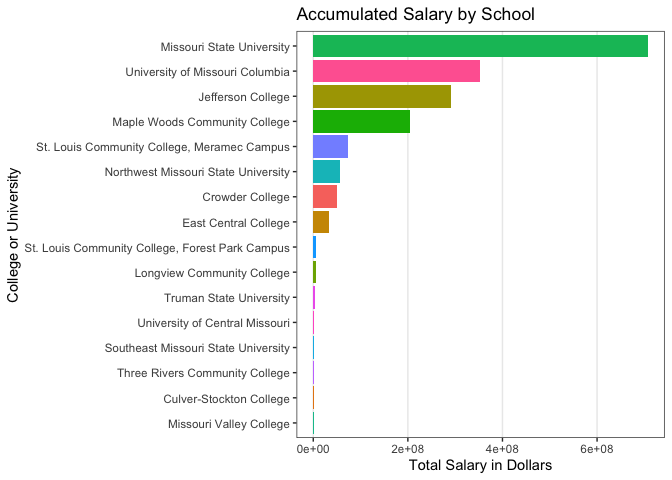
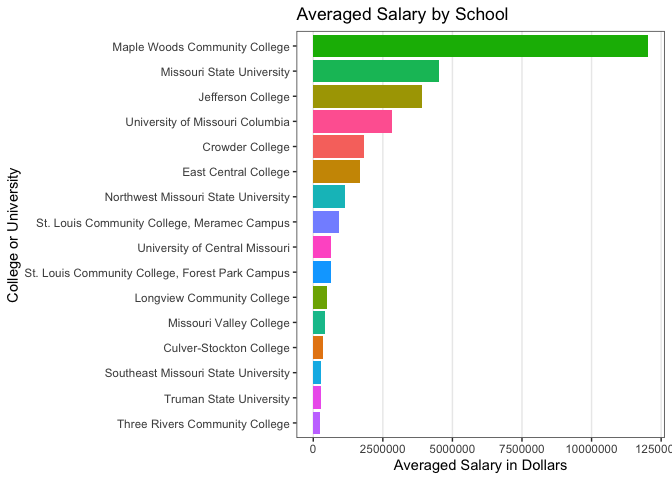

# Task 15/ Case Study 8

### Beginning Theory
Before I looked at the data, I suspected that either the University of Missouri or Missouri State would be the college in Missouri to have the most success in professional baseball. However, much matters on how you determine success. I based my research on total accumulated revenue by college and by average salary of each college. My results are as follows.

## R Script

```r
library(Lahman)
library(blscrapeR)
library(ggplot2)
library(tidyverse)
```

```
## ── Attaching packages ────────────────────────────────────────────────── tidyverse 1.3.0 ──
```

```
## ✓ tibble  2.1.3     ✓ dplyr   0.8.5
## ✓ tidyr   1.0.2     ✓ stringr 1.4.0
## ✓ readr   1.3.1     ✓ forcats 0.5.0
## ✓ purrr   0.3.3
```

```
## ── Conflicts ───────────────────────────────────────────────────── tidyverse_conflicts() ──
## x dplyr::filter() masks stats::filter()
## x dplyr::lag()    masks stats::lag()
```

```r
colleges <- Lahman::CollegePlaying
schools <- Lahman::Schools
playerinfo <- Lahman::People
Salaries <- Lahman::Salaries


college <- left_join(CollegePlaying, Master, by = "playerID")

head(college)
```

```
##    playerID schoolID yearID birthYear birthMonth birthDay birthCountry
## 1 aardsda01   pennst   2001      1981         12       27          USA
## 2 aardsda01     rice   2002      1981         12       27          USA
## 3 aardsda01     rice   2003      1981         12       27          USA
## 4  abadan01  gamiddl   1992      1972          8       25          USA
## 5  abadan01  gamiddl   1993      1972          8       25          USA
## 6 abbeybe01  vermont   1889      1869         11       11          USA
##   birthState  birthCity deathYear deathMonth deathDay deathCountry deathState
## 1         CO     Denver        NA         NA       NA         <NA>       <NA>
## 2         CO     Denver        NA         NA       NA         <NA>       <NA>
## 3         CO     Denver        NA         NA       NA         <NA>       <NA>
## 4         FL Palm Beach        NA         NA       NA         <NA>       <NA>
## 5         FL Palm Beach        NA         NA       NA         <NA>       <NA>
## 6         VT      Essex      1962          6       11          USA         VT
##    deathCity nameFirst nameLast     nameGiven weight height bats throws
## 1       <NA>     David  Aardsma   David Allan    215     75    R      R
## 2       <NA>     David  Aardsma   David Allan    215     75    R      R
## 3       <NA>     David  Aardsma   David Allan    215     75    R      R
## 4       <NA>      Andy     Abad Fausto Andres    184     73    L      L
## 5       <NA>      Andy     Abad Fausto Andres    184     73    L      L
## 6 Colchester      Bert    Abbey     Bert Wood    175     71    R      R
##        debut  finalGame  retroID   bbrefID  deathDate  birthDate
## 1 2004-04-06 2015-08-23 aardd001 aardsda01       <NA> 1981-12-27
## 2 2004-04-06 2015-08-23 aardd001 aardsda01       <NA> 1981-12-27
## 3 2004-04-06 2015-08-23 aardd001 aardsda01       <NA> 1981-12-27
## 4 2001-09-10 2006-04-13 abada001  abadan01       <NA> 1972-08-25
## 5 2001-09-10 2006-04-13 abada001  abadan01       <NA> 1972-08-25
## 6 1892-06-14 1896-09-23 abbeb101 abbeybe01 1962-06-11 1869-11-11
```

```r
college1 <- left_join(college, Salaries, by = "playerID")

head(college1)
```

```
##    playerID schoolID yearID.x birthYear birthMonth birthDay birthCountry
## 1 aardsda01   pennst     2001      1981         12       27          USA
## 2 aardsda01   pennst     2001      1981         12       27          USA
## 3 aardsda01   pennst     2001      1981         12       27          USA
## 4 aardsda01   pennst     2001      1981         12       27          USA
## 5 aardsda01   pennst     2001      1981         12       27          USA
## 6 aardsda01   pennst     2001      1981         12       27          USA
##   birthState birthCity deathYear deathMonth deathDay deathCountry deathState
## 1         CO    Denver        NA         NA       NA         <NA>       <NA>
## 2         CO    Denver        NA         NA       NA         <NA>       <NA>
## 3         CO    Denver        NA         NA       NA         <NA>       <NA>
## 4         CO    Denver        NA         NA       NA         <NA>       <NA>
## 5         CO    Denver        NA         NA       NA         <NA>       <NA>
## 6         CO    Denver        NA         NA       NA         <NA>       <NA>
##   deathCity nameFirst nameLast   nameGiven weight height bats throws      debut
## 1      <NA>     David  Aardsma David Allan    215     75    R      R 2004-04-06
## 2      <NA>     David  Aardsma David Allan    215     75    R      R 2004-04-06
## 3      <NA>     David  Aardsma David Allan    215     75    R      R 2004-04-06
## 4      <NA>     David  Aardsma David Allan    215     75    R      R 2004-04-06
## 5      <NA>     David  Aardsma David Allan    215     75    R      R 2004-04-06
## 6      <NA>     David  Aardsma David Allan    215     75    R      R 2004-04-06
##    finalGame  retroID   bbrefID deathDate  birthDate yearID.y teamID lgID
## 1 2015-08-23 aardd001 aardsda01      <NA> 1981-12-27     2004    SFN   NL
## 2 2015-08-23 aardd001 aardsda01      <NA> 1981-12-27     2007    CHA   AL
## 3 2015-08-23 aardd001 aardsda01      <NA> 1981-12-27     2008    BOS   AL
## 4 2015-08-23 aardd001 aardsda01      <NA> 1981-12-27     2009    SEA   AL
## 5 2015-08-23 aardd001 aardsda01      <NA> 1981-12-27     2010    SEA   AL
## 6 2015-08-23 aardd001 aardsda01      <NA> 1981-12-27     2011    SEA   AL
##    salary
## 1  300000
## 2  387500
## 3  403250
## 4  419000
## 5 2750000
## 6 4500000
```

```r
college2 <- left_join(college1, Schools, by = "schoolID")

head(college2)
```

```
##    playerID schoolID yearID.x birthYear birthMonth birthDay birthCountry
## 1 aardsda01   pennst     2001      1981         12       27          USA
## 2 aardsda01   pennst     2001      1981         12       27          USA
## 3 aardsda01   pennst     2001      1981         12       27          USA
## 4 aardsda01   pennst     2001      1981         12       27          USA
## 5 aardsda01   pennst     2001      1981         12       27          USA
## 6 aardsda01   pennst     2001      1981         12       27          USA
##   birthState birthCity deathYear deathMonth deathDay deathCountry deathState
## 1         CO    Denver        NA         NA       NA         <NA>       <NA>
## 2         CO    Denver        NA         NA       NA         <NA>       <NA>
## 3         CO    Denver        NA         NA       NA         <NA>       <NA>
## 4         CO    Denver        NA         NA       NA         <NA>       <NA>
## 5         CO    Denver        NA         NA       NA         <NA>       <NA>
## 6         CO    Denver        NA         NA       NA         <NA>       <NA>
##   deathCity nameFirst nameLast   nameGiven weight height bats throws      debut
## 1      <NA>     David  Aardsma David Allan    215     75    R      R 2004-04-06
## 2      <NA>     David  Aardsma David Allan    215     75    R      R 2004-04-06
## 3      <NA>     David  Aardsma David Allan    215     75    R      R 2004-04-06
## 4      <NA>     David  Aardsma David Allan    215     75    R      R 2004-04-06
## 5      <NA>     David  Aardsma David Allan    215     75    R      R 2004-04-06
## 6      <NA>     David  Aardsma David Allan    215     75    R      R 2004-04-06
##    finalGame  retroID   bbrefID deathDate  birthDate yearID.y teamID lgID
## 1 2015-08-23 aardd001 aardsda01      <NA> 1981-12-27     2004    SFN   NL
## 2 2015-08-23 aardd001 aardsda01      <NA> 1981-12-27     2007    CHA   AL
## 3 2015-08-23 aardd001 aardsda01      <NA> 1981-12-27     2008    BOS   AL
## 4 2015-08-23 aardd001 aardsda01      <NA> 1981-12-27     2009    SEA   AL
## 5 2015-08-23 aardd001 aardsda01      <NA> 1981-12-27     2010    SEA   AL
## 6 2015-08-23 aardd001 aardsda01      <NA> 1981-12-27     2011    SEA   AL
##    salary                     name_full          city state country
## 1  300000 Pennsylvania State University State College    PA     USA
## 2  387500 Pennsylvania State University State College    PA     USA
## 3  403250 Pennsylvania State University State College    PA     USA
## 4  419000 Pennsylvania State University State College    PA     USA
## 5 2750000 Pennsylvania State University State College    PA     USA
## 6 4500000 Pennsylvania State University State College    PA     USA
```

```r
college_df <- college2 %>% 
  select(playerID, nameGiven, name_full, schoolID, state, salary, yearID.y)

head(college_df)
```

```
##    playerID   nameGiven                     name_full schoolID state  salary
## 1 aardsda01 David Allan Pennsylvania State University   pennst    PA  300000
## 2 aardsda01 David Allan Pennsylvania State University   pennst    PA  387500
## 3 aardsda01 David Allan Pennsylvania State University   pennst    PA  403250
## 4 aardsda01 David Allan Pennsylvania State University   pennst    PA  419000
## 5 aardsda01 David Allan Pennsylvania State University   pennst    PA 2750000
## 6 aardsda01 David Allan Pennsylvania State University   pennst    PA 4500000
##   yearID.y
## 1     2004
## 2     2007
## 3     2008
## 4     2009
## 5     2010
## 6     2011
```

```r
## Missouri Colleges
missouri_colleges <- college_df %>% 
  filter(state == "MO")

head(missouri_colleges)
```

```
##    playerID    nameGiven       name_full schoolID state  salary yearID.y
## 1 ashbyan01 Andrew Jason Crowder College  mocrowd    MO  109000     1992
## 2 ashbyan01 Andrew Jason Crowder College  mocrowd    MO  150000     1993
## 3 ashbyan01 Andrew Jason Crowder College  mocrowd    MO  225000     1994
## 4 ashbyan01 Andrew Jason Crowder College  mocrowd    MO  755000     1995
## 5 ashbyan01 Andrew Jason Crowder College  mocrowd    MO 2000000     1996
## 6 ashbyan01 Andrew Jason Crowder College  mocrowd    MO 3400000     1997
```

```r
### Do this after you correct for inflation
total_salary <- missouri_colleges %>% 
  group_by(name_full) %>% 
  summarise(total_salary = sum(salary, na.rm = TRUE))
head(total_salary)
```

```
## # A tibble: 6 x 2
##   name_full                    total_salary
##   <chr>                               <int>
## 1 Concordia Seminary-St. Louis            0
## 2 Crowder College                  49619500
## 3 Culver-Stockton College           1084000
## 4 Drury University                        0
## 5 East Central College             33391168
## 6 Jefferson College               291883362
```

```r
new_total <- total_salary %>% 
  filter(total_salary > 0)


averaged <- missouri_colleges %>% 
  group_by(name_full) %>% 
  summarise(total_salary = mean(salary, na.rm = TRUE))
head(averaged)
```

```
## # A tibble: 6 x 2
##   name_full                    total_salary
##   <chr>                               <dbl>
## 1 Concordia Seminary-St. Louis         NaN 
## 2 Crowder College                  1837759.
## 3 Culver-Stockton College           361333.
## 4 Drury University                     NaN 
## 5 East Central College             1669558.
## 6 Jefferson College                3891778.
```

```r
new_averaged <- na.omit(averaged)
head(new_averaged)
```

```
## # A tibble: 6 x 2
##   name_full                     total_salary
##   <chr>                                <dbl>
## 1 Crowder College                   1837759.
## 2 Culver-Stockton College            361333.
## 3 East Central College              1669558.
## 4 Jefferson College                 3891778.
## 5 Longview Community College         494583.
## 6 Maple Woods Community College    12026161.
```

```r
## Graphs
Total_Revenue <- ggplot(data = new_total) +
  geom_col(mapping = aes(x = reorder(name_full, total_salary), y = total_salary, fill = name_full)) +
  theme_bw() +
  theme(legend.position = 'none',
        panel.grid.major.y = element_blank(),
        panel.grid.minor.x = element_blank()) +
  labs(x = 'College or University',
       y = 'Total Salary in Dollars',
       title = 'Accumulated Salary by School') +
  coord_flip()

Total_Revenue
```

<!-- -->

```r
By_Average <- ggplot(data = new_averaged) +
  geom_col(mapping = aes(x = reorder(name_full,total_salary), y = total_salary, fill = name_full)) +
  theme_bw() +
  theme(legend.position = 'none',
        panel.grid.major.y = element_blank(),
        panel.grid.minor.x = element_blank()) +
  labs(x = 'College or University',
       y = 'Averaged Salary in Dollars',
       title = 'Averaged Salary by School') +
  coord_flip()

By_Average
```

<!-- -->
## Results
The Total_Revenue graphs shows me what I had expected. The University of Missouri and Missouri St. are the top two. This can also tell us that they have the most amount of players go to the professional level. I wasn't expecting their to be this big of different between the two.

The By_Average graph shows that Maple Woods Community College is way above the other schools. This is because Albert Pujols attended there. So, if you base which college is best based on the most successful player, then it would be Maple Woods.
