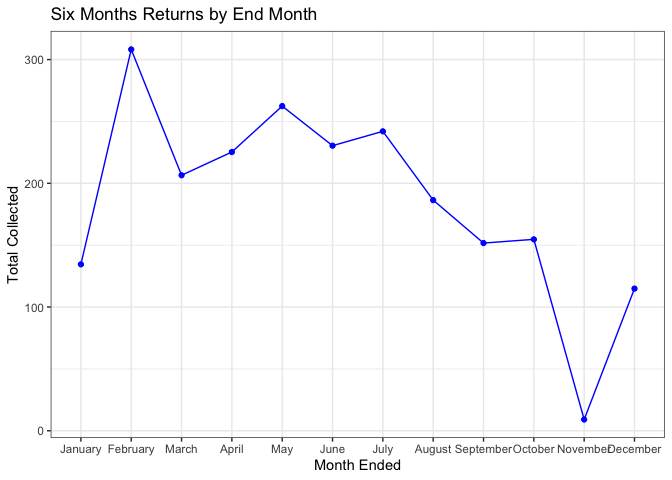

```r
library(tidyverse)
```

```
## ── Attaching packages ────────────────────────────────────────────────── tidyverse 1.3.0 ──
```

```
## ✓ ggplot2 3.3.0     ✓ purrr   0.3.3
## ✓ tibble  2.1.3     ✓ dplyr   0.8.5
## ✓ tidyr   1.0.2     ✓ stringr 1.4.0
## ✓ readr   1.3.1     ✓ forcats 0.5.0
```

```
## ── Conflicts ───────────────────────────────────────────────────── tidyverse_conflicts() ──
## x dplyr::filter() masks stats::filter()
## x dplyr::lag()    masks stats::lag()
```

```r
library(haven)
library(readr)
library(readxl)
library(downloader)
library(plyr)
```

```
## ------------------------------------------------------------------------------
```

```
## You have loaded plyr after dplyr - this is likely to cause problems.
## If you need functions from both plyr and dplyr, please load plyr first, then dplyr:
## library(plyr); library(dplyr)
```

```
## ------------------------------------------------------------------------------
```

```
## 
## Attaching package: 'plyr'
```

```
## The following objects are masked from 'package:dplyr':
## 
##     arrange, count, desc, failwith, id, mutate, rename, summarise,
##     summarize
```

```
## The following object is masked from 'package:purrr':
## 
##     compact
```

```r
data_rds  <- read_rds(url("https://github.com/WJC-Data-Science/DTS350/raw/master/Dart_Expert_Dow_6month_anova/Dart_Expert_Dow_6month_anova.RDS"))

data_dta  <- read_dta("https://github.com/WJC-Data-Science/DTS350/raw/master/Dart_Expert_Dow_6month_anova/Dart_Expert_Dow_6month_anova.dta")

data_cvs  <- read_csv("https://raw.githubusercontent.com/WJC-Data-Science/DTS350/master/Dart_Expert_Dow_6month_anova/Dart_Expert_Dow_6month_anova.csv")
```

```
## Parsed with column specification:
## cols(
##   contest_period = col_character(),
##   variable = col_character(),
##   value = col_double()
## )
```

```r
sav <- tempfile()
download("https://github.com/WJC-Data-Science/DTS350/raw/master/Dart_Expert_Dow_6month_anova/Dart_Expert_Dow_6month_anova.sav", sav, mode = "wb")
dfsav <- read_sav(sav)


xlsx <- tempfile()
download("https://github.com/WJC-Data-Science/DTS350/raw/master/Dart_Expert_Dow_6month_anova/Dart_Expert_Dow_6month_anova.xlsx",xlsx, mode = "wb")
dfxlsx <- read_xlsx(xlsx)


all_equal(data_dta, dfsav, convert = TRUE)
```

```
## Warning: Column `contest_period` has different attributes on LHS and RHS of join
```

```
## Warning: Column `variable` has different attributes on LHS and RHS of join
```

```
## Warning: Column `value` has different attributes on LHS and RHS of join
```

```
## [1] TRUE
```

```r
all_equal(data_dta, dfxlsx, convert = TRUE)
```

```
## Warning: Column `contest_period` has different attributes on LHS and RHS of join
```

```
## Warning: Column `variable` has different attributes on LHS and RHS of join
```

```
## Warning: Column `value` has different attributes on LHS and RHS of join
```

```
## [1] TRUE
```

```r
all_equal(data_dta, data_rds, convert = TRUE)
```

```
## Warning: Column `contest_period` has different attributes on LHS and RHS of join
```

```
## Warning: Column `variable` has different attributes on LHS and RHS of join
```

```
## Warning: Column `value` has different attributes on LHS and RHS of join
```

```
## [1] TRUE
```

```r
all_equal(data_rds, dfsav, convert = TRUE)
```

```
## Warning: Column `contest_period` has different attributes on LHS and RHS of join
```

```
## Warning: Column `variable` has different attributes on LHS and RHS of join
```

```
## Warning: Column `value` has different attributes on LHS and RHS of join
```

```
## [1] TRUE
```

```r
all_equal(data_rds, dfxlsx, convert = TRUE)
```

```
## [1] TRUE
```

```r
all_equal(dfxlsx, dfsav, convert = TRUE)
```

```
## Warning: Column `contest_period` has different attributes on LHS and RHS of join
```

```
## Warning: Column `variable` has different attributes on LHS and RHS of join
```

```
## Warning: Column `value` has different attributes on LHS and RHS of join
```

```
## [1] TRUE
```

```r
data_dta2 <- data_dta %>% 
  separate(contest_period, into = c("Month/Month", "Year_end"), sep = -4)

head(data_dta2)
```

```
## # A tibble: 6 x 4
##   `Month/Month`   Year_end variable value
##   <chr>           <chr>    <chr>    <dbl>
## 1 January-June    1990     PROS      12.7
## 2 February-July   1990     PROS      26.4
## 3 March-August    1990     PROS       2.5
## 4 April-September 1990     PROS     -20  
## 5 May-October     1990     PROS     -37.8
## 6 June-November   1990     PROS     -33.3
```

```r
data_dta3 <- data_dta %>% 
  separate(contest_period, into = c("Month/Month", "Year_end"), sep = -4) %>% 
  group_by(Year_end, variable) %>% 
  dplyr::summarise(Average = mean(value, na.rm = TRUE))

head(data_dta3)
```

```
## # A tibble: 6 x 3
## # Groups:   Year_end [2]
##   Year_end variable Average
##   <chr>    <chr>      <dbl>
## 1 1990     DARTS     -12.3 
## 2 1990     DJIA       -4.01
## 3 1990     PROS       -8.53
## 4 1991     DARTS      19.0 
## 5 1991     DJIA        8.36
## 6 1991     PROS       22.0
```

```r
## Tidy the data
data_dta4 <- data_dta2 %>% 
  separate("Month/Month", into = c("month_begin", "month_end"), sep = "-")


head(data_dta4)
```

```
## # A tibble: 6 x 5
##   month_begin month_end Year_end variable value
##   <chr>       <chr>     <chr>    <chr>    <dbl>
## 1 January     June      1990     PROS      12.7
## 2 February    July      1990     PROS      26.4
## 3 March       August    1990     PROS       2.5
## 4 April       September 1990     PROS     -20  
## 5 May         October   1990     PROS     -37.8
## 6 June        November  1990     PROS     -33.3
```

```r
##Tidying the data - again
head(data_dta4)
```

```
## # A tibble: 6 x 5
##   month_begin month_end Year_end variable value
##   <chr>       <chr>     <chr>    <chr>    <dbl>
## 1 January     June      1990     PROS      12.7
## 2 February    July      1990     PROS      26.4
## 3 March       August    1990     PROS       2.5
## 4 April       September 1990     PROS     -20  
## 5 May         October   1990     PROS     -37.8
## 6 June        November  1990     PROS     -33.3
```

```r
data_dta6 <- data_dta4 %>% 
  group_by(month_end) %>% 
  dplyr::summarise(sum_collected = sum(value, na.rm = TRUE))

data_dta6
```

```
## # A tibble: 14 x 2
##    month_end sum_collected
##    <chr>             <dbl>
##  1 April             225. 
##  2 August            186. 
##  3 Dec.               52.4
##  4 December           62.5
##  5 February          288. 
##  6 Febuary            20.5
##  7 January           134. 
##  8 July              242  
##  9 June              230. 
## 10 March             206. 
## 11 May               262. 
## 12 November            9.1
## 13 October           155. 
## 14 September         152.
```

```r
data_dta6$month_end[data_dta6$month_end == "Dec."] <- "December"
data_dta6$month_end[data_dta6$month_end == "Febuary"] <- "February"

data_dta6
```

```
## # A tibble: 14 x 2
##    month_end sum_collected
##    <chr>             <dbl>
##  1 April             225. 
##  2 August            186. 
##  3 December           52.4
##  4 December           62.5
##  5 February          288. 
##  6 February           20.5
##  7 January           134. 
##  8 July              242  
##  9 June              230. 
## 10 March             206. 
## 11 May               262. 
## 12 November            9.1
## 13 October           155. 
## 14 September         152.
```

```r
data_dta7 <- ddply(data_dta6, "month_end", numcolwise(sum))

data_dta7
```

```
##    month_end sum_collected
## 1      April         225.3
## 2     August         186.4
## 3   December         114.9
## 4   February         308.2
## 5    January         134.5
## 6       July         242.0
## 7       June         230.4
## 8      March         206.5
## 9        May         262.4
## 10  November           9.1
## 11   October         154.7
## 12 September         151.7
```

```r
data_dta7$month_end <- factor(data_dta7$month_end, month.name, ordered = TRUE)

data_dta7
```

```
##    month_end sum_collected
## 1      April         225.3
## 2     August         186.4
## 3   December         114.9
## 4   February         308.2
## 5    January         134.5
## 6       July         242.0
## 7       June         230.4
## 8      March         206.5
## 9        May         262.4
## 10  November           9.1
## 11   October         154.7
## 12 September         151.7
```

```r
months <- factor(c("January", "February", "March","April","May","June","July","August","September","October","November","December" ), levels = c("January", "February", "March","April","May","June","July","August","September","October","November","December" ))

data_dta7$month_end <- factor(data_dta7$month_end, levels = months)


## Graphs

by_month <- ggplot(data = data_dta7) +
  geom_point(mapping = aes(x = month_end, y = sum_collected), color = 'blue') +
  geom_line(mapping = aes(x = month_end, y = sum_collected, group = 1), color = 'blue') +
  labs(x = 'Month Ended',
       y = 'Total Collected',
       title = 'Six Months Returns by End Month') +
  theme_bw()

by_month
```

<!-- -->

```r
by_month_x <- ggplot(data = data_dta7) +
  geom_point(mapping = aes(x = month_end, y = sum_collected), color = 'blue') +
  geom_line(mapping = aes(x = month_end, y = sum_collected, group = 1), color = 'blue') +
  labs(x = 'Month Ended',
       y = 'Total Collected',
       title = 'Six Months Returns by End Month') +
  scale_x_discrete(drop = FALSE) +
  theme_bw()

by_month_x
```

<!-- -->
## Explanation 
Nothing changed between the two graphs. The drop function is used to omit factor levels from the scale. The defualt, which is TRUE, only uses the levels that appear in the data. So, drop = FALSE means we want to use all levels in the factor

In order to change this, I would need to include levels in my x values.

## Graphs
My graphs have the total amount from each of the end months. That is, the month that they recieved the money
