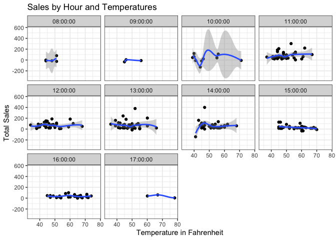

# Task 18


```r
## Task 18

library(tidyverse)
```

```
## ── Attaching packages ────────────────────────────────────────────────────────────────────────────────────────── tidyverse 1.3.0 ──
```

```
## ✓ ggplot2 3.3.0     ✓ purrr   0.3.3
## ✓ tibble  2.1.3     ✓ dplyr   0.8.5
## ✓ tidyr   1.0.2     ✓ stringr 1.4.0
## ✓ readr   1.3.1     ✓ forcats 0.5.0
```

```
## ── Conflicts ───────────────────────────────────────────────────────────────────────────────────────────── tidyverse_conflicts() ──
## x dplyr::filter() masks stats::filter()
## x dplyr::lag()    masks stats::lag()
```

```r
library(ggplot2)
library(lubridate)
```

```
## 
## Attaching package: 'lubridate'
```

```
## The following object is masked from 'package:base':
## 
##     date
```

```r
library(riem)

data_w <- read_csv(url('https://github.com/WJC-Data-Science/DTS350/raw/master/carwash.csv'))
```

```
## Parsed with column specification:
## cols(
##   name = col_character(),
##   type = col_character(),
##   time = col_datetime(format = ""),
##   amount = col_double()
## )
```

```r
head(data_w)
```

```
## # A tibble: 6 x 4
##   name          type     time                amount
##   <chr>         <chr>    <dttm>               <dbl>
## 1 SplashandDash Services 2016-05-13 20:27:00    1  
## 2 SplashandDash Services 2016-05-13 20:27:00    0  
## 3 SplashandDash Services 2016-05-16 19:31:00   23.6
## 4 SplashandDash Services 2016-05-16 17:09:00   18.9
## 5 SplashandDash Services 2016-05-16 17:47:00   23.6
## 6 SplashandDash Services 2016-05-16 17:50:00   23.6
```

```r
data_w$time <- with_tz(data_w$time, tz = 'MST' )
head(data_w)
```

```
## # A tibble: 6 x 4
##   name          type     time                amount
##   <chr>         <chr>    <dttm>               <dbl>
## 1 SplashandDash Services 2016-05-13 13:27:00    1  
## 2 SplashandDash Services 2016-05-13 13:27:00    0  
## 3 SplashandDash Services 2016-05-16 12:31:00   23.6
## 4 SplashandDash Services 2016-05-16 10:09:00   18.9
## 5 SplashandDash Services 2016-05-16 10:47:00   23.6
## 6 SplashandDash Services 2016-05-16 10:50:00   23.6
```

```r
data_w$time <- ceiling_date(data_w$time, unit = 'hour')
head(data_w)
```

```
## # A tibble: 6 x 4
##   name          type     time                amount
##   <chr>         <chr>    <dttm>               <dbl>
## 1 SplashandDash Services 2016-05-13 14:00:00    1  
## 2 SplashandDash Services 2016-05-13 14:00:00    0  
## 3 SplashandDash Services 2016-05-16 13:00:00   23.6
## 4 SplashandDash Services 2016-05-16 11:00:00   18.9
## 5 SplashandDash Services 2016-05-16 11:00:00   23.6
## 6 SplashandDash Services 2016-05-16 11:00:00   23.6
```

```r
datw <- data_w %>% 
  separate(time, into = c('date','hour'), sep = 11) %>% 
  group_by(hour) 
 


datw_totals <- datw %>% 
  dplyr::group_by(date, hour) %>% 
  dplyr::summarise(total_sales = sum(amount, na.rm = TRUE))


temps <- riem_measures(station = "RXE",  date_start  = '2016-05-13',  date_end  = '2016-07-15')
head(temps)
```

```
## # A tibble: 6 x 31
##   station valid                 lon   lat  tmpf  dwpf  relh  drct  sknt  p01i
##   <chr>   <dttm>              <dbl> <dbl> <dbl> <dbl> <dbl> <dbl> <dbl> <dbl>
## 1 RXE     2016-05-13 00:00:00 -112.  43.8    NA    NA    NA   220    14    NA
## 2 RXE     2016-05-13 00:05:00 -112.  43.8    NA    NA    NA   200    13    NA
## 3 RXE     2016-05-13 00:10:00 -112.  43.8    NA    NA    NA   200    12    NA
## 4 RXE     2016-05-13 00:15:00 -112.  43.8    NA    NA    NA   210    16    NA
## 5 RXE     2016-05-13 00:20:00 -112.  43.8    NA    NA    NA   200    14    NA
## 6 RXE     2016-05-13 00:25:00 -112.  43.8    NA    NA    NA   210    13    NA
## # … with 21 more variables: alti <dbl>, mslp <dbl>, vsby <dbl>, gust <dbl>,
## #   skyc1 <chr>, skyc2 <chr>, skyc3 <chr>, skyc4 <lgl>, skyl1 <dbl>,
## #   skyl2 <dbl>, skyl3 <dbl>, skyl4 <lgl>, wxcodes <chr>,
## #   ice_accretion_1hr <lgl>, ice_accretion_3hr <lgl>, ice_accretion_6hr <lgl>,
## #   peak_wind_gust <dbl>, peak_wind_drct <dbl>, peak_wind_time <chr>,
## #   feel <dbl>, metar <chr>
```

```r
temps$valid <- ymd_hms(temps$valid)
temps$valid <- ceiling_date(temps$valid, unit = 'hour') 


temps1 <- temps %>% 
  dplyr::select(valid, tmpf) %>% 
  dplyr::filter(!is.na(tmpf)) %>% 
  separate(valid, into = c('date','hour'), sep = 11)


temps2 <- temps1 %>% 
  right_join(datw_totals) %>% 
  dplyr::group_by(date, hour) 
```

```
## Joining, by = c("date", "hour")
```

```r
ggplot(data = temps2, mapping = aes(x = tmpf, y = total_sales)) +
  geom_point() +
  geom_smooth() +
  facet_wrap(~hour) +
  labs(y = 'Total Sales', x = 'Temperature in Fahrenheit', title = 'Sales by Hour and Temperatures') +
  theme_bw()
```

```
## `geom_smooth()` using method = 'loess' and formula 'y ~ x'
```

```
## Warning: Removed 18 rows containing non-finite values (stat_smooth).
```

```
## Warning in simpleLoess(y, x, w, span, degree = degree, parametric =
## parametric, : span too small. fewer data values than degrees of freedom.
```

```
## Warning in simpleLoess(y, x, w, span, degree = degree, parametric =
## parametric, : pseudoinverse used at 44.025
```

```
## Warning in simpleLoess(y, x, w, span, degree = degree, parametric =
## parametric, : neighborhood radius 3.9951
```

```
## Warning in simpleLoess(y, x, w, span, degree = degree, parametric =
## parametric, : reciprocal condition number 0
```

```
## Warning in simpleLoess(y, x, w, span, degree = degree, parametric =
## parametric, : There are other near singularities as well. 9.5796
```

```
## Warning in predLoess(object$y, object$x, newx = if
## (is.null(newdata)) object$x else if (is.data.frame(newdata))
## as.matrix(model.frame(delete.response(terms(object)), : span too small. fewer
## data values than degrees of freedom.
```

```
## Warning in predLoess(object$y, object$x, newx = if
## (is.null(newdata)) object$x else if (is.data.frame(newdata))
## as.matrix(model.frame(delete.response(terms(object)), : pseudoinverse used at
## 44.025
```

```
## Warning in predLoess(object$y, object$x, newx = if
## (is.null(newdata)) object$x else if (is.data.frame(newdata))
## as.matrix(model.frame(delete.response(terms(object)), : neighborhood radius
## 3.9951
```

```
## Warning in predLoess(object$y, object$x, newx = if
## (is.null(newdata)) object$x else if (is.data.frame(newdata))
## as.matrix(model.frame(delete.response(terms(object)), : reciprocal condition
## number 0
```

```
## Warning in predLoess(object$y, object$x, newx = if
## (is.null(newdata)) object$x else if (is.data.frame(newdata))
## as.matrix(model.frame(delete.response(terms(object)), : There are other near
## singularities as well. 9.5796
```

```
## Warning in simpleLoess(y, x, w, span, degree = degree, parametric =
## parametric, : span too small. fewer data values than degrees of freedom.
```

```
## Warning in simpleLoess(y, x, w, span, degree = degree, parametric =
## parametric, : pseudoinverse used at 44.905
```

```
## Warning in simpleLoess(y, x, w, span, degree = degree, parametric =
## parametric, : neighborhood radius 1.1349
```

```
## Warning in simpleLoess(y, x, w, span, degree = degree, parametric =
## parametric, : reciprocal condition number 0
```

```
## Warning in simpleLoess(y, x, w, span, degree = degree, parametric =
## parametric, : There are other near singularities as well. 99.1
```

```
## Warning in predLoess(object$y, object$x, newx = if
## (is.null(newdata)) object$x else if (is.data.frame(newdata))
## as.matrix(model.frame(delete.response(terms(object)), : span too small. fewer
## data values than degrees of freedom.
```

```
## Warning in predLoess(object$y, object$x, newx = if
## (is.null(newdata)) object$x else if (is.data.frame(newdata))
## as.matrix(model.frame(delete.response(terms(object)), : pseudoinverse used at
## 44.905
```

```
## Warning in predLoess(object$y, object$x, newx = if
## (is.null(newdata)) object$x else if (is.data.frame(newdata))
## as.matrix(model.frame(delete.response(terms(object)), : neighborhood radius
## 1.1349
```

```
## Warning in predLoess(object$y, object$x, newx = if
## (is.null(newdata)) object$x else if (is.data.frame(newdata))
## as.matrix(model.frame(delete.response(terms(object)), : reciprocal condition
## number 0
```

```
## Warning in predLoess(object$y, object$x, newx = if
## (is.null(newdata)) object$x else if (is.data.frame(newdata))
## as.matrix(model.frame(delete.response(terms(object)), : There are other near
## singularities as well. 99.1
```

```
## Warning in simpleLoess(y, x, w, span, degree = degree, parametric =
## parametric, : span too small. fewer data values than degrees of freedom.
```

```
## Warning in simpleLoess(y, x, w, span, degree = degree, parametric =
## parametric, : pseudoinverse used at 59.99
```

```
## Warning in simpleLoess(y, x, w, span, degree = degree, parametric =
## parametric, : neighborhood radius 6.93
```

```
## Warning in simpleLoess(y, x, w, span, degree = degree, parametric =
## parametric, : reciprocal condition number 0
```

```
## Warning in simpleLoess(y, x, w, span, degree = degree, parametric =
## parametric, : There are other near singularities as well. 126.56
```

```
## Warning in predLoess(object$y, object$x, newx = if
## (is.null(newdata)) object$x else if (is.data.frame(newdata))
## as.matrix(model.frame(delete.response(terms(object)), : span too small. fewer
## data values than degrees of freedom.
```

```
## Warning in predLoess(object$y, object$x, newx = if
## (is.null(newdata)) object$x else if (is.data.frame(newdata))
## as.matrix(model.frame(delete.response(terms(object)), : pseudoinverse used at
## 59.99
```

```
## Warning in predLoess(object$y, object$x, newx = if
## (is.null(newdata)) object$x else if (is.data.frame(newdata))
## as.matrix(model.frame(delete.response(terms(object)), : neighborhood radius 6.93
```

```
## Warning in predLoess(object$y, object$x, newx = if
## (is.null(newdata)) object$x else if (is.data.frame(newdata))
## as.matrix(model.frame(delete.response(terms(object)), : reciprocal condition
## number 0
```

```
## Warning in predLoess(object$y, object$x, newx = if
## (is.null(newdata)) object$x else if (is.data.frame(newdata))
## as.matrix(model.frame(delete.response(terms(object)), : There are other near
## singularities as well. 126.56
```

```
## Warning: Removed 18 rows containing missing values (geom_point).
```

```
## Warning in max(ids, na.rm = TRUE): no non-missing arguments to max; returning -
## Inf

## Warning in max(ids, na.rm = TRUE): no non-missing arguments to max; returning -
## Inf
```

<!-- -->
## Analysis
This grpahic shows that total sales for each hour aren't altered by temperature all that significantly. You would expect to see a gradually increasing line in each graph, but that is not the case.
