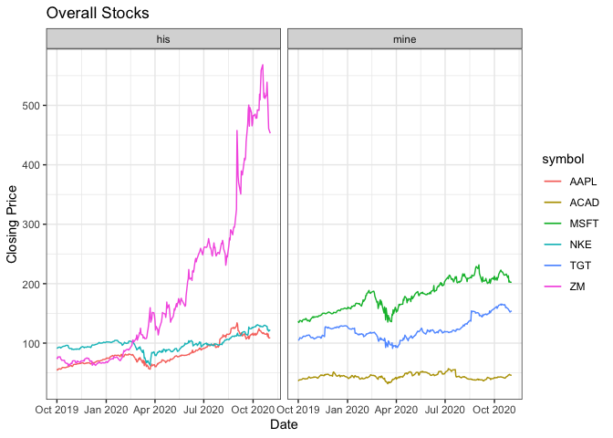
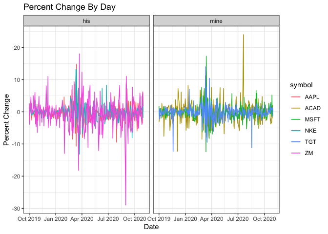
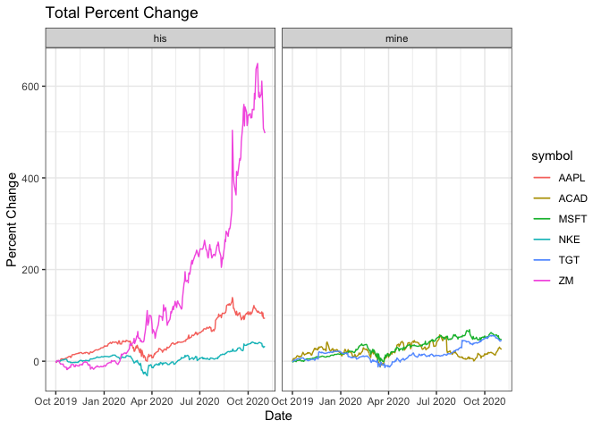
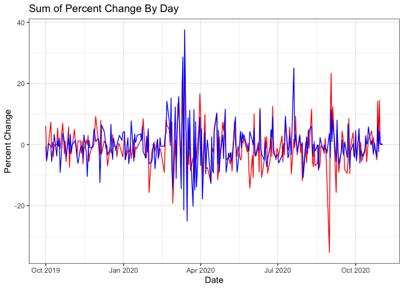
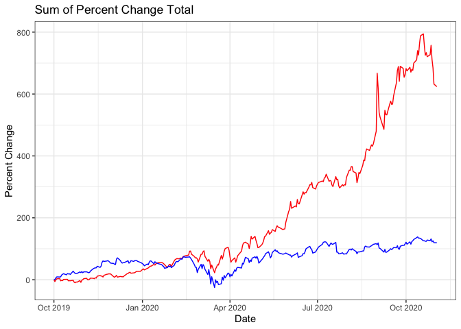

### Loading in the Stocks 

```r
library(tidyquant)
```

```
## Loading required package: lubridate
```

```
## 
## Attaching package: 'lubridate'
```

```
## The following object is masked from 'package:base':
## 
##     date
```

```
## Loading required package: PerformanceAnalytics
```

```
## Loading required package: xts
```

```
## Loading required package: zoo
```

```
## 
## Attaching package: 'zoo'
```

```
## The following objects are masked from 'package:base':
## 
##     as.Date, as.Date.numeric
```

```
## 
## Attaching package: 'PerformanceAnalytics'
```

```
## The following object is masked from 'package:graphics':
## 
##     legend
```

```
## Loading required package: quantmod
```

```
## Loading required package: TTR
```

```
## Registered S3 method overwritten by 'quantmod':
##   method            from
##   as.zoo.data.frame zoo
```

```
## Version 0.4-0 included new data defaults. See ?getSymbols.
```

```
## ══ Need to Learn tidyquant? ═══════════════════════════════════════════════════════════════
## Business Science offers a 1-hour course - Learning Lab #9: Performance Analysis & Portfolio Optimization with tidyquant!
## </> Learn more at: https://university.business-science.io/p/learning-labs-pro </>
```

```r
library(ggplot2)
library(tidyverse)
```

```
## ── Attaching packages ────────────────────────────────────────────────── tidyverse 1.3.0 ──
```

```
## ✓ tibble  3.0.4     ✓ dplyr   1.0.2
## ✓ tidyr   1.1.2     ✓ stringr 1.4.0
## ✓ readr   1.3.1     ✓ forcats 0.5.0
## ✓ purrr   0.3.3
```

```
## ── Conflicts ───────────────────────────────────────────────────── tidyverse_conflicts() ──
## x lubridate::as.difftime() masks base::as.difftime()
## x lubridate::date()        masks base::date()
## x dplyr::filter()          masks stats::filter()
## x dplyr::first()           masks xts::first()
## x lubridate::intersect()   masks base::intersect()
## x dplyr::lag()             masks stats::lag()
## x dplyr::last()            masks xts::last()
## x lubridate::setdiff()     masks base::setdiff()
## x lubridate::union()       masks base::union()
```

```r
library(dplyr)
library(lubridate)


## My Stocks
target <- tq_get("TGT", get = 'stock.prices', from = '2019-10-1', to = '2020-11-3')
microsoft <- tq_get("MSFT", get = 'stock.prices', from = '2019-10-1', to = '2020-11-3')
acadia <- tq_get('ACAD', get = 'stock.prices', from = '2019-10-1', to = '2020-11-3')

my_stocks <- bind_rows(target, microsoft, acadia)
my_stocks$data <- 'mine'


## Morehouse Stocks
zoom <- tq_get('ZM', get = 'stock.prices', from = '2019-10-1', to = '2020-11-3' )
nike <- tq_get("NKE", get = 'stock.prices', from = '2019-10-1', to = '2020-11-3')
apple <- tq_get("AAPL", get = 'stock.prices', from = '2019-10-1', to = '2020-11-3')

morehouse_stocks <- bind_rows(zoom, nike, apple)
morehouse_stocks$data <- 'his'
```
### Overall Plot

```r
ggplot() +
  geom_line(data = my_stocks, mapping = aes(x = date, y = close, color = symbol)) +
  geom_line(data = morehouse_stocks, mapping = aes(x = date, y = close, color = symbol)) +
  facet_wrap(~data) +
  labs(x = 'Date', y = 'Closing Price', title = 'Overall Stocks') +
  theme_bw()
```

<!-- -->
### Percent Change

```r
my_stocks <- my_stocks %>% 
  group_by(symbol) %>% 
  mutate(percent_change = (close/lead(close)-1)*100,
         percent_change_total = (close/close[1]-1)*100)

morehouse_stocks <- morehouse_stocks %>% 
  group_by(symbol) %>% 
  mutate(percent_change = (close/lead(close)-1)*100,
         percent_change_total = (close/close[1]-1)*100)

by_day_percent_change <- ggplot() +
  geom_line(data = my_stocks, mapping = aes(x = date, y = percent_change, color = symbol)) +
  geom_line(data = morehouse_stocks, mapping = aes(x = date, y = percent_change, color = symbol)) +
  facet_wrap(~data) +
  labs(x = 'Date', y = 'Percent Change', title = 'Percent Change By Day') +
  theme_bw()
by_day_percent_change
```

```
## Warning: Removed 3 row(s) containing missing values (geom_path).

## Warning: Removed 3 row(s) containing missing values (geom_path).
```

<!-- -->

```r
total_change <- ggplot() +
  geom_line(data = my_stocks, mapping = aes(x = date, y = percent_change_total, color = symbol)) +
  geom_line(data = morehouse_stocks, mapping = aes(x = date, y = percent_change_total, color = symbol)) +
  facet_wrap(~data) +
  labs(x = 'Date', y = 'Percent Change', title = 'Total Percent Change') +
  theme_bw()
total_change  
```

<!-- -->
### Sum of Percent Change by Day
### Blue is me and Red is Morehouse

```r
morehouse_percent_change <- morehouse_stocks %>%
  group_by(data, date) %>% 
  summarise(total = sum(percent_change, na.rm = TRUE))
```

```
## `summarise()` regrouping output by 'data' (override with `.groups` argument)
```

```r
my_percent_change <- my_stocks %>% 
  group_by(data, date) %>% 
  summarise(total = sum(percent_change, na.rm = TRUE))
```

```
## `summarise()` regrouping output by 'data' (override with `.groups` argument)
```

```r
ggplot() +
  geom_line(data = morehouse_percent_change, mapping = aes(x = date, y = total), color = 'red') +
  geom_line(data = my_percent_change, mapping = aes(x = date, y = total), color = 'blue') +
  labs(x = 'Date', y = 'Percent Change', title = 'Sum of Percent Change By Day') +
  theme_bw()
```

<!-- -->
### Sum of Percent Change Total
### Blue is me and Red is Morehouse

```r
morehouse_pc_total <- morehouse_stocks %>%
  group_by(data, date) %>% 
  summarise(total = sum(percent_change_total, na.rm = TRUE))
```

```
## `summarise()` regrouping output by 'data' (override with `.groups` argument)
```

```r
my_pc_total <- my_stocks %>% 
  group_by(data, date) %>% 
  summarise(total = sum(percent_change_total, na.rm = TRUE))
```

```
## `summarise()` regrouping output by 'data' (override with `.groups` argument)
```

```r
ggplot() +
  geom_line(data = morehouse_pc_total, mapping = aes(x = date, y = total), color = 'red') +
  geom_line(data = my_pc_total, mapping = aes(x = date, y = total), color = 'blue') +
  labs(x = 'Date', y = 'Percent Change', title = 'Sum of Percent Change Total') +
  theme_bw() +
  theme(legend.key = )
```

<!-- -->
### Report
I chose to show an overall graph in order to see the total picture between my stocks and Morehouses. It was pretty obvious from that point on the Morehouse would win given he chose Zoom (I think this is unfair). I then calculated the total percent change by day and when you view this graph it may be misleading that I may have a chance to win, but once you view the total summed percent change it is obvious that Morehouse beat me. However, you can see that priar to Covid, I had the lead and then Zoom took off making it an easy win for Morehouse.
