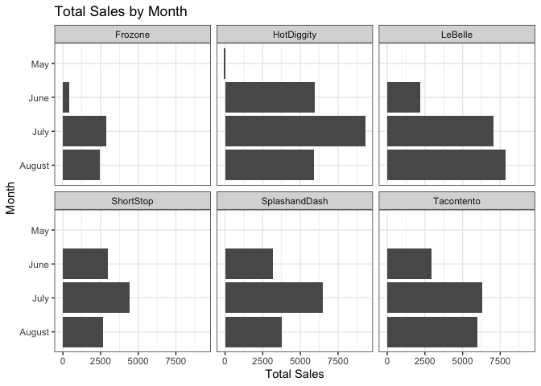

# Case Study 10

```r
library(tidyverse)
```

```
## ── Attaching packages ────────────────────────────────────────────────────────────────────────────────────────── tidyverse 1.3.0 ──
```

```
## ✓ ggplot2 3.3.0     ✓ purrr   0.3.3
## ✓ tibble  2.1.3     ✓ dplyr   0.8.5
## ✓ tidyr   1.0.2     ✓ stringr 1.4.0
## ✓ readr   1.3.1     ✓ forcats 0.5.0
```

```
## ── Conflicts ───────────────────────────────────────────────────────────────────────────────────────────── tidyverse_conflicts() ──
## x dplyr::filter() masks stats::filter()
## x dplyr::lag()    masks stats::lag()
```

```r
library(lubridate)
```

```
## 
## Attaching package: 'lubridate'
```

```
## The following object is masked from 'package:base':
## 
##     date
```

```r
data <- read_csv(url('https://github.com/WJC-Data-Science/DTS350/raw/master/sales.csv')) 
```

```
## Parsed with column specification:
## cols(
##   Name = col_character(),
##   Type = col_character(),
##   Time = col_datetime(format = ""),
##   Amount = col_double()
## )
```

```r
head(data)
```

```
## # A tibble: 6 x 4
##   Name       Type           Time                Amount
##   <chr>      <chr>          <dttm>               <dbl>
## 1 Tacontento Food(prepared) 2016-05-16 19:01:00    3  
## 2 Tacontento Food(prepared) 2016-05-16 19:01:00    1.5
## 3 Tacontento Food(prepared) 2016-05-16 19:04:00    3  
## 4 Tacontento Food(prepared) 2016-05-16 19:04:00    3  
## 5 Tacontento Food(prepared) 2016-05-16 19:04:00    1.5
## 6 Tacontento Food(prepared) 2016-05-16 19:04:00    1
```

```r
data$Time <- ymd_hms(data$Time)
data$Time <- ceiling_date(data$Time, unit = 'hour')
data$date <- as.Date(data$Time) 
data$time <- format(as.POSIXct(data$Time, format = '%Y:%m:%d %H:%M:%S'), '%H:%M:%S')
```
### Total Sales by Time

```r
summary_time <- data %>% 
  dplyr::filter(Name != 'Missing') %>% 
  dplyr::group_by(Name, time) %>% 
  dplyr::summarise(total = sum(Amount, na.rm = TRUE))
head(summary_time) 
```

```
## # A tibble: 6 x 3
## # Groups:   Name [1]
##   Name    time     total
##   <chr>   <chr>    <dbl>
## 1 Frozone 00:00:00 552. 
## 2 Frozone 01:00:00 508  
## 3 Frozone 02:00:00 488. 
## 4 Frozone 03:00:00  57.5
## 5 Frozone 04:00:00  74  
## 6 Frozone 05:00:00 102
```

```r
by_time <- ggplot(data = summary_time) +
  geom_col(mapping = aes(x = total, y = time)) +
  facet_wrap(~Name) +
  labs(x = 'Sales by Hour', y = 'Hour of Day', title = 'Sales by Hour by Company') +
  theme_bw()
by_time
```

<!-- -->
## By Company

```r
summary_company <- data %>% 
  dplyr::filter(Name != 'Missing') %>%  
  dplyr::group_by(Name) %>% 
  dplyr::summarise(total = sum(Amount, na.rm = TRUE)) %>% 
  dplyr::arrange(Name)
summary_company
```

```
## # A tibble: 6 x 2
##   Name           total
##   <chr>          <dbl>
## 1 Frozone        5741.
## 2 HotDiggity    21119.
## 3 LeBelle       17089.
## 4 ShortStop     10101.
## 5 SplashandDash 13428.
## 6 Tacontento    15264.
```

```r
by_company <- ggplot(data = summary_company) +
  geom_col(mapping = aes(x = reorder(Name, -total), y = total, fill = Name)) +
  labs(x = 'Name of Company', y = 'Total Sales', title = 'Total Sales by Company') +
  theme_bw() +
  theme(legend.position = 'none')
by_company
```

<!-- -->
### Sales by Weekday by Company

```r
weekday <- data 
weekday$date <- weekdays(data$date)
head(weekday)
```

```
## # A tibble: 6 x 6
##   Name       Type           Time                Amount date   time    
##   <chr>      <chr>          <dttm>               <dbl> <chr>  <chr>   
## 1 Tacontento Food(prepared) 2016-05-16 20:00:00    3   Monday 20:00:00
## 2 Tacontento Food(prepared) 2016-05-16 20:00:00    1.5 Monday 20:00:00
## 3 Tacontento Food(prepared) 2016-05-16 20:00:00    3   Monday 20:00:00
## 4 Tacontento Food(prepared) 2016-05-16 20:00:00    3   Monday 20:00:00
## 5 Tacontento Food(prepared) 2016-05-16 20:00:00    1.5 Monday 20:00:00
## 6 Tacontento Food(prepared) 2016-05-16 20:00:00    1   Monday 20:00:00
```

```r
weekday$date_f <- factor(weekday$date, levels = c('Sunday','Monday','Tuesday','Wednesday','Thursday','Friday','Saturday'))
head(weekday)
```

```
## # A tibble: 6 x 7
##   Name       Type           Time                Amount date   time     date_f
##   <chr>      <chr>          <dttm>               <dbl> <chr>  <chr>    <fct> 
## 1 Tacontento Food(prepared) 2016-05-16 20:00:00    3   Monday 20:00:00 Monday
## 2 Tacontento Food(prepared) 2016-05-16 20:00:00    1.5 Monday 20:00:00 Monday
## 3 Tacontento Food(prepared) 2016-05-16 20:00:00    3   Monday 20:00:00 Monday
## 4 Tacontento Food(prepared) 2016-05-16 20:00:00    3   Monday 20:00:00 Monday
## 5 Tacontento Food(prepared) 2016-05-16 20:00:00    1.5 Monday 20:00:00 Monday
## 6 Tacontento Food(prepared) 2016-05-16 20:00:00    1   Monday 20:00:00 Monday
```

```r
summary_weekdays <- weekday %>% 
  dplyr::filter(Name != 'Missing') %>% 
  dplyr::group_by(Name, date) %>% 
  dplyr::summarise(total = sum(Amount, na.rm = TRUE))
head(summary_weekdays)
```

```
## # A tibble: 6 x 3
## # Groups:   Name [1]
##   Name    date     total
##   <chr>   <chr>    <dbl>
## 1 Frozone Friday   1030.
## 2 Frozone Monday    595.
## 3 Frozone Saturday 1466.
## 4 Frozone Sunday     25 
## 5 Frozone Thursday 1011.
## 6 Frozone Tuesday   726.
```

```r
by_weekdays <- ggplot(data = summary_weekdays) +
  geom_col(mapping = aes(x = total, y = date)) +
  facet_wrap(~Name) +
  labs(x = 'Total Sales', y = "Day of Week", title = 'Total Sales by Day of Week') +
  theme_bw()
by_weekdays
```

<!-- -->
### Sales by Week by Company

```r
weekly <- data
weekly$date <- ceiling_date(weekly$date, unit = 'week')
weekly$date <- strftime(weekly$date, format = '%V')

summary_weekly <- weekly %>% 
  dplyr::filter(Name != "Missing") %>% 
  dplyr::group_by(Name, date) %>% 
  dplyr::summarise(total = sum(Amount, na.rm = TRUE))


by_weekly <- ggplot(data = summary_weekly) +
  geom_col(mapping = aes(x = total, y = date)) +
  facet_wrap(~Name) +
  labs(x = 'Total Sales', y = "Week", title = 'Total Sales by Weekly Amounts') +
  theme_bw()
by_weekly
```

<!-- -->
### Sales by Month by Company

```r
monthly <- data
monthly$date <- ceiling_date(monthly$date, unit = 'month') 
monthly$date <- strftime(monthly$date, format = '%B')


summary_monthly <- monthly %>% 
  dplyr::filter(Name != 'Missing') %>% 
  dplyr::group_by(Name, date) %>% 
  dplyr::summarise(total = sum(Amount, na.rm = TRUE))

by_monthly <- ggplot(data = summary_monthly) +
    geom_col(mapping = aes(x = total, y = date)) +
    facet_wrap(~Name) +
    labs(x = 'Total Sales', y = "Month", title = 'Total Sales by Month') +
    theme_bw()
by_monthly                   
```

<!-- -->
## Comparison and Recommendation
HotDiggity is doing the best out of the six companies. It is easy to see through each of the graphs shown, they are leading in each of the variables. All of the companies do the majority of thier business between 5 pm and 10 pm. ShortStop and SplashandDash do virtually no business during the late night hours, this is interesting given all the other coompies have sales past midnight. 

The busiest day of the week varies depending on the company, although Thursdays and Fridays are generally the busiest. The weekly data shows that the weeks were genreally the same for each company. Except week 28 is an outlier, everyone's sales went up making me wonder what was happening that week. The monthly data shows consistancy except for every company decreases in June.

I would recommend each company to focus their manpower on the hours of 5 pm to 10 pm especially towards the end of the week. This is when they tend to do the most amount of their business. I would also recommend that each company try to increase their sales on the weekends becuase this is when their sales really drop.
