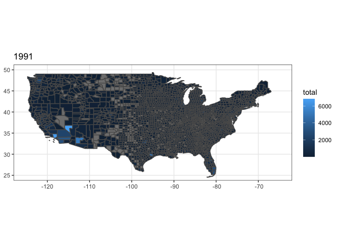
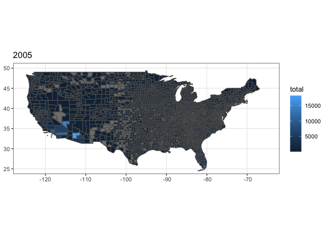
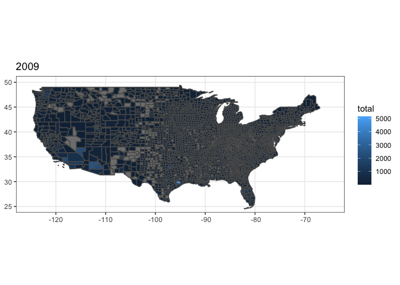

## Loading in Data

```r
library(tidyverse)
```

```
## ── Attaching packages ─────────────────────────────────────── tidyverse 1.3.0 ──
```

```
## ✓ ggplot2 3.3.0     ✓ purrr   0.3.3
## ✓ tibble  3.0.4     ✓ dplyr   1.0.2
## ✓ tidyr   1.1.2     ✓ stringr 1.4.0
## ✓ readr   1.3.1     ✓ forcats 0.5.0
```

```
## ── Conflicts ────────────────────────────────────────── tidyverse_conflicts() ──
## x dplyr::filter() masks stats::filter()
## x dplyr::lag()    masks stats::lag()
```

```r
library(USAboundaries)
library(USAboundariesData)
library(dplyr)
library(ggplot2)
library(sf)
```

```
## Linking to GEOS 3.7.2, GDAL 2.4.2, PROJ 5.2.0
```

```r
permits <- read_csv(url('https://github.com/WJC-Data-Science/DTS350/raw/master/permits.csv'))
```

```
## Warning: Missing column names filled in: 'X1' [1]
```

```
## Parsed with column specification:
## cols(
##   X1 = col_double(),
##   state = col_double(),
##   StateAbbr = col_character(),
##   county = col_double(),
##   countyname = col_character(),
##   variable = col_character(),
##   year = col_double(),
##   value = col_double()
## )
```

```r
head(permits)
```

```
## # A tibble: 6 x 8
##      X1 state StateAbbr county countyname     variable     year value
##   <dbl> <dbl> <chr>      <dbl> <chr>          <chr>       <dbl> <dbl>
## 1     1     1 AL             1 Autauga County All Permits  2010   191
## 2     2     1 AL             1 Autauga County All Permits  2009   110
## 3     3     1 AL             1 Autauga County All Permits  2008   173
## 4     4     1 AL             1 Autauga County All Permits  2007   260
## 5     5     1 AL             1 Autauga County All Permits  2006   347
## 6     6     1 AL             1 Autauga County All Permits  2005   313
```

```r
permits <- permits %>% 
  select(state, StateAbbr,county, countyname, variable, year, variable, value)
head(permits)
```

```
## # A tibble: 6 x 7
##   state StateAbbr county countyname     variable     year value
##   <dbl> <chr>      <dbl> <chr>          <chr>       <dbl> <dbl>
## 1     1 AL             1 Autauga County All Permits  2010   191
## 2     1 AL             1 Autauga County All Permits  2009   110
## 3     1 AL             1 Autauga County All Permits  2008   173
## 4     1 AL             1 Autauga County All Permits  2007   260
## 5     1 AL             1 Autauga County All Permits  2006   347
## 6     1 AL             1 Autauga County All Permits  2005   313
```

## Acquiring Data

```r
state_totals <- permits %>% 
  group_by(state, county, year) %>% 
  summarise(total = mean(value, na.rm = TRUE))
```

```
## `summarise()` regrouping output by 'state', 'county' (override with `.groups` argument)
```

```r
head(state_totals)
```

```
## # A tibble: 6 x 4
## # Groups:   state, county [1]
##   state county  year total
##   <dbl>  <dbl> <dbl> <dbl>
## 1     1      1  1980 148  
## 2     1      1  1981  17  
## 3     1      1  1982  29  
## 4     1      1  1983  53.2
## 5     1      1  1984  77  
## 6     1      1  1985  16
```

```r
state_totals <- state_totals %>% 
  rename(
    countyfp = county,
    statefp = state
  )
```

## US States and Counties

```r
us_states <- us_states()
head(us_states)
```

```
## Simple feature collection with 6 features and 12 fields
## geometry type:  MULTIPOLYGON
## dimension:      XY
## bbox:           xmin: -160.2496 ymin: 18.91747 xmax: -66.9499 ymax: 47.45716
## CRS:            EPSG:4326
##   statefp  statens    affgeoid geoid stusps     name lsad        aland
## 1      23 01779787 0400000US23    23     ME    Maine   00  79885221885
## 2      15 01779782 0400000US15    15     HI   Hawaii   00  16634100855
## 3      04 01779777 0400000US04    04     AZ  Arizona   00 294198560125
## 4      05 00068085 0400000US05    05     AR Arkansas   00 134771517596
## 5      10 01779781 0400000US10    10     DE Delaware   00   5047194742
## 6      13 01705317 0400000US13    13     GA  Georgia   00 149169848456
##        awater state_name state_abbr jurisdiction_type
## 1 11748755195      Maine         ME             state
## 2 11777698394     Hawaii         HI             state
## 3  1027346486    Arizona         AZ             state
## 4  2960191698   Arkansas         AR             state
## 5  1398720828   Delaware         DE             state
## 6  4741100880    Georgia         GA             state
##                         geometry
## 1 MULTIPOLYGON (((-68.92401 4...
## 2 MULTIPOLYGON (((-156.0497 1...
## 3 MULTIPOLYGON (((-114.7997 3...
## 4 MULTIPOLYGON (((-94.61792 3...
## 5 MULTIPOLYGON (((-75.77379 3...
## 6 MULTIPOLYGON (((-85.60516 3...
```

```r
us_counties <- us_counties()
us_counties$statefp <- as.numeric(us_counties$statefp)
us_counties$countyfp <- as.numeric(us_counties$countyfp)

final <- merge(state_totals, us_counties, all = TRUE, by = c("countyfp","statefp"))
```

## 1986

```r
final1 <- state_totals %>% 
  filter(year == 1986)


final1g <- merge(final1, us_counties, all = TRUE, by = c("statefp","countyfp"))

ggplot() +
  geom_sf(data = final1g, aes(geometry = geometry,  fill = total)) +
  coord_sf(xlim = c(-125, -65), ylim = c(25, 50)) +
  labs(title = '1986') +
  theme_bw()
```

<!-- -->

## 1991

```r
final2 <- state_totals %>% 
  filter(year == 1991)

final2g <- merge(final2, us_counties, all = TRUE, by = c("statefp","countyfp"))

ggplot() +
  geom_sf(data = final2g, aes(geometry = geometry,  fill = total)) +
  coord_sf(xlim = c(-125, -65), ylim = c(25, 50)) +
  labs(title = '1991') +
  theme_bw()
```

<!-- -->

## 2005

```r
final3 <- state_totals %>% 
  filter(year == 2005)

final3g <- merge(final3, us_counties, all = TRUE, by = c("statefp","countyfp"))


ggplot() +
  geom_sf(data = final3g, aes(geometry = geometry,  fill = total)) +
  coord_sf(xlim = c(-125, -65), ylim = c(25, 50)) +
  labs(title = '2005') +
  theme_bw()
```

<!-- -->

## 2009

```r
final4 <- state_totals %>% 
  filter(year == 2009)

final4g <- merge(final4, us_counties, all = TRUE, by = c("statefp","countyfp"))


ggplot() +
  geom_sf(data = final4g, aes(geometry = geometry,  fill = total)) +
  coord_sf(xlim = c(-125, -65), ylim = c(25, 50)) +
  labs(title = '2009') +
  theme_bw()
```

<!-- -->

## Analysis
These graphics show the permits by county for the entire United States. It doesn't look so good because states like California dominate and tip the scale. Because of this it is difficult to see the change in the data, however we know that from looking at the data previously that permits peaked in 1986 with a decline in 1991. And then of course peaked in 2005 and had a major dip to 2009. I decided to go by county because I thought it would be more interesting, and while it is hard to see with a small graph, it is very clear when you blow up the image.
