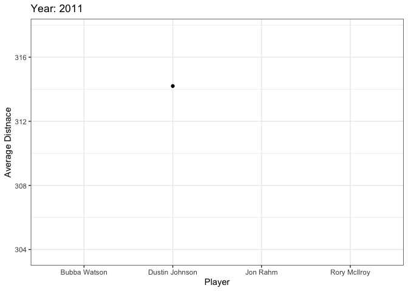

```r
library(tidyverse)
```

```
## ── Attaching packages ─────────────────────────────────────── tidyverse 1.3.0 ──
```

```
## ✓ ggplot2 3.3.0     ✓ purrr   0.3.3
## ✓ tibble  3.0.4     ✓ dplyr   1.0.2
## ✓ tidyr   1.1.2     ✓ stringr 1.4.0
## ✓ readr   1.3.1     ✓ forcats 0.5.0
```

```
## ── Conflicts ────────────────────────────────────────── tidyverse_conflicts() ──
## x dplyr::filter() masks stats::filter()
## x dplyr::lag()    masks stats::lag()
```

```r
library(ggplot2)
library(gganimate)
library(gifski)


ggplot(mtcars, aes(factor(cyl), mpg)) +
  geom_boxplot() +
  # Here comes the gganimate code
  transition_states(
    gear,
    transition_length = 2,
    state_length = 1
  ) +
  enter_fade() +
  exit_shrink() +
  ease_aes('sine-in-out')


pgatour <- read_csv("pgaTourData2.csv")
```

```
## Parsed with column specification:
## cols(
##   `Player Name` = col_character(),
##   Rounds = col_double(),
##   `Fairway Percentage` = col_double(),
##   Year = col_double(),
##   `Avg Distance` = col_double(),
##   gir = col_double(),
##   `Average Putts` = col_double(),
##   `Average Scrambling` = col_double(),
##   `Average Score` = col_double(),
##   Points = col_number(),
##   Wins = col_double(),
##   `Top 10` = col_double(),
##   `Average SG Putts` = col_double(),
##   `Average SG Total` = col_double(),
##   `SG:OTT` = col_double(),
##   `SG:APR` = col_double(),
##   `SG:ARG` = col_double(),
##   Money = col_character()
## )
```

```r
new_pga <- pgatour %>% 
  filter(`SG:OTT` >= 0.9)

ggplot(new_pga, aes(`Player Name`, `Avg Distance`), size = ) +
  geom_point() +
  theme_bw() +
  # gganimate specific bits:
  labs(title = 'Year: {frame_time}', x = 'Player', y = 'Average Distnace') +
  transition_time(Year) +
  ease_aes('linear')
```

<!-- -->

