## Opening Statements
&nbsp;&nbsp;&nbsp;&nbsp;&nbsp;&nbsp; &nbsp; In this analysis, I will be looking at data from the PGA Tour from 2010-2018. The overall question I will be addressing is "How has golf changed in the past decade?" There are many ways to go about this question. The areas of focus for me will be:\
\
  - Driving Distance\
  - Short-game\
  - How each of these areas have effected strokes gained\
\
By analysis of these three topics, I will be able to see how the game has been trending, as well as how the trend has effected the overall population. The questions I will be answering with the analysis are:\
\
  - Is driving distance becoming more important?\
  - Is short-game becoming less important?\
\
\
&nbsp;&nbsp;&nbsp;&nbsp;&nbsp;&nbsp; &nbsp; This analysis will also give me insight to if the most successful players from 2010-2018 (in terms of how much money they made) were at the top of these trends. Through this analysis I will find out what it takes in order to be successful in the modern day of golf.\
\
\

## PGA Data
\

#### Libraries

```r
library(tidyverse)
```

```
## ── Attaching packages ─────────────────────────────────────── tidyverse 1.3.0 ──
```

```
## ✓ ggplot2 3.3.0     ✓ purrr   0.3.3
## ✓ tibble  3.0.4     ✓ dplyr   1.0.2
## ✓ tidyr   1.1.2     ✓ stringr 1.4.0
## ✓ readr   1.3.1     ✓ forcats 0.5.0
```

```
## ── Conflicts ────────────────────────────────────────── tidyverse_conflicts() ──
## x dplyr::filter() masks stats::filter()
## x dplyr::lag()    masks stats::lag()
```

```r
library(dplyr)
library(ggplot2)
library(plyr)
```

```
## ------------------------------------------------------------------------------
```

```
## You have loaded plyr after dplyr - this is likely to cause problems.
## If you need functions from both plyr and dplyr, please load plyr first, then dplyr:
## library(plyr); library(dplyr)
```

```
## ------------------------------------------------------------------------------
```

```
## 
## Attaching package: 'plyr'
```

```
## The following objects are masked from 'package:dplyr':
## 
##     arrange, count, desc, failwith, id, mutate, rename, summarise,
##     summarize
```

```
## The following object is masked from 'package:purrr':
## 
##     compact
```
\

```r
pgatour <- read_csv("pgaTourData.csv")
```

```
## Parsed with column specification:
## cols(
##   `Player Name` = col_character(),
##   Rounds = col_double(),
##   `Fairway Percentage` = col_double(),
##   Year = col_double(),
##   `Avg Distance` = col_double(),
##   gir = col_double(),
##   `Average Putts` = col_double(),
##   `Average Scrambling` = col_double(),
##   `Average Score` = col_double(),
##   Points = col_number(),
##   Wins = col_double(),
##   `Top 10` = col_double(),
##   `Average SG Putts` = col_double(),
##   `Average SG Total` = col_double(),
##   `SG:OTT` = col_double(),
##   `SG:APR` = col_double(),
##   `SG:ARG` = col_double(),
##   Money = col_character()
## )
```
\

## Data Analysis
\

#### Distance Driven


```r
average_distance <- pgatour %>% 
  dplyr::group_by(Year) %>% 
  dplyr::summarise(dist_year = mean(`Avg Distance`, na.rm = TRUE))
```

```
## `summarise()` ungrouping output (override with `.groups` argument)
```

```r
avg_distance_driven <- ggplot(data = average_distance) +
  geom_point(mapping = aes(x = Year, y = dist_year), color = 'dark green') +
  geom_path(mapping = aes(x = Year, y = dist_year), color = 'dark green') +
  labs(title = 'Average Distance Driven Over Years', y = 'Average Distance') +
  theme_bw()
avg_distance_driven
```

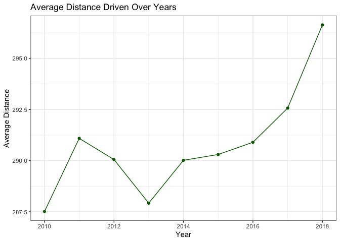<!-- -->
\
The following graph shows the average distance driven by all PGA players from 2010-2018. From this, we can conclude that the the trend of distance has been gradually increasing. This shows that players are starting to believe distance off the tee is becoming more crucial.
\


```r
stdv_distance <- pgatour %>% 
  dplyr::group_by(Year) %>% 
  dplyr::summarise(stdv = sd(`Avg Distance`, na.rm = TRUE))
```

```
## `summarise()` ungrouping output (override with `.groups` argument)
```

```r
stdv_distance_driven <- ggplot(data = stdv_distance, mapping = aes(x = Year, y = stdv)) +
  geom_point(color = 'dark green') +
  geom_path(color = 'dark green') +
  labs(title = 'Standard Deviation of Distance', y = 'Standard Deviation') +
  theme_bw()
stdv_distance_driven
```

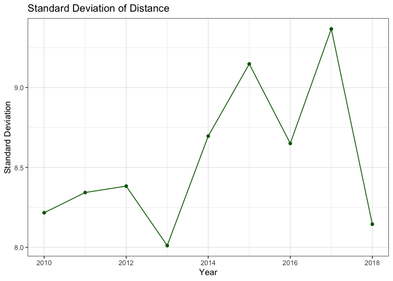<!-- -->
\
This graph shows the standard deviation between players in terms of driving distance. There isn't much to take from this graph other than it has been flucuating from year to year. From my knowledge, I would assume the flucuation is from a group PGA players beginning to hit the ball further in 2013. In 2017, players realized they needed to hit the ball further, so they made it their intension resulting in the standard deviation decreasing in 2018.
\
\

##### How Are These Trends Effecting Players?


```r
distance_vs_fwp <- ggplot(data = pgatour) +
  geom_smooth(mapping = aes(x = `Avg Distance`, y = `Fairway Percentage`), color = 'dark green') +
  labs(title = 'Distance Driven vs. Fairway Percentage', x = 'Distance Driven') +
  theme_bw()
distance_vs_fwp
```

```
## `geom_smooth()` using method = 'gam' and formula 'y ~ s(x, bs = "cs")'
```

```
## Warning: Removed 634 rows containing non-finite values (stat_smooth).
```

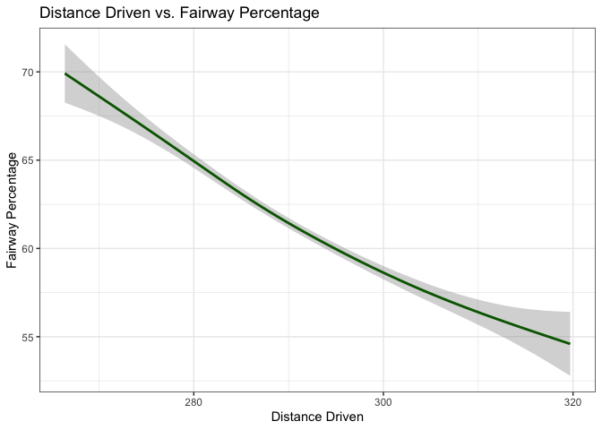<!-- -->
\
This graph shows that as players begin to hit the ball further, their fairway percentage decreases. This isn't surprising given the further a player hits it, the harder it is to control. To determine whether or not it is worth trying to hit the ball further, I will have to see if players greens in regulation have increased as well. First, I want to see how players strokes gained have increased with an increased driving distance.
\


```r
sg_ott <- pgatour %>% 
  select(`Player Name`, `Avg Distance`, `SG:OTT`)
names(sg_ott)[3] <- 'SG'
sg_ott$sg_type <- 'Off the tee'

sg_total <- pgatour %>% 
  select(`Player Name`, `Avg Distance`, `Average SG Total`)
names(sg_total)[3] <- 'SG'
sg_total$sg_type <- 'Total'


sg_ott_total <- bind_rows(sg_ott, sg_total)
sg_ott_total
```

```
## # A tibble: 4,624 x 4
##    `Player Name`   `Avg Distance`     SG sg_type    
##    <chr>                    <dbl>  <dbl> <chr>      
##  1 Henrik Stenson            292.  0.427 Off the tee
##  2 Ryan Armour               284. -0.012 Off the tee
##  3 Chez Reavie               286.  0.183 Off the tee
##  4 Ryan Moore                289.  0.406 Off the tee
##  5 Brian Stuard              279. -0.227 Off the tee
##  6 Brian Gay                 283. -0.166 Off the tee
##  7 Kyle Stanley              296.  0.378 Off the tee
##  8 Emiliano Grillo           295.  0.364 Off the tee
##  9 Russell Henley            293   0.093 Off the tee
## 10 Jim Furyk                 280. -0.392 Off the tee
## # … with 4,614 more rows
```

```r
sg_vs_distdriven <- ggplot(data = sg_ott_total) +
  geom_smooth(mapping = aes(x = `Avg Distance`, y = SG, color = sg_type)) +
  labs(title = 'Strokes Gained vs. Distance Driven', x = 'Distance Driven', y = 'Strokes Gained', color = 'SG Type') +
  theme_bw()

sg_vs_distdriven
```

```
## `geom_smooth()` using method = 'gam' and formula 'y ~ s(x, bs = "cs")'
```

```
## Warning: Removed 1268 rows containing non-finite values (stat_smooth).
```

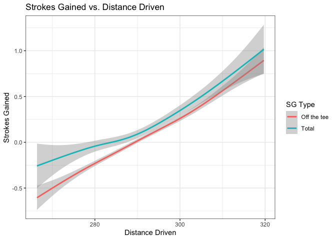<!-- -->
\

This graph proves that having a longer driving average increases a player's strokes gained in terms of off the tee and overall. This data shows that the further a person is going to hit the ball, the better chance they have of decreasing their scores.
\
\

It is fair to assume that the closer a player drives the ball to the green, the easier it is to hit the green in regulation. Below shows the data on if that is true.


```r
distance_vs_gir <- ggplot(pgatour) +
  geom_smooth(mapping = aes(x = `Avg Distance`, y = gir), color = 'dark green') +
  labs(title = 'Distance Driven vs. Greens in Reg.', x = 'Distance Driven', y = 'GIR') +
  theme_bw()
distance_vs_gir
```

```
## `geom_smooth()` using method = 'gam' and formula 'y ~ s(x, bs = "cs")'
```

```
## Warning: Removed 634 rows containing non-finite values (stat_smooth).
```

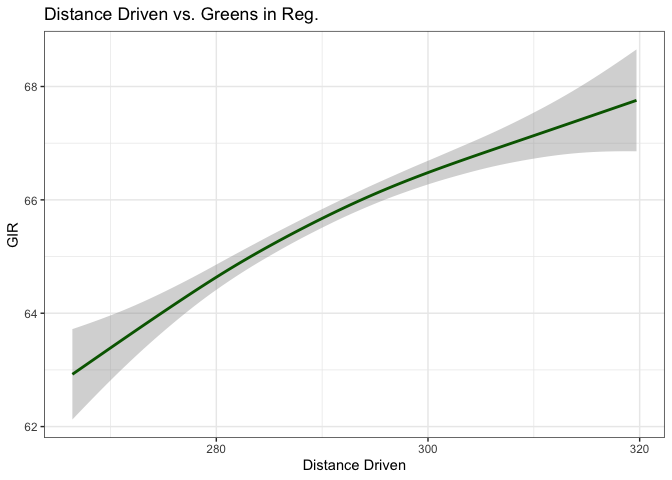<!-- -->
\

This proves again that hitting the ball further gives the player an advantage in terms of getting to the green in regulation.
\
\

&nbsp;&nbsp;&nbsp;&nbsp;&nbsp;&nbsp; &nbsp; So, this data has determined that it is in the player's best interest to hit the ball as far as they can because the further they hit off the tee, the better chances they have of gaining strokes on the rest of the field. Most people would think that as a golfer gains length off the tee, they will lose their short-game and touch around the green. I'm going to see if that is true or just a common misconseption.
\
\
\

#### Short-Game
\


```r
scram_perc <- pgatour %>% 
  dplyr::group_by(Year) %>% 
  dplyr::summarise(scram_year = mean(`Average Scrambling`, na.rm = TRUE))
```

```
## `summarise()` ungrouping output (override with `.groups` argument)
```

```r
scram_perc <- ggplot(data = scram_perc) +
  geom_point(mapping = aes(x = Year, y = scram_year), color = 'dark green') +
  geom_path(mapping = aes(x = Year, y = scram_year), color = 'dark green') +
  labs(title = 'Average Scrambling Percentage', y = 'Percent') +
  theme_bw()
scram_perc
```

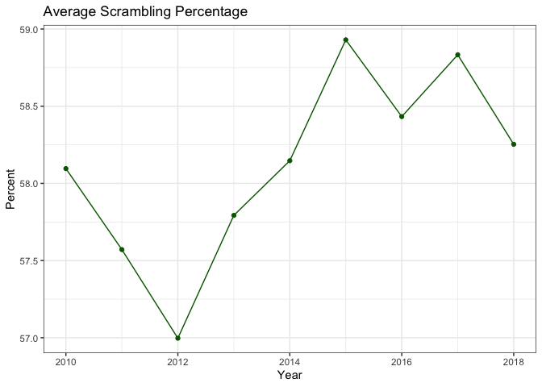<!-- -->
\

Above shows the average scrambling percentage for the players by year. At first glance, this may look like it has flucuated a lot, but in reality it stays between 57-59% every year. This points to that the overall trend of hitting the ball further hasn't effected the play around the green.
\


```r
distance_vs_scram <- ggplot(data = pgatour) +
  geom_smooth(mapping = aes(x = `Avg Distance`, y = `Average Scrambling`), color = 'dark green') +
  labs(title = "Distance vs. Scrambling") +
  theme_bw()
distance_vs_scram
```

```
## `geom_smooth()` using method = 'gam' and formula 'y ~ s(x, bs = "cs")'
```

```
## Warning: Removed 634 rows containing non-finite values (stat_smooth).
```

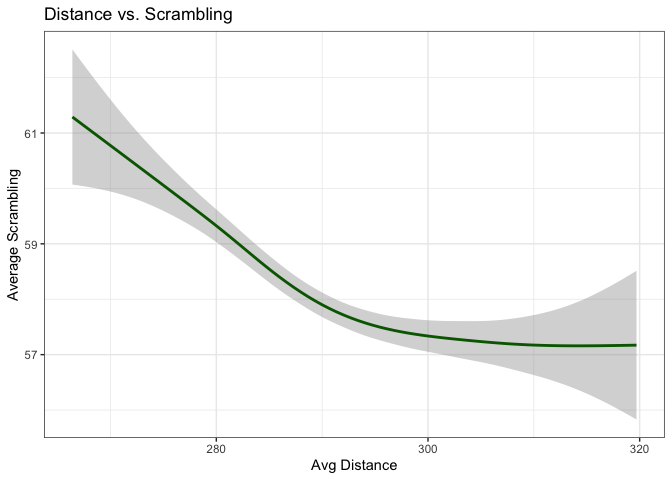<!-- -->

```r
distance_vs_sgarg <- ggplot(data = pgatour) +
  geom_smooth(mapping = aes(x = `Avg Distance`, y = `SG:ARG`), color = 'dark green') +
  labs(title = "Distance vs. SG:ARG") +
  theme_bw()
distance_vs_sgarg
```

```
## `geom_smooth()` using method = 'gam' and formula 'y ~ s(x, bs = "cs")'
```

```
## Warning: Removed 634 rows containing non-finite values (stat_smooth).
```

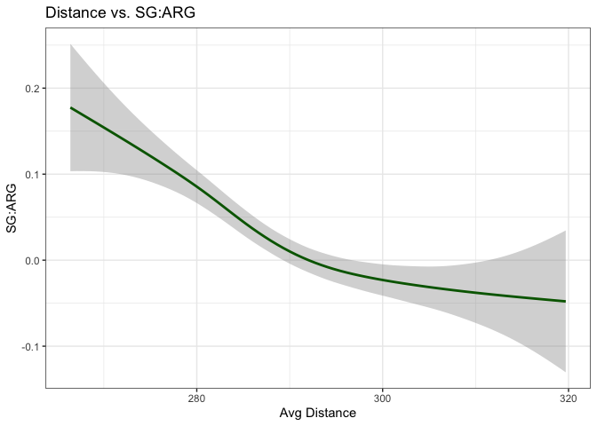<!-- -->
\

The two graphs above show much of the same thing. That as players hit the ball further, their ability to scramble around the green tends to get worse, but is it worth it? My answer to this based off this data is yes because in both of the graphs the y-axis doesn't decrease a significant amount. There isn't enough of a major drop off in order to not want to hit the ball as far as possible.
\

Below is a graph that shows the average amount of putts per year. A good PGA player should be averaging around 27-29 putts per round.
\


```r
putts <- pgatour %>% 
  dplyr::group_by(Year) %>% 
  dplyr::summarise(avg_putts = mean(`Average Putts`, na.rm = TRUE))
```

```
## `summarise()` ungrouping output (override with `.groups` argument)
```

```r
average_putts <- ggplot(data = putts, mapping = aes(x = Year, y = avg_putts)) +
  geom_point(color = 'dark green') +
  geom_path(color = 'dark green') +
  labs(title = 'Average Putts per Year', y = "Putts") +
  theme_bw()
average_putts
```

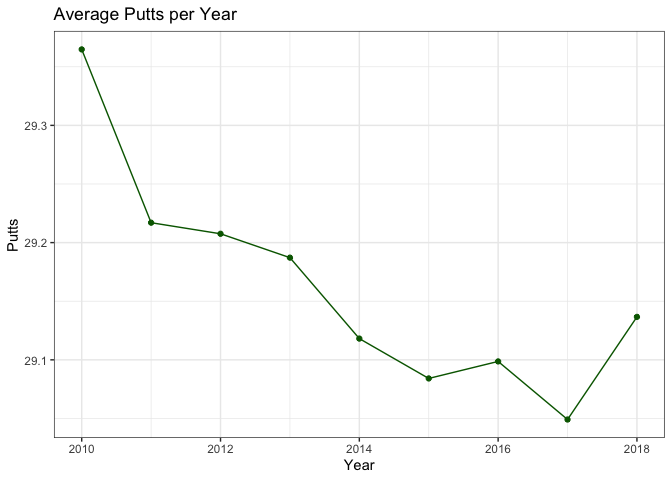<!-- -->
\

This graph shows that players putting has been extremely consistant throughout the years only waivering by no more than 0.3 putts. This shows the overall trend of putting, but I want to see how the players are putting when they are hitting the ball the furthest.
\


```r
distance_vs_putts <- ggplot(data = pgatour) +
  geom_smooth(mapping = aes(x = `Avg Distance`, y = `Average Putts`), color = 'dark green') +
  labs(title = 'Distance vs. Putts') +
  theme_bw()
distance_vs_putts
```

```
## `geom_smooth()` using method = 'gam' and formula 'y ~ s(x, bs = "cs")'
```

```
## Warning: Removed 634 rows containing non-finite values (stat_smooth).
```

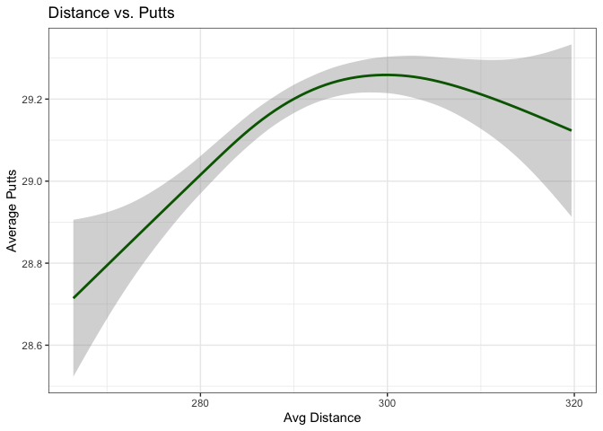<!-- -->
\

The data above indicates that as you hit the ball further putting with generally increase, although not by a significant amount. What is interesting is that the trend decreases in putting for the players hitting the ball the furthest indicating that just becasue a player may hit the ball the furthest, doesn't mean they don't have touch on the greens.
\

#### Winners
\


```r
sapply(pgatour, typeof)
```

```
##        Player Name             Rounds Fairway Percentage               Year 
##        "character"           "double"           "double"           "double" 
##       Avg Distance                gir      Average Putts Average Scrambling 
##           "double"           "double"           "double"           "double" 
##      Average Score             Points               Wins             Top 10 
##           "double"           "double"           "double"           "double" 
##   Average SG Putts   Average SG Total             SG:OTT             SG:APR 
##           "double"           "double"           "double"           "double" 
##             SG:ARG              Money 
##           "double"        "character"
```

```r
earnings <- pgatour %>% 
  dplyr::group_by(`Player Name`) %>% 
  dplyr::filter(Money > 0)


no_comma_earnings <- gsub(",", "", earnings$Money)
earnings$player_earnings <- no_comma_earnings


sapply(earnings, typeof)
```

```
##        Player Name             Rounds Fairway Percentage               Year 
##        "character"           "double"           "double"           "double" 
##       Avg Distance                gir      Average Putts Average Scrambling 
##           "double"           "double"           "double"           "double" 
##      Average Score             Points               Wins             Top 10 
##           "double"           "double"           "double"           "double" 
##   Average SG Putts   Average SG Total             SG:OTT             SG:APR 
##           "double"           "double"           "double"           "double" 
##             SG:ARG              Money    player_earnings 
##           "double"        "character"        "character"
```

```r
earnings$player_earnings <- as.numeric(earnings$player_earnings)
sapply(earnings, typeof)
```

```
##        Player Name             Rounds Fairway Percentage               Year 
##        "character"           "double"           "double"           "double" 
##       Avg Distance                gir      Average Putts Average Scrambling 
##           "double"           "double"           "double"           "double" 
##      Average Score             Points               Wins             Top 10 
##           "double"           "double"           "double"           "double" 
##   Average SG Putts   Average SG Total             SG:OTT             SG:APR 
##           "double"           "double"           "double"           "double" 
##             SG:ARG              Money    player_earnings 
##           "double"        "character"           "double"
```

```r
earnings <- earnings %>% 
  select(-Money)
```
\

Above is the code I used in order to tidy my data so that I could manipulate the Money column in the original dataset.
\


```r
earnings <- earnings %>% 
  arrange(desc(player_earnings))

earnings
```

```
## # A tibble: 248 x 18
## # Groups:   Player Name [248]
##    `Player Name` Rounds `Fairway Percen…  Year `Avg Distance`   gir
##    <chr>          <dbl>            <dbl> <dbl>          <dbl> <dbl>
##  1 Matt Kuchar       97             67.9  2010           287.  69.4
##  2 Jim Furyk         76             71.0  2010           276   67.1
##  3 Ernie Els         72             60.2  2010           288.  67.9
##  4 Dustin Johns…     83             56.4  2010           308.  68.0
##  5 Steve Strick…     73             68.5  2010           283.  68.3
##  6 Phil Mickels…     76             52.7  2010           299.  65.1
##  7 Luke Donald       71             62.4  2010           277   65.3
##  8 Paul Casey        64             61.3  2010           294.  68.7
##  9 Justin Rose       78             65.2  2010           288.  66.3
## 10 Hunter Mahan      85             67.9  2010           292.  68.6
## # … with 238 more rows, and 12 more variables: `Average Putts` <dbl>, `Average
## #   Scrambling` <dbl>, `Average Score` <dbl>, Points <dbl>, Wins <dbl>, `Top
## #   10` <dbl>, `Average SG Putts` <dbl>, `Average SG Total` <dbl>,
## #   `SG:OTT` <dbl>, `SG:APR` <dbl>, `SG:ARG` <dbl>, player_earnings <dbl>
```

```r
earnings$ranking <- rank(-earnings$player_earnings)
earnings
```

```
## # A tibble: 248 x 19
## # Groups:   Player Name [248]
##    `Player Name` Rounds `Fairway Percen…  Year `Avg Distance`   gir
##    <chr>          <dbl>            <dbl> <dbl>          <dbl> <dbl>
##  1 Matt Kuchar       97             67.9  2010           287.  69.4
##  2 Jim Furyk         76             71.0  2010           276   67.1
##  3 Ernie Els         72             60.2  2010           288.  67.9
##  4 Dustin Johns…     83             56.4  2010           308.  68.0
##  5 Steve Strick…     73             68.5  2010           283.  68.3
##  6 Phil Mickels…     76             52.7  2010           299.  65.1
##  7 Luke Donald       71             62.4  2010           277   65.3
##  8 Paul Casey        64             61.3  2010           294.  68.7
##  9 Justin Rose       78             65.2  2010           288.  66.3
## 10 Hunter Mahan      85             67.9  2010           292.  68.6
## # … with 238 more rows, and 13 more variables: `Average Putts` <dbl>, `Average
## #   Scrambling` <dbl>, `Average Score` <dbl>, Points <dbl>, Wins <dbl>, `Top
## #   10` <dbl>, `Average SG Putts` <dbl>, `Average SG Total` <dbl>,
## #   `SG:OTT` <dbl>, `SG:APR` <dbl>, `SG:ARG` <dbl>, player_earnings <dbl>,
## #   ranking <dbl>
```

```r
top25 <- nrow(earnings)*0.25


top25_perc <- earnings %>% 
  filter(ranking <= top25)

bottom25perc <- earnings %>% 
  filter(ranking >= top25)

bottom25perc$Category <- 'Rest of the Field'
top25_perc$Category <- 'Top 25%'

together <- bind_rows(top25_perc, bottom25perc)

together
```

```
## # A tibble: 249 x 20
## # Groups:   Player Name [248]
##    `Player Name` Rounds `Fairway Percen…  Year `Avg Distance`   gir
##    <chr>          <dbl>            <dbl> <dbl>          <dbl> <dbl>
##  1 Matt Kuchar       97             67.9  2010           287.  69.4
##  2 Jim Furyk         76             71.0  2010           276   67.1
##  3 Ernie Els         72             60.2  2010           288.  67.9
##  4 Dustin Johns…     83             56.4  2010           308.  68.0
##  5 Steve Strick…     73             68.5  2010           283.  68.3
##  6 Phil Mickels…     76             52.7  2010           299.  65.1
##  7 Luke Donald       71             62.4  2010           277   65.3
##  8 Paul Casey        64             61.3  2010           294.  68.7
##  9 Justin Rose       78             65.2  2010           288.  66.3
## 10 Hunter Mahan      85             67.9  2010           292.  68.6
## # … with 239 more rows, and 14 more variables: `Average Putts` <dbl>, `Average
## #   Scrambling` <dbl>, `Average Score` <dbl>, Points <dbl>, Wins <dbl>, `Top
## #   10` <dbl>, `Average SG Putts` <dbl>, `Average SG Total` <dbl>,
## #   `SG:OTT` <dbl>, `SG:APR` <dbl>, `SG:ARG` <dbl>, player_earnings <dbl>,
## #   ranking <dbl>, Category <chr>
```

```r
earnings1 <- ggplot(data = together) +
  geom_col(mapping = aes(x = order(desc(Category)), y = player_earnings, fill = Category, color = Category)) +
  scale_y_continuous(labels = scales::dollar_format()) +
  labs(title = 'Top 25% Earnings', y = 'Money') +
  theme_bw() +
  theme(axis.title.x = element_blank(),
        axis.text.x = element_blank(),
        axis.ticks.x = element_blank())
earnings1
```

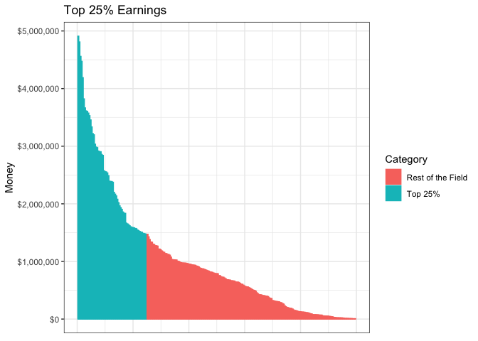<!-- -->

```r
earnings2 <- ggplot(data = together) +
  geom_col(mapping = aes(x = Category, y = player_earnings, fill = Category, color = Category)) +
  scale_y_continuous(labels = scales::dollar_format()) +
  labs(title = 'Top 25% Earnings', y = 'Money') +
  theme_bw()
earnings2
```

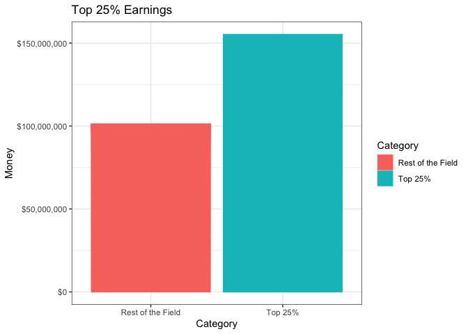<!-- -->
\

The graphs above display how being in the top 25% of players on the PGA Tour pays off. The top 25% consists of 62 players while the rest of the field is composed of 187 players. The point of these graphs is to show that in order to be successful on tour, a player needs to consistantly finish well. I'm going to compare the winners statistics versus the whole population to see if the way the game is trending is because of how the winners are performing.
\
\

#### Comparing Winners to General Population


```r
top25_names <- top25_perc$`Player Name`

bottom25_names <- bottom25perc$`Player Name`

top25_all <- pgatour %>% 
  filter(`Player Name` %in% top25_names)

bottom25_all <- pgatour %>% 
  filter(`Player Name` %in% bottom25_names)

top25_all$Category <- 'Top 25%'
bottom25_all$Category <- 'Rest of Field'

pga_df_distributed <- bind_rows(top25_all, bottom25_all)
```
\

Code used to create a data frame that differentiated the winners from the rest of the field.
\


```r
avg_driving_compared <- pga_df_distributed %>% 
  dplyr::group_by(Year, Category) %>% 
  dplyr::summarise(avg_distance = mean(`Avg Distance`, na.rm = TRUE))
```

```
## `summarise()` regrouping output by 'Year' (override with `.groups` argument)
```

```r
winners_vs_field_distance <- ggplot(data = avg_driving_compared) +
  geom_point(mapping = aes(x = Year, y = avg_distance, color = Category)) +
  geom_path(mapping = aes(x = Year, y = avg_distance, color = Category)) +
  labs(title = 'Winners vs. Field - Distance', y = 'Distance') +
  theme_bw()
winners_vs_field_distance
```

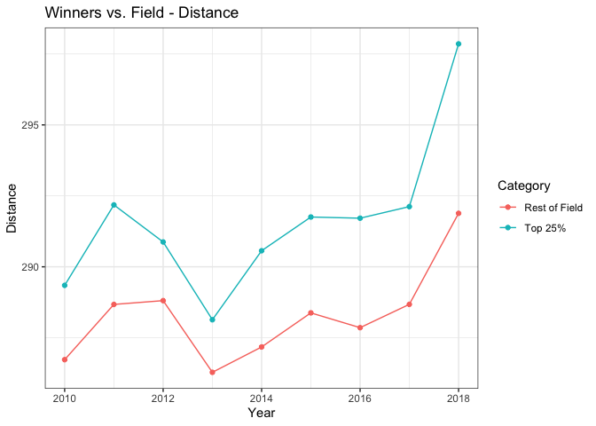<!-- -->
\


```r
distance_v_scram_winners <- ggplot(data = pga_df_distributed) +
  geom_smooth(mapping = aes(x = `Avg Distance`, y = `Average Scrambling`, color = Category)) +
  labs(title = 'Winner vs. Field - Distance vs. Scrambling') +
  theme_bw()
distance_v_scram_winners
```

```
## `geom_smooth()` using method = 'loess' and formula 'y ~ x'
```

```
## Warning: Removed 471 rows containing non-finite values (stat_smooth).
```

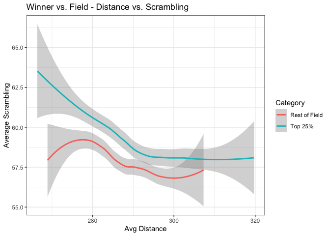<!-- -->
\


```r
scram_perc_winners <- pga_df_distributed %>% 
  dplyr::group_by(Year, Category) %>% 
  dplyr::summarise(avg_scram = mean(`Average Scrambling`, na.rm = TRUE))
```

```
## `summarise()` regrouping output by 'Year' (override with `.groups` argument)
```

```r
scram_perc_winners_graph <- ggplot(data = scram_perc_winners, mapping = aes(x = Year, y = avg_scram, color = Category)) +
  geom_point() +
  geom_path() +
  labs(title = 'Average Scrambling - Winners vs. Field', y = 'Scrambling Percentage') +
  theme_bw()
scram_perc_winners_graph
```

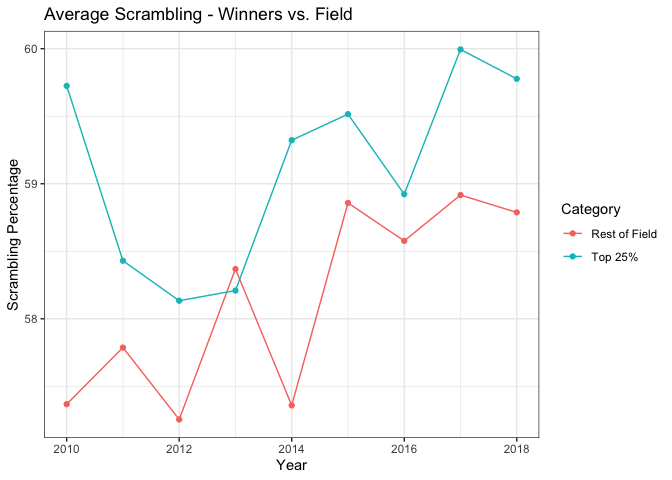<!-- -->
\

These three graphs show that the winners are always slightly better than the rest of the field in every category, with exception of scrambling percentage in the year 2013. The winners excel the greatest in total distance driven on average throughout the years. This is where they seperate themselves from the rest of the field the greatest amount. We can conclude that the winners are at the top of the modern day trends that we are seeing in golf.
\
\

## Closing Statements

&nbsp;&nbsp;&nbsp;&nbsp;&nbsp;&nbsp; &nbsp; Through this analysis, I have distinguished the trends that have been happening in the game of golf over the past decade, and also debunked some common assumptions. The trends in modern golf is that players are hitting the ball further than they have ever before. Why are they doing this? There are many possible answerrs. Players coming into the PGA are younger with proper strength and conditioning prior which hasn't been done before. Another possible explanation is that techonology in the golf clubs has advanced so much that even the average player can hit the ball expotentially further. Regardless of how it is happening, players hitting their drive further is changing the game of golf.

&nbsp;&nbsp;&nbsp;&nbsp;&nbsp;&nbsp; &nbsp; People have the notion that the players that can hit the ball the furthest are going to struggle the most around the greens, resulting in the losing strokes. This has proven to be not true through my analysis in short-game. Another reason people wouldn't want to hit it as far as they can is because of missing the fairway. The truth is that a player should want to be as close to the green as possible regardless of being in the fairway or not. This is becuase the closer they are to the green, the greater the chances are of them hitting the green in regulation, which results in more birdie oppurtunities.

&nbsp;&nbsp;&nbsp;&nbsp;&nbsp;&nbsp; &nbsp; I wouldn't recommend this strategy to the average everyday golfer. This style of golf works for the men on the PGA Tour because they already have amazing short-games or else they wouldn't be on Tour in the first place. The risk to reward ratio for them is much greater than it is for the everyday golfer because of their ability around the greens. I beleive the future of golf is going to continue to go in this trend of players wanting to hit the ball further, and will see player's transform their body's and playing styles around it. 


